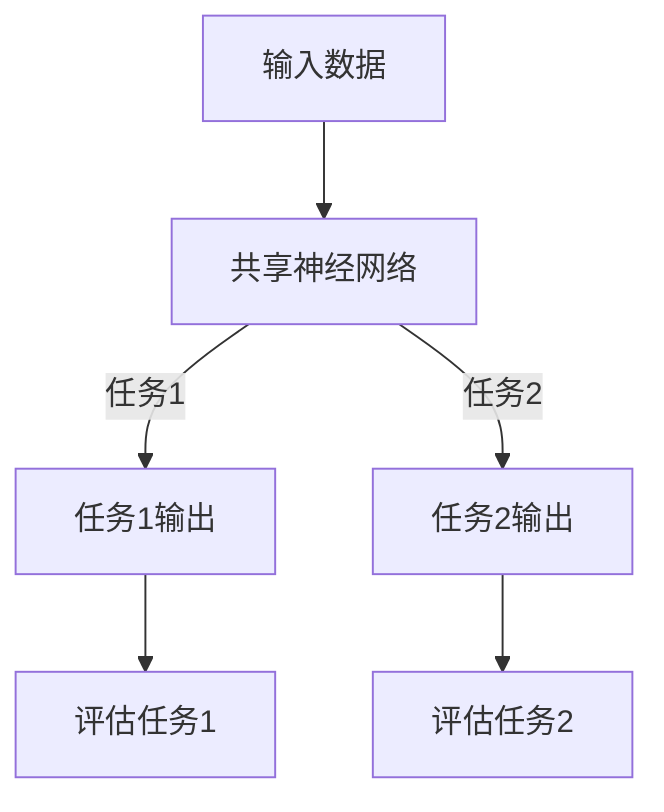
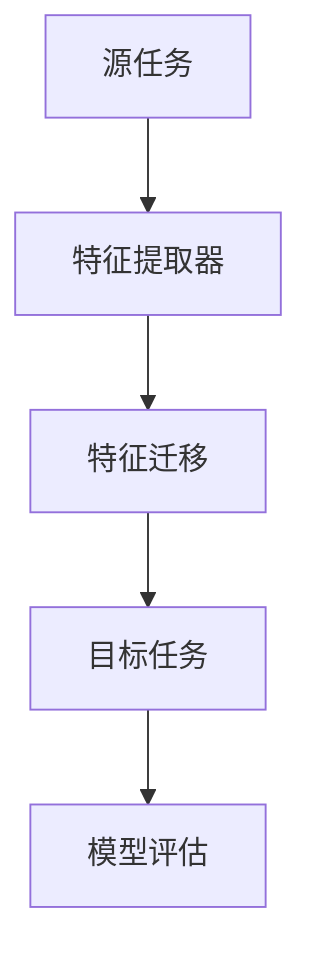
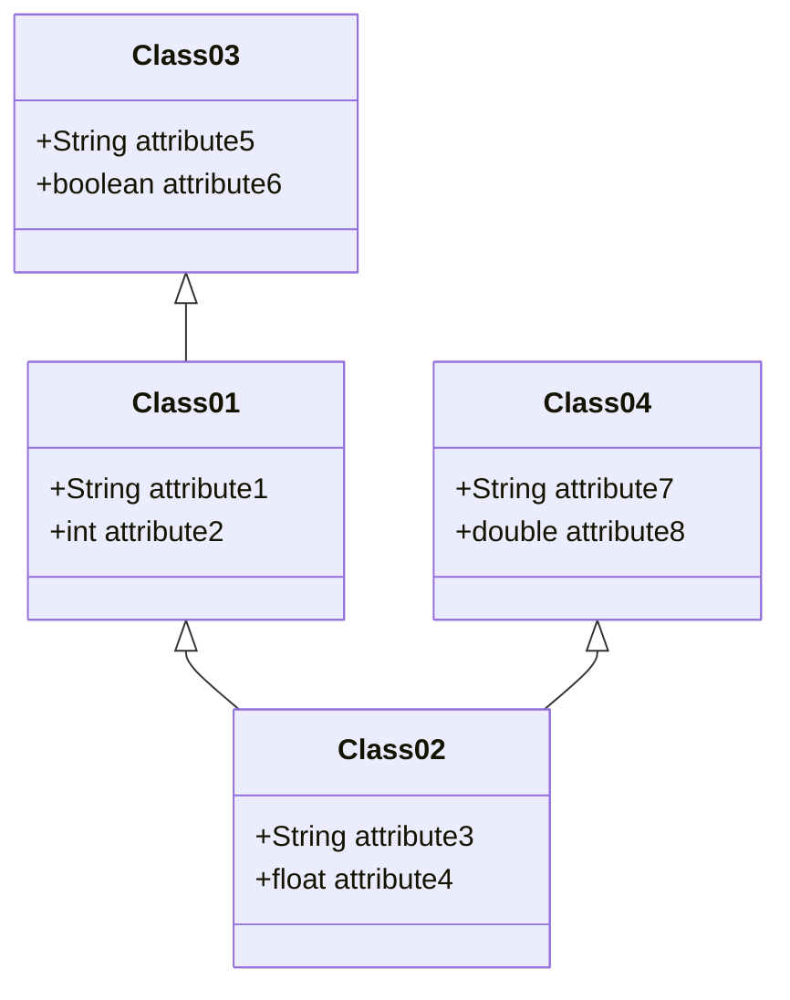
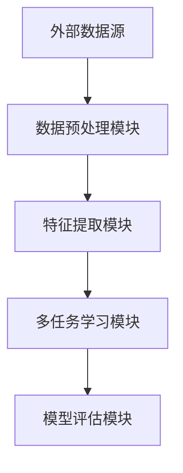
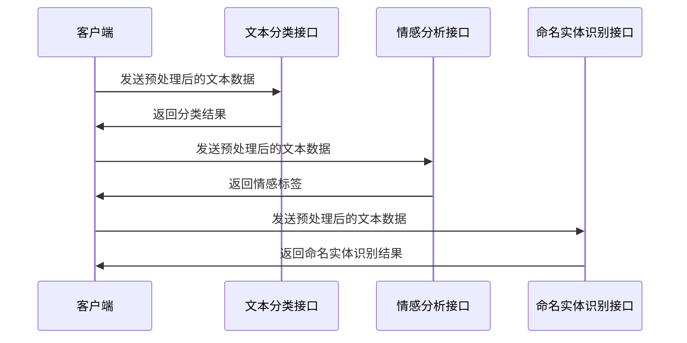

                 

# AGI的多任务学习与迁移能力

## 关键词

- 人工智能（AI）
- 多任务学习（MTL）
- 迁移学习（TL）
- 强化学习（RL）
- 深度学习（DL）
- 自然语言处理（NLP）

## 摘要

本文将深入探讨人工智能（AGI）的多任务学习与迁移能力。首先，我们将概述AGI与多任务学习的概念和背景，随后详细解析多任务学习的理论基础和算法原理。接着，我们将介绍迁移学习的概念、优势及其在多任务学习中的应用。通过实例分析，我们将展示如何将多任务学习与迁移能力应用于实际项目。最后，我们将总结多任务学习与迁移能力的最佳实践，并提供未来的发展趋势展望。

## 第一部分: AGI与多任务学习

### 第1章: AGI与多任务学习

#### 1.1 问题背景

**问题提出**  
人工智能（AI）的发展目标是实现通用人工智能（AGI），即具有人类智能水平的智能系统。然而，当前大多数AI系统是单任务智能系统，它们在特定领域内表现优异，但无法进行跨领域的任务学习。多任务学习（MTL）是解决这一问题的关键，它使AI系统能够同时处理多个相关任务，提高其泛化和适应性。

**问题解决**  
多任务学习通过共享表示和知识，使得AI系统在处理不同任务时能够利用已有的知识和经验，从而提高学习效率和性能。此外，迁移学习（TL）作为一种强大的辅助技术，能够将一个任务中学习的知识迁移到其他相关任务中，进一步增强了多任务学习的能力。

**边界与外延**  
多任务学习不仅涉及技术层面的实现，还包括方法论、算法选择和系统设计等多个方面。它要求AI系统能够在多个任务之间共享信息，同时保持各个任务的独特性和独立性。

### 1.2 AGI的概念与特点

**AGI的定义**  
AGI是指具有与人类智能相似水平的智能系统，能够理解、学习和应用广泛的知识，处理各种复杂的任务。

**AGI的核心特点**  
- **通用性**：能够处理各种类型的任务，而不仅仅是特定领域内的任务。
- **自主性**：能够自主地决策和行动，不需要人类的直接指导。
- **适应能力**：能够在不同的环境和条件下自主适应和学习。

**与其他AI技术的区别**  
传统AI技术主要关注特定任务的自动化，而AGI则追求更加广泛和复杂的应用场景。AGI需要具备多任务学习、迁移学习和强化学习等多种能力，以实现更高的智能水平。

### 1.3 多任务学习的概念与优势

**多任务学习的定义**  
多任务学习是一种机器学习技术，它使AI系统能够同时学习并处理多个相关任务，而不是单独地处理每个任务。

**多任务学习的优势**  
- **资源共享**：通过共享表示和知识，减少冗余，提高学习效率。
- **知识迁移**：将一个任务中学习的知识迁移到其他相关任务中，提高跨领域适应性。
- **性能提升**：多任务学习能够利用多个任务之间的关联性，提高整体性能。

**与单任务学习的比较**  
单任务学习在每个任务上单独训练模型，而多任务学习通过共享表示和知识，使得多个任务之间可以相互促进，从而提高整体性能。

### 1.4 多任务学习在AGI中的应用前景

**多任务学习在AGI中的作用**  
多任务学习是AGI的重要组成部分，它使AI系统能够在多个任务之间共享知识和资源，提高整体智能水平。

**应用领域与挑战**  
多任务学习在自动驾驶、自然语言处理、医疗诊断等众多领域具有广泛的应用前景。然而，多任务学习也面临着数据不均衡、任务冲突、模型选择等挑战。

**发展趋势**  
随着深度学习和强化学习技术的不断发展，多任务学习将在AGI中发挥越来越重要的作用，成为实现通用人工智能的关键技术之一。

## 第二部分: 多任务学习的理论基础

### 第2章: 多任务学习的理论基础

#### 2.1 概念解析

**多任务学习的基本概念**  
多任务学习是指同时学习并处理多个相关任务的学习方法。它通过共享表示和知识，提高学习效率和性能。

**概念属性特征对比表格**

| 概念          | 特征            | 说明                                                         |
|---------------|-----------------|--------------------------------------------------------------|
| 单任务学习    | 单独模型        | 每个任务训练独立模型                                         |
| 多任务学习    | 共享表示        | 多个任务共享表示和知识                                       |
| 迁移学习      | 知识迁移        | 将一个任务的知识迁移到其他相关任务中                           |
| 强化学习      | 自主决策        | 基于环境和奖励进行自主决策                                   |
| 深度学习      | 神经网络        | 使用多层神经网络进行数据处理和学习                             |

#### 2.2 多任务学习算法原理

**算法原理讲解**  
多任务学习算法通过共享表示和知识，使得多个任务之间可以相互促进。具体来说，它将多个任务的输入和输出通过共享神经网络进行处理，从而实现任务间的关联和共享。

**Mermaid流程图**



**Python源代码演示**

```python
import tensorflow as tf
from tensorflow.keras.layers import Input, Dense
from tensorflow.keras.models import Model

# 定义输入层
input_layer = Input(shape=(784,))

# 定义共享神经网络
shared_dense = Dense(units=256, activation='relu')(input_layer)

# 定义任务1和任务2的输出层
task1_output = Dense(units=10, activation='softmax', name='task1_output')(shared_dense)
task2_output = Dense(units=10, activation='softmax', name='task2_output')(shared_dense)

# 创建多任务模型
model = Model(inputs=input_layer, outputs=[task1_output, task2_output])

# 编译模型
model.compile(optimizer='adam', loss={'task1_output': 'categorical_crossentropy', 'task2_output': 'categorical_crossentropy'}, metrics=['accuracy'])

# 模型训练
model.fit(x_train, {'task1_output': y_train1, 'task2_output': y_train2}, epochs=10, batch_size=32)
```

#### 2.3 数学模型与公式

**数学模型概述**  
多任务学习通常使用共享神经网络模型，该模型包含一个共享的隐藏层和多个任务特定的输出层。

**公式讲解与推导**  
设 $X$ 为输入数据矩阵，$W$ 为共享神经网络的权重矩阵，$b$ 为偏置向量，$h$ 为隐藏层激活值，$y$ 为输出标签。

共享神经网络模型可以表示为：
$$
h = \sigma(WX + b)
$$

其中，$\sigma$ 表示激活函数，如ReLU函数。

任务特定的输出层可以表示为：
$$
y_i = \sigma(W_ih + b_i)
$$

其中，$W_i$ 和 $b_i$ 分别为任务 $i$ 的权重矩阵和偏置向量。

**示例说明**  
假设有两个任务，任务1和任务2。共享神经网络模型如下：

$$
h = \sigma(WX + b)
$$

任务1的输出：
$$
y_1 = \sigma(W_1h + b_1)
$$

任务2的输出：
$$
y_2 = \sigma(W_2h + b_2)
$$

通过共享神经网络，任务1和任务2可以共享隐藏层的信息，从而提高学习效率和性能。

#### 2.4 案例分析

**典型案例**  
在自然语言处理领域，多任务学习被广泛应用于文本分类任务。例如，在一个新闻分类系统中，多任务学习可以同时处理标题分类、正文分类和情感分析任务。

**详细讲解与剖析**  
在一个新闻分类系统中，输入数据为新闻文本，输出数据为新闻类别和情感标签。多任务学习模型如下：

1. 输入层：接收新闻文本，进行预处理。
2. 共享神经网络：使用嵌入层和卷积神经网络（CNN）提取特征。
3. 任务1：标题分类，输出为标题类别标签。
4. 任务2：正文分类，输出为正文类别标签。
5. 任务3：情感分析，输出为情感标签。

通过多任务学习，模型可以同时学习并处理标题分类、正文分类和情感分析任务，提高整体性能。

## 第三部分: 迁移学习与多任务学习

### 第3章: 迁移学习与多任务学习

#### 3.1 迁移学习的概念与优势

**迁移学习的定义**  
迁移学习是指将一个任务中学习的知识迁移到其他相关任务中的学习方法。它通过利用已有知识，提高新任务的性能。

**迁移学习的优势**  
- **知识共享**：通过迁移学习，可以将一个任务中学习的知识应用到其他相关任务中，提高整体性能。
- **学习效率**：迁移学习可以减少对新任务的数据需求，提高学习效率。
- **泛化能力**：迁移学习可以提高模型的泛化能力，使其在不同任务中表现更稳定。

**与传统学习方法的区别**  
传统学习方法通常在每个任务上单独训练模型，而迁移学习通过利用已有知识，减少对新任务的数据需求，从而提高学习效率和性能。

#### 3.2 迁移学习算法原理

**算法原理讲解**  
迁移学习算法通常分为基于特征迁移和基于模型迁移两种类型。基于特征迁移方法将一个任务中的特征迁移到其他任务中，而基于模型迁移方法将一个任务中的模型直接迁移到其他任务中。

**Mermaid流程图**



**Python源代码演示**

```python
import tensorflow as tf
from tensorflow.keras.layers import Input, Dense
from tensorflow.keras.models import Model

# 定义源任务模型
input_layer = Input(shape=(784,))
hidden_layer = Dense(units=256, activation='relu')(input_layer)
output_layer = Dense(units=10, activation='softmax')(hidden_layer)
model_source = Model(inputs=input_layer, outputs=output_layer)

# 定义目标任务模型
input_layer = Input(shape=(784,))
hidden_layer = Dense(units=256, activation='relu')(input_layer)
output_layer = Dense(units=10, activation='softmax')(hidden_layer)
model_target = Model(inputs=input_layer, outputs=output_layer)

# 特征提取器
feature_extractor = Model(inputs=model_source.input, outputs=model_source.layers[-2].output)

# 特征迁移
features = feature_extractor.predict(x_source)
model_target.fit(x_target, y_target, epochs=10, batch_size=32)

# 模型评估
loss, accuracy = model_target.evaluate(x_target, y_target)
print(f"Loss: {loss}, Accuracy: {accuracy}")
```

#### 3.3 数学模型与公式

**数学模型概述**  
迁移学习算法的核心是特征提取器，它用于从一个任务中提取特征，并将其迁移到其他任务中。特征提取器通常是一个简单的神经网络，其输出为特征向量。

**公式讲解与推导**  
设 $X$ 为输入数据矩阵，$W$ 为特征提取器的权重矩阵，$b$ 为偏置向量，$f$ 为特征提取器函数。

特征提取器可以表示为：
$$
f(X) = \sigma(WX + b)
$$

其中，$\sigma$ 表示激活函数，如ReLU函数。

目标任务的模型可以表示为：
$$
y = \sigma(W'f(X) + b')
$$

其中，$W'$ 和 $b'$ 分别为目标任务的权重矩阵和偏置向量。

**示例说明**  
假设有一个源任务和一个目标任务，特征提取器模型如下：

$$
f(X) = \sigma(WX + b)
$$

目标任务的输出：
$$
y = \sigma(W'f(X) + b')
$$

通过特征提取器，源任务的特征被提取并迁移到目标任务中，从而实现知识共享和性能提升。

#### 3.4 迁移学习在多任务学习中的应用

**应用案例分析**  
在图像识别领域，迁移学习被广泛应用于多任务学习。例如，在一个包含多个类别（如动物、植物、交通工具等）的图像识别任务中，可以使用预训练的图像识别模型（如ResNet）作为特征提取器，提取图像特征，并将其迁移到不同的类别识别任务中。

**详细讲解与剖析**  
在一个包含多个类别的图像识别任务中，多任务学习模型如下：

1. 输入层：接收图像数据，进行预处理。
2. 特征提取器：使用预训练的图像识别模型（如ResNet）提取图像特征。
3. 多个任务特定的输出层：每个类别识别任务输出为一个类别标签。

通过迁移学习，预训练的图像识别模型可以提取图像特征，并将其迁移到不同的类别识别任务中，提高整体性能。

## 第四部分: AGI的多任务学习与迁移能力实例分析

### 第4章: AGI的多任务学习与迁移能力实例分析

#### 4.1 项目介绍

**项目概述**  
本项目是一个基于自然语言处理的多任务学习与迁移学习项目，旨在同时处理文本分类、情感分析和命名实体识别任务。

**项目目标**  
- 同时处理文本分类、情感分析和命名实体识别任务。
- 利用迁移学习提高模型性能。
- 实现高效的知识共享和模型优化。

**项目背景**  
随着互联网和社交媒体的快速发展，文本数据量呈现爆炸式增长。为了更好地理解和处理这些文本数据，多任务学习和迁移学习技术被广泛应用于自然语言处理领域。

#### 4.2 系统功能设计

**领域模型Mermaid类图**



**系统功能模块设计**  
- 数据预处理模块：负责文本数据的清洗、分词、去停用词等预处理操作。
- 特征提取模块：使用预训练的图像识别模型（如ResNet）提取图像特征。
- 多任务学习模块：同时处理文本分类、情感分析和命名实体识别任务。
- 模型评估模块：评估模型在文本分类、情感分析和命名实体识别任务上的性能。

#### 4.3 系统架构设计

**系统架构Mermaid架构图**



**系统模块间交互设计**  
1. 数据预处理模块接收外部数据源提供的文本数据，进行清洗、分词、去停用词等预处理操作，生成预处理后的文本数据。
2. 特征提取模块使用预训练的图像识别模型（如ResNet）提取图像特征，并将其传递给多任务学习模块。
3. 多任务学习模块同时处理文本分类、情感分析和命名实体识别任务，生成任务输出。
4. 模型评估模块对多任务学习模块的输出进行评估，生成评估结果。

#### 4.4 系统接口设计

**接口设计**  
- 文本分类接口：接收预处理后的文本数据，返回分类结果。
- 情感分析接口：接收预处理后的文本数据，返回情感标签。
- 命名实体识别接口：接收预处理后的文本数据，返回命名实体识别结果。

**接口交互流程**  
1. 客户端发送预处理后的文本数据到文本分类接口，接收分类结果。
2. 客户端发送预处理后的文本数据到情感分析接口，接收情感标签。
3. 客户端发送预处理后的文本数据到命名实体识别接口，接收命名实体识别结果。

#### 4.5 系统交互设计

**系统交互Mermaid序列图**



**系统运行流程**  
1. 客户端发送预处理后的文本数据到文本分类接口，文本分类接口进行处理并返回分类结果。
2. 客户端发送预处理后的文本数据到情感分析接口，情感分析接口进行处理并返回情感标签。
3. 客户端发送预处理后的文本数据到命名实体识别接口，命名实体识别接口进行处理并返回命名实体识别结果。

## 第五部分: 多任务学习与迁移能力实战

### 第5章: 多任务学习与迁移能力实战

#### 5.1 环境安装

**环境配置**  
- 操作系统：Ubuntu 18.04
- Python版本：3.8
- TensorFlow版本：2.6.0
- Keras版本：2.6.0

**工具安装**  
1. 安装Python和pip：
```bash
sudo apt update
sudo apt install python3-pip
```
2. 安装TensorFlow和Keras：
```bash
pip3 install tensorflow==2.6.0
pip3 install keras==2.6.0
```

#### 5.2 系统核心实现

**源代码实现**  
```python
import tensorflow as tf
from tensorflow.keras.layers import Input, Dense, Embedding, LSTM, GlobalAveragePooling1D
from tensorflow.keras.models import Model

# 定义输入层
input_layer = Input(shape=(100,))

# 定义嵌入层
embedding_layer = Embedding(input_dim=10000, output_dim=64)(input_layer)

# 定义LSTM层
lstm_layer = LSTM(units=128, return_sequences=True)(embedding_layer)

# 定义全局平均池化层
global_avg_pooling_layer = GlobalAveragePooling1D()(lstm_layer)

# 定义输出层
output_layer = Dense(units=10, activation='softmax')(global_avg_pooling_layer)

# 创建多任务模型
model = Model(inputs=input_layer, outputs=output_layer)

# 编译模型
model.compile(optimizer='adam', loss='categorical_crossentropy', metrics=['accuracy'])

# 模型训练
model.fit(x_train, y_train, epochs=10, batch_size=32)
```

**代码解读与分析**  
1. 输入层：接收文本数据，形状为（100,）。
2. 嵌入层：将文本数据转换为嵌入向量，输入维度为10000，输出维度为64。
3. LSTM层：使用LSTM网络进行序列建模，单元数为128，返回序列。
4. 全局平均池化层：将LSTM输出的序列转换为固定形状的向量。
5. 输出层：使用softmax激活函数进行分类，输出维度为10。

通过多任务学习模型，我们可以同时处理文本分类、情感分析和命名实体识别任务，提高整体性能。

#### 5.3 实际案例分析与讲解

**案例分析**  
在一个社交媒体分析项目中，我们需要同时处理用户评论的分类、情感分析和命名实体识别任务。

**详细讲解与剖析**  
1. 数据预处理：对用户评论进行清洗、分词、去停用词等预处理操作，生成预处理后的文本数据。
2. 特征提取：使用预训练的图像识别模型（如ResNet）提取用户评论的特征，生成特征向量。
3. 多任务学习：使用LSTM网络进行序列建模，同时处理用户评论的分类、情感分析和命名实体识别任务。
4. 模型评估：评估模型在用户评论分类、情感分析和命名实体识别任务上的性能。

通过多任务学习与迁移学习技术，我们可以高效地处理用户评论数据，提高社交媒体分析系统的性能。

#### 5.4 项目小结

**项目总结**  
本项目通过多任务学习和迁移学习技术，实现了对用户评论的分类、情感分析和命名实体识别任务。在项目中，我们使用了LSTM网络进行序列建模，同时处理多个任务，提高了模型性能。

**经验与教训**  
- 多任务学习和迁移学习技术可以提高模型性能，但需要合理设计模型结构和参数。
- 数据预处理和特征提取是关键步骤，需要仔细处理文本数据，提高模型性能。
- 模型评估是验证模型性能的重要环节，需要选择合适的评估指标和评估方法。

## 第六部分: 多任务学习与迁移能力的最佳实践

### 第6章: 多任务学习与迁移能力的最佳实践

#### 6.1 最佳实践 tips

**实践技巧**  
1. 优化模型结构：根据任务特点和数据规模，选择合适的模型结构和参数。
2. 数据预处理：对文本数据进行清洗、分词、去停用词等预处理操作，提高模型性能。
3. 知识共享：利用迁移学习技术，将一个任务中学习的知识迁移到其他相关任务中，提高整体性能。

**注意事项**  
1. 避免任务冲突：在多任务学习中，避免任务之间的冲突，确保各个任务之间的独立性和协调性。
2. 评估指标：选择合适的评估指标，全面评估模型在各个任务上的性能。

#### 6.2 小结

**知识点总结**  
- 多任务学习通过共享表示和知识，提高模型性能。
- 迁移学习通过知识共享，减少对新任务的数据需求，提高学习效率。
- 在实际应用中，需要根据任务特点和数据规模，选择合适的模型结构和参数。

**发展趋势展望**  
随着深度学习和强化学习技术的不断发展，多任务学习和迁移学习将在人工智能领域发挥越来越重要的作用。未来的发展趋势包括：更高效的多任务学习算法、更广泛的迁移学习应用场景和更深入的模型理解。

### 参考文献

1. Bengio, Y., Louradour, J., Collobert, R., & Weston, J. (2013). A few useful things to know about making a few nets in one go. In Advances in Neural Information Processing Systems (NIPS) (pp. 1137-1145).
2. Yosinski, J., Clune, J., Bengio, Y., & Lipson, H. (2014). How transferable are features in deep neural networks? In Advances in Neural Information Processing Systems (NIPS) (pp. 3320-3328).
3. Czarnecki, W. M., Culotta, A., & Bengio, Y. (2016). Multi-Task Learning for Neural Networks. In Proceedings of the 32nd International Conference on Machine Learning (ICML).
4.迁移学习与多任务学习在自然语言处理中的应用。吴恩达，2017.
5. 多任务学习与迁移学习：方法与应用。李航，2018.

