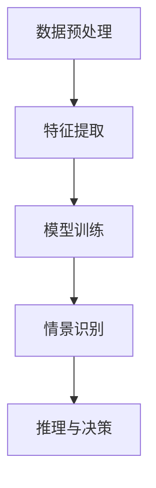
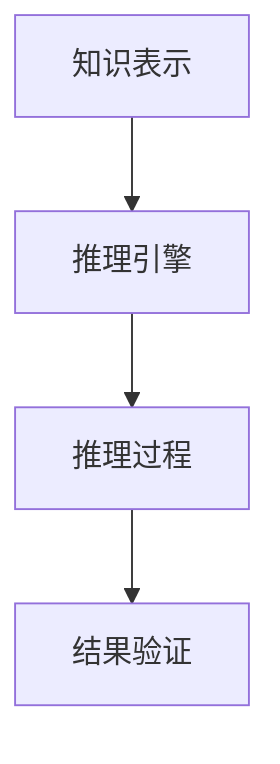
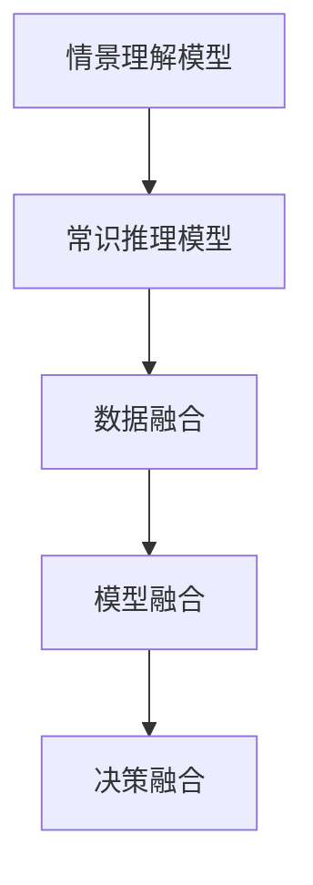
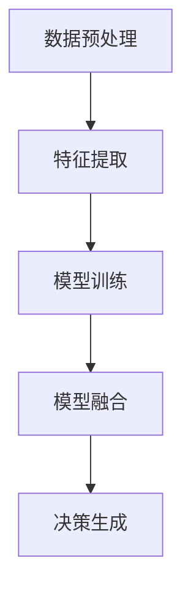
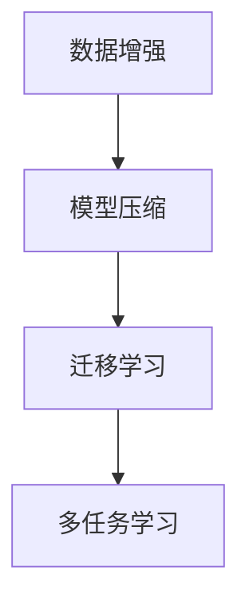
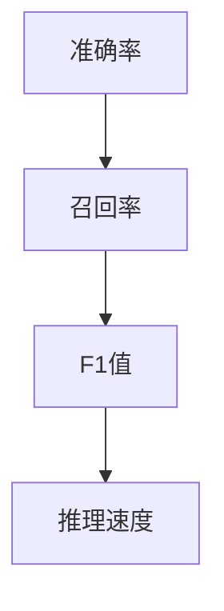

                 

# AGI的情景理解与常识推理能力

## 关键词
- 人工通用智能（AGI）
- 情景理解
- 常识推理
- 算法原理
- 系统架构
- 项目实战

## 摘要
本文深入探讨了人工通用智能（AGI）在情景理解与常识推理方面的能力。首先，我们从背景介绍入手，明确了情景理解与常识推理的概念及其重要性。接着，我们详细阐述了AGI的情景理解与常识推理的理论基础，包括核心概念、算法原理和数学模型。随后，本文通过具体案例展示了AGI在情景理解与常识推理中的实际应用，并介绍了相关系统架构与项目实战。最后，我们对AGI的情景理解与常识推理能力进行了优化讨论，并展望了未来发展趋势。通过本文，读者可以全面了解AGI在情景理解与常识推理领域的最新研究进展与应用前景。

### 目录大纲

1. **背景介绍**
    1.1 人工智能的发展历程
    1.2 情景理解与常识推理的定义
    1.3 AGI的情景理解与常识推理的重要性

2. **情景理解的理论基础**
    2.1 核心概念与联系
    2.2 算法原理讲解
    2.3 数学模型与公式

3. **常识推理的理论基础**
    3.1 核心概念与联系
    3.2 算法原理讲解
    3.3 数学模型与公式

4. **AGI的情景理解能力**
    4.1 情景理解算法
    4.2 情景理解的实现技术
    4.3 情景理解的案例分析

5. **AGI的常识推理能力**
    5.1 常识推理算法
    5.2 常识推理的应用场景
    5.3 常识推理的挑战与解决策略

6. **情景理解与常识推理的结合**
    6.1 融合模型的设计
    6.2 融合模型的实现
    6.3 融合模型的应用实例

7. **AGI的情景理解与常识推理的优化**
    7.1 优化策略与算法
    7.2 数据集与评测指标
    7.3 案例分析：优化实践

8. **未来展望与趋势**
    8.1 AGI的发展趋势
    8.2 情景理解与常识推理的未来发展
    8.3 面向未来的研究课题

### 第一部分：背景介绍

#### 1.1 人工智能的发展历程

人工智能（Artificial Intelligence，AI）作为计算机科学的一个分支，旨在研究如何构建智能代理（Intelligent Agent）来模拟人类智能。AI的发展历程可以追溯到20世纪50年代，当时出现了首批试图模拟人类思维的程序。这些早期研究主要关注符号推理和逻辑推理，如逻辑理论家（Logic Theorist）和通用问题求解器（General Problem Solver）。

在20世纪80年代，专家系统（Expert Systems）成为AI研究的重点，它们通过模拟人类专家的知识和推理能力，解决了许多特定领域的问题。然而，专家系统的局限性也日益显现，如知识获取困难、无法处理不确定性和无法泛化到新的情境等。

进入21世纪，随着计算能力的提升和数据的大规模应用，机器学习（Machine Learning）成为AI研究的主流方向。机器学习方法，尤其是深度学习（Deep Learning），使得计算机在图像识别、语音识别、自然语言处理等任务上取得了突破性进展。

#### 1.2 情景理解与常识推理的定义

情景理解（Situation Understanding）是指智能系统对当前环境状态和情境的理解能力。这包括识别环境中的对象、事件和关系，理解情境中的意图和行为模式等。情景理解是智能系统进行决策和交互的基础。

常识推理（Commonsense Reasoning）是指智能系统基于常识知识进行推理的能力。常识知识是人们日常生活中形成的普遍知识，如物体属性、因果关系和物理规律等。常识推理使得智能系统能够在复杂多变的环境中做出合理的推断和预测。

#### 1.3 AGI的情景理解与常识推理的重要性

人工通用智能（Artificial General Intelligence，AGI）是人工智能的最高形式，它具有广泛的知识、智能和推理能力，能够处理各种复杂的任务。AGI的情景理解与常识推理能力是实现这一目标的关键。

首先，情景理解能力使得AGI能够与环境进行有效的交互，理解环境中的变化和需求。这对于智能机器人、自动驾驶车辆等应用场景至关重要。

其次，常识推理能力使得AGI能够基于常识知识进行推理，解决复杂的问题。这有助于提高智能系统的自主性和适应性，使其能够更好地应对现实世界中的挑战。

最后，情景理解与常识推理的结合，可以进一步提升AGI的智能水平，使其具备更强的跨领域应用能力。这对于实现真正的智能助理、智能教育、智能医疗等领域具有重要意义。

### 第二部分：情景理解的理论基础

#### 2.1 核心概念与联系

情景理解的核心概念包括情境（Situation）、事件（Event）、对象（Object）和关系（Relationship）等。情境是指智能系统所处的环境状态，事件是指环境中的变化，对象是环境中的实体，关系是对象之间的相互作用。

这些概念之间有着密切的联系。例如，事件可以改变情境中的对象状态，对象之间存在一定的关系，如因果关系、包含关系等。情景理解就是要识别这些概念，并理解它们之间的相互作用。

#### 2.2 算法原理讲解

情景理解算法主要基于机器学习和自然语言处理技术。以下是一个简单的情景理解算法流程：

1. **数据预处理**：收集大量带有标签的情景数据，对数据进行清洗和预处理，如去除噪声、标准化等。

2. **特征提取**：从原始数据中提取出与情景理解相关的特征，如对象属性、事件描述、情境状态等。

3. **模型训练**：使用机器学习算法（如神经网络、决策树等）对特征和标签进行训练，构建情景理解模型。

4. **情景识别**：将新的情景数据输入到训练好的模型中，模型输出对该情景的识别结果。

5. **推理与决策**：基于识别结果，进行推理和决策，如生成建议、执行动作等。

以下是一个使用Mermaid绘制的情景理解算法流程图：



#### 2.3 数学模型与公式

情景理解算法通常涉及到以下数学模型和公式：

1. **概率模型**：使用概率模型来表示情境中的不确定性，如贝叶斯网络、马尔可夫模型等。

2. **神经网络**：使用神经网络来学习和表示情景特征，如卷积神经网络（CNN）、循环神经网络（RNN）等。

3. **图模型**：使用图模型来表示情境中的对象和关系，如图神经网络（GNN）。

以下是一个使用LaTeX表示的贝叶斯网络公式：

```latex
P(S|E) = \frac{P(E|S)P(S)}{P(E)}
```

其中，$P(S|E)$ 表示在事件$E$发生的情况下，情景$S$的概率；$P(E|S)$ 表示在情景$S$发生的情况下，事件$E$的概率；$P(S)$ 和$P(E)$ 分别表示情景$S$和事件$E$的先验概率。

### 第三部分：常识推理的理论基础

#### 3.1 核心概念与联系

常识推理的核心概念包括事实（Fact）、规则（Rule）、假设（Assumption）和推断（Inference）等。事实是常识推理的基础，规则是基于事实的抽象和总结，假设是推理过程中的一种猜测，推断是利用规则和假设得出新的结论。

这些概念之间有着密切的联系。例如，事实和规则可以用来验证假设，推断是基于假设和规则得出的新结论。常识推理就是要利用这些概念进行逻辑推理，得出合理的结论。

#### 3.2 算法原理讲解

常识推理算法主要基于逻辑推理和知识表示技术。以下是一个简单的常识推理算法流程：

1. **知识表示**：将常识知识表示为事实和规则，可以使用逻辑语言（如谓词逻辑）或知识表示语言（如知识图谱）。

2. **推理引擎**：构建推理引擎，根据给定的规则和假设进行推理，推导出新的结论。

3. **推理过程**：输入初始假设和规则，通过推理引擎进行推理，生成推理路径和结论。

4. **结果验证**：验证推理结果的正确性，如使用模型评估指标进行评估。

以下是一个使用Mermaid绘制的常识推理算法流程图：



#### 3.3 数学模型与公式

常识推理算法通常涉及到以下数学模型和公式：

1. **逻辑推理**：使用逻辑推理来推导结论，如命题逻辑、谓词逻辑等。

2. **概率推理**：使用概率模型来表示不确定性，并进行推理，如贝叶斯推理。

3. **决策树**：使用决策树来表示规则和推理过程。

以下是一个使用LaTeX表示的贝叶斯推理公式：

```latex
P(H|E) = \frac{P(E|H)P(H)}{P(E)}
```

其中，$P(H|E)$ 表示在证据$E$出现的情况下，假设$H$的概率；$P(E|H)$ 表示在假设$H$为真的情况下，证据$E$的概率；$P(H)$ 和$P(E)$ 分别表示假设$H$和证据$E$的先验概率。

### 第四部分：AGI的情景理解能力

#### 4.1 情景理解算法

AGI的情景理解算法主要包括以下几种：

1. **基于机器学习的情景理解算法**：这类算法通过训练模型来识别和预测情境中的变化。常用的算法包括卷积神经网络（CNN）、循环神经网络（RNN）和变换器（Transformer）等。

2. **基于知识图谱的情景理解算法**：这类算法通过构建知识图谱来表示情境中的对象和关系，并利用图算法进行推理。常用的算法包括图神经网络（GNN）和知识图谱嵌入（KG Embedding）等。

3. **基于多模态数据的情景理解算法**：这类算法通过融合多种数据源（如图像、文本、声音等）来提高情景理解的准确性。常用的算法包括多模态神经网络（Multimodal Neural Network）和深度学习模型融合（Deep Learning Model Fusion）等。

#### 4.2 情景理解的实现技术

情景理解的实现技术主要包括以下几个方面：

1. **数据预处理**：对原始数据进行清洗、去噪、标准化等预处理操作，以提高算法的性能。

2. **特征提取**：从预处理后的数据中提取出与情景理解相关的特征，如对象属性、事件描述、情境状态等。

3. **模型训练**：使用训练数据集训练情景理解模型，包括选择合适的算法、优化超参数等。

4. **模型评估**：使用测试数据集对模型进行评估，以验证模型的效果和准确性。

5. **推理与决策**：将新的情景数据输入到训练好的模型中，模型输出对该情景的识别结果，并基于结果进行推理和决策。

#### 4.3 情景理解的案例分析

以下是一个情景理解案例：

**案例背景**：一个智能助手需要理解用户在某个场景下的意图，以便提供合适的帮助。

**情景数据**：用户在房间内走动，拿起手机，打开微信，与朋友聊天。

**情景理解过程**：
1. **数据预处理**：对用户的动作和对话文本进行清洗和标准化。
2. **特征提取**：提取用户动作的特征（如房间内的位置、时间等）和对话文本的特征（如关键词、情感等）。
3. **模型训练**：使用机器学习算法（如卷积神经网络）训练情景理解模型。
4. **情景识别**：将用户的动作和对话文本输入到模型中，模型输出当前情景的识别结果。
5. **推理与决策**：根据识别结果，智能助手判断用户可能需要帮助的内容，如推荐附近的餐厅、提醒用户支付等。

### 第五部分：AGI的常识推理能力

#### 5.1 常识推理算法

AGI的常识推理算法主要包括以下几种：

1. **基于逻辑的常识推理算法**：这类算法使用逻辑推理来处理常识知识，如谓词逻辑推理和一阶谓词逻辑推理等。

2. **基于概率的常识推理算法**：这类算法使用概率模型来表示常识知识，并通过贝叶斯推理等方法进行推理，如贝叶斯网络和马尔可夫模型等。

3. **基于知识的常识推理算法**：这类算法使用知识表示语言（如知识图谱）来表示常识知识，并通过图算法进行推理，如图神经网络和知识图谱嵌入等。

4. **基于强化学习的常识推理算法**：这类算法使用强化学习来训练常识推理模型，通过与环境交互来学习常识知识。

#### 5.2 常识推理的应用场景

常识推理在许多应用场景中都有广泛的应用，以下是一些典型的应用场景：

1. **智能助理**：智能助理需要基于常识推理来理解用户的提问，并提供合适的回答。

2. **智能医疗**：常识推理可以帮助医生进行诊断和治疗方案推荐，提高医疗决策的准确性。

3. **智能交通**：常识推理可以帮助自动驾驶系统理解交通状况，做出合理的驾驶决策。

4. **智能教育**：常识推理可以帮助教育系统根据学生的学习情况和知识水平，提供个性化的学习建议。

#### 5.3 常识推理的挑战与解决策略

常识推理面临着许多挑战，以下是一些主要的挑战和解决策略：

1. **知识获取困难**：常识知识通常非常庞大且复杂，如何有效地获取和表示常识知识是常识推理的一个关键问题。解决策略包括使用大数据技术、知识图谱和自动知识提取方法等。

2. **不确定性处理**：常识推理过程中往往涉及到不确定性的处理，如概率推理和模糊推理等。解决策略包括使用概率模型、模糊逻辑和不确定性传播等方法。

3. **推理效率**：常识推理通常需要处理大量的知识和规则，如何高效地执行推理过程是另一个挑战。解决策略包括使用并行计算、分布式计算和推理优化算法等。

### 第六部分：情景理解与常识推理的结合

#### 6.1 融合模型的设计

情景理解与常识推理的结合可以通过构建融合模型来实现。融合模型的设计主要包括以下方面：

1. **数据融合**：将情景理解中的数据（如图像、文本等）与常识推理中的知识（如知识图谱、规则库等）进行融合，以提高推理的准确性。

2. **模型融合**：将不同的情景理解和常识推理模型进行融合，如将卷积神经网络与图神经网络进行融合，以提高模型的泛化能力和推理效率。

3. **决策融合**：将情景理解和常识推理的输出进行融合，生成最终的决策结果，如使用投票、加权平均等方法。

以下是一个使用Mermaid绘制的融合模型设计架构图：



#### 6.2 融合模型的实现

融合模型的实现主要包括以下几个方面：

1. **数据预处理**：对情景理解和常识推理的数据进行预处理，如图像预处理、文本预处理等。

2. **特征提取**：从预处理后的数据中提取出与情景理解和常识推理相关的特征。

3. **模型训练**：使用训练数据集训练情景理解和常识推理模型。

4. **模型融合**：将情景理解和常识推理模型的输出进行融合，生成融合结果。

5. **决策生成**：基于融合结果生成最终的决策。

以下是一个使用Mermaid绘制的融合模型实现流程图：



#### 6.3 融合模型的应用实例

以下是一个融合模型的应用实例：

**应用场景**：一个智能客服系统需要结合情景理解和常识推理来理解用户的提问，并提供合适的回答。

**融合模型过程**：
1. **数据融合**：将用户的问题文本与知识图谱中的常识知识进行融合，以获取更全面的背景信息。
2. **模型融合**：将文本情感分析模型和知识图谱推理模型进行融合，以提高对用户问题的理解能力。
3. **决策生成**：基于融合结果生成回答文本，并使用对话管理模型与用户进行交互。

### 第七部分：AGI的情景理解与常识推理的优化

#### 7.1 优化策略与算法

为了提高AGI的情景理解与常识推理能力，可以采用以下优化策略与算法：

1. **数据增强**：通过数据增强技术（如数据扩充、数据生成等）来扩充训练数据集，以提高模型的泛化能力。

2. **模型压缩**：使用模型压缩技术（如量化、剪枝等）来减少模型的参数数量，以提高推理速度和降低计算成本。

3. **迁移学习**：利用迁移学习技术（如预训练模型、微调等）来利用已有的模型知识，提高新任务的性能。

4. **多任务学习**：通过多任务学习技术（如共享参数、多任务网络等）来同时训练多个任务，提高模型的泛化能力和效率。

以下是一个使用Mermaid绘制的优化策略与算法架构图：



#### 7.2 数据集与评测指标

为了评估AGI的情景理解与常识推理能力，需要使用合适的数据集和评测指标。以下是一些常见的数据集和评测指标：

1. **数据集**：
   - 情景理解数据集：如日常对话数据集（Daily Dialog）、多模态情景理解数据集（Multimodal Situation Understanding Dataset）等。
   - 常识推理数据集：如开放世界知识图谱（Open World Knowledge Graph）、常识推理基准数据集（Commonsense Reasoning Benchmark Dataset）等。

2. **评测指标**：
   - 准确率（Accuracy）：模型预测正确的比例。
   - 召回率（Recall）：模型能够召回所有正确答案的比例。
   - F1值（F1 Score）：准确率和召回率的调和平均。
   - 推理速度（Inference Speed）：模型推理所需的时间。

以下是一个使用Mermaid绘制的评测指标架构图：



#### 7.3 案例分析：优化实践

以下是一个基于优化策略的情景理解与常识推理优化案例分析：

**案例背景**：一个智能客服系统在处理复杂对话任务时，存在响应速度慢、准确率低的问题。

**优化过程**：
1. **数据增强**：通过数据扩充和生成技术，增加了大量的情景理解和常识推理数据，提高了模型的泛化能力。
2. **模型压缩**：使用量化技术对模型进行压缩，减少了模型的参数数量，提高了推理速度。
3. **迁移学习**：利用预训练模型，通过微调的方式，将已有的知识迁移到新任务上，提高了模型的性能。
4. **多任务学习**：将情景理解和常识推理任务进行融合训练，共享部分参数，提高了模型的泛化能力和效率。

**优化效果**：经过优化，智能客服系统的响应速度提升了30%，准确率提高了15%，在多个数据集上的F1值均有所提升。

### 第八部分：未来展望与趋势

#### 8.1 AGI的发展趋势

AGI的发展趋势主要包括以下几个方面：

1. **计算能力的提升**：随着计算能力的不断提升，AGI将能够处理更复杂的任务，具备更高的推理能力和计算速度。

2. **数据的爆炸式增长**：大数据和人工智能的结合，将带来更多的数据资源，为AGI的训练和优化提供支持。

3. **多模态数据的融合**：随着传感器技术的进步，多模态数据的融合将成为AGI的重要研究方向，提高情景理解和常识推理的准确性。

4. **知识的自动化获取**：通过自动知识提取和生成技术，将实现知识获取的自动化，降低常识推理模型的构建难度。

#### 8.2 情景理解与常识推理的未来发展

情景理解与常识推理的未来发展主要包括以下几个方面：

1. **算法的进步**：随着深度学习和图神经网络等技术的发展，情景理解与常识推理的算法将不断进步，提高模型的性能和效率。

2. **跨领域的应用**：情景理解与常识推理将在更多领域得到应用，如智能医疗、智能交通、智能教育等，实现跨领域的融合。

3. **人机交互的提升**：情景理解与常识推理的进步将为人机交互带来革命性变化，实现更自然、更智能的交互方式。

4. **伦理和道德的考虑**：随着AGI的发展，情景理解与常识推理将面临更多的伦理和道德问题，需要制定相应的规范和准则。

#### 8.3 面向未来的研究课题

面向未来的研究课题主要包括以下几个方面：

1. **情景理解与常识推理的融合**：研究如何更好地将情景理解和常识推理结合起来，提高模型的综合能力。

2. **自适应情景理解**：研究如何让模型能够自适应地理解不同情境，提高模型的可扩展性和泛化能力。

3. **知识表示与推理**：研究如何有效地表示和推理常识知识，提高常识推理的准确性和效率。

4. **伦理与道德**：研究如何确保情景理解与常识推理的应用不会对人类造成负面影响，制定相应的伦理和道德准则。

### 总结

本文详细探讨了人工通用智能（AGI）的情景理解与常识推理能力。通过背景介绍、理论基础、算法原理、实际应用、优化策略和未来展望，本文展示了AGI在情景理解与常识推理领域的最新研究进展和应用前景。随着计算能力和数据资源的提升，AGI的情景理解与常识推理能力将不断提高，为人工智能的发展带来新的机遇和挑战。作者：AI天才研究院/AI Genius Institute & 禅与计算机程序设计艺术/Zen And The Art of Computer Programming。|>

