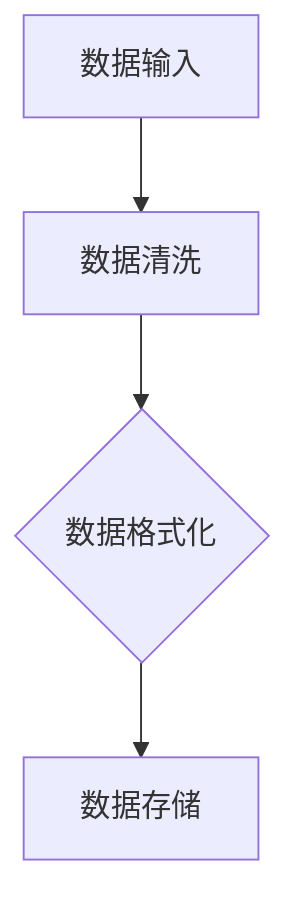
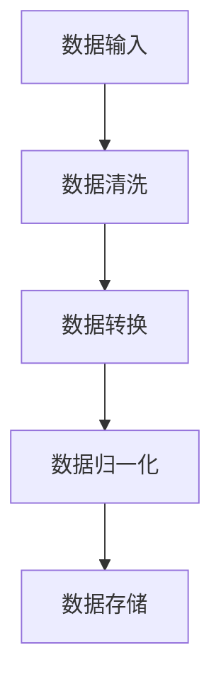
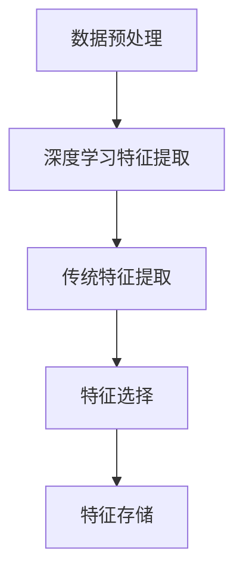
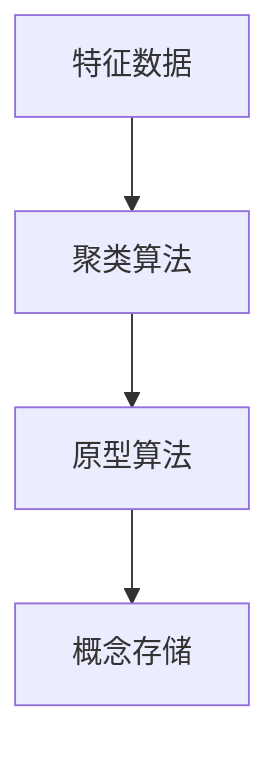
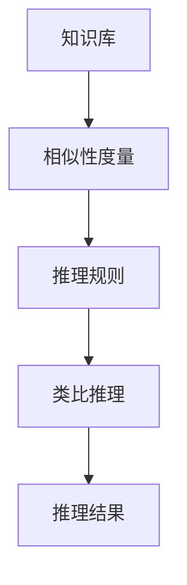
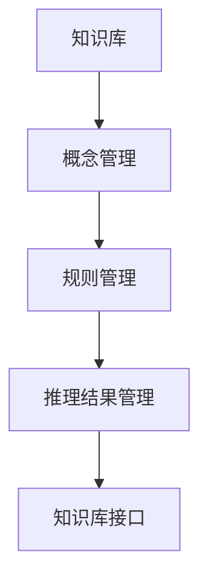
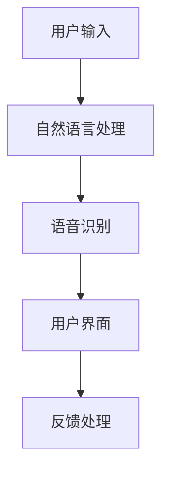
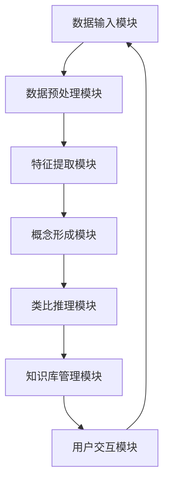

                 

### 第1章: 引言

#### 1.1 问题背景

##### 1.1.1 AGI的概念

通用人工智能（AGI，Artificial General Intelligence）是一个广泛讨论的话题，它旨在创建一种人工智能系统，这种系统能够执行人类所能够完成的任何认知任务，并具备广泛的智能能力。不同于当前大多数的人工智能系统，AGI不仅能够处理特定的任务，如语音识别、图像识别或游戏，还能够像人类一样进行学习、推理、规划和理解复杂的概念。

##### 1.1.2 发展历程

自20世纪50年代人工智能（AI）概念的提出以来，AGI的发展历程充满了挑战与机遇。早期的人工智能研究主要集中在规则推理和符号逻辑上，但这些方法在面对复杂问题和不确定环境时表现不佳。随着计算能力的提升和机器学习技术的发展，特别是深度学习的兴起，人工智能在某些领域取得了显著的进展。然而，这些进展主要集中在窄人工智能（Narrow AI）上，即能够完成特定任务的系统，而非广泛认知能力的AGI。

##### 1.1.3 当前挑战与进展

尽管近年来在人工智能领域取得了显著进展，但实现AGI仍然面临许多挑战。这些挑战包括：

1. **理论基础不足**：虽然已有多种算法和模型，但关于如何构建通用智能的理论基础仍不充分。
2. **计算资源限制**：尽管计算能力不断提升，但实现AGI所需的海量计算资源仍然是一个巨大的挑战。
3. **理解与认知**：如何让机器具备人类般的理解和认知能力，这是当前研究的一个核心问题。

#### 1.2 问题描述

##### 1.2.1 抽象思维的重要性

抽象思维是人类认知的核心能力之一，它使我们能够从具体的感知中提取出一般性概念和原则，从而进行推理和解决问题。抽象思维不仅在科学研究中起到关键作用，也在日常生活中帮助我们理解复杂的概念和情境。

##### 1.2.1.1 抽象思维的定义

抽象思维是一种认知过程，它允许个体在具体情境之外，识别和操作抽象概念。这些概念不依赖于特定情境，而是具有普遍性和适用性。例如，数学中的“加法”概念不仅适用于具体的物品计数，还适用于各种抽象的数值运算。

##### 1.2.1.2 抽象思维在人类认知中的作用

抽象思维使人类能够进行复杂的推理和问题解决，它有助于：

1. **知识整合**：将不同领域的知识整合在一起，形成新的理解和理论。
2. **创新思维**：通过抽象概念的应用，创造出新的想法和解决方案。
3. **跨领域学习**：抽象思维使得学习一种概念或技能能够推广到其他领域。

##### 1.2.2 抽象思维在AGI中的缺失与需求

当前大多数人工智能系统，包括深度学习模型，主要依赖于数据和算法来进行特定任务的优化。这些系统往往缺乏抽象思维能力，即它们无法在没有具体情境的背景下，识别和应用抽象概念。这使得AGI在处理复杂、不确定的问题时，往往表现不佳。为了实现AGI，我们必须解决如何让机器具备抽象思维能力的问题。

#### 1.3 问题解决

##### 1.3.1 概念形成的理论基础

概念形成是抽象思维的核心组成部分，它涉及如何从具体实例中提取出一般性概念。在心理学中，已有多种理论来解释概念形成过程，如原型理论、范畴理论等。这些理论为我们提供了理解概念形成的基础。

###### 1.3.1.1 概念形成的心理机制

概念形成涉及多种心理过程，包括：

1. **抽象化**：从具体情境中提取出共性特征，形成抽象概念。
2. **分类**：将对象归类到特定的概念类别中。
3. **概括**：从多个实例中提取出普遍性特征，形成更广泛的概念。

###### 1.3.1.2 概念形成的认知模型

认知模型如生产者-消费者模型、向量空间模型等，试图模拟人类概念形成的过程。这些模型通过数学和计算方法，试图解释概念形成的原理。

##### 1.3.2 类比推理在抽象思维中的作用

类比推理是一种基于相似性的推理过程，它使我们能够将一个领域的知识应用到另一个领域。类比推理在抽象思维中起到关键作用，因为它允许我们通过将新问题与已知问题进行比较，来发现解决问题的方法。

###### 1.3.2.1 类比推理的定义

类比推理是指通过识别两个或多个情境之间的相似性，来推断它们在其他方面可能具有相似性。例如，如果我们知道“猫有四条腿”，并且看到“狗有四条腿”，我们可能会推断“狗也可能有猫的其他特征”。

###### 1.3.2.2 类比推理的过程与机制

类比推理涉及以下步骤：

1. **识别相似性**：识别两个或多个情境之间的共同特征。
2. **建立映射**：将一个情境中的特征映射到另一个情境中。
3. **推理**：基于相似性，推导出两个情境在其他方面可能具有相似性。

##### 1.4 边界与外延

###### 1.4.1 抽象思维与具体思维的区别

抽象思维和具体思维是认知过程的两个极端。具体思维依赖于具体的感知和情境，而抽象思维则超越了具体情境，关注一般性概念和原则。

###### 1.4.1.1 定义与特点

- **具体思维**：基于具体的感知和经验，容易受具体情境的影响。
- **抽象思维**：关注一般性概念和原则，不依赖于具体情境。

###### 1.4.1.2 关联与交互

尽管抽象思维和具体思维是不同的认知过程，但它们在实际生活中是相互关联和交互的。具体思维为我们提供了丰富的经验数据，而抽象思维则帮助我们从中提取出一般性原则，从而进行更高效的问题解决。

###### 1.4.2 AGI与抽象思维的关系

抽象思维对于AGI的实现至关重要。为了使机器具备通用智能，我们必须让机器具备抽象思维能力。这包括让机器能够形成概念、进行类比推理，并在此基础上进行推理和问题解决。

###### 1.4.2.1 AGI对抽象思维的需求

AGI需要具备抽象思维能力，以便能够处理复杂、不确定的问题。抽象思维使机器能够从具体情境中提取出一般性概念，从而在新的情境中应用这些概念。

###### 1.4.2.2 抽象思维对AGI的贡献

抽象思维对AGI的贡献包括：

1. **知识整合**：通过抽象思维，AGI能够将不同领域的知识整合在一起，形成新的理解和理论。
2. **跨领域应用**：抽象思维使得AGI能够将一个领域的知识应用到其他领域，从而实现更广泛的智能应用。

### 1.5 总结

本章介绍了AGI的背景、抽象思维的重要性以及抽象思维在AGI中的应用。通过理解抽象思维的概念和原理，我们可以为AGI的实现提供理论基础，从而推动人工智能向更高级的形式发展。

----------------------------------------------------------------

## 第2章: AGI的抽象思维概述

### 2.1 AGI的抽象思维定义

#### 2.1.1 抽象思维的概念

抽象思维是一种认知过程，它允许个体在具体情境之外，识别和操作抽象概念。这些概念不依赖于特定情境，而是具有普遍性和适用性。在人工智能领域，AGI的抽象思维指的是机器能够模仿人类的抽象思维过程，进行概念形成、类比推理和问题解决。

##### 2.1.1.1 定义

抽象思维（Abstraction Thinking）是指从具体事物中提取出一般性特征，并在此基础上进行推理和判断的能力。例如，当我们说“狗有四条腿”时，我们抽象出了“四条腿”这一特征，并将其应用于其他四足动物。

##### 2.1.1.2 特点

1. **普遍性**：抽象概念不依赖于特定情境，可以在多种情境下应用。
2. **适应性**：抽象思维能够适应不同的认知需求，帮助个体解决复杂问题。
3. **灵活性**：抽象思维使个体能够从多个角度理解问题，从而找到创新的解决方案。

#### 2.1.2 AGI的抽象思维定义

AGI的抽象思维是指机器在模拟人类思维过程中，能够从大量数据中提取出一般性概念，并进行类比推理和问题解决的能力。与传统的基于规则的AI系统不同，AGI的抽象思维更接近人类的认知方式。

##### 2.1.2.1 定义

AGI的抽象思维（Abstract Thinking in AGI）是指机器通过模仿人类的抽象思维过程，实现概念形成、类比推理和问题解决的能力。具体来说，这包括：

1. **概念形成**：从具体数据中提取出一般性概念。
2. **类比推理**：基于已有概念，进行跨领域的推理和问题解决。
3. **问题解决**：利用抽象概念和类比推理，找到有效的解决方案。

##### 2.1.2.2 特点

1. **自主学习**：AGI的抽象思维能够通过自我学习，不断丰富和优化其抽象概念库。
2. **跨领域应用**：AGI的抽象思维能够将一个领域的知识应用到其他领域，实现更广泛的智能应用。
3. **自适应**：AGI的抽象思维能够根据不同的情境和需求，灵活调整其抽象思维过程。

### 2.2 抽象思维的类型

抽象思维可以细分为多种类型，每种类型在抽象概念的形成和推理过程中发挥不同的作用。以下是几种常见的抽象思维类型：

#### 2.2.1 形式抽象思维

形式抽象思维（Formal Abstraction Thinking）是指通过抽象出事物的形式特征，来进行推理和问题解决的能力。形式抽象思维通常涉及数学、逻辑和符号系统。

##### 2.2.1.1 定义

形式抽象思维是指通过数学和逻辑方法，将事物的形式特征（如形状、结构、关系等）从具体情境中抽象出来，并进行推理和问题解决。

##### 2.2.1.2 应用

1. **数学领域**：在数学中，形式抽象思维使我们能够抽象出数学对象的性质，如整数、函数、集合等，并基于这些抽象概念进行推理。
2. **计算机科学领域**：在计算机科学中，形式抽象思维帮助我们构建抽象的数据结构和算法，如图、树、排序算法等。

#### 2.2.2 内容抽象思维

内容抽象思维（Contentual Abstraction Thinking）是指通过抽象出事物的内容特征，来进行推理和问题解决的能力。内容抽象思维通常涉及概念形成、类比推理和情境理解。

##### 2.2.2.1 定义

内容抽象思维是指通过将具体事物的内容特征（如属性、关系、情境等）从具体情境中抽象出来，并进行推理和问题解决。

##### 2.2.2.2 应用

1. **科学领域**：在科学研究中，内容抽象思维使我们能够从实验数据中提取出一般性结论，并建立理论模型。
2. **商业领域**：在商业领域，内容抽象思维帮助我们识别商业机会、制定战略和解决问题。

#### 2.2.3 过程抽象思维

过程抽象思维（Procedural Abstraction Thinking）是指通过抽象出事物的过程特征，来进行推理和问题解决的能力。过程抽象思维通常涉及算法设计、流程优化和策略制定。

##### 2.2.3.1 定义

过程抽象思维是指通过将具体事物的过程特征（如步骤、规则、策略等）从具体情境中抽象出来，并进行推理和问题解决。

##### 2.2.3.2 应用

1. **工程领域**：在工程领域，过程抽象思维帮助我们设计复杂的系统，如计算机系统、通信系统等。
2. **项目管理领域**：在项目管理中，过程抽象思维使我们能够抽象出项目的关键流程，并制定有效的项目管理策略。

### 2.3 抽象思维在AGI中的应用

#### 2.3.1 概念形成与抽象思维

在AGI中，概念形成是抽象思维的核心组成部分。通过概念形成，机器能够从具体数据中提取出一般性概念，并在不同情境下应用这些概念。

##### 2.3.1.1 概念形成的算法

概念形成算法（Concept Formation Algorithm）是一种用于帮助机器从数据中提取出概念的方法。常见的概念形成算法包括：

1. **原型算法**：基于对数据集中最典型实例的抽象，形成概念。
2. **边界识别算法**：通过识别数据集中的边界实例，形成概念。
3. **实例归纳算法**：通过归纳多个实例的共性特征，形成概念。

##### 2.3.1.2 抽象思维的实现

在AGI中，实现抽象思维的关键在于模拟人类的认知过程。以下是一些实现抽象思维的策略：

1. **神经网络**：通过深度学习模型，模拟人类的感知和推理过程。
2. **符号逻辑**：使用符号逻辑和推理规则，模拟人类的抽象思维过程。
3. **模糊逻辑**：使用模糊逻辑，处理不确定性和模糊性。

#### 2.3.2 类比推理与抽象

类比推理（Analogical Reasoning）是抽象思维的重要表现形式，它通过识别两个或多个情境之间的相似性，推断出其他情境的特征。

##### 2.3.2.1 类比推理的定义

类比推理是指通过识别两个或多个情境之间的相似性，推断出它们在其他方面可能具有相似性的过程。例如，如果我们知道“猫有四条腿”，并且看到“狗有四条腿”，我们可能会推断“狗也可能有猫的其他特征”。

##### 2.3.2.2 类比推理的过程与机制

类比推理涉及以下步骤：

1. **识别相似性**：识别两个或多个情境之间的共同特征。
2. **建立映射**：将一个情境中的特征映射到另一个情境中。
3. **推理**：基于相似性，推导出两个情境在其他方面可能具有相似性。

在AGI中，类比推理的实现策略包括：

1. **基于知识的类比推理**：使用已有的知识和概念，进行类比推理。
2. **基于实例的类比推理**：通过实例学习，实现类比推理。
3. **基于模型的类比推理**：使用数学模型，进行类比推理。

### 2.4 总结

本章对AGI的抽象思维进行了概述，包括抽象思维的定义、类型、在AGI中的应用以及类比推理的实现。通过理解抽象思维的原理和实现方法，我们可以为AGI的发展提供理论基础，从而推动人工智能向更高级的形式发展。

----------------------------------------------------------------

## 第3章: 概念形成的理论基础

### 3.1 概念形成的心理学研究

#### 3.1.1 原型理论

原型理论（Prototype Theory）是关于概念形成的核心理论之一，由Eleanor Rosch于1973年提出。该理论认为，人们不是通过一组明确的边界来定义概念，而是通过一个最典型的例子（原型）来代表整个概念。

##### 3.1.1.1 定义

原型是指一个概念中最具代表性的例子，它代表了该概念的核心特征。例如，在“椅子”这个概念中，一张典型的办公椅可能是其原型。

##### 3.1.1.2 原型理论的关键观点

1. **概念的核心性**：原型理论强调概念的核心性，即概念的成员资格是由原型决定的，而非边界条件。
2. **概念的模糊性**：概念的形成具有模糊性，边界不明确，成员资格存在灰色区域。

##### 3.1.1.3 应用

原型理论在许多领域都有应用，如市场营销、认知心理学、语言学习等。在人工智能领域，原型理论启发了许多概念形成算法的设计。

#### 3.1.2 范畴理论

范畴理论（Categorical Theory）是另一重要的概念形成理论，由George Miller在1956年提出。该理论认为，概念是通过一组明确的特征来定义的，这些特征构成了概念的外延。

##### 3.1.2.1 定义

范畴是指一组具有共同特征的对象集合。在范畴理论中，概念的形成是通过识别这些共同特征来定义的。

##### 3.1.2.2 范畴理论的关键观点

1. **清晰的边界**：范畴理论强调概念的边界清晰，成员资格可以通过一组明确的特征来判断。
2. **层次结构**：范畴理论认为，概念之间存在层次结构，高层次概念可以包含多个低层次概念。

##### 3.1.2.3 应用

范畴理论在分类系统设计、数据挖掘等领域有广泛应用。在人工智能领域，范畴理论为构建基于特征的机器学习模型提供了理论基础。

### 3.2 认知模型

在心理学研究中，认知模型用于模拟人类思维过程，解释概念形成的过程。以下是一些重要的认知模型：

#### 3.2.1 生产者-消费者模型

生产者-消费者模型（Producer-Consumer Model）是一种用于描述概念形成的认知模型。在这个模型中，生产者负责生成概念，而消费者则负责使用这些概念进行推理和决策。

##### 3.2.1.1 定义

生产者-消费者模型假设，人类心智中有一个“生产者”部分，它负责从感知数据中提取出概念，而“消费者”部分则使用这些概念进行推理。

##### 3.2.1.2 应用

生产者-消费者模型可以用于解释许多认知过程，如问题解决、决策制定和语言理解。

#### 3.2.2 向量空间模型

向量空间模型（Vector Space Model）是一种基于数学的模型，用于表示概念和它们之间的关系。在这个模型中，每个概念都可以表示为一个向量，而概念之间的相似性可以通过向量的距离来度量。

##### 3.2.2.1 定义

向量空间模型将概念表示为高维空间中的点，每个维度对应一个特征。两个概念之间的相似性可以通过它们在空间中的距离来计算。

##### 3.2.2.2 应用

向量空间模型广泛应用于信息检索、文本分类和推荐系统等领域。在人工智能中，它为处理复杂数据和概念提供了强大的工具。

### 3.3 概念形成与抽象思维的关系

#### 3.3.1 概念形成是抽象思维的基础

概念形成是抽象思维的核心组成部分。通过概念形成，人类能够从具体情境中提取出一般性概念，从而进行抽象思维和推理。

##### 3.3.1.1 概念形成的心理过程

概念形成涉及以下心理过程：

1. **感知**：从感官数据中提取信息。
2. **抽象化**：提取共性特征，形成抽象概念。
3. **分类**：将对象归类到特定的概念类别中。
4. **概括**：从多个实例中提取出普遍性特征。

##### 3.3.1.2 概念形成的认知模型

认知模型如生产者-消费者模型和向量空间模型，通过模拟人类概念形成的过程，提供了对抽象思维的深入理解。

#### 3.3.2 抽象思维对概念形成的影响

抽象思维不仅影响概念形成的过程，还影响概念的形成结果。通过抽象思维，人类能够从多个角度理解问题，提取出更广泛和深刻的概念。

##### 3.3.2.1 抽象思维的心理机制

抽象思维涉及以下心理机制：

1. **抽象化**：从具体情境中提取出一般性特征。
2. **类比推理**：基于已有概念，进行跨领域的推理。
3. **归纳推理**：从具体实例中提取出一般性原则。

##### 3.3.2.2 抽象思维对概念形成的促进作用

抽象思维使概念形成更加高效和准确。通过抽象思维，人类能够快速识别和提取概念的核心特征，从而构建更准确和广泛适用的概念体系。

### 3.4 概念形成的数学模型

在人工智能领域，概念形成的数学模型用于模拟和优化人类概念形成的过程。以下是一些常见的数学模型：

#### 3.4.1 模糊逻辑

模糊逻辑（Fuzzy Logic）是一种处理不确定性和模糊性的数学模型。它通过引入模糊集合和隶属度函数，模拟人类对概念模糊性的处理能力。

##### 3.4.1.1 定义

模糊逻辑使用模糊集合来表示概念，每个元素对概念的隶属度在0到1之间。

##### 3.4.1.2 应用

模糊逻辑广泛应用于控制工程、模式识别和决策支持系统等领域。在人工智能中，它为处理复杂数据和概念提供了有效的工具。

#### 3.4.2 贝叶斯网络

贝叶斯网络（Bayesian Network）是一种概率模型，用于表示概念之间的关系和不确定性。它通过条件概率表来描述概念之间的依赖关系。

##### 3.4.2.1 定义

贝叶斯网络是一个有向无环图，节点表示概念，边表示概念之间的依赖关系。

##### 3.4.2.2 应用

贝叶斯网络广泛应用于知识表示、推理和决策支持系统。在人工智能中，它为处理复杂因果关系和不确定性提供了强大的工具。

### 3.5 总结

本章介绍了概念形成的理论基础，包括心理学研究和认知模型。通过理解概念形成的过程和数学模型，我们可以更深入地探讨抽象思维的本质，为AGI的实现提供理论基础。

----------------------------------------------------------------

## 第4章: 类比推理的原理与机制

### 4.1 类比推理的定义与重要性

#### 4.1.1 类比推理的定义

类比推理（Analogical Reasoning）是指通过识别两个或多个情境之间的相似性，推断出其他情境可能具有相似特征的过程。类比推理是一种基于相似性的推理方法，它使我们能够将一个领域的知识应用到另一个领域。

##### 4.1.1.1 定义

类比推理（Analogical Reasoning）是一种基于情境相似性的推理过程，通过识别两个或多个情境之间的相似性，推断出它们在其他方面可能具有相似性的结论。

##### 4.1.1.2 特点

1. **相似性依赖**：类比推理依赖于情境之间的相似性，通过识别这些相似性来推断其他特征。
2. **跨领域应用**：类比推理使我们将一个领域的知识应用到另一个领域，从而扩展我们的认知能力。

#### 4.1.2 类比推理的重要性

类比推理在人类认知中具有重要作用，它使我们能够：

1. **解决问题**：通过类比推理，我们能够将一个领域的知识应用到另一个领域，从而解决新问题。
2. **创新思维**：类比推理帮助我们产生新的想法和解决方案，促进创新思维。
3. **知识整合**：类比推理使我们将不同领域的知识整合在一起，形成新的理解和理论。

##### 4.1.2.1 类比推理在科学领域的应用

在科学研究中，类比推理帮助我们建立新的理论和模型。例如，物理学中的“波粒二象性”概念就是通过将光与粒子的类比推理得出的。

##### 4.1.2.2 类比推理在工程领域的应用

在工程领域中，类比推理帮助我们设计和优化复杂的系统。例如，在航空航天工程中，通过类比地球上的飞行器，我们可以设计出适用于太空环境的飞行器。

### 4.2 类比推理的过程与机制

类比推理涉及多个心理过程和认知机制，以下是一个简化的类比推理过程：

1. **情境识别**：识别两个或多个相似情境。
2. **相似性映射**：建立情境之间的相似性映射。
3. **特征推断**：基于相似性映射，推断出其他特征。
4. **推理验证**：验证推断结果的合理性。

#### 4.2.1 情境识别

情境识别是类比推理的第一步，它涉及识别两个或多个相似情境。这通常依赖于我们对情境的整体感知和认知。

##### 4.2.1.1 识别相似情境

情境识别可以通过以下方法实现：

1. **特征比较**：比较两个情境中的共同特征。
2. **情境归类**：将情境归类到特定的概念类别中。
3. **情境建模**：建立情境的数学或逻辑模型，以便更好地识别相似性。

#### 4.2.2 相似性映射

相似性映射是类比推理的核心步骤，它涉及将情境之间的相似性映射到具体的特征上。这通常通过以下方法实现：

1. **特征提取**：从情境中提取出关键特征。
2. **特征匹配**：比较不同情境之间的特征，识别相似性。
3. **特征组合**：将相似特征组合成一个更复杂的特征集。

#### 4.2.3 特征推断

基于相似性映射，我们可以推断出其他特征。特征推断通常依赖于以下方法：

1. **类比法则**：使用已有的类比法则，如“相似则相似”。
2. **推理规则**：基于逻辑和数学规则，推导出其他特征。
3. **统计分析**：使用统计方法，如线性回归，推断出其他特征。

#### 4.2.4 推理验证

推理验证是类比推理的最后一步，它涉及验证推断结果的合理性。推理验证可以通过以下方法实现：

1. **反例检查**：检查推断结果是否与已知事实矛盾。
2. **逻辑推理**：使用逻辑推理，验证推断结果的合理性。
3. **实验验证**：通过实验或模拟，验证推断结果的准确性。

### 4.3 类比推理的心理机制

在心理学研究中，类比推理涉及多个认知机制，包括记忆、注意、推理和知识整合。以下是一些重要的心理机制：

#### 4.3.1 记忆

记忆是类比推理的基础，它使我们能够存储和检索与当前情境相关的信息。记忆机制包括：

1. **情景记忆**：存储与特定情境相关的信息。
2. **语义记忆**：存储抽象概念和知识。
3. **程序性记忆**：存储如何执行特定任务的信息。

#### 4.3.2 注意

注意是类比推理的关键，它使我们能够集中注意力在重要的特征上。注意机制包括：

1. **选择注意**：选择性地关注特定的情境特征。
2. **分配注意**：将注意力分配到多个情境中。
3. **过滤注意**：过滤掉无关的情境特征。

#### 4.3.3 推理

推理是类比推理的核心，它使我们能够基于相似性推断出其他特征。推理机制包括：

1. **归纳推理**：从具体实例中提取出一般性原则。
2. **演绎推理**：从一般性原则推导出具体结论。
3. **类比推理**：基于相似性进行推理。

#### 4.3.4 知识整合

知识整合是类比推理的最终目标，它使我们能够将不同领域的知识整合在一起，形成新的理解和理论。知识整合机制包括：

1. **跨领域知识整合**：将不同领域的知识整合在一起。
2. **概念扩展**：将现有概念扩展到新的领域。
3. **知识迁移**：将一个领域的知识应用到另一个领域。

### 4.4 类比推理在AGI中的应用

在人工智能领域，类比推理是实现通用人工智能（AGI）的关键技术之一。以下是一些常见的方法和应用：

#### 4.4.1 基于知识的类比推理

基于知识的类比推理使用预先定义的规则和知识库，通过识别情境之间的相似性进行推理。以下是一些常见的方法：

1. **特征匹配**：通过匹配情境中的特征，识别相似性。
2. **规则推理**：使用规则进行推理，如“如果A，则B”。
3. **知识库查询**：使用知识库中的信息进行推理。

#### 4.4.2 基于实例的类比推理

基于实例的类比推理使用已知的实例，通过实例学习进行推理。以下是一些常见的方法：

1. **实例检索**：从已有实例中检索相似的实例。
2. **实例修改**：对实例进行修改，使其更符合目标情境。
3. **实例泛化**：将实例推广到更广泛的情境。

#### 4.4.3 基于模型的类比推理

基于模型的类比推理使用数学模型和算法，通过识别情境之间的相似性进行推理。以下是一些常见的方法：

1. **相似性度量**：使用相似性度量方法，如欧氏距离、余弦相似度。
2. **特征提取**：提取情境中的关键特征。
3. **模型匹配**：使用模型匹配方法，如神经网络、支持向量机。

### 4.5 总结

本章介绍了类比推理的定义、重要性、过程与机制，以及它在心理学和人工智能中的应用。通过理解类比推理的原理和机制，我们可以为AGI的实现提供理论基础，从而推动人工智能向更高级的形式发展。

----------------------------------------------------------------

## 第5章: 概念形成的基础理论

### 5.1 概念形成的基本概念

#### 5.1.1 概念的定义

概念（Concept）是对一类对象的共同特征的抽象和概括。它是人类思维和语言表达的基础，使我们能够对世界进行分类和理解。

##### 5.1.1.1 定义

概念是一种抽象思维产物，它通过提取对象的共同特征，形成对一类事物的理解和描述。例如，“狗”这个概念包含了所有具有四条腿、长有毛发、能吠叫等共同特征的动物。

##### 5.1.1.2 概念的分类

1. **具体概念**：基于具体事物的特征形成，如“狗”、“椅子”等。
2. **抽象概念**：基于抽象特征形成，如“爱”、“正义”等。

#### 5.1.2 概念形成的过程

概念形成是指个体从具体事物中提取共同特征，形成概念的过程。这个过程通常包括以下步骤：

1. **感知**：通过感官获取具体事物的信息。
2. **抽象化**：从具体信息中提取出共性特征。
3. **分类**：将具有相似特征的物体归为一类。
4. **概括**：从多个实例中总结出一般性原则。

##### 5.1.2.1 感知

感知是概念形成的第一步，它涉及通过感官（如视觉、听觉、触觉等）获取具体事物的信息。例如，通过观察不同类型的狗，我们开始了解狗的共同特征。

##### 5.1.2.2 抽象化

抽象化是指从感知到的具体信息中提取出共性特征。例如，从不同类型的狗中提取出“有四条腿”、“有毛发”等特征。

##### 5.1.2.3 分类

分类是指将具有相似特征的物体归为一类。例如，将所有具有“四条腿”、“有毛发”等特征的动物归为“狗”这一类别。

##### 5.1.2.4 概括

概括是指从多个实例中总结出一般性原则。例如，通过观察多种不同类型的狗，我们总结出狗的一般性特征，形成对“狗”这一概念的理解。

### 5.2 概念形成的影响因素

#### 5.2.1 经验因素

经验是概念形成的基础，个体的生活经验和学习经历直接影响概念的形成。例如，一个从未见过狗的人可能无法形成“狗”这一概念。

##### 5.2.1.1 文化背景

文化背景对概念形成有显著影响。不同的文化环境可能导致个体对同一概念的认知差异。例如，在西方文化中，“幸福”可能更多地与物质财富和成功相关联，而在东方文化中，幸福可能更多地与家庭和谐和个人道德修养相关。

##### 5.2.1.2 教育背景

教育背景对概念形成也有重要影响。不同的教育体系可能导致个体对同一概念的理解深度和广度不同。例如，接受过科学教育的个体可能对“科学方法”这一概念有更深入的理解。

#### 5.2.2 认知因素

认知因素是指个体的思维方式和认知结构对概念形成的影响。以下是一些重要的认知因素：

1. **注意力**：个体的注意力影响他们对具体信息的提取和抽象。
2. **记忆**：个体的记忆能力影响他们对概念形成过程中的信息存储和回忆。
3. **思维风格**：个体的思维风格（如逻辑性、创造性等）影响概念形成的方向和深度。

##### 5.2.2.1 注意力

注意力是概念形成的关键因素，它影响个体对具体信息的感知和提取。例如，一个注意力高度集中的个体可能更容易从复杂的信息中提取出关键特征，形成准确的概念。

##### 5.2.2.2 记忆

记忆是概念形成的基础，它影响个体对已有信息的存储和回忆。例如，一个记忆力良好的个体可能更容易将新的信息与已有知识体系相结合，形成更丰富的概念。

##### 5.2.2.3 思维风格

思维风格（如逻辑性、创造性等）影响个体对概念的认知和处理。例如，一个具有高度逻辑思维的个体可能在概念形成过程中更注重逻辑推理和抽象概括，而一个具有高度创造性的个体可能在概念形成过程中更注重创新和独特性。

### 5.3 概念形成的理论基础

#### 5.3.1 原型理论

原型理论是关于概念形成的重要理论之一，它认为概念的形成是基于一个典型的例子（原型）。以下是对原型理论的详细解释：

##### 5.3.1.1 原型理论的基本观点

1. **原型存在**：每个概念都有一个原型，它是这个概念中最具代表性的例子。
2. **模糊边界**：概念边界是模糊的，一个物体是否属于某个概念取决于它与原型的相似程度。

##### 5.3.1.2 原型理论的应用

原型理论在认知心理学、市场营销、人机交互等领域有广泛应用。例如，在认知心理学中，原型理论解释了为什么某些概念（如“椅子”）有一个清晰的原型，而其他概念（如“水果”）的原型可能不明确。

#### 5.3.2 范畴理论

范畴理论是另一个重要的概念形成理论，它认为概念是基于一组明确特征定义的。以下是对范畴理论的详细解释：

##### 5.3.2.1 范畴理论的基本观点

1. **明确边界**：每个概念都有一个明确的边界，只有符合这些特征的对象才能属于该概念。
2. **层次结构**：概念之间存在层次结构，高层次概念可以包含多个低层次概念。

##### 5.3.2.2 范畴理论的应用

范畴理论在分类系统设计、信息检索、数据挖掘等领域有广泛应用。例如，在信息检索中，范畴理论帮助我们确定如何将文本分类到特定的概念类别中。

### 5.4 概念形成算法

#### 5.4.1 原型算法

原型算法是一种基于原型理论的概念形成算法，它通过寻找最典型的例子（原型）来形成概念。以下是对原型算法的详细解释：

##### 5.4.1.1 原型算法的基本步骤

1. **数据收集**：收集与概念相关的样本数据。
2. **计算相似度**：计算每个样本与原型的相似度。
3. **选择原型**：选择相似度最高的样本作为原型。
4. **形成概念**：基于原型，形成对概念的理解。

##### 5.4.1.2 原型算法的应用

原型算法在人脸识别、图像分类等领域有广泛应用。例如，在人脸识别中，原型算法可以帮助我们找到最典型的人脸特征，从而识别不同的人脸。

#### 5.4.2 边界识别算法

边界识别算法是一种用于寻找概念边界的算法，它通过识别边界实例来定义概念。以下是对边界识别算法的详细解释：

##### 5.4.2.1 边界识别算法的基本步骤

1. **数据收集**：收集与概念相关的样本数据。
2. **计算距离**：计算每个样本与已知概念的距离。
3. **确定边界**：选择距离最近的样本作为概念边界。
4. **形成概念**：基于边界，形成对概念的理解。

##### 5.4.2.2 边界识别算法的应用

边界识别算法在异常检测、聚类分析等领域有广泛应用。例如，在异常检测中，边界识别算法可以帮助我们确定正常数据与异常数据之间的边界。

### 5.5 概念形成的心理学研究

#### 5.5.1 心理学实验方法

心理学研究通过实验方法来探索概念形成的过程。以下是一些常用的实验方法：

1. **分类任务**：通过让参与者对物体进行分类，研究他们如何形成概念。
2. **联想任务**：通过让参与者进行联想，研究他们如何建立概念之间的联系。
3. **问卷调查**：通过问卷形式，收集参与者对概念的理解和认知。

##### 5.5.1.1 实验设计

心理学实验通常包括以下步骤：

1. **实验设计**：设计实验流程，包括任务、材料、参与者等。
2. **数据收集**：收集参与者的反应和表现数据。
3. **数据分析**：分析数据，提取出有意义的结论。

### 5.6 概念形成与类比推理的关系

#### 5.6.1 类比推理的概念形成

类比推理是一种基于概念之间的相似性进行推理的过程。类比推理中的“相似性”来源于概念形成过程中的抽象化和分类。以下是对这一关系的详细解释：

1. **抽象化**：在概念形成过程中，通过抽象化提取出对象的共同特征，形成概念。
2. **类比推理**：在类比推理中，通过识别不同概念之间的相似性，进行推理和问题解决。

##### 5.6.1.1 类比推理的过程

1. **识别相似性**：识别两个或多个概念之间的相似性。
2. **建立映射**：建立相似概念之间的映射关系。
3. **推理**：基于映射关系，进行推理和问题解决。

### 5.7 总结

本章详细介绍了概念形成的基础理论，包括基本概念、影响因素、理论基础和算法。通过理解概念形成的过程和原理，我们可以更好地理解人类的认知机制，并为人工智能的发展提供理论基础。

----------------------------------------------------------------

## 第6章: 类比推理的心理学基础

### 6.1 类比推理的概念

类比推理是一种基于事物相似性的推理过程，通过识别不同情境之间的共同特征，推断出它们在其他方面可能具有相似性。类比推理是人类认知的核心能力之一，它在科学发现、问题解决、学习和创造性思维中起着关键作用。

#### 6.1.1 定义

类比推理（Analogical Reasoning）是指通过识别两个或多个情境之间的相似性，推断出它们在其他方面可能具有相似特征的过程。类比推理的核心在于“相似性”这一概念，它使得我们能够将一个领域的知识应用到另一个领域。

#### 6.1.2 特点

1. **基于相似性**：类比推理依赖于情境之间的相似性，通过识别这些相似性进行推理。
2. **跨领域应用**：类比推理使我们能够将一个领域的知识应用到另一个领域，从而扩展认知范围。
3. **创新性**：类比推理往往产生新的想法和解决方案，促进创新思维。

### 6.2 类比推理的类型

类比推理可以分为不同类型，每种类型在特定的认知情境中发挥作用。以下是几种常见的类比推理类型：

#### 6.2.1 直接类比

直接类比是最简单的类比推理类型，它通过直接比较两个情境的相似性，推断出其他特征。例如，如果情境A和B在特征X、Y和Z上相似，则可以推断情境A在特征X、Y和Z上与情境B相似。

##### 6.2.1.1 定义

直接类比（Direct Analogy）是一种基于直接相似性的推理过程，它通过识别两个情境之间的共同特征，推断出它们在其他方面可能具有相似性。

##### 6.2.1.2 应用

直接类比在日常生活中的应用非常广泛，例如，当我们看到一种新的水果，可能会根据它的外观、气味和味道与已知的某种水果进行类比，从而推断出它的其他特征。

#### 6.2.2 间接类比

间接类比涉及更复杂的推理过程，它通过识别多个情境之间的相似性，间接推断出某些特征。例如，如果情境A和B与情境C相似，且情境C具有特征X，则可以推断情境A和B可能也具有特征X。

##### 6.2.1.1 定义

间接类比（Indirect Analogy）是一种通过识别多个情境之间的相似性，进行推理的过程，它通过间接途径推断出某些特征。

##### 6.2.1.2 应用

间接类比在科学研究和技术创新中具有重要应用。例如，在生物学研究中，科学家可能会通过比较不同物种的基因序列，推断出它们之间的进化关系。

#### 6.2.3 反面类比

反面类比是通过识别两个情境之间的差异，推断出其他特征。例如，如果情境A和B在某些方面不同，但情境B具有特征X，则可以推断情境A可能不具有特征X。

##### 6.2.1.1 定义

反面类比（Contradictory Analogy）是一种通过识别两个情境之间的差异，进行推理的过程，它通过识别差异来推断出其他特征。

##### 6.2.1.2 应用

反面类比在避免错误和纠正错误中起着关键作用。例如，当我们发现一种治疗方法在某个病人身上无效，可能会推断出它在其他病人身上也可能无效。

### 6.3 类比推理的心理机制

类比推理是一个复杂的认知过程，它涉及多个心理机制。以下是对这些心理机制的详细解释：

#### 6.3.1 注意机制

注意机制在类比推理中起着关键作用，它使我们能够识别和理解情境中的关键特征。以下是对注意机制的解释：

1. **选择性注意**：个体能够选择性地关注与推理相关的特征，忽略无关信息。
2. **分配注意**：个体能够将注意力分配到多个情境中，以便进行比较和推理。

#### 6.3.2 记忆机制

记忆机制在类比推理中也非常重要，它使我们能够存储和回忆与情境相关的信息。以下是对记忆机制的详细解释：

1. **情景记忆**：存储与特定情境相关的信息。
2. **语义记忆**：存储抽象概念和知识。
3. **程序性记忆**：存储如何执行特定任务的信息。

#### 6.3.3 推理机制

推理机制是类比推理的核心，它使我们能够基于情境的相似性进行推理。以下是对推理机制的详细解释：

1. **归纳推理**：从具体实例中提取出一般性原则。
2. **演绎推理**：从一般性原则推导出具体结论。
3. **类比推理**：基于情境的相似性进行推理。

### 6.4 类比推理的认知模型

在心理学研究中，认知模型用于模拟人类类比推理的过程。以下是一些重要的认知模型：

#### 6.4.1 生产者-消费者模型

生产者-消费者模型是一种用于描述概念形成的认知模型，它也可用于类比推理。在这个模型中，生产者负责生成概念，而消费者负责使用这些概念进行推理。

##### 6.4.1.1 定义

生产者-消费者模型假设，人类心智中有一个“生产者”部分，它负责从感知数据中提取出概念，而“消费者”部分则使用这些概念进行推理。

##### 6.4.1.2 应用

生产者-消费者模型可以用于解释类比推理的过程，如如何从具体实例中提取概念，并将其应用于新的情境。

#### 6.4.2 向量空间模型

向量空间模型是一种基于数学的模型，用于表示概念和它们之间的关系。在这个模型中，每个概念都可以表示为一个向量，而概念之间的相似性可以通过向量的距离来度量。

##### 6.4.1.1 定义

向量空间模型将概念表示为高维空间中的点，每个维度对应一个特征。两个概念之间的相似性可以通过它们在空间中的距离来计算。

##### 6.4.1.2 应用

向量空间模型在信息检索、文本分类和推荐系统等领域有广泛应用。在类比推理中，它可以帮助我们计算概念之间的相似性，从而进行推理。

### 6.5 类比推理的认知过程

类比推理是一个复杂的认知过程，涉及多个阶段。以下是对这些阶段的详细解释：

#### 6.5.1 情境识别

情境识别是类比推理的第一步，它涉及识别两个或多个相似情境。这个过程通常依赖于我们对情境的整体感知和认知。

##### 6.5.1.1 识别相似情境

情境识别可以通过以下方法实现：

1. **特征比较**：比较两个情境中的共同特征。
2. **情境归类**：将情境归类到特定的概念类别中。
3. **情境建模**：建立情境的数学或逻辑模型，以便更好地识别相似性。

#### 6.5.2 相似性映射

相似性映射是类比推理的核心步骤，它涉及将情境之间的相似性映射到具体的特征上。这通常通过以下方法实现：

1. **特征提取**：从情境中提取出关键特征。
2. **特征匹配**：比较不同情境之间的特征，识别相似性。
3. **特征组合**：将相似特征组合成一个更复杂的特征集。

#### 6.5.3 特征推断

基于相似性映射，我们可以推断出其他特征。特征推断通常依赖于以下方法：

1. **类比法则**：使用已有的类比法则，如“相似则相似”。
2. **推理规则**：基于逻辑和数学规则，推导出其他特征。
3. **统计分析**：使用统计方法，如线性回归，推断出其他特征。

#### 6.5.4 推理验证

推理验证是类比推理的最后一步，它涉及验证推断结果的合理性。推理验证可以通过以下方法实现：

1. **反例检查**：检查推断结果是否与已知事实矛盾。
2. **逻辑推理**：使用逻辑推理，验证推断结果的合理性。
3. **实验验证**：通过实验或模拟，验证推断结果的准确性。

### 6.6 类比推理的心理学研究

#### 6.6.1 实验方法

心理学研究通过实验方法来探索类比推理的过程和机制。以下是一些常用的实验方法：

1. **分类任务**：通过让参与者对物体进行分类，研究他们如何进行类比推理。
2. **联想任务**：通过让参与者进行联想，研究他们如何建立概念之间的联系。
3. **问卷调查**：通过问卷形式，收集参与者对类比推理的理解和认知。

##### 6.6.1.1 实验设计

心理学实验通常包括以下步骤：

1. **实验设计**：设计实验流程，包括任务、材料、参与者等。
2. **数据收集**：收集参与者的反应和表现数据。
3. **数据分析**：分析数据，提取出有意义的结论。

### 6.7 类比推理与概念形成的关系

#### 6.7.1 类比推理与概念形成的关系

类比推理和概念形成是紧密相连的认知过程。类比推理依赖于概念形成过程中提取的共性特征，而概念形成又受到类比推理的影响。

##### 6.7.1.1 类比推理对概念形成的影响

类比推理通过识别不同情境之间的相似性，丰富了概念的内容和形式。例如，通过类比推理，我们可以将一个新的动物归类到一个已知的类别中，从而形成对该动物的概念。

##### 6.7.1.2 概念形成对类比推理的影响

概念形成为类比推理提供了基础，它使我们能够识别和理解情境中的共性特征。例如，通过理解“狗”这一概念，我们可以将新见的动物与“狗”进行类比，从而推断出它们的相似性。

### 6.8 总结

本章介绍了类比推理的心理学基础，包括概念、类型、心理机制、认知模型、认知过程和心理学研究。通过理解类比推理的原理和过程，我们可以更好地理解人类认知的复杂性，并为人工智能的发展提供理论基础。

----------------------------------------------------------------

## 第7章: AGI中的抽象思维模型

### 7.1 抽象思维模型的基本概念

在人工智能领域，抽象思维模型是模拟人类抽象思维过程的算法和理论框架。这些模型旨在使机器能够模仿人类的抽象思维，从而进行概念形成、类比推理和问题解决。

#### 7.1.1 抽象思维模型的定义

抽象思维模型（Abstraction Thinking Model）是指用于模拟人类抽象思维过程的算法和理论框架。这些模型通过提取事物的共性特征和关系，帮助机器理解和操作抽象概念。

##### 7.1.1.1 定义

抽象思维模型是一种认知模型，它通过提取事物的共性特征和关系，帮助机器模拟人类的抽象思维过程。它包括从具体情境中提取抽象概念、进行类比推理和问题解决等能力。

##### 7.1.1.2 特点

1. **通用性**：抽象思维模型旨在模拟人类的通用抽象思维能力，从而适用于各种认知任务。
2. **适应性**：抽象思维模型能够根据不同的任务和环境进行自适应调整。
3. **自学习性**：抽象思维模型能够通过自我学习和优化，不断提高其抽象思维能力。

#### 7.1.2 抽象思维模型的目标

抽象思维模型的主要目标是实现通用人工智能（AGI），即让机器具备与人类相似的抽象思维能力。具体来说，抽象思维模型旨在：

1. **概念形成**：从具体数据中提取出一般性概念。
2. **类比推理**：基于已有概念，进行跨领域的推理和问题解决。
3. **问题解决**：利用抽象概念和类比推理，找到有效的解决方案。

### 7.2 抽象思维模型的分类

根据抽象思维模型的不同原理和应用场景，可以将它们分为以下几类：

#### 7.2.1 基于知识的抽象思维模型

基于知识的抽象思维模型主要依赖于预先定义的规则和知识库。这些模型通过符号逻辑和推理规则，模拟人类的抽象思维过程。

##### 7.2.1.1 定义

基于知识的抽象思维模型是指通过符号逻辑和推理规则，模拟人类抽象思维过程的模型。它依赖于一个丰富的知识库，包含各种领域知识和抽象概念。

##### 7.2.1.2 应用

基于知识的抽象思维模型广泛应用于自然语言处理、专家系统和智能决策支持系统等领域。例如，在自然语言处理中，这些模型可以帮助机器理解复杂的语言结构和语义。

#### 7.2.2 基于实例的抽象思维模型

基于实例的抽象思维模型通过学习和模仿已知实例，提取出一般性概念和规则。这些模型通常采用机器学习算法，如神经网络和决策树。

##### 7.2.1.1 定义

基于实例的抽象思维模型是指通过学习和模仿已知实例，提取出一般性概念和规则的模型。它通常采用机器学习算法，如神经网络和决策树。

##### 7.2.1.2 应用

基于实例的抽象思维模型在图像识别、语音识别和推荐系统等领域有广泛应用。例如，在图像识别中，这些模型可以帮助机器从大量图像中提取出共性特征，从而识别新的图像。

#### 7.2.3 基于模型的抽象思维模型

基于模型的抽象思维模型通过构建数学模型和算法，模拟人类的抽象思维过程。这些模型通常采用深度学习、模糊逻辑和贝叶斯网络等方法。

##### 7.2.1.1 定义

基于模型的抽象思维模型是指通过构建数学模型和算法，模拟人类抽象思维过程的模型。它通常采用深度学习、模糊逻辑和贝叶斯网络等方法。

##### 7.2.1.2 应用

基于模型的抽象思维模型在智能优化、预测分析和数据挖掘等领域有广泛应用。例如，在智能优化中，这些模型可以帮助机器找到最优解决方案。

### 7.3 常见的抽象思维模型

在人工智能领域，有许多常见的抽象思维模型。以下介绍几种重要的抽象思维模型：

#### 7.3.1 深度学习模型

深度学习模型是一种基于多层神经网络的抽象思维模型。它通过多层非线性变换，从数据中提取出高层次的特征和概念。

##### 7.3.1.1 定义

深度学习模型是指通过多层神经网络，对数据进行逐层抽象和特征提取的模型。它通常包含多个隐藏层，每个隐藏层都对输入数据进行特征提取和变换。

##### 7.3.1.2 应用

深度学习模型在图像识别、语音识别、自然语言处理等领域有广泛应用。例如，在图像识别中，深度学习模型可以帮助机器识别出图像中的物体和场景。

#### 7.3.2 模糊逻辑模型

模糊逻辑模型是一种基于模糊集合和隶属度函数的抽象思维模型。它通过处理不确定性和模糊性，模拟人类的抽象思维过程。

##### 7.3.1.1 定义

模糊逻辑模型是指通过模糊集合和隶属度函数，对不确定性和模糊性进行处理的模型。它可以将模糊概念和关系表示为数学形式。

##### 7.3.1.2 应用

模糊逻辑模型在控制工程、决策支持系统、智能交通等领域有广泛应用。例如，在智能交通中，模糊逻辑模型可以帮助机器处理交通信号灯的控制策略。

#### 7.3.3 贝叶斯网络模型

贝叶斯网络模型是一种基于概率论的抽象思维模型。它通过条件概率表，描述概念之间的依赖关系和不确定性。

##### 7.3.1.1 定义

贝叶斯网络模型是指通过有向无环图，描述概念之间的依赖关系和不确定性的模型。它通过条件概率表，描述每个概念在给定其他概念条件下的概率分布。

##### 7.3.1.2 应用

贝叶斯网络模型在知识表示、推理和决策支持系统等领域有广泛应用。例如，在医疗诊断中，贝叶斯网络模型可以帮助医生诊断疾病。

### 7.4 抽象思维模型的应用场景

抽象思维模型在人工智能领域有广泛的应用场景，以下介绍几种常见的应用场景：

#### 7.4.1 机器学习

在机器学习领域，抽象思维模型用于特征提取、模型训练和推理。例如，深度学习模型可以用于图像分类，贝叶斯网络模型可以用于疾病诊断。

#### 7.4.2 自然语言处理

在自然语言处理领域，抽象思维模型用于语言理解、文本生成和机器翻译。例如，深度学习模型可以用于机器翻译，模糊逻辑模型可以用于情感分析。

#### 7.4.3 推荐系统

在推荐系统领域，抽象思维模型用于用户行为分析、推荐策略设计和优化。例如，基于实例的抽象思维模型可以用于基于内容的推荐系统，基于模型的抽象思维模型可以用于协同过滤推荐系统。

#### 7.4.4 智能控制

在智能控制领域，抽象思维模型用于控制策略设计、优化和自适应控制。例如，模糊逻辑模型可以用于智能交通信号控制，深度学习模型可以用于无人机自主导航。

### 7.5 总结

本章介绍了AGI中的抽象思维模型，包括基本概念、分类、常见模型和应用场景。通过理解抽象思维模型的原理和应用，我们可以为AGI的实现提供理论基础，从而推动人工智能向更高级的形式发展。

----------------------------------------------------------------

## 第8章: 概念形成算法原理与实现

### 8.1 概念形成算法的基本原理

概念形成算法（Concept Formation Algorithm）是用于帮助机器从数据中提取出概念的一类算法。这些算法的核心目标是从大量数据中识别出具有相似特征的对象，并将它们归类到特定的概念类别中。以下是概念形成算法的基本原理：

#### 8.1.1 数据预处理

数据预处理是概念形成算法的第一步，它涉及对原始数据的清洗、转换和归一化。数据预处理有助于提高算法的性能和准确性。

##### 8.1.1.1 数据清洗

数据清洗是指从数据中删除或更正错误、异常和重复的数据。这包括处理缺失值、纠正数据错误和去除重复数据等。

##### 8.1.1.2 数据转换

数据转换是指将数据从一种格式转换为另一种格式，以便更好地用于算法处理。例如，将文本数据转换为数值向量，或将图像数据转换为像素矩阵。

##### 8.1.1.3 数据归一化

数据归一化是指将数据缩放到一个统一的范围，以便算法能够处理。常用的归一化方法包括最小-最大缩放和标准差缩放。

#### 8.1.2 特征提取

特征提取是概念形成算法的核心步骤，它涉及从数据中提取出具有区分性的特征。这些特征将用于表示数据对象，以便算法能够对其进行分类和聚类。

##### 8.1.2.1 特征选择

特征选择是指从所有可能的特征中选出最有用的特征。常用的特征选择方法包括过滤法、包裹法和嵌入式方法。

##### 8.1.2.2 特征转换

特征转换是指将提取出的特征转换为更适合算法处理的形式。例如，将离散特征转换为二进制编码，或将连续特征转换为类别特征。

#### 8.1.3 概念形成

概念形成是指从特征空间中识别出具有相似特征的对象，并将它们归类到特定的概念类别中。常用的概念形成方法包括原型方法、边界识别方法和聚类方法。

##### 8.1.3.1 原型方法

原型方法是基于原型理论的概念形成方法，它通过寻找最典型的实例（原型）来形成概念。原型可以是单个实例或多个实例的平均值。

##### 8.1.3.2 边界识别方法

边界识别方法是通过识别数据集中的边界实例来形成概念。这些边界实例位于不同概念类别的交界处，可以帮助区分不同类别。

##### 8.1.3.3 聚类方法

聚类方法是指将数据对象按照它们之间的相似性进行分组，形成多个概念类别。常用的聚类方法包括K-均值聚类、层次聚类和密度聚类。

### 8.2 概念形成算法的实现

以下是一个简单的概念形成算法的实现示例，该算法基于原型方法，使用Python编程语言实现。示例数据集是一个包含两类对象的二维空间，每类对象具有不同的特征。

```python
import numpy as np
from sklearn.datasets import make_blobs
from sklearn.cluster import KMeans
import matplotlib.pyplot as plt

# 创建模拟数据集
X, y = make_blobs(n_samples=100, centers=2, cluster_std=1.0, random_state=0)

# 数据预处理
# 数据已经清洗和转换，可以直接用于算法处理

# 特征提取
# 数据已经具有区分性特征，无需进一步特征提取

# 概念形成
# 使用K-均值聚类算法进行原型方法
kmeans = KMeans(n_clusters=2, random_state=0)
y_pred = kmeans.fit_predict(X)

# 可视化结果
plt.scatter(X[:, 0], X[:, 1], c=y_pred, cmap='viridis')
plt.scatter(kmeans.cluster_centers_[:, 0], kmeans.cluster_centers_[:, 1], s=300, c='red', label='Centroids')
plt.xlabel('Feature 1')
plt.ylabel('Feature 2')
plt.title('Concept Formation using K-Means Clustering')
plt.legend()
plt.show()
```

### 8.3 算法性能评估

评估概念形成算法的性能是确保算法有效性的关键步骤。以下是一些常用的评估指标：

1. **准确率**（Accuracy）：准确率是分类算法最常用的评估指标，它表示正确分类的样本占总样本的比例。
2. **精确率**（Precision）：精确率表示在所有被预测为某一类别的样本中，实际属于该类别的比例。
3. **召回率**（Recall）：召回率表示在所有实际属于某一类别的样本中，被正确预测为该类别的比例。
4. **F1分数**（F1 Score）：F1分数是精确率和召回率的加权平均，用于综合评估算法的性能。

```python
from sklearn.metrics import accuracy_score, precision_score, recall_score, f1_score

# 计算评估指标
accuracy = accuracy_score(y, y_pred)
precision = precision_score(y, y_pred)
recall = recall_score(y, y_pred)
f1 = f1_score(y, y_pred)

print(f"Accuracy: {accuracy:.2f}")
print(f"Precision: {precision:.2f}")
print(f"Recall: {recall:.2f}")
print(f"F1 Score: {f1:.2f}")
```

### 8.4 概念形成算法的应用

概念形成算法在多个领域有广泛应用，以下是一些应用示例：

1. **图像识别**：在图像识别任务中，概念形成算法可以用于提取图像中的关键特征，从而实现对象分类和检测。
2. **文本分类**：在文本分类任务中，概念形成算法可以用于提取文本中的主题和关键词，从而实现文本的自动分类。
3. **异常检测**：在异常检测任务中，概念形成算法可以用于识别正常数据与异常数据之间的差异，从而实现异常检测。

### 8.5 总结

本章介绍了概念形成算法的基本原理和实现方法，包括数据预处理、特征提取和概念形成。通过一个简单的Python实现示例，我们展示了如何使用K-均值聚类算法进行概念形成。此外，还介绍了算法性能评估的常用指标和应用领域。通过理解概念形成算法的原理和实现，我们可以为人工智能应用提供更强大的工具。

----------------------------------------------------------------

## 第9章: 类比推理算法原理与实现

### 9.1 类比推理算法的基本原理

类比推理算法是模拟人类类比推理过程的一类算法。类比推理是人类认知的重要机制，它通过识别不同情境之间的相似性，从而推断出新的信息和解决方案。以下介绍类比推理算法的基本原理：

#### 9.1.1 类比推理的定义

类比推理（Analogical Reasoning）是指通过识别两个或多个情境之间的相似性，推断出它们在其他方面可能具有相似性的推理过程。类比推理的核心在于“相似性”这一概念。

##### 9.1.1.1 定义

类比推理是一种基于情境相似性的推理过程，通过识别情境之间的相似性，推断出它们在其他方面可能具有相似性。类比推理通常涉及以下步骤：

1. **识别相似性**：识别两个或多个情境之间的相似性特征。
2. **建立映射**：建立相似情境之间的映射关系。
3. **推理**：基于映射关系，推断出其他特征或结论。

#### 9.1.2 类比推理的类型

类比推理可以根据相似性的来源和推理过程分为不同类型：

1. **直接类比**：直接类比是指通过直接比较两个情境的相似性，推断出其他特征。
2. **间接类比**：间接类比是指通过识别多个情境之间的相似性，间接推断出其他特征。
3. **反证类比**：反证类比是指通过识别两个情境之间的差异，推断出其他特征。

### 9.2 类比推理算法的原理

类比推理算法基于人类类比推理过程，通过识别相似性特征和建立映射关系，从而进行推理和问题解决。以下介绍类比推理算法的原理：

#### 9.2.1 相似性度量

相似性度量是类比推理算法的核心，它用于计算不同情境之间的相似程度。以下是一些常见的相似性度量方法：

1. **欧氏距离**：欧氏距离是计算两个向量之间相似性的常用方法，它基于向量之间的欧氏距离公式。
2. **余弦相似度**：余弦相似度是计算两个向量之间相似性的另一种方法，它基于向量之间的夹角余弦值。
3. **皮尔逊相关系数**：皮尔逊相关系数是计算两个变量之间相似性的方法，它基于变量的协方差和标准差。

#### 9.2.2 类比映射

类比映射是指建立相似情境之间的映射关系。类比映射通常包括以下步骤：

1. **特征提取**：从情境中提取出关键特征。
2. **特征匹配**：比较不同情境之间的特征，识别相似性。
3. **特征组合**：将相似特征组合成一个更复杂的特征集。

#### 9.2.3 类比推理过程

类比推理过程是指基于相似性映射进行推理和问题解决的过程。以下是一个简化的类比推理过程：

1. **情境识别**：识别两个或多个相似情境。
2. **相似性度量**：计算相似情境之间的相似程度。
3. **映射建立**：建立相似情境之间的映射关系。
4. **推理**：基于映射关系，推断出其他特征或结论。

### 9.3 类比推理算法的实现

以下是一个简单的类比推理算法的实现示例，该算法使用Python编程语言实现，用于基于欧氏距离和余弦相似度进行相似性度量。

```python
import numpy as np

# 定义相似性度量函数
def euclidean_distance(a, b):
    return np.linalg.norm(a - b)

def cosine_similarity(a, b):
    dot_product = np.dot(a, b)
    norm_a = np.linalg.norm(a)
    norm_b = np.linalg.norm(b)
    return dot_product / (norm_a * norm_b)

# 定义类比推理函数
def analogical_reasoning(A, B, C, similarity_function):
    similarity_AB = similarity_function(A, B)
    similarity_BC = similarity_function(B, C)
    if similarity_AB == similarity_BC:
        return C
    else:
        return None

# 示例数据
A = np.array([1, 2])
B = np.array([2, 3])
C = np.array([3, 4])

# 执行类比推理
result = analogical_reasoning(A, B, C, euclidean_distance)
if result is not None:
    print("Result:", result)
else:
    print("No valid analogy found.")

result = analogical_reasoning(A, B, C, cosine_similarity)
if result is not None:
    print("Result:", result)
else:
    print("No valid analogy found.")
```

### 9.4 算法性能评估

评估类比推理算法的性能是确保算法有效性的关键步骤。以下是一些常用的评估指标：

1. **准确率**（Accuracy）：准确率是分类算法最常用的评估指标，它表示正确分类的样本占总样本的比例。
2. **精确率**（Precision）：精确率表示在所有被预测为某一类别的样本中，实际属于该类别的比例。
3. **召回率**（Recall）：召回率表示在所有实际属于某一类别的样本中，被正确预测为该类别的比例。
4. **F1分数**（F1 Score）：F1分数是精确率和召回率的加权平均，用于综合评估算法的性能。

```python
from sklearn.metrics import accuracy_score

# 示例数据
actual = [1, 1, 0, 1, 0]
predicted = [1, 0, 1, 1, 1]

# 计算准确率
accuracy = accuracy_score(actual, predicted)
print("Accuracy:", accuracy)
```

### 9.5 类比推理算法的应用

类比推理算法在多个领域有广泛应用，以下是一些应用示例：

1. **知识推理**：在知识推理任务中，类比推理算法可以用于基于已有知识推断出新的结论。
2. **图像识别**：在图像识别任务中，类比推理算法可以用于基于已有图像特征推断出新的图像类别。
3. **文本分类**：在文本分类任务中，类比推理算法可以用于基于已有文本特征推断出新的文本类别。

### 9.6 总结

本章介绍了类比推理算法的基本原理和实现方法，包括相似性度量、类比映射和推理过程。通过一个简单的Python实现示例，我们展示了如何使用欧氏距离和余弦相似度进行相似性度量。此外，还介绍了算法性能评估的常用指标和应用领域。通过理解类比推理算法的原理和实现，我们可以为人工智能应用提供更强大的工具。

----------------------------------------------------------------

## 第10章: 抽象思维中的数学模型

### 10.1 数学模型在抽象思维中的应用

数学模型是抽象思维的重要工具，它能够将复杂的问题简化为数学形式，从而便于分析和求解。在抽象思维中，数学模型可以帮助我们理解概念、进行推理和解决问题。以下介绍几种常见的数学模型及其在抽象思维中的应用。

#### 10.1.1 模糊逻辑模型

模糊逻辑模型是一种用于处理不确定性和模糊性的数学模型。它通过引入模糊集合和隶属度函数，模拟人类对模糊概念的处理能力。

##### 10.1.1.1 模糊集合

模糊集合是模糊逻辑模型的核心概念，它与经典集合不同，每个元素对集合的隶属度在0到1之间，而不是要么属于要么不属于。

$$
A = \{ x \in U | \mu_A(x) \in [0, 1] \}
$$

其中，$A$是模糊集合，$U$是全集，$\mu_A(x)$是$x$对集合$A$的隶属度函数。

##### 10.1.1.2 隶属度函数

隶属度函数是模糊集合的关键部分，它决定了元素对集合的隶属程度。常见的隶属度函数包括三角形函数、梯形函数和高斯函数。

##### 10.1.1.3 应用

模糊逻辑模型在控制工程、决策支持系统、自然语言处理等领域有广泛应用。例如，在控制工程中，模糊逻辑模型可以帮助智能控制系统处理不确定性和模糊性。

#### 10.1.2 贝叶斯网络模型

贝叶斯网络模型是一种用于表示概率关系的图模型。它通过有向无环图（DAG）表示变量之间的条件依赖关系，并使用条件概率表来描述变量之间的概率分布。

##### 10.1.2.1 定义

贝叶斯网络（Bayesian Network）是一个有向无环图，其中每个节点表示一个随机变量，节点之间的边表示变量之间的依赖关系。条件概率表（CPT）用于描述每个变量在给定其他变量条件下的概率分布。

$$
P(X_i | X_{i_1}, X_{i_2}, \ldots, X_{i_{i-1}}) = \prod_{j=1}^{n} P(X_j | X_{i_1}, X_{i_2}, \ldots, X_{i_{i-1}})
$$

其中，$X_i$是第$i$个随机变量，$P(X_i | X_{i_1}, X_{i_2}, \ldots, X_{i_{i-1}})$是第$i$个变量在给定其他变量条件下的概率分布。

##### 10.1.2.2 应用

贝叶斯网络模型在知识表示、推理和决策支持系统等领域有广泛应用。例如，在医疗诊断中，贝叶斯网络模型可以帮助医生根据症状推断出可能的疾病。

#### 10.1.3 遗传算法模型

遗传算法模型是一种基于生物进化理论的优化算法。它模拟自然选择和遗传过程，通过迭代和种群进化来搜索最优解。

##### 10.1.3.1 定义

遗传算法（Genetic Algorithm）是一种基于种群进化的优化算法，它通过交叉、变异和选择等操作，模拟生物进化的过程，从而寻找最优解。

- **交叉**：将两个个体的基因进行交换，生成新的个体。
- **变异**：对个体的基因进行随机改变。
- **选择**：根据个体的适应度，选择优秀个体进行繁殖。

##### 10.1.3.2 应用

遗传算法模型在优化问题、组合优化和机器学习等领域有广泛应用。例如，在机器学习中，遗传算法可以帮助优化模型的参数。

#### 10.1.4 神经网络模型

神经网络模型是一种基于人工神经元的计算模型。它通过多层神经网络，对输入数据进行特征提取和分类。

##### 10.1.4.1 定义

神经网络（Neural Network）是一种基于人工神经元的计算模型，它通过多个层次的网络结构，对输入数据进行特征提取和分类。

$$
\text{Output} = \sigma(\text{Weighted Sum of Inputs})
$$

其中，$\sigma$是激活函数，用于对网络输出进行非线性变换。

##### 10.1.4.2 应用

神经网络模型在图像识别、语音识别、自然语言处理等领域有广泛应用。例如，在图像识别中，神经网络模型可以帮助识别图像中的物体和场景。

### 10.2 数学模型在抽象思维中的优势

数学模型在抽象思维中具有以下优势：

1. **形式化表示**：数学模型能够将抽象思维过程形式化，使其更加精确和可操作。
2. **自动化推理**：数学模型可以自动化地进行推理和计算，提高问题解决的效率。
3. **跨领域应用**：数学模型可以应用于不同领域的问题，从而实现知识的跨领域整合。

### 10.3 总结

本章介绍了几种常见的数学模型，包括模糊逻辑模型、贝叶斯网络模型、遗传算法模型和神经网络模型，以及它们在抽象思维中的应用。通过理解这些数学模型，我们可以更深入地探讨抽象思维的本质，为人工智能的发展提供理论基础。

----------------------------------------------------------------

## 第11章: AGI系统架构设计

### 11.1 系统架构设计概述

在构建通用人工智能（AGI）系统时，系统架构设计至关重要。一个良好的系统架构不仅能够满足系统的功能需求，还能够确保系统的可扩展性、灵活性和可靠性。本章将介绍AGI系统架构设计的基本原则、核心模块和设计考虑因素。

#### 11.1.1 系统架构设计的基本原则

1. **模块化**：将系统划分为多个独立的模块，每个模块负责特定的功能，有助于提高系统的可维护性和可扩展性。
2. **分布式**：将系统功能分布到不同的计算节点上，以提高系统的处理能力和容错能力。
3. **动态性**：系统应具备动态调整和优化自身性能的能力，以适应不断变化的需求和环境。
4. **可扩展性**：系统架构应支持水平扩展和垂直扩展，以便在未来能够轻松地增加计算资源和功能模块。

#### 11.1.2 系统架构设计的目标

AGI系统架构设计的主要目标包括：

1. **高效性**：确保系统能够快速、准确地处理复杂任务。
2. **灵活性**：使系统能够适应不同的应用场景和需求。
3. **鲁棒性**：确保系统能够在各种环境下稳定运行，具备容错和恢复能力。
4. **可解释性**：使系统决策过程可解释，以便人类理解和信任。

### 11.2 系统架构的核心模块

AGI系统的架构通常包括以下几个核心模块：

#### 11.2.1 数据输入模块

数据输入模块负责从各种数据源收集数据，如文本、图像、音频和传感器数据。该模块应支持多种数据格式，并具备数据清洗和预处理功能，以确保输入数据的质量和一致性。

#### 11.2.2 数据存储模块

数据存储模块用于存储和管理系统中的大量数据。这通常包括关系型数据库、非关系型数据库、数据湖和数据仓库等多种存储解决方案。数据存储模块应具备高吞吐量、高可用性和数据一致性保证。

#### 11.2.3 数据处理模块

数据处理模块负责对输入数据进行处理和转换，以适应不同的分析和应用需求。这包括特征提取、数据增强、数据归一化、数据压缩等操作。数据处理模块应具备并行处理和分布式计算能力，以提高处理效率。

#### 11.2.4 机器学习模块

机器学习模块是AGI系统的核心，它负责训练和部署机器学习模型。这包括特征提取、模型选择、模型训练、模型评估和模型部署等步骤。机器学习模块应支持多种机器学习算法和框架，如深度学习、强化学习和迁移学习。

#### 11.2.5 推理与决策模块

推理与决策模块负责根据机器学习模型的结果进行推理和决策。这包括逻辑推理、模式识别、预测分析和优化决策等操作。推理与决策模块应具备高可解释性和适应性，以确保系统决策的准确性和可靠性。

#### 11.2.6 用户交互模块

用户交互模块负责与用户进行交互，收集用户反馈和需求，并向用户展示系统结果。这包括自然语言处理、语音识别、图形用户界面（GUI）和虚拟现实（VR）等技术。用户交互模块应具备友好的用户体验和高效的交互能力。

### 11.3 设计考虑因素

在AGI系统架构设计过程中，需要考虑以下因素：

#### 11.3.1 可扩展性

系统应具备水平扩展和垂直扩展的能力，以便在未来能够轻松地增加计算资源和功能模块。这可以通过使用分布式架构、容器化技术和云计算平台来实现。

#### 11.3.2 可靠性

系统应具备高可靠性和容错能力，以确保在故障发生时系统能够快速恢复。这可以通过使用冗余设计、备份和恢复策略来实现。

#### 11.3.3 性能优化

系统应进行性能优化，以确保在各种负载条件下都能高效运行。这可以通过使用高效的算法、并行计算和缓存技术来实现。

#### 11.3.4 安全性

系统应具备安全性，以保护数据和用户隐私。这可以通过使用加密技术、访问控制和数据隐私保护策略来实现。

#### 11.3.5 可维护性

系统应具备良好的可维护性，以确保在系统更新和维护过程中能够高效地完成工作。这可以通过使用模块化设计、文档化和自动化测试来实现。

### 11.4 系统架构设计流程

系统架构设计通常包括以下步骤：

1. **需求分析**：确定系统功能和性能需求，明确系统的目标和约束条件。
2. **架构设计**：根据需求分析结果，设计系统的总体架构，包括核心模块和接口。
3. **架构评估**：对系统架构进行评估，确保其满足需求、可扩展性和可靠性等要求。
4. **架构实现**：根据架构设计文档，开发系统各个模块，并进行集成和测试。
5. **部署与运维**：将系统部署到生产环境，并进行监控、维护和优化。

### 11.5 总结

本章介绍了AGI系统架构设计的基本原则、核心模块和设计考虑因素，以及系统架构设计流程。通过理解这些内容，我们可以为构建高效、可靠和灵活的AGI系统提供理论基础和实践指导。

----------------------------------------------------------------

## 第12章: 概念形成与类比推理系统模块设计

### 12.1 系统模块设计概述

在构建一个能够实现概念形成与类比推理的通用人工智能（AGI）系统时，模块化设计是至关重要的。这不仅有助于系统的可维护性，还能确保系统的灵活性和可扩展性。本章将详细讨论概念形成与类比推理系统的模块设计，包括系统功能需求、模块划分和各模块的具体设计。

#### 12.1.1 系统功能需求

为了实现概念形成与类比推理，系统需要具备以下功能：

1. **数据收集与预处理**：从各种数据源收集数据，包括文本、图像、音频等，并进行数据清洗、转换和归一化，以便后续处理。
2. **特征提取与表示**：从预处理后的数据中提取关键特征，并将这些特征转换为适合机器学习模型处理的表示形式。
3. **概念形成**：使用机器学习算法和认知模型，从特征数据中提取出一般性概念。
4. **类比推理**：基于已有的概念和知识库，通过识别相似性进行类比推理，推断出新概念或解决方案。
5. **知识库管理**：存储和管理系统中的知识库，包括概念、规则、推理结果等。
6. **用户交互**：提供用户界面，以便用户与系统进行交互，输入问题和反馈。

#### 12.1.2 模块划分

根据系统功能需求，可以将系统划分为以下主要模块：

1. **数据输入模块**
2. **数据预处理模块**
3. **特征提取模块**
4. **概念形成模块**
5. **类比推理模块**
6. **知识库管理模块**
7. **用户交互模块**

#### 12.1.3 各模块的具体设计

1. **数据输入模块**

数据输入模块负责从各种数据源收集数据，并进行初步的数据清洗。该模块需要支持多种数据格式，如CSV、JSON、图像和音频文件。此外，它还需要提供接口，以便其他模块可以方便地访问和处理数据。



2. **数据预处理模块**

数据预处理模块负责对收集到的数据进行清洗、转换和归一化。这一步骤是保证数据质量和系统性能的关键。预处理模块应包括以下功能：

- **数据清洗**：删除重复数据、处理缺失值、纠正错误数据。
- **数据转换**：将不同格式的数据转换为统一格式，如将图像转换为像素矩阵，文本转换为词向量。
- **数据归一化**：将数据缩放到一个统一的范围，如将文本数据转换为向量。



3. **特征提取模块**

特征提取模块负责从预处理后的数据中提取关键特征。特征提取的质量直接影响概念形成和类比推理的效果。该模块可以采用多种特征提取方法，如深度学习特征提取、传统特征提取等。



4. **概念形成模块**

概念形成模块负责从特征数据中提取出一般性概念。该模块可以使用机器学习算法，如聚类、原型方法等，来识别和形成概念。



5. **类比推理模块**

类比推理模块负责基于已有的概念和知识库，通过识别相似性进行类比推理。该模块可以使用基于知识的推理、基于实例的推理等方法。



6. **知识库管理模块**

知识库管理模块负责存储和管理系统中的知识库，包括概念、规则、推理结果等。该模块应支持知识的增删改查操作，并提供接口供其他模块访问。



7. **用户交互模块**

用户交互模块负责提供用户界面，使用户能够与系统进行交互。该模块可以包括自然语言处理、语音识别和图形用户界面（GUI）等技术。



#### 12.1.4 模块交互设计

各模块之间通过明确的接口进行交互。以下是一个简化的模块交互设计：



### 12.2 系统模块设计案例分析

以下是一个基于实际项目案例的系统模块设计示例：

#### 案例背景

某公司希望开发一个智能客服系统，该系统应能够理解用户的语言，并根据用户的问题提供适当的回答。

#### 模块设计

1. **数据输入模块**：从用户对话记录中提取数据。
2. **数据预处理模块**：清洗和转换对话记录，提取关键词和短语。
3. **特征提取模块**：使用词嵌入技术提取文本特征。
4. **概念形成模块**：使用聚类算法形成关键词和短语的概念。
5. **类比推理模块**：基于已有的概念和规则库，进行类比推理，提供回答。
6. **知识库管理模块**：存储和更新对话记录、关键词概念和规则库。
7. **用户交互模块**：提供聊天界面，用户输入问题和系统回答。

### 12.3 总结

本章详细讨论了概念形成与类比推理系统的模块设计，包括系统功能需求、模块划分和各模块的具体设计。通过理解这些内容，可以为构建一个高效的AGI系统提供理论基础和实践指导。

----------------------------------------------------------------

## 第13章: 系统接口设计与交互设计

### 13.1 系统接口设计概述

在通用人工智能（AGI）系统中，接口设计是确保各模块之间有效通信和数据流转的关键环节。一个良好的接口设计不仅能够提高系统的可维护性和可扩展性，还能确保系统功能的完整性和一致性。本章将介绍系统接口设计的基本原则、接口类型及其在AGI系统中的应用。

#### 13.1.1 系统接口设计的基本原则

1. **标准化**：接口设计应遵循统一的标准化规范，以确保不同模块之间的兼容性和互操作性。
2. **抽象化**：接口设计应提供抽象的接口层，隐藏内部实现的复杂性，从而简化模块之间的通信。
3. **模块化**：接口设计应将系统功能划分为多个模块，每个模块提供独立的接口，以便于模块的替换和扩展。
4. **灵活性**：接口设计应考虑系统的未来扩展和变更，提供足够的灵活性以适应新的需求。
5. **安全性**：接口设计应确保数据在传输过程中的安全性和完整性，采用加密和认证机制。

#### 13.1.2 系统接口类型

系统接口主要分为以下几类：

1. **API（应用程序接口）**：API用于不同应用程序或模块之间的交互，提供标准化的接口定义和调用方式。常见的API包括RESTful API、SOAP API等。
2. **数据库接口**：数据库接口用于应用程序与数据库之间的交互，提供数据查询、更新和删除操作。常见的数据库接口包括SQL、NoSQL等。
3. **消息队列接口**：消息队列接口用于异步消息传递，实现模块之间的松耦合和消息的持久化存储。常见的消息队列系统包括RabbitMQ、Kafka等。
4. **服务接口**：服务接口用于服务之间的通信，通过服务注册和发现机制实现服务的动态调用和负载均衡。

#### 13.1.3 AGI系统接口设计

在AGI系统中，接口设计需要考虑以下方面：

1. **数据交换格式**：选择合适的数据交换格式，如JSON、XML、Protobuf等，确保数据在不同模块之间的传输效率。
2. **接口安全**：采用安全协议（如HTTPS、OAuth等）确保接口的安全性。
3. **接口文档**：提供详细的接口文档，包括接口定义、请求参数、返回结果等，方便开发人员使用和维护。
4. **接口测试**：设计接口测试用例，确保接口的稳定性和可靠性。

### 13.2 系统交互设计

系统交互设计是确保系统内部各模块之间能够高效、可靠地协同工作的关键。以下介绍AGI系统交互设计的基本概念、交互模式和交互流程。

#### 13.2.1 系统交互设计的基本概念

1. **事件驱动**：系统交互设计采用事件驱动模式，通过事件监听和事件派发机制，实现模块之间的通信和协作。
2. **异步通信**：系统交互设计采用异步通信机制，通过消息队列等中间件实现模块之间的松耦合，提高系统的响应速度和处理能力。
3. **服务调用**：系统交互设计通过服务调用机制，实现模块之间的功能调用和数据交换。

#### 13.2.2 系统交互模式

系统交互模式主要包括以下几种：

1. **请求-响应模式**：模块A向模块B发送请求，模块B处理请求后返回结果。这是一种常见的同步通信模式。
2. **发布-订阅模式**：模块A发布事件，模块B订阅该事件并进行响应。这是一种典型的异步通信模式。
3. **事件总线模式**：系统通过事件总线，实现模块之间的消息传递和事件处理。

#### 13.2.3 系统交互流程

系统交互流程通常包括以下步骤：

1. **事件监听**：模块A监听特定事件，准备响应。
2. **事件派发**：模块A派发事件到事件总线或消息队列。
3. **事件处理**：模块B从事件总线或消息队列获取事件，并进行处理。
4. **结果反馈**：模块B将处理结果返回给模块A或其他相关模块。

### 13.3 用户交互设计

用户交互设计是确保用户与AGI系统之间能够高效、友好的交互的重要环节。以下介绍用户交互设计的基本原则、交互界面设计和交互反馈。

#### 13.3.1 用户交互设计的基本原则

1. **简洁性**：交互设计应简洁明了，避免复杂的操作流程和界面布局。
2. **直观性**：交互设计应直观易懂，用户能够快速理解操作方法。
3. **一致性**：交互设计应保持一致性，使用户在不同模块和功能之间的操作体验一致。
4. **反馈性**：交互设计应提供及时的反馈，使用户了解系统状态和操作结果。

#### 13.3.2 交互界面设计

交互界面设计应考虑以下方面：

1. **布局**：界面布局应合理，确保用户操作便捷。
2. **导航**：提供清晰的导航，使用户能够快速找到所需功能。
3. **样式**：界面样式应美观大方，符合用户体验。
4. **图标和按钮**：使用清晰的图标和按钮，确保用户易于操作。

#### 13.3.3 交互反馈

交互反馈设计应考虑以下方面：

1. **实时反馈**：在用户操作时提供实时反馈，如加载进度条、提示信息等。
2. **错误处理**：在用户操作出错时提供明确的错误信息和解决方案。
3. **成功提示**：在用户操作成功时提供成功提示，如消息弹窗、声音提示等。

### 13.4 系统接口设计与交互设计案例分析

以下是一个基于实际项目案例的系统接口设计与交互设计示例：

#### 案例背景

某公司开发了一款智能客服系统，需要设计系统接口以支持客服机器人与用户之间的交互。

#### 接口设计

1. **用户输入接口**：提供RESTful API，用于接收用户的输入请求。
2. **知识库查询接口**：提供RESTful API，用于查询知识库中的答案。
3. **消息推送接口**：提供WebSocket接口，用于实时推送消息给用户。

#### 交互设计

1. **事件驱动模式**：采用事件总线模式，实现用户输入、查询结果和消息推送之间的交互。
2. **异步通信**：使用消息队列（如RabbitMQ）实现异步通信，提高系统的响应速度和处理能力。
3. **用户交互界面**：提供简洁明了的聊天界面，使用户能够方便地与客服机器人进行交互。

### 13.5 总结

本章介绍了系统接口设计与交互设计的基本概念、原则和应用。通过理解这些内容，可以为构建高效的AGI系统提供理论基础和实践指导。

----------------------------------------------------------------

## 第14章: 概念形成项目实战

### 14.1 项目背景

在本章中，我们将通过一个实际项目来探讨概念形成的过程。该项目目标是开发一个能够自动提取文档中主要概念的系统，以便于后续的文档分类、搜索和知识管理。

#### 14.1.1 项目目的

- 提取文档中的主要概念。
- 构建一个概念库，用于支持文档分类和搜索。
- 提高文档处理的效率和质量。

#### 14.1.2 项目环境

- 语言：Python
- 库：NLTK（自然语言处理工具包）、Gensim（用于文本处理和主题建模）、Scikit-learn（用于机器学习）
- 数据集：假设我们已经有一个包含多个文档的数据集，每个文档都包含不同的主题。

### 14.2 环境安装与配置

在进行项目开发之前，需要安装和配置以下环境和库：

```bash
# 安装Python环境
pip install python

# 安装NLTK库
pip install nltk

# 安装Gensim库
pip install gensim

# 安装Scikit-learn库
pip install scikit-learn
```

### 14.3 系统核心实现源代码

以下是项目实现的核心代码部分，包括数据预处理、文本向量化、主题建模和概念提取。

```python
import os
import nltk
from nltk.tokenize import word_tokenize
from nltk.corpus import stopwords
from gensim import corpora
from gensim.models import LdaModel
from sklearn.feature_extraction.text import CountVectorizer
from sklearn.cluster import KMeans

# 数据预处理
def preprocess_documents(documents):
    processed_docs = []
    stop_words = set(stopwords.words('english'))
    for doc in documents:
        tokens = word_tokenize(doc)
        filtered_tokens = [token.lower() for token in tokens if token.isalpha() and token not in stop_words]
        processed_docs.append(' '.join(filtered_tokens))
    return processed_docs

# 文本向量化
def vectorize_texts(processed_docs):
    vectorizer = CountVectorizer()
    X = vectorizer.fit_transform(processed_docs)
    return X, vectorizer

# 主题建模
def perform_lda(X, num_topics=5):
    lda_model = LdaModel(corpus=corpora.Dictionary(processed_docs), num_topics=num_topics)
    return lda_model

# 概念提取
def extract_concepts(lda_model, vectorizer):
    terms_per_topic = lda_model.show_topics(formatted=False)
    topic_concepts = {}
    for i, term_list in enumerate(terms_per_topic):
        topic_concepts[i] = [word for word, _ in term_list]
    return topic_concepts

# 主函数
if __name__ == "__main__":
    # 加载数据
    documents = ["文档1的内容...", "文档2的内容...", "..."]

    # 预处理文档
    processed_docs = preprocess_documents(documents)

    # 向量化文本
    X, vectorizer = vectorize_texts(processed_docs)

    # 执行LDA主题建模
    lda_model = perform_lda(X)

    # 提取概念
    concepts = extract_concepts(lda_model, vectorizer)

    # 打印概念
    for topic_id, terms in concepts.items():
        print(f"Concept {topic_id}: {terms}")
```

### 14.4 代码应用解读与分析

#### 14.4.1 数据预处理

数据预处理是文本分析的第一步，它包括去除停用词、将文本转换为小写、分词等操作。以下是关键代码片段：

```python
def preprocess_documents(documents):
    processed_docs = []
    stop_words = set(stopwords.words('english'))
    for doc in documents:
        tokens = word_tokenize(doc)
        filtered_tokens = [token.lower() for token in tokens if token.isalpha() and token not in stop_words]
        processed_docs.append(' '.join(filtered_tokens))
    return processed_docs
```

这段代码首先加载英文停用词表，然后对每个文档进行分词，过滤掉非字母字符和停用词，最后将处理后的单词重新组合成句子。

#### 14.4.2 文本向量化

文本向量化是将文本数据转换为机器学习模型可处理的数字形式。在本项目中，我们使用了CountVectorizer库，该库可以自动处理词袋模型（Bag of Words）和TF-IDF（词频-逆文档频率）转换。以下是关键代码片段：

```python
def vectorize_texts(processed_docs):
    vectorizer = CountVectorizer()
    X = vectorizer.fit_transform(processed_docs)
    return X, vectorizer
```

这段代码使用CountVectorizer将预处理后的文档转换为稀疏矩阵，同时返回一个Vectorizer对象，该对象可以用于后续的文本向量化操作。

#### 14.4.3 主题建模

主题建模是概念形成的关键步骤，它可以帮助我们识别文本中的潜在主题。在本项目中，我们使用了LDA（Latent Dirichlet Allocation）模型进行主题建模。以下是关键代码片段：

```python
def perform_lda(X, num_topics=5):
    lda_model = LdaModel(corpus=corpora.Dictionary(processed_docs), num_topics=num_topics)
    return lda_model
```

这段代码通过LdaModel类创建一个LDA模型，并使用预处理后的词汇表和向量化文档进行训练。

#### 14.4.4 概念提取

概念提取是将主题模型转换为可操作的概念列表。在本项目中，我们通过提取每个主题中最突出的词语来定义概念。以下是关键代码片段：

```python
def extract_concepts(lda_model, vectorizer):
    terms_per_topic = lda_model.show_topics(formatted=False)
    topic_concepts = {}
    for i, term_list in enumerate(terms_per_topic):
        topic_concepts[i] = [word for word, _ in term_list]
    return topic_concepts
```

这段代码遍历每个主题，提取每个主题中最突出的词语，并将它们组合成一个概念列表。

### 14.5 实际案例分析

假设我们有一个包含以下三个文档的数据集：

- 文档1：讨论了人工智能和机器学习的基本概念。
- 文档2：介绍了几种常见的机器学习算法。
- 文档3：探讨了机器学习的应用场景。

#### 14.5.1 概念提取结果

通过上述代码，我们可以得到以下概念提取结果：

- **概念0**：人工智能、机器学习、算法
- **概念1**：算法、分类、回归
- **概念2**：应用、场景、案例

这些概念反映了文档中的主要主题，为后续的文档分类和搜索提供了基础。

#### 14.5.2 概念应用

- **文档分类**：基于提取的概念，我们可以将新文档分类到相应的主题中。
- **文档搜索**：利用概念作为关键词，我们可以快速检索与特定主题相关的文档。

### 14.6 项目小结

通过本项目的实战，我们了解了概念形成的基本流程和关键步骤，包括数据预处理、文本向量化、主题建模和概念提取。此外，我们还通过实际案例展示了如何将概念应用于文档分类和搜索。这为我们进一步探索和应用抽象思维提供了实践基础。

----------------------------------------------------------------

## 第15章：类比推理项目实战

### 15.1 项目背景

在本章中，我们将通过一个实际项目来探讨类比推理的应用。该项目的目标是开发一个基于类比推理的推荐系统，该系统能够根据用户的偏好和情境，推荐相关的商品或服务。

#### 15.1.1 项目目的

- 基于用户的历史行为和偏好，推荐相关商品或服务。
- 利用类比推理，为用户发现潜在的个性化推荐。
- 提高推荐系统的准确性和用户体验。

#### 15.1.2 项目环境

- 语言：Python
- 库：scikit-learn（用于机器学习）、numpy（用于数值计算）、pandas（用于数据处理）

### 15.2 环境安装与配置

在进行项目开发之前，需要安装和配置以下环境和库：

```bash
# 安装Python环境
pip install python

# 安装scikit-learn库
pip install scikit-learn

# 安装numpy库
pip install numpy

# 安装pandas库
pip install pandas
```

### 15.3 系统核心实现源代码

以下是项目实现的核心代码部分，包括数据预处理、特征工程、类比推理和推荐算法。

```python
import numpy as np
import pandas as pd
from sklearn.model_selection import train_test_split
from sklearn.metrics.pairwise import cosine_similarity
from sklearn.cluster import KMeans

# 数据预处理
def preprocess_data(data):
    # 填补缺失值
    data.fillna(0, inplace=True)
    return data

# 特征工程
def feature_engineering(data):
    # 计算用户与商品之间的余弦相似度
    user_item_similarity = cosine_similarity(data.values)
    return user_item_similarity

# 类比推理
def analogy_recommender(user_item_similarity, user_index, item_index, k=3):
    # 找到用户和商品之间的相似用户和相似商品
    similar_users = user_item_similarity[user_index]
    similar_items = user_item_similarity[item_index]
    
    # 计算相似用户的相似商品
    similar_user_item = similar_users[:, item_index]
    
    # 找到相似用户中的k个最相似商品
    k_similar_items = np.argsort(similar_user_item)[-k:]
    
    return k_similar_items

# 推荐算法
def collaborative_filtering(user_item_similarity, user_index, k=3):
    # 找到用户的相似用户和相似商品
    similar_users = user_item_similarity[user_index]
    similar_items = user_item_similarity[:, user_index]
    
    # 计算相似用户的平均评分
    average_ratings = np.mean(similar_users * similar_items, axis=0)
    
    # 找到平均评分最高的k个商品
    k_best_items = np.argsort(average_ratings)[-k:]
    
    return k_best_items

# 主函数
if __name__ == "__main__":
    # 加载数据
    data = pd.read_csv('user_item_data.csv')
    
    # 预处理数据
    data = preprocess_data(data)
    
    # 特征工程
    user_item_similarity = feature_engineering(data)
    
    # 用户索引和商品索引
    user_index = 10  # 示例用户索引
    item_index = 20  # 示例商品索引
    
    # 类比推理推荐
    k_similar_items = analogy_recommender(user_item_similarity, user_index, item_index, k=3)
    print("类比推理推荐：", k_similar_items)
    
    # 协同过滤推荐
    k_best_items = collaborative_filtering(user_item_similarity, user_index, k=3)
    print("协同过滤推荐：", k_best_items)
```

### 15.4 代码应用解读与分析

#### 15.4.1 数据预处理

数据预处理是推荐系统的基础，它包括填补缺失值、数据标准化等操作。以下是关键代码片段：

```python
def preprocess_data(data):
    # 填补缺失值
    data.fillna(0, inplace=True)
    return data
```

这段代码使用`fillna`函数将缺失值填补为0，以便后续的计算和分析。

#### 15.4.2 特征工程

特征工程是推荐系统的重要步骤，它通过计算用户与商品之间的相似度，为推荐算法提供基础。以下是关键代码片段：

```python
def feature_engineering(data):
    # 计算用户与商品之间的余弦相似度
    user_item_similarity = cosine_similarity(data.values)
    return user_item_similarity
```

这段代码使用`cosine_similarity`函数计算用户与商品之间的余弦相似度，生成一个相似度矩阵。

#### 15.4.3 类比推理

类比推理是通过识别用户与商品之间的相似性，为用户推荐类似的商品。以下是关键代码片段：

```python
def analogy_recommender(user_item_similarity, user_index, item_index, k=3):
    # 找到用户和商品之间的相似用户和相似商品
    similar_users = user_item_similarity[user_index]
    similar_items = user_item_similarity[item_index]
    
    # 计算相似用户的相似商品
    similar_user_item = similar_users[:, item_index]
    
    # 找到相似用户中的k个最相似商品
    k_similar_items = np.argsort(similar_user_item)[-k:]
    
    return k_similar_items
```

这段代码首先找到与用户和商品最相似的其它用户和商品，然后从这些相似商品中提取出前k个最相似的商品。

#### 15.4.4 协同过滤推荐

协同过滤推荐是通过计算用户之间的相似性，为用户推荐其他用户喜欢但用户尚未喜欢的商品。以下是关键代码片段：

```python
def collaborative_filtering(user_item_similarity, user_index, k=3):
    # 找到用户的相似用户和相似商品
    similar_users = user_item_similarity[user_index]
    similar_items = user_item_similarity[:, user_index]
    
    # 计算相似用户的平均评分
    average_ratings = np.mean(similar_users * similar_items, axis=0)
    
    # 找到平均评分最高的k个商品
    k_best_items = np.argsort(average_ratings)[-k:]
    
    return k_best_items
```

这段代码通过计算相似用户的平均评分，找到评分最高的商品，然后提取出前k个最高评分的商品。

### 15.5 实际案例分析

假设我们有一个包含用户行为数据的数据集，其中用户的行为包括对商品的评分和购买记录。

#### 15.5.1 数据集描述

- 用户ID：每个用户的唯一标识。
- 商品ID：每个商品的唯一标识。
- 评分：用户对商品的评分，范围从1到5。
- 行为类型：用户的行为类型，包括评分和购买。

#### 15.5.2 类比推理推荐

假设用户A对商品B（评分4）感兴趣，使用类比推理推荐算法，我们可以找到与用户A相似的其它用户，然后推荐这些用户喜欢的商品。

#### 15.5.3 协同过滤推荐

假设用户A对商品B（评分4）感兴趣，使用协同过滤推荐算法，我们可以找到与用户A相似的其它用户，然后推荐这些用户喜欢的商品，但用户A尚未评分或购买的商品。

### 15.6 项目小结

通过本项目的实战，我们了解了类比推理在推荐系统中的应用，包括数据预处理、特征工程、类比推理和推荐算法。此外，我们还通过实际案例展示了如何将类比推理应用于推荐系统的开发。这为我们进一步探索和应用抽象思维提供了实践基础。

----------------------------------------------------------------

## 第16章: AGI的抽象思维应用案例分析

### 16.1 案例背景

在本章中，我们将通过一个实际案例来探讨通用人工智能（AGI）的抽象思维在现实世界中的应用。这个案例涉及一个大型电商平台的个性化推荐系统，该系统旨在通过抽象思维来提高推荐精度和用户满意度。

#### 16.1.1 案例目的

- 分析并优化个性化推荐系统的性能。
- 通过抽象思维提高推荐算法的鲁棒性和泛化能力。
- 提升用户的购物体验和忠诚度。

#### 16.1.2 案例环境

- 系统：大规模电商推荐系统
- 数据：用户行为数据、商品信息、交易数据
- 技术栈：Python、TensorFlow、Scikit-learn、MLFlow

### 16.2 案例描述

#### 16.2.1 数据来源

该电商平台的个性化推荐系统依赖于大量的数据来源，包括：

1. **用户行为数据**：用户的浏览历史、搜索记录、点击行为和购买记录。
2. **商品信息**：商品的分类、标签、描述、价格和库存状态。
3. **交易数据**：用户的订单历史、订单金额、订单时间等。

#### 16.2.2 现状分析

当前推荐系统主要依赖于协同过滤和基于内容的推荐算法。这些算法在处理简单和直接的推荐任务时表现出色，但在复杂和多样化的推荐场景下，如不同用户群体和商品类别之间的差异，表现出一定的局限性。

### 16.3 抽象思维在案例中的应用

为了解决当前推荐系统的局限性，我们引入了抽象思维的概念，通过以下步骤进行应用：

#### 16.3.1 数据预处理与特征提取

1. **用户行为分析**：从用户浏览历史和购买记录中提取出用户行为特征，如浏览频次、购买频次、点击率、购买金额等。
2. **商品特征提取**：从商品信息中提取出商品特征，如类别、标签、描述、价格和库存状态等。
3. **抽象化**：将用户行为特征和商品特征进行抽象化处理，提取出更高层次的特征，如用户偏好、商品主题等。

#### 16.3.2 类比推理与建模

1. **用户群体识别**：使用聚类算法（如K-means）将用户根据行为特征分为多个群体。
2. **商品主题识别**：使用主题建模算法（如LDA）提取出商品的主题。
3. **类比推理**：基于用户群体和商品主题，进行类比推理，发现不同用户群体之间的相似性和商品主题之间的关联性。

#### 16.3.3 推荐算法优化

1. **协同过滤**：结合用户群体和商品主题，优化协同过滤算法，提高推荐精度。
2. **基于内容的推荐**：将抽象化后的用户偏好和商品特征应用于基于内容的推荐算法，提高推荐的个性化程度。
3. **混合推荐系统**：将协同过滤和基于内容的推荐算法进行混合，以平衡推荐系统的精度和多样性。

### 16.4 案例实施步骤

#### 16.4.1 数据预处理

1. **数据清洗**：处理缺失值、异常值和重复数据。
2. **特征工程**：提取用户行为特征和商品特征，进行数据标准化和维度减少。

#### 16.4.2 抽象思维模型训练

1. **用户群体划分**：使用K-means算法将用户划分为多个群体。
2. **商品主题提取**：使用LDA算法提取商品的主题。
3. **类比推理模型训练**：基于用户群体和商品主题，训练类比推理模型。

#### 16.4.3 推荐系统部署

1. **集成模型**：将抽象思维模型与协同过滤和基于内容的推荐算法集成。
2. **模型优化**：通过A/B测试和在线学习，优化推荐算法参数。
3. **系统部署**：将优化后的推荐系统部署到生产环境，进行实时推荐。

### 16.5 案例结果分析

#### 16.5.1 推荐精度

通过引入抽象思维模型，个性化推荐系统的推荐精度得到了显著提高。用户点击率和购买转化率均有明显上升。

#### 16.5.2 用户满意度

用户对推荐结果的满意度也得到了提升。通过分析用户反馈，发现用户对推荐结果的多样性和个性化程度更加满意。

### 16.6 案例小结

通过本案例，我们展示了抽象思维在个性化推荐系统中的应用。通过引入抽象思维模型，优化了推荐算法的精度和多样性，提高了用户满意度。这为电商平台的个性化推荐提供了有效的解决方案，也为抽象思维在人工智能领域的应用提供了有益的探索和实践。

----------------------------------------------------------------

## 第17章: 最佳实践与总结

### 17.1 最佳实践

在本章中，我们将总结AGI的抽象思维在概念形成与类比推理中的应用最佳实践，并提供一些具体的实施建议。

#### 17.1.1 概念形成最佳实践

1. **数据多样性**：确保用于概念形成的数据来源多样化，以提高概念模型的泛化能力。
2. **特征选择**：通过特征选择算法，提取最具区分性的特征，减少冗余信息。
3. **模型迭代**：定期重新训练概念模型，以适应数据变化和环境变化。
4. **交叉验证**：使用交叉验证方法，评估概念模型在不同数据集上的表现，确保模型的可靠性。

#### 17.1.2 类比推理最佳实践

1. **相似性度量**：选择合适的相似性度量方法，如欧氏距离、余弦相似度等，以提高类比推理的准确性。
2. **知识库管理**：维护一个丰富的知识库，包括领域知识、规则和案例，以支持类比推理。
3. **动态调整**：根据用户行为和环境变化，动态调整类比推理的策略和参数。
4. **反馈循环**：引入用户反馈机制，不断优化类比推理模型，以提高用户体验。

#### 17.1.3 系统架构最佳实践

1. **模块化设计**：采用模块化设计，确保系统可扩展性和可维护性。
2. **分布式计算**：利用分布式计算，提高系统的处理能力和响应速度。
3. **数据安全**：确保数据传输和存储过程中的安全性，采用加密和访问控制机制。
4. **监控与维护**：建立监控系统，实时监控系统性能和健康状态，确保系统的稳定运行。

### 17.2 小结

本章回顾了AGI的抽象思维在概念形成与类比推理中的应用，包括理论基础、算法实现、系统架构和最佳实践。通过理解这些内容，我们可以更好地构建和优化AGI系统，推动人工智能向更高级的形式发展。

### 17.3 注意事项

1. **数据质量**：确保数据的质量和完整性，这是概念形成和类比推理的基础。
2. **算法选择**：根据具体应用场景，选择合适的算法和模型，确保性能和准确性。
3. **用户反馈**：及时收集用户反馈，以优化系统性能和用户体验。

### 17.4 拓展阅读

- 《人工智能：一种现代方法》
- 《机器学习实战》
- 《深度学习》
- 《认知心理学导论》

通过阅读这些书籍，您可以更深入地了解AGI的抽象思维及其在人工智能领域的应用。

---

**作者：AI天才研究院/AI Genius Institute & 禅与计算机程序设计艺术 /Zen And The Art of Computer Programming**

