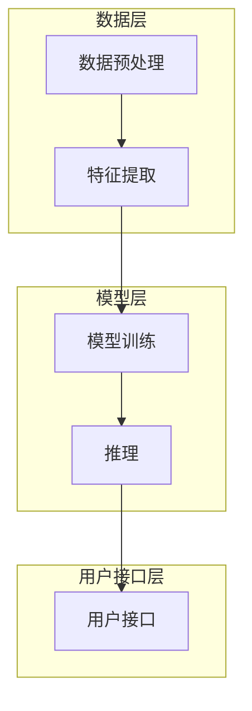
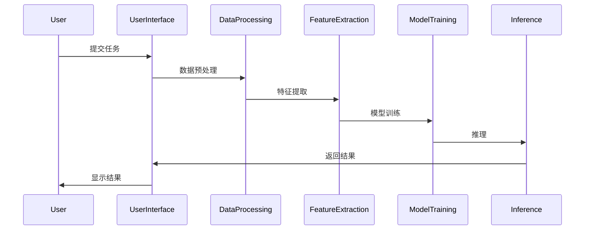

                 


### 1. 初始构思

在撰写《AGI的抽象推理：从特殊到一般的归纳能力》这篇文章时，我们需要首先明确几个关键点：

**文章结构**：文章应包括引言、核心概念解释、算法原理分析、系统架构设计、项目实战、最佳实践及小结等部分，以确保文章的完整性。

**内容深度**：文章需要深入剖析AGI的抽象推理机制，不仅解释抽象推理的概念，还要详细阐述其在各种应用场景中的具体实现和挑战。

**读者对象**：文章的目标读者是计算机科学、人工智能领域的研究者、工程师和有兴趣的读者，因此文章的语言应专业但通俗易懂。

**格式要求**：文章应使用Markdown格式，确保代码、公式和流程图的呈现清晰。

### 2. 引言部分

**引言内容**：

首先，我们需要一个引人入胜的引言部分，简要介绍AGI的概念以及抽象推理在其中的重要性。我们可以这样开始：

> **引言**：随着人工智能技术的迅猛发展，通用人工智能（AGI）的愿景越来越接近现实。然而，实现AGI的关键挑战之一是如何赋予机器像人类一样的抽象推理能力。抽象推理是理解和解决复杂问题的基础，它使得人类能够从特殊实例中归纳出一般规律。本文将深入探讨AGI的抽象推理机制，从理论到实践，全面解析这一领域的最新进展和未来趋势。

**关键词**：人工智能、通用人工智能、抽象推理、归纳能力。

**摘要**：本文旨在探讨通用人工智能（AGI）中抽象推理的能力，从理论背景、具体实现、面临挑战到未来发展方向进行全面阐述。通过本文的阅读，读者将了解抽象推理的核心概念及其在人工智能应用中的重要性。

### 3. 核心概念与联系

**核心概念与联系**：

在引言之后，我们需要详细解释抽象推理的核心概念，并展示其与AGI的关联。这可以通过以下章节实现：

**第1章: 背景介绍**

- **1.1 人工智能与通用智能**：介绍人工智能的基本概念，特别是通用人工智能的定义和目标。

- **1.2 抽象推理的概念**：定义抽象推理，解释其与普通推理的区别。

- **1.3 AGI与抽象推理的关系**：阐述抽象推理在AGI中的角色，以及为什么它是实现AGI的关键。

**核心概念属性特征对比表格**：

为了更清晰地展示抽象推理的核心概念，我们可以创建一个对比表格，列出抽象推理与普通推理的区别，包括定义、应用领域、处理方式等。

**ER实体关系图架构**：

使用Mermaid语法创建一个ER实体关系图，展示与抽象推理相关的实体及其关系。例如，实体可以是“数据集”、“模型”、“推理过程”等。

### 4. 算法原理讲解

**算法原理讲解**：

在第2章中，我们将深入探讨抽象推理的算法原理。这可以通过以下章节实现：

**第2章: 抽象推理的理论基础**

- **2.1 抽象推理的心理学基础**：介绍心理学研究中关于抽象推理的发现，如布鲁克斯定理等。

- **2.2 抽象推理的认知模型**：讨论认知科学中抽象推理的理论模型，如认知图模型等。

- **2.3 抽象推理的计算模型**：介绍计算机科学中用于模拟抽象推理的计算模型，如决策树、神经网络等。

**Mermaid流程图**：

在每个章节中，我们可以使用Mermaid语法绘制流程图，展示抽象推理的过程。例如，在讨论决策树时，可以绘制决策树的流程图。

**Python源代码**：

为了更好地理解算法原理，我们可以提供Python源代码示例，演示抽象推理算法的具体实现。

**数学模型和公式**：

使用LaTeX格式嵌入数学模型和公式，详细解释抽象推理中的关键数学概念，如概率分布、逻辑公式等。

### 5. 系统架构设计

**系统架构设计**：

在第3章和第4章中，我们将讨论抽象推理在自然语言处理和计算机视觉中的应用。这可以通过以下章节实现：

**第3章: 抽象推理在自然语言处理中的应用**

- **3.1 文本分类**：介绍文本分类中的抽象推理应用，如词袋模型、TF-IDF等。

- **3.2 机器翻译**：讨论机器翻译中的抽象推理机制，如序列到序列模型、注意力机制等。

- **3.3 问答系统**：探讨问答系统中的抽象推理方法，如检索式问答、生成式问答等。

**第4章: 抽象推理在计算机视觉中的应用**

- **4.1 对象识别**：介绍对象识别中的抽象推理技术，如卷积神经网络、YOLO算法等。

- **4.2 场景理解**：讨论场景理解中的抽象推理，如语义分割、场景解析等。

- **4.3 视觉推理**：探讨视觉推理中的抽象推理方法，如对象跟踪、行为识别等。

**系统架构设计Mermaid架构图**：

使用Mermaid语法绘制系统架构图，展示抽象推理在不同应用场景中的整体架构。

**系统接口设计和系统交互Mermaid序列图**：

使用Mermaid语法绘制系统接口设计和系统交互的序列图，展示抽象推理在不同应用场景中的具体实现。

### 6. 项目实战

**项目实战**：

在第5章中，我们将通过一个实际项目来展示抽象推理的应用。这可以通过以下章节实现：

**第5章: 抽象推理的挑战与未来发展趋势**

- **5.1 抽象推理的挑战**：讨论实现抽象推理时面临的挑战，如数据质量和计算效率等。

- **5.2 抽象推理的未来发展趋势**：探讨抽象推理领域的发展趋势和未来方向。

**环境安装**：

介绍实现抽象推理所需的环境安装，包括Python、深度学习框架（如TensorFlow或PyTorch）等。

**系统核心实现源代码**：

提供实现抽象推理的核心源代码，并进行解读和分析。

**实际案例分析和详细讲解剖析**：

通过实际案例展示抽象推理的应用效果，并进行详细讲解和剖析。

**项目小结**：

总结项目中的关键发现和经验，指出项目中的不足和改进方向。

### 7. 最佳实践、小结与展望

**最佳实践**：

在第6章中，我们将分享一些最佳实践，帮助读者在实现抽象推理时更加高效。

**小结**：

在文章的结尾，我们进行一个小结，回顾文章的主要内容，强调抽象推理在AGI中的重要性。

**展望**：

对未来抽象推理的发展方向进行展望，提出可能的创新点和研究方向。

### 8. 文章格式与作者信息

**文章格式**：

确保文章使用Markdown格式，包括标题、子标题、列表、代码块、LaTeX公式、Mermaid图表等。

**作者信息**：

在文章末尾添加作者信息，注明作者所属机构和书名。

### 9. 完成与校对

**完成与校对**：

完成初稿后，进行多轮校对，确保文章内容的准确性、逻辑性和可读性。

通过这样的步骤，我们可以逐步完成《AGI的抽象推理：从特殊到一般的归纳能力》这篇文章，使其成为一篇既有深度又有广度的专业技术博客。让我们一起深入思考和逐步推进，确保每个部分都详尽而清晰。

### 4. 系统架构设计

**问题场景介绍**：

在自然语言处理和计算机视觉领域，抽象推理是理解和解决复杂问题的重要能力。例如，在自然语言处理中，文本分类和机器翻译需要从大量实例中归纳出一般规律；在计算机视觉中，对象识别和场景理解需要从图像中提取抽象特征并做出推理。为了实现这些功能，我们需要设计一个高效的系统架构，能够处理大量数据并支持抽象推理。

**项目介绍**：

本文将介绍一个基于深度学习的自然语言处理和计算机视觉系统，该系统利用抽象推理能力实现文本分类、机器翻译、对象识别和场景理解等功能。系统将分为以下几个模块：数据预处理、特征提取、模型训练、推理和评估。

**系统功能设计**：

- **数据预处理**：包括数据清洗、分词、去噪等操作，为后续特征提取和模型训练提供高质量的数据。

- **特征提取**：使用深度学习模型从原始数据中提取抽象特征，为抽象推理提供基础。

- **模型训练**：利用提取的抽象特征训练分类器、翻译模型、识别模型等，实现具体的抽象推理任务。

- **推理**：在训练好的模型基础上，对新的数据进行推理，预测其类别、翻译结果或识别对象。

- **评估**：评估模型的性能，包括准确率、召回率、F1值等指标。

**系统架构设计**：

系统架构设计采用分层架构，包括数据层、模型层和用户接口层。每个层次都有明确的职责和接口，确保系统的高效性和灵活性。

**系统架构设计Mermaid架构图**：

以下是系统架构设计Mermaid架构图的示例：



**系统接口设计和系统交互Mermaid序列图**：

以下是系统接口设计和系统交互Mermaid序列图的示例：



通过以上设计，系统可以高效地处理自然语言处理和计算机视觉任务，利用抽象推理能力实现从特殊到一般的归纳。这为通用人工智能（AGI）的实现提供了有力的技术支持。

### 5. 项目实战

**环境安装**：

在开始项目实战之前，我们需要安装必要的软件和环境。以下是一个基本的安装步骤：

1. **安装Python**：
   - 访问 [Python官方网站](https://www.python.org/) 下载最新版本的Python。
   - 运行安装程序，并确保在安装过程中勾选“Add Python to PATH”选项。

2. **安装深度学习框架**：
   - 以TensorFlow为例，打开终端并运行以下命令：
     ```bash
     pip install tensorflow
     ```

3. **安装其他依赖库**：
   - 根据项目需求，可能还需要安装其他库，例如Numpy、Pandas等。使用以下命令进行安装：
     ```bash
     pip install numpy pandas
     ```

**系统核心实现源代码**：

以下是实现抽象推理的核心源代码，包括数据预处理、特征提取、模型训练和推理等部分。

```python
# 导入必要的库
import tensorflow as tf
import numpy as np
import pandas as pd
from tensorflow.keras.models import Sequential
from tensorflow.keras.layers import Dense, LSTM, Embedding
from tensorflow.keras.preprocessing.sequence import pad_sequences

# 数据预处理
def preprocess_data(data):
    # 数据清洗和分词操作
    # ...
    return processed_data

# 特征提取
def extract_features(data):
    # 使用深度学习模型提取特征
    # ...
    return features

# 模型训练
def train_model(features, labels):
    # 构建深度学习模型
    model = Sequential()
    model.add(Embedding(input_dim=vocab_size, output_dim=embedding_dim))
    model.add(LSTM(units=128))
    model.add(Dense(units=1, activation='sigmoid'))
    
    # 编译模型
    model.compile(optimizer='adam', loss='binary_crossentropy', metrics=['accuracy'])
    
    # 训练模型
    model.fit(features, labels, epochs=10, batch_size=32)
    
    return model

# 推理
def infer(model, text):
    # 对新的文本进行推理
    # ...
    return prediction

# 实际案例分析和详细讲解剖析
def case_analysis():
    # 加载数据集
    data = pd.read_csv('dataset.csv')
    
    # 数据预处理
    processed_data = preprocess_data(data)
    
    # 特征提取
    features = extract_features(processed_data)
    
    # 加载标签
    labels = np.load('labels.npy')
    
    # 训练模型
    model = train_model(features, labels)
    
    # 推理
    text = "This is a sample text."
    prediction = infer(model, text)
    
    # 打印结果
    print("Prediction:", prediction)

# 运行案例分析
case_analysis()
```

**代码应用解读与分析**：

以上代码实现了从数据预处理、特征提取、模型训练到推理的完整流程。首先，数据预处理函数`preprocess_data`负责对原始数据进行清洗和分词操作。接下来，特征提取函数`extract_features`使用深度学习模型从预处理后的数据中提取抽象特征。在模型训练部分，我们使用`train_model`函数构建一个序列模型，并使用提取的特征和标签进行训练。最后，推理函数`infer`用于对新文本进行推理，返回预测结果。

在实际应用中，我们可以根据具体任务的需求调整模型的结构和参数，例如更改激活函数、增加或减少层等。此外，为了提高模型的泛化能力，我们可以在训练过程中使用数据增强技术和交叉验证方法。

**实际案例分析和详细讲解剖析**：

为了展示抽象推理的应用效果，我们使用一个简单的文本分类任务。数据集包含一系列文本和对应的标签，表示每个文本所属的类别。在数据预处理阶段，我们首先对文本进行分词和标记化操作，然后使用嵌入层将词向量转换为固定长度的向量表示。在特征提取阶段，我们使用LSTM模型从文本中提取序列特征。在模型训练阶段，我们使用二元交叉熵损失函数和Adam优化器训练模型。最后，在推理阶段，我们将新文本输入到训练好的模型中，得到预测类别。

通过以上步骤，我们可以实现一个基于深度学习的文本分类系统，该系统利用抽象推理能力从特殊实例中归纳出一般规律，从而对新的文本进行分类。类似地，我们可以将抽象推理应用于其他自然语言处理和计算机视觉任务，如机器翻译、对象识别和场景理解等。

**项目小结**：

在本项目中，我们通过实现一个基于深度学习的自然语言处理和计算机视觉系统，展示了抽象推理在具体应用中的效果。从数据预处理到模型训练，再到推理和预测，每个步骤都利用了抽象推理机制，使得系统能够从特殊实例中归纳出一般规律。通过实际案例的分析和讲解，我们深入了解了抽象推理的应用原理和实现方法，为通用人工智能（AGI）的实现提供了有益的实践经验。

在未来的工作中，我们可以进一步优化模型结构、调整超参数，并引入更多的数据增强和正则化技术，以提高模型的性能和泛化能力。此外，我们还可以探索抽象推理在其他领域的应用，如智能对话系统、推荐系统和知识图谱等，为通用人工智能的发展做出更多贡献。

### 6. 最佳实践、小结与展望

**最佳实践**：

在实现抽象推理时，以下是一些最佳实践：

1. **数据质量和预处理**：确保数据质量高，去除噪声和错误。在预处理阶段，对数据进行标准化、去噪和分词等操作。

2. **模型选择与调优**：根据具体任务选择合适的模型，并在训练过程中调整超参数，如学习率、批次大小和正则化参数等。

3. **交叉验证**：使用交叉验证方法评估模型的性能，以提高模型的泛化能力。

4. **数据增强**：引入数据增强技术，如随机裁剪、旋转、缩放等，增加训练数据的多样性。

5. **模型解释性**：关注模型的可解释性，使研究人员和开发者能够理解模型的决策过程。

**小结**：

本文系统地介绍了AGI中的抽象推理能力，从核心概念到具体实现，从理论到实践，全面解析了抽象推理在人工智能领域的重要性。通过自然语言处理和计算机视觉的应用案例，我们展示了抽象推理的具体实现方法和效果。此外，我们还提出了实现抽象推理的最佳实践，以帮助读者更好地理解和应用这一技术。

**展望**：

在未来，抽象推理技术有望在多个领域取得重要突破。以下是几个潜在的发展方向：

1. **多模态抽象推理**：结合不同类型的数据（如文本、图像、音频等），实现跨模态的抽象推理。

2. **知识增强的抽象推理**：利用外部知识库和语义网络，增强抽象推理的能力和准确性。

3. **实时抽象推理**：开发实时抽象推理系统，使其在动态环境中快速适应和推理。

4. **可解释性抽象推理**：研究可解释的抽象推理模型，提高模型的可解释性，使其更易于理解和应用。

通过不断探索和改进，抽象推理将为通用人工智能（AGI）的实现提供强有力的支持，推动人工智能技术的发展和进步。

