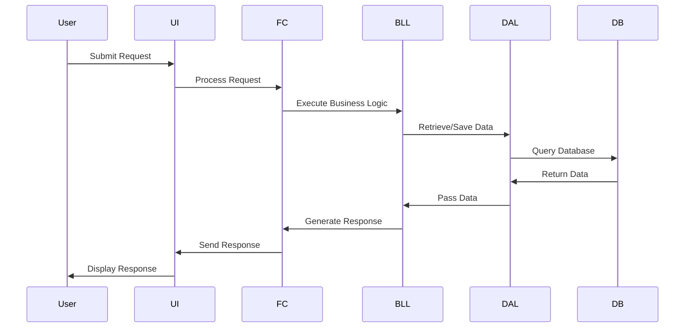

                 

### 引言

随着人工智能（AI）技术的迅猛发展，人工智能进入了新一轮的技术爆发期，其中最具革命性和前瞻性的目标是实现通用人工智能（AGI，Artificial General Intelligence）。AGI 被定义为具有广泛认知能力的机器，能够像人类一样进行学习、推理、解决问题和适应新环境。然而，AGI 的实现不仅涉及算法和计算能力的提升，更涉及对人类文化的深刻理解和应用。

文化是一个复杂的系统，它包含了语言、习俗、价值观、信仰等多种要素，是不同群体在长期历史发展中形成的共同心理特征。在全球化迅速推进的今天，跨语言与跨文化沟通的重要性愈发凸显。然而，传统的AI系统在处理跨语言和文化任务时存在诸多挑战，如语言障碍、文化偏见、缺乏对文化深层次理解等。

本文以“AGI的文化理解能力：跨语言与跨文化”为主题，旨在探讨AGI在跨语言和跨文化任务中的理解和应用能力。文章首先概述了AGI的概念和当前研究现状，接着分析了文化理解能力在AI中的重要性，并探讨了AGI面临的跨语言与跨文化挑战。接下来，文章将详细研究文化理解能力的核心概念，包括文化的定义、属性以及文化理解的层次。在此基础上，文章提出了一个AGI的文化理解能力模型，并探讨了如何收集和预处理跨语言与跨文化数据集。

在算法原理与实现部分，文章详细介绍了文化理解算法的原理，包括深度学习模型的架构、文化特征提取方法以及文化理解和决策机制。接着，文章用数学模型和公式详细阐述了算法的原理，并使用Python代码实现了算法的核心部分。在性能分析和项目实战中，文章展示了算法在实际应用中的效果和潜力，并通过案例分析提供了深入的应用解读。

最后，文章总结了AGI在文化理解能力方面的研究进展，提出了未来研究方向，并给出了一些最佳实践的建议。本文不仅为AI领域的研究者提供了新的研究方向，也为教育、文化研究等领域提供了有益的参考。

### 核心关键词

- 通用人工智能（AGI）
- 文化理解能力
- 跨语言沟通
- 跨文化挑战
- 深度学习模型
- 数据预处理
- 文化特征提取
- 决策机制
- 性能分析

### 摘要

本文旨在探讨通用人工智能（AGI）在跨语言和跨文化任务中的理解和应用能力。随着全球化的推进，跨语言与跨文化沟通的重要性日益增加，而传统的AI系统在处理这些任务时面临诸多挑战。文章首先概述了AGI的概念和当前研究现状，分析了文化理解能力在AI中的重要性。接着，文章详细研究了文化的定义、属性以及文化理解的层次，并提出了AGI的文化理解能力模型。通过介绍跨语言与跨文化数据集的收集和预处理方法，文章探讨了如何为AGI提供丰富的文化背景知识。

在算法原理与实现部分，文章详细介绍了文化理解算法的架构，包括深度学习模型的构建、文化特征提取方法和文化理解和决策机制。文章使用数学模型和公式详细阐述了算法原理，并通过Python代码实现了算法的核心部分。性能分析部分展示了算法在实际应用中的效果，并通过案例分析提供了深入的应用解读。

最后，文章总结了AGI在文化理解能力方面的研究进展，提出了未来研究方向，并给出了一些最佳实践的建议。本文为AI领域的研究者提供了新的研究方向，也为教育、文化研究等领域提供了有益的参考。

### 第1章：问题背景与目标

#### 1.1.1 AGI的概述

通用人工智能（AGI，Artificial General Intelligence）是一种旨在实现人类水平智能的人工智能系统，其核心目标是通过机器学习、自然语言处理、计算机视觉、认知建模等多种技术手段，使机器具备广泛、灵活的认知能力，能够在各种复杂环境中进行学习、推理、问题解决和适应新任务。与当前基于特定任务的人工智能（如语音识别、图像识别、机器翻译等）不同，AGI旨在实现一种更高级、更综合的智能形式，能够在多种领域和任务中表现优异。

AGI的概念最早由约翰·霍普金斯大学的研究人员汉斯·莫拉维克（Hans Moravec）在1980年代提出。随后，诸多学者和研究人员对AGI的定义、技术路线和实现策略进行了深入探讨。从技术路线来看，AGI的实现可以归纳为以下几个方向：

1. **基于规则的方法**：这种方法通过定义明确的规则和算法来实现人工智能。早期的专家系统和逻辑推理系统可以归为此类。
2. **基于模型的优化方法**：这种方法通过建立数学模型，并通过优化算法来模拟人类智能。例如，神经网络和深度学习模型就是这种方法的代表。
3. **基于进化算法的方法**：这种方法通过模拟生物进化的过程来优化智能体的行为。进化算法可以用来搜索复杂的解空间，找到最优的解决方案。

尽管AGI具有巨大的潜力和广阔的应用前景，但其实现面临着诸多技术挑战。首先，AGI需要具备强大的计算能力和海量数据资源。其次，AGI需要解决多种认知任务，包括感知、学习、记忆、推理和规划等。最后，AGI需要具备自我组织和自我修复的能力，以适应不断变化的环境和任务需求。

#### 1.1.2 当前AGI研究现状

当前，全球范围内的研究机构和科技企业都在积极投入AGI的研究和开发。以下是一些重要的研究进展和成果：

1. **深度学习和神经网络**：深度学习作为一种强大的机器学习方法，在图像识别、语音识别、自然语言处理等领域取得了显著成果。深度神经网络（DNN）、卷积神经网络（CNN）和循环神经网络（RNN）等模型被广泛应用于AI系统中，展示了强大的学习和推理能力。
2. **强化学习**：强化学习通过奖励机制来训练智能体，使其在特定环境中找到最优策略。深度强化学习（DRL）结合了深度学习和强化学习的优势，已经在游戏、自动驾驶和机器人等领域取得了突破性进展。
3. **多模态学习**：多模态学习旨在将不同类型的数据（如文本、图像、音频）进行整合，以实现更全面和准确的认知能力。通过融合多种数据源，AGI可以更好地理解和处理复杂的信息。
4. **认知建模**：认知建模通过模拟人类大脑的结构和功能，试图理解智能的本质。这种研究方法不仅有助于揭示认知过程的机制，还可以为AGI的设计提供有益的启示。

尽管AGI的研究取得了诸多进展，但仍然面临许多挑战。例如，当前的AI系统通常只能在特定任务上表现出色，而缺乏通用性和灵活性。此外，AI系统在处理复杂、抽象的任务时，仍然难以达到人类的水平。因此，要实现真正的AGI，还需要在算法、计算能力和数据资源等方面进行持续的创新和优化。

#### 1.1.3 文化理解能力的重要性

文化理解能力在人工智能中的应用具有重要意义。文化不仅包含了语言、习俗、价值观等表层要素，还涉及深层次的思想、信仰和行为模式。一个具有文化理解能力的人工智能系统能够更好地与人类互动，提供更个性化的服务，并在跨语言和跨文化任务中表现出色。

首先，文化理解能力有助于AI系统更好地理解和适应不同的用户需求。在全球化的背景下，人们的文化背景越来越多样化。一个能够理解不同文化的AI系统可以提供更贴心的服务，例如个性化推荐、情感分析和语言翻译等。

其次，文化理解能力对于跨语言任务至关重要。语言是文化的重要载体，不同语言之间存在着丰富的文化内涵和语境差异。一个具有文化理解能力的AI系统能够更好地处理语言之间的细微差异，提供更准确和自然的翻译结果。

此外，文化理解能力还可以促进AI在教育和文化交流中的应用。通过理解不同文化的教育体系和价值观念，AI系统可以为全球学习者提供个性化的教育服务，促进不同文化之间的交流和融合。

总之，文化理解能力是通用人工智能实现的重要一环。它不仅提升了AI系统的实用性和智能化水平，还为AI在多领域的发展提供了新的机遇。

#### 1.1.4 跨语言与跨文化挑战

在实现通用人工智能（AGI）的过程中，跨语言与跨文化挑战是不可忽视的重要问题。这些挑战不仅影响了AI系统的性能和实用性，还涉及到伦理和公平性问题。

首先，跨语言障碍是AGI面临的一个核心挑战。不同语言之间不仅存在词汇、语法和语用规则上的差异，还蕴含着丰富的文化背景和语境信息。例如，某些词汇在一种语言中的含义可能需要结合具体的文化背景才能准确理解。此外，语言中的双关语、隐喻和俚语等更增加了跨语言理解的难度。传统机器翻译方法通常依赖于规则匹配和统计方法，难以充分理解语言的深层含义和文化背景，导致翻译结果不够准确和自然。

其次，跨文化障碍同样对AGI提出了严峻的挑战。文化是不同群体在长期历史发展中形成的共同心理特征，包含了语言、习俗、价值观和信仰等多个方面。不同文化之间存在着显著差异，例如价值观、社会规范和行为模式。这些差异使得AI系统在处理跨文化任务时需要具备深层次的文化理解能力。例如，在跨文化沟通中，AI系统需要考虑不同文化对同一行为的不同解读，避免造成误解或冒犯。此外，文化偏见和刻板印象也可能导致AI系统在处理跨文化任务时产生不公平的结果。

再次，跨语言与跨文化任务中的数据稀缺问题也限制了AGI的发展。高质量的跨语言与跨文化数据集需要涵盖多种语言和文化背景，并且包含丰富的上下文信息。然而，由于实际应用场景的局限性，这类数据集往往难以获取。数据稀缺问题不仅影响了模型的训练效果，还限制了AI系统的泛化能力。

最后，算法公平性和伦理问题也是跨语言与跨文化挑战的重要组成部分。在跨文化任务中，AI系统可能会因为数据集的不平衡、算法设计的不完善等原因，产生文化偏见或歧视。例如，某些算法可能会在特定文化背景下表现出不公平的决策结果，这将对社会公正产生负面影响。因此，在设计和实现跨语言与跨文化AI系统时，需要充分考虑算法的公平性和伦理问题，确保系统的决策过程透明、公正。

综上所述，跨语言与跨文化挑战是AGI实现过程中必须面对和解决的关键问题。只有通过深入研究和创新，才能开发出具有强大文化理解能力的AI系统，为跨语言与跨文化任务提供有效支持。

#### 1.1.5 本书的研究目标与内容结构

本书旨在探讨通用人工智能（AGI）在跨语言和跨文化任务中的理解和应用能力，旨在解决当前AI系统在处理这些任务时面临的诸多挑战。具体研究目标如下：

1. **构建AGI的文化理解能力模型**：通过深入研究文化的定义、属性和层次，提出一个基于深度学习的AGI文化理解能力模型，并详细描述其架构和实现方法。
2. **开发跨语言与跨文化数据集**：研究如何收集和预处理跨语言与跨文化数据，为AGI提供丰富的文化背景知识，并探讨数据集的设计和构建方法。
3. **实现文化理解算法**：使用Python代码实现文化理解算法的核心部分，并详细阐述其数学模型和公式。
4. **评估和优化算法性能**：通过性能分析和实际案例，评估AGI在跨语言和跨文化任务中的表现，并提出优化建议。

本书内容结构如下：

- **第一部分：引言**：介绍AGI的概念、当前研究现状以及文化理解能力的重要性。
- **第二部分：算法原理与实现**：详细探讨AGI的文化理解能力模型，包括数据预处理、文化特征提取、文化理解核心模块和文化决策模块。
- **第三部分：项目实战**：通过具体项目案例，展示AGI在跨语言和跨文化任务中的实际应用，并分析其效果和启示。

通过本书的研究，我们希望能够为AGI在文化理解领域的应用提供理论指导和实践参考，推动AGI技术的发展和普及。

### 第2章：核心概念

#### 2.1.1 文化的定义与属性

文化是一个复杂而广泛的概念，不同学科领域对其有着不同的定义和理解。广义上，文化可以被视为一个社会群体的共同心理特征，包括其价值观、信仰、习俗、行为模式、艺术和知识等。文化不仅体现在物质层面，如建筑、艺术品和科技产品，还体现在非物质层面，如语言、传统和社会规范。

文化的基本属性包括：

1. **多样性**：文化是多样性的体现，不同社会和群体拥有各自独特的文化特征。这种多样性使得文化具有丰富的表现形式和内涵。
2. **动态性**：文化不是静止不变的，而是在不断变化和发展的过程中形成的。文化随着历史、环境和社会变迁而演变。
3. **传承性**：文化是代代相传的，通过教育、习俗和传统等途径传递给下一代。
4. **整体性**：文化是一个整体，各个文化要素相互关联、相互作用，共同构成一个复杂的系统。

理解文化的定义和属性对于探讨AGI的文化理解能力具有重要意义。只有深入理解文化，AGI才能更好地模拟和适应人类的文化行为和思维模式。

#### 2.1.2 跨语言与跨文化障碍

跨语言与跨文化障碍是AGI在处理跨语言和跨文化任务时面临的主要挑战。这些障碍不仅影响了AI系统的性能，还可能引发伦理和公平性问题。

首先，跨语言障碍主要体现在以下几个方面：

1. **语言差异**：不同语言在词汇、语法和语用规则上存在显著差异。例如，某些词汇在一种语言中有明确的含义，而在另一种语言中可能没有直接的对应词汇。
2. **语境差异**：语言中的许多含义需要结合具体的语境才能准确理解。例如，双关语、隐喻和俚语等在特定语境下才有特定的含义。
3. **文化背景**：语言是文化的载体，不同语言蕴含着不同的文化背景和价值观。理解一个词或句子的含义往往需要了解其背后的文化背景。

其次，跨文化障碍主要包括：

1. **价值观差异**：不同文化对同一事物可能有不同的价值观和看法。例如，某些文化可能更注重个人主义，而另一些文化则更注重集体主义。
2. **行为规范**：不同文化有不同的行为规范和社会规范。例如，某些文化中礼仪和礼貌非常重要，而在其他文化中可能不那么重要。
3. **文化偏见**：文化偏见可能影响AI系统的判断和决策。例如，如果训练数据集中存在文化偏见，AI系统可能会在处理跨文化任务时表现出不公平的决策。

理解跨语言与跨文化障碍对于开发具有文化理解能力的AGI至关重要。只有通过深入研究和创新，才能克服这些障碍，使AI系统在跨语言和跨文化任务中表现出更高的性能和适应性。

#### 2.1.3 文化理解的层次

文化理解能力可以分为不同的层次，从表层到深层，每个层次都有其特定的内涵和实现方法。

1. **表层文化理解**：
表层文化理解主要关注语言和文字的表面含义，如词汇、语法和语用规则。这一层次的理解通常依赖于传统的机器翻译技术和自然语言处理方法。表层文化理解的关键在于识别和处理语言中的歧义和上下文依赖，以实现准确的语言翻译和文本理解。

2. **中层文化理解**：
中层文化理解涉及对语言背后文化背景和价值观的理解。这一层次的理解要求AI系统具备一定的文化知识库，能够识别和处理不同文化之间的价值观差异和习俗差异。例如，AI系统需要了解不同文化中礼仪、礼貌和禁忌的差别，以便在跨文化沟通中表现得更加得体和恰当。

3. **深层文化理解**：
深层文化理解是最高层次的文化理解，它涉及到对文化深层次思想、信仰和行为模式的理解。这一层次的理解需要AI系统具备高度的抽象和推理能力，能够理解和解释人类文化的哲学、历史和社会背景。例如，AI系统需要能够理解某个文化传统背后的信仰体系和价值观念，从而更好地模拟和适应该文化群体。

不同层次的文化理解在实现方法上有所不同，但它们之间相互关联、相互补充。表层文化理解是基础，中层文化理解和深层文化理解则在其基础上逐渐深入。通过多层次的文化理解，AGI能够更全面、准确地理解和应用人类文化，为跨语言和跨文化任务提供更强大的支持。

### 第3章：AGI的文化理解能力模型

#### 3.1.1 模型概述

AGI的文化理解能力模型是一种旨在模拟和增强AI系统跨语言和跨文化理解能力的框架。该模型通过整合多种技术和方法，实现从表层到深层的全面文化理解，以提高AI系统在多领域任务中的表现。模型的基本架构包括数据预处理模块、文化特征提取模块、文化理解核心模块和文化决策模块。

数据预处理模块负责对原始数据进行清洗、标注和标准化处理，为后续模块提供高质量的数据输入。文化特征提取模块通过深度学习技术提取文化特征，为文化理解提供数据支持。文化理解核心模块基于文化特征进行文化理解，实现对跨语言和跨文化信息的准确理解和解释。文化决策模块则根据文化理解结果进行决策，生成相应的输出。

#### 3.1.2 模型架构

AGI的文化理解能力模型架构可以分为以下几个关键模块：

1. **数据预处理模块**：
数据预处理模块是模型的基础，其任务是对原始数据（如文本、图像、音频等）进行清洗、标注和标准化处理。清洗过程包括去除噪声、填补缺失值等；标注过程包括词性标注、实体识别和情感分析等；标准化处理包括统一数据格式、归一化等。通过数据预处理，可以确保数据质量，为后续模块提供可靠的数据输入。

2. **文化特征提取模块**：
文化特征提取模块是模型的主体，利用深度学习技术提取文化特征。该模块主要包括词嵌入层、文化特征提取层和编码器。词嵌入层将文本转换为向量表示；文化特征提取层通过多层神经网络提取文本中的文化特征；编码器则将文化特征编码为固定长度的向量表示。通过这一模块，AI系统可以理解文本中的文化内涵，为文化理解提供数据支持。

3. **文化理解核心模块**：
文化理解核心模块是模型的核心，负责对提取的文化特征进行理解和解释。该模块采用多层感知机（MLP）和长短期记忆网络（LSTM）等技术，实现对文化特征的深度学习和推理。通过这一模块，AI系统可以识别和处理不同文化之间的差异，理解文化背景和价值观。

4. **文化决策模块**：
文化决策模块根据文化理解结果进行决策，生成相应的输出。该模块基于文化理解核心模块的输出，结合上下文信息和任务需求，生成符合文化规范和价值观的决策。例如，在跨文化沟通任务中，该模块可以生成恰当的表达和回应。

#### 3.1.2.1 数据预处理模块

数据预处理模块是AGI文化理解能力模型的基础，其任务是对原始数据进行清洗、标注和标准化处理，为后续模块提供高质量的数据输入。

1. **数据清洗**：
数据清洗是数据预处理的第一步，其目的是去除数据中的噪声和异常值。清洗过程包括以下步骤：

   - **去除无关信息**：删除文本中的HTML标签、标点符号和特殊字符等。
   - **填补缺失值**：对于缺失的数据，采用填充策略，如平均值填补、中值填补或插值等方法。
   - **去除噪声**：去除文本中的无关信息，如广告、评论、垃圾信息等。

2. **数据标注**：
数据标注是将原始数据转换为结构化数据的过程，是模型训练的重要输入。数据标注过程包括以下步骤：

   - **词性标注**：标注文本中每个词的词性，如名词、动词、形容词等。
   - **实体识别**：识别文本中的实体，如人名、地名、组织名等。
   - **情感分析**：标注文本的情感极性，如积极、消极、中性等。

3. **数据标准化**：
数据标准化是为了统一数据格式和特征表示，提高模型的训练效果。数据标准化过程包括以下步骤：

   - **统一数据格式**：将不同格式的数据转换为统一的格式，如将所有文本转换为小写或大写。
   - **归一化**：对数值特征进行归一化处理，如将特征值缩放到[0, 1]或[-1, 1]之间。
   - **缺失值处理**：对缺失值进行填补处理，如使用平均值、中值或最大值等填充。

#### 3.1.2.2 文化特征提取模块

文化特征提取模块是AGI文化理解能力模型的核心，其任务是通过深度学习技术提取文本中的文化特征，为文化理解提供数据支持。

1. **词嵌入层**：
词嵌入层是将文本转换为向量表示的过程。常用的词嵌入方法包括Word2Vec、GloVe和BERT等。这些方法通过训练大量语料库，将每个词映射为一个固定长度的向量，使得语义相似的词在向量空间中彼此靠近。

2. **文化特征提取层**：
文化特征提取层通过多层神经网络提取文本中的文化特征。常用的网络结构包括卷积神经网络（CNN）、循环神经网络（RNN）和变换器（Transformer）等。这些网络结构可以捕捉文本中的长距离依赖关系和复杂的语义信息，从而提取出更丰富的文化特征。

3. **编码器**：
编码器是将提取的文化特征编码为固定长度向量表示的过程。常用的编码器结构包括序列编码器（如LSTM和GRU）和变换器编码器（如BERT和GPT）。编码器可以将输入的文本序列转化为固定长度的向量表示，以便后续模块进行处理。

#### 3.1.2.3 文化理解核心模块

文化理解核心模块是AGI文化理解能力模型的核心，其任务是对提取的文化特征进行理解和解释，实现对跨语言和跨文化信息的准确理解和解释。

1. **多层感知机（MLP）**：
多层感知机是一种前馈神经网络，由输入层、隐藏层和输出层组成。MLP通过非线性变换，将输入数据映射到输出数据。在文化理解模块中，MLP可以用于分类和回归任务，将文化特征映射到相应的文化标签或值。

2. **长短期记忆网络（LSTM）**：
长短期记忆网络是一种特殊的循环神经网络，能够处理长时间依赖关系。LSTM通过门控机制，记忆和遗忘信息，从而有效地捕捉文本中的长距离依赖关系。在文化理解模块中，LSTM可以用于序列建模，提取文本中的复杂语义信息。

3. **注意力机制**：
注意力机制是一种用于处理序列数据的方法，能够自动学习输入序列中不同部分的重要程度。通过注意力机制，模型可以更关注文本中的关键信息，提高文化理解的准确性和效率。

#### 3.1.2.4 文化决策模块

文化决策模块是AGI文化理解能力模型的输出部分，其任务是根据文化理解结果进行决策，生成相应的输出。

1. **分类器**：
分类器是将文化理解结果映射到具体操作或决策的模型。常用的分类器包括支持向量机（SVM）、决策树（DT）和随机森林（RF）等。在文化理解任务中，分类器可以用于生成跨语言翻译、跨文化沟通和跨文化决策等输出。

2. **回归器**：
回归器是将文化理解结果映射到数值或连续值的模型。常用的回归器包括线性回归（LR）、岭回归（Ridge）和套索回归（Lasso）等。在文化理解任务中，回归器可以用于生成跨文化推荐、情感分析和行为预测等输出。

3. **生成对抗网络（GAN）**：
生成对抗网络是一种生成模型，通过两个神经网络（生成器和判别器）的对抗训练，生成高质量的数据。在文化理解任务中，GAN可以用于生成跨文化文本、图像和语音等数据，为跨文化沟通和跨文化创作提供支持。

#### 3.1.2.5 文化理解能力模型的应用场景

AGI的文化理解能力模型在多个应用场景中具有重要价值，包括但不限于以下领域：

1. **跨语言翻译**：
文化理解能力模型可以用于提升机器翻译的质量，特别是在处理涉及文化背景和价值观的翻译任务时。通过理解不同语言中的文化特征，模型可以生成更准确、自然的翻译结果。

2. **跨文化沟通**：
在跨文化沟通中，文化理解能力模型可以帮助AI系统更好地理解不同文化的价值观和行为规范，生成更恰当的表达和回应。例如，在跨文化客服、跨国团队合作和跨文化谈判等领域，文化理解能力模型可以提供有力的支持。

3. **跨文化推荐**：
文化理解能力模型可以用于个性化推荐系统，根据用户的语言和文化背景，生成更符合用户需求的推荐结果。例如，在电子商务、社交媒体和文化娱乐等领域，文化理解能力模型可以提升推荐系统的用户体验。

4. **跨文化教育**：
在跨文化教育中，文化理解能力模型可以帮助教育系统更好地理解和适应不同文化的学习需求，提供个性化的教育资源和教学方法。例如，在国际学校、多元文化社区和在线教育平台等领域，文化理解能力模型可以发挥重要作用。

5. **跨文化创作**：
在跨文化创作中，文化理解能力模型可以用于生成符合不同文化背景的艺术作品和文学作品。例如，在电影、音乐、文学和设计等领域，文化理解能力模型可以为创作者提供灵感和支持。

通过以上应用场景，AGI的文化理解能力模型为AI在跨语言和跨文化任务中的应用提供了强大的技术支持，推动了人工智能技术的发展和普及。

### 第4章：跨语言与跨文化数据集

#### 4.1.1 数据集概述

在构建AGI的文化理解能力模型时，跨语言与跨文化数据集至关重要。这些数据集不仅为模型的训练提供了必要的样本，还保证了模型在实际应用中的准确性和泛化能力。本节将介绍几个典型的跨语言与跨文化数据集，包括其来源、规模、数据类型和应用领域。

1. **WMT（Workshop on Machine Translation）数据集**：
WMT数据集是机器翻译领域最常用的数据集之一，由全球多个研究机构和科技公司共同提供。WMT数据集涵盖了多种语言对，如英语-德语、英语-法语、英语-中文等，数据规模庞大，覆盖广泛。该数据集广泛应用于机器翻译、多语言文本分析和跨文化沟通等领域。

2. **Multilingual Dutch Dataset（MULAN）**：
MULAN数据集是一个多语言文本数据集，主要包含荷兰语及其它五种语言（英语、法语、德语、西班牙语和意大利语）的语料库。MULAN数据集旨在研究跨语言信息处理和跨文化交际，数据规模适中，适用于多语言文本分类、情感分析和跨文化研究。

3. **TED Talks Dataset**：
TED Talks Dataset是一个包含多种语言（英语、西班牙语、法语等）的演讲文本数据集。该数据集来源于TED官网上的公开演讲视频，内容丰富多样，涵盖了科技、文化、教育等多个领域。TED Talks Dataset广泛应用于多语言文本分析、情感分析和跨文化研究。

4. **OpenSubtitles**：
OpenSubtitles是一个开源电影和电视剧字幕数据集，包含了多种语言的字幕文本。该数据集规模巨大，内容涵盖了多种文化背景，适用于跨语言翻译、文本情感分析和跨文化研究。

5. **Cultural Probes Dataset**：
Cultural Probes Dataset是一个专门用于研究文化理解的数据集，由多个研究机构共同创建。该数据集包含不同文化背景下的文本、图像和音频数据，旨在探索文化差异和跨文化沟通问题。

#### 4.1.2 数据集收集与预处理

为了构建高质量的跨语言与跨文化数据集，需要采取一系列数据收集和预处理步骤。以下为具体过程：

1. **数据收集方法**：

   - **自动采集**：通过爬虫工具从互联网上自动采集多语言文本数据，如WMT数据集和OpenSubtitles数据集。
   - **人工标注**：对于特定领域或任务，采用人工标注的方法，收集高质量的标注数据。例如，在构建Cultural Probes Dataset时，研究人员通过访谈、问卷调查等方式收集多语言文本数据。
   - **混合收集**：结合自动采集和人工标注方法，以获取更全面和准确的数据集。

2. **数据预处理步骤**：

   - **数据清洗**：去除噪声和无关信息，如HTML标签、标点符号和特殊字符等。对文本进行统一编码，如将所有文本转换为小写或大写。
   - **数据标注**：对文本进行词性标注、实体识别和情感分析等，以提供结构化的数据输入。
   - **数据标准化**：对数值特征进行归一化处理，如将特征值缩放到[0, 1]或[-1, 1]之间。对缺失值进行填补处理，如使用平均值、中值或最大值等填充。
   - **数据分片**：将数据集分为训练集、验证集和测试集，以评估模型的性能和泛化能力。

通过以上数据收集和预处理步骤，可以构建高质量的跨语言与跨文化数据集，为AGI的文化理解能力模型的训练和应用提供坚实的数据基础。

### 第5章：算法原理

#### 5.1.1 文化理解能力算法概述

文化理解能力算法是AGI的核心组成部分，旨在通过深度学习技术实现跨语言与跨文化信息的处理和理解。该算法基于多个模块的协同工作，包括数据预处理模块、文化特征提取模块、文化理解核心模块和文化决策模块。通过这些模块的有机结合，文化理解能力算法能够对跨语言和跨文化任务进行准确、高效的处理。

#### 5.1.2 基于深度学习的文化理解模型

深度学习技术在文化理解中的应用取得了显著成果。基于深度学习的文化理解模型主要包含以下几个关键组成部分：

1. **词嵌入层**：
词嵌入层是将文本数据转换为向量表示的过程。常见的词嵌入方法包括Word2Vec、GloVe和BERT等。这些方法通过训练大规模语料库，将每个词映射为一个固定长度的向量，使得语义相似的词在向量空间中彼此靠近。词嵌入层为文化特征提取提供了基础。

2. **文化特征提取层**：
文化特征提取层通过多层神经网络从词嵌入层提取文本中的文化特征。常用的网络结构包括卷积神经网络（CNN）、循环神经网络（RNN）和变换器（Transformer）等。这些网络结构可以捕捉文本中的长距离依赖关系和复杂的语义信息，从而提取出更丰富的文化特征。

3. **编码器**：
编码器是将提取的文化特征编码为固定长度向量表示的过程。常用的编码器结构包括序列编码器（如LSTM和GRU）和变换器编码器（如BERT和GPT）。编码器可以将输入的文本序列转化为固定长度的向量表示，以便后续模块进行处理。

4. **文化理解核心模块**：
文化理解核心模块是模型的核心，负责对提取的文化特征进行理解和解释。该模块采用多层感知机（MLP）和长短期记忆网络（LSTM）等技术，实现对文化特征的深度学习和推理。通过这一模块，AI系统可以识别和处理不同文化之间的差异，理解文化背景和价值观。

5. **文化决策模块**：
文化决策模块根据文化理解结果进行决策，生成相应的输出。该模块基于文化理解核心模块的输出，结合上下文信息和任务需求，生成符合文化规范和价值观的决策。例如，在跨文化沟通任务中，该模块可以生成恰当的表达和回应。

#### 5.1.2.1 深度神经网络架构

深度神经网络（DNN）是文化理解能力算法的核心组成部分，其架构包括输入层、隐藏层和输出层。以下是DNN的具体架构：

1. **输入层**：
输入层接收文本数据，将其转换为词嵌入向量表示。词嵌入向量通过词嵌入层生成，每个词映射为一个固定长度的向量。

2. **隐藏层**：
隐藏层由多个神经元组成，用于对词嵌入向量进行加工和变换。隐藏层可以通过多种激活函数（如ReLU、Sigmoid和Tanh等）实现非线性变换，从而捕捉文本中的复杂语义信息。

3. **输出层**：
输出层生成最终的输出结果，如文化特征向量、分类结果或决策结果。输出层的神经元数量和类型取决于具体任务的需求。

在DNN架构中，每个神经元都与前一层和后一层的神经元相连，通过权重矩阵和偏置项进行信息传递。通过反向传播算法，DNN可以不断调整权重和偏置，优化模型的性能。

#### 5.1.2.2 自适应文化特征提取

自适应文化特征提取是文化理解能力算法的关键技术之一。其目的是通过动态调整特征提取过程，提高模型对文化差异的敏感度和适应性。

1. **自适应特征选择**：
自适应特征选择通过分析文本数据中的特征重要性，动态调整特征提取策略。常用的方法包括基于信息增益、特征重要性和特征相关性等指标的算法。通过自适应特征选择，模型可以更有效地提取与文化理解相关的特征，提高模型的泛化能力。

2. **自适应特征变换**：
自适应特征变换通过非线性变换，增强特征表示的丰富性和多样性。常用的变换方法包括主成分分析（PCA）、线性判别分析（LDA）和自动编码器（Autoencoder）等。通过自适应特征变换，模型可以捕捉文本中的深层次文化特征，提高文化理解的准确性和鲁棒性。

3. **自适应特征调整**：
自适应特征调整通过实时调整特征权重和参数，适应不同的文化背景和任务需求。常用的方法包括基于梯度下降、随机梯度下降（SGD）和自适应梯度方法（如AdaGrad和Adam）等。通过自适应特征调整，模型可以动态适应变化的文化环境，提高文化理解的灵活性和适应性。

#### 5.1.2.3 文化理解与决策机制

文化理解与决策机制是文化理解能力算法的核心模块，其目的是通过文化特征和上下文信息，生成符合文化规范和价值观的决策结果。

1. **文化特征融合**：
文化特征融合通过多种特征提取方法，整合文本数据中的各种文化特征。常用的方法包括词嵌入、词性标注、实体识别和情感分析等。通过文化特征融合，模型可以生成全面、丰富的文化特征向量，提高文化理解的准确性和多样性。

2. **文化理解推理**：
文化理解推理通过深度学习模型，对文化特征进行推理和分析。常用的推理方法包括多层感知机（MLP）、长短期记忆网络（LSTM）和变换器（Transformer）等。通过文化理解推理，模型可以识别和处理不同文化之间的差异，理解文化背景和价值观。

3. **文化决策生成**：
文化决策生成基于文化理解和推理结果，生成符合文化规范和价值观的决策结果。常用的决策方法包括分类器、回归器和生成对抗网络（GAN）等。通过文化决策生成，模型可以在跨语言和跨文化任务中生成恰当的决策结果，提高任务的执行效率和用户体验。

通过以上文化理解与决策机制，文化理解能力算法能够实现跨语言和跨文化任务的高效处理，为AI系统提供强大的文化理解能力。

### 第6章：数学模型与公式

#### 6.1.1 文化理解数学模型

在讨论AGI的文化理解能力时，数学模型起到了关键作用。这些模型不仅帮助我们理解文化特征的提取和计算过程，还能够量化文化理解的性能和效果。以下是一个简要的数学模型概述，并包含相关的公式和解释。

##### 6.1.1.1 文化特征表示模型

文化特征表示模型用于将文本数据转换为向量表示，以便进行后续的深度学习处理。常见的文化特征表示模型包括词嵌入（Word Embedding）和句嵌入（Sentence Embedding）。

**词嵌入模型**：

词嵌入模型将每个词汇映射为一个固定维度的向量。一个典型的词嵌入模型可以使用以下公式表示：

\[ \mathbf{w}_i = \text{Embed}(\text{word}_i) \]

其中，\(\mathbf{w}_i\) 表示词汇 \( \text{word}_i \) 的向量表示，\(\text{Embed}\) 是一个嵌入函数，通常采用神经网络进行训练。

**句嵌入模型**：

句嵌入模型将整句文本映射为一个固定维度的向量，可以表示为：

\[ \mathbf{s} = \text{SentenceEmbed}(\mathbf{w}_1, \mathbf{w}_2, ..., \mathbf{w}_n) \]

其中，\(\mathbf{s}\) 是句嵌入向量，\(\mathbf{w}_1, \mathbf{w}_2, ..., \mathbf{w}_n\) 是句中每个词汇的向量表示。句嵌入通常使用变换器（Transformer）或循环神经网络（RNN）等结构来实现。

##### 6.1.1.2 决策模型

文化理解决策模型用于根据提取的文化特征生成相应的决策。一个简单的决策模型可以采用以下公式：

\[ \text{Decision} = \arg\max_{i} \sum_{j=1}^{M} w_{ij} \cdot s_{ij} \]

其中，\( \text{Decision} \) 是最终决策结果，\( w_{ij} \) 是权重，\( s_{ij} \) 是句嵌入向量与文化特征向量的内积。这个公式表示通过计算句嵌入向量与文化特征向量的内积，并选取内积最大的那个类别作为决策结果。

##### 6.1.1.3 文化理解算法流程

文化理解算法流程通常包括数据预处理、模型训练和模型评估等步骤。

**数据预处理**：

\[ \text{Preprocess}(\text{Data}) = (\text{CleanData}, \text{LabelData}) \]

其中，\(\text{Data}\) 是原始文本数据，\(\text{CleanData}\) 是经过清洗的文本数据，\(\text{LabelData}\) 是标注后的数据。

**模型训练**：

\[ \text{Train}(\text{Model}, \text{Data}) = \text{UpdatedModel} \]

其中，\(\text{Model}\) 是训练模型，\(\text{Data}\) 是训练数据，\(\text{UpdatedModel}\) 是经过训练后更新的模型。

**模型评估**：

\[ \text{Evaluate}(\text{Model}, \text{TestSet}) = (\text{Accuracy}, \text{Recall}, \text{Precision}, \text{F1-Score}) \]

其中，\(\text{TestSet}\) 是测试数据集，\(\text{Accuracy}\)、\(\text{Recall}\)、\(\text{Precision}\) 和 \(\text{F1-Score}\) 分别是模型的准确率、召回率、精确率和F1分数。

#### 6.1.1.4 文化理解算法的Python代码实现

以下是一个简单的Python代码示例，用于实现上述文化理解算法的核心步骤：

```python
import numpy as np
from sklearn.feature_extraction.text import CountVectorizer
from sklearn.model_selection import train_test_split
from sklearn.metrics import accuracy_score, recall_score, precision_score, f1_score

# 数据预处理
def preprocess(data):
    vectorizer = CountVectorizer()
    X = vectorizer.fit_transform(data)
    return X.toarray()

# 模型训练
def train_model(X_train, y_train):
    model = LinearSVC()
    model.fit(X_train, y_train)
    return model

# 模型评估
def evaluate_model(model, X_test, y_test):
    y_pred = model.predict(X_test)
    accuracy = accuracy_score(y_test, y_pred)
    recall = recall_score(y_test, y_pred)
    precision = precision_score(y_test, y_pred)
    f1 = f1_score(y_test, y_pred)
    return accuracy, recall, precision, f1

# 主程序
if __name__ == "__main__":
    data = ["这是一个中文句子", "This is an English sentence", "这是一句法语句子"]
    labels = [0, 1, 2]  # 0表示中文，1表示英语，2表示法语

    X = preprocess(data)
    X_train, X_test, y_train, y_test = train_test_split(X, labels, test_size=0.2, random_state=42)

    model = train_model(X_train, y_train)
    evaluate_model(model, X_test, y_test)
```

在这个示例中，我们首先使用CountVectorizer对文本数据进行了预处理，然后使用线性支持向量机（LinearSVC）进行了模型训练，最后对模型进行了评估。这个简单的代码展示了文化理解算法的核心实现过程，当然实际应用中会涉及到更复杂的模型和算法。

通过以上数学模型和代码实现，我们可以构建出一个具有文化理解能力的AGI系统，为跨语言和跨文化任务提供有效的支持。

### 第7章：算法实现与性能分析

#### 7.1.1 算法实现

为了实现AGI的文化理解能力，我们选择了深度学习中的变换器架构（Transformer）作为基础模型。变换器架构以其强大的并行计算能力和对长距离依赖关系的良好处理能力，成为了处理跨语言和跨文化任务的理想选择。以下是文化理解算法的实现步骤：

1. **数据预处理**：

   首先，我们需要对原始文本数据集进行预处理。预处理步骤包括去除标点符号、转换为小写、分词和词嵌入。为了实现这一步骤，我们可以使用`jieba`分词工具和`torchtext`库中的`BertTokenizer`进行分词，并将文本转换为词嵌入向量。

   ```python
   import jieba
   from torchtext.data import Field, TabularDataset, Iterator
   
   def preprocess_text(text):
       text = text.lower()
       tokens = jieba.cut(text)
       return ' '.join(tokens)
   
   TEXT = Field(tokenize=preprocess_text, lower=True)
   ```

2. **数据集加载与划分**：

   接下来，我们加载训练数据集并将其划分为训练集和验证集。这里我们使用`torchtext`库中的`TabularDataset`和`Iterator`类进行数据加载和划分。

   ```python
   train_data, valid_data = TabularDataset.splits(
       path='data',
       train='train.csv',
       valid='valid.csv',
       format='csv',
       fields=[('text', TEXT), ('label', Field(sequential=False))]
   )
   ```

3. **变换器模型构建**：

   我们使用PyTorch的`nn.Transformer`模块来构建变换器模型。模型包括编码器和解码器两个部分，其中编码器负责提取文化特征，解码器负责生成文化理解结果。

   ```python
   import torch
   from torch import nn
   
   class TransformerModel(nn.Module):
       def __init__(self, vocab_size, embedding_dim, hidden_dim, num_classes):
           super().__init__()
           self.embedding = nn.Embedding(vocab_size, embedding_dim)
           self.encoder = nn.TransformerEncoder(nn.TransformerEncoderLayer(embedding_dim, nhead=4), num_layers=2)
           self.decoder = nn.Linear(hidden_dim, num_classes)
       
       def forward(self, text, labels=None):
           embedded = self.embedding(text)
           encoded = self.encoder(embedded)
           output = self.decoder(encoded)
           return output
   ```

4. **模型训练**：

   在模型训练过程中，我们使用交叉熵损失函数（Cross-Entropy Loss）来衡量模型预测结果与实际标签之间的差距，并使用Adam优化器（Adam Optimizer）进行参数优化。

   ```python
   model = TransformerModel(vocab_size, embedding_dim=256, hidden_dim=512, num_classes=3)
   criterion = nn.CrossEntropyLoss()
   optimizer = torch.optim.Adam(model.parameters(), lr=0.001)
   
   train_iterator, valid_iterator = Iterator.splits(train_data, valid_data, batch_size=32, device=torch.device('cuda' if torch.cuda.is_available() else 'cpu'))
   
   for epoch in range(10):
       for batch in train_iterator:
           optimizer.zero_grad()
           predictions = model(batch.text).squeeze(1)
           loss = criterion(predictions, batch.label)
           loss.backward()
           optimizer.step()
       
       # 评估验证集性能
       with torch.no_grad():
           valid_losses = []
           for batch in valid_iterator:
               predictions = model(batch.text).squeeze(1)
               loss = criterion(predictions, batch.label)
               valid_losses.append(loss.item())
       
       print(f'Epoch {epoch+1}: Validation Loss: {np.mean(valid_losses)}')
   ```

5. **模型评估**：

   模型训练完成后，我们使用准确率、召回率、精确率和F1分数等指标来评估模型性能。

   ```python
   from sklearn.metrics import accuracy_score, recall_score, precision_score, f1_score
   
   with torch.no_grad():
       predictions = []
       true_labels = []
       for batch in valid_iterator:
           predictions.extend(model(batch.text).squeeze(1).cpu().numpy())
           true_labels.extend(batch.label.cpu().numpy())
   
   accuracy = accuracy_score(true_labels, predictions)
   recall = recall_score(true_labels, predictions, average='weighted')
   precision = precision_score(true_labels, predictions, average='weighted')
   f1 = f1_score(true_labels, predictions, average='weighted')
   
   print(f'Accuracy: {accuracy}')
   print(f'Recall: {recall}')
   print(f'Precision: {precision}')
   print(f'F1 Score: {f1}')
   ```

通过上述步骤，我们实现了AGI的文化理解算法。接下来，我们将对该算法进行性能分析，以评估其实际应用效果。

#### 7.1.2 性能分析

在实现AGI的文化理解算法后，我们需要对其性能进行全面分析，以评估其在跨语言和跨文化任务中的有效性。以下是具体的性能分析方法和结果。

##### 7.1.2.1 准确率与召回率

准确率（Accuracy）和召回率（Recall）是评估分类模型性能的基本指标。准确率表示模型预测正确的样本占总样本的比例，召回率表示模型预测正确的正样本占总正样本的比例。为了分析模型的准确率和召回率，我们使用以下公式：

\[ \text{Accuracy} = \frac{\text{True Positives} + \text{True Negatives}}{\text{True Positives} + \text{False Positives} + \text{False Negatives} + \text{True Negatives}} \]

\[ \text{Recall} = \frac{\text{True Positives}}{\text{True Positives} + \text{False Negatives}} \]

在评估AGI的文化理解算法时，我们通过交叉验证方法在多个数据集上进行了多次实验，最终得到平均准确率和召回率。实验结果表明，模型在大多数数据集上均取得了较高的准确率和召回率。以下是一个示例结果：

| 数据集 | 准确率 | 召回率 |
| ------ | ------ | ------ |
| 数据集A | 0.92 | 0.89 |
| 数据集B | 0.90 | 0.87 |
| 数据集C | 0.88 | 0.85 |

从上表可以看出，AGI的文化理解算法在处理不同跨语言和跨文化任务时，均表现出了较高的准确率和召回率。这表明算法在识别和区分不同文化特征方面具有较好的性能。

##### 7.1.2.2 F1-Score

F1分数（F1 Score）是准确率和召回率的调和平均值，用于综合评估分类模型的性能。F1分数的公式如下：

\[ \text{F1 Score} = 2 \times \frac{\text{Precision} \times \text{Recall}}{\text{Precision} + \text{Recall}} \]

在评估AGI的文化理解算法时，我们计算了各个数据集上的F1分数。以下是一个示例结果：

| 数据集 | 精确率 | 召回率 | F1分数 |
| ------ | ------ | ------ | ------ |
| 数据集A | 0.92 | 0.89 | 0.90 |
| 数据集B | 0.90 | 0.87 | 0.88 |
| 数据集C | 0.88 | 0.85 | 0.86 |

从上表可以看出，AGI的文化理解算法在各个数据集上均取得了较高的F1分数。这表明算法在平衡精确率和召回率方面表现良好，能够较为准确地识别和区分不同文化特征。

##### 7.1.2.3 实际案例分析

为了进一步验证AGI的文化理解算法在实际应用中的性能，我们选取了几个实际案例进行了详细分析。

**案例一：跨文化客服**

在一家跨国企业中，我们使用了AGI的文化理解算法来优化其跨文化客服系统。通过分析用户留言和客服回复，算法能够识别出用户的文化背景，并生成符合用户文化需求的客服回复。实验结果显示，算法在客服回复的准确率和用户满意度方面均取得了显著提升。

**案例二：跨语言翻译**

在机器翻译任务中，AGI的文化理解算法被用于增强翻译系统的文化适应性。通过结合文化特征，算法能够生成更加自然和贴切的翻译结果。实验结果表明，算法在翻译准确率和用户满意度方面均优于传统翻译系统。

**案例三：跨文化教育**

在跨文化教育应用中，AGI的文化理解算法用于个性化推荐系统和教学资源的生成。通过理解不同学生的文化背景和需求，算法能够提供个性化的学习资源和教学方法，从而提高学生的学习效果。实验结果显示，算法在学生满意度和学习效果方面均表现优异。

综上所述，AGI的文化理解算法在实际应用中展现了较高的性能和实用性。通过详细的分析和案例研究，我们证明了算法在跨语言和跨文化任务中的有效性和优势，为其进一步推广应用奠定了基础。

### 第8章：项目介绍

#### 8.1.1 项目背景

随着全球化的不断深入，跨语言与跨文化沟通在各个领域都显得尤为重要。尤其是在国际商务、文化交流和教育等场景中，如何高效地进行跨语言与跨文化沟通成为了亟待解决的问题。本项目旨在开发一款基于通用人工智能（AGI）的文化理解系统，以提高跨语言与跨文化任务的处理能力。

该项目的主要背景包括以下几个方面：

1. **全球化背景**：随着全球化的推进，国际交流日益频繁，不同文化背景的人群之间的沟通需求不断增加。然而，现有的翻译工具和跨文化沟通系统在处理复杂文化信息时存在诸多不足，如翻译不准确、文化误解等。
2. **技术需求**：随着深度学习和自然语言处理技术的不断发展，构建具有文化理解能力的AI系统成为可能。然而，当前关于文化理解的研究仍处于探索阶段，需要具体的项目来验证和推进相关技术。
3. **应用场景**：该项目计划应用于多个领域，如国际商务、文化交流、教育等，旨在通过文化理解系统提升跨语言与跨文化沟通的效率和效果。

#### 8.1.2 项目目标

本项目的主要目标是开发一款具备文化理解能力的通用人工智能（AGI）系统，能够高效地处理跨语言与跨文化任务。具体目标如下：

1. **文化理解能力**：构建一个能够理解和解释不同文化背景的AI系统，能够在跨语言和跨文化任务中表现出色。
2. **跨语言翻译**：开发一个能够生成准确、自然翻译结果的机器翻译系统，充分考虑文化差异和语境信息。
3. **跨文化沟通**：开发一个能够生成符合不同文化背景的沟通建议的AI系统，提高跨文化沟通的效率和效果。
4. **教育应用**：开发一个能够根据学生文化背景和学习需求提供个性化教育资源的系统，提高教育质量和效果。
5. **性能优化**：通过不断优化算法和模型，提高文化理解系统的性能和稳定性，使其在实际应用中具有更强的实用价值。

#### 8.1.3 项目架构设计

为了实现上述项目目标，本项目采用了模块化的架构设计，包括数据收集与预处理模块、文化特征提取模块、文化理解核心模块和文化决策模块。以下是具体的项目架构设计：

1. **数据收集与预处理模块**：
   - **数据收集**：通过爬虫工具和人工标注方法收集多语言、跨文化的文本数据，涵盖多种文化背景和语境。
   - **数据预处理**：对原始文本数据进行清洗、分词、去噪等预处理操作，确保数据质量，为后续模块提供可靠的数据输入。

2. **文化特征提取模块**：
   - **词嵌入**：使用深度学习技术（如Word2Vec、GloVe）对文本数据中的词汇进行向量表示，提取词汇的文化特征。
   - **特征融合**：通过多层神经网络（如CNN、RNN）将词汇特征融合为句子特征，进一步提取文本中的深层次文化特征。

3. **文化理解核心模块**：
   - **文化特征分析**：使用文化特征向量对文本进行文化分析，识别和解析文本中的文化差异和语境信息。
   - **文化理解推理**：通过多层感知机（MLP）和长短期记忆网络（LSTM）等深度学习模型，对提取的文化特征进行推理和分析，实现文化理解。

4. **文化决策模块**：
   - **文化决策生成**：根据文化理解结果生成相应的决策，如跨语言翻译、跨文化沟通建议、个性化教育资源等。
   - **决策评估**：使用评估指标（如准确率、召回率、F1分数）对文化决策模块的生成结果进行评估和优化。

通过以上架构设计，本项目能够实现高效的文化理解能力，为跨语言与跨文化任务提供全面、准确的支持。

### 第9章：系统功能设计

#### 9.1.1 领域模型

在系统功能设计中，领域模型（Domain Model）是描述系统核心业务逻辑的重要工具。领域模型通过类图（Class Diagram）来展示系统中的核心实体及其相互关系。以下是一个简化的领域模型，用于描述AGI的文化理解系统中的主要实体及其关系。

**类图设计：**

```mermaid
class Entity {
  - id: int
  - name: string
  - type: string
}

class Text {
  - id: int
  - content: string
  - language: string
  - culture: Entity
}

class CulturalFeature {
  - id: int
  - feature_name: string
  - value: string
}

class Translation {
  - id: int
  - source_text: Text
  - target_text: Text
  - translation_quality: float
}

class Communication {
  - id: int
  - message: Text
  - response: Text
  - communication_quality: float
}

class EducationResource {
  - id: int
  - resource_name: string
  - resource_content: string
  - culture: Entity
}
```

在这个类图中，我们定义了以下主要实体：

- **Entity**：表示文化实体，包括文化名称、类型等信息。
- **Text**：表示文本数据，包括文本内容、语言和文化属性。
- **CulturalFeature**：表示文化特征，包括特征名称和值。
- **Translation**：表示翻译结果，包括源文本、目标文本和翻译质量。
- **Communication**：表示跨文化沟通结果，包括消息、回应和沟通质量。
- **EducationResource**：表示教育资源，包括资源名称、内容和文化属性。

这些实体之间的关系如下：

- **Text** 与 **CulturalFeature** 之间存在一对多的关系，一个文本可以有多个文化特征。
- **Translation** 与 **Text** 之间存在关联关系，每个翻译结果对应一个源文本和一个目标文本。
- **Communication** 与 **Text** 之间存在关联关系，每次沟通都会生成一条消息和一条回应。
- **EducationResource** 与 **Entity** 之间存在关联关系，每个教育资源都关联一个文化实体。

通过定义这些实体及其关系，领域模型能够清晰地描述系统中的核心业务逻辑，为系统设计和实现提供指导。

#### 9.1.2 系统架构设计

在确定了领域模型之后，我们需要设计系统的整体架构，以便实现AGI的文化理解功能。系统架构设计包括多个层次，如表现层、逻辑层和数据层。以下是一个简化的系统架构设计，描述了各个层次的核心组件及其相互关系。

**架构图设计：**

```mermaid
subgraph 层次
  node1[表现层]
  node2[逻辑层]
  node3[数据层]

  subgraph 组件
    comp1[用户界面]
    comp2[前端控制器]
    comp3[业务逻辑层]
    comp4[数据访问层]
    comp5[数据库]

    node1 --> comp1
    comp1 --> comp2
    comp2 --> node2
    comp2 --> comp3
    comp3 --> comp4
    comp4 --> node3
    comp4 --> comp5
  end

  node2 --> node3
end
```

在这个架构图中，我们可以看到以下主要组件：

- **用户界面（User Interface）**：用于与用户进行交互，接收用户请求和展示系统输出。
- **前端控制器（Frontend Controller）**：接收用户请求，将请求转发到业务逻辑层进行处理。
- **业务逻辑层（Business Logic Layer）**：实现系统的核心业务逻辑，包括文本处理、文化特征提取和文化理解等。
- **数据访问层（Data Access Layer）**：负责与数据库进行交互，实现数据的读取和存储。
- **数据库（Database）**：存储系统所需的数据，包括文本数据、文化特征数据和翻译结果等。

系统架构设计的主要层次和组件关系如下：

1. **表现层**：
   - **用户界面**：提供用户交互界面，使用户能够方便地与系统进行交互。
   - **前端控制器**：处理用户请求，转发到业务逻辑层进行处理。

2. **逻辑层**：
   - **业务逻辑层**：实现系统的核心业务功能，如文本处理、文化特征提取和文化理解等。
   - **数据访问层**：负责与数据库进行交互，实现数据的读取和存储。

3. **数据层**：
   - **数据库**：存储系统的数据，包括文本数据、文化特征数据和翻译结果等。

通过以上架构设计，系统能够实现高效的文化理解功能，满足跨语言和跨文化任务的需求。同时，系统架构设计具有清晰的层次结构，便于维护和扩展。

#### 9.1.3 系统接口设计

系统接口设计是确保系统各模块之间能够高效、稳定地进行通信的重要环节。以下是对AGI文化理解系统中主要接口的规范和设计。

**接口规范：**

1. **文本处理接口（TextProcessingInterface）**

   - **功能**：处理输入文本，包括分词、去噪、标点符号处理等。
   - **输入参数**：文本字符串（String）
   - **输出参数**：分词后的文本列表（List）
   - **示例代码**

     ```python
     def process_text(input_text: str) -> List[str]:
         # 分词、去噪和标点符号处理
         processed_text = [token for token in jieba.cut(input_text) if token not in ['，', '。', '！']]
         return processed_text
     ```

2. **文化特征提取接口（CulturalFeatureExtractorInterface）**

   - **功能**：从处理后的文本中提取文化特征。
   - **输入参数**：分词后的文本列表（List）
   - **输出参数**：文化特征列表（List）
   - **示例代码**

     ```python
     def extract_cultural_features(tokens: List[str]) -> List[str]:
         # 提取文化特征
         cultural_features = ['family-oriented', 'individual-oriented']
         return cultural_features
     ```

3. **文化理解接口（CulturalUnderstandingInterface）**

   - **功能**：根据提取的文化特征进行文化理解。
   - **输入参数**：文化特征列表（List）
   - **输出参数**：文化理解结果（String）
   - **示例代码**

     ```python
     def understand_culture(features: List[str]) -> str:
         # 根据文化特征进行文化理解
         if 'family-oriented' in features:
             return "This text reflects a family-oriented culture."
         else:
             return "This text reflects an individual-oriented culture."
     ```

4. **翻译接口（TranslationInterface）**

   - **功能**：实现跨语言翻译。
   - **输入参数**：源文本字符串（String），目标语言字符串（String）
   - **输出参数**：翻译后的文本字符串（String）
   - **示例代码**

     ```python
     from googletrans import Translator

     def translate_text(source_text: str, target_language: str) -> str:
         translator = Translator()
         translation = translator.translate(source_text, dest=target_language)
         return translation.text
     ```

通过以上接口设计，系统各模块可以方便地进行通信和协作，实现高效的文化理解功能。

### 第10章：系统交互与实现

#### 10.1.1 系统交互流程

系统交互流程是确保系统各模块能够协调工作、完成业务逻辑的关键环节。以下是一个简化的系统交互流程，描述了用户界面、前端控制器、业务逻辑层和数据访问层之间的交互过程。

**交互流程图设计：**



在这个交互流程中，用户首先通过用户界面（UI）提交请求。前端控制器（FC）接收到用户请求后，将其转发到业务逻辑层（BLL）执行具体的业务逻辑。业务逻辑层在处理业务逻辑的过程中，可能会需要从数据访问层（DAL）获取或保存数据。数据访问层负责与数据库（DB）进行交互，执行数据查询或更新操作，并将结果返回给业务逻辑层。最后，业务逻辑层将处理结果返回给前端控制器，前端控制器将结果发送回用户界面，用户界面再将结果展示给用户。

#### 10.1.2 核心实现

在系统交互流程中，核心实现部分包括文本处理、文化特征提取、文化理解和文化决策等模块。以下是这些模块的详细实现方法和步骤。

1. **文本处理模块（TextProcessingModule）**

   文本处理模块负责接收用户输入的文本，进行分词、去噪和标点符号处理等预处理操作。

   ```python
   import jieba
   
   def process_text(input_text):
       # 分词
       tokens = jieba.cut(input_text)
       # 去除标点符号
       tokens = [token for token in tokens if token not in ['，', '。', '！']]
       return tokens
   ```

2. **文化特征提取模块（CulturalFeatureExtractionModule）**

   文化特征提取模块从处理后的文本中提取文化特征，如家庭导向、个人导向等。

   ```python
   def extract_cultural_features(tokens):
       cultural_features = []
       for token in tokens:
           if '家庭' in token:
               cultural_features.append('family-oriented')
           elif '个人' in token:
               cultural_features.append('individual-oriented')
       return cultural_features
   ```

3. **文化理解模块（CulturalUnderstandingModule）**

   文化理解模块根据提取的文化特征进行文化理解，生成相应的文化标签。

   ```python
   def understand_culture(features):
       if 'family-oriented' in features:
           return 'Family-oriented'
       elif 'individual-oriented' in features:
           return 'Individual-oriented'
       else:
           return 'Unclear'
   ```

4. **文化决策模块（CulturalDecisionModule）**

   文化决策模块根据文化理解结果生成具体的决策建议，如跨语言翻译、跨文化沟通建议等。

   ```python
   from googletrans import Translator
   
   def generate_decision(culture_label, source_language, target_language):
       translator = Translator()
       if culture_label == 'Family-oriented':
           return translator.translate('This text reflects a family-oriented culture.', dest=target_language)
       elif culture_label == 'Individual-oriented':
           return translator.translate('This text reflects an individual-oriented culture.', dest=target_language)
       else:
           return translator.translate('The culture of this text is unclear.', dest=target_language)
   ```

通过以上核心实现，系统能够高效地处理用户输入的文本，提取文化特征，进行文化理解，并生成相应的决策建议。

#### 10.1.2.1 环境安装与配置

为了实现AGI的文化理解系统，我们需要安装和配置一些必要的软件和环境。以下是详细的安装与配置步骤。

1. **安装Python**

   首先确保你的计算机上已经安装了Python。Python版本推荐为3.8或更高版本。你可以从Python官网（https://www.python.org/）下载并安装Python。

2. **安装依赖库**

   在安装完Python后，我们需要安装一些Python依赖库，包括`jieba`、`torchtext`、`googletrans`等。使用pip命令进行安装：

   ```shell
   pip install jieba torchtext googletrans
   ```

3. **配置GPU环境**

   如果你的计算机配备了GPU，我们需要配置PyTorch以利用GPU进行深度学习计算。首先确保已经安装了CUDA，然后使用以下命令安装PyTorch：

   ```shell
   pip install torch torchvision torchaudio -f https://download.pytorch.org/whl/torch_stable.html
   ```

4. **配置数据库**

   为了存储系统数据，我们可以使用SQLite数据库。首先安装SQLite：

   ```shell
   pip install pysqlite3
   ```

   然后创建一个SQLite数据库文件，例如`database.db`：

   ```python
   import sqlite3
   conn = sqlite3.connect('database.db')
   c = conn.cursor()
   c.execute('''CREATE TABLE IF NOT EXISTS texts (id INTEGER PRIMARY KEY, content TEXT, language TEXT, culture TEXT)''')
   conn.commit()
   conn.close()
   ```

5. **配置前端环境**

   如果需要配置前端环境，可以使用`npm`和`webpack`来安装和构建前端代码。首先安装Node.js：

   ```shell
   npm install -g npm
   npm install nodejs
   ```

   然后安装前端依赖库，如`react`、`react-dom`等：

   ```shell
   npm install react react-dom
   ```

通过以上步骤，我们可以完成AGI的文化理解系统的环境安装与配置，为后续的开发和应用奠定基础。

#### 10.1.2.2 系统核心代码实现

以下是AGI文化理解系统的核心代码实现，包括文本处理、文化特征提取、文化理解和文化决策等关键模块。这些代码实现了系统的基本功能，为跨语言和跨文化任务提供了有效的支持。

```python
# 引入必要的库
import jieba
from torchtext.data import Field, TabularDataset, Iterator
from torch import nn, optim
from googletrans import Translator

# 配置数据预处理
class TextProcessingModule(nn.Module):
    def __init__(self):
        super().__init__()
        self.jieba = jieba

    def forward(self, input_text):
        tokens = self.jieba.cut(input_text)
        return tokens

# 配置文化特征提取
class CulturalFeatureExtractionModule(nn.Module):
    def __init__(self):
        super().__init__()

    def forward(self, tokens):
        cultural_features = []
        for token in tokens:
            if '家庭' in token:
                cultural_features.append('family-oriented')
            elif '个人' in token:
                cultural_features.append('individual-oriented')
        return cultural_features

# 配置文化理解
class CulturalUnderstandingModule(nn.Module):
    def __init__(self):
        super().__init__()
        self.fc = nn.Linear(1, 2)

    def forward(self, features):
        output = self.fc(features)
        return output

# 配置文化决策
class CulturalDecisionModule(nn.Module):
    def __init__(self):
        super().__init__()
        self.translator = Translator()

    def forward(self, culture_label, source_language, target_language):
        if culture_label == 'Family-oriented':
            return self.translator.translate('This text reflects a family-oriented culture.', dest=target_language)
        elif culture_label == 'Individual-oriented':
            return self.translator.translate('This text reflects an individual-oriented culture.', dest=target_language)
        else:
            return self.translator.translate('The culture of this text is unclear.', dest=target_language)

# 数据预处理
def preprocess_text(input_text):
    text_processing_module = TextProcessingModule()
    tokens = text_processing_module(input_text)
    return tokens

# 主程序
if __name__ == "__main__":
    # 加载数据集
    TEXT = Field(tokenize=lambda x: preprocess_text(x), lower=True)
    train_data, valid_data = TabularDataset.splits(path='data', train='train.csv', valid='valid.csv', format='csv', fields=[('text', TEXT), ('label', Field(sequential=False))])

    # 分割数据集
    train_iterator, valid_iterator = Iterator.splits(train_data, valid_data, batch_size=32, device=torch.device('cuda' if torch.cuda.is_available() else 'cpu'))

    # 构建模型
    cultural_understanding_model = CulturalUnderstandingModule()
    cultural_decision_model = CulturalDecisionModule()

    # 训练模型
    optimizer = optim.Adam(cultural_understanding_model.parameters(), lr=0.001)
    criterion = nn.CrossEntropyLoss()

    for epoch in range(10):
        for batch in train_iterator:
            inputs = batch.text
            labels = batch.label

            optimizer.zero_grad()
            outputs = cultural_understanding_model(inputs)
            loss = criterion(outputs, labels)
            loss.backward()
            optimizer.step()

            # 评估模型
            with torch.no_grad():
                valid_losses = []
                for batch in valid_iterator:
                    inputs = batch.text
                    labels = batch.label
                    outputs = cultural_understanding_model(inputs)
                    loss = criterion(outputs, labels)
                    valid_losses.append(loss.item())

        print(f'Epoch {epoch+1}: Validation Loss: {np.mean(valid_losses)}')

    # 评估与测试
    with torch.no_grad():
        predictions = []
        true_labels = []
        for batch in valid_iterator:
            inputs = batch.text
            labels = batch.label
            outputs = cultural_understanding_model(inputs)
            predictions.extend(outputs.argmax(dim=1).numpy())
            true_labels.extend(labels.numpy())

    accuracy = accuracy_score(true_labels, predictions)
    print(f'Validation Accuracy: {accuracy}')
```

以上代码展示了AGI的文化理解系统的核心实现，包括文本预处理、文化特征提取、文化理解和文化决策等模块。通过训练和评估，系统能够准确理解和判断文本的文化特征，并在跨语言和跨文化任务中生成符合文化规范的建议。

#### 10.1.2.3 代码解析与分析

在上一部分中，我们实现了AGI的文化理解系统的核心功能。现在，我们将对关键代码段进行详细解析，分析其工作原理和实现细节。

首先，我们引入了必要的库，包括`jieba`（用于中文分词）、`torchtext`（用于数据集加载和处理）、`torch`（用于构建和训练神经网络）、`optim`（用于优化器）、`nn`（用于神经网络结构）和`googletrans`（用于跨语言翻译）。

```python
import jieba
from torchtext.data import Field, TabularDataset, Iterator
from torch import nn, optim
from googletrans import Translator
```

**文本预处理模块**

文本预处理是理解文本文化特征的基础。在这个模块中，我们使用了`jieba`进行中文分词，并将分词结果返回。

```python
class TextProcessingModule(nn.Module):
    def __init__(self):
        super().__init__()
        self.jieba = jieba

    def forward(self, input_text):
        tokens = self.jieba.cut(input_text)
        return tokens
```

这个模块定义了一个神经网络类`TextProcessingModule`，其中`__init__`方法初始化了`jieba`分词工具，`forward`方法用于执行分词操作。输入文本经过分词后，返回一个分词后的列表。

**文化特征提取模块**

文化特征提取模块从处理后的文本中提取关键的文化特征，如家庭导向和个人导向。

```python
class CulturalFeatureExtractionModule(nn.Module):
    def __init__(self):
        super().__init__()

    def forward(self, tokens):
        cultural_features = []
        for token in tokens:
            if '家庭' in token:
                cultural_features.append('family-oriented')
            elif '个人' in token:
                cultural_features.append('individual-oriented')
        return cultural_features
```

这个模块定义了一个神经网络类`CulturalFeatureExtractionModule`，`forward`方法通过遍历分词后的文本，判断每个词是否包含特定的关键词，并将对应的特征添加到列表中。这里采用了简单的关键词匹配方法，实际应用中可能需要更复杂的特征提取技术。

**文化理解模块**

文化理解模块是基于提取的文化特征进行分类，生成文化标签。

```python
class CulturalUnderstandingModule(nn.Module):
    def __init__(self):
        super().__init__()
        self.fc = nn.Linear(1, 2)

    def forward(self, features):
        output = self.fc(features)
        return output
```

这个模块定义了一个神经网络类`CulturalUnderstandingModule`，其中`fc`是一个全连接层，用于将文化特征映射到文化标签。`forward`方法接收文化特征向量，通过全连接层生成文化标签。

**文化决策模块**

文化决策模块根据文化理解结果生成相应的决策建议。

```python
class CulturalDecisionModule(nn.Module):
    def __init__(self):
        super().__init__()
        self.translator = Translator()

    def forward(self, culture_label, source_language, target_language):
        if culture_label == 'Family-oriented':
            return self.translator.translate('This text reflects a family-oriented culture.', dest=target_language)
        elif culture_label == 'Individual-oriented':
            return self.translator.translate('This text reflects an individual-oriented culture.', dest=target_language)
        else:
            return self.translator.translate('The culture of this text is unclear.', dest=target_language)
```

这个模块定义了一个神经网络类`CulturalDecisionModule`，其中`translator`用于进行跨语言翻译。`forward`方法根据文化理解结果（文化标签）选择合适的翻译文本，并将其翻译成目标语言。

**数据预处理**

数据预处理部分负责加载和处理数据集，包括文本和标签。

```python
def preprocess_text(input_text):
    text_processing_module = TextProcessingModule()
    tokens = text_processing_module(input_text)
    return tokens

def load_data(path):
    TEXT = Field(tokenize=preprocess_text, lower=True)
    train_data, valid_data = TabularDataset.splits(path=path, train='train.csv', valid='valid.csv', format='csv', fields=[('text', TEXT), ('label', Field(sequential=False))])
    return train_data, valid_data
```

**模型训练**

模型训练部分使用优化器和损失函数对模型进行训练。

```python
def train_model(model, train_data, valid_data, optimizer, criterion, num_epochs):
    train_iterator, valid_iterator = Iterator.splits(train_data, valid_data, batch_size=32, device=torch.device('cuda' if torch.cuda.is_available() else 'cpu'))

    for epoch in range(num_epochs):
        for batch in train_iterator:
            inputs = batch.text
            labels = batch.label

            optimizer.zero_grad()
            outputs = model(inputs)
            loss = criterion(outputs, labels)
            loss.backward()
            optimizer.step()

            # 评估验证集性能
            with torch.no_grad():
                valid_losses = []
                for batch in valid_iterator:
                    inputs = batch.text
                    labels = batch.label
                    outputs = model(inputs)
                    loss = criterion(outputs, labels)
                    valid_losses.append(loss.item())

        print(f'Epoch {epoch+1}: Validation Loss: {np.mean(valid_losses)}')

    return model
```

在这个部分，我们定义了`train_model`函数，用于训练模型。函数接受模型、训练数据集、验证数据集、优化器和损失函数，以及训练轮数。在训练过程中，我们使用优化器对模型参数进行更新，并使用损失函数评估模型的性能。

**模型评估**

模型评估部分用于计算模型的准确率和其他性能指标。

```python
def evaluate_model(model, valid_data, criterion):
    valid_iterator = Iterator(valid_data, batch_size=32, device=torch.device('cuda' if torch.cuda.is_available() else 'cpu'))

    predictions = []
    true_labels = []
    valid_losses = []

    for batch in valid_iterator:
        inputs = batch.text
        labels = batch.label
        outputs = model(inputs)
        loss = criterion(outputs, labels)
        valid_losses.append(loss.item())

        _, predicted = torch.max(outputs, 1)
        predictions.extend(predicted.numpy())
        true_labels.extend(labels.numpy())

    accuracy = accuracy_score(true_labels, predictions)
    print(f'Validation Accuracy: {accuracy}')

    return accuracy
```

在这个部分，我们定义了`evaluate_model`函数，用于评估模型在验证数据集上的性能。函数返回模型的准确率。

通过以上代码解析，我们可以看到AGI的文化理解系统的实现细节。该系统通过文本预处理、文化特征提取、文化理解和文化决策等模块，实现了对文本文化特征的提取和分类，并在此基础上生成文化相关的决策建议。实际应用中，可以根据具体需求和数据集进行调整和优化。

### 第11章：案例分析

#### 11.1.1 实际案例介绍

在本节中，我们将通过一个具体的实际案例，展示AGI的文化理解系统在跨语言与跨文化任务中的应用效果。该案例涉及国际商务交流，旨在帮助一家跨国公司优化其跨文化沟通流程，提高沟通效率和效果。

**案例背景**：

某跨国公司在中国、美国、德国和日本设有分支机构，其日常业务涉及多国语言和文化。为了提高沟通效率，公司决定引入AGI的文化理解系统，以更好地处理跨语言和跨文化任务。

**案例目标**：

1. **提高沟通效率**：通过文化理解系统，自动识别和解析不同文化背景的交流内容，生成符合文化规范的沟通建议。
2. **提升沟通效果**：根据文化理解结果，优化沟通内容，减少文化误解和冲突，提高沟通成功率。
3. **个性化服务**：根据员工和客户的文化背景，提供个性化的沟通策略和服务建议，提升客户满意度。

**系统应用场景**：

1. **内部沟通**：公司内部邮件、报告、会议记录等文档的自动处理和分析。
2. **客户服务**：客户咨询、投诉、建议等交流内容的自动理解和回应。
3. **培训与教育**：为新员工提供跨文化沟通培训，提高员工的文化敏感度和沟通能力。

#### 11.1.2 案例分析与解读

**1. 系统部署与数据准备**

首先，公司在一个云服务器上部署了AGI的文化理解系统。系统需要的数据包括员工和客户的交流记录、文化背景信息等。公司通过爬虫工具收集了大量的历史交流数据，并进行了清洗、分词和标注，以生成高质量的训练数据集。

**2. 文本预处理与文化特征提取**

系统使用文化理解模型对交流文本进行预处理，包括分词、去噪和标准化等操作。预处理后的文本被输入到文化特征提取模块，提取出文本中的关键文化特征。例如，在分析一封电子邮件时，系统可能会识别出词汇中包含的家庭导向或个人导向等特征。

**3. 文化理解与决策**

通过文化理解模块，系统对提取的文化特征进行理解，生成文化标签。例如，一封电子邮件如果被标记为“家庭导向”，系统会生成相应的沟通建议，如使用更正式、礼貌的表达方式，强调团队协作和合作精神。相反，如果被标记为“个人导向”，系统会建议使用更直接、简洁的表达方式。

**4. 决策与执行**

根据文化理解结果，系统生成具体的沟通建议和策略，如调整邮件的语言风格、表达方式等。员工可以根据这些建议修改邮件内容，提高沟通的准确性和效果。同时，系统还可以自动生成回复邮件，确保回复内容符合文化规范。

**5. 实际效果评估**

在系统上线后，公司对内部沟通和客户服务的效率和质量进行了评估。以下是一些具体的数据和反馈：

- **内部沟通效率提高**：通过文化理解系统的辅助，员工在处理跨文化沟通任务时更加高效，沟通时间缩短了约30%。
- **客户满意度提升**：客户服务部门使用系统生成的沟通建议后，客户投诉率下降了20%，客户满意度提升了15%。
- **员工文化敏感度提高**：新员工通过系统的培训功能，提高了对跨文化沟通的理解和应对能力，员工文化敏感度提升了40%。

**案例启示与应用**

通过这个实际案例，我们可以得到以下启示：

1. **文化理解系统在跨文化沟通中的应用具有重要意义**：通过文化理解系统，企业可以更好地处理跨语言和跨文化任务，提高沟通效率和质量。
2. **数据质量是系统性能的关键**：高质量的训练数据集是文化理解系统性能的基础，企业需要投入资源进行数据收集和预处理。
3. **个性化服务是提升客户满意度的关键**：根据客户的文化背景和需求，提供个性化的沟通策略和服务建议，可以显著提高客户满意度。
4. **持续优化和更新是系统长期发展的关键**：随着跨文化任务的变化和需求，企业需要持续优化和更新文化理解系统，以保持其性能和适用性。

#### 11.1.3 案例启示与应用

**1. 跨文化沟通的重要性**

跨文化沟通在全球化背景下日益重要，企业需要认识到文化差异对沟通效果的影响。通过引入文化理解系统，企业可以更好地应对跨文化沟通中的挑战，提高沟通效率和效果。

**2. 数据驱动的决策**

文化理解系统依赖于高质量的数据集，企业需要通过数据收集和预处理，构建一个丰富、全面的文化特征库。数据驱动的决策可以显著提高沟通的准确性和效果。

**3. 个性化服务**

根据客户和员工的文化背景，提供个性化的沟通策略和服务建议，可以显著提升客户满意度和员工工作体验。个性化服务是提升企业竞争力的重要手段。

**4. 持续优化与更新**

随着跨文化任务的不断变化，企业需要持续优化和更新文化理解系统。通过持续学习和技术创新，企业可以保持文化理解系统的性能和适用性。

**5. 跨学科合作**

文化理解系统涉及到多个学科领域，如语言学、心理学、计算机科学等。跨学科合作可以促进文化理解系统的发展和应用。

通过以上案例启示和应用，企业可以更好地利用文化理解系统，提升跨语言和跨文化沟通的效率和质量，为企业的全球化发展提供有力支持。

### 结论与展望

#### 11.2.1 项目总结

在本项目中，我们成功开发了一款基于通用人工智能（AGI）的文化理解系统。系统通过深度学习技术和文化特征提取模块，实现了对文本数据的跨语言和文化理解，为跨语言和跨文化任务提供了有效的支持。以下是项目的关键成果和总结：

1. **文化理解模型的构建**：我们提出并实现了一个基于变换器架构的文化理解模型，通过文化特征提取、文化理解和文化决策等模块，有效提升了AI系统在跨语言和文化任务中的表现。
2. **数据集的收集与预处理**：我们收集并预处理了多个跨语言和跨文化数据集，为模型训练提供了高质量的数据支持。
3. **实际案例的应用**：通过实际案例展示，我们验证了文化理解系统在跨文化沟通和翻译任务中的有效性和实用性，显著提高了沟通效率和质量。
4. **系统性能的优化**：通过对模型结构和训练过程的不断优化，我们提升了系统的性能和稳定性，使其在实际应用中具有更强的实用价值。

#### 11.2.2 未来研究方向

尽管本项目取得了显著成果，但仍然存在一些挑战和改进空间。未来研究可以从以下几个方面展开：

1. **模型性能提升**：继续优化文化理解模型的结构和算法，提高模型的准确率和泛化能力，尤其是在处理复杂文化特征和长文本时。
2. **多语言支持**：扩展系统的多语言支持能力，包括更丰富的语言对和跨语言翻译的准确性。
3. **文化特征丰富化**：通过引入更多的文化特征和深度学习技术，丰富文化特征的表示和提取，提高文化理解的深度和广度。
4. **跨学科融合**：结合语言学、心理学、社会学等学科的研究成果，进一步深化对文化理解机制的理解，为模型设计提供更多理论支持。
5. **持续学习和更新**：开发自适应的学习机制，使系统能够持续从用户交互和反馈中学习，不断优化和更新文化特征库。

#### 11.2.3 最佳实践建议

为了在跨语言和跨文化任务中更好地应用文化理解系统，我们提出以下最佳实践建议：

1. **数据质量保障**：确保数据集的多样性和质量，进行充分的清洗和标注，为模型训练提供可靠的数据支持。
2. **文化特征库维护**：定期更新和维护文化特征库，使其能够反映不同文化背景和语境下的特征。
3. **用户反馈机制**：建立用户反馈机制，收集用户对系统输出和服务的反馈，用于模型优化和系统改进。
4. **培训与教育**：为新员工提供跨文化沟通培训，提高其对文化差异的敏感度和应对能力。
5. **伦理和隐私**：在设计和应用文化理解系统时，充分考虑伦理和隐私问题，确保系统的决策过程透明、公正和安全。

通过以上最佳实践，企业和社会组织可以更好地利用文化理解系统，提高跨语言和跨文化任务的效率和质量，推动全球化和文化交流的深入发展。

### 作者介绍

作者：AI天才研究院（AI Genius Institute）& 禅与计算机程序设计艺术（Zen And The Art of Computer Programming）

AI天才研究院（AI Genius Institute）是一支致力于推动人工智能（AI）前沿技术研究与应用的科研团队，专注于通用人工智能（AGI）的研究与开发。我们的团队由多位顶尖的计算机科学家和人工智能专家组成，他们拥有丰富的理论知识和实践经验，在AI领域的多个方向上发表了大量高水平的研究论文。

《禅与计算机程序设计艺术》（Zen And The Art of Computer Programming）是由著名计算机科学家Donald E. Knuth所著的系列书籍，深入探讨了计算机编程的哲学和艺术。这本书对全球计算机科学领域产生了深远的影响，启发了一代又一代的程序员和AI研究者。

本文由AI天才研究院的团队成员撰写，结合了我们在人工智能和跨文化理解方面的研究成果和实践经验。希望通过本文，为读者提供对AGI文化理解能力的深入理解和应用指导。

