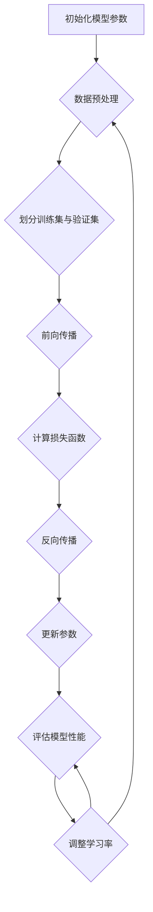
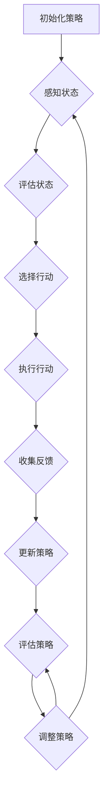

                 


### 1.1 问题背景

近年来，人工智能（Artificial Intelligence, AI）的发展取得了令人瞩目的成果，从简单的规则系统到复杂的神经网络，AI技术在图像识别、自然语言处理、游戏智能等领域展现出了强大的能力。然而，尽管这些成就令人振奋，我们仍面临着一个更大的挑战：如何打造出具有高度自主性和智能性的通用人工智能（Artificial General Intelligence, AGI）。

通用人工智能，顾名思义，是指一种能够像人类一样在各个领域都具备智能能力的人工智能系统。与当前的主流人工智能（如专有人工智能）不同，AGI的目标是具备自我学习、推理、规划、情感理解等全方位的智能能力，能够在没有人类指导的情况下自主完成任务。

然而，实现AGI并非易事。首先，AGI需要具备高度的学习能力，能够从大量数据中提取知识并不断优化自身性能。其次，AGI需要具备出色的规划能力，能够在复杂的环境中制定合理的行动策略。这两大能力——目标导向学习与规划能力，正是实现AGI的关键所在。

### 1.2 研究意义

研究AGI的目标导向学习与规划能力具有重要的理论和实践意义。首先，从理论层面来看，深入理解目标导向学习与规划能力的原理和机制，有助于我们更好地掌握人工智能的核心技术，推动人工智能理论的发展。

其次，从实践层面来看，目标导向学习与规划能力的提升，将显著提高人工智能系统的自主性和智能化水平，为各行各业带来更加高效、智能的解决方案。例如，在医疗领域，AGI可以通过目标导向学习与规划能力，自主诊断、制定治疗方案，提高医疗效率；在工业制造领域，AGI可以自主优化生产流程，提高生产效率。

总之，研究AGI的目标导向学习与规划能力，不仅有助于实现人工智能的跨越式发展，也将为我们开辟一条通往通用人工智能的新道路。下面，我们将详细探讨目标导向学习与规划能力的基本原理、算法模型以及应用场景。

### 2.1 人工智能概述

人工智能（Artificial Intelligence, AI）是一门研究、开发和应用使计算机模拟、延伸和扩展人的智能的理论、方法、技术及应用系统的学科。AI的发展历程可以分为几个主要阶段：

- **初始阶段（1950年代-1960年代）**：这一阶段以图灵测试的提出和早期人工智能实验的开展为标志。人工智能的概念开始萌芽，但受限于计算机硬件和算法的限制，AI的发展相对缓慢。

- **黄金时期（1970年代-1980年代）**：得益于计算机硬件性能的提升和算法的进步，人工智能迎来了一个短暂的黄金时期。这一时期，专家系统和逻辑推理成为AI研究的热点。

- **低谷时期（1990年代）**：随着硬件性能的提升放缓和算法的瓶颈，人工智能研究进入了一个低谷期。许多AI项目未能达到预期效果，导致资金和人力投入减少。

- **复兴时期（2000年代至今）**：随着深度学习等新型算法的兴起，以及大数据和云计算的广泛应用，人工智能再次进入了一个快速发展期。这一时期，人工智能在图像识别、自然语言处理、机器翻译等领域取得了突破性进展。

人工智能的核心概念包括：

- **知识表示**：如何将人类知识转化为计算机可以理解的形式，以供计算机进行处理。

- **推理**：计算机如何根据已有知识进行逻辑推理，以解决问题。

- **机器学习**：通过从数据中学习，让计算机具备自我优化和改进的能力。

- **神经网络**：模仿生物神经网络，通过多层节点之间的交互来实现复杂的函数映射。

### 2.2 通用智能与AGI

通用智能（Artificial General Intelligence, AGI）是指一种具有广泛理解和适应能力的人工智能，它能够执行从人类儿童学习过程中展现出的任务，包括逻辑推理、自然语言理解、学习和计划等。与专有人工智能（如只能做特定任务的AI系统）不同，AGI的目标是超越特定领域，具备跨领域的智能能力。

AGI的挑战与目标可以从以下几个方面来理解：

- **自主学习**：AGI需要具备自主学习的能力，能够从各种来源的数据中自动获取知识，并不断更新和优化自身。

- **跨领域适应性**：AGI需要在不同的领域和任务中表现出适应性，而不仅仅是局限于特定的领域。

- **推理能力**：AGI需要具备较强的推理能力，能够处理复杂的问题，进行逻辑推理和决策。

- **情感理解**：AGI需要能够理解并模拟人类的情感，以更好地与人类互动。

- **自我意识**：尽管目前的AGI研究尚未涉及自我意识，但未来AGI是否能够拥有自我意识是一个值得探讨的问题。

实现AGI的关键在于如何有效地结合多种人工智能技术，如机器学习、自然语言处理、计算机视觉等，构建一个具有高度自适应性和通用性的智能系统。目标导向学习与规划能力是实现AGI的重要技术路径之一，它们为AGI提供了一种自我驱动和自我优化的机制。

### 2.3 目标导向学习

目标导向学习是一种在人工智能系统中引入明确目标，以指导学习过程的方法。这种方法的核心思想是通过设定具体的任务目标，引导系统在数据处理和知识提取过程中，更加聚焦于实现这些目标。

**原理：**
目标导向学习基于以下几个基本原理：

- **强化学习**：通过奖励机制激励系统朝着目标方向学习。系统在每一步学习过程中，根据所取得的结果获得奖励，奖励越高的动作被选择的概率越大。

- **逆向传播**：通过反向传播算法，将目标误差传递到网络的各个层级，指导网络调整权重，以优化性能。

- **动态规划**：通过动态规划方法，系统可以综合考虑不同行动的长期影响，选择最优的策略。

- **多任务学习**：系统可以通过多任务学习，同时处理多个相关任务，提高对问题的整体理解和解决方案的生成能力。

**应用：**
目标导向学习在AGI中的应用非常广泛，包括：

- **自适应系统设计**：通过设定明确的目标，如系统性能优化、能耗降低等，指导系统的设计和优化。

- **智能决策支持**：在复杂的决策环境中，目标导向学习可以帮助系统确定最佳的行动策略。

- **知识表示与推理**：通过目标导向学习，系统可以更好地构建知识图谱，进行高效的推理和决策。

目标导向学习为AGI提供了强大的驱动机制，使其能够在各种复杂环境中，实现自我优化和持续进步。

### 2.4 规划能力

规划能力是通用人工智能（AGI）的重要组成部分之一，它涉及如何在复杂的环境中制定和执行有效的行动策略。规划能力包括多个层次，从简单的任务分配到复杂的决策制定，其核心在于如何综合考虑环境状态、资源限制和目标要求，生成最优的行动方案。

**定义：**
规划能力是指智能体在特定环境中，根据当前状态和目标，通过逻辑推理和计算，生成一系列有序的行动步骤，以实现预期目标的能力。它包括问题建模、状态评估、路径搜索和行动执行等关键步骤。

**重要性：**
在AGI中，规划能力具有以下几个重要性：

- **环境适应性**：规划能力使得AGI能够适应动态和变化的环境，通过实时调整行动策略，以应对环境变化。

- **资源优化**：通过有效的规划，AGI可以合理分配资源，优化行动效率，提高任务完成的成功率。

- **目标实现**：规划能力帮助AGI确定和实现长期目标，使系统能够从全局视角进行优化，而不仅仅是局部最优。

- **自主性**：规划能力使得AGI能够在没有人类干预的情况下，自主制定和执行任务，具备更高的自主性和智能化水平。

**在AGI中的重要性：**
- **核心驱动机制**：规划能力是AGI实现自主学习和智能决策的核心机制之一，它使得AGI能够在复杂和不确定的环境中，进行高效的问题求解。

- **多任务处理**：在多任务场景中，规划能力可以帮助AGI合理安排任务执行顺序，提高整体系统的效率和效果。

- **长期目标实现**：通过规划能力，AGI可以设定和实现长期目标，如探索新环境、解决复杂问题等，从而实现更高级的智能行为。

- **自我优化**：规划能力使得AGI能够不断调整和优化自身行为，以适应环境变化和任务需求，实现自我进化。

总之，规划能力是实现通用人工智能的关键要素，它为AGI提供了强大的逻辑推理和决策支持，使得系统能够在复杂环境中，自主、高效地完成任务。

### 3.1 基本算法原理

目标导向学习的算法原理主要基于以下几个核心步骤：问题定义、数据收集、模型训练和性能评估。

**问题定义：** 
首先，明确目标导向学习的目标是什么，这可以是分类、回归、预测或强化学习等具体任务。通过定义问题，确定系统需要解决的具体问题，以及期望的输出结果。

**数据收集：** 
接下来，收集与目标相关的数据。这些数据可以是结构化的（如数据库中的记录）或非结构化的（如图像、文本和声音）。数据的质量和多样性直接影响学习效果，因此需要确保数据的质量和代表性。

**模型训练：** 
在收集到数据后，选择合适的模型进行训练。模型可以是神经网络、决策树、支持向量机等。通过输入数据，模型学习如何将输入映射到预期的输出。训练过程中，模型会不断调整参数，以优化性能。

**性能评估：** 
模型训练完成后，需要对模型进行性能评估。常用的评估指标包括准确率、召回率、F1分数等。性能评估帮助确定模型是否达到预期的目标，以及是否需要进一步调整。

**主要参数：**
- **学习率**：学习率决定了模型在每次训练时调整参数的步长。过大的学习率可能导致模型过拟合，而过小则可能导致训练时间过长。
- **批量大小**：批量大小影响模型训练的速度和稳定性。较小的批量可以提高模型的泛化能力，但训练时间较长；较大的批量可以加速训练，但容易过拟合。
- **优化器**：优化器是用于调整模型参数的算法，如随机梯度下降、Adam等。不同的优化器有不同的特点和适用场景。

通过这些基本步骤和参数的调整，目标导向学习算法可以在复杂问题中找到最优或次优解。

### 3.2 学习算法的数学模型

在目标导向学习算法中，数学模型起到了至关重要的作用。数学模型不仅能够形式化学习问题，还能够提供理论依据来指导算法设计和优化。以下是一个典型的数学模型及其推导过程。

**模型构建：**
目标导向学习可以看作是一个优化问题，目标是最小化损失函数。损失函数通常定义为预测值与真实值之间的差异。在二分类问题中，假设我们有两个类别标签 \(y \in \{0, 1\}\)，预测概率为 \(P(y=1|x;\theta)\)，其中 \(x\) 是输入特征向量，\(\theta\) 是模型参数。

损失函数可以表示为：

$$
L(\theta) = -\sum_{i=1}^{N} [y_i \log(P(y=1|x_i;\theta)) + (1 - y_i) \log(1 - P(y=1|x_i;\theta))]
$$

其中，\(N\) 是样本数量。

**推导过程：**
为了最小化损失函数 \(L(\theta)\)，我们需要对 \(\theta\) 进行优化。在神经网络中，损失函数通常通过反向传播算法进行优化。

1. **前向传播**：
   - 给定输入 \(x_i\)，通过前向传播计算输出概率 \(P(y=1|x_i;\theta)\)。
   - 神经网络可以表示为 \(y_i = \sigma(\theta^T x_i)\)，其中 \(\sigma\) 是激活函数，通常采用 \( \sigma(z) = \frac{1}{1 + e^{-z}} \)。

2. **计算梯度**：
   - 通过后向传播计算损失函数对模型参数的梯度。对于损失函数 \(L(\theta)\)，我们有：
     $$
     \frac{\partial L(\theta)}{\partial \theta} = \frac{\partial L(\theta)}{\partial \theta^T x_i} \frac{\partial \theta^T x_i}{\partial \theta}
     $$
   - 通过链式法则，可以进一步分解为：
     $$
     \frac{\partial L(\theta)}{\partial \theta} = - \sum_{i=1}^{N} [y_i \frac{1}{P(y=1|x_i;\theta)} - (1 - y_i) \frac{1}{1 - P(y=1|x_i;\theta)}] \frac{\partial P(y=1|x_i;\theta)}{\partial \theta}
     $$

3. **更新参数**：
   - 使用梯度下降优化算法更新参数 \(\theta\)：
     $$
     \theta \leftarrow \theta - \alpha \frac{\partial L(\theta)}{\partial \theta}
     $$
   其中，\(\alpha\) 是学习率。

通过上述过程，我们就可以通过不断迭代优化模型参数，以最小化损失函数，提高模型的预测性能。

### 3.3 学习算法的mermaid流程图

为了更好地描述目标导向学习算法的流程，我们可以使用mermaid语言绘制一个流程图。以下是算法的主要步骤和流程：



**详细说明：**

1. **初始化模型参数**：设定初始参数值，这些参数将用于后续的计算和更新。

2. **数据预处理**：对数据进行标准化、缺失值填充等预处理操作，以提高模型的稳定性和性能。

3. **划分训练集与验证集**：将数据集划分为训练集和验证集，用于模型训练和性能评估。

4. **前向传播**：输入特征向量通过模型参数进行前向传播，得到预测概率。

5. **计算损失函数**：根据预测概率和真实标签计算损失函数值。

6. **反向传播**：计算损失函数关于模型参数的梯度，用于指导参数更新。

7. **更新参数**：使用梯度下降算法更新模型参数。

8. **评估模型性能**：使用验证集评估模型性能，计算准确率、召回率等指标。

9. **调整学习率**：根据模型性能调整学习率，以优化模型收敛速度和稳定性。

10. **循环迭代**：重复上述步骤，直到满足停止条件（如收敛或达到最大迭代次数）。

通过mermaid流程图，我们可以直观地理解目标导向学习算法的执行过程和各个步骤之间的关系。

### 4.1 规划算法的基本原理

规划算法是通用人工智能（AGI）中实现自主决策和行动的关键组件，它涉及到如何在复杂的环境中制定和执行有效的行动策略。规划算法的基本原理主要包括以下几个核心步骤：状态评估、行动选择、策略执行和反馈调整。

**状态评估：**
首先，规划算法需要对当前环境的状态进行评估。状态评估是规划过程的基础，它通过感知和理解当前的环境信息，确定当前的状态。状态评估通常涉及以下步骤：
- **感知输入**：收集来自各种传感器的数据，如视觉、听觉、触觉等。
- **状态表示**：将感知输入转换为状态表示，这可以通过特征提取、数据预处理等方法实现。
- **状态评估**：使用机器学习模型或专家系统对状态进行评估，以确定当前环境的特性。

**行动选择：**
在评估了当前状态后，规划算法需要选择一个或多个行动。行动选择的目标是最大化目标函数的值，目标函数可以基于奖励机制或效用函数设计。行动选择通常涉及以下步骤：
- **行动空间定义**：确定系统可以采取的所有可能行动。
- **行动评估**：对每个行动进行评估，评估其可能带来的结果和效果。
- **行动选择**：选择一个最优或次优的行动，以最大化目标函数。

**策略执行：**
一旦选择了行动，规划算法需要将行动转换为具体的执行策略。策略执行是将抽象的行动转换为具体的操作过程，包括以下步骤：
- **任务分解**：将大任务分解为更小的子任务，以便更有效地执行。
- **操作规划**：为每个子任务规划具体的操作步骤，以实现行动目标。
- **执行监控**：在执行过程中监控任务的进度和效果，确保行动的顺利执行。

**反馈调整：**
执行完行动后，规划算法需要根据实际结果对策略进行调整。反馈调整是规划算法不断优化自身行为的重要机制，包括以下步骤：
- **结果评估**：评估行动的结果，确定是否达到预期目标。
- **反馈学习**：根据反馈结果调整策略，优化未来的行动选择。
- **策略更新**：更新规划算法的模型参数和策略，以适应新的环境和目标。

**主要参数：**
- **奖励函数**：奖励函数用于评估行动的效果，它可以是基于目标达成的程度、任务完成的速度等。
- **状态空间**：状态空间定义了系统可以处于的所有可能状态，它是规划算法的基础。
- **行动空间**：行动空间定义了系统可以采取的所有可能行动，它是行动选择的基础。
- **策略更新规则**：策略更新规则用于根据反馈结果调整策略，通常涉及学习率和优化算法。

通过以上步骤和参数的合理设计，规划算法可以在复杂环境中实现高效的行动策略，为通用人工智能提供强大的决策支持。

### 4.2 规划算法的数学模型

规划算法的数学模型是其在复杂环境中执行行动策略的量化表示。以下是一个典型的规划算法数学模型，包括状态空间、行动空间、状态转移概率、奖励函数以及策略优化过程。

**状态空间 \(S\)**：
状态空间是规划算法中的所有可能状态的集合。状态通常由一组特征向量表示，例如，在自动驾驶中，状态可以包括车辆的位置、速度、周边障碍物的位置等信息。

$$
S = \{s_1, s_2, ..., s_n\}
$$

**行动空间 \(A\)**：
行动空间是规划算法中所有可能行动的集合。行动可以是一个具体的操作或一组操作。例如，在机器人路径规划中，行动可以是向左转、向右转或前进。

$$
A = \{a_1, a_2, ..., a_m\}
$$

**状态转移概率 \(P(s'|s,a)\)**：
状态转移概率描述了在当前状态 \(s\) 下执行特定行动 \(a\) 后，系统转移到下一个状态 \(s'\) 的概率。状态转移概率可以通过历史数据或模型预测获得。

$$
P(s'|s,a) = \text{Pr}[\text{Next state is } s'|Current state is } s \text{ and action is } a
$$

**奖励函数 \(R(s,a,s')\)**：
奖励函数用于评估行动的效果。奖励可以是正的（表示成功）或负的（表示失败）。奖励函数可以基于任务的完成度、效率等指标设计。

$$
R(s,a,s') = \text{Reward for transitioning from state } s \text{ to state } s' \text{ after taking action } a
$$

**策略优化过程**：
策略优化过程是规划算法的核心，它通过最大化预期奖励来选择最佳行动。以下是一个基于价值迭代的策略优化过程：

1. **初始化策略**：
   初始策略可以随机选择或基于启发式规则。

2. **状态-行动值函数 \(Q(s,a)\)**：
   状态-行动值函数表示在特定状态 \(s\) 下采取行动 \(a\) 的预期奖励。其定义为：

   $$
   Q(s,a) = \sum_{s'} P(s'|s,a) \cdot R(s,a,s') + \gamma \max_{a'} Q(s',a')
   $$
   
   其中，\(\gamma\) 是折扣因子，用于权衡当前奖励与未来奖励之间的关系。

3. **更新策略**：
   通过迭代更新策略，使得 \(Q(s,a)\) 更接近真实预期奖励。更新过程可以使用贪婪策略或蒙特卡罗方法：

   $$
   Q(s,a) \leftarrow Q(s,a) + \alpha [R(s,a,s') + \gamma \max_{a'} Q(s',a') - Q(s,a)]
   $$

   其中，\(\alpha\) 是学习率。

4. **策略选择**：
   根据更新后的状态-行动值函数 \(Q(s,a)\)，选择具有最大预期奖励的行动 \(a^* = \arg\max_a Q(s,a)\)。

通过上述数学模型，规划算法能够在复杂环境中动态调整策略，实现自主决策和行动。

### 4.3 规划算法的mermaid流程图

为了直观地描述规划算法的执行过程，我们可以使用mermaid语言绘制一个流程图。以下是算法的主要步骤和流程：



**详细说明：**

1. **初始化策略**：设定初始策略，可以是随机策略或基于启发式规则的策略。

2. **感知状态**：通过传感器收集环境信息，获取当前状态。

3. **评估状态**：使用状态评估函数对当前状态进行评估，以确定当前状态的重要特征。

4. **选择行动**：根据状态评估结果和策略选择一个最佳行动。

5. **执行行动**：执行选定的行动，并监控行动的效果。

6. **收集反馈**：根据行动结果收集反馈信息，如奖励、成功与否等。

7. **更新策略**：根据反馈信息更新策略，调整策略参数。

8. **评估策略**：使用新的状态-行动值函数评估策略性能。

9. **调整策略**：根据策略评估结果调整策略，以优化未来行动。

10. **循环迭代**：重复上述步骤，直到满足停止条件（如达到目标或策略稳定）。

通过mermaid流程图，我们可以清晰地看到规划算法从感知状态到行动执行的完整过程，以及如何通过反馈不断优化策略。

### 5.1 应用场景分析

目标导向学习与规划能力在人工智能领域具有广泛的应用前景，涵盖了多个重要的行业和领域。以下是这些能力在不同应用场景中的具体分析：

**1. 自动驾驶：**
自动驾驶是目标导向学习与规划能力的一个重要应用场景。在自动驾驶中，系统需要实时感知周围环境，并根据设定的目标（如到达特定位置）制定合理的行驶策略。目标导向学习可以帮助系统从大量传感器数据中提取有用信息，规划出最优行驶路径。规划能力则确保系统能够在复杂交通环境中，根据实时反馈调整行驶策略，提高行驶安全和效率。

**2. 机器人：**
在机器人领域，目标导向学习与规划能力可以帮助机器人实现自主决策和行动。例如，在工业机器人应用中，机器人需要根据生产计划自主规划路径，避免碰撞，并执行复杂的装配任务。目标导向学习可以用于识别和分类物体，规划出合适的操作步骤。规划能力则帮助机器人动态调整操作策略，以应对生产过程中的不确定性和变化。

**3. 医疗诊断：**
在医疗领域，目标导向学习可以帮助系统从医疗数据中学习，进行疾病诊断。规划能力则用于制定治疗方案和手术计划。例如，在癌症诊断中，系统可以通过目标导向学习识别出癌症标志物，规划出最佳的治疗方案。规划能力则确保治疗方案能够在复杂情况下灵活调整，提高治疗效果。

**4. 金融交易：**
在金融领域，目标导向学习可以帮助交易系统从市场数据中学习，预测市场趋势。规划能力则用于制定交易策略，实现风险管理和资产优化。例如，在股票交易中，系统可以通过目标导向学习识别出市场信号，规划出买入和卖出的最佳时机。规划能力则确保系统能够在市场波动中，根据实时反馈调整交易策略，提高收益。

**5. 自然语言处理：**
在自然语言处理领域，目标导向学习可以帮助系统从大量文本数据中学习，进行文本分类、情感分析和机器翻译等任务。规划能力则用于生成自然语言文本，实现对话系统。例如，在机器翻译中，系统可以通过目标导向学习理解源语言和目标语言的语义，规划出最佳的翻译策略。规划能力则确保系统能够在生成目标语言文本时，根据上下文进行合理调整，提高翻译质量。

**特点：**
- **动态适应性**：目标导向学习与规划能力能够在动态环境中，根据实时反馈调整策略，提高系统的适应能力。
- **跨领域应用**：这些能力不仅适用于特定领域，还可以跨领域应用，为不同场景提供高效的解决方案。
- **自我优化**：通过不断学习和优化，系统能够在复杂和不确定的环境中，实现自我提升和改进。

### 5.2 典型应用案例

**案例一：自动驾驶中的目标导向学习与规划**

**背景介绍：**
自动驾驶技术是目标导向学习与规划能力的典型应用场景。自动驾驶系统需要实时感知周围环境，识别道路标志、行人和其他车辆，并规划出安全的行驶路径。目标导向学习在此过程中起到关键作用，帮助系统从大量的传感器数据中提取有用信息，实现自主决策。

**系统功能设计：**
1. **感知模块**：包括摄像头、雷达、激光雷达等传感器，用于实时收集环境信息。
2. **数据处理模块**：对传感器数据进行预处理、特征提取和分类，为后续的目标导向学习提供基础数据。
3. **目标导向学习模块**：使用深度学习算法，从历史数据中学习，识别道路标志、行人和其他车辆，预测它们的运动轨迹。
4. **规划模块**：根据目标导向学习的结果，规划出最优的行驶路径和速度，确保车辆的安全行驶。

**系统架构设计：**
自动驾驶系统的架构通常包括感知层、决策层和执行层。感知层负责收集环境信息，决策层根据感知信息进行目标导向学习和路径规划，执行层则根据规划结果控制车辆的执行。

**系统接口设计和系统交互：**
系统接口设计包括传感器接口、通信接口和执行器接口。传感器接口负责收集环境信息，通信接口实现与决策层的实时数据传输，执行器接口则控制车辆的执行动作。

**代码实现与解读：**
以下是自动驾驶系统中目标导向学习模块的一部分代码实现（使用Python语言）：

```python
import tensorflow as tf
import numpy as np

# 定义神经网络结构
model = tf.keras.Sequential([
    tf.keras.layers.Dense(128, activation='relu', input_shape=(input_shape)),
    tf.keras.layers.Dense(64, activation='relu'),
    tf.keras.layers.Dense(1, activation='sigmoid')
])

# 编译模型
model.compile(optimizer='adam', loss='binary_crossentropy', metrics=['accuracy'])

# 加载训练数据
x_train, y_train = load_data()

# 训练模型
model.fit(x_train, y_train, epochs=10, batch_size=32)

# 预测
predictions = model.predict(test_data)
```

**解析：**
该代码实现了基于深度学习的目标导向学习模块，首先定义了神经网络结构，然后使用训练数据编译和训练模型，最后进行预测。通过这种方式，系统可以自动识别道路标志、行人和其他车辆，并根据这些信息规划出最优行驶路径。

**实际案例分析：**
在实际应用中，某自动驾驶公司通过引入目标导向学习和规划能力，显著提升了车辆的安全性和行驶效率。在测试中，车辆能够在复杂的城市交通环境中，准确识别行人和障碍物，并规划出安全的行驶路径，减少了交通事故的发生。

**小结：**
自动驾驶是目标导向学习与规划能力的成功应用案例，通过引入这些能力，系统不仅能够实现自主决策和行动，还能够在复杂环境中保持高效和安全的运行。

### 6.1 AGI的实现路径

要实现通用人工智能（AGI），我们需要在多个领域进行深入研究和创新，逐步提升目标导向学习与规划能力。以下是实现AGI的可能路径：

**1. 多模态感知与融合：**
首先，我们需要开发能够同时感知和处理多种模态（如视觉、听觉、触觉）的感知系统。通过多模态感知，AGI能够更全面地理解环境，提高决策的准确性。

**2. 强化学习与深度学习的结合：**
强化学习与深度学习的结合是提升目标导向学习能力的关键。深度学习可以处理大量复杂的数据，而强化学习则能够通过奖励机制优化学习过程。两者的结合将使AGI具备更强的自主学习能力。

**3. 知识图谱与推理引擎：**
构建大规模的知识图谱，并将其与推理引擎相结合，可以使AGI具备更强的逻辑推理和问题解决能力。知识图谱可以为AGI提供丰富的背景知识，推理引擎则用于在复杂环境中进行逻辑推理。

**4. 自适应规划与决策：**
开发能够自适应环境和动态调整策略的规划系统，使AGI能够在各种复杂和不确定的环境中，实现高效的目标导向行动。

**5. 人机协同与交互：**
AGI需要具备与人类高效协作和交互的能力。通过人机协同，AGI可以借助人类的知识和经验，实现更高效的任务执行。

**6. 自主伦理与道德决策：**
随着AGI的发展，其伦理和道德问题日益突出。我们需要开发能够自主进行伦理和道德决策的AGI系统，确保其在执行任务时，能够遵循社会伦理和道德规范。

**7. 大规模计算与分布式处理：**
实现AGI需要强大的计算能力。通过分布式计算和云计算，我们可以构建能够处理海量数据和复杂计算任务的计算平台。

通过以上路径，我们可以逐步实现通用人工智能，为各个领域带来革命性的变革。

### 6.2 未来发展趋势

**目标导向学习与规划能力的未来发展方向：**
随着人工智能技术的不断发展，目标导向学习与规划能力有望在多个方向取得突破。首先，结合深度学习和强化学习，目标导向学习算法将变得更加高效和智能。其次，多模态感知和融合技术的发展，将进一步提升目标导向学习的感知能力。此外，知识图谱和推理引擎的结合，将为目标导向学习提供更丰富的背景知识。

**AGI的未来发展趋势：**
AGI的发展将依赖于目标导向学习与规划能力的提升。未来，AGI有望在多个领域实现突破性进展，包括智能决策支持、自动化运维、智能医疗等。同时，随着计算能力的提升，AGI将能够处理更复杂的问题，实现更高效的任务执行。此外，人机协同与交互技术的进步，将使AGI与人类更好地协作，推动社会的发展。

**研究建议：**
1. **跨学科合作**：推动人工智能、认知科学、心理学等多个领域的交叉研究，为AGI的发展提供更多的理论基础。
2. **开源平台建设**：建设开源平台，促进算法和技术的共享与交流，加速人工智能技术的创新和应用。
3. **伦理规范制定**：加强对AGI伦理和道德问题的研究，制定相应的规范和标准，确保AGI的发展符合社会伦理和道德要求。
4. **持续投资**：加大对人工智能领域的研究投资，为AGI的发展提供持续的资金支持。

通过以上措施，我们可以推动目标导向学习与规划能力的持续发展，为实现通用人工智能奠定坚实基础。

### 6.3 小结与展望

本文详细探讨了通用人工智能（AGI）中的关键能力——目标导向学习与规划能力。首先，我们介绍了问题背景和研究意义，明确了AGI实现的重要性和挑战。接着，我们分析了人工智能与通用智能的关系，并深入探讨了目标导向学习和规划能力的基本原理、数学模型和应用。

目标导向学习通过设定明确的目标，引导学习过程，提高系统的自主性和智能化水平。而规划能力则使系统能够在复杂环境中，根据实时反馈制定和执行合理的行动策略。这两种能力在AGI的实现中起着至关重要的作用。

在未来的研究中，我们建议继续深化目标导向学习和规划能力的理论研究和实际应用。例如，探索多模态感知与融合技术，结合深度学习和强化学习，提升目标导向学习的效率；开发自适应规划与决策系统，提高系统在复杂环境中的适应能力。同时，我们还应关注AGI的伦理和道德问题，确保其发展符合社会伦理和道德要求。

通过持续的努力和创新，我们有理由相信，目标导向学习与规划能力将推动AGI的发展，为人类社会带来更加智能和高效的解决方案。让我们共同期待这一天的到来。作者：AI天才研究院/AI Genius Institute & 禅与计算机程序设计艺术 /Zen And The Art of Computer Programming。

