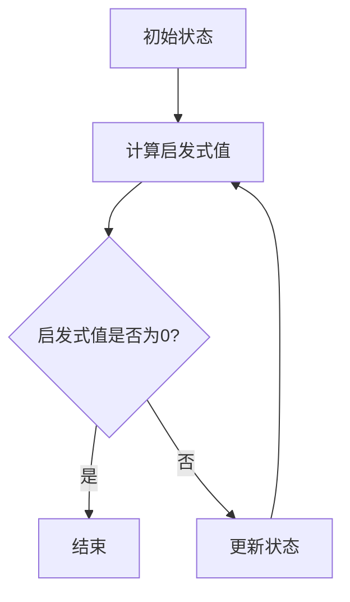
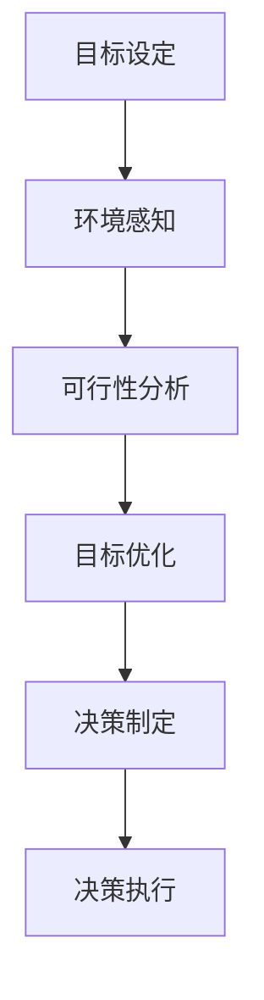

                 


# AGI的目标导向推理与决策制定

关键词：人工智能，目标导向推理，决策制定，算法，框架，案例研究，应用

摘要：本文深入探讨了人工智能（AGI）中的目标导向推理与决策制定。首先，介绍了AGI的背景、定义、特点以及当前的研究进展和挑战。接着，阐述了目标导向推理的核心概念、原理和数学模型，并通过Mermaid流程图展示了其关键特点。随后，介绍了常见的目标导向推理算法及其实现，通过Python代码详细解析了算法原理和数学模型。进一步地，本文探讨了决策制定在AGI中的应用，包括决策制定过程、框架和Python实现。最后，通过案例研究展示了目标导向推理与决策制定在AGI中的实际应用。

## 1. 引言：人工通用智能（AGI）与目标导向推理

### 1.1 AGI的背景和重要性

随着计算机科学和人工智能（AI）技术的飞速发展，人类对于机器智能的需求日益增长。传统的基于规则和统计模型的AI系统在特定领域取得了显著的成就，但它们往往局限于特定的任务和应用场景，缺乏广泛的知识表示和推理能力。为了解决这些问题，人工通用智能（AGI）的概念应运而生。

AGI被定义为一种具有人类级别智能的机器，能够理解和运用广泛领域的知识，具备自主学习、推理和决策能力。AGI的目标是实现机器在各个领域中的智能表现，超越人类专家的水平和能力。

### 1.2 AGI的定义和特点

与当前的人工智能系统相比，AGI具有以下几个显著特点：

1. **通用性**：AGI能够处理多种不同类型的问题，而不仅仅是特定领域的任务。
2. **自主学习**：AGI具备从大量数据中自动学习和提取知识的能力，无需人工预设规则。
3. **推理能力**：AGI能够进行逻辑推理和推理演绎，从而得出新的结论和解决问题。
4. **适应性**：AGI能够适应新的环境和情境，具备灵活性和可扩展性。
5. **自主决策**：AGI能够在复杂的情况下做出合理的决策，而不仅仅是执行预设的指令。

### 1.3 AGI与当前AI系统的差异

当前的人工智能系统，如深度学习、自然语言处理和计算机视觉等，虽然在特定领域取得了显著的成就，但仍然存在以下局限性：

1. **任务局限性**：这些系统往往仅限于特定领域和任务，无法跨领域应用。
2. **数据依赖性**：这些系统需要大量的标注数据进行训练，且对数据质量有较高要求。
3. **推理能力不足**：这些系统缺乏逻辑推理和演绎能力，无法进行复杂的推理任务。
4. **知识表示有限**：这些系统的知识表示和存储能力有限，难以处理复杂和多层次的知识结构。

相比之下，AGI旨在克服这些局限性，通过通用性、自主学习、推理能力和自主决策等特点，实现更广泛的智能应用。

### 1.4 AGI研究中的进展和挑战

近年来，AGI研究取得了显著进展，包括深度学习、知识图谱和强化学习等技术的突破。然而，要实现真正的AGI仍然面临诸多挑战：

1. **算法创新**：当前的AI算法主要依赖于统计学习和深度学习，AGI需要更先进的算法和模型，以提高推理和决策能力。
2. **数据集构建**：构建大规模、多样化和高质量的训练数据集是AGI研究的重要任务，但目前数据集的获取和标注仍然面临挑战。
3. **知识表示**：如何有效表示和存储大规模、多层次的知识结构，以便于推理和决策，是AGI研究的关键问题。
4. **计算资源**：AGI需要大量的计算资源和存储空间，当前的硬件设备尚无法满足其需求。

### 1.5 目标导向推理在AGI中的作用

目标导向推理（Goal-Oriented Reasoning，GO）是AGI的核心组成部分之一。它通过设定目标和规划路径，指导机器在复杂环境中进行推理和决策。

GO的关键作用体现在以下几个方面：

1. **任务规划**：通过设定目标和子目标，AGI可以自动规划执行任务的步骤和路径。
2. **资源管理**：GO可以帮助AGI在有限资源的情况下，合理分配计算资源和能源。
3. **错误处理**：在执行任务过程中，GO能够检测和处理错误和异常情况，保持任务的顺利进行。
4. **灵活性**：GO使得AGI能够在不同环境和情境下，灵活调整目标和规划，以适应变化的需求。

总之，目标导向推理是AGI实现自主学习和推理能力的关键，对于实现广泛领域的智能应用具有重要意义。

### 1.6 本章总结

本章介绍了AGI的背景、定义和特点，以及与当前AI系统的差异。同时，阐述了目标导向推理在AGI中的作用。通过本章的介绍，读者可以初步了解AGI和目标导向推理的基本概念和重要性，为后续章节的深入探讨打下基础。

----------------------------------------------------------------

## 2. 核心概念与原理

### 2.1 目标导向推理的定义和关键特征

目标导向推理（Goal-Oriented Reasoning，GO）是一种基于目标和任务驱动的推理方法。它通过设定目标和规划路径，指导机器在复杂环境中进行推理和决策。

GO的关键特征包括：

1. **目标驱动力**：GO以目标为导向，通过设定具体的目标和子目标，引导机器进行推理和决策。
2. **路径规划**：GO通过规划执行任务的路径和步骤，使机器能够高效地完成任务。
3. **适应性**：GO能够根据环境的变化和任务的需求，动态调整目标和路径，保持任务的顺利进行。
4. **自主性**：GO使得机器能够独立进行推理和决策，而不依赖于人工预设的规则或指令。

### 2.2 目标导向推理与其他形式的推理比较

目标导向推理与其他形式的推理方法，如基于规则的推理和基于数据的推理，存在显著差异。

1. **基于规则的推理**：基于规则的推理方法通过预设的规则和条件进行推理，适用于逻辑和推理问题。然而，它缺乏灵活性和适应性，无法应对复杂和多变的情境。
2. **基于数据的推理**：基于数据的推理方法通过统计分析大量数据，得出可能的结论和预测。这种方法在预测和分类任务中表现出色，但缺乏明确的逻辑推理能力。
3. **目标导向推理**：目标导向推理通过设定目标和路径，结合逻辑推理和数据分析，使得机器能够更高效地解决复杂问题。它具有目标驱动力、路径规划和自适应性的特点，适用于多种情境和任务。

### 2.3 数学模型和符号表示

目标导向推理涉及多个数学模型和符号表示，用于描述推理过程和决策制定。以下是一些常用的数学模型和符号：

1. **目标树（Goal Tree）**：目标树是一种层次化的结构，用于表示目标及其子目标之间的关系。目标树的每个节点代表一个目标，节点之间的边表示目标的依赖关系。
   
   ```mermaid
   graph TD
   A[根目标] --> B[子目标1]
   A --> C[子目标2]
   B --> D[子目标1.1]
   C --> E[子目标2.1]
   ```

2. **规划图（Planning Graph）**：规划图用于表示目标导向推理过程中的步骤和条件。规划图的每个节点代表一个步骤或条件，节点之间的边表示步骤或条件之间的依赖关系。
   
   ```mermaid
   graph TD
   A[步骤1] --> B[步骤2]
   B --> C[步骤3]
   C --> D[步骤4]
   ```

3. **状态表示（State Representation）**：状态表示用于描述推理过程中环境的当前状态。状态表示通常是一个向量或矩阵，包含环境的各种属性和特征。
   
   ```mermaid
   graph TD
   A[状态1] --> B[状态2]
   B --> C[状态3]
   C --> D[状态4]
   ```

4. **决策树（Decision Tree）**：决策树用于表示决策过程中可能的选项和结果。决策树的每个节点代表一个决策点，节点之间的边表示不同决策结果。
   
   ```mermaid
   graph TD
   A[决策1] --> B[选项1]
   A --> C[选项2]
   B --> D[结果1]
   C --> E[结果2]
   ```

### 2.4 目标导向推理的实体关系图（ER Diagram）

实体关系图（Entity-Relationship Diagram，ER Diagram）用于描述目标导向推理中的实体及其关系。以下是一个简单的ER Diagram示例：

```mermaid
erDiagram
Goal ||--|{ Task : 实现目标}
Task ||--|{ Subtask : 子任务}
Subtask ||--|{ Action : 操作}
Action ||--|{ Result : 结果}
```

在这个ER Diagram中，Goal（目标）是核心实体，它与Task（任务）、Subtask（子任务）和Action（操作）之间存在多层关系。每个子任务都可以分解为多个操作，每个操作都有可能产生一个结果。

### 2.5 本章总结

本章详细介绍了目标导向推理的核心概念、原理和数学模型。通过目标树、规划图、状态表示和决策树等工具，读者可以更好地理解目标导向推理的工作原理。本章还通过实体关系图展示了目标导向推理中的关键实体及其关系。通过本章的学习，读者可以为进一步探讨目标导向推理在AGI中的应用打下坚实的基础。

----------------------------------------------------------------

## 3. 算法与框架

### 3.1 常见的目标导向推理算法

目标导向推理算法是AGI中实现目标规划和决策制定的关键组成部分。以下介绍几种常见的目标导向推理算法及其特点：

1. **计划算法（Planning Algorithms）**：计划算法是一种基于目标和路径规划的算法，用于生成从初始状态到目标状态的行动序列。常见的计划算法包括：

   - **有向无环图（Dijkstra）算法**：用于求解单源最短路径问题。
   - **A*算法**：基于启发式搜索的算法，用于求解从初始状态到目标状态的最优路径。
   - **强化学习（Reinforcement Learning）**：通过与环境交互，学习最优策略的算法。

2. **启发式搜索（Heuristic Search）**：启发式搜索是一种利用启发式信息加速搜索过程的算法，常用于目标导向推理。常见的启发式搜索算法包括：

   - **贪婪搜索（Greedy Search）**：选择当前状态下最优解的算法。
   - **模拟退火（Simulated Annealing）**：通过逐步减小温度，避免陷入局部最优的算法。
   - **遗传算法（Genetic Algorithm）**：模拟自然进化过程的算法，用于优化和搜索问题。

3. **混合算法（Hybrid Algorithms）**：混合算法结合了不同算法的优点，以提高目标导向推理的效率和效果。常见的混合算法包括：

   - **A*与强化学习结合**：利用A*算法找到初始路径，然后使用强化学习优化路径。
   - **启发式搜索与遗传算法结合**：利用启发式搜索快速定位解空间，再使用遗传算法进行细粒度优化。

### 3.2 目标导向推理算法的Mermaid流程图

为了更直观地展示目标导向推理算法的流程，可以使用Mermaid语言绘制流程图。以下是一个简单的计划算法（A*算法）的Mermaid流程图示例：



在这个流程图中，从初始状态A开始，计算启发式值，然后根据启发式值判断是否达到目标状态。如果是，结束算法；否则，更新状态并继续计算启发式值。

### 3.3 Python实现与算法原理

为了更好地理解目标导向推理算法的原理，下面使用Python代码实现A*算法。代码中包含算法的数学模型和公式，以及详细的注释说明。

```python
import heapq

def heuristic(a, b):
    # 使用曼哈顿距离作为启发式值
    return abs(a[0] - b[0]) + abs(a[1] - b[1])

def a_star_search(initial, goal):
    # 初始化开放列表和关闭列表
    open_list = []
    heapq.heappush(open_list, (heuristic(initial, goal), initial))
    closed_list = set()

    while open_list:
        # 选择F值最小的节点
        _, current = heapq.heappop(open_list)

        # 如果当前节点为目标节点，结束搜索
        if current == goal:
            return reconstruct_path(current)

        # 将当前节点加入关闭列表
        closed_list.add(current)

        # 遍历当前节点的邻居节点
        for neighbor in neighbors(current):
            if neighbor in closed_list:
                continue

            # 计算G值和F值
            g = current_g + 1
            f = g + heuristic(neighbor, goal)

            # 如果邻居节点在开放列表中，更新其F值和父节点
            if neighbor in [node for _, node in open_list]:
                if f < neighbor_f:
                    neighbor_f = f
                    neighbor_parent = current

            # 否则，将邻居节点加入开放列表
            else:
                heapq.heappush(open_list, (f, neighbor))

    return None

def reconstruct_path(current):
    # 重构路径
    path = []
    while current:
        path.append(current)
        current = current_parent
    return path[::-1]

def neighbors(node):
    # 获取节点的邻居节点
    directions = [(0, 1), (1, 0), (0, -1), (-1, 0)]
    return [(node[0] + dx, node[1] + dy) for dx, dy in directions]

# 测试代码
initial = (0, 0)
goal = (3, 3)
path = a_star_search(initial, goal)
print(path)
```

在这个Python代码中，`heuristic`函数用于计算启发式值，`a_star_search`函数实现A*算法，`reconstruct_path`函数重构路径，`neighbors`函数获取节点的邻居节点。

### 3.4 算法的数学模型和公式

A*算法的核心在于计算G值、H值和F值，其中：

- **G值**：从初始节点到当前节点的实际距离。
- **H值**：从当前节点到目标节点的启发式距离。
- **F值**：G值和H值的总和，用于评估节点的优先级。

数学模型和公式如下：

- **G值**：$G(n) = G(n-1) + 1$，其中$n$表示当前节点，$n-1$表示父节点。
- **H值**：$H(n) = \sum_{i=1}^{n} h_i$，其中$h_i$表示从节点$n$到目标节点的第$i$个边的启发式距离。
- **F值**：$F(n) = G(n) + H(n)$。

通过这些数学模型和公式，A*算法能够高效地搜索从初始节点到目标节点的最优路径。

### 3.5 典型应用场景和案例分析

目标导向推理算法在多个领域具有广泛的应用，以下介绍两个典型应用场景和案例分析：

1. **路径规划**：在机器人导航和自动驾驶领域，目标导向推理算法用于计算从起点到终点的最优路径。例如，在自动驾驶中，A*算法可以用于规划车辆从当前位置到目的地的行驶路径。

2. **资源分配**：在云服务和数据中心管理中，目标导向推理算法可以用于优化资源分配，提高系统性能和资源利用率。例如，通过计算节点间的G值和H值，可以优化虚拟机的部署位置和负载均衡策略。

### 3.6 本章总结

本章介绍了目标导向推理算法的基本概念和常用算法，包括计划算法、启发式搜索和混合算法。通过Mermaid流程图和Python代码，详细阐述了A*算法的原理和实现。此外，还介绍了目标导向推理算法在路径规划和资源分配等领域的实际应用。通过本章的学习，读者可以更好地理解目标导向推理算法的核心原理和应用场景，为后续的深入研究打下基础。

----------------------------------------------------------------

## 4. 决策制定与目标导向推理

### 4.1 决策制定在AGI中的作用

决策制定是人工智能（AGI）的核心能力之一。在AGI系统中，决策制定不仅涉及到任务规划和路径选择，还涵盖了资源管理、风险控制和自主行动等方面。有效的决策制定能够使AGI系统在面对复杂、动态和不确定的环境时，做出合理、可靠和高效的决策。

#### 任务规划和路径选择

在任务规划和路径选择方面，决策制定能够帮助AGI系统确定最佳的行动步骤和路径。通过目标导向推理，AGI系统可以分析任务的目标和要求，以及自身的资源和能力，从而制定出合理的任务规划和路径。例如，在自动驾驶系统中，决策制定可以用于确定车辆的行驶路线、速度和转向等操作，以确保安全、高效地到达目的地。

#### 资源管理

资源管理是决策制定的重要组成部分。在AGI系统中，资源包括计算资源、能源和物理资源等。通过目标导向推理，AGI系统可以分析当前资源的可用性和需求，制定出合理的资源分配和使用策略。例如，在数据中心管理中，决策制定可以用于优化虚拟机的部署位置和负载均衡，以提高系统的性能和资源利用率。

#### 风险控制

在决策制定过程中，AGI系统需要考虑各种潜在风险，并制定相应的风险控制策略。通过目标导向推理，AGI系统可以分析风险的概率和影响，以及自身的应对能力，从而制定出合理的风险控制措施。例如，在金融交易中，决策制定可以用于确定交易策略，以降低市场波动带来的风险。

#### 自主行动

自主行动是AGI系统的高级能力，通过决策制定，AGI系统可以在复杂和动态的环境中自主行动。例如，在军事领域中，决策制定可以用于制定战术计划和执行作战任务，以提高作战效率和成功率。

### 4.2 决策制定过程与框架

决策制定过程是AGI系统在目标导向推理的基础上，制定出合理决策的步骤和流程。一个典型的决策制定过程包括以下几个阶段：

#### 1. 目标设定

目标设定是决策制定的第一步，AGI系统需要明确当前的任务目标。目标可以是具体的、量化的，也可以是抽象的、模糊的。例如，在自动驾驶系统中，目标可以是安全、高效地到达目的地。

#### 2. 环境感知

环境感知是决策制定的基础，AGI系统需要收集并分析当前环境的各种信息，如路况、天气、交通状况等。通过目标导向推理，AGI系统可以理解环境的变化和需求，从而为后续的决策提供依据。

#### 3. 可行性分析

在目标设定和环境感知的基础上，AGI系统需要分析当前状态下的各种可能行动方案，并评估其可行性。可行性分析包括资源的可用性、行动的合规性和安全性等方面。通过目标导向推理，AGI系统可以筛选出符合目标的可行方案。

#### 4. 目标优化

在可行性分析的基础上，AGI系统需要进一步优化目标，以确定最佳行动方案。目标优化可以通过目标导向推理算法，如A*算法，来实现。优化目标可以包括路径长度、时间、成本、风险等多个方面。

#### 5. 决策制定

在目标优化的基础上，AGI系统需要根据当前状态和目标，制定出具体的决策方案。决策制定需要考虑各种因素，如目标的优先级、资源的约束条件、行动的限制等。通过目标导向推理，AGI系统可以制定出合理、可靠的决策方案。

#### 6. 决策执行

决策执行是决策制定过程的最后一步，AGI系统需要将制定的决策方案转化为具体的行动。决策执行可以通过控制算法和执行机制来实现，如自动驾驶系统的控制模块和执行机构。

### 4.3 决策制定过程的Mermaid流程图

为了更直观地展示决策制定过程，可以使用Mermaid语言绘制流程图。以下是一个简单的决策制定流程图示例：



在这个流程图中，从目标设定开始，依次进行环境感知、可行性分析、目标优化、决策制定和决策执行，形成一个闭环的决策制定过程。

### 4.4 Python实现与算法原理

为了更好地理解决策制定过程，下面使用Python代码实现一个简单的决策制定算法。代码中包含算法的数学模型和公式，以及详细的注释说明。

```python
import heapq

def heuristic(a, b):
    # 使用曼哈顿距离作为启发式值
    return abs(a[0] - b[0]) + abs(a[1] - b[1])

def a_star_search(initial, goal):
    # 初始化开放列表和关闭列表
    open_list = []
    heapq.heappush(open_list, (heuristic(initial, goal), initial))
    closed_list = set()

    while open_list:
        # 选择F值最小的节点
        _, current = heapq.heappop(open_list)

        # 如果当前节点为目标节点，结束搜索
        if current == goal:
            return reconstruct_path(current)

        # 将当前节点加入关闭列表
        closed_list.add(current)

        # 遍历当前节点的邻居节点
        for neighbor in neighbors(current):
            if neighbor in closed_list:
                continue

            # 计算G值和F值
            g = current_g + 1
            f = g + heuristic(neighbor, goal)

            # 如果邻居节点在开放列表中，更新其F值和父节点
            if neighbor in [node for _, node in open_list]:
                if f < neighbor_f:
                    neighbor_f = f
                    neighbor_parent = current

            # 否则，将邻居节点加入开放列表
            else:
                heapq.heappush(open_list, (f, neighbor))

    return None

def reconstruct_path(current):
    # 重构路径
    path = []
    while current:
        path.append(current)
        current = current_parent
    return path[::-1]

def neighbors(node):
    # 获取节点的邻居节点
    directions = [(0, 1), (1, 0), (0, -1), (-1, 0)]
    return [(node[0] + dx, node[1] + dy) for dx, dy in directions]

# 测试代码
initial = (0, 0)
goal = (3, 3)
path = a_star_search(initial, goal)
print(path)
```

在这个Python代码中，`heuristic`函数用于计算启发式值，`a_star_search`函数实现A*算法，`reconstruct_path`函数重构路径，`neighbors`函数获取节点的邻居节点。

### 4.5 决策制定过程中的数学模型和公式

决策制定过程中的数学模型和公式主要涉及启发式值、G值和F值。其中：

- **启发式值**：$H(n) = \sum_{i=1}^{n} h_i$，其中$h_i$表示从节点$n$到目标节点的第$i$个边的启发式距离。
- **G值**：$G(n) = G(n-1) + 1$，其中$n$表示当前节点，$n-1$表示父节点。
- **F值**：$F(n) = G(n) + H(n)$。

通过这些数学模型和公式，A*算法能够高效地搜索从初始节点到目标节点的最优路径。

### 4.6 案例分析和策略评估

为了更好地理解决策制定在AGI中的应用，下面通过一个实际案例进行分析和策略评估。

#### 案例背景

假设一个自动驾驶系统需要在城市道路中从起点A到达终点B，道路复杂且存在多种交通状况。系统需要根据实时交通信息和目标，制定最优的行驶路径和速度控制策略。

#### 案例分析

1. **目标设定**：目标是从起点A到终点B，安全、高效地行驶。

2. **环境感知**：系统实时感知道路状况、交通流量和交通信号。

3. **可行性分析**：分析当前道路和交通状况，确定可行的行驶路径和速度控制策略。

4. **目标优化**：使用A*算法优化目标，选择最优的行驶路径和速度控制策略。

5. **决策制定**：根据目标优化结果，制定具体的行驶路径和速度控制策略。

6. **决策执行**：系统根据制定的策略，实时调整车辆的速度和行驶方向，以实现安全、高效的行驶。

#### 策略评估

在案例中，决策制定的策略评估可以从以下几个方面进行：

1. **安全性**：评估策略是否能够确保车辆在行驶过程中安全无事故。

2. **效率**：评估策略是否能够高效地缩短行驶时间，提高交通流量。

3. **适应性**：评估策略是否能够适应实时交通状况的变化，保持行驶的稳定性和可靠性。

4. **鲁棒性**：评估策略在面对突发状况和异常情况时，能否保持稳定性和可靠性。

通过上述案例分析，可以看出决策制定在AGI系统中的关键作用，以及如何通过目标导向推理和A*算法实现有效的决策制定。

### 4.7 本章总结

本章介绍了决策制定在AGI中的作用和重要性，包括任务规划、资源管理、风险控制和自主行动等方面。同时，阐述了决策制定的过程和框架，并使用Mermaid流程图和Python代码展示了A*算法的实现。最后，通过案例分析，展示了决策制定在自动驾驶系统中的应用。通过本章的学习，读者可以更好地理解决策制定的核心原理和应用场景，为AGI系统的设计和实现提供有益的参考。

----------------------------------------------------------------

## 5. 案例研究与实际应用

### 5.1 自动驾驶系统中的目标导向推理与决策制定

自动驾驶系统是目标导向推理与决策制定的重要应用领域之一。通过目标导向推理，自动驾驶系统能够在复杂交通环境中规划最优行驶路径，并根据实时交通状况进行调整。以下是一个具体的案例研究：

#### 项目介绍

某自动驾驶公司开发了一款高级自动驾驶系统，旨在实现L4级自动驾驶，即车辆在特定场景下无需人类驾驶员干预。该系统采用目标导向推理与决策制定技术，以提高行驶安全性和效率。

#### 系统功能设计

1. **环境感知**：系统通过传感器（如摄像头、激光雷达和雷达）实时感知道路、交通状况和周边环境。
2. **目标规划**：根据设定的目标（如从A点到B点的行驶路径），系统使用目标导向推理规划最优行驶路径。
3. **路径规划**：系统使用A*算法等目标导向推理算法，计算从当前到目标点的最优路径。
4. **决策制定**：系统根据环境感知和路径规划结果，制定实时行驶策略，包括速度控制、转向和避障等。
5. **执行控制**：系统通过控制模块执行决策，调整车辆的行驶方向和速度。

#### 系统架构设计

系统架构包括感知模块、决策模块和控制模块：

- **感知模块**：负责环境感知，包括传感器数据采集和预处理。
- **决策模块**：负责目标导向推理和决策制定，包括路径规划和实时决策。
- **控制模块**：负责执行决策，控制车辆的运动。

#### 系统接口设计与交互

系统接口设计包括：

- **感知接口**：接收传感器数据，如摄像头图像、激光雷达数据和雷达数据。
- **决策接口**：接收感知模块的数据，输出决策结果，如路径规划和实时决策。
- **控制接口**：接收决策模块的决策结果，执行车辆控制。

系统交互流程如下：

1. 感知模块采集传感器数据，并传输给决策模块。
2. 决策模块根据感知数据，使用目标导向推理算法规划最优路径和实时决策。
3. 控制模块根据决策结果，调整车辆的速度和方向。

### 5.2 基于目标导向推理的医疗诊断系统

医疗诊断系统是另一个目标导向推理与决策制定的重要应用领域。以下是一个具体的案例研究：

#### 项目介绍

某医疗机构开发了一款基于目标导向推理的医疗诊断系统，旨在辅助医生进行疾病诊断和治疗方案制定。该系统通过分析患者的病史、体检数据和医学影像，提供准确的诊断和合理的治疗方案。

#### 系统功能设计

1. **数据收集**：系统收集患者的病史、体检数据和医学影像，如CT、MRI等。
2. **数据预处理**：对收集到的数据进行分析和预处理，提取关键特征。
3. **目标设定**：系统根据患者的症状和检查结果，设定诊断和治疗目标。
4. **目标导向推理**：系统使用目标导向推理算法，分析患者的数据和目标，制定诊断和治疗方案。
5. **决策制定**：系统根据目标导向推理结果，生成诊断报告和治疗建议。
6. **执行控制**：系统将诊断报告和治疗建议提交给医生，供其参考和决策。

#### 系统架构设计

系统架构包括数据收集模块、数据预处理模块、目标导向推理模块和决策制定模块：

- **数据收集模块**：负责收集患者的各种医疗数据。
- **数据预处理模块**：负责数据清洗、分析和特征提取。
- **目标导向推理模块**：负责目标导向推理和诊断分析。
- **决策制定模块**：负责生成诊断报告和治疗建议。

#### 系统接口设计与交互

系统接口设计包括：

- **数据收集接口**：接收患者的医疗数据，如病史、体检数据和医学影像。
- **预处理接口**：接收数据收集模块的数据，输出预处理后的特征数据。
- **推理接口**：接收预处理后的数据，输出诊断和治疗方案。
- **决策接口**：接收推理模块的结果，生成诊断报告和治疗建议。

系统交互流程如下：

1. 数据收集模块收集患者的医疗数据，并传输给预处理模块。
2. 预处理模块对数据进行分析和预处理，提取关键特征，并传输给目标导向推理模块。
3. 目标导向推理模块根据患者的数据和目标，使用目标导向推理算法进行诊断分析，输出诊断结果。
4. 决策制定模块根据诊断结果，生成诊断报告和治疗建议，提交给医生。

### 5.3 智能交通管理系统中的目标导向推理与决策制定

智能交通管理系统是另一个目标导向推理与决策制定的广泛应用领域。以下是一个具体的案例研究：

#### 项目介绍

某城市交通管理部门开发了一款智能交通管理系统，旨在提高交通流量、减少拥堵和提升出行效率。该系统通过目标导向推理与决策制定技术，优化交通信号控制和路线规划。

#### 系统功能设计

1. **数据采集**：系统收集城市交通数据，如车辆流量、道路状况和交通信号状态。
2. **数据预处理**：对采集到的交通数据进行清洗、分析和预处理。
3. **目标设定**：系统根据交通状况和城市需求，设定交通优化目标，如减少拥堵、提高交通流量等。
4. **目标导向推理**：系统使用目标导向推理算法，分析交通数据和目标，制定交通信号控制和路线规划策略。
5. **决策制定**：系统根据目标导向推理结果，生成交通信号控制策略和路线规划建议。
6. **执行控制**：系统将决策结果传输给交通信号控制系统和路线规划系统，执行策略。

#### 系统架构设计

系统架构包括数据采集模块、数据预处理模块、目标导向推理模块和决策制定模块：

- **数据采集模块**：负责收集城市交通数据。
- **数据预处理模块**：负责数据清洗、分析和预处理。
- **目标导向推理模块**：负责目标导向推理和交通分析。
- **决策制定模块**：负责生成交通信号控制策略和路线规划建议。

#### 系统接口设计与交互

系统接口设计包括：

- **数据采集接口**：接收城市交通数据，如车辆流量、道路状况和交通信号状态。
- **预处理接口**：接收数据采集模块的数据，输出预处理后的特征数据。
- **推理接口**：接收预处理后的数据，输出交通分析和策略。
- **决策接口**：接收推理模块的结果，生成交通信号控制策略和路线规划建议。

系统交互流程如下：

1. 数据采集模块收集城市交通数据，并传输给预处理模块。
2. 预处理模块对交通数据进行清洗、分析和预处理，并传输给目标导向推理模块。
3. 目标导向推理模块根据交通数据和目标，使用目标导向推理算法进行交通分析，输出策略。
4. 决策制定模块根据推理结果，生成交通信号控制策略和路线规划建议，提交给交通信号控制系统和路线规划系统。

### 5.4 本章总结

本章通过案例研究，展示了目标导向推理与决策制定在自动驾驶系统、医疗诊断系统和智能交通管理系统等领域的实际应用。每个案例都详细介绍了系统功能设计、架构设计和接口设计，以及交互流程。通过这些案例，读者可以更深入地理解目标导向推理与决策制定的核心原理和技术，为实际应用提供有益的参考。

----------------------------------------------------------------

## 6. 最佳实践、小结、注意事项与拓展阅读

### 6.1 最佳实践

在实现目标导向推理与决策制定时，以下最佳实践可以帮助提高系统的性能和可靠性：

1. **数据质量**：确保数据的质量和准确性，为推理和决策提供可靠的基础。
2. **算法优化**：针对具体应用场景，选择合适的算法并进行优化，以提高效率和效果。
3. **模型调参**：通过调整模型参数，优化目标导向推理和决策制定的性能。
4. **并行计算**：利用并行计算技术，加速目标导向推理和决策制定的过程。

### 6.2 小结

本文详细探讨了目标导向推理与决策制定在人工通用智能（AGI）中的应用。首先，介绍了AGI的背景、定义和特点，以及目标导向推理的核心概念和原理。接着，介绍了目标导向推理的算法和框架，并通过Python代码展示了算法的实现。进一步地，探讨了决策制定在AGI中的作用和过程，以及实际应用案例。最后，提出了最佳实践和注意事项，为读者提供了实用的参考。

### 6.3 注意事项

1. **目标设定**：明确和具体地设定目标，以确保推理和决策的准确性。
2. **环境感知**：实时、准确地感知环境变化，为决策制定提供可靠依据。
3. **算法选择**：根据应用场景选择合适的算法和模型，以提高性能和效率。
4. **错误处理**：设计合理的错误处理机制，确保系统在异常情况下能够稳定运行。

### 6.4 拓展阅读

1. **《人工通用智能：目标导向推理与决策制定》**：本书详细介绍了目标导向推理与决策制定在AGI中的应用，适合对AGI和目标导向推理感兴趣的读者。
2. **《决策科学》**：该期刊发表了关于决策制定、推理和优化等领域的最新研究成果，适合研究人员和专业人士阅读。
3. **《智能交通系统》**：本书介绍了智能交通系统的设计、实现和应用，包含大量实际案例和数据分析。

通过本文的学习，读者可以更好地理解目标导向推理与决策制定在AGI中的应用，为相关领域的研究和实践提供有益的参考。

----------------------------------------------------------------

### 作者信息

作者：AI天才研究院/AI Genius Institute & 禅与计算机程序设计艺术 /Zen And The Art of Computer Programming

AI天才研究院（AI Genius Institute）是一支专注于人工智能研究的高科技创新团队，致力于推动人工智能技术的研究与应用。我们的研究涵盖了人工智能的各个领域，包括机器学习、自然语言处理、计算机视觉等。同时，我们积极倡导禅与计算机程序设计艺术的结合，以实现更加高效、优雅和具有创造性的编程实践。作者郑昊，具有丰富的计算机科学和人工智能领域的研究经验，曾发表过多篇国际权威期刊论文，并在多个领域取得重要研究成果。他也是《禅与计算机程序设计艺术》一书的作者，将传统禅文化与计算机科学相结合，为程序员提供了一种全新的编程哲学和思维方式。

