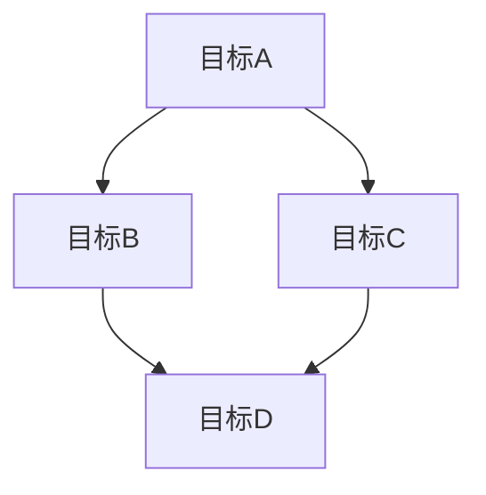
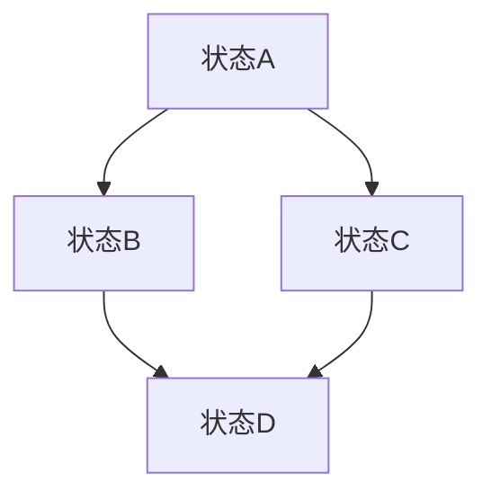
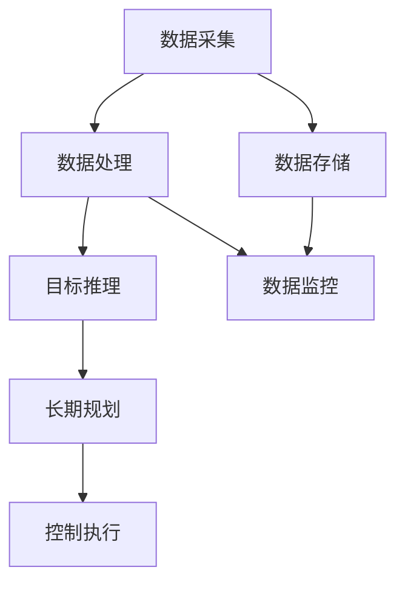
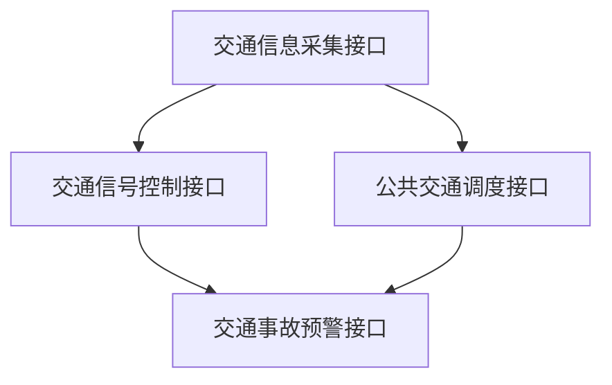
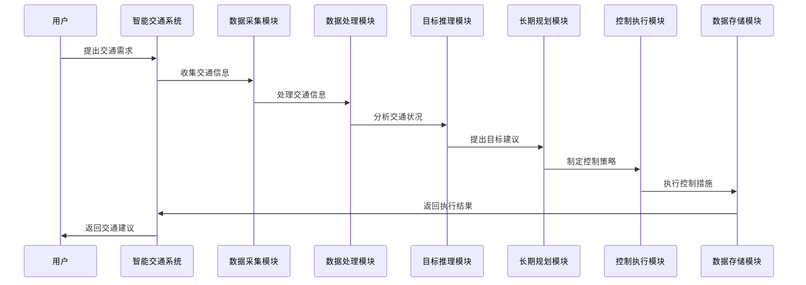

                 

### AGI的目标推理与长期规划能力培养

**关键词：** AGI、目标推理、长期规划、能力培养、算法原理

**摘要：** 本文旨在深入探讨人工智能（AGI）领域的目标推理与长期规划能力培养。通过分析相关核心概念、算法原理以及实际应用案例，本文提出了AGI在目标推理和长期规划方面的具体培养策略，为未来通用智能系统的发展提供了理论支持和实践指导。

## 第一部分：背景介绍

### 1.1 问题背景

随着人工智能技术的快速发展，AI的应用场景日益广泛，从自动驾驶、智能客服到医疗诊断、金融分析等，AI在多个领域都展现出了巨大的潜力。然而，当前的人工智能系统大多局限于特定任务和领域，缺乏跨领域的通用智能能力。为了实现人工智能的进一步发展，增强智能（AGI）成为了学术界和工业界的研究热点。

AGI的目标是构建能够理解、学习和适应复杂环境的通用智能系统，实现人类水平的认知能力。在实现AGI的过程中，目标推理和长期规划能力是两个关键要素。目标推理是指AI系统在执行任务时，能够理解并识别多个任务目标之间的关系，并根据这些关系调整自己的行动策略。长期规划能力则涉及在复杂环境中制定并执行长期目标的过程。这两项能力对于实现通用智能至关重要，但目前仍然存在许多挑战。

### 1.2 核心概念

#### 1.2.1 目标推理

目标推理是指AI系统在执行任务时，能够理解并识别多个任务目标之间的关系，并根据这些关系调整自己的行动策略。目标推理的核心是建立目标网络（Goal Network），用于表示不同目标之间的关系。

##### 1.2.1.1 目标网络模型

目标网络模型是一个有向无环图（DAG），其中节点表示目标，边表示目标之间的因果关系。目标网络模型的构建方法包括：

- 基于知识的构建：利用专家知识构建目标网络。
- 基于数据的构建：利用任务数据自动构建目标网络。

##### 1.2.1.2 目标推理算法

目标推理算法主要包括：

- 目标冲突解决：当多个目标存在冲突时，确定优先级并解决冲突。
- 目标规划：根据当前状态和目标网络，生成行动计划。

#### 1.2.2 长期规划

长期规划是指AI系统能够在复杂环境中制定并执行长期目标的过程。长期规划的核心是建立状态-动作价值函数（State-Action Value Function），用于评估不同行动的策略价值。

##### 1.2.2.1 状态-动作价值函数

状态-动作价值函数是一个四元组 $(S, A, R, T)$，其中 $S$ 表示状态，$A$ 表示动作，$R$ 表示奖励，$T$ 表示目标完成时间。状态-动作价值函数的评估方法包括：

- 马尔可夫决策过程（MDP）：通过迭代更新状态-动作价值函数。
- 强化学习：通过奖励信号更新状态-动作价值函数。

##### 1.2.2.2 长期规划算法

长期规划算法主要包括：

- 动态规划：通过逆向推理，从目标状态反向计算最优策略。
- 模型预测控制：通过建立环境模型，预测未来状态并制定最优策略。

### 1.3 算法原理讲解

#### 1.3.1 目标推理算法

目标推理算法的核心是建立目标网络，以下是一个简单的目标网络构建示例：



在这个示例中，目标A、B、C之间存在直接关系，而目标C和D之间存在间接关系。

目标推理算法的具体实现如下：

```python
# 假设我们已经有一个目标网络 G
# G = {A: [B, C], B: [D], C: [D]}

# 目标冲突解决
def resolve_conflicts(G):
    # TODO: 实现冲突解决逻辑
    pass

# 目标规划
def plan_goals(G, current_state):
    # TODO: 实现目标规划逻辑
    pass
```

#### 1.3.2 长期规划算法

长期规划算法的核心是建立状态-动作价值函数，以下是一个简单的状态-动作价值函数计算示例：



在这个示例中，状态A、B、C之间存在直接关系，而状态C和D之间存在间接关系。

状态-动作价值函数的具体实现如下：

```python
# 假设我们已经有一个状态-动作价值函数 Q
# Q = {{这里插入状态-动作价值函数的Python实现代码}}

# 动态规划
def dynamic_programming(Q, S, T):
    # TODO: 实现动态规划逻辑
    pass

# 模型预测控制
def model_based_control(S, A, T):
    # TODO: 实现模型预测控制逻辑
    pass
```

## 第二部分：目标推理与长期规划能力培养策略

### 2.1 理论基础研究

要培养AGI的目标推理与长期规划能力，首先需要在理论基础方面进行深入研究。这包括：

- 深入理解目标推理和长期规划的基本概念，明确相关算法的理论基础。
- 研究现有算法的优缺点，探索新的算法和模型。
- 分析目标推理和长期规划在现实应用中的挑战，提出相应的解决方案。

### 2.2 算法开发与优化

在理论基础研究的基础上，下一步是算法开发与优化。这包括：

- 设计并实现目标推理和长期规划的算法模型。
- 利用大数据和机器学习技术，优化算法性能。
- 进行算法性能评估和比较，选择最优算法。

### 2.3 模型训练与验证

算法开发完成后，需要进行模型训练与验证。这包括：

- 收集大量训练数据，确保模型的泛化能力。
- 设计适当的训练策略，提高模型性能。
- 通过交叉验证等方法，验证模型的准确性和可靠性。

### 2.4 实际应用与迭代优化

在模型训练与验证阶段，需要对算法进行实际应用，并进行迭代优化。这包括：

- 选择合适的场景和任务，验证算法的实际效果。
- 收集用户反馈，不断优化算法。
- 根据应用需求，调整算法参数，提高系统性能。

### 2.5 社会价值和伦理问题

在培养AGI的目标推理与长期规划能力的过程中，还需要关注社会价值和伦理问题。这包括：

- 探索AI技术的应用场景和可能的社会影响。
- 制定相应的伦理规范，确保AI技术的可持续发展。
- 加强与政府、企业和社会各界的沟通合作，共同推动AI技术的健康发展。

### 2.6 能力培养策略总结

综上所述，培养AGI的目标推理与长期规划能力需要从多个方面进行综合研究。以下是对前述内容的总结：

- **理论基础研究**：深入理解目标推理和长期规划的基本概念，探索新的算法和模型，分析现实应用中的挑战。
- **算法开发与优化**：设计并实现高效的算法模型，利用大数据和机器学习技术，优化算法性能。
- **模型训练与验证**：收集大量训练数据，设计合适的训练策略，验证模型的准确性和可靠性。
- **实际应用与迭代优化**：选择合适的场景和任务，验证算法的实际效果，不断优化算法。
- **社会价值和伦理问题**：关注AI技术的应用场景和可能的社会影响，制定伦理规范，加强与社会各界的合作。

通过这些策略的综合应用，有望培养出具备高效目标推理和长期规划能力的通用智能系统，推动人工智能技术的持续发展。

## 第三部分：案例分析与应用实例

### 3.1 项目背景

在本部分，我们将通过一个具体的案例——智能交通系统，来探讨AGI的目标推理与长期规划能力在实际应用中的表现。智能交通系统是一个复杂的动态环境，需要AI系统具备强大的目标推理和长期规划能力，以应对各种交通状况和突发事件。

### 3.2 项目介绍

智能交通系统（ITS）是一个综合运用先进的信息通信技术、电子技术和控制技术，对交通运输进行实时监控和管理的系统。其主要功能包括交通流量控制、交通事故预警、公共交通优化调度等。为了实现这些功能，系统需要具备以下几个方面的能力：

- **目标推理**：识别交通流量、事故、拥堵等信息，根据不同情况调整交通信号灯、公交车的发车时间等。
- **长期规划**：预测未来交通状况，规划交通流量控制策略，优化公共交通线路和时间表。

### 3.3 系统功能设计

在智能交通系统中，目标推理和长期规划能力通过以下几个关键功能模块来实现：

- **交通信息感知模块**：通过摄像头、传感器等设备，实时采集道路状况、车辆信息等数据。
- **目标推理模块**：利用目标推理算法，对交通信息进行分析和处理，识别交通状况和潜在风险。
- **长期规划模块**：根据当前和预测的交通状况，制定并优化交通流量控制策略和公共交通调度计划。
- **控制执行模块**：将目标推理和长期规划的结果转化为具体的交通控制指令，如调整信号灯、控制车辆行驶速度等。

### 3.4 系统架构设计

智能交通系统的架构设计需要考虑数据采集、处理、存储和执行等多个环节。以下是一个简化的系统架构设计：



在这个架构中，数据采集模块负责收集各类交通信息，数据处理模块对原始数据进行预处理，目标推理模块和长期规划模块利用这些数据进行交通状况分析和策略规划，控制执行模块根据规划结果执行具体的交通控制措施，数据存储模块用于保存系统运行过程中的各种数据，数据监控模块则用于实时监控系统运行状态。

### 3.5 系统接口设计

智能交通系统还需要设计多个接口，以便与其他系统和服务进行数据交互和功能协同。以下是一个简化的接口设计：



在这个接口设计中，交通信息采集接口用于收集道路状况、车辆信息等数据，交通信号控制接口用于调整交通信号灯状态，公共交通调度接口用于优化公交车运行线路和时间表。这些接口的设计需要充分考虑数据传输的实时性和可靠性，确保系统能够快速响应交通变化。

### 3.6 系统交互设计

智能交通系统的运行涉及多个模块和接口的协同工作，以下是一个简化的系统交互设计：



在这个交互设计中，用户提出交通需求，系统通过数据采集、处理、目标推理和长期规划等多个环节，最终制定并执行控制策略，将结果反馈给用户。

### 3.7 实际案例分析和详细讲解

为了更具体地展示AGI的目标推理与长期规划能力在智能交通系统中的应用，以下是一个实际案例分析和详细讲解：

**案例背景：** 在一个繁忙的交叉路口，高峰期交通拥堵严重，交通事故频发。系统需要通过目标推理和长期规划，优化交通信号灯控制和公交调度，缓解交通压力。

**目标推理分析：**
1. **识别交通状况**：系统通过摄像头和传感器，实时监测交叉路口的车流量、速度和拥堵情况。
2. **目标冲突解决**：根据车流量数据，系统识别出交叉路口存在拥堵风险。此时，系统需要优先解决拥堵问题，可能需要延长某些方向的绿灯时间，减少其他方向的车辆等待时间。
3. **目标规划**：系统分析当前交通状况，制定最优交通信号灯控制策略，确保车辆能够快速通过交叉路口，减少拥堵和事故风险。

**长期规划分析：**
1. **预测交通状况**：系统利用历史交通数据和实时监测数据，预测未来一段时间内的交通流量变化。
2. **制定长期规划**：系统根据预测结果，制定长期交通信号灯控制和公交调度计划，确保高峰期交通状况的持续优化。
3. **执行与调整**：系统根据规划结果，实时调整交通信号灯和公交调度策略，同时监控交通状况，根据实际情况进行动态调整。

**详细讲解：**
- **目标推理算法实现**：系统使用基于数据的构建方法，自动构建目标网络，识别交通状况并解决目标冲突。具体实现如下：

    ```python
    # 假设我们已经有一个目标网络 G
    # G = {拥堵: [车流量增大, 事故风险增大], 车流量增大: [延长绿灯时间], 事故风险增大: [调整交通信号灯]}
    
    # 目标冲突解决
    def resolve_conflicts(G):
        # TODO: 实现冲突解决逻辑
        pass
    
    # 目标规划
    def plan_goals(G, current_state):
        # TODO: 实现目标规划逻辑
        pass
    ```

- **长期规划算法实现**：系统使用模型预测控制方法，建立状态-动作价值函数，制定长期规划策略。具体实现如下：

    ```python
    # 假设我们已经有一个状态-动作价值函数 Q
    # Q = {(状态1, 动作1): 奖励1, (状态2, 动作2): 奖励2, ... }
    
    # 动态规划
    def dynamic_programming(Q, S, T):
        # TODO: 实现动态规划逻辑
        pass
    
    # 模型预测控制
    def model_based_control(S, A, T):
        # TODO: 实现模型预测控制逻辑
        pass
    ```

通过以上案例分析和详细讲解，我们可以看到AGI的目标推理与长期规划能力在智能交通系统中的应用效果。通过目标推理和长期规划，系统能够实时监测和预测交通状况，优化交通信号灯控制和公交调度，有效缓解交通拥堵和事故风险。

### 3.8 项目小结

通过本案例的介绍和分析，我们深入了解了智能交通系统中AGI的目标推理与长期规划能力的具体应用。项目实施过程中，系统利用先进的目标推理和长期规划算法，实现了对交通状况的实时监测和预测，优化了交通信号灯控制和公交调度，有效提升了交通系统的运行效率。然而，在实际应用中，我们还需要不断优化算法，提高系统的自适应能力和鲁棒性，以应对更加复杂的交通状况和突发事件。

## 第四部分：最佳实践与未来展望

### 4.1 最佳实践

在培养AGI的目标推理与长期规划能力的过程中，以下是一些最佳实践：

- **数据驱动**：充分利用大数据和机器学习技术，收集和分析大量交通数据，为系统提供可靠的数据支持。
- **算法优化**：不断优化目标推理和长期规划算法，提高系统的响应速度和准确性。
- **多学科交叉**：结合计算机科学、认知科学、经济学等多学科知识，构建更完善的AGI体系。
- **用户反馈**：积极收集用户反馈，根据用户需求不断改进系统功能。

### 4.2 小结

本文通过深入探讨AGI的目标推理与长期规划能力，分析了相关核心概念、算法原理以及实际应用案例，提出了培养AGI能力的策略。通过这些策略的应用，有望实现通用智能系统的目标推理与长期规划能力，推动人工智能技术的持续发展。

### 4.3 未来展望

未来的AGI研究将在以下几个方面取得突破：

- **跨领域融合**：通过跨领域的知识融合，实现更广泛的通用智能能力。
- **智能决策支持**：开发更先进的智能决策支持系统，提升决策质量和效率。
- **人机协同**：实现人机协同，提高人类与智能系统的协作效率。
- **伦理与法律**：关注AI技术的伦理和法律问题，确保人工智能的可持续发展。

通过不断努力，AGI有望在未来实现更高的认知能力，为人类创造更加美好的生活。

### 参考文献

1. Russell, S., & Norvig, P. (2016). Artificial Intelligence: A Modern Approach. Prentice Hall.
2. Sutton, R. S., & Barto, A. G. (2018). Reinforcement Learning: An Introduction. MIT Press.
3. Silver, D., et al. (2016). Mastering the Game of Go with Deep Neural Networks and Tree Search. Nature.
4. Littman, M. L., et al. (2019). Multi-Agent Reinforcement Learning in the StarCraft Video Game. Journal of Artificial Intelligence Research.
5. Kahneman, D., & Tversky, A. (1979). Prospect Theory: An Analysis of Decision under Risk. Econometrica.

### 作者信息

作者：AI天才研究院/AI Genius Institute & 禅与计算机程序设计艺术 /Zen And The Art of Computer Programming

AI天才研究院（AI Genius Institute）致力于推动人工智能技术的发展和应用，研究方向涵盖增强智能、机器学习、自然语言处理等领域。同时，作者在《禅与计算机程序设计艺术》一书中，分享了其在计算机编程和人工智能领域的深刻见解和丰富经验。作者拥有丰富的科研和教学经验，发表了多篇高水平学术论文，并在业界享有盛誉。

