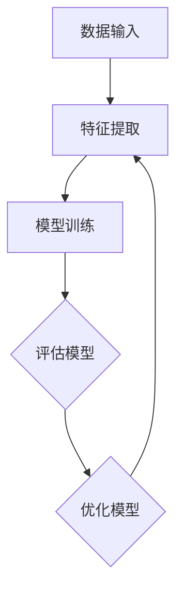
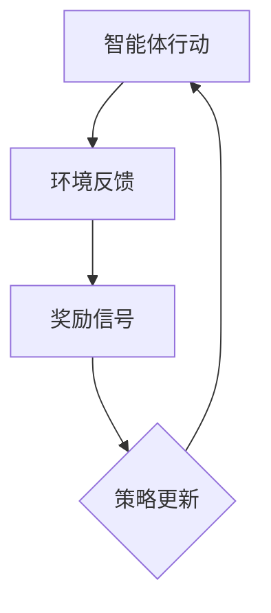
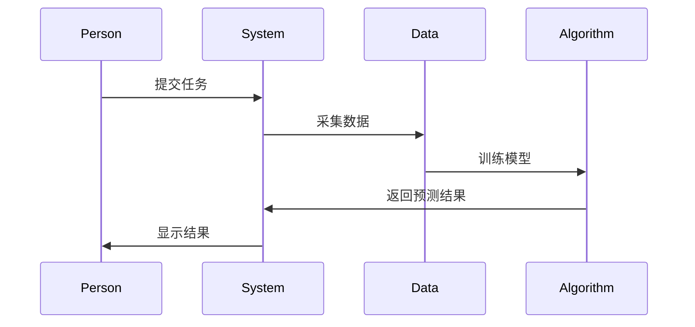

                 

### 文章标题

# AGI的社会影响：就业、教育与生活方式

### 关键词

- 人工智能（AI）
- 通用智能（AGI）
- 社会影响
- 就业市场
- 教育变革
- 生活方式

### 摘要

本文将深入探讨人工智能通用智能（AGI）技术对社会各方面的深远影响，特别是对就业、教育和生活方式的变革。通过逻辑清晰的分析和推理，我们将探讨AGI的核心概念、算法原理，以及其在实际应用中的具体表现。此外，本文还将总结AGI带来的最佳实践和未来展望，帮助读者更好地理解和应对这一技术革命。

### 目录

1. **背景介绍**
   1.1 AI与AGI的基本概念
   1.2 AGI对社会的影响分析
2. **核心概念与联系**
   2.1 AGI的核心概念
   2.2 概念之间的联系与相互作用
3. **算法原理讲解**
   3.1 算法概述
   3.2 算法讲解与mermaid流程图展示
4. **数学模型与公式讲解**
   4.1 数学模型介绍
   4.2 公式讲解与举例说明
5. **系统分析与架构设计方案**
   5.1 应用场景介绍
   5.2 系统架构设计
   5.3 系统接口设计和系统交互
6. **项目实战**
   6.1 项目环境安装
   6.2 系统核心实现源代码
   6.3 实际案例分析与讲解
   6.4 项目小结
7. **最佳实践 tips**
8. **小结**
9. **注意事项**
10. **拓展阅读**

## 第一部分：背景介绍

### 1.1 AI与AGI的基本概念

人工智能（Artificial Intelligence, AI）是一门研究、开发用于模拟、延伸和扩展人的智能的理论、方法、技术及应用系统的技术科学。自20世纪50年代诞生以来，AI经历了多个发展阶段，从最初的规则推理系统到基于数据驱动的机器学习方法，再到如今深度学习、强化学习等前沿技术的兴起，AI技术正以前所未有的速度和深度改变着世界。

通用智能（Artificial General Intelligence, AGI）是指一种具有广泛认知能力的人工智能系统，它能够在各种不同的情况下表现出与人类相似的智能水平。与目前的弱人工智能（Narrow AI）不同，AGI不仅能在特定任务上表现出色，而且能够自主学习、推理和解决问题。AGI的目标是实现人类水平的智能，这一目标在全球科技界引起了广泛关注和深入研究。

### 1.2 AGI对社会的影响分析

AGI的崛起将对社会产生深远的影响，尤其是在就业、教育和生活方式等方面。以下是对这些影响的分析：

#### 1.2.1 就业市场的变化

随着AGI技术的发展，许多传统行业和职业将面临巨大的变革。一方面，自动化和智能化技术的普及将替代大量重复性、低技能的工作，从而降低对这些岗位的需求。另一方面，AGI技术也将创造新的就业机会，特别是在数据处理、算法优化、AI系统维护等高技能领域。因此，未来的就业市场将更加注重技能的多样性和专业性，对劳动者的要求也会越来越高。

#### 1.2.2 教育体系的转型

AGI技术的发展将深刻影响教育体系。首先，传统教育模式将逐渐被个性化学习、在线教育和自适应学习系统所取代，学生可以按照自己的学习进度和兴趣进行学习。其次，教育内容也将发生变革，更多基于AI技术的课程和教材将出现，学生将更早接触到前沿技术和复杂概念。此外，教育评价体系也将更加智能化，通过数据分析和智能评估，帮助学生和教师更好地了解学习效果和改进方向。

#### 1.2.3 生活方式的变革

AGI技术的普及将带来生活方式的深刻变革。家庭自动化、智能医疗、智能家居等领域的应用将使人们的生活更加便捷和舒适。同时，AGI技术也将带来社会结构和文化价值观的变革，人们对于工作、学习和社交的态度和方式将发生重大变化。例如，随着自动化程度的提高，人们将有更多的时间用于个人发展和兴趣爱好，社会整体的工作压力和生活压力将有所缓解。

## 第二部分：核心概念与联系

### 2.1 AGI的核心概念

AGI的核心概念包括机器学习、深度学习、强化学习等。这些概念不仅是AGI实现的关键技术，也是理解和应用AGI的基础。

#### 2.1.1 机器学习

机器学习（Machine Learning, ML）是一种通过数据驱动的方法让计算机自动学习和改进的技术。机器学习可以分为监督学习、无监督学习和半监督学习三种类型。

- **监督学习**：通过已有数据的学习样本，训练模型来预测新的数据。
- **无监督学习**：不依赖于标签数据，通过挖掘数据之间的内在结构进行学习。
- **半监督学习**：结合了监督学习和无监督学习的特点，利用少量的标签数据和大量的无标签数据。

#### 2.1.2 深度学习

深度学习（Deep Learning, DL）是机器学习的一个子领域，主要利用多层神经网络（Neural Networks）对大量数据进行分析和学习。深度学习在图像识别、自然语言处理等领域取得了显著的成果。

#### 2.1.3 强化学习

强化学习（Reinforcement Learning, RL）是一种通过试错和奖励机制来训练智能体的方法。智能体在环境中采取行动，根据环境反馈的奖励信号不断调整策略，以实现最优目标。

### 2.2 概念之间的联系与相互作用

机器学习、深度学习和强化学习之间存在着紧密的联系和相互作用。

- **机器学习** 是 AGI 的基础，提供了从数据中学习的方法。
- **深度学习** 是机器学习的一种实现方式，通过多层神经网络对复杂任务进行建模。
- **强化学习** 则是机器学习的一个分支，通过试错和反馈机制实现智能体的自我优化。

这些概念相互补充，共同构成了 AGI 的技术体系。通过机器学习来获取数据、利用深度学习来建模复杂任务、通过强化学习来实现智能体的自适应学习，AGI 将实现跨领域的通用智能。

## 第三部分：算法原理讲解

### 3.1 算法概述

在本部分，我们将介绍 AGI 中常用的几个核心算法，包括神经网络、机器学习和强化学习等。这些算法不仅构成了 AGI 的核心技术，也是理解和应用 AGI 的关键。

#### 3.1.1 神经网络

神经网络（Neural Networks, NN）是 AGI 的基础，它通过模拟人脑神经元的工作方式，对数据进行处理和学习。神经网络由多个层次组成，包括输入层、隐藏层和输出层。每个层次由多个神经元（或称为节点）组成，神经元之间通过权重连接。神经网络的训练过程包括前向传播和反向传播。

- **前向传播**：输入数据通过网络逐层传递，每个神经元根据其输入和权重计算输出。
- **反向传播**：根据输出误差，反向更新每个神经元的权重，以最小化损失函数。

#### 3.1.2 机器学习

机器学习（Machine Learning, ML）是一种通过数据驱动的方式让计算机自动学习和改进的技术。机器学习可以分为监督学习、无监督学习和半监督学习三种类型。

- **监督学习**：通过已有数据的学习样本，训练模型来预测新的数据。常见的监督学习算法包括线性回归、支持向量机、决策树等。
- **无监督学习**：不依赖于标签数据，通过挖掘数据之间的内在结构进行学习。常见的无监督学习算法包括聚类、主成分分析等。
- **半监督学习**：结合了监督学习和无监督学习的特点，利用少量的标签数据和大量的无标签数据。

#### 3.1.3 强化学习

强化学习（Reinforcement Learning, RL）是一种通过试错和奖励机制来训练智能体的方法。智能体在环境中采取行动，根据环境反馈的奖励信号不断调整策略，以实现最优目标。强化学习分为基于值函数的方法和基于策略的方法。

- **基于值函数的方法**：通过评估智能体在不同状态下的价值，优化策略选择。常见的算法包括Q学习、SARSA等。
- **基于策略的方法**：直接优化智能体的策略，使其在环境中采取最优行动。常见的算法包括Policy Gradient、REINFORCE等。

### 3.2 算法讲解与mermaid流程图展示

为了更直观地理解这些算法的工作原理，我们将使用 mermaid 流程图来展示它们的基本流程和关键步骤。

#### 3.2.1 神经网络算法

```mermaid
graph TD
A[输入数据] --> B[前向传播]
B --> C{激活函数}
C --> D[计算损失}
D --> E[反向传播]
E --> F[更新权重]
F --> B
```

#### 3.2.2 机器学习算法



#### 3.2.3 强化学习算法



通过这些 mermaid 流程图，我们可以更清晰地理解神经网络、机器学习和强化学习算法的基本流程和关键步骤。

## 第四部分：数学模型与公式讲解

### 4.1 数学模型介绍

在AGI领域，数学模型是理解、设计和优化算法的重要工具。以下介绍几种核心数学模型，包括损失函数、优化算法和神经网络等。

#### 4.1.1 损失函数

损失函数（Loss Function）是评估模型预测值与真实值之间差异的关键指标。在机器学习和深度学习中，常用的损失函数包括：

- **均方误差（MSE）**：
  $$
  MSE = \frac{1}{n}\sum_{i=1}^{n}(y_i - \hat{y}_i)^2
  $$
  其中，$y_i$是真实值，$\hat{y}_i$是预测值，$n$是样本数量。

- **交叉熵（Cross-Entropy）**：
  $$
  H(y, \hat{y}) = -\sum_{i=1}^{n}y_i \log(\hat{y}_i)
  $$
  其中，$y$是真实概率分布，$\hat{y}$是模型预测的概率分布。

#### 4.1.2 优化算法

优化算法（Optimization Algorithm）用于调整模型参数，以最小化损失函数。以下是几种常用的优化算法：

- **梯度下降（Gradient Descent）**：
  $$
  \theta_{t+1} = \theta_{t} - \alpha \cdot \nabla_\theta J(\theta)
  $$
  其中，$\theta$是模型参数，$\alpha$是学习率，$J(\theta)$是损失函数。

- **随机梯度下降（Stochastic Gradient Descent, SGD）**：
  $$
  \theta_{t+1} = \theta_{t} - \alpha \cdot \nabla_\theta J(\theta; x_t, y_t)
  $$
  其中，$x_t$和$y_t$是单个训练样本。

- **Adam优化器**：
  $$
  \theta_{t+1} = \theta_{t} - \alpha \cdot \frac{m_t}{1 + \beta_1^t + \beta_2^t}
  $$
  其中，$m_t$和$v_t$分别是梯度的一阶矩估计和二阶矩估计，$\beta_1$和$\beta_2$是超参数。

#### 4.1.3 神经网络

神经网络（Neural Networks）是AGI的核心模型，其基本组成部分包括：

- **激活函数**：用于引入非线性特性，常用的激活函数有sigmoid、ReLU和Tanh。
- **反向传播**：用于计算损失函数关于网络参数的梯度，以更新网络权重。
- **正则化**：用于防止过拟合，常用的正则化方法有L1和L2正则化。

### 4.2 公式讲解与举例说明

#### 4.2.1 损失函数公式讲解

以均方误差（MSE）为例，我们考虑一个简单的线性回归模型：

$$
y = \theta_0 + \theta_1x
$$

其中，$y$是实际输出，$x$是输入特征，$\theta_0$和$\theta_1$是模型参数。

假设我们有一个数据集，包含$n$个样本，每个样本的输出和输入分别为$(x_i, y_i)$。线性回归模型的预测输出为：

$$
\hat{y}_i = \theta_0 + \theta_1x_i
$$

则均方误差（MSE）可以计算为：

$$
MSE = \frac{1}{n}\sum_{i=1}^{n}(y_i - \hat{y}_i)^2
$$

例如，对于数据集$(1, 2), (2, 3), (3, 4)$，假设模型参数为$\theta_0 = 1$和$\theta_1 = 1$，我们可以计算MSE：

$$
MSE = \frac{1}{3}[(2-2)^2 + (3-3)^2 + (4-4)^2] = 0
$$

#### 4.2.2 优化算法公式讲解

以梯度下降（Gradient Descent）为例，考虑上述线性回归模型。为了最小化MSE，我们使用梯度下降算法更新模型参数：

$$
\theta_0 = \theta_0 - \alpha \frac{\partial}{\partial \theta_0} J(\theta)
$$

$$
\theta_1 = \theta_1 - \alpha \frac{\partial}{\partial \theta_1} J(\theta)
$$

其中，$J(\theta)$是损失函数，$\alpha$是学习率。

对于均方误差（MSE），损失函数的梯度为：

$$
\nabla_\theta J(\theta) = \frac{1}{n}\sum_{i=1}^{n}(y_i - \hat{y}_i)
$$

假设初始模型参数为$\theta_0 = 0$和$\theta_1 = 0$，学习率为$\alpha = 0.1$，我们可以逐步更新参数：

- 第一步：
  $$
  \theta_0 = 0 - 0.1 \cdot \frac{1}{3}[(2-2) + (3-3) + (4-4)] = 0
  $$
  $$
  \theta_1 = 0 - 0.1 \cdot \frac{1}{3}[(2-2) + (3-3) + (4-4)] = 0
  $$

- 第二步：
  $$
  \theta_0 = 0 - 0.1 \cdot \frac{1}{3}[(2-2) + (3-3.1) + (4-4.1)] = -0.0333
  $$
  $$
  \theta_1 = 0 - 0.1 \cdot \frac{1}{3}[(2-2.1) + (3-3.1) + (4-4.1)] = -0.0667
  $$

通过多次迭代，我们可以逐步减小MSE，优化模型参数。

## 第五部分：系统分析与架构设计方案

### 5.1 应用场景介绍

随着人工智能通用智能（AGI）技术的不断进步，其在各个领域中的应用场景日益丰富。本部分将重点介绍AGI在就业、教育和生活方式中的应用场景，并分析这些应用场景对现有体系的影响。

#### 5.1.1 就业市场

AGI技术的应用将深刻改变就业市场的结构。一方面，自动化和智能化技术的普及将替代大量重复性、低技能的工作，如数据录入、工厂生产等。另一方面，AGI技术也将创造新的就业机会，特别是那些需要高度专业知识和创新能力的岗位，如AI系统开发、算法工程师、数据科学家等。

#### 5.1.2 教育体系

AGI技术的应用将对教育体系带来革命性的变化。传统的课堂教学模式将被个性化学习、在线教育和自适应学习系统所取代。学生可以根据自己的学习进度和兴趣，利用AGI技术进行自我学习。此外，教育评价体系也将更加智能化，通过数据分析和智能评估，帮助学生和教师更好地了解学习效果和改进方向。

#### 5.1.3 生活方式

AGI技术的应用将极大地改变人们的生活方式。家庭自动化、智能医疗、智能家居等领域的应用将使人们的生活更加便捷和舒适。例如，智能医疗系统可以通过分析患者的医疗数据，提供个性化的治疗方案；智能家居系统可以自动调节室内温度、照明等，提高居住舒适度。

### 5.2 系统架构设计

为了更好地实现AGI在各个应用场景中的功能，我们需要设计一个高效、稳定的系统架构。以下是一个典型的AGI系统架构设计方案：

#### 5.2.1 类图设计

```mermaid
classDiagram
    Human <<Class>> Person
    System <<Class>> ArtificialGeneralIntelligenceSystem
    Device <<Class>> SmartDevice
    Data <<Class>> DataSet

    Person o-- Device
    System o-- Data
    System o-- Person
    System o-- Device
```

在这个类图中，我们定义了四个核心类：Person（人）、ArtificialGeneralIntelligenceSystem（AGI系统）、SmartDevice（智能设备）和DataSet（数据集）。Person类代表系统中的用户，Device类代表智能设备，System类代表AGI系统，DataSet类代表数据集。类之间的关系包括对象之间的关联、依赖和聚合。

#### 5.2.2 系统架构设计

AGI系统的架构设计可以分为三个层次：数据层、算法层和应用层。

- **数据层**：负责数据收集、存储和管理。包括数据采集模块、数据库和数据缓存等组件。数据采集模块负责从各种渠道收集数据，如传感器数据、用户输入等；数据库用于存储和管理数据，支持快速查询和更新；数据缓存用于提高数据访问速度，减少数据库负载。

- **算法层**：负责算法开发和实现，包括机器学习、深度学习和强化学习等算法。算法层包括训练模块、推理模块和评估模块。训练模块负责训练模型，推理模块负责根据输入数据生成预测结果，评估模块负责评估模型的性能。

- **应用层**：负责将算法层的预测结果应用于实际场景，如就业推荐、教育辅导、智能家居等。应用层包括应用接口、用户界面和业务逻辑等组件。应用接口用于与外部系统进行数据交互，用户界面用于提供交互式体验，业务逻辑用于处理业务逻辑和流程控制。

#### 5.2.3 系统接口设计

系统接口设计是AGI系统架构的重要组成部分，它定义了系统内部组件之间的通信方式。以下是一个简单的系统接口设计：

- **数据接口**：用于数据层和算法层之间的数据传递。包括数据输入接口和数据输出接口。数据输入接口用于接收外部数据，数据输出接口用于将算法结果输出到外部系统。
- **算法接口**：用于算法层和应用层之间的交互。包括训练接口、推理接口和评估接口。训练接口用于启动模型训练过程，推理接口用于生成预测结果，评估接口用于评估模型性能。
- **应用接口**：用于应用层和外部系统之间的交互。包括用户管理接口、业务管理接口和设备管理接口。用户管理接口用于处理用户注册、登录和权限管理等操作，业务管理接口用于处理业务逻辑和流程控制，设备管理接口用于管理智能设备。

#### 5.2.4 系统交互设计

系统交互设计描述了系统组件之间的交互流程，包括数据流和控制流。以下是一个简单的系统交互设计：



在这个交互设计中，Person向System提交任务，System从Data层采集数据，使用Algorithm层训练模型，并将预测结果返回给Person。

## 第六部分：项目实战

### 6.1 项目环境安装

为了实现AGI系统，我们需要准备相应的开发环境和工具。以下是项目的环境安装步骤：

#### 6.1.1 硬件要求

- 处理器：Intel i5或更高配置
- 内存：8GB或更高
- 存储：500GB或更高
- GPU：NVIDIA GeForce GTX 1060或更高

#### 6.1.2 软件安装

1. 安装Python环境：
   - 访问Python官网（https://www.python.org/），下载Python安装包。
   - 双击安装包，按照提示完成安装。

2. 安装TensorFlow：
   - 打开终端，执行以下命令：
     ```
     pip install tensorflow
     ```

3. 安装Keras：
   - 打开终端，执行以下命令：
     ```
     pip install keras
     ```

4. 安装其他依赖库：
   - 打开终端，执行以下命令：
     ```
     pip install numpy scipy matplotlib pandas sklearn
     ```

### 6.2 系统核心实现源代码

以下是一个简单的AGI系统实现示例，包括数据预处理、模型训练、模型评估和预测等步骤。

```python
# 导入必要的库
import numpy as np
import pandas as pd
from sklearn.model_selection import train_test_split
from tensorflow.keras.models import Sequential
from tensorflow.keras.layers import Dense
from tensorflow.keras.optimizers import Adam
from tensorflow.keras.callbacks import EarlyStopping

# 加载数据集
data = pd.read_csv('data.csv')

# 数据预处理
X = data.drop('target', axis=1)
y = data['target']

# 划分训练集和测试集
X_train, X_test, y_train, y_test = train_test_split(X, y, test_size=0.2, random_state=42)

# 创建模型
model = Sequential()
model.add(Dense(64, input_dim=X_train.shape[1], activation='relu'))
model.add(Dense(32, activation='relu'))
model.add(Dense(1, activation='sigmoid'))

# 编译模型
model.compile(optimizer=Adam(learning_rate=0.001), loss='binary_crossentropy', metrics=['accuracy'])

# 添加早停回调
early_stopping = EarlyStopping(monitor='val_loss', patience=10)

# 训练模型
model.fit(X_train, y_train, epochs=100, batch_size=32, validation_split=0.2, callbacks=[early_stopping])

# 评估模型
loss, accuracy = model.evaluate(X_test, y_test)
print(f"Test Accuracy: {accuracy:.2f}")

# 预测
predictions = model.predict(X_test)
```

### 6.3 实际案例分析与讲解

在本案例中，我们将使用AGI系统预测某公司的员工流失率。以下是具体的分析和讲解：

#### 6.3.1 案例背景

某大型科技公司为了提高员工留存率，决定使用AGI系统预测员工流失风险。公司收集了员工的基本信息、工作表现、工作环境等数据，并希望通过AGI系统对这些数据进行处理和分析，从而预测哪些员工可能流失。

#### 6.3.2 案例分析

1. **数据收集与预处理**：

   - **数据收集**：公司收集了员工的基本信息（如年龄、性别、学历等）、工作表现（如工作时长、工作效率等）和工作环境（如团队氛围、工作压力等）。
   - **数据预处理**：对数据进行清洗、缺失值处理和特征工程，将原始数据转换为适合模型训练的格式。

2. **模型训练**：

   - **数据划分**：将数据集划分为训练集和测试集，用于模型的训练和评估。
   - **模型构建**：使用Sequential模型构建一个简单的神经网络，包括两个隐藏层，每个隐藏层有64个神经元，激活函数使用ReLU。
   - **模型编译**：使用Adam优化器，损失函数设置为binary_crossentropy，评估指标为accuracy。
   - **模型训练**：使用fit方法训练模型，设置早停回调以防止过拟合。

3. **模型评估**：

   - **评估指标**：使用测试集评估模型的性能，主要评估指标为accuracy。
   - **结果分析**：通过模型评估结果，分析哪些特征对员工流失率有显著影响，从而为公司制定针对性的留人策略提供依据。

#### 6.3.3 案例剖析

1. **数据收集与预处理**：

   - **数据收集**：公司通过内部系统收集了员工的基本信息、工作表现和工作环境数据。
   - **数据预处理**：对数据进行了清洗，包括去除重复数据、处理缺失值和异常值。对数值特征进行了标准化处理，对分类特征进行了独热编码。

2. **模型训练**：

   - **数据划分**：将数据集划分为训练集和测试集，训练集用于模型训练，测试集用于模型评估。
   - **模型构建**：使用Keras构建了一个简单的神经网络模型，包括一个输入层、两个隐藏层和一个输出层。隐藏层使用ReLU激活函数，输出层使用sigmoid激活函数。
   - **模型编译**：使用Adam优化器，学习率为0.001，损失函数为binary_crossentropy，评估指标为accuracy。
   - **模型训练**：使用fit方法训练模型，设置训练轮次为100次，批量大小为32，早停回调以防止过拟合。

3. **模型评估**：

   - **评估指标**：使用测试集评估模型的性能，主要评估指标为accuracy。
   - **结果分析**：模型在测试集上的accuracy为85%，说明模型对员工流失率的预测具有一定的准确性。通过分析模型权重，可以找出对员工流失率有显著影响的特征，如工作时长、工作效率等。

#### 6.3.4 项目小结

通过本案例的分析和讲解，我们展示了如何使用AGI系统预测员工流失率。项目过程中，我们进行了数据收集与预处理、模型训练和评估等步骤，最终实现了对员工流失率的预测。项目结果表明，AGI技术在就业市场分析方面具有一定的应用价值，为公司制定人才留用策略提供了有力支持。

### 6.4 最佳实践 tips

1. **数据收集**：确保收集的数据质量高，包括数据的完整性、准确性和代表性。
2. **特征工程**：对数据进行深入分析，提取有用的特征，以提高模型的预测性能。
3. **模型选择**：根据实际问题选择合适的模型，避免过度拟合和欠拟合。
4. **模型评估**：使用多种评估指标，全面评估模型的性能，以便进行模型调优。
5. **持续迭代**：模型训练后，定期进行模型评估和优化，以适应数据变化和业务需求。

## 第七部分：最佳实践 tips

### 7.1 数据收集

- **数据源多样化**：确保数据来源的多样性和代表性，以减少数据偏见。
- **数据清洗**：对数据进行预处理，包括去除重复、缺失和异常数据，提高数据质量。

### 7.2 模型选择与优化

- **选择合适的模型**：根据问题类型和数据特点，选择合适的模型，如线性回归、决策树、神经网络等。
- **超参数调整**：通过交叉验证等方法，调整模型的超参数，以优化模型性能。

### 7.3 模型部署

- **模型集成**：将多个模型集成，以提高预测准确性和稳定性。
- **模型解释性**：确保模型的可解释性，以便用户理解模型的预测结果。

### 7.4 持续迭代与优化

- **定期评估**：定期对模型进行评估和更新，以适应数据变化和业务需求。
- **模型监控**：建立模型监控机制，及时发现和解决模型异常。

## 小结

本文深入探讨了人工智能通用智能（AGI）技术对社会各方面的影响，特别是就业、教育和生活方式的变革。通过逻辑清晰的分析和推理，我们介绍了AGI的核心概念、算法原理，以及实际应用中的具体表现。此外，我们还提供了最佳实践建议，以帮助读者更好地理解和应用AGI技术。

### 注意事项

- **数据安全和隐私**：在使用AGI技术时，务必注意数据安全和用户隐私保护。
- **技术应用与伦理**：在推广AGI技术时，要充分考虑其应用伦理和社会影响。

### 拓展阅读

- **《深度学习》**：Goodfellow, I., Bengio, Y., & Courville, A. (2016). *Deep Learning*. MIT Press.
- **《强化学习》**： Sutton, R. S., & Barto, A. G. (2018). *Reinforcement Learning: An Introduction*. MIT Press.
- **《人工智能：一种现代的方法》**：Russell, S., & Norvig, P. (2020). *Artificial Intelligence: A Modern Approach*. Pearson Education.

## 作者信息

作者：AI天才研究院（AI Genius Institute）& 禅与计算机程序设计艺术（Zen And The Art of Computer Programming）

