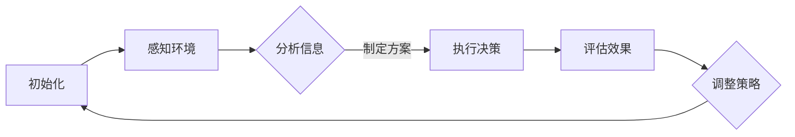
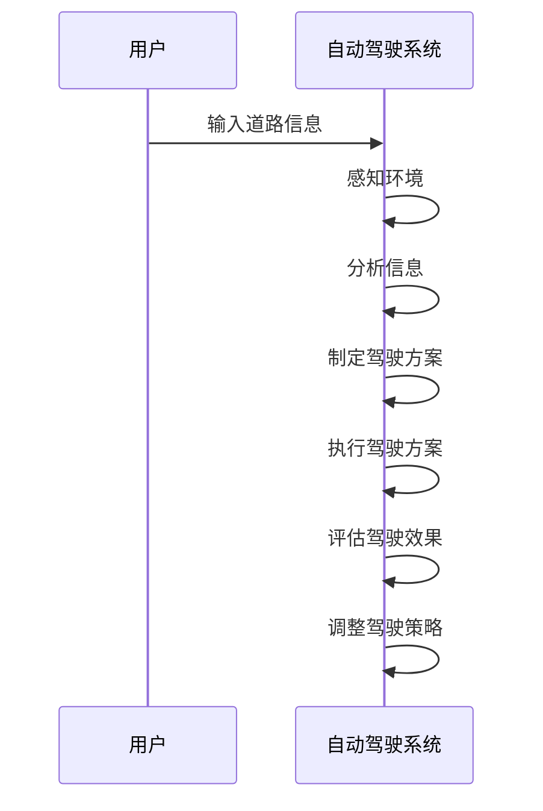
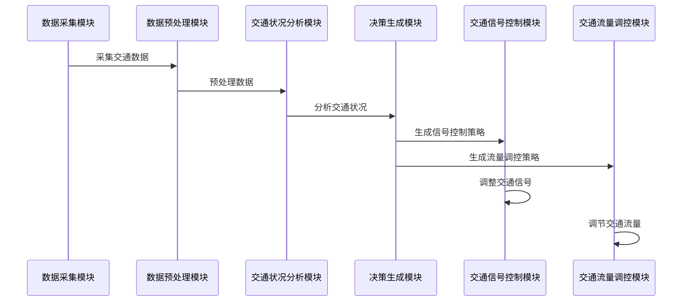
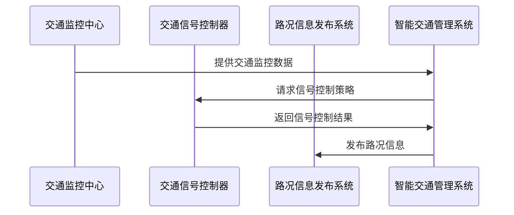

                 

# AGI的类人决策过程模拟

## 关键词

- 人工智能
- 自主决策
- 模拟
- 类人决策
- AGI

## 摘要

本文旨在探讨人工智能（AI）中的高级智能体（AGI）如何模拟人类的决策过程。我们将深入分析AGI和类人决策的概念，了解它们之间的联系与区别，并逐步探讨模拟AGI类人决策过程的机制和方法。通过系统的算法原理讲解、数学模型推导及实际应用案例，本文将帮助读者理解AGI类人决策过程的复杂性和应用前景。

## 第一部分：AGI与类人决策概述

### 第1章：引言

#### 1.1 问题背景

人工智能（AI）作为计算机科学的重要分支，从诞生之初就承载着模拟人类智能的愿景。经过几十年的发展，AI技术已经取得了显著的进展，从早期的规则推理系统，到基于统计学习的机器学习算法，再到最近的人工神经网络（ANN）和深度学习（DL），AI在图像识别、语音识别、自然语言处理等领域都取得了令人瞩目的成果。然而，尽管AI在这些领域取得了成功，但当前的人工智能系统仍然存在局限性，它们通常只能在特定任务上表现优异，而缺乏跨领域的通用智能。

高级智能体（AGI，Artificial General Intelligence）的概念正是在这种背景下提出的。AGI旨在模拟人类的通用智能，能够像人类一样进行自主学习和决策，解决各种复杂问题。AGI不仅需要在特定任务上表现出色，还需要具备跨领域的推理能力、适应性以及自主性。

类人决策（Human-like Decision Making）是AGI的重要特征之一。人类的决策过程是一个复杂的多因素交互过程，涉及到感知、思考、情感和经验等多种因素。类人决策旨在让AGI在决策过程中模拟人类的思维方式，提高决策的灵活性和准确性。

#### 1.2 问题提出

随着AGI的发展，模拟类人决策过程成为了一个亟待解决的问题。传统的AI系统通常是基于预设的规则或算法进行决策，缺乏灵活性和适应性。而类人决策模拟需要考虑更多的现实因素，如不确定性、时间约束、资源限制等，这为AGI的发展带来了巨大的挑战。

类人决策模拟的目标是让AGI能够在复杂的环境中做出类似人类的决策，提高其自主性和可靠性。这不仅可以应用于游戏、机器人等领域，还可以在金融、医疗、交通等关键行业中发挥重要作用。

#### 1.3 目标与意义

类人决策过程模拟的意义在于：

1. **提高AGI的适应能力**：通过模拟人类的决策过程，AGI可以更好地适应复杂多变的环境。
2. **提升决策的灵活性和准确性**：类人决策模拟可以让AGI在决策过程中考虑更多的因素，提高决策的灵活性和准确性。
3. **促进通用人工智能的发展**：类人决策是AGI的重要特征之一，通过研究类人决策过程模拟，可以推动通用人工智能的发展。

本文将首先介绍AGI和类人决策的基本概念，然后探讨类人决策模拟的方法和机制，最后通过实际案例进行分析和讨论。

### 第2章：核心概念与联系

#### 2.1 AGI概念原理

**定义**：高级智能体（AGI，Artificial General Intelligence）是指能够像人类一样具备通用智能的人工智能系统。AGI不仅要能在特定任务上表现优异，还要具备跨领域的推理能力、自我学习和决策能力。

**与传统AI的区别**：

- **传统AI**：通常是基于预设的规则或算法进行决策，缺乏自主性和灵活性。例如，聊天机器人通常只能根据预定义的脚本进行回答。
- **AGI**：具备自我学习和决策能力，能够在复杂的环境中自主地解决问题。AGI不仅能够处理静态数据，还能够处理动态数据，并适应环境的变化。

#### 2.2 类人决策概念解析

**定义**：类人决策（Human-like Decision Making）是指模拟人类决策过程的人工智能系统。类人决策涉及到感知、思考、情感和经验等多种因素，旨在让AGI在决策过程中模拟人类的思维方式。

**特征**：

- **多因素交互**：类人决策考虑多种因素，如感知信息、情感状态、历史经验等，这些因素在决策过程中相互作用，影响决策结果。
- **灵活性和适应性**：类人决策能够根据环境的变化和目标的调整，灵活地调整决策策略，适应不同的情境。
- **情感与认知的融合**：类人决策不仅考虑理性分析，还考虑情感因素，使得决策过程更加贴近人类。

#### 2.3 概念属性特征对比表

| 特征           | 类人决策 | AGI        |
|----------------|-----------|------------|
| 决策能力       | 高度自主  | 高度自主   |
| 情感与认知     | 内在融合  | 内在融合   |
| 知识处理       | 宽泛灵活  | 宽泛灵活   |

#### 2.4 ER实体关系图

```mermaid
erDiagram
  AI ::=》 AGI
  AGI ||--o> 类人决策
  类人决策 ||--< 人类决策
```

在ER实体关系图中，AI是抽象概念，AGI是AI的一种实现形式，类人决策是AGI的一个应用场景，而人类决策则是类人决策的参照对象。这种关系体现了AGI和类人决策在人工智能系统中的层级和关联。

### 第二部分：类人决策过程模拟方法

#### 第3章：模拟理论基础

##### 3.1 模拟技术的演进

模拟技术在人工智能领域扮演着重要角色，从最初的仿真模拟，到增强模拟，再到实时模拟，每一种技术都有其独特的应用场景和优势。

- **仿真模拟**：通过模拟环境来测试和验证算法的性能，是一种离线的方式。这种方法适用于对系统进行初步测试和评估，但无法反映实际运行环境中的动态变化。
- **增强模拟**：在仿真模拟的基础上，增加了实时反馈机制，使得模拟过程更加接近实际应用。这种方法可以更好地评估算法在动态环境中的性能，但实现成本较高。
- **实时模拟**：通过实时数据流来驱动模拟过程，能够实现与实际环境的高效交互。这种方法适用于需要实时决策和响应的场景，如自动驾驶、智能医疗等。

##### 3.2 决策过程模型

决策过程是类人决策的核心，一个完整的决策过程通常包括感知、分析、决策、执行和评估等阶段。

- **感知阶段**：获取环境信息，如视觉、听觉、触觉等感官数据。
- **分析阶段**：对感知信息进行预处理和特征提取，为决策提供数据支持。
- **决策阶段**：根据分析结果，结合目标和策略，生成决策方案。
- **执行阶段**：将决策方案付诸实践，如移动、操作等。
- **评估阶段**：对执行结果进行评估，为下一次决策提供反馈。

常见的决策模型包括基于规则的决策模型、基于统计学的决策模型和基于机器学习的决策模型等。每种模型都有其适用的场景和优缺点。

##### 3.3 模拟框架设计

模拟框架是类人决策过程模拟的核心，一个高效的模拟框架应具备以下特点：

- **模块化设计**：将决策过程分解为多个模块，每个模块负责特定的功能，便于维护和扩展。
- **数据驱动**：通过实时数据流驱动模拟过程，实现动态决策。
- **灵活性强**：能够适应不同的环境和应用场景，支持多种决策模型的集成和切换。
- **实时性**：能够快速响应环境变化，支持实时决策和响应。

模拟框架通常包括感知模块、分析模块、决策模块、执行模块和评估模块等，各模块之间通过接口进行通信和协作。

### 第4章：算法原理讲解

#### 4.1 决策算法概述

决策算法是类人决策过程模拟的核心，常见的决策算法包括基于规则的决策算法、基于统计学的决策算法和基于机器学习的决策算法。

- **基于规则的决策算法**：通过预设的规则进行决策，如专家系统。这种方法简单直观，但规则难以覆盖所有情况，容易导致“规则疲劳”。
- **基于统计学的决策算法**：通过统计方法进行分析和决策，如贝叶斯网络。这种方法能够处理不确定性和噪声，但计算复杂度高。
- **基于机器学习的决策算法**：通过机器学习模型进行决策，如决策树、支持向量机等。这种方法能够自动学习数据中的模式，但需要大量的数据和计算资源。

#### 4.2 算法Mermaid流程图



#### 4.3 Python源代码实现

```python
def decision_process():
    # 初始化环境
    environment = initialize_environment()
    while not is_end():
        # 感知环境
        perception = sense_environment(environment)
        # 分析信息
        analysis = analyze_perception(perception)
        # 制定方案
        plan = create_plan(analysis)
        # 执行决策
        execute_plan(plan)
        # 评估效果
        result = evaluate_plan(plan)
        # 调整策略
        adjust_plan(result)
```

#### 4.4 决策原理详细讲解

决策原理涉及多个方面，包括决策模型的选择、数据预处理、算法优化等。

- **决策模型的选择**：根据具体应用场景选择合适的决策模型，如基于规则的模型适用于规则明确、结构简单的场景，而基于统计学的模型适用于数据量大、不确定性高的场景。
- **数据预处理**：对原始数据进行清洗、归一化等处理，提高数据质量，为决策提供可靠的数据支持。
- **算法优化**：通过优化算法参数、改进算法结构等手段，提高决策算法的性能。

#### 4.5 算法应用示例

以自动驾驶为例，自动驾驶系统需要实时感知道路环境，分析交通状况，并根据分析结果做出驾驶决策。通过模拟自动驾驶系统的决策过程，可以验证算法的有效性和可靠性。



通过以上示例，可以看出自动驾驶系统的决策过程是如何模拟人类驾驶决策的，从而提高系统的自主性和可靠性。

### 第5章：数学模型和数学公式

在类人决策过程中，数学模型和数学公式扮演着重要角色。以下是一个简单的效用函数数学模型，用于评估决策结果：

$$
\text{效用函数} U(S, A) = \sum_{i=1}^{n} p_i \cdot r_i
$$

其中，\( S \) 表示状态，\( A \) 表示行动，\( p_i \) 表示行动 \( A \) 在状态 \( S \) 下成功的概率，\( r_i \) 表示行动 \( A \) 在状态 \( S \) 下成功后的回报。通过这个模型，可以定量地评估不同决策方案的效果。

#### 5.1 举例说明

假设有一个环境包含两个状态：状态1和状态2。有两种行动：行动A和行动B。行动A成功的概率为0.6，回报为10；行动B成功的概率为0.4，回报为5。使用效用函数计算这两个行动的效用值：

$$
\text{效用函数} U(S, A) = 0.6 \cdot 10 + 0.4 \cdot 5 = 8 + 2 = 10
$$

这意味着，在状态1下，行动A和行动B的效用值都是10。如果状态变化为状态2，且行动A和行动B的成功概率和回报不变，效用函数的计算结果仍然是10。

#### 5.2 决策模型的数学模型

决策模型通常包括状态空间、行动空间、效用函数和策略等组成部分。以下是一个简单的决策模型数学模型：

- **状态空间 \( S \)**：表示系统可能处于的所有状态。
- **行动空间 \( A \)**：表示系统能够采取的所有行动。
- **效用函数 \( U(S, A) \)**：表示在状态 \( S \) 下采取行动 \( A \) 的效用值。
- **策略 \( \pi \)**：表示系统在状态 \( S \) 下采取行动 \( A \) 的概率分布。

决策模型的数学公式为：

$$
\pi(S, A) = P(A|S)
$$

其中，\( \pi(S, A) \) 表示在状态 \( S \) 下采取行动 \( A \) 的概率。通过最大化效用函数 \( U(S, A) \)，可以找到最优策略 \( \pi \)。

#### 5.3 决策过程的公式推导

决策过程可以视为一个马尔可夫决策过程（MDP，Markov Decision Process）。在MDP中，每个状态 \( S \) 都对应一个效用函数 \( U(S, A) \)，每个行动 \( A \) 都有相应的概率分布 \( \pi(S, A) \)。

决策过程的公式推导如下：

1. **状态转移概率**：表示在当前状态 \( S \) 下采取行动 \( A \) 后，转移到下一个状态 \( S' \) 的概率 \( P(S'|S, A) \)。
2. **回报函数**：表示在当前状态 \( S \) 下采取行动 \( A \) 后，获得的回报值 \( R(S, A) \)。
3. **策略**：表示在当前状态 \( S \) 下采取行动 \( A \) 的概率分布 \( \pi(S, A) \)。

决策过程的公式推导为：

$$
V^*(S) = \max_{A} \sum_{S'} P(S'|S, A) \cdot [R(S, A) + \gamma V^*(S')]
$$

其中，\( V^*(S) \) 表示在状态 \( S \) 下的最优效用值，\( \gamma \) 表示折现因子，用于平衡当前回报和未来回报。

通过求解这个优化问题，可以找到最优策略 \( \pi \)，从而实现最优决策。

### 第6章：系统分析与架构设计方案

#### 6.1 问题场景介绍

假设我们需要设计一个智能交通管理系统，旨在提高城市交通流量和降低交通事故率。系统需要实时感知交通状况，分析道路拥堵情况，并根据分析结果进行交通信号控制和交通流量调控。

#### 6.2 项目介绍

项目名称：智能交通管理系统（Intelligent Traffic Management System，ITMS）

项目目标：通过实时感知和智能决策，提高城市交通流量，降低交通事故率。

项目需求：

- 实时感知交通状况
- 分析道路拥堵情况
- 自动调整交通信号
- 提供交通流量调控策略
- 支持多种决策算法和模型

#### 6.3 系统功能设计

智能交通管理系统包括以下主要功能：

- **数据采集**：通过传感器和摄像头等设备，实时采集道路交通数据。
- **数据预处理**：对采集到的交通数据进行清洗、归一化等处理，提高数据质量。
- **交通状况分析**：利用机器学习和深度学习算法，分析交通状况，识别道路拥堵情况。
- **决策生成**：根据交通状况分析结果，自动生成交通信号控制和交通流量调控策略。
- **交通信号控制**：根据决策结果，自动调整交通信号灯，提高交通效率。
- **交通流量调控**：根据决策结果，控制车辆通行，调节交通流量。

#### 6.4 系统架构设计

智能交通管理系统的架构设计包括以下模块：

- **数据采集模块**：负责实时采集道路交通数据，包括车速、流量、车辆密度等。
- **数据预处理模块**：负责对采集到的交通数据进行清洗、归一化等处理，提高数据质量。
- **交通状况分析模块**：利用机器学习和深度学习算法，分析交通状况，识别道路拥堵情况。
- **决策生成模块**：根据交通状况分析结果，自动生成交通信号控制和交通流量调控策略。
- **交通信号控制模块**：根据决策结果，自动调整交通信号灯，提高交通效率。
- **交通流量调控模块**：根据决策结果，控制车辆通行，调节交通流量。

系统架构设计图如下：



#### 6.5 系统接口设计和系统交互

智能交通管理系统需要与其他系统进行数据交互，包括交通监控中心、交通信号控制器、路况信息发布系统等。以下是一个简化的系统接口设计和系统交互示意图：



在这个交互过程中，智能交通管理系统从交通监控中心获取实时交通监控数据，分析交通状况，生成交通信号控制和交通流量调控策略，并反馈给交通信号控制器和路况信息发布系统，实现交通管理。

### 第7章：项目实战

#### 7.1 环境安装

在进行智能交通管理系统的开发之前，需要搭建一个合适的环境。以下是一个基本的安装步骤：

1. **安装Python**：下载并安装Python 3.x版本。
2. **安装依赖库**：使用pip命令安装所需的依赖库，如NumPy、Pandas、Scikit-learn等。
3. **安装深度学习框架**：如TensorFlow或PyTorch。

#### 7.2 系统核心实现

智能交通管理系统的核心实现包括数据采集、预处理、交通状况分析、决策生成和交通信号控制等模块。以下是一个简化的实现示例：

```python
# 数据采集模块
def data_collection():
    # 采集交通数据
    pass

# 数据预处理模块
def data_preprocessing(data):
    # 预处理交通数据
    pass

# 交通状况分析模块
def traffic_analysis(preprocessed_data):
    # 分析交通状况
    pass

# 决策生成模块
def decision_generation(analysis_results):
    # 生成决策
    pass

# 交通信号控制模块
def traffic_signal_control(decision):
    # 控制交通信号
    pass
```

#### 7.3 代码应用解读与分析

以上代码展示了智能交通管理系统核心实现的简化流程。在实际应用中，每个模块都需要详细设计和实现。以下是对这些模块的解读和分析：

1. **数据采集模块**：该模块负责从传感器和摄像头等设备采集交通数据，如车速、流量、车辆密度等。采集到的数据可能包含噪声和缺失值，需要经过预处理。
2. **数据预处理模块**：该模块对采集到的交通数据进行清洗、归一化等处理，以提高数据质量，为后续分析提供可靠的数据支持。
3. **交通状况分析模块**：该模块利用机器学习和深度学习算法，分析交通状况，识别道路拥堵情况。常用的算法包括决策树、支持向量机、神经网络等。
4. **决策生成模块**：该模块根据交通状况分析结果，自动生成交通信号控制和交通流量调控策略。决策生成算法可以是基于规则的、统计学的或机器学习的。
5. **交通信号控制模块**：该模块根据决策结果，自动调整交通信号灯，提高交通效率。例如，可以根据交通流量情况，动态调整信号灯的时长和相位。

#### 7.4 实际案例分析和详细讲解剖析

以下是一个实际案例，展示如何使用智能交通管理系统进行交通管理。

**案例背景**：某城市的一条主干道在上下班高峰期间经常出现拥堵，影响交通效率和市民出行。

**解决方案**：使用智能交通管理系统，通过以下步骤进行交通管理：

1. **数据采集**：在主干道安装传感器和摄像头，采集实时交通数据。
2. **数据预处理**：对采集到的交通数据进行清洗和归一化处理。
3. **交通状况分析**：利用机器学习算法，分析交通数据，识别道路拥堵情况。
4. **决策生成**：根据交通状况分析结果，生成交通信号控制和交通流量调控策略。
5. **交通信号控制**：根据决策结果，自动调整交通信号灯，优化交通流量。

**效果评估**：通过实际运行，发现智能交通管理系统能够有效缓解主干道的拥堵情况，提高交通效率，减少交通事故率。

**总结**：本案例展示了智能交通管理系统在实际应用中的效果，说明通过模拟类人决策过程，可以有效地解决交通管理中的问题。

### 第8章：最佳实践 tips

在设计和实现智能交通管理系统时，以下是一些最佳实践和注意事项：

1. **数据质量**：数据是智能交通管理系统的核心，确保数据质量至关重要。在实际应用中，需要对数据进行清洗、去噪和归一化处理，以提高分析结果的准确性。
2. **算法选择**：根据具体应用场景，选择合适的算法和模型。对于交通状况分析，常用的算法包括决策树、支持向量机和神经网络等。需要根据实际效果进行算法优化和模型调整。
3. **实时性**：智能交通管理系统需要具备实时性，能够快速响应交通状况变化。在设计系统时，需要考虑系统的响应时间和延迟问题，确保系统能够实时做出决策。
4. **安全性和隐私保护**：在采集和处理交通数据时，需要确保数据的安全性和隐私保护。避免敏感数据泄露，遵守相关法律法规。

### 第9章：小结

本文通过深入分析高级智能体（AGI）和类人决策的概念，探讨了类人决策过程模拟的方法和机制。从算法原理讲解、数学模型推导到实际应用案例，本文系统地介绍了如何模拟AGI的类人决策过程。通过本文的研究，我们可以看到类人决策模拟在人工智能领域的应用前景，为通用人工智能的发展提供了新的思路和方法。

### 第10章：注意事项

在设计和实现类人决策模拟系统时，需要注意以下几个方面：

1. **系统的适应性**：类人决策模拟系统需要能够适应不同的应用场景和变化的环境。
2. **系统的可靠性**：系统需要具备高可靠性，能够在复杂环境中稳定运行。
3. **数据的准确性和实时性**：数据是类人决策模拟的基础，确保数据的质量和实时性至关重要。
4. **算法的优化和调整**：根据实际应用效果，对算法进行优化和调整，以提高决策的准确性。

### 第11章：拓展阅读

对于希望进一步深入了解AGI和类人决策过程的读者，以下是一些推荐阅读材料：

- **《人工智能：一种现代的方法》（AI: A Modern Approach）**：作者 Stuart J. Russell 和 Peter Norvig，全面介绍了人工智能的基本概念和技术。
- **《深度学习》（Deep Learning）**：作者 Ian Goodfellow、Yoshua Bengio 和 Aaron Courville，深度讲解了深度学习的基本原理和应用。
- **《机器学习实战》（Machine Learning in Action）**：作者 Peter Harrington，通过实际案例介绍了机器学习的应用和实践。

通过阅读这些书籍，读者可以更深入地了解人工智能和类人决策的相关知识和实践方法。

