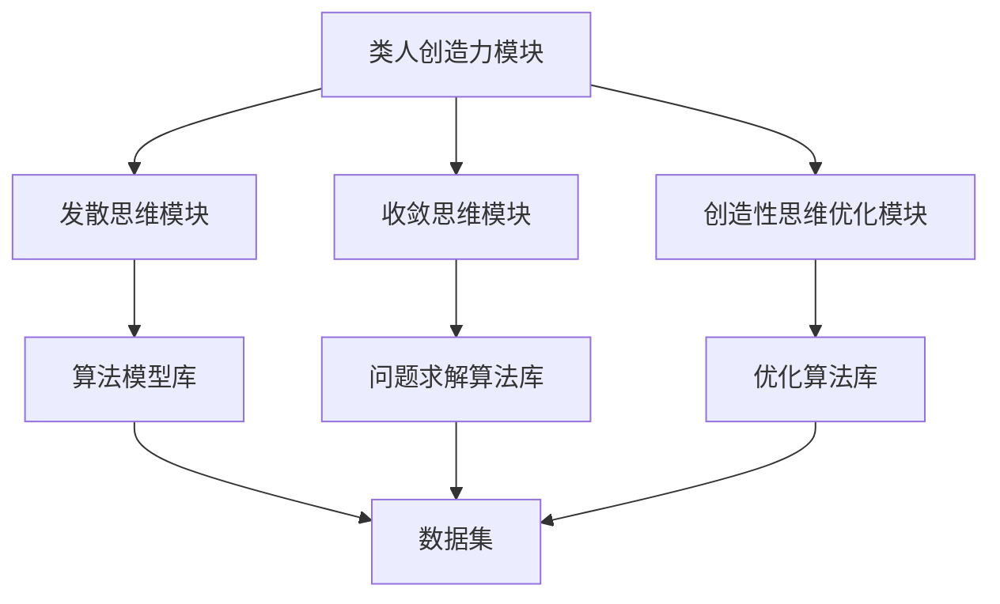
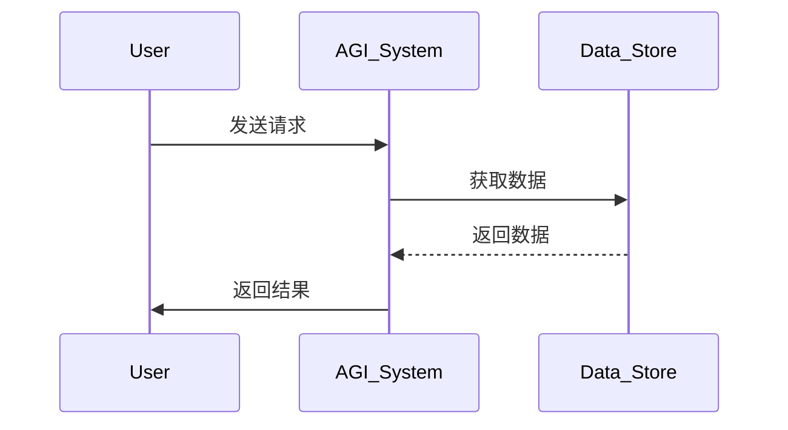

                 


# AGI的类人创造力：从发散思维到收敛思维

## 关键词

- AGI
- 类人创造力
- 发散思维
- 收敛思维
- 人工智能算法

## 摘要

本文旨在探讨人工智能（AI）领域中的通用智能（AGI）如何实现类人创造力，重点分析发散思维和收敛思维在创造力过程中的作用。我们将从背景介绍、核心概念、算法原理、数学模型、系统设计以及实际应用等方面，逐步深入探讨AGI的类人创造力，以期为AI领域的研究者和开发者提供有益的参考。

## 1. 引言

### 1.1 通用智能（AGI）的定义与历史

通用智能（Artificial General Intelligence，简称AGI）是指能够执行任意智能体在任一环境下的任务的人工智能。与目前广泛应用的狭义人工智能（Narrow AI）不同，AGI具有广泛适应性和跨领域的智能能力。

AGI的概念最早由计算机科学家John McCarthy在1950年代提出。自那时以来，尽管研究者们在算法、计算资源和数据集等方面取得了显著进展，但实现真正意义上的通用智能仍然面临诸多挑战。

### 1.2 AGI与AI的区别

人工智能（Artificial Intelligence，简称AI）是指计算机系统模拟人类智能行为的能力，包括感知、学习、推理、规划、自然语言理解和决策等。然而，目前的AI系统大多只能在一个特定的领域内表现出智能行为，被称为狭义人工智能（Narrow AI）。

通用智能（AGI）则旨在超越现有AI系统，实现跨领域的智能能力，能够执行多种不同类型的任务，类似于人类的智能。

### 1.3 类人创造力在AGI中的重要性

创造力是人类智能的核心特征之一，它是创新、发明和解决问题的关键。在AGI的发展过程中，类人创造力尤为重要。一方面，创造力有助于AGI系统在复杂多变的环境中应对挑战；另一方面，类人创造力能够促进AGI系统与人类社会的互动，实现更好的协作与共生。

## 2. 核心概念与框架

### 2.1 创造力的理论

创造力是指个体产生新颖、有价值的想法或解决方案的能力。关于创造力的理论有很多，如创造性思维理论、多智能体系统理论、认知神经科学理论等。这些理论为理解创造力的本质和机制提供了有益的视角。

### 2.2 发散思维与收敛思维

发散思维（Divergent Thinking）是指个体在解决问题时产生多种可能性的过程，强调创新性和灵活性。收敛思维（Convergent Thinking）则是指个体在解决问题时寻找最佳解决方案的过程，强调逻辑性和精确性。

在创造力过程中，发散思维和收敛思维相互交织、相互促进。发散思维有助于产生大量新颖的想法，而收敛思维则能够筛选和优化这些想法，找到最佳解决方案。

### 2.3 类人创造力在AGI中的作用

类人创造力是指AGI系统在解决问题时表现出类似于人类创造力的能力。在AGI的发展过程中，类人创造力具有以下重要作用：

1. 提高问题解决能力：类人创造力有助于AGI系统在面对复杂问题时，产生新颖的解决方案，提高问题解决的成功率。
2. 促进创新：类人创造力能够激发AGI系统的创新潜力，推动新技术和新产品的诞生。
3. 优化与人类互动：类人创造力有助于AGI系统更好地理解人类的需求和意图，实现与人类的协同合作。

## 3. 算法原理与数学模型

### 3.1 发散思维的算法模型

发散思维的算法模型主要包括以下几种：

1. **神经网络的随机游走（Random Walk）**：
   神经网络可以通过随机游走的方式，在大量数据中探索不同的可能性，产生新颖的想法。以下是一个简单的随机游走算法的Python实现：

   ```python
   import numpy as np

   def random_walk(data, steps):
       for _ in range(steps):
           next_node = np.random.choice(data.shape[0])
           data[next_node] = 1
           data[next_node] = 0
       return data
   ```

2. **遗传算法（Genetic Algorithm）**：
   遗传算法通过模拟自然进化过程，产生多种可能的解决方案，筛选出最优解。以下是一个简单的遗传算法的Python实现：

   ```python
   import numpy as np

   def genetic_algorithm(population, fitness_function, generations):
       for _ in range(generations):
           new_population = []
           for _ in range(len(population)):
               parent1, parent2 = np.random.choice(population, 2, replace=False)
               child = (parent1 + parent2) / 2
               new_population.append(child)
           population = new_population
           best_fitness = max(fitness_function(population))
       return population, best_fitness
   ```

### 3.2 收敛思维的算法模型

收敛思维的算法模型主要包括以下几种：

1. **问题求解算法（Problem Solving Algorithms）**：
   问题求解算法通过逐步逼近目标，寻找最佳解决方案。以下是一个简单的图搜索算法的Python实现：

   ```python
   import numpy as np

   def breadth_first_search(graph, start, target):
       queue = [(start, [start])]
       while queue:
           (vertex, path) = queue.pop(0)
           for next in graph[vertex]:
               if next not in path:
                   queue.append((next, path + [next]))
                   if next == target:
                       return path
       return None
   ```

2. **优化算法（Optimization Algorithms）**：
   优化算法通过搜索可能的解决方案，找到最优解。以下是一个简单的线性规划算法的Python实现：

   ```python
   import numpy as np

   def linear_programming(A, b, c):
       num_vars = A.shape[1]
       x = np.zeros(num_vars)
       while True:
           gradient = -A.T @ c
           if np.linalg.norm(gradient) < 1e-5:
               break
           x += gradient
       return x
   ```

### 3.3 数学模型与公式

在创造力过程中，数学模型可以用于描述和解释创造力的形成和演化。以下是一个简单的创造性思维数学模型：

$$
f(x, y) = \alpha \cdot (1 - \frac{||x - y||}{\|x\|\|y\|}) + (1 - \alpha) \cdot \frac{||x + y||}{\|x\|\|y\|}
$$

其中，$x$ 和 $y$ 分别表示两个不同的想法，$f(x, y)$ 表示这两个想法之间的创造性程度。$\alpha$ 是一个参数，控制着创造性程度的平衡。

## 4. 系统设计与实现

### 4.1 系统功能设计

在AGI系统中，类人创造力模块需要实现以下功能：

1. 发散思维的生成：生成多种可能的解决方案。
2. 收敛思维的筛选：筛选出最佳解决方案。
3. 创造性思维的优化：优化创造性思维过程，提高创造力水平。

### 4.2 系统架构设计

AGI系统的架构设计应考虑以下方面：

1. **模块化设计**：将发散思维、收敛思维和创造性思维优化模块独立出来，便于系统扩展和升级。
2. **分布式计算**：利用分布式计算框架，提高系统性能和可扩展性。
3. **数据存储与管理**：设计高效的数据存储和管理系统，确保数据的安全性和可靠性。

以下是一个简单的AGI系统架构设计mermaid架构图：



### 4.3 系统接口设计与交互

AGI系统的接口设计应考虑以下方面：

1. **API接口**：提供统一的API接口，便于与其他系统进行集成。
2. **图形用户界面**：设计简洁、易用的图形用户界面，方便用户操作和监控系统。
3. **数据接口**：设计高效的数据接口，支持数据的导入、导出和更新。

以下是一个简单的AGI系统接口设计mermaid序列图：



## 5. 实际应用与案例分析

### 5.1 设计创新产品的案例

在某次产品设计过程中，AGI系统通过发散思维和收敛思维，提出了一系列创新的产品方案。以下是一个简单的案例：

1. **发散思维**：AGI系统通过随机游走算法，在大量设计元素中探索不同的组合，生成多种可能的产品设计方案。
2. **收敛思维**：AGI系统利用优化算法，对设计方案进行筛选和优化，找到最佳方案。
3. **创造性思维优化**：AGI系统通过调整参数和算法，优化创造性思维过程，提高创造力水平。

### 5.2 解决实际问题的案例

在某次城市规划项目中，AGI系统通过发散思维和收敛思维，提出了一系列创新的城市规划方案。以下是一个简单的案例：

1. **发散思维**：AGI系统通过问题求解算法，生成多种可能的城市规划方案，包括道路布局、建筑物设计等。
2. **收敛思维**：AGI系统利用优化算法，对城市规划方案进行筛选和优化，找到最佳方案。
3. **创造性思维优化**：AGI系统通过调整参数和算法，优化创造性思维过程，提高创造力水平。

## 6. 最佳实践与总结

### 6.1 最佳实践

1. **数据准备**：确保数据的多样性和质量，为创造性思维提供丰富的素材。
2. **算法选择**：根据具体问题和场景，选择合适的算法模型，提高创造性思维的效果。
3. **参数调整**：根据实际需求，调整算法参数，优化创造性思维过程。

### 6.2 总结

本文从背景介绍、核心概念、算法原理、数学模型、系统设计、实际应用等方面，探讨了AGI的类人创造力。通过发散思维和收敛思维，AGI系统能够实现类似人类的创造力，为解决问题和创新提供有力支持。

## 7. 拓展阅读

1. **《人工智能：一种现代的方法》**：这本书详细介绍了人工智能的基本概念、算法和技术，对AGI的类人创造力也有深入的探讨。
2. **《认知心理学与人工智能》**：这本书从认知心理学的角度，分析了人类创造力的机制和原理，对AGI的创造性思维研究有重要参考价值。

## 8. 作者信息

作者：AI天才研究院/AI Genius Institute & 禅与计算机程序设计艺术 /Zen And The Art of Computer Programming

