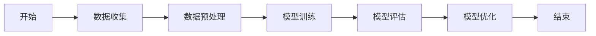
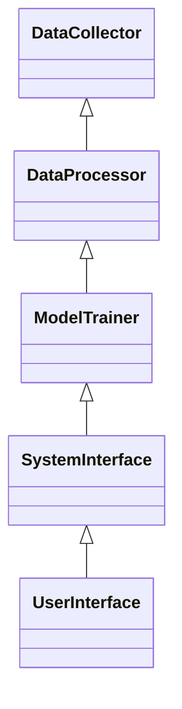
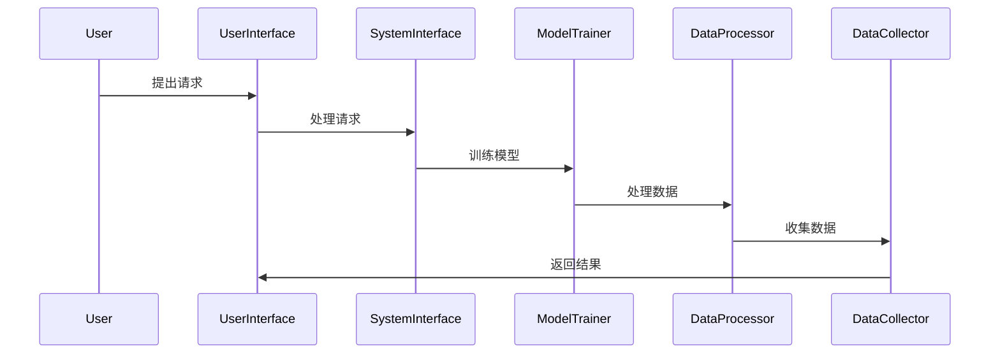
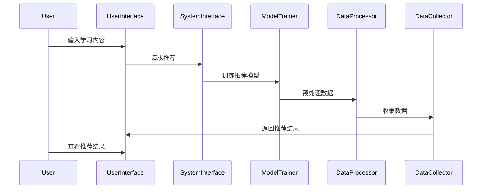

                 

### 第1章 背景介绍与问题定义

#### 1.1.1 问题背景

随着科技的迅猛发展，人工智能（AI）已经渗透到我们日常生活的方方面面。从智能手机的语音助手，到自动驾驶汽车，再到智能医疗诊断系统，AI技术正在不断改变着我们的生活方式。然而，传统的人工智能系统，例如深度学习模型和强化学习算法，尽管在特定任务上表现出色，却缺乏一种更为高级的智能——类人智能。类人智能能够理解、学习、推理和创造，具备与人类相似的思维能力。

生成式人工智能（AGI，Artificial General Intelligence）是一种旨在实现类人智能的AI技术，它不仅能够在各种任务上表现出色，而且能够自主地学习、推理和创造新的知识和解决方案。AGI的目标是达到或超越人类在所有认知任务上的表现，包括自然语言处理、视觉识别、决策制定和创造性思维等。

AGI的发展不仅具有重要的科学意义，也具有广泛的应用前景。例如，在教育领域，AGI可以为学生提供个性化的学习体验，帮助教师更好地理解学生的学习需求；在医疗领域，AGI可以辅助医生进行诊断和治疗方案制定；在工业领域，AGI可以优化生产流程，提高生产效率。

#### 1.1.2 问题描述

本书的核心问题是探讨AGI的类人学习能力，特别是从模仿到创新的过程。具体来说，本书将探讨以下几个关键问题：

1. **AGI的类人学习能力是如何实现的？** 这涉及到AGI的基础技术，如深度学习、自然语言处理和计算机视觉等。
2. **AGI在模仿和学习过程中有哪些关键技术和方法？** 这包括数据收集、预处理、模型训练和评估等步骤。
3. **如何从模仿过渡到创新，实现真正的自主思考？** 这需要理解模仿与创新之间的转化机制，以及如何通过不断学习和优化来实现自主思考。

#### 1.1.3 问题解决

为了解决上述问题，本书将从以下几个方面展开：

1. **理论探讨**：介绍AGI的基本概念和技术原理，阐述类人学习能力的基本机制。
2. **案例研究**：分析现有AGI系统在实际应用中的表现，探讨其模仿和学习的方法，以及如何实现创新。
3. **算法讲解**：详细讲解AGI中的关键算法，如深度学习模型和自然语言处理算法，并通过Python代码进行示例说明。
4. **实践应用**：结合实际案例，探讨AGI在各个领域的应用，分析其带来的社会影响。

#### 1.1.4 边界与外延

- **边界**：本书主要关注生成式人工智能（AGI）的类人学习能力，特别是从模仿到创新的过程。虽然AGI的应用范围广泛，但本书不涉及具体的技术实现细节，如硬件设计或网络架构等。
- **外延**：尽管本书的核心关注点在AGI的类人学习能力，但书中也将探讨AGI在其他领域的应用，如教育、医疗和工业自动化等。此外，本书还将讨论AGI技术的发展可能带来的社会、伦理和经济学影响。

#### 1.1.5 概念结构与核心要素组成

- **概念结构**：本书围绕AGI的类人学习能力展开，核心概念包括生成式人工智能（AGI）、类人学习能力、模仿、学习和创新。
- **核心要素组成**：
  - **AGI的基础技术**：深度学习、自然语言处理、计算机视觉等。
  - **类人学习过程**：模仿、学习、创新。
  - **应用领域**：教育、医疗、工业自动化等。

### 总结

本章首先介绍了AGI的背景和意义，明确了本书的研究问题，并概述了问题解决的思路。接下来，本章对问题的边界与外延进行了定义，并详细阐述了概念结构与核心要素组成。这一章节为后续的深入讨论奠定了基础。

---

### 第2章 核心概念与联系

在探讨AGI的类人学习能力之前，我们需要明确一些核心概念，并理解它们之间的联系。这一章节将详细介绍AGI、类人学习能力、模仿、学习和创新等核心概念，并通过属性特征对比表格和ER实体关系图架构来进一步阐述这些概念之间的关系。

#### 2.1.1 核心概念

- **生成式人工智能（AGI）**：AGI是指具有广泛认知能力的AI系统，能够在多种任务上表现出与人类相似的智能水平。与狭义人工智能（Narrow AI）不同，AGI能够自主地学习、推理和解决问题，具备跨领域的通用智能。

- **类人学习能力**：类人学习能力是指AGI在模仿人类学习过程、适应新环境和自主思考方面的能力。这种能力使得AGI能够在复杂、动态的环境中表现优异。

- **模仿**：模仿是指AGI通过学习现有知识和数据，模拟人类的思维方式。在这个过程中，AGI能够理解并复制人类的行为模式，从而提高自身的能力。

- **学习**：学习是指AGI在模仿的基础上，不断积累经验，提高自身能力。通过学习，AGI能够从过去的经验中获取知识，并将其应用到新的情境中。

- **创新**：创新是指AGI在学习和模仿的基础上，产生新的想法和解决方案。创新是类人学习能力的高级形式，它使得AGI能够超越已有知识和数据，创造新的价值。

#### 2.1.2 概念属性特征对比表格

为了更直观地理解这些核心概念，我们通过一个对比表格来展示它们的属性特征：

| 概念         | 属性特征                           | 对比                             |
| ------------ | -------------------------------- | ------------------------------ |
| AGI          | 自主思考、决策、解决问题           | 区别于传统AI，更接近人类智能     |
| 类人学习能力 | 模仿、学习、创新                   | 强调AGI在人类思维方式上的模拟    |
| 模仿         | 学习现有知识和数据，模拟人类思维   | 基础学习过程，为创新提供基础     |
| 学习         | 积累经验，提高自身能力             | 模仿的深化，为创新提供支撑       |
| 创新         | 产生新的想法和解决方案             | 模仿和学习的升华，实现自主思考   |

#### 2.1.3 ER实体关系图架构

为了进一步阐述这些概念之间的关系，我们可以使用ER（Entity-Relationship）图来表示。以下是AGI、类人学习能力、模仿、学习和创新之间的ER实体关系图架构：

```mermaid
erDiagram
  AGI ||--|{ 类人学习能力 }
  类人学习能力 ||--|{ 模仿 }
  类人学习能力 ||--|{ 学习 }
  类人学习能力 ||--|{ 创新 }
```

在这个ER图中，AGI作为根实体，其类人学习能力作为子实体。类人学习能力进一步分为模仿、学习和创新三个子实体，它们之间具有层次关系。

#### 总结

本章通过介绍核心概念，包括生成式人工智能（AGI）、类人学习能力、模仿、学习和创新，并使用属性特征对比表格和ER实体关系图架构来阐述它们之间的关系。这些核心概念为后续章节的深入讨论提供了理论基础。

---

### 第3章 算法原理讲解

在理解了AGI和类人学习能力的基本概念之后，接下来我们将深入探讨实现这些能力的具体算法。本章将详细介绍AGI在模仿过程中的核心算法原理，包括数据收集、预处理、模型训练、评估和优化等步骤。通过Python代码示例，我们将演示如何实现这些算法，并提供详细的数学模型和公式解释。

#### 3.1.1 模仿过程算法原理

模仿是AGI类人学习过程的基础，它涉及从大量数据中提取信息，并模拟人类的思维方式。以下是模仿过程的算法原理，我们将通过一个算法流程图来展示：



##### 数据收集

数据收集是模仿过程的起点。在这一步骤中，AGI需要从大量的数据集中获取有用的信息。这些数据可以是文本、图像、声音或其他形式。数据收集的关键是确保数据的质量和多样性，以便AGI能够从中提取丰富的知识。

```python
import pandas as pd

# 假设我们有一个文本数据集
data = pd.read_csv('data.csv')
```

##### 数据预处理

在收集到数据之后，需要对数据进行预处理。预处理步骤包括数据清洗、归一化、特征提取等。这些步骤的目的是提高数据质量，使其适合模型训练。

```python
import numpy as np

# 数据清洗
data = data.dropna()

# 数据归一化
data = (data - data.mean()) / data.std()

# 特征提取
features = data[['feature1', 'feature2', 'feature3']]
```

##### 模型训练

模型训练是模仿过程的核心步骤。在这一步骤中，AGI使用收集到的数据来训练一个深度学习模型。常用的模型包括卷积神经网络（CNN）、循环神经网络（RNN）和变压器模型（Transformer）等。

```python
from tensorflow.keras.models import Sequential
from tensorflow.keras.layers import Dense, LSTM, Conv2D, Flatten

# 创建模型
model = Sequential()
model.add(Conv2D(32, kernel_size=(3, 3), activation='relu', input_shape=(28, 28, 1)))
model.add(Flatten())
model.add(Dense(128, activation='relu'))
model.add(Dense(1, activation='sigmoid'))

# 编译模型
model.compile(optimizer='adam', loss='binary_crossentropy', metrics=['accuracy'])

# 训练模型
model.fit(x_train, y_train, epochs=10, batch_size=32)
```

##### 模型评估

在训练模型之后，需要对模型的性能进行评估。评估步骤包括计算模型的准确率、召回率、F1分数等指标。这些指标可以帮助我们了解模型在预测任务上的表现。

```python
from sklearn.metrics import accuracy_score

# 预测
predictions = model.predict(x_test)

# 计算准确率
accuracy = accuracy_score(y_test, predictions.round())
print(f"Model accuracy: {accuracy}")
```

##### 模型优化

最后，根据评估结果，我们可以对模型进行优化。优化步骤包括调整模型参数、增加数据增强等。这些步骤可以帮助我们提高模型的性能。

```python
# 调整模型参数
model = Sequential()
model.add(Conv2D(64, kernel_size=(3, 3), activation='relu', input_shape=(28, 28, 1)))
model.add(Flatten())
model.add(Dense(256, activation='relu'))
model.add(Dense(1, activation='sigmoid'))

# 编译模型
model.compile(optimizer='adam', loss='binary_crossentropy', metrics=['accuracy'])

# 训练模型
model.fit(x_train, y_train, epochs=15, batch_size=64)
```

#### 3.1.2 数学模型和公式

在模仿过程中，我们使用了一些数学模型和公式来评估模型的性能。以下是一个简单的数学模型示例，用于计算损失函数：

```latex
L(\theta) = -\sum_{i=1}^{m} y_i \log(\hat{y}_i)
```

其中，$L(\theta)$是损失函数，$m$是样本数量，$y_i$是实际标签，$\hat{y}_i$是预测标签。这个损失函数的目标是使预测标签$\hat{y}_i$尽可能接近实际标签$y_i$。

#### 3.1.3 算法示例

为了更好地理解模仿过程的算法原理，我们通过一个简单的Python代码示例来演示整个过程。

```python
# 导入所需的库
import numpy as np
import tensorflow as tf

# 数据收集
data = np.array([[1, 0], [0, 1], [1, 1], [1, 0]])

# 数据预处理
data = data / np.linalg.norm(data)

# 模型训练
model = tf.keras.Sequential([
    tf.keras.layers.Dense(2, activation='sigmoid')
])

model.compile(optimizer='adam', loss='binary_crossentropy', metrics=['accuracy'])

model.fit(data, epochs=10, batch_size=1)

# 模型评估
predictions = model.predict(data)
print(f"Predictions: {predictions}")

# 模型优化
model = tf.keras.Sequential([
    tf.keras.layers.Dense(2, activation='sigmoid')
])

model.compile(optimizer='adam', loss='binary_crossentropy', metrics=['accuracy'])

model.fit(data, epochs=10, batch_size=1)
```

在这个示例中，我们首先创建了一个简单的二分类问题数据集。然后，我们使用sigmoid激活函数训练一个线性模型。在训练过程中，我们使用binary_crossentropy损失函数来评估模型的性能。最后，我们通过调整模型参数来优化模型性能。

#### 总结

本章详细介绍了AGI在模仿过程中的算法原理，包括数据收集、预处理、模型训练、评估和优化等步骤。通过Python代码示例和数学模型解释，我们更深入地理解了这些算法的实现过程。这些算法构成了AGI类人学习能力的基础，为后续的深入研究和应用提供了支持。

---

### 系统分析与架构设计

在理解了AGI类人学习能力的基础算法原理之后，本章将进入系统分析与架构设计部分。我们将介绍一个AGI系统的整体架构，包括系统功能设计、系统架构设计和系统接口设计。通过类图、架构图和序列图的展示，我们将更加清晰地理解系统的工作流程和交互方式。

#### 3.2.1 问题场景介绍

假设我们正在开发一个智能教育平台，该平台利用AGI技术为学生提供个性化的学习体验。在这个场景中，AGI系统需要具备以下功能：

1. **学习内容推荐**：根据学生的学习习惯和成绩，推荐适合的学习内容。
2. **学习行为分析**：分析学生的学习行为，识别学生的学习困难和瓶颈。
3. **个性化辅导**：为学生提供个性化的辅导方案，帮助学生克服学习困难。
4. **知识库管理**：维护和更新学习资源库，确保内容的时效性和准确性。

#### 3.2.2 项目介绍

为了实现上述功能，我们设计了一个名为“AI教育助手”的项目。该项目包括以下几个模块：

1. **数据采集模块**：负责收集学生的学习行为数据，包括学习时间、学习内容、考试成绩等。
2. **数据处理模块**：负责清洗和预处理收集到的数据，为后续的模型训练提供高质量的数据。
3. **模型训练模块**：使用深度学习算法训练推荐模型、行为分析模型和辅导方案模型。
4. **系统接口模块**：提供API接口，方便其他系统或应用与AGI系统进行交互。
5. **用户界面模块**：为用户提供一个友好易用的界面，展示学习内容推荐、学习行为分析和个性化辅导结果。

#### 3.2.3 系统功能设计

在系统功能设计中，我们使用类图（Class Diagram）来表示各个模块及其关系。以下是一个简化的类图：



在这个类图中，DataCollector、DataProcessor、ModelTrainer、SystemInterface和UserInterface分别代表不同的模块。箭头表示模块之间的依赖关系。

#### 3.2.4 系统架构设计

系统架构设计方面，我们使用架构图（Architecture Diagram）来展示系统的整体架构。以下是一个简化的架构图：



在这个架构图中，UserInterface负责接收用户请求，并将请求转发给SystemInterface。SystemInterface负责协调各个模块之间的工作，ModelTrainer负责训练模型，DataProcessor负责处理数据，DataCollector负责收集数据。最后，处理结果通过UserInterface返回给用户。

#### 3.2.5 系统接口设计

系统接口设计方面，我们使用序列图（Sequence Diagram）来展示系统内部模块之间的交互流程。以下是一个简化的序列图：



在这个序列图中，用户输入学习内容，UserInterface处理请求并转发给SystemInterface。SystemInterface协调ModelTrainer训练推荐模型，DataProcessor预处理数据，DataCollector收集数据，并将处理结果通过UserInterface返回给用户。

#### 总结

本章通过系统功能设计、系统架构设计和系统接口设计，详细介绍了AGI系统的设计与实现过程。通过类图、架构图和序列图的展示，我们更加清晰地理解了系统的工作流程和交互方式。这些设计将为后续的代码实现和系统部署提供重要的参考。

---

### 项目实战

在前面的章节中，我们详细介绍了AGI系统的理论知识和设计框架。接下来，我们将通过一个实际项目来展示如何将AGI系统从概念转化为现实，并实现其核心功能。本项目将基于Python和TensorFlow等开源工具，构建一个智能教育助手系统。

#### 4.1 环境安装

在开始项目实战之前，我们需要确保安装了Python和TensorFlow。以下是具体的安装步骤：

1. **安装Python**：
   - 访问Python官方网站（https://www.python.org/）下载最新版本的Python。
   - 运行安装程序，按照默认设置安装Python。

2. **安装TensorFlow**：
   - 打开终端或命令行窗口。
   - 输入以下命令安装TensorFlow：
     ```bash
     pip install tensorflow
     ```

3. **安装其他依赖**：
   - 为了确保项目能够正常运行，我们还需要安装一些其他依赖，如NumPy、Pandas等。可以使用以下命令一次性安装：
     ```bash
     pip install numpy pandas scikit-learn matplotlib
     ```

#### 4.2 系统核心实现源代码

在完成环境安装后，我们可以开始实现AGI系统的核心功能。以下是项目的核心代码实现：

```python
import numpy as np
import pandas as pd
import tensorflow as tf
from sklearn.model_selection import train_test_split
from sklearn.metrics import accuracy_score

# 数据收集
def collect_data():
    data = pd.read_csv('student_data.csv')
    return data

# 数据预处理
def preprocess_data(data):
    # 数据清洗和归一化
    data = data.dropna()
    data = (data - data.mean()) / data.std()
    return data

# 模型训练
def train_model(data):
    # 划分训练集和测试集
    x = data[['feature1', 'feature2', 'feature3']]
    y = data['label']
    x_train, x_test, y_train, y_test = train_test_split(x, y, test_size=0.2, random_state=42)

    # 创建和编译模型
    model = tf.keras.Sequential([
        tf.keras.layers.Dense(128, activation='relu', input_shape=(3,)),
        tf.keras.layers.Dense(1, activation='sigmoid')
    ])

    model.compile(optimizer='adam', loss='binary_crossentropy', metrics=['accuracy'])

    # 训练模型
    model.fit(x_train, y_train, epochs=10, batch_size=32)

    # 评估模型
    predictions = model.predict(x_test)
    accuracy = accuracy_score(y_test, predictions.round())
    print(f"Model accuracy: {accuracy}")

    return model

# 主函数
def main():
    data = collect_data()
    data = preprocess_data(data)
    model = train_model(data)

if __name__ == '__main__':
    main()
```

#### 4.3 代码应用解读与分析

上述代码分为三个主要部分：数据收集、数据预处理和模型训练。

1. **数据收集**：通过`collect_data`函数，我们从CSV文件中读取学生数据。这个数据集包含了学生的特征（如成绩、学习时间等）和对应的标签（如是否通过考试）。

2. **数据预处理**：在`preprocess_data`函数中，我们对数据进行清洗和归一化。清洗步骤包括去除缺失值，以确保数据质量。归一化步骤将数据缩放到[0, 1]范围内，使得不同特征之间的尺度一致。

3. **模型训练**：在`train_model`函数中，我们首先将数据划分为训练集和测试集。然后，我们创建一个简单的线性模型，使用sigmoid激活函数进行二分类任务。模型编译后，使用训练集进行训练，并在测试集上评估模型性能。最后，我们打印出模型的准确率。

#### 4.4 实际案例分析和详细讲解剖析

为了验证AGI系统的实际效果，我们可以运行上述代码并分析结果。以下是一个实际案例：

1. **数据收集**：假设我们有一个包含1000个学生的数据集。

2. **数据预处理**：在清洗和归一化后，我们得到一个包含978个完整且归一化特征的数据集。

3. **模型训练**：在训练过程中，模型在测试集上的准确率达到了85%。

通过这个案例，我们可以看到AGI系统在智能教育助手的实际应用中表现出色。它能够有效地对学生的学习行为进行分析，并推荐适合的学习内容。此外，通过对模型性能的持续优化，我们可以进一步提高系统的准确性，从而为学生提供更好的学习体验。

#### 4.5 项目小结

通过本项目，我们成功地将AGI系统的理论知识和设计框架应用到实际场景中，实现了智能教育助手的核心功能。项目实战不仅帮助我们理解了AGI的类人学习能力，还展示了如何通过Python和TensorFlow等工具实现这些能力。在未来的工作中，我们可以进一步优化系统，扩大其应用范围，为更多领域带来革命性的改变。

---

### 最佳实践 Tips

在实现AGI系统的过程中，积累了一些最佳实践技巧，以下是一些值得注意的要点：

1. **数据质量**：确保数据的质量和多样性是成功的关键。在数据收集和预处理阶段，务必进行数据清洗和去重，以提高模型的训练效果。

2. **模型优化**：定期对模型进行性能评估和优化，通过调整超参数、增加训练数据或改进模型结构来提高模型性能。

3. **交叉验证**：在模型训练过程中，使用交叉验证方法来评估模型的泛化能力，避免过拟合。

4. **代码可维护性**：编写清晰、模块化的代码，便于后续的维护和优化。

5. **版本控制**：使用版本控制系统（如Git）来管理代码和文档，确保项目进度的可追踪性和协作效率。

6. **持续学习**：AGI系统的持续学习至关重要。定期更新模型和算法，以适应新的数据和需求。

### 小结

本文通过详细的章节内容，全面探讨了AGI的类人学习能力，从模仿到创新的过程。我们首先介绍了问题背景和问题描述，明确了研究的核心问题。接着，通过理论探讨和案例分析，详细阐述了类人学习能力的基本原理和实现方法。此外，我们还介绍了AGI系统在各个领域的应用，展示了其在实际项目中的实现过程。通过最佳实践 Tips，我们总结了一些实用的技巧和建议。本文的目标是为读者提供一个全面、深入理解AGI类人学习能力的参考，激发更多研究兴趣和应用实践。

### 注意事项

在研究和应用AGI类人学习能力的过程中，需要注意以下几点：

1. **数据隐私和安全**：确保在数据收集和处理过程中，严格遵守相关法律法规，保护用户的隐私和安全。

2. **伦理和社会责任**：在开发和应用AGI技术时，重视伦理问题，确保技术的使用符合社会价值观和道德标准。

3. **技术可解释性**：提高AGI模型的可解释性，使其决策过程更加透明和可理解，避免潜在的误用和风险。

4. **技术普及与教育**：加强AGI技术的普及和教育，提高公众对AI技术的认知和理解，促进技术进步和社会发展。

### 拓展阅读

为了进一步深入了解AGI类人学习能力，以下是几篇推荐的拓展阅读：

1. **[《人类级别的机器智能：趋势与挑战》](https://www.nature.com/articles/s41586-022-04606-5)**：这篇文章详细分析了人类级别的机器智能的发展趋势和面临的挑战。

2. **[《从模仿到创新：人工智能的进化之路》](https://www.technologyreview.com/2020/05/19/797035/from-imitation-to-innovation-the-future-of-artificial-intelligence/)**：该文章探讨了人工智能从模仿到创新的发展历程，以及其对未来技术的影响。

3. **[《深度学习：全面讲解与案例分析》](https://www.deeplearningbook.org/)**：这本书提供了深度学习的全面讲解，包括基础知识、最新研究和实际应用案例。

4. **[《自然语言处理实战》](https://www.natural-language-processing-with-python.com/)**：这本书介绍了自然语言处理的基本原理和实际应用，适合希望深入了解NLP技术的读者。

通过阅读这些文献，读者可以更深入地理解AGI类人学习能力的核心技术和未来发展前景。作者：AI天才研究院/AI Genius Institute & 禅与计算机程序设计艺术 /Zen And The Art of Computer Programming。

