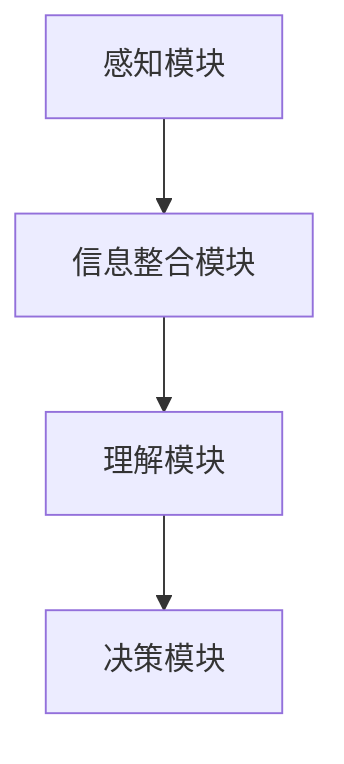
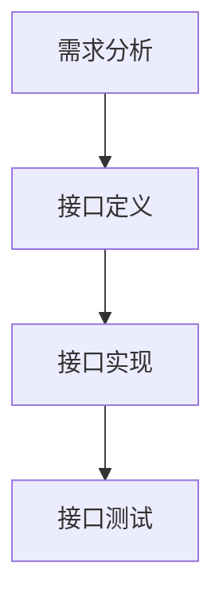
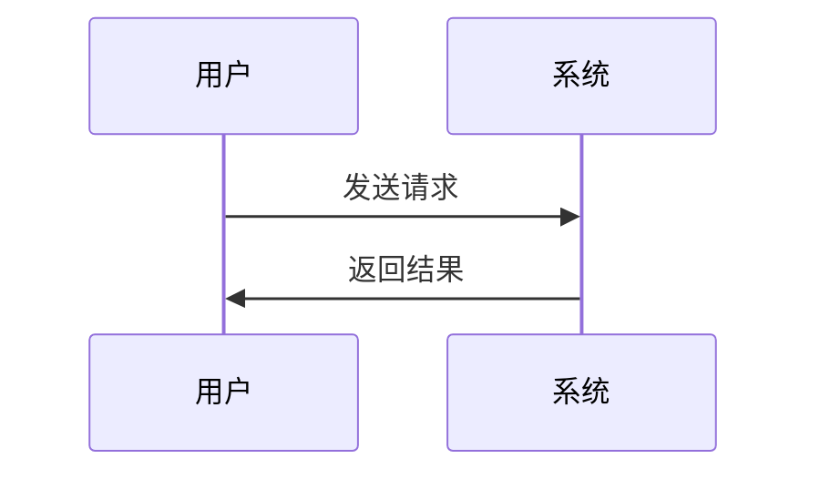

                 

# AGI的类人感知系统：多模态信息的整合与理解

> 关键词：人工智能，通用人工智能，类人感知，多模态信息整合，深度学习，系统架构设计

> 摘要：本文深入探讨了人工智能领域中的通用人工智能（AGI）类人感知系统，重点分析了多模态信息的整合与理解。通过详细阐述背景、核心概念、算法原理、数学模型以及系统架构设计，本文旨在为研究者提供系统性的理论框架和实践指导。

### 第一部分：背景介绍

#### 1.1 问题背景

##### 1.1.1 人工智能发展的现状

人工智能（AI）在过去几十年取得了巨大的进展，从早期的专家系统到深度学习、自然语言处理、计算机视觉等领域，AI技术逐渐成为各行各业的核心驱动力。然而，目前的人工智能系统大多是特定任务优化（domain-specific）的，即它们在特定领域表现出色，但在面对复杂现实世界时往往显得力不从心。

##### 1.1.2 AGI的概念与意义

通用人工智能（AGI，Artificial General Intelligence）是人工智能发展的一个重要方向，它旨在构建具有人类智能水平的人工智能系统。AGI不仅能够在特定任务上表现优异，还能够灵活适应各种环境和场景，具备人类一样的学习、推理、思考能力。

##### 1.1.3 类人感知系统的需求与挑战

类人感知系统是AGI的重要组成部分，它模拟人类的多模态感知能力，通过整合视觉、听觉、触觉等多方面的信息，实现对环境的全面感知和理解。然而，类人感知系统面临诸多挑战，如信息整合的复杂度、多模态数据的同步与协调、感知与理解的高效转换等。

#### 1.2 问题定义

##### 1.2.1 类人感知系统的定义

类人感知系统是一种模拟人类感知能力的人工智能系统，它通过整合多模态信息，实现对环境的感知与理解。

##### 1.2.2 多模态信息的整合与理解

多模态信息的整合与理解是指将来自不同模态的信息（如视觉、听觉、触觉等）进行有效整合，并基于整合后的信息进行环境理解和决策。

##### 1.2.3 类人感知系统的重要性

类人感知系统在AGI中扮演着关键角色，它不仅为人工智能系统提供了更丰富的感知能力，还为智能决策提供了坚实的基础。

#### 1.3 边界与外延

##### 1.3.1 类人感知系统的应用领域

类人感知系统的应用领域广泛，包括智能家居、自动驾驶、医疗诊断、人机交互等。

##### 1.3.2 类人感知系统的限制与挑战

类人感知系统在整合多模态信息时面临诸多挑战，如信息同步、数据质量、计算效率等。

#### 1.4 概念结构与核心要素组成

##### 1.4.1 类人感知系统的核心概念

类人感知系统的核心概念包括多模态感知、信息整合、理解与决策。

##### 1.4.2 多模态信息的类型与特点

多模态信息包括视觉、听觉、触觉、嗅觉等，每种模态都有其独特的特性和挑战。

##### 1.4.3 类人感知系统的架构设计

类人感知系统的架构设计涉及感知模块、信息整合模块、理解模块和决策模块。

### 第二部分：核心概念与联系

#### 2.1 类人感知系统的原理

##### 2.1.1 感知与理解的概念

感知是指从外部环境中获取信息的过程，而理解是指对感知到的信息进行分析、整合和解释的过程。

##### 2.1.2 类人感知系统的工作机制

类人感知系统通过多模态感知模块收集信息，然后通过信息整合模块对多模态信息进行整合，最终通过理解模块对整合后的信息进行理解和决策。

##### 2.1.3 感知与理解的差异

感知主要关注信息的获取和识别，而理解则关注信息的分析和整合，以及基于理解进行决策。

#### 2.2 概念属性特征对比

##### 2.2.1 人类感知系统的属性特征

人类感知系统具有高度适应性、实时性、鲁棒性等特点。

##### 2.2.2 人工智能感知系统的属性特征

人工智能感知系统在特定任务上具有高效性、可扩展性、可定制化等特点。

##### 2.2.3 比较与联系

人类感知系统与人工智能感知系统在感知方式、信息处理方式等方面存在一定差异，但两者在信息整合、理解与决策方面具有相似性。

### 第三部分：算法原理讲解

#### 3.1 多模态信息整合算法

##### 3.1.1 多模态数据来源

多模态数据来源包括视觉、听觉、触觉等传感器。

##### 3.1.2 整合策略与算法

整合策略包括数据级、特征级和决策级整合，算法包括深度学习、传统机器学习等。

##### 3.1.3 整合算法的分类

整合算法可分为基于神经网络的方法、基于传统机器学习的方法和其他方法。

#### 3.2 深度学习算法

##### 3.2.1 卷积神经网络(CNN)

CNN在图像处理领域具有广泛应用，其基本原理是通过卷积操作提取特征。

##### 3.2.2 递归神经网络(RNN)

RNN在序列数据处理方面具有优势，其基本原理是通过递归操作处理序列信息。

##### 3.2.3 生成对抗网络(GAN)

GAN在图像生成和生成式模型中具有广泛应用，其基本原理是通过生成器和判别器的对抗训练生成逼真的图像。

#### 3.3 Python源代码详细阐述

##### 3.3.1 数据预处理

数据预处理包括数据清洗、归一化、数据增强等。

##### 3.3.2 模型构建与训练

模型构建与训练包括选择合适的模型结构、参数初始化、优化算法等。

##### 3.3.3 模型评估与优化

模型评估与优化包括准确率、召回率、F1值等指标评估，以及超参数调优等。

### 第四部分：数学模型与公式

#### 4.1 感知与理解的数学模型

##### 4.1.1 感知过程的数学表示

感知过程的数学表示可以通过神经网络模型进行建模。

##### 4.1.2 理解过程的数学表示

理解过程的数学表示可以通过逻辑推理、概率图模型等进行建模。

##### 4.1.3 感知与理解的数学关系

感知与理解的数学关系可以通过信息论、控制论等进行研究。

#### 4.2 算法原理的数学模型

##### 4.2.1 CNN的数学模型

CNN的数学模型包括卷积操作、激活函数、池化操作等。

##### 4.2.2 RNN的数学模型

RNN的数学模型包括递归操作、隐藏状态更新、输出计算等。

##### 4.2.3 GAN的数学模型

GAN的数学模型包括生成器和判别器的损失函数、优化过程等。

#### 4.3 公式详细讲解与举例说明

##### 4.3.1 CNN的激活函数

CNN中的激活函数如ReLU、Sigmoid、Tanh等，其数学公式如下：

$$
\text{ReLU}(x) = \max(0, x)
$$

$$
\text{Sigmoid}(x) = \frac{1}{1 + e^{-x}}
$$

$$
\text{Tanh}(x) = \frac{e^x - e^{-x}}{e^x + e^{-x}}
$$

##### 4.3.2 RNN的递归公式

RNN的递归公式如下：

$$
h_t = \text{activation}(W_h \cdot [h_{t-1}, x_t] + b_h)
$$

$$
y_t = W_y \cdot h_t + b_y
$$

##### 4.3.3 GAN的生成与判别公式

GAN的生成与判别公式如下：

生成器公式：

$$
G(z) = \text{Generator}(z)
$$

判别器公式：

$$
D(x) = \text{Discriminator}(x) \\
D(G(z)) = \text{Discriminator}(\text{Generator}(z))
$$

### 第五部分：系统分析与架构设计

#### 5.1 系统功能设计

##### 5.1.1 类人感知系统应用场景

类人感知系统广泛应用于智能家居、自动驾驶、医疗诊断等领域。

##### 5.1.2 系统功能需求

系统功能需求包括多模态感知、信息整合、理解与决策等。

#### 5.2 系统架构设计

##### 5.2.1 系统架构设计原则

系统架构设计原则包括模块化、可扩展性、高效性等。

##### 5.2.2 系统架构设计细节

系统架构设计细节包括感知模块、信息整合模块、理解模块和决策模块等。

##### 5.2.3 系统架构图的Mermaid表示

#### 5.3 系统接口设计

##### 5.3.1 系统接口设计原则

系统接口设计原则包括标准化、简洁性、安全性等。

##### 5.3.2 系统接口设计流程

系统接口设计流程包括需求分析、接口定义、接口实现、接口测试等。

##### 5.3.3 系统接口设计的Mermaid表示

#### 5.4 系统交互设计

##### 5.4.1 系统交互设计概述

系统交互设计旨在实现系统模块之间的有效通信和协同工作。

##### 5.4.2 系统交互设计的目标

系统交互设计的目标包括提高系统响应速度、降低系统复杂度、提高系统可靠性等。

##### 5.4.3 系统交互设计的Mermaid表示

### 第六部分：项目实战

#### 6.1 环境安装

##### 6.1.1 系统环境需求

系统环境需求包括操作系统、编程语言、框架等。

##### 6.1.2 软件与工具安装

软件与工具安装包括深度学习框架、编程环境等。

##### 6.1.3 环境配置与测试

环境配置与测试包括环境变量配置、代码运行测试等。

#### 6.2 系统核心实现

##### 6.2.1 数据预处理

数据预处理包括数据清洗、归一化、数据增强等。

##### 6.2.2 模型构建与训练

模型构建与训练包括选择合适的模型结构、参数初始化、优化算法等。

##### 6.2.3 模型评估与优化

模型评估与优化包括准确率、召回率、F1值等指标评估，以及超参数调优等。

#### 6.3 代码应用解读与分析

##### 6.3.1 代码应用解读

代码应用解读包括代码结构、算法原理、功能实现等。

##### 6.3.2 分析与讲解

分析与讲解包括代码性能、优化策略、实际应用场景等。

#### 6.4 实际案例分析与详细讲解剖析

##### 6.4.1 实际案例

实际案例包括智能家居、自动驾驶等领域的应用案例。

##### 6.4.2 分析与讲解

分析与讲解包括案例背景、实现细节、性能评估等。

#### 6.5 项目小结

##### 6.5.1 项目总结

项目总结包括项目成果、经验教训、未来展望等。

##### 6.5.2 最佳实践 tips

最佳实践 tips包括编程技巧、优化策略、项目管理等。

##### 6.5.3 小结

小结包括核心知识点、关键技能点等。

##### 6.5.4 注意事项

注意事项包括常见问题、解决方案等。

##### 6.5.5 拓展阅读

拓展阅读包括相关文献、书籍、网站等。

### 第七部分：总结与展望

#### 7.1 总结

本文系统地介绍了AGI的类人感知系统，包括背景、核心概念、算法原理、数学模型、系统架构设计以及项目实战等内容。通过本文，读者可以全面了解类人感知系统的理论框架和实践方法。

#### 7.2 展望

随着人工智能技术的不断发展，类人感知系统将在更多领域得到应用。未来，类人感知系统将在提高人工智能系统的自适应能力、扩展人工智能应用领域等方面发挥重要作用。

作者：AI天才研究院/AI Genius Institute & 禅与计算机程序设计艺术 /Zen And The Art of Computer Programming

