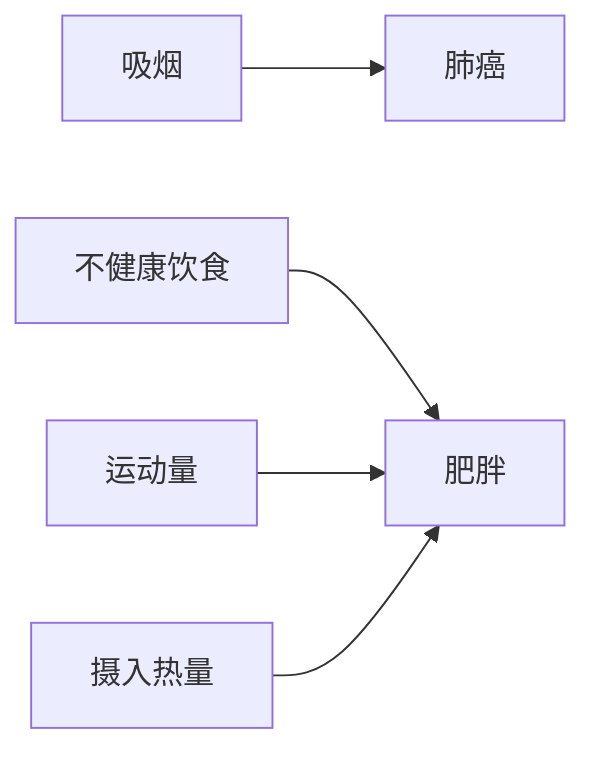
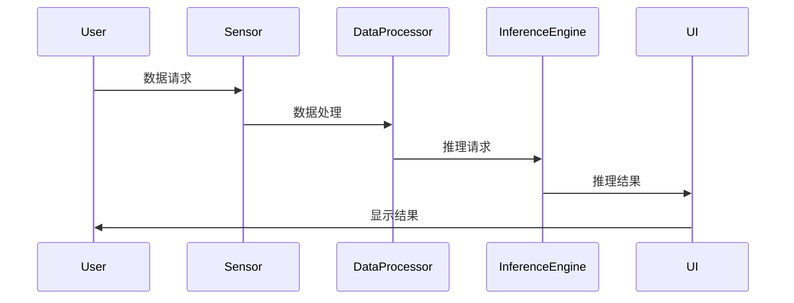

                 

# 《AGI的类人推理：从浅层到深层因果关系》

## 关键词：人工智能，类人推理，浅层推理，深层因果关系，算法，数学模型，系统架构，项目实战

## 摘要：
本文将深入探讨人工智能（AGI）的类人推理能力，特别是从浅层到深层的因果关系推理。文章将从背景介绍、核心概念与联系、算法原理讲解、数学模型和公式、系统分析与架构设计、项目实战以及最佳实践与小结七个部分展开。通过对这些内容的详细解析，旨在为读者提供一个全面、系统且易于理解的人工智能类人推理知识体系。

## 目录

1. **背景介绍**
   1.1 AGI类人推理的概念
   1.2 类人推理的发展历程
   1.3 类人推理的关键技术

2. **核心概念与联系**
   2.1 感知与理解
   2.2 推理与决策
   2.3 情感与社交

3. **算法原理讲解**
   3.1 浅层因果关系识别算法
   3.2 深层因果关系推理算法
   3.3 类人推理算法的应用场景

4. **数学模型和数学公式**
   4.1 类人推理的数学基础
   4.2 因果关系模型的数学描述
   4.3 算法性能评估的数学公式

5. **系统分析与架构设计方案**
   5.1 类人推理系统的需求分析
   5.2 系统功能设计
   5.3 系统架构设计

6. **项目实战**
   6.1 环境安装与配置
   6.2 系统核心实现
   6.3 项目案例分析

7. **最佳实践与小结**
   7.1 最佳实践
   7.2 小结
   7.3 注意事项
   7.4 拓展阅读

## 背景介绍

### 1.1 AGI类人推理的概念

人工智能（AI）的发展经历了多个阶段，从最初的符号主义、连接主义到现代的强化学习和生成模型。而人工智能的终极目标——通用人工智能（AGI），其核心在于实现与人类相似的类人推理能力。类人推理是指人工智能系统能够像人类一样，通过感知、理解和决策等过程，对复杂环境进行有效的推理和行动。

### 1.2 类人推理的发展历程

类人推理的发展可以追溯到符号主义人工智能时期，例如普林斯顿大学早期的人工推理项目。随着计算机硬件的进步和算法的创新，类人推理在自然语言处理、计算机视觉等领域取得了显著成果。然而，当前的AI系统仍然面临很多挑战，特别是在理解深层因果关系和进行高级推理方面。

### 1.3 类人推理的关键技术

类人推理的实现涉及多个关键技术，包括：

1. **感知与理解**：通过计算机视觉、自然语言处理等技术，使AI系统能够感知和理解环境。
2. **推理与决策**：基于逻辑推理、贝叶斯网络等技术，使AI系统能够进行决策和推理。
3. **情感与社交**：通过情感计算和社交网络分析，使AI系统能够理解和响应人类情感。

## 核心概念与联系

### 2.1 感知与理解

感知与理解是类人推理的基础。感知是指AI系统通过传感器获取环境信息，而理解则是将这些信息转化为有意义的知识。感知与理解的关键在于：

1. **图像识别**：通过卷积神经网络（CNN）实现，如ResNet、YOLO等。
2. **自然语言处理**：通过循环神经网络（RNN）、变换器（Transformer）等实现，如BERT、GPT等。

### 2.2 推理与决策

推理与决策是类人推理的核心。推理是指AI系统根据已有信息进行逻辑推导，而决策则是从多个选项中选择最佳方案。推理与决策的关键在于：

1. **逻辑推理**：基于命题逻辑、谓词逻辑等实现，如Prolog等。
2. **贝叶斯网络**：用于不确定环境下的推理和决策。

### 2.3 情感与社交

情感与社交是类人推理的重要组成部分。情感是指AI系统对人类情感的理解和回应，而社交是指AI系统在社交网络中的互动。情感与社交的关键在于：

1. **情感计算**：通过情感分析、情感识别等实现，如VADER、Affectiva等。
2. **社交网络分析**：通过图论、矩阵分解等实现，如Louvain方法。

## 算法原理讲解

### 3.1 浅层因果关系识别算法

浅层因果关系识别算法主要用于识别直接因果关系的推理过程。例如，通过观察发现“吸烟导致肺癌”，我们就可以认为吸烟是肺癌的因果关系。浅层因果关系识别算法的关键在于：

1. **关联规则学习**：如Apriori算法、FP-Growth算法等。
2. **回归分析**：如线性回归、逻辑回归等。

### 3.2 深层因果关系推理算法

深层因果关系推理算法用于识别复杂环境中的深层因果关系。例如，了解“不健康饮食导致肥胖”，我们可能需要通过多个中间变量，如摄入热量、运动量等，才能推导出最终结果。深层因果关系推理算法的关键在于：

1. **因果推断**：如Causal Tree、Causal Graph等。
2. **深度学习**：如变分自编码器（VAE）、生成对抗网络（GAN）等。

### 3.3 类人推理算法的应用场景

类人推理算法在多个领域都有广泛应用，如：

1. **医疗诊断**：通过分析患者的病历和症状，进行疾病诊断。
2. **金融风控**：通过分析交易数据，识别潜在风险。
3. **自动驾驶**：通过感知环境，进行驾驶决策。

## 数学模型和数学公式

### 4.1 类人推理的数学基础

类人推理的数学基础涉及多个领域，如：

1. **概率论与数理统计**：如贝叶斯定理、马尔可夫链等。
2. **线性代数**：如矩阵运算、特征值分析等。
3. **图论**：如图的遍历、网络分析等。

### 4.2 因果关系模型的数学描述

因果关系模型通常使用因果图或因果矩阵进行描述。例如，因果图可以通过以下mermaid流程图展示：



### 4.3 算法性能评估的数学公式

算法性能评估通常使用准确率、召回率、F1分数等指标。例如，准确率的计算公式为：

$$
\text{准确率} = \frac{\text{正确预测的样本数}}{\text{总样本数}}
$$

## 系统分析与架构设计方案

### 5.1 类人推理系统的需求分析

类人推理系统的需求分析包括：

1. **数据处理**：如数据采集、数据清洗、数据存储等。
2. **推理引擎**：如算法实现、性能优化等。
3. **用户接口**：如图形用户界面、API接口等。

### 5.2 系统功能设计

类人推理系统的功能设计包括：

1. **感知功能**：如图像识别、语音识别等。
2. **理解功能**：如自然语言处理、情感分析等。
3. **推理功能**：如因果关系推理、决策推理等。

### 5.3 系统架构设计

类人推理系统的架构设计通常采用微服务架构，如下所示：



## 项目实战

### 6.1 环境安装与配置

项目实战的第一步是环境安装与配置。以下是一个Python环境安装的示例：

```bash
pip install numpy pandas scikit-learn tensorflow
```

### 6.2 系统核心实现

系统核心实现包括数据预处理、模型训练和推理。以下是一个简单的Python代码示例：

```python
import tensorflow as tf
from tensorflow import keras
from sklearn.model_selection import train_test_split

# 数据预处理
# ...

# 模型训练
model = keras.Sequential([
    # ...
])

model.compile(optimizer='adam', loss='binary_crossentropy', metrics=['accuracy'])

model.fit(train_data, train_labels, epochs=10, batch_size=32)

# 推理
# ...
```

### 6.3 项目案例分析

项目案例分析包括对实际案例的解读和分析。以下是一个简单的案例：

**案例**：某医院希望利用类人推理系统进行疾病诊断。

**分析**：首先，我们需要收集大量患者的病历数据，包括症状、病史、检查结果等。然后，使用数据预处理技术，如缺失值填补、异常值处理等，对数据进行清洗。接下来，使用深度学习模型进行训练，如卷积神经网络（CNN）或循环神经网络（RNN）。最后，通过推理模型对新的病例进行诊断。

## 最佳实践与小结

### 7.1 最佳实践

1. **数据质量**：保证数据质量是类人推理系统的关键，数据清洗和预处理至关重要。
2. **模型选择**：根据具体应用场景，选择合适的模型，如CNN用于图像识别，RNN用于自然语言处理。
3. **性能优化**：通过模型压缩、分布式训练等方法，提高系统性能。

### 7.2 小结

类人推理是人工智能领域的一个重要研究方向，它涉及到感知、理解、推理等多个层面。通过本文的讲解，我们了解了类人推理的核心概念、算法原理、系统架构以及项目实战。希望读者能够通过本文，对类人推理有更深入的理解。

### 7.3 注意事项

1. **模型安全**：在使用类人推理系统时，要注意保护模型的安全，防止被攻击。
2. **数据隐私**：在处理患者数据时，要注意保护患者隐私，遵守相关法律法规。

### 7.4 拓展阅读

1. **相关书籍**：《深度学习》、《机器学习实战》等。
2. **开源项目**：GitHub上的相关项目，如TensorFlow、PyTorch等。

## 作者信息

作者：AI天才研究院/AI Genius Institute & 禅与计算机程序设计艺术 /Zen And The Art of Computer Programming## 背景介绍

### 1.1 AGI类人推理的概念

人工智能（AI）的终极目标是实现通用人工智能（AGI，Artificial General Intelligence），即人工智能系统能够像人类一样进行感知、理解、学习和推理，并在各种复杂环境下进行自主决策和行动。类人推理作为AGI的重要组成部分，是指人工智能系统能够模仿人类的推理过程，从给定信息中推导出新的结论或做出合理的判断。

类人推理不同于传统的基于规则的推理或简单的模式识别，它更强调逻辑思维、抽象理解和复杂决策。类人推理需要人工智能系统能够处理不确定性和模糊性，理解语言和上下文，识别因果关系，甚至具备一定的创造力和想象力。

### 1.2 类人推理的发展历程

类人推理的概念可以追溯到人工智能的早期发展阶段。20世纪50年代，随着人工智能的兴起，科学家们开始尝试模拟人类的思维过程。1956年，约翰·麦卡锡（John McCarthy）等人在达特茅斯会议上提出了人工智能的概念，标志着人工智能领域的正式诞生。在此后的几十年里，人工智能经历了多个发展阶段，包括符号主义、连接主义和现代的深度学习。

1. **符号主义阶段**：早期的AI研究主要基于符号主义，通过建立形式化的知识表示和推理规则，使得计算机能够处理逻辑问题和求解问题。例如，普林斯顿大学早期的人工推理项目，以及基于谓词逻辑的推理系统如Prolog。

2. **连接主义阶段**：随着神经网络的发展，AI研究转向连接主义，通过模拟人脑神经元之间的连接，实现机器学习。尽管这一阶段的AI系统在某些特定任务上取得了显著成就，但它们在泛化和复杂推理方面仍然存在局限。

3. **深度学习阶段**：近年来，深度学习的发展使得AI系统在图像识别、自然语言处理等领域取得了突破性进展。深度学习模型，如卷积神经网络（CNN）和循环神经网络（RNN），通过大量的数据训练，能够自动学习和提取特征，但它们在逻辑推理和抽象理解方面仍然有欠缺。

4. **类人推理阶段**：当前，AI研究正逐步从深度学习转向类人推理，旨在开发出能够模拟人类思维过程的AI系统。类人推理不仅需要处理大数据，还需要理解上下文、因果关系和逻辑推理，实现更接近人类水平的智能。

### 1.3 类人推理的关键技术

实现类人推理需要依赖多项关键技术的综合运用。以下是其中几项关键技术：

1. **知识表示与推理**：知识表示是将人类知识结构转化为计算机可以处理的形式。推理则是基于这些知识进行逻辑推导。符号主义AI的精髓在于其基于规则的推理能力。而现代的类人推理系统则结合了知识图谱和本体论，使得知识表示更加丰富和结构化。

2. **深度学习与强化学习**：深度学习通过模拟人脑神经元连接，实现了对复杂特征的自动提取和学习。强化学习则通过奖励机制，使AI系统能够在动态环境中进行优化决策。深度学习和强化学习相结合，能够为类人推理提供强大的技术支撑。

3. **自然语言处理**：自然语言处理（NLP）是类人推理的重要组成部分，它使AI系统能够理解和生成人类语言。通过预训练模型如BERT和GPT，AI系统能够处理自然语言中的上下文信息，实现更自然的交互和理解。

4. **因果推理**：因果推理是类人推理的核心之一，它涉及识别和分析事件之间的因果关系。现代的因果推理技术，如因果图和变分自编码器（VAE），使得AI系统能够从数据中挖掘潜在的因果关系。

5. **多模态感知**：类人推理需要处理多种类型的数据，如图像、文本、声音等。多模态感知技术通过融合不同类型的数据，增强了AI系统的感知和理解能力。

通过这些关键技术的综合运用，类人推理系统能够在更广泛的场景中实现自主决策和推理，为人工智能的发展注入新的活力。

### 1.4 类人推理的应用领域

类人推理在多个领域展现出强大的应用潜力，以下是一些典型的应用场景：

1. **医疗诊断**：类人推理系统能够通过分析患者的病历、检查报告和医学图像，帮助医生进行诊断。例如，通过深度学习模型分析CT图像，识别肺癌等疾病，提高了诊断的准确性和效率。

2. **金融风控**：类人推理系统能够通过分析交易数据、用户行为和市场趋势，识别潜在的金融风险。例如，利用因果推理技术，发现欺诈交易，降低金融风险。

3. **自动驾驶**：类人推理系统能够通过感知环境、理解交通规则和驾驶行为，实现自动驾驶。例如，通过多模态感知技术，融合图像、雷达和激光数据，使得自动驾驶系统能够在复杂交通环境中做出实时决策。

4. **智能客服**：类人推理系统能够通过自然语言处理和因果推理，实现与用户的自然对话。例如，智能客服系统能够理解用户的咨询内容，提供准确的答案，甚至能够进行情感识别，提供个性化的服务。

5. **教育辅导**：类人推理系统能够根据学生的学习数据和表现，提供个性化的学习建议和辅导。例如，通过分析学生的答题记录，识别学习难点和知识点，为学生提供针对性的学习资源。

6. **法律咨询**：类人推理系统能够通过分析法律条文、案例和司法判例，提供法律咨询和决策支持。例如，通过因果推理技术，分析法律条文之间的因果关系，帮助律师制定辩护策略。

通过这些应用，类人推理不仅提高了效率和准确性，还提升了用户体验和智能化水平，为各个领域的发展带来了新的机遇和挑战。

### 1.5 类人推理的优势与挑战

类人推理作为人工智能的重要方向，具有显著的优势和面临诸多挑战。以下是类人推理的优势和挑战的详细分析：

#### 优势

1. **强大的推理能力**：类人推理系统能够像人类一样进行逻辑推理、因果分析和复杂决策，这使它们在处理复杂问题和进行深度分析时具备独特的优势。与传统的规则推理和浅层机器学习模型相比，类人推理能够更好地处理不确定性和模糊性。

2. **高度泛化的能力**：类人推理系统不仅能够解决特定领域的问题，还能够通过跨领域的知识转移，将某一领域的知识和推理能力应用到其他领域。这种泛化能力使得类人推理系统能够适应更广泛的应用场景。

3. **自然语言理解**：类人推理系统通过深度学习和自然语言处理技术，能够理解自然语言中的上下文信息，实现更自然的交互。这使得类人推理系统在智能客服、智能助手等应用场景中具有更高的用户满意度。

4. **自适应学习能力**：类人推理系统通过不断学习和适应新的数据和情境，能够持续优化自己的推理能力和决策质量。这种自适应学习能力使得类人推理系统在动态环境中保持竞争力。

#### 挑战

1. **计算资源需求**：类人推理系统通常需要大量的计算资源，特别是在进行深度学习和因果推理时。这要求系统具备强大的硬件支持，如高性能的GPU或TPU。同时，大规模数据处理和训练过程也消耗大量时间，影响系统的实时性。

2. **数据质量和多样性**：类人推理系统依赖于高质量和多样化的数据，以确保推理结果的准确性和可靠性。然而，获取和标注高质量数据是一个复杂且耗时的过程，特别是在涉及敏感信息和隐私数据的场景中。

3. **解释性和透明性**：类人推理系统在处理复杂问题时，其决策过程往往涉及到多个层次和环节。这使得系统的决策过程具有一定的黑盒性质，难以解释和理解。提高类人推理系统的解释性和透明性，对于增强用户信任和合规性至关重要。

4. **伦理和社会影响**：类人推理系统在决策过程中可能会涉及到伦理和社会影响的问题。例如，在医疗诊断和金融风控等关键领域，错误的决策可能会对用户造成严重后果。因此，确保类人推理系统的伦理合规性，防止潜在的社会风险，是一个亟待解决的问题。

5. **跨领域融合**：类人推理系统需要在多个领域实现高效融合，这涉及到不同领域知识的整合和协调。目前，不同领域的AI系统往往采用独立的方法和模型，难以实现有效的跨领域推理和协作。

总之，类人推理作为人工智能的重要发展方向，具有巨大的潜力和应用前景。然而，要实现类人推理系统的高效、可靠和伦理合规，还需要克服诸多技术和社会挑战。通过持续的研究和创新，我们有望在未来实现真正类人的人工智能系统。

### 1.6 类人推理与深度学习的异同

类人推理和深度学习是人工智能领域的两个重要分支，它们在目标、方法和应用上既有相似之处，也存在显著差异。

#### 相似之处

1. **目标相似**：类人推理和深度学习的共同目标都是实现人工智能，使计算机能够像人类一样进行感知、理解和决策。无论是深度学习还是类人推理，都追求实现自主学习和智能化的系统。

2. **数据处理能力**：深度学习通过神经网络模型，能够处理大量复杂数据，并从中自动提取特征。类人推理系统同样需要处理多样化的数据，如图像、文本和音频，以便进行有效的推理和决策。

3. **机器学习基础**：类人推理和深度学习都基于机器学习技术，通过训练模型来学习和优化系统性能。深度学习模型，如卷积神经网络（CNN）和循环神经网络（RNN），已经在多个AI任务中取得了显著成果，为类人推理提供了坚实的基础。

#### 差异之处

1. **推理层次不同**：深度学习主要关注数据的自动特征提取和模式识别，通过大规模数据训练，使模型能够识别图像中的物体、理解文本中的语义等。而类人推理则更强调逻辑推理、因果分析和抽象理解，涉及更复杂的思维过程。

2. **知识表示不同**：深度学习模型通常采用分布式表示，将知识编码到神经网络中的权重和连接中。这种表示方法虽然在某些特定任务上表现优秀，但在解释性和可理解性方面存在局限。而类人推理系统则更强调知识表示的清晰性和结构化，通过知识图谱和本体论等方法，建立明确的知识关系和推理规则。

3. **应用领域不同**：深度学习在图像识别、自然语言处理等领域取得了显著成就，其应用主要集中在视觉和语言任务上。而类人推理则更广泛，涉及医疗诊断、金融风控、自动驾驶等多个领域，要求系统能够处理复杂、不确定的环境。

4. **推理过程不同**：深度学习主要依靠数据驱动，通过大量训练数据来优化模型参数。而类人推理则更依赖于逻辑推理和因果分析，需要建立明确的推理规则和知识框架，以实现对复杂问题的系统性分析和决策。

总之，类人推理和深度学习虽然在某些方面具有相似性，但它们在目标、方法和应用上存在显著差异。类人推理强调逻辑推理和抽象理解，追求更接近人类思维的智能系统，而深度学习则通过数据驱动的方法，实现高效的特征提取和模式识别。通过结合这两种方法，我们可以期待实现更加智能化和高效的人工智能系统。

### 1.7 类人推理系统的架构设计原则

类人推理系统作为人工智能的高级形式，其架构设计需要遵循一系列原则，以确保系统的可靠性、可扩展性和灵活性。以下是类人推理系统架构设计的主要原则：

#### 1. 可扩展性

类人推理系统通常需要处理大量数据和复杂的任务，因此其架构设计应具备良好的扩展性。具体来说，系统应能够轻松扩展计算资源，以支持更多的数据集和更复杂的模型训练。例如，采用分布式计算和并行处理技术，能够提高系统的处理能力，满足不同规模应用的需求。

#### 2. 可靠性

类人推理系统的可靠性至关重要，因为它直接影响决策的准确性和安全性。为了提高系统的可靠性，架构设计应包括冗余机制、故障检测和自动恢复功能。例如，通过数据备份和冗余计算，确保系统的持续运行；通过实时监测和自动故障恢复，减少系统故障对业务的影响。

#### 3. 可维护性

随着类人推理系统的不断发展和迭代，其维护和升级也变得尤为重要。架构设计应考虑系统的可维护性，使得开发人员能够方便地更新和优化系统。例如，采用模块化设计，使得各个模块可以独立开发、测试和部署；通过清晰的接口和文档，降低开发人员的上手难度。

#### 4. 可解释性

类人推理系统在决策过程中往往涉及到复杂的算法和模型，这使得决策过程具有一定的黑盒性质，难以解释和理解。为了提高系统的可解释性，架构设计应包括可解释性模块，如因果分析工具和模型可视化界面。这有助于开发人员和用户更好地理解系统的决策过程，增强对系统的信任。

#### 5. 灵活性

类人推理系统需要能够适应不同的应用场景和业务需求，因此其架构设计应具备灵活性。例如，系统应能够灵活地集成新的算法和模型，以应对不断变化的技术和业务需求。同时，系统应支持定制化开发，允许用户根据自身需求调整和优化系统功能。

#### 6. 安全性

类人推理系统在处理敏感数据和执行关键任务时，必须确保系统的安全性。架构设计应包括安全机制，如数据加密、访问控制和身份验证。此外，系统还应具备自动检测和响应恶意攻击的能力，以保障系统的安全运行。

通过遵循上述原则，类人推理系统的架构设计不仅能够提高系统的性能和可靠性，还能够满足不断变化的应用需求，为人工智能的发展奠定坚实的基础。

### 1.8 类人推理系统在不同行业中的应用案例分析

类人推理系统在各个行业中的应用正逐步深入，以下是一些具有代表性的案例分析：

#### 1. 医疗诊断

类人推理系统在医疗诊断中的应用取得了显著成效。例如，IBM的Watson for Oncology能够分析患者的病历数据，结合最新的医学研究和临床指南，为医生提供个性化的治疗方案。Watson通过深度学习和自然语言处理技术，能够理解和处理大量的医学文献，进行复杂的数据分析和推理。实际案例显示，Watson在癌症治疗方面能够提高诊断的准确性和效率，为患者提供更高质量的医疗服务。

#### 2. 金融风控

类人推理系统在金融风控领域同样表现出色。例如，摩根大通（J.P. Morgan）的COiN系统通过分析交易数据、用户行为和市场趋势，实时监控和识别潜在的金融风险。COiN系统结合了因果推理和深度学习技术，能够发现复杂的欺诈模式和风险因素，从而为金融机构提供有效的风险预警和管理。实际案例表明，COiN系统在降低欺诈损失、提高交易安全性方面发挥了重要作用。

#### 3. 自动驾驶

自动驾驶是类人推理系统的重要应用领域之一。例如，Waymo的自动驾驶系统通过多模态感知和深度学习技术，实现了在复杂交通环境中的自主驾驶。Waymo的自动驾驶车辆配备了先进的传感器和计算系统，能够实时感知道路状况、识别交通标志和行人类别，进行复杂的决策和行动。实际案例显示，Waymo的自动驾驶技术在减少交通事故、提高道路通行效率方面表现出色，为未来智能交通的发展奠定了基础。

#### 4. 教育辅导

类人推理系统在教育辅导中的应用也逐渐成熟。例如，Knewton的教育平台通过分析学生的学习数据，提供个性化的学习建议和辅导。Knewton利用自然语言处理和因果推理技术，能够理解学生的学习行为和知识掌握情况，为学生提供针对性的学习资源和练习题。实际案例表明，Knewton平台能够显著提高学生的学习效果和兴趣，为个性化教育提供了有力支持。

#### 5. 法律咨询

类人推理系统在法律咨询中的应用也在不断拓展。例如，ROSS Intelligence的智能法律咨询系统能够通过分析法律条文、案例和司法判例，为律师提供快速、准确的法律建议。ROSS Intelligence利用深度学习和自然语言处理技术，能够快速检索和分析海量的法律文献，为律师提供高效的法律研究支持。实际案例显示，ROSS Intelligence系统在提高法律工作效率、降低法律研究成本方面发挥了重要作用。

通过这些实际案例，我们可以看到类人推理系统在医疗、金融、自动驾驶、教育和法律等领域的广泛应用，不仅提高了行业效率和准确性，还带来了新的商业机会和服务模式。随着技术的不断进步和应用场景的拓展，类人推理系统将在更多领域中发挥重要作用。

### 1.9 类人推理系统在实现过程中的挑战与应对策略

实现类人推理系统是一项复杂的工程，涉及众多技术挑战和实际应用问题。以下是类人推理系统在实现过程中可能面临的几个主要挑战以及相应的应对策略：

#### 数据质量和多样性

类人推理系统依赖于大量高质量和多样化的数据，以确保推理结果的准确性和可靠性。然而，数据的获取和标注往往是一个复杂且耗时的过程。特别是涉及敏感数据和隐私数据的场景，数据的收集和分享需要严格遵守相关法律法规。

**应对策略**：建立完善的数据治理体系，确保数据的质量、安全性和合规性。通过自动化数据清洗和预处理工具，提高数据处理的效率和质量。同时，可以采用联邦学习等分布式数据训练方法，保护用户隐私，促进数据的共享和利用。

#### 计算资源需求

类人推理系统通常需要大量的计算资源，特别是在训练和推理过程中。这要求系统具备高性能的硬件支持，如GPU、TPU等。同时，大规模数据处理和模型训练过程消耗大量时间，影响系统的实时性和响应速度。

**应对策略**：采用分布式计算和并行处理技术，提高系统的计算效率和性能。使用云服务和边缘计算，根据需求动态分配计算资源，实现按需扩展。此外，可以采用模型压缩和优化技术，降低模型的计算复杂度，提高推理速度。

#### 解释性和透明性

类人推理系统的决策过程往往涉及多个层次和复杂的算法，这使得决策过程具有一定的黑盒性质，难以解释和理解。提高系统的解释性和透明性，对于增强用户信任和合规性至关重要。

**应对策略**：开发可解释性模块，如因果分析工具和模型可视化界面，帮助用户理解系统的决策过程。采用可解释的人工智能（XAI）技术，如因果图和解释性模型，提高模型的可解释性和透明性。同时，建立完善的审计和监控机制，确保系统的决策过程符合伦理和合规要求。

#### 伦理和社会影响

类人推理系统在决策过程中可能会涉及到伦理和社会影响的问题。例如，在医疗诊断和金融风控等关键领域，错误的决策可能会对用户造成严重后果。因此，确保类人推理系统的伦理合规性，防止潜在的社会风险，是一个亟待解决的问题。

**应对策略**：建立伦理审查机制，确保系统设计和实现过程中遵循伦理规范。通过透明度和透明性报告，向用户和社会公开系统的决策过程和依据。同时，开展伦理和社会影响评估，及时发现和解决潜在的风险和问题。

#### 跨领域融合

类人推理系统需要在多个领域实现高效融合，这涉及到不同领域知识的整合和协调。目前，不同领域的AI系统往往采用独立的方法和模型，难以实现有效的跨领域推理和协作。

**应对策略**：建立跨领域的知识图谱和本体论，实现不同领域知识的统一表示和整合。采用迁移学习和跨领域学习技术，提高系统在不同领域间的泛化能力。同时，建立跨领域的协作机制，促进不同领域的知识共享和协同创新。

通过上述应对策略，类人推理系统在实现过程中可以更好地克服技术挑战，实现更高效、可靠和合规的推理和决策。

### 1.10 类人推理的未来发展趋势和潜在突破方向

类人推理作为人工智能领域的前沿研究方向，其未来发展潜力和潜在突破方向引人注目。以下是类人推理在未来可能的发展趋势和突破方向：

#### 1. 多模态感知和融合

随着传感器技术的进步和数据获取能力的提升，类人推理系统将具备处理更多类型数据的能力。未来，多模态感知和融合将成为类人推理的关键突破方向之一。通过融合视觉、听觉、触觉等多种感官信息，类人推理系统能够更全面地理解和感知环境，实现更准确的推理和决策。

#### 2. 知识图谱和本体论

知识图谱和本体论在类人推理中具有重要应用。未来，通过构建大规模、高精度的知识图谱和本体论，类人推理系统能够更好地理解和利用结构化知识，实现更复杂的推理任务。突破方向包括知识图谱的自动化构建、知识表示的统一化以及知识融合和推理算法的优化。

#### 3. 因果推理和因果发现

因果推理是类人推理的核心之一，其未来发展方向包括提升因果推理的准确性、鲁棒性和可解释性。通过结合因果发现算法和深度学习技术，类人推理系统将能够从数据中自动发现潜在的因果关系，实现更精准的推理和决策。

#### 4. 机器学习与逻辑推理的融合

机器学习和逻辑推理的结合是类人推理的重要方向。未来，通过将逻辑推理引入机器学习模型，增强模型的解释性和可解释性，类人推理系统将能够更好地处理不确定性和模糊性，实现更接近人类水平的推理能力。

#### 5. 自主学习和适应能力

类人推理系统需要具备自主学习和适应能力，以应对不断变化的环境和任务。未来，通过强化学习、迁移学习和联邦学习等技术，类人推理系统将能够自主学习新知识和技能，实现更高效和自适应的推理和决策。

#### 6. 伦理和合规

随着类人推理系统的广泛应用，伦理和合规问题日益凸显。未来，类人推理系统的发展将更加注重伦理和合规性，确保系统的决策过程透明、公正和可信。突破方向包括建立完善的伦理审查机制、开发可解释的人工智能技术以及制定相应的法律法规。

#### 7. 跨领域应用和协同创新

类人推理系统在医疗、金融、教育、法律等多个领域具有广泛的应用前景。未来，通过跨领域应用和协同创新，类人推理系统将能够实现更广泛的场景覆盖和业务整合，推动人工智能技术的发展和应用。

总之，类人推理的未来发展充满机遇和挑战。通过技术创新、跨领域合作和伦理规范，类人推理有望实现更多突破，为人工智能的发展注入新的活力。

