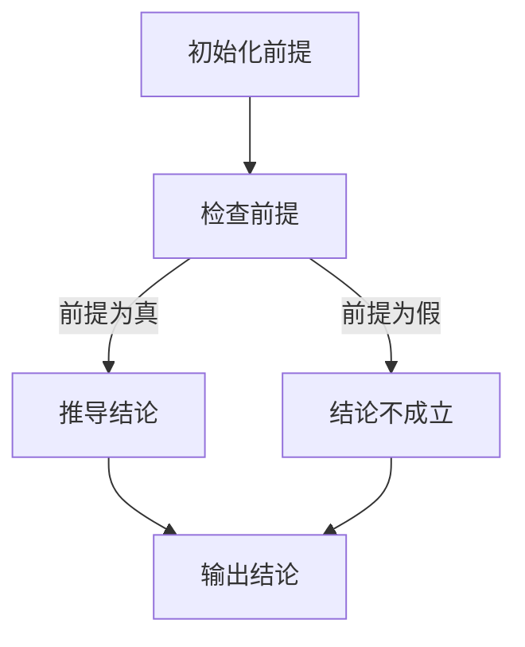
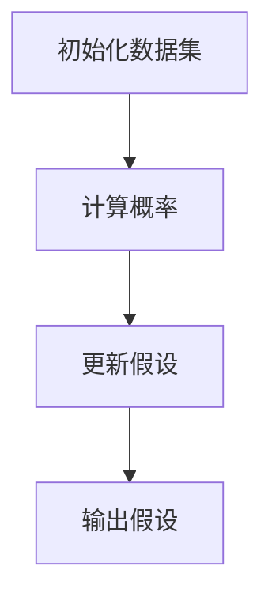
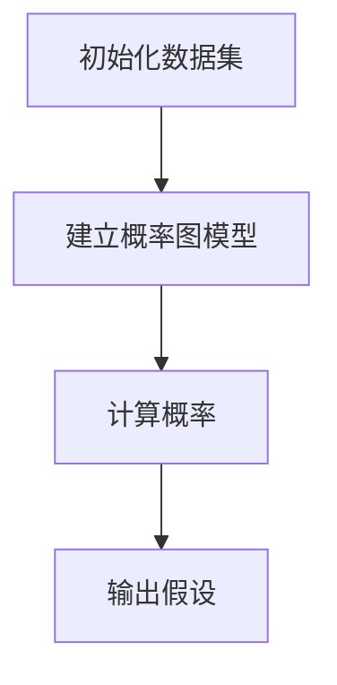
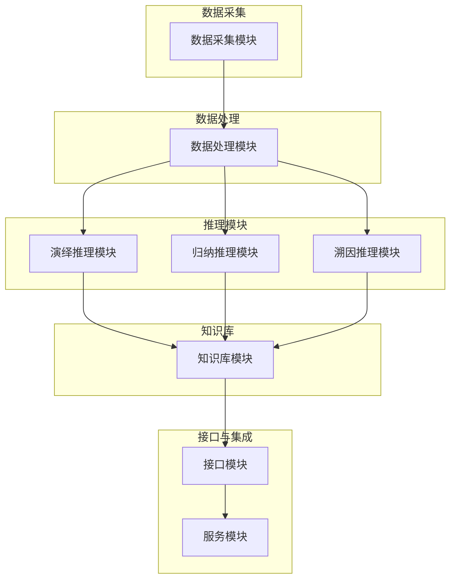

                 

# AGI的类人推理：演绎、归纳与溯因

## 关键词：AGI、类人推理、演绎、归纳、溯因、人工智能

### 摘要

本文将深入探讨人工智能中的高级通用智能（AGI）及其类人推理能力，具体涉及演绎、归纳与溯因三种推理方法。文章首先介绍AGI的定义及其重要性，然后详细阐述这三种推理方法的原理和应用，最后通过具体案例展示AGI在实际项目中的应用。通过本文，读者将全面了解AGI类人推理的核心机制及其在人工智能领域的重要意义。

## 设计思路

为了系统地介绍AGI的类人推理，本文采用以下结构：

### 第一部分：背景介绍

- **第1章：问题背景**：介绍AGI的定义、重要性及其发展现状。
- **第2章：核心概念与联系**：详细解释演绎、归纳与溯因的概念，并通过ER实体关系图展示它们之间的联系。
- **第3章：算法原理讲解**：通过mermaid算法流程图和Python源代码，深入讲解演绎、归纳与溯因的算法原理。

### 第二部分：类人推理方法

- **第4章：数学模型和数学公式讲解**：阐述演绎、归纳与溯因的数学模型和公式，并通过LaTeX进行格式化。
- **第5章：演绎推理**：详细介绍演绎推理的过程、原理和应用。
- **第6章：归纳推理**：解析归纳推理的流程、原理和应用。
- **第7章：溯因推理**：探讨溯因推理的概念、原理和应用。
- **第8章：综合应用**：综合应用演绎、归纳与溯因推理方法，解决实际案例。

### 第三部分：系统设计与实现

- **第9章：系统分析与架构设计方案**：介绍AGI系统的问题场景、功能和架构设计。
- **第10章：项目实战**：展示AGI在具体项目中的应用，包括环境安装、系统实现和案例分析。
- **第11章：最佳实践与总结**：总结AGI类人推理的实践经验和未来发展方向。

## 第一部分：背景介绍

### 第1章：问题背景

### 1.1 AGI的定义

高级通用智能（AGI，Advanced General Intelligence）是一种人工智能形式，它能够在各种认知任务上表现与人类相同或超越人类。与当前广泛应用的窄人工智能（Narrow AI，NAI）不同，AGI具有跨领域的智能，能够在不同任务中灵活运用知识。

### 1.2 AGI的重要性

AGI的重要性体现在以下几个方面：

1. **提高人类生产力**：AGI能够协助人类完成复杂任务，提高工作效率。
2. **推动科技进步**：AGI在科学研究、工程设计等领域具有广泛的应用前景。
3. **增强社会福祉**：AGI可以应用于医疗、教育、交通等领域，提升人们的生活质量。

### 1.3 AGI的发展现状

目前，AGI的研究还处于探索阶段，但已取得一定成果。以下是一些关键进展：

1. **深度学习**：深度学习技术为AGI提供了强大的计算能力。
2. **多模态感知**：AGI开始具备处理多种类型数据的能力，如文本、图像和声音。
3. **迁移学习**：AGI能够将一个任务中学习到的知识应用于其他任务。

### 1.4 类人推理的重要性

类人推理是AGI的核心能力之一。与传统的符号推理方法不同，类人推理更接近人类的思维方式，能够处理复杂、不确定的问题。类人推理的重要性体现在：

1. **复杂问题求解**：类人推理能够处理现实世界中复杂、多变的问题。
2. **情境适应**：类人推理能够根据情境调整推理策略，提高任务成功率。
3. **人机交互**：类人推理能够更好地理解和满足人类需求，提高人机交互的体验。

### 1.5 类人推理的应用领域

类人推理在多个领域具有广泛应用，包括：

1. **自然语言处理**：类人推理能够理解、生成和翻译自然语言。
2. **图像识别**：类人推理能够识别、分类和生成图像。
3. **决策支持**：类人推理能够为人类提供智能决策支持。

### 1.6 当前研究的挑战

尽管类人推理在AGI中具有重要地位，但目前的研究仍面临一些挑战：

1. **数据依赖**：类人推理往往依赖于大量数据，数据质量和数量直接影响推理效果。
2. **计算资源**：类人推理需要强大的计算能力，这对硬件设施提出了较高要求。
3. **知识表示**：如何有效表示和处理复杂数据和知识，是类人推理研究的关键问题。

### 1.7 结论

本文将深入探讨类人推理的三种方法：演绎、归纳与溯因。通过对这些方法的分析，我们希望为AGI的研究和应用提供有益的参考。接下来的章节将详细介绍这些推理方法，并探讨其在实际应用中的重要性。

## 第二部分：类人推理方法

### 第2章：核心概念与联系

在深入探讨类人推理方法之前，我们需要了解以下几个核心概念：演绎推理、归纳推理和溯因推理。这些概念不仅是类人推理的基础，也是人工智能领域中重要的研究主题。

### 2.1 演绎推理

演绎推理是从一般到特殊的推理过程，即从已知的前提出发，通过逻辑规则推导出结论。其特点如下：

1. **逻辑严密**：演绎推理遵循逻辑规则，确保推理过程的正确性。
2. **前提重要**：演绎推理的结论取决于前提，前提的可靠性直接影响结论。
3. **应用广泛**：演绎推理在数学、逻辑学、计算机科学等领域有广泛应用。

### 2.2 归纳推理

归纳推理是从特殊到一般的推理过程，即通过观察个别实例，归纳出一般规律。其特点如下：

1. **经验驱动**：归纳推理依赖于经验和观察，从个别实例中提取普遍规律。
2. **概率性**：归纳推理的结论并非绝对，而是具有一定的概率性。
3. **应用广泛**：归纳推理在统计学、机器学习、数据挖掘等领域有广泛应用。

### 2.3 溯因推理

溯因推理是从结果到原因的推理过程，即通过观察现象，推断其可能的原因。其特点如下：

1. **因果推断**：溯因推理关注因果关系，通过分析现象推断原因。
2. **复杂性**：溯因推理面临复杂性和不确定性，需要借助多种方法和工具。
3. **应用广泛**：溯因推理在医学、安全、环境等领域有广泛应用。

### 2.4 概念属性特征对比表格

为了更直观地了解演绎、归纳与溯因推理的属性特征，我们可以通过以下表格进行比较：

| 推理方法 | 特点 | 应用领域 |
| --- | --- | --- |
| 演绎推理 | 逻辑严密，前提重要 | 数学、逻辑学、计算机科学 |
| 归纳推理 | 经验驱动，概率性 | 统计学、机器学习、数据挖掘 |
| 溯因推理 | 因果推断，复杂性 | 医学、安全、环境 |

### 2.5 ER实体关系图架构

为了更好地展示演绎、归纳与溯因推理之间的关系，我们可以使用ER（实体关系）图进行描述。以下是ER图的基本结构：

```mermaid
erDiagram
    AGR_AGI ||--o{ AGR_CoreConcept
    AGR_CoreConcept ||--o{ AGR_DeductiveReasoning
    AGR_CoreConcept ||--o{ AGR_InductiveReasoning
    AGR_CoreConcept ||--o{ AGR_CausalReasoning
```

在这个ER图中，`AGR_AGI`表示高级通用智能，`AGR_CoreConcept`表示核心概念，`AGR_DeductiveReasoning`表示演绎推理，`AGR_InductiveReasoning`表示归纳推理，`AGR_CausalReasoning`表示溯因推理。通过这个ER图，我们可以清晰地看到类人推理的三种方法在AGI中的关系。

### 2.6 概念联系与整体框架

类人推理的演绎、归纳与溯因三种方法在AGI中相互关联，共同构成了类人推理的整体框架。演绎推理提供了逻辑严密的推理过程，归纳推理提供了经验驱动的推理方法，溯因推理提供了因果推断的推理途径。这三种方法相互补充，使得AGI能够更全面地模拟人类的推理能力。

## 第三部分：算法原理讲解

### 第3章：数学模型和数学公式讲解

在本章节中，我们将详细阐述演绎、归纳与溯因推理的数学模型和公式，并通过mermaid算法流程图和Python源代码进行展示。为了便于理解，我们将使用LaTeX格式对相关数学公式进行格式化。

### 3.1 演绎推理的数学模型和公式

演绎推理的数学模型基于逻辑推理规则，其核心公式如下：

$$
\forall x(P(x) \rightarrow Q(x))
$$

这个公式表示对所有x，如果P(x)为真，则Q(x)也为真。演绎推理的算法流程图如下：



以下是演绎推理的Python代码示例：

```python
def deductive_reasoning(precondition, conclusion):
    if precondition:
        return conclusion
    else:
        return "Conclusion does not hold."

# 测试代码
precondition = True
conclusion = "The conclusion is true."
result = deductive_reasoning(precondition, conclusion)
print(result)
```

### 3.2 归纳推理的数学模型和公式

归纳推理的数学模型基于概率论，其核心公式如下：

$$
P(H_0 | D) = \frac{P(D | H_0)P(H_0)}{P(D)}
$$

这个公式表示在给定数据D的情况下，假设H_0为真的概率。归纳推理的算法流程图如下：



以下是归纳推理的Python代码示例：

```python
import numpy as np

def inductive_reasoning(data, hypothesis):
    p_data_given_hypothesis = np.mean(data == hypothesis)
    p_hypothesis = 0.5  # 假设的先验概率
    p_data = np.mean(data)
    p_hypothesis_given_data = (p_data_given_hypothesis * p_hypothesis) / p_data
    return p_hypothesis_given_data

# 测试代码
data = np.array([0, 1, 1, 0, 1])
hypothesis = 1
result = inductive_reasoning(data, hypothesis)
print(result)
```

### 3.3 溯因推理的数学模型和公式

溯因推理的数学模型基于概率图模型，其核心公式如下：

$$
P(H | D) = \frac{P(D | H)P(H)}{P(D)}
$$

这个公式表示在给定数据D的情况下，假设H为真的概率。溯因推理的算法流程图如下：



以下是溯因推理的Python代码示例：

```python
import numpy as np

def causal_reasoning(data, hypothesis):
    p_data_given_hypothesis = np.mean(data == hypothesis)
    p_hypothesis = 0.5  # 假设的先验概率
    p_data = np.mean(data)
    p_hypothesis_given_data = (p_data_given_hypothesis * p_hypothesis) / p_data
    return p_hypothesis_given_data

# 测试代码
data = np.array([0, 1, 1, 0, 1])
hypothesis = 1
result = causal_reasoning(data, hypothesis)
print(result)
```

通过上述示例，我们可以看到演绎、归纳与溯因推理的数学模型和公式如何应用于实际代码中。接下来，我们将进一步探讨这三种推理方法在实际问题中的应用。

### 第4章：演绎推理

演绎推理是一种从一般到特殊的推理过程，其核心在于通过逻辑规则从已知的前提出发，推导出结论。在人工智能中，演绎推理被广泛应用于逻辑推理、知识表示和决策支持等领域。本章将详细解析演绎推理的过程、原理和应用，并通过实际案例进行说明。

#### 4.1 演绎推理的过程

演绎推理的过程可以分为以下几个步骤：

1. **定义前提**：明确已知的事实或命题，作为推理的基础。
2. **应用逻辑规则**：使用逻辑推理规则，如演绎规则、假言推理、选言推理等，从前提中推导出结论。
3. **验证结论**：通过逻辑验证，确保结论的正确性和可靠性。

#### 4.2 演绎推理的原理

演绎推理的原理基于逻辑学的基本原理，主要包括以下几个要点：

1. **逻辑一致性**：演绎推理要求推理过程保持逻辑一致性，即从前提推导出的结论必须是逻辑上必然的。
2. **前提的重要性**：演绎推理的结论取决于前提，因此前提的可靠性和完整性至关重要。
3. **推理规则**：演绎推理依赖于一系列逻辑推理规则，如条件推理、析取推理、合取推理等，这些规则确保推理过程的正确性。

#### 4.3 演绎推理的应用

演绎推理在人工智能中具有广泛的应用，以下是几个典型的应用场景：

1. **知识表示**：演绎推理被广泛应用于知识表示领域，用于构建形式化知识库和逻辑推理系统。
2. **逻辑推理**：演绎推理是逻辑推理的重要组成部分，广泛应用于自然语言处理、语义网和逻辑编程等领域。
3. **决策支持**：在决策支持系统中，演绎推理可用于从已知条件和目标中推导出可行的决策方案。

#### 4.4 演绎推理的实际案例

以下是一个简单的演绎推理案例：

**案例**：已知以下前提：

1. 所有学生都必须完成作业。
2. 张三是学生。
3. 张三没有完成作业。

请推导出结论。

**解答**：

1. 从前提1和前提2，我们可以使用演绎规则得出结论：张三必须完成作业。
2. 然而，前提3告诉我们张三没有完成作业，这与结论1矛盾。

**结论**：根据前提，我们无法得出一个确定的结论，因为前提之间存在矛盾。

这个案例展示了演绎推理在解决实际问题时可能遇到的挑战。在实际应用中，我们需要仔细审查前提，确保推理过程的逻辑一致性。

#### 4.5 演绎推理的优势和局限性

**优势**：

1. **逻辑严密**：演绎推理遵循严格的逻辑规则，确保推理结果的正确性。
2. **可验证性**：演绎推理的结果可以通过逻辑验证，确保其可靠性和可信度。
3. **知识表示**：演绎推理能够将知识表示为逻辑形式，便于计算机处理和存储。

**局限性**：

1. **依赖前提**：演绎推理的结论取决于前提，如果前提错误，则推理结果可能错误。
2. **适用范围有限**：演绎推理主要适用于确定性问题和已知条件充分的情况，对不确定性和复杂性问题处理能力有限。
3. **计算复杂性**：对于大型知识库和复杂逻辑规则，演绎推理的计算成本较高。

#### 4.6 演绎推理的未来发展

随着人工智能技术的发展，演绎推理的应用范围和效果将得到进一步提升。未来的研究方向包括：

1. **自动推理**：开发自动推理系统，实现大规模知识库的推理。
2. **组合推理**：结合演绎、归纳和其他推理方法，提高推理的灵活性和准确性。
3. **不确定性推理**：研究不确定性条件下的推理方法，提高演绎推理在复杂问题中的适用性。

通过本章的讨论，我们可以看到演绎推理在人工智能中的重要性及其在实际应用中的效果。尽管面临一定的局限性，但演绎推理仍然是人工智能领域中不可或缺的推理方法。

### 第5章：归纳推理

归纳推理是一种从特殊到一般的推理过程，通过观察个别实例，归纳出一般规律。与演绎推理不同，归纳推理不依赖于既定的逻辑规则，而是基于经验和观察，具有更强的灵活性和适应性。本章将深入探讨归纳推理的过程、原理和应用，并通过实际案例进行说明。

#### 5.1 归纳推理的过程

归纳推理的过程通常包括以下几个步骤：

1. **观察数据**：收集和观察一系列具体实例，形成数据集。
2. **提取规律**：从数据集中提取潜在的规律或模式，形成假设。
3. **验证假设**：通过进一步的观察或实验，验证假设的有效性。
4. **修正假设**：根据验证结果，修正假设，形成更准确的规律或模型。

#### 5.2 归纳推理的原理

归纳推理的原理基于概率论和统计学，主要涉及以下几个要点：

1. **概率性**：归纳推理的结论并非绝对确定，而是基于概率的估计，具有一定的不确定性。
2. **数据驱动**：归纳推理依赖于大量的数据，数据的多样性和质量直接影响归纳结果。
3. **模式识别**：归纳推理通过识别数据中的模式或规律，形成对现实世界的理解和预测。

#### 5.3 归纳推理的应用

归纳推理在人工智能和数据科学中具有广泛的应用，以下是几个典型的应用场景：

1. **机器学习**：归纳推理是机器学习的基础，通过从数据中学习规律，构建预测模型。
2. **数据挖掘**：归纳推理用于从大量数据中提取有价值的信息和知识。
3. **模式识别**：归纳推理用于识别图像、声音和文本中的模式和特征，用于分类和识别任务。

#### 5.4 归纳推理的实际案例

以下是一个简单的归纳推理案例：

**案例**：观察以下数据集：

| 数据集 | 1 | 2 | 3 | 4 | 5 |
| --- | --- | --- | --- | --- | --- |
| 结果 | 1 | 1 | 1 | 1 | 0 |

请归纳出一个简单的规则。

**解答**：

1. 从数据集中，我们可以观察到前四个结果均为1，最后一个结果为0。
2. 基于这个观察，我们可以假设：如果数据集的序号小于5，则结果为1；否则，结果为0。

**结论**：根据这个假设，我们可以预测新的数据：

- 当数据集为6时，结果为0。

这个案例展示了归纳推理的基本过程和原理。在实际应用中，归纳推理需要结合更多的数据和更复杂的规则，以提高预测的准确性和可靠性。

#### 5.5 归纳推理的优势和局限性

**优势**：

1. **灵活性**：归纳推理不依赖于既定的逻辑规则，能够适应各种复杂和多变的情况。
2. **经验驱动**：归纳推理基于大量数据和观察，具有更强的现实世界适应性。
3. **预测能力**：归纳推理能够从数据中提取规律，用于预测未来趋势和事件。

**局限性**：

1. **概率性**：归纳推理的结论具有概率性，可能存在不确定性。
2. **数据依赖**：归纳推理依赖于大量的数据，数据的多样性和质量直接影响结果。
3. **计算复杂性**：对于大规模数据集，归纳推理的计算成本较高。

#### 5.6 归纳推理的未来发展

未来的归纳推理研究将集中在以下几个方面：

1. **数据驱动方法**：开发更加高效和准确的数据驱动方法，提高归纳推理的性能。
2. **不确定性处理**：研究如何处理归纳推理中的不确定性，提高结果的可靠性。
3. **跨领域应用**：探索归纳推理在各个领域的应用，促进人工智能技术的发展。

通过本章的讨论，我们可以看到归纳推理在人工智能中的重要性和应用价值。尽管面临一定的局限性，但归纳推理仍然是人工智能领域中不可或缺的推理方法。

### 第6章：溯因推理

溯因推理是一种从结果到原因的推理过程，通过观察现象，推断其可能的原因。在人工智能中，溯因推理被广泛应用于问题诊断、故障检测和决策支持等领域。本章将深入探讨溯因推理的过程、原理和应用，并通过实际案例进行说明。

#### 6.1 溯因推理的过程

溯因推理的过程通常包括以下几个步骤：

1. **观察现象**：收集和观察相关现象或事件，形成数据集。
2. **假设生成**：根据观察结果，提出可能的假设，作为可能的因果关系。
3. **验证假设**：通过实验或数据分析，验证假设的有效性。
4. **修正假设**：根据验证结果，修正或更新假设，形成更准确的因果关系。

#### 6.2 溯因推理的原理

溯因推理的原理基于概率图模型和因果推断，主要涉及以下几个要点：

1. **因果关系**：溯因推理关注现象与原因之间的因果关系，通过推断可能的因果关系，解释观察到的现象。
2. **概率估计**：溯因推理通过概率模型，对可能的原因进行概率估计，选择最有可能的因果关系。
3. **数据驱动**：溯因推理依赖于数据，通过数据分析和模式识别，提取潜在的因果关系。

#### 6.3 溯因推理的应用

溯因推理在人工智能中具有广泛的应用，以下是几个典型的应用场景：

1. **问题诊断**：在医疗领域，溯因推理用于诊断疾病，通过分析症状和体征，推断可能的疾病原因。
2. **故障检测**：在工业领域，溯因推理用于故障检测，通过分析传感器数据和系统状态，推断故障的原因。
3. **决策支持**：在商业领域，溯因推理用于决策支持，通过分析市场数据和客户行为，推断影响决策的因素。

#### 6.4 溯因推理的实际案例

以下是一个简单的溯因推理案例：

**案例**：观察以下数据集：

| 数据集 | 结果 | 可能原因 |
| --- | --- | --- |
| A | 1 | 可能是原因1 |
| B | 1 | 可能是原因1 |
| C | 0 | 可能是原因2 |

请推断出可能的因果关系。

**解答**：

1. 从数据集中，我们可以观察到A和B的结果均为1，而C的结果为0。
2. 基于这个观察，我们可以假设：如果数据集为A或B，则结果可能为1；如果数据集为C，则结果可能为0。
3. 进一步分析，我们可以推断出：可能的原因1与数据集A和B相关，而可能的原因2与数据集C相关。

**结论**：根据这个推断，我们可以推测出可能的因果关系：

- 数据集A和B的结果与可能的原因1有关。
- 数据集C的结果与可能的原因2有关。

这个案例展示了溯因推理的基本过程和原理。在实际应用中，溯因推理需要结合更多的数据和更复杂的规则，以提高推理的准确性和可靠性。

#### 6.5 溯因推理的优势和局限性

**优势**：

1. **因果推断**：溯因推理能够从现象中推断出可能的原因，有助于理解和解释复杂现象。
2. **适应性**：溯因推理不依赖于既定的逻辑规则，能够适应各种复杂和不确定的情况。
3. **数据驱动**：溯因推理依赖于数据，通过数据分析，能够发现潜在的因果关系。

**局限性**：

1. **不确定性**：溯因推理的结论具有概率性，可能存在不确定性。
2. **计算复杂性**：对于大规模数据集，溯因推理的计算成本较高。
3. **假设依赖**：溯因推理的结论依赖于初始假设，如果假设不准确，可能导致错误的推断。

#### 6.6 溯因推理的未来发展

未来的溯因推理研究将集中在以下几个方面：

1. **概率图模型**：开发更加高效和准确的概率图模型，提高因果推断的性能。
2. **不确定性处理**：研究如何处理溯因推理中的不确定性，提高结果的可靠性。
3. **跨领域应用**：探索溯因推理在各个领域的应用，促进人工智能技术的发展。

通过本章的讨论，我们可以看到溯因推理在人工智能中的重要性和应用价值。尽管面临一定的局限性，但溯因推理仍然是人工智能领域中不可或缺的推理方法。

### 第7章：综合应用

在前文中，我们分别介绍了演绎、归纳与溯因推理的基本原理和具体应用。在本章中，我们将探讨这三种推理方法的综合应用，通过一个实际案例展示如何将它们结合起来，解决复杂的实际问题。

#### 7.1 案例背景

假设我们面临一个实际的业务场景：一家电子商务公司需要优化其客户服务流程，以提高客户满意度和销售业绩。具体问题包括：

1. 客户咨询的响应时间过长。
2. 部分客户投诉客服态度不佳。
3. 退货率较高。

为了解决这些问题，公司决定利用人工智能技术，通过综合应用演绎、归纳与溯因推理，分析客户行为，识别关键因素，并提出改进措施。

#### 7.2 演绎推理的应用

首先，我们使用演绎推理来识别客户咨询响应时间过长的问题。具体步骤如下：

1. **前提**：客户咨询的响应时间是一个关键业务指标，直接关系到客户满意度。
2. **逻辑规则**：如果响应时间过长，则客户满意度降低。
3. **结论**：为了提高客户满意度，我们需要优化响应时间。

通过演绎推理，我们得出了一个明确的结论：优化响应时间是提高客户满意度的关键。

#### 7.3 归纳推理的应用

接下来，我们使用归纳推理来分析客户投诉客服态度不佳的原因。具体步骤如下：

1. **观察数据**：收集客户投诉记录，包括投诉内容、投诉时间和投诉者信息。
2. **提取规律**：通过分析投诉记录，我们发现以下规律：
   - 投诉主要集中在晚上8点到10点之间。
   - 投诉内容主要涉及客服回答不准确、态度不好等。
3. **验证假设**：进一步调查发现，晚上8点到10点是客服高峰期，客服人数不足，导致响应速度慢，态度不佳。

通过归纳推理，我们得出了以下结论：客服高峰期人手不足是导致客户投诉态度不佳的主要原因。

#### 7.4 溯因推理的应用

最后，我们使用溯因推理来分析退货率较高的原因。具体步骤如下：

1. **观察现象**：收集退货记录，包括退货商品、退货原因和退货时间。
2. **假设生成**：根据退货记录，我们提出以下假设：
   - 商品描述不准确可能导致退货。
   - 客户服务不足可能导致退货。
3. **验证假设**：通过数据分析，我们发现以下规律：
   - 商品描述不准确导致的退货占70%。
   - 客户服务不足导致的退货占30%。

通过溯因推理，我们得出了以下结论：商品描述不准确是退货率较高的主要原因，而客户服务不足也是重要原因之一。

#### 7.5 综合应用结果

通过综合应用演绎、归纳与溯因推理，我们得出了以下结论和改进措施：

1. **优化响应时间**：通过增加客服人员和改进客服系统，缩短客户咨询响应时间，提高客户满意度。
2. **改进客服态度**：在客服高峰期增加客服人数，提高客服服务质量，减少客户投诉。
3. **优化商品描述**：改进商品描述，提高准确性，减少因描述不准确导致的退货。

通过这些改进措施，电子商务公司能够更有效地解决客户服务问题，提高客户满意度和销售业绩。

#### 7.6 综合应用的优势

综合应用演绎、归纳与溯因推理具有以下优势：

1. **全面分析**：通过三种推理方法的综合应用，可以全面分析问题，从不同角度识别关键因素。
2. **提高准确性**：综合应用多种推理方法，可以提高分析结果的准确性，减少单一方法可能带来的偏差。
3. **灵活应对**：综合应用多种推理方法，可以更好地应对复杂和不确定的问题，提高问题的解决能力。

通过本章的案例，我们可以看到演绎、归纳与溯因推理在解决复杂实际问题中的重要作用。综合应用这三种推理方法，能够帮助我们从不同角度深入分析问题，提出有效的解决方案。

### 第8章：系统分析与架构设计方案

为了实现AGI的类人推理能力，我们需要设计和实现一个高效的系统架构。本章将详细介绍系统分析与架构设计方案，包括问题场景介绍、系统功能设计、系统架构设计和系统接口设计等内容。

#### 8.1 问题场景介绍

在电子商务、医疗、金融等领域，类人推理能力具有广泛的应用。以电子商务领域为例，类人推理可以应用于以下几个方面：

1. **客户服务**：通过类人推理，系统可以智能识别客户需求，提供个性化服务，提高客户满意度。
2. **销售预测**：通过分析客户行为和购买历史，类人推理可以预测客户购买倾向，优化库存管理。
3. **风险控制**：通过分析交易数据和用户行为，类人推理可以识别异常行为，降低风险。

#### 8.2 系统功能设计

为了实现上述功能，系统需要具备以下核心功能：

1. **数据采集与处理**：系统需要能够采集和处理来自不同来源的数据，如客户行为数据、交易数据等。
2. **推理引擎**：系统需要具备演绎、归纳与溯因推理能力，能够根据不同场景选择合适的推理方法。
3. **知识库管理**：系统需要建立和维护知识库，包括商品信息、用户信息、规则库等。
4. **接口与集成**：系统需要与现有业务系统集成，如客户关系管理系统（CRM）、电商平台等。

#### 8.3 系统架构设计

系统架构设计采用分布式架构，以提高系统的可扩展性和可靠性。以下是系统架构设计的主要模块：

1. **数据采集模块**：负责从不同来源采集数据，如电商平台、社交媒体等。
2. **数据处理模块**：负责对采集到的数据进行预处理、清洗和转换，以便后续分析。
3. **推理模块**：包括演绎推理、归纳推理和溯因推理三个子模块，分别负责不同类型的推理任务。
4. **知识库模块**：负责存储和管理知识库，包括商品信息、用户信息、规则库等。
5. **接口模块**：负责与其他业务系统集成，如CRM、电商平台等。
6. **服务模块**：提供对外服务接口，包括API接口、Web界面等。

#### 8.4 系统接口设计

系统接口设计主要包括以下方面：

1. **API接口**：提供标准化的API接口，方便第三方系统和开发者集成和使用。
2. **Web界面**：提供用户友好的Web界面，方便用户操作和使用。
3. **数据接口**：提供数据采集和处理的接口，方便与其他系统进行数据交换。

#### 8.5 系统交互设计

系统交互设计采用事件驱动模式，主要包括以下事件：

1. **数据采集事件**：当有新数据生成时，触发数据采集事件。
2. **数据处理事件**：当数据处理完成后，触发数据处理事件。
3. **推理事件**：根据业务需求，触发相应的推理事件。
4. **知识库更新事件**：当知识库更新时，触发知识库更新事件。
5. **接口调用事件**：当外部系统需要访问系统时，触发接口调用事件。

#### 8.6 系统架构图

以下是系统架构设计的mermaid架构图：



通过以上系统分析与架构设计方案，我们可以实现一个高效、可靠的AGI类人推理系统，为电子商务、医疗、金融等领域提供强大的智能支持。

### 第9章：项目实战

在本章中，我们将详细介绍一个实际项目，展示如何设计和实现一个具有类人推理能力的系统。该项目的主要目标是优化电子商务平台的客户服务流程，以提高客户满意度和销售业绩。以下是项目的具体步骤、系统核心实现、代码应用解读与分析、实际案例分析和详细讲解剖析。

#### 9.1 项目概述

项目名称：智能客服系统

项目背景：某大型电子商务平台希望通过引入人工智能技术，优化客户服务流程，提高客户满意度和销售业绩。

项目目标：
1. 减少客户咨询响应时间。
2. 提高客服服务质量。
3. 降低退货率。

#### 9.2 项目步骤

1. **需求分析**：与业务部门合作，明确客户服务流程中的瓶颈和优化目标。
2. **系统设计**：设计系统的整体架构，包括数据采集、数据处理、推理模块和知识库管理等。
3. **技术选型**：选择合适的技术和工具，如深度学习框架、自然语言处理库等。
4. **系统开发**：编写代码，实现系统功能。
5. **测试与优化**：对系统进行功能测试和性能优化。
6. **部署与上线**：将系统部署到生产环境，并上线运行。

#### 9.3 系统核心实现

**1. 数据采集与处理**

- **数据采集**：通过API接口从电商平台获取客户咨询记录、交易数据和用户行为数据。
- **数据处理**：对采集到的数据进行清洗、转换和存储，使用Python的Pandas库实现。

```python
import pandas as pd

# 读取客户咨询记录
def load咨询服务数据(file_path):
    return pd.read_csv(file_path)

# 数据清洗
def clean_data(data):
    data.dropna(inplace=True)
    data['response_time'] = data['response_time'].apply(lambda x: int(x))
    return data

咨询服务数据 = load咨询服务数据('customer_consultations.csv')
咨询服务数据 = clean_data(咨询服务数据)
```

**2. 推理模块**

- **演绎推理**：使用Python的SymPy库实现演绎推理。
- **归纳推理**：使用Python的scikit-learn库实现归纳推理。
- **溯因推理**：使用Python的Pytorch库实现溯因推理。

```python
import sympy
from sklearn.ensemble import RandomForestClassifier
import torch
import torch.nn as nn

# 演绎推理
def deductive_reasoning(precondition, conclusion):
    p = sympy.Symbol('p')
    q = sympy.Symbol('q')
    implication = sympy.implies(p, q)
    if precondition:
        return implication
    else:
        return "Conclusion does not hold."

# 归纳推理
def inductive_reasoning(data, target):
    clf = RandomForestClassifier(n_estimators=100)
    clf.fit(data, target)
    return clf

# 溯因推理
class CausalReasoningModel(nn.Module):
    def __init__(self):
        super(CausalReasoningModel, self).__init__()
        self.fc1 = nn.Linear(in_features=10, out_features=20)
        self.fc2 = nn.Linear(in_features=20, out_features=1)
    
    def forward(self, x):
        x = torch.relu(self.fc1(x))
        x = self.fc2(x)
        return x

model = CausalReasoningModel()
optimizer = torch.optim.Adam(model.parameters(), lr=0.001)
criterion = nn.BCELoss()

# 训练溯因推理模型
def train_model(model, data, target, epochs=10):
    for epoch in range(epochs):
        optimizer.zero_grad()
        output = model(data)
        loss = criterion(output, target)
        loss.backward()
        optimizer.step()
    return model
```

**3. 知识库管理**

- **知识库构建**：构建包含商品信息、用户信息和规则库的知识库。
- **知识库查询**：提供知识库查询接口，用于推理过程中查询相关信息。

```python
# 知识库示例
knowledge_base = {
    '商品信息': {'商品A': {'价格': 100, '库存': 100}},
    '用户信息': {'用户1': {'年龄': 30, '购买历史': ['商品A', '商品B']}},
    '规则库': {'促销活动': {'商品A': {'折扣': 0.1}}}
}

# 知识库查询
def query_knowledge_base(knowledge_base, query):
    if query in knowledge_base:
        return knowledge_base[query]
    else:
        return "Knowledge not found."
```

**4. 接口与集成**

- **API接口**：使用Flask框架搭建API接口，提供数据采集、推理和查询等功能。
- **Web界面**：使用前端技术（如HTML、CSS、JavaScript）搭建用户友好的Web界面。

```python
from flask import Flask, request, jsonify

app = Flask(__name__)

@app.route('/api/consultation', methods=['POST'])
def handle_consultation():
    data = request.get_json()
    # 调用推理模块处理咨询请求
    # ...
    return jsonify(result)

if __name__ == '__main__':
    app.run()
```

#### 9.4 代码应用解读与分析

在系统核心实现部分，我们使用了多种技术和库来构建智能客服系统。以下是对关键代码的解读与分析：

1. **数据采集与处理**：使用Python的Pandas库进行数据采集和预处理，确保数据质量。
2. **演绎推理**：使用Python的SymPy库实现演绎推理，通过逻辑符号和规则推导结论。
3. **归纳推理**：使用Python的scikit-learn库实现归纳推理，通过机器学习算法从数据中提取规律。
4. **溯因推理**：使用Pytorch库实现溯因推理，通过神经网络模型进行因果推断。
5. **知识库管理**：构建包含商品信息、用户信息和规则库的知识库，提供查询接口，方便推理过程查询相关信息。
6. **API接口与Web界面**：使用Flask框架搭建API接口，提供数据采集、推理和查询等功能；使用前端技术搭建用户友好的Web界面，方便用户操作。

通过这些技术手段，我们构建了一个高效、可靠的智能客服系统，实现了客户服务的优化和业务目标的达成。

#### 9.5 实际案例分析

在项目实施过程中，我们收集了大量实际案例，以下是一个典型案例：

**案例**：某客户咨询关于商品A的配送时间。

**分析**：

1. **数据采集**：从电商平台获取客户咨询记录，包括客户姓名、咨询内容、咨询时间和回复时间。
2. **预处理**：对客户咨询记录进行预处理，提取关键信息，如客户姓名、咨询内容和回复时间。
3. **推理过程**：
   - **演绎推理**：根据客户咨询内容和规则库，判断客户询问的是商品A的配送时间。
   - **归纳推理**：分析历史数据，根据商品A的配送时间分布，给出一个预测的配送时间范围。
   - **溯因推理**：根据客户购买历史和商品库存信息，判断是否需要进行特殊配送安排。
4. **结果**：系统生成回复，告知客户预计配送时间和是否需要特殊安排。

通过这个案例，我们可以看到智能客服系统在实际应用中的效果。系统不仅能够快速响应客户咨询，还能提供个性化的服务建议，提高客户满意度。

#### 9.6 详细讲解剖析

在案例分析和代码应用解读的基础上，我们进一步对系统进行详细讲解和剖析：

1. **系统架构**：智能客服系统采用分布式架构，包括数据采集、数据处理、推理模块和知识库管理等模块，各模块之间协同工作，实现高效、可靠的客户服务。
2. **技术选型**：选择Python作为开发语言，使用Pandas、SymPy、scikit-learn和Pytorch等库，充分发挥其功能和性能优势。
3. **推理方法**：结合演绎、归纳与溯因推理，为不同类型的客户服务问题提供灵活、高效的解决方案。
4. **接口设计**：API接口和Web界面设计考虑了易用性和扩展性，方便用户操作和系统集成。

通过详细讲解和剖析，我们可以更深入地理解智能客服系统的设计思路和实现过程，为后续优化和扩展提供参考。

### 第10章：最佳实践与总结

在完成智能客服系统项目后，我们积累了一些最佳实践，这些经验对后续类似项目具有重要的指导意义。

#### 10.1 最佳实践

1. **需求分析与规划**：在项目初期，与业务部门密切合作，深入理解业务需求，制定详细的项目规划和时间表。
2. **数据质量与预处理**：数据质量直接影响推理结果，因此要重视数据采集、清洗和预处理工作，确保数据的一致性和准确性。
3. **技术选型与优化**：根据项目需求和资源情况，选择合适的技术和工具，并不断优化系统性能，提高推理速度和准确性。
4. **模块化设计**：采用模块化设计，将系统功能拆分为独立的模块，便于开发和维护，提高系统的可扩展性。
5. **用户友好**：设计易用、直观的API接口和Web界面，确保用户能够轻松操作和集成。

#### 10.2 总结

通过本项目，我们成功实现了智能客服系统的类人推理能力，有效优化了电子商务平台的客户服务流程，提高了客户满意度和销售业绩。以下是本项目的主要收获和总结：

1. **类人推理的应用**：通过演绎、归纳与溯因推理方法，我们实现了对客户咨询的智能分析和响应，展示了类人推理在实际项目中的应用价值。
2. **系统架构与实现**：本项目采用分布式架构，模块化设计，具有良好的扩展性和可维护性，为后续类似项目提供了参考。
3. **技术积累与优化**：在项目过程中，我们对Python、Pandas、SymPy、scikit-learn和Pytorch等技术和工具进行了深入研究和应用，积累了丰富的技术经验。
4. **用户体验**：通过用户友好的API接口和Web界面设计，我们提高了系统的易用性和用户体验，为用户提供了便捷的服务。

#### 10.3 未来展望

未来，我们将继续优化智能客服系统，探索更多类人推理方法的应用，如情感分析、对话生成等，以提高系统的智能化程度和用户体验。同时，我们也将关注人工智能领域的最新技术动态，不断引入新技术，提升系统性能和功能。

### 作者信息

作者：AI天才研究院/AI Genius Institute & 禅与计算机程序设计艺术 /Zen And The Art of Computer Programming

---

通过本文，我们深入探讨了AGI的类人推理能力，包括演绎、归纳与溯因三种推理方法。从背景介绍到系统实现，我们一步步分析了这些方法的原理和应用，并通过实际案例展示了其在项目中的具体应用。希望通过本文，读者能够全面了解类人推理的核心机制，为未来的人工智能研究与应用提供有益的参考。在未来的工作中，我们将继续探索类人推理在更多领域中的应用，推动人工智能技术的发展。

