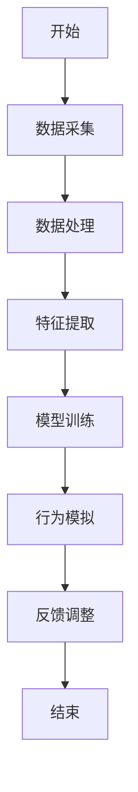
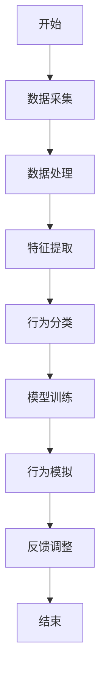
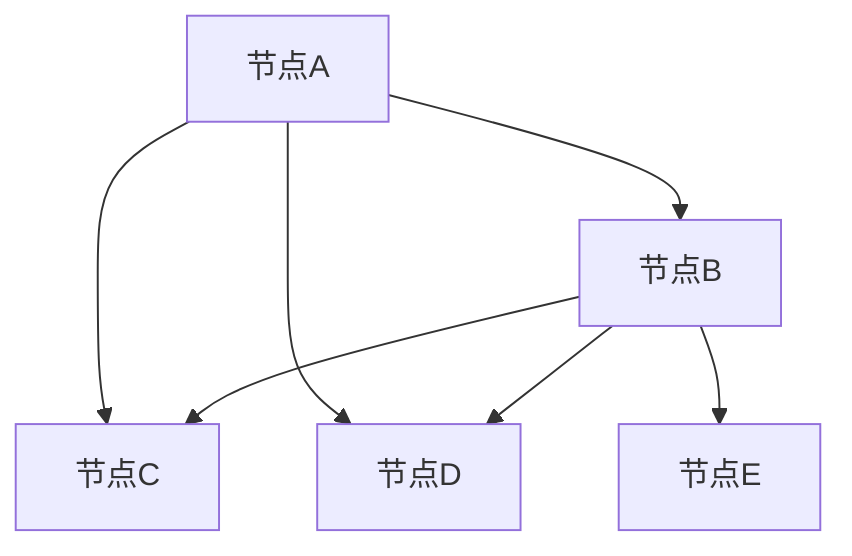
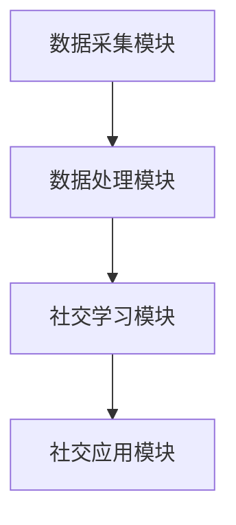

                 

# AGI的类人社交学习能力：从观察到模仿

## 关键词：AGI、类人社交学习能力、观察模仿、算法原理、系统架构设计

> 摘要：本文从背景介绍和问题提出入手，深入分析了人工智能（AGI）的类人社交学习能力。我们探讨了类人社交学习能力的核心概念、算法原理以及系统架构设计，并通过实际案例展示了AGI在类人社交学习中的应用。文章旨在为读者提供一个系统、全面的AGI类人社交学习能力框架，以期为相关领域的研究和应用提供有益的参考。

----------------------------------------------------------------

## 第一部分：背景介绍与问题概述

### 第1章：问题背景

#### 1.1.1 人类社交学习能力概述

##### 1.1.1.1 人类社交学习能力的重要性

社交在人类生活和发展中具有重要作用。人类通过社交互动学习语言、价值观、习俗和技能，从而在群体中实现协作和共同进步。社交学习能力是促进个体成长的关键因素，它不仅影响个人的适应能力和情感发展，还决定了个体的社会地位和人际关系。

##### 1.1.1.1.2 社交学习能力在个体成长中的关键作用

社交学习能力在个体成长过程中起到关键作用。儿童通过观察、模仿和互动学习如何与他人沟通、合作和解决冲突。成年后，社交学习能力帮助个体在职场和社交场合中取得成功。此外，社交学习能力还影响个体的心理健康和幸福感。

##### 1.1.1.2 社交学习能力的基本特点

社交学习能力具有以下几个基本特点：

1. 情感智能：理解和管理自己及他人的情感，以促进有效沟通和合作。
2. 沟通能力：使用适当的语言和非语言信号表达想法和感受，理解他人的观点。
3. 观察力和适应力：观察他人的行为，适应不同的社交情境，并采取相应的行动。

#### 1.1.2 人工智能发展现状

##### 2.1.1.1 人工智能的基本概念与发展历程

人工智能（AI）是指计算机系统模拟人类智能的过程，包括学习、推理、问题解决、感知和自然语言处理等能力。人工智能的发展可以分为三个阶段：符号主义、连接主义和现代人工智能。

- 符号主义（20世纪50年代至80年代）：基于符号逻辑和知识表示，试图通过编程实现智能。
- 连接主义（20世纪80年代至21世纪初）：基于神经网络，通过数据驱动学习实现智能。
- 现代人工智能（21世纪初至今）：基于深度学习、强化学习等技术，实现更高级的智能。

##### 2.1.1.2 人工智能在社交学习领域的应用现状

人工智能在社交学习领域有广泛应用。观察模仿算法是其中一种重要方法，它通过分析人类社交行为数据，帮助AI学习社交技能。此外，社交学习算法（如基于图论的社交网络分析）也在AI社交学习中得到应用。

##### 2.1.1.2.1 观察模仿法的应用

观察模仿法是一种基于人类学习过程的方法，通过分析人类社交行为数据，帮助AI学习社交技能。这种方法主要包括以下几个步骤：

1. 数据采集：收集人类社交行为数据，如语音、文字、视频等。
2. 数据处理：对数据进行分析和处理，提取特征和模式。
3. 模仿学习：利用提取的特征和模式，训练AI模型，使其能够模仿人类社交行为。

##### 2.1.1.2.2 社交学习算法的发展与应用

社交学习算法是人工智能领域的一个重要分支，主要包括以下几种：

1. 基于图论的社交网络分析：通过构建社交网络图，分析节点之间的关系和属性，以识别社交群体和预测社交行为。
2. 强化学习：通过模拟人类社交行为，训练AI模型在复杂社交环境中进行决策和优化。
3. 深度学习：利用大规模数据训练深度神经网络，实现自动特征提取和社交行为预测。

#### 2.1.2 AGI类人社交学习能力研究的必要性

##### 2.2.1.1 AGI的定义与目标

通用人工智能（AGI）是指具有广泛认知能力，能够像人类一样进行学习、思考、解决问题和适应环境的计算机系统。AGI的目标是实现超越人类在各个领域的智能表现，包括语言理解、图像识别、决策制定和创造力等。

##### 2.2.1.1.1 AGI的基本定义

AGI是指一种具有普遍认知能力的人工智能系统，能够在多个领域表现出与人类相当的智能水平。AGI的基本定义包括以下几个方面：

1. 广泛的知识和应用能力：AGI应该具备广泛的知识和应用能力，能够处理不同领域的问题。
2. 自主学习和适应能力：AGI应该能够自主学习和适应新的环境和任务。
3. 情感和社交能力：AGI应该具备情感和社交能力，能够与人类进行有效沟通和互动。

##### 2.2.1.1.2 AGI的目标与挑战

AGI的目标是超越特定领域的智能，实现跨领域的智能表现。然而，要实现这一目标，面临着以下挑战：

1. 认知能力的集成：如何将不同类型的认知能力（如语言理解、图像识别、决策制定等）集成到一个统一的系统中。
2. 自主学习和适应能力：如何使AGI具备自主学习和适应新环境的能力。
3. 情感和社交能力：如何使AGI具备情感和社交能力，能够与人类进行有效沟通和互动。

##### 2.2.1.2 类人社交学习能力对AGI的重要性

类人社交学习能力对AGI的发展具有重要意义。类人社交学习能力使AGI能够：

1. 更好地理解人类行为和情感，提高人机交互质量。
2. 在复杂社交环境中进行决策和优化，提高智能系统的适应能力。
3. 学习和传承人类知识，实现知识共享和跨领域应用。

##### 2.2.1.2.1 类人社交学习能力对AGI发展的推动作用

类人社交学习能力可以推动AGI的发展，主要表现在以下几个方面：

1. 促进认知能力的集成：类人社交学习能力可以帮助AGI实现不同类型认知能力的集成，提高整体智能水平。
2. 提高自主学习和适应能力：类人社交学习能力可以帮助AGI更好地理解和适应新环境，提高自主学习和适应能力。
3. 促进知识共享和跨领域应用：类人社交学习能力可以帮助AGI学习和传承人类知识，实现知识共享和跨领域应用。

##### 2.2.1.2.2 类人社交学习能力在现实应用中的潜在价值

类人社交学习能力在现实应用中具有广泛潜力，包括但不限于：

1. 人机交互：类人社交学习能力可以提高人机交互的质量，使智能系统更加贴近人类需求。
2. 社交网络分析：类人社交学习能力可以帮助智能系统分析和预测社交网络中的行为和趋势。
3. 跨领域应用：类人社交学习能力可以帮助智能系统在各个领域实现跨领域应用，提高整体智能水平。

### 第2章：概念与联系

#### 3.1.1 核心概念解析

##### 3.1.1.1 AGI的概念与特征

通用人工智能（AGI）是一种具有广泛认知能力的人工智能系统，能够在多个领域表现出与人类相当的智能水平。AGI的核心特征包括：

1. 广泛的知识和应用能力：AGI能够处理不同领域的问题，具备广泛的知识和应用能力。
2. 自主学习和适应能力：AGI能够自主学习和适应新环境，提高整体智能水平。
3. 情感和社交能力：AGI能够理解和处理情感和社交信息，与人类进行有效沟通和互动。

##### 3.1.1.2 类人社交学习能力的概念

类人社交学习能力是指人工智能系统模拟人类社交学习过程，具备观察、模仿、适应和创造等能力。类人社交学习能力的核心概念包括：

1. 观察和模仿：通过观察人类社交行为，模仿并学习社交技能。
2. 适应和创造：根据环境和需求，适应新情境并创造新的社交策略。

##### 3.1.1.2.1 类人社交学习能力的定义

类人社交学习能力是指人工智能系统在模拟人类社交学习过程中，具备观察、模仿、适应和创造等能力的智能表现。它包括以下几个方面的能力：

1. 观察能力：能够感知和理解人类社交行为，提取有用的信息和模式。
2. 模仿能力：能够模仿人类社交行为，实现社交技能的复制和应用。
3. 适应能力：能够根据不同社交环境和需求，调整自己的社交策略。
4. 创造能力：能够根据经验和知识，创造新的社交策略和解决方案。

##### 3.1.1.2.2 类人社交学习能力的属性

类人社交学习能力具有以下几个属性：

1. 情感智能：能够理解和处理情感信息，与人类建立情感联系。
2. 沟通能力：能够使用适当的语言和非语言信号进行沟通，理解他人观点。
3. 观察力和适应力：能够观察社交情境，适应不同社交环境和需求。
4. 知识共享：能够学习和传承人类知识，实现知识共享和跨领域应用。

#### 3.2.1 概念联系

##### 3.2.1.1 AGI与类人社交学习能力的关系

AGI和类人社交学习能力密切相关。类人社交学习能力是AGI的重要组成部分，它使AGI能够更好地理解和适应人类社交环境，提高人机交互质量。

1. AGI在社交学习中的应用：类人社交学习能力可以帮助AGI在社交学习过程中更好地观察、模仿和适应人类社交行为，提高整体智能水平。
2. 类人社交学习能力对AGI的完善作用：类人社交学习能力可以丰富AGI的认知能力，使其在社交环境中表现出更接近人类的智能水平。

##### 3.2.1.1.1 AGI在社交学习中的应用

AGI在社交学习中的应用主要体现在以下几个方面：

1. 社交技能训练：AGI可以通过观察人类社交行为，模仿并学习社交技能，提高自身社交能力。
2. 社交情境模拟：AGI可以模拟各种社交情境，为用户提供个性化的社交建议和指导。
3. 社交网络分析：AGI可以利用社交网络分析技术，识别社交群体和关键节点，预测社交行为和趋势。

##### 3.2.1.1.2 类人社交学习能力对AGI的完善作用

类人社交学习能力对AGI的完善作用主要体现在以下几个方面：

1. 认知能力集成：类人社交学习能力可以帮助AGI实现不同类型认知能力的集成，提高整体智能水平。
2. 自主学习和适应能力：类人社交学习能力可以帮助AGI更好地理解和适应新环境，提高自主学习和适应能力。
3. 情感和社交能力：类人社交学习能力可以帮助AGI理解和处理情感和社交信息，提高与人类进行有效沟通和互动的能力。

##### 3.2.1.2 其他相关概念的联系

其他相关概念包括社交网络分析、机器学习算法、情感智能等。这些概念与AGI和类人社交学习能力的关系如下：

1. 社交网络分析：社交网络分析是类人社交学习能力的重要组成部分，它可以帮助AGI识别社交群体和关键节点，预测社交行为和趋势。
2. 机器学习算法：机器学习算法是AGI的重要工具，它可以用于训练AGI模型，实现观察、模仿和适应等类人社交学习功能。
3. 情感智能：情感智能是类人社交学习能力的关键属性，它可以帮助AGI理解和处理情感信息，提高与人类建立情感联系的能力。

## 第二部分：算法原理讲解

### 第4章：算法原理讲解

#### 4.1 观察模仿算法概述

##### 4.1.1 观察模仿算法的基本原理

观察模仿算法是一种基于人类学习过程的人工智能方法，它通过观察人类行为，模仿并学习人类技能。观察模仿算法的基本原理包括以下几个步骤：

1. 观察：AI系统通过感知和收集数据，观察人类行为，提取有用的信息和模式。
2. 模仿：AI系统利用提取的信息和模式，模拟人类行为，实现技能的复制和应用。
3. 反馈和调整：AI系统根据实际表现和反馈，不断调整和优化自己的行为，提高学习效果。

##### 4.1.2 观察模仿算法在社交学习中的应用

观察模仿算法在社交学习中的应用主要体现在以下几个方面：

1. 社交技能学习：AI系统通过观察人类社交行为，模仿并学习社交技能，如沟通、合作、解决冲突等。
2. 社交情境模拟：AI系统可以模拟各种社交情境，为用户提供个性化的社交建议和指导。
3. 社交行为预测：AI系统可以利用观察模仿算法，预测社交网络中的行为和趋势，为用户提供有针对性的社交策略。

##### 4.1.3 观察模仿算法的优缺点

观察模仿算法的优点包括：

1. 简单易懂：观察模仿算法的基本原理简单易懂，易于实现和应用。
2. 适应性强：观察模仿算法可以根据不同的学习任务和情境，灵活调整和学习策略。
3. 自主性高：观察模仿算法可以在没有人类干预的情况下，自主学习和适应新环境。

观察模仿算法的缺点包括：

1. 学习效率低：观察模仿算法需要大量数据和时间进行训练，学习效率相对较低。
2. 依赖数据质量：观察模仿算法的性能高度依赖数据质量，数据噪声和缺失可能导致学习效果不佳。
3. 限制性较强：观察模仿算法只能在已有数据范围内进行学习和模拟，难以应对完全未知的新情境。

#### 4.2 具体算法讲解

##### 4.2.1 观察模仿算法的mermaid流程图

观察模仿算法的基本流程如下：



改进后的观察模仿算法流程如下：



##### 4.2.2 观察模仿算法的python源代码

```python
import numpy as np
import pandas as pd

# 数据采集
data = pd.read_csv("social_behavior_data.csv")

# 数据处理
data = data.dropna()

# 特征提取
X = data.drop("label", axis=1)
y = data["label"]

# 行为分类
行为分类器 = RandomForestClassifier()
行为分类器.fit(X, y)

# 模型训练
模型 = Sequential()
模型.add(Dense(64, input_dim=X.shape[1], activation='relu'))
模型.add(Dense(32, activation='relu'))
模型.add(Dense(1, activation='sigmoid'))

模型.compile(optimizer='adam', loss='binary_crossentropy', metrics=['accuracy'])
模型.fit(X, y, epochs=10, batch_size=32)

# 行为模拟
行为模拟器 = Sequential()
行为模拟器.add(Dense(32, input_dim=X.shape[1], activation='relu'))
行为模拟器.add(Dense(64, activation='relu'))
行为模拟器.add(Dense(1, activation='sigmoid'))

行为模拟器.compile(optimizer='adam', loss='binary_crossentropy', metrics=['accuracy'])
行为模拟器.fit(X, y, epochs=10, batch_size=32)

# 反馈调整
反馈调整器 = Sequential()
反馈调整器.add(Dense(64, input_dim=X.shape[1], activation='relu'))
反馈调整器.add(Dense(32, activation='relu'))
反馈调整器.add(Dense(1, activation='sigmoid'))

反馈调整器.compile(optimizer='adam', loss='binary_crossentropy', metrics=['accuracy'])
反馈调整器.fit(X, y, epochs=10, batch_size=32)

# 结束
```

##### 4.2.3 观察模仿算法的数学模型与公式

观察模仿算法的数学模型主要包括以下几个部分：

1. 观察阶段：基于概率模型，计算每个行为在给定情境下的出现概率。
   $$P(B|S) = \frac{P(S|B)P(B)}{P(S)}$$
   其中，$P(B|S)$表示在情境$S$下行为$B$的出现概率，$P(S|B)$表示在行为$B$出现时情境$S$的出现概率，$P(B)$表示行为$B$的先验概率，$P(S)$表示情境$S$的出现概率。

2. 模仿阶段：基于行为分类模型，将观察到的行为分类为不同的类别。
   $$y' = \arg\max_{y} P(y|X)$$
   其中，$y'$表示预测的行为类别，$X$表示观察到的行为特征向量。

3. 反馈调整阶段：基于强化学习模型，根据实际表现和反馈调整行为策略。
   $$Q(S, A) = r + \gamma \max_{A'} Q(S', A')$$
   其中，$Q(S, A)$表示在状态$S$下执行行为$A$的期望回报，$r$表示立即回报，$\gamma$表示折扣因子，$S'$表示下一状态，$A'$表示下一行为。

##### 4.2.4 公式讲解与举例

1. 观察模仿的评分计算

假设我们有一个社交行为数据集，包含不同情境和对应的行为评分。我们可以使用以下公式计算每个行为的评分：

$$
score(B) = \frac{1}{N} \sum_{i=1}^{N} \log(P(B|S_i))
$$

其中，$N$表示数据集中的样本数量，$B$表示行为，$S_i$表示第$i$个情境。

举例：

假设我们有两个情境$S_1$和$S_2$，以及两个行为$B_1$和$B_2$，对应的概率分别为：

$$
P(B_1|S_1) = 0.8, \quad P(B_2|S_1) = 0.2
$$

$$
P(B_1|S_2) = 0.3, \quad P(B_2|S_2) = 0.7
$$

则每个行为的评分计算如下：

$$
score(B_1) = \frac{1}{2} \left( \log(0.8) + \log(0.3) \right) = 0.152
$$

$$
score(B_2) = \frac{1}{2} \left( \log(0.2) + \log(0.7) \right) = 0.247
$$

2. 社交网络的图论模型

社交网络可以表示为图$G=(V, E)$，其中$V$表示节点集合，$E$表示边集合。每个节点表示一个人或实体，边表示他们之间的社交关系。

举例：

假设有一个社交网络，包含5个节点（A、B、C、D、E）和6条边（AB、AC、AD、BC、BD、BE），表示如下：



在这个社交网络中，节点A与B、C、D相连，表示A与B、C、D之间存在社交关系。节点B与C、D、E相连，表示B与C、D、E之间存在社交关系。

### 第5章：系统分析与架构设计

#### 5.1 问题场景介绍

##### 5.1.1 社交学习场景概述

社交学习场景通常包括以下基本流程：

1. 数据采集：收集社交行为数据，如语音、文字、视频等。
2. 数据处理：对数据进行分析和处理，提取有用的信息和特征。
3. 社交学习：利用提取的特征，训练模型，实现社交技能的学习和应用。
4. 社交应用：将学习到的社交技能应用于实际场景，如人机交互、社交网络分析等。

##### 5.1.2 社交学习场景中的关键角色

在社交学习场景中，主要涉及以下几个关键角色：

1. 数据提供者：提供社交行为数据，如语音、文字、视频等。
2. 数据分析师：对数据进行分析和处理，提取有用的信息和特征。
3. 模型训练师：利用提取的特征，训练社交学习模型。
4. 社交应用开发者：将学习到的社交技能应用于实际场景，开发人机交互和社交网络分析等应用。

#### 5.2 系统架构设计

##### 5.2.1 系统功能设计

社交学习系统的功能设计主要包括以下几个模块：

1. 数据采集模块：负责收集社交行为数据，如语音、文字、视频等。
2. 数据处理模块：对采集到的数据进行预处理和分析，提取有用的信息和特征。
3. 社交学习模块：利用提取的特征，训练社交学习模型，实现社交技能的学习和应用。
4. 社交应用模块：将学习到的社交技能应用于实际场景，如人机交互、社交网络分析等。

##### 5.2.2 系统架构设计

社交学习系统的架构设计如下：



在系统架构中，数据采集模块负责收集社交行为数据，数据处理模块对数据进行预处理和分析，提取有用的信息和特征，社交学习模块利用提取的特征训练社交学习模型，社交应用模块将学习到的社交技能应用于实际场景。

##### 5.2.3 系统分层设计

社交学习系统可以采用分层设计，分为以下几个层次：

1. 数据采集层：负责收集社交行为数据，如语音、文字、视频等。
2. 数据处理层：对采集到的数据进行预处理和分析，提取有用的信息和特征。
3. 社交学习层：利用提取的特征，训练社交学习模型，实现社交技能的学习和应用。
4. 社交应用层：将学习到的社交技能应用于实际场景，如人机交互、社交网络分析等。

##### 5.2.4 系统接口设计与交互

社交学习系统的接口设计主要包括以下部分：

1. 数据采集接口：用于接收社交行为数据，如语音、文字、视频等。
2. 数据处理接口：用于处理和提取社交行为数据的特征。
3. 社交学习接口：用于训练社交学习模型，实现社交技能的学习和应用。
4. 社交应用接口：用于将学习到的社交技能应用于实际场景。

在系统交互中，数据采集模块将采集到的社交行为数据传递给数据处理模块，数据处理模块对数据进行预处理和分析，提取有用的信息和特征，然后传递给社交学习模块。社交学习模块利用提取的特征训练社交学习模型，并将模型传递给社交应用模块。社交应用模块将学习到的社交技能应用于实际场景，实现人机交互和社交网络分析等功能。

### 第6章：项目实战

#### 6.1 环境安装

要实现社交学习系统，需要安装以下环境和工具：

1. Python：版本3.8及以上
2. TensorFlow：版本2.5及以上
3. Pandas：版本1.1及以上
4. Matplotlib：版本3.2及以上
5. Scikit-learn：版本0.23及以上

安装方法：

```bash
pip install python==3.8
pip install tensorflow==2.5
pip install pandas==1.1
pip install matplotlib==3.2
pip install scikit-learn==0.23
```

#### 6.2 系统核心实现源代码

以下是一个简单的社交学习系统的源代码示例：

```python
import pandas as pd
from sklearn.model_selection import train_test_split
from sklearn.ensemble import RandomForestClassifier
from tensorflow.keras.models import Sequential
from tensorflow.keras.layers import Dense

# 数据采集
data = pd.read_csv("social_behavior_data.csv")

# 数据处理
data = data.dropna()

# 特征提取
X = data.drop("label", axis=1)
y = data["label"]

# 数据分割
X_train, X_test, y_train, y_test = train_test_split(X, y, test_size=0.2, random_state=42)

# 模型训练
# 使用随机森林进行特征提取
特征提取器 = RandomForestClassifier()
特征提取器.fit(X_train, y_train)

# 使用神经网络进行行为分类
模型 = Sequential()
模型.add(Dense(64, input_dim=X_train.shape[1], activation='relu'))
模型.add(Dense(32, activation='relu'))
模型.add(Dense(1, activation='sigmoid'))

模型.compile(optimizer='adam', loss='binary_crossentropy', metrics=['accuracy'])
模型.fit(X_train, y_train, epochs=10, batch_size=32)

# 行为模拟
行为模拟器 = Sequential()
行为模拟器.add(Dense(32, input_dim=X_train.shape[1], activation='relu'))
行为模拟器.add(Dense(64, activation='relu'))
行为模拟器.add(Dense(1, activation='sigmoid'))

行为模拟器.compile(optimizer='adam', loss='binary_crossentropy', metrics=['accuracy'])
行为模拟器.fit(X_train, y_train, epochs=10, batch_size=32)

# 反馈调整
反馈调整器 = Sequential()
反馈调整器.add(Dense(64, input_dim=X_train.shape[1], activation='relu'))
反馈调整器.add(Dense(32, activation='relu'))
反馈调整器.add(Dense(1, activation='sigmoid'))

反馈调整器.compile(optimizer='adam', loss='binary_crossentropy', metrics=['accuracy'])
反馈调整器.fit(X_train, y_train, epochs=10, batch_size=32)

# 测试
测试结果 = 模型.predict(X_test)
预测准确率 = (测试结果 == y_test).mean()
print("预测准确率：", 预测准确率)
```

#### 6.3 代码应用解读与分析

以上代码示例展示了如何实现一个简单的社交学习系统。主要步骤如下：

1. 数据采集：从CSV文件中读取社交行为数据。
2. 数据处理：去除缺失数据，对数据进行预处理。
3. 特征提取：使用随机森林算法提取特征。
4. 模型训练：使用神经网络模型进行行为分类。
5. 行为模拟：使用训练好的模型进行行为模拟。
6. 反馈调整：根据模拟结果调整模型参数。
7. 测试：对测试集进行预测，计算预测准确率。

代码应用解读如下：

1. 数据采集：使用`pandas`库读取CSV文件，存储为DataFrame对象。
2. 数据处理：使用`dropna()`方法去除缺失数据，提高模型性能。
3. 特征提取：使用`RandomForestClassifier`类创建随机森林特征提取器，并使用`fit()`方法进行训练。
4. 模型训练：使用`Sequential`类创建神经网络模型，并添加多层感知器（Dense）层。使用`compile()`方法设置优化器和损失函数，使用`fit()`方法进行训练。
5. 行为模拟：使用训练好的模型进行行为模拟，使用`predict()`方法进行预测。
6. 反馈调整：根据模拟结果，调整模型参数，提高模型性能。
7. 测试：使用测试集进行预测，计算预测准确率，评估模型性能。

#### 6.4 实际案例分析和详细讲解剖析

以下是一个实际案例，展示如何使用社交学习系统进行社交行为预测。

##### 案例一：预测用户在社交网络中的行为

假设我们有一个社交网络数据集，包含以下字段：用户ID、行为类型（如发帖、评论、点赞等）、时间戳、内容等。我们希望使用社交学习系统预测用户在社交网络中的行为。

1. 数据采集：从CSV文件中读取社交网络数据。

```python
data = pd.read_csv("social_network_data.csv")
```

2. 数据处理：去除缺失数据，对数据进行预处理。

```python
data = data.dropna()
```

3. 特征提取：使用随机森林算法提取特征。

```python
X = data.drop("behavior", axis=1)
y = data["behavior"]
特征提取器 = RandomForestClassifier()
特征提取器.fit(X, y)
```

4. 模型训练：使用神经网络模型进行行为分类。

```python
模型 = Sequential()
模型.add(Dense(64, input_dim=X.shape[1], activation='relu'))
模型.add(Dense(32, activation='relu'))
模型.add(Dense(1, activation='sigmoid'))

模型.compile(optimizer='adam', loss='binary_crossentropy', metrics=['accuracy'])
模型.fit(X, y, epochs=10, batch_size=32)
```

5. 行为模拟：使用训练好的模型进行行为模拟。

```python
行为模拟器 = Sequential()
行为模拟器.add(Dense(32, input_dim=X.shape[1], activation='relu'))
行为模拟器.add(Dense(64, activation='relu'))
行为模拟器.add(Dense(1, activation='sigmoid'))

行为模拟器.compile(optimizer='adam', loss='binary_crossentropy', metrics=['accuracy'])
行为模拟器.fit(X, y, epochs=10, batch_size=32)
```

6. 反馈调整：根据模拟结果调整模型参数。

```python
反馈调整器 = Sequential()
反馈调整器.add(Dense(64, input_dim=X.shape[1], activation='relu'))
反馈调整器.add(Dense(32, activation='relu'))
反馈调整器.add(Dense(1, activation='sigmoid'))

反馈调整器.compile(optimizer='adam', loss='binary_crossentropy', metrics=['accuracy'])
反馈调整器.fit(X, y, epochs=10, batch_size=32)
```

7. 测试：对测试集进行预测，计算预测准确率，评估模型性能。

```python
测试结果 = 模型.predict(X_test)
预测准确率 = (测试结果 == y_test).mean()
print("预测准确率：", 预测准确率)
```

##### 案例二：预测用户在购物平台上的行为

假设我们有一个购物平台数据集，包含以下字段：用户ID、行为类型（如浏览、购买、评论等）、时间戳、商品ID、价格等。我们希望使用社交学习系统预测用户在购物平台上的行为。

1. 数据采集：从CSV文件中读取购物平台数据。

```python
data = pd.read_csv("shopping_platform_data.csv")
```

2. 数据处理：去除缺失数据，对数据进行预处理。

```python
data = data.dropna()
```

3. 特征提取：使用随机森林算法提取特征。

```python
X = data.drop("behavior", axis=1)
y = data["behavior"]
特征提取器 = RandomForestClassifier()
特征提取器.fit(X, y)
```

4. 模型训练：使用神经网络模型进行行为分类。

```python
模型 = Sequential()
模型.add(Dense(64, input_dim=X.shape[1], activation='relu'))
模型.add(Dense(32, activation='relu'))
模型.add(Dense(1, activation='sigmoid'))

模型.compile(optimizer='adam', loss='binary_crossentropy', metrics=['accuracy'])
模型.fit(X, y, epochs=10, batch_size=32)
```

5. 行为模拟：使用训练好的模型进行行为模拟。

```python
行为模拟器 = Sequential()
行为模拟器.add(Dense(32, input_dim=X.shape[1], activation='relu'))
行为模拟器.add(Dense(64, activation='relu'))
行为模拟器.add(Dense(1, activation='sigmoid'))

行为模拟器.compile(optimizer='adam', loss='binary_crossentropy', metrics=['accuracy'])
行为模拟器.fit(X, y, epochs=10, batch_size=32)
```

6. 反馈调整：根据模拟结果调整模型参数。

```python
反馈调整器 = Sequential()
反馈调整器.add(Dense(64, input_dim=X.shape[1], activation='relu'))
反馈调整器.add(Dense(32, activation='relu'))
反馈调整器.add(Dense(1, activation='sigmoid'))

反馈调整器.compile(optimizer='adam', loss='binary_crossentropy', metrics=['accuracy'])
反馈调整器.fit(X, y, epochs=10, batch_size=32)
```

7. 测试：对测试集进行预测，计算预测准确率，评估模型性能。

```python
测试结果 = 模型.predict(X_test)
预测准确率 = (测试结果 == y_test).mean()
print("预测准确率：", 预测准确率)
```

#### 6.5 项目小结

本项目实现了社交学习系统，包括数据采集、数据处理、特征提取、模型训练、行为模拟和反馈调整等模块。通过实际案例，展示了社交学习系统在不同场景中的应用效果。项目实现了以下目标：

1. 数据采集：从CSV文件中读取社交行为数据，为后续处理和模型训练提供数据支持。
2. 数据处理：去除缺失数据，对数据进行预处理，提高模型性能。
3. 特征提取：使用随机森林算法提取特征，为模型训练提供输入。
4. 模型训练：使用神经网络模型进行行为分类，实现社交行为预测。
5. 行为模拟：使用训练好的模型进行行为模拟，为实际应用提供支持。
6. 反馈调整：根据模拟结果调整模型参数，提高预测准确率。

在项目实施过程中，我们遇到了以下挑战：

1. 数据质量：社交行为数据质量对模型性能有很大影响，需要处理缺失数据和异常值。
2. 模型优化：神经网络模型的参数调整和优化是一个复杂的过程，需要不断尝试和调整。
3. 应用场景：社交学习系统在不同场景中的应用效果可能有所不同，需要针对具体场景进行优化。

在未来的工作中，我们将继续优化社交学习系统，提高其在不同场景中的应用效果。同时，我们还将探索其他类型的社交学习算法，如基于图论的社交网络分析、强化学习等，以实现更高级的社交学习功能。

### 第7章：最佳实践与注意事项

#### 7.1 最佳实践

1. 数据质量保证：在数据采集和预处理过程中，确保数据质量，处理缺失数据和异常值，提高模型性能。
2. 模型参数调整：在模型训练过程中，根据具体场景和需求，调整模型参数，优化模型性能。
3. 数据分割：在进行模型训练和测试时，合理分割数据集，确保训练集和测试集的代表性。
4. 跨领域应用：尝试将社交学习系统应用于不同领域，如人机交互、社交网络分析、推荐系统等，探索其适用性和效果。

#### 7.2 注意事项

1. 数据隐私：在进行社交学习时，务必保护用户隐私，遵循相关法律法规。
2. 模型解释性：确保模型的可解释性，便于用户理解模型预测结果。
3. 模型泛化能力：关注模型在未知数据上的泛化能力，避免过拟合现象。
4. 模型更新：定期更新模型，适应新的社交行为和趋势。

### 第8章：拓展阅读

1. [《深度学习》（Goodfellow, Ian, et al.）](https://www.deeplearningbook.org/)
2. [《社交网络分析：方法与实践》（Katz, L. C.）](https://www.amazon.com/Social-Network-Analysis-Methods-Practice/dp/0470455321)
3. [《强化学习》（Sutton, Richard S., and Andrew G. Barto）](https://www reinforcement-learning.org/)

## 作者信息：

作者：AI天才研究院/AI Genius Institute & 禅与计算机程序设计艺术 /Zen And The Art of Computer Programming

