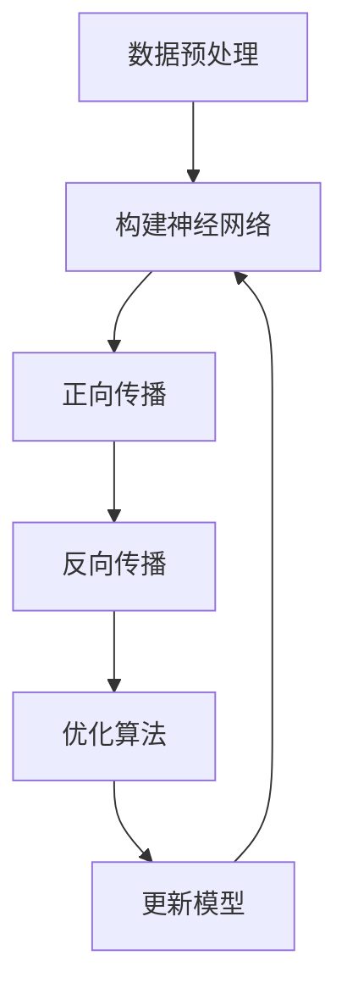
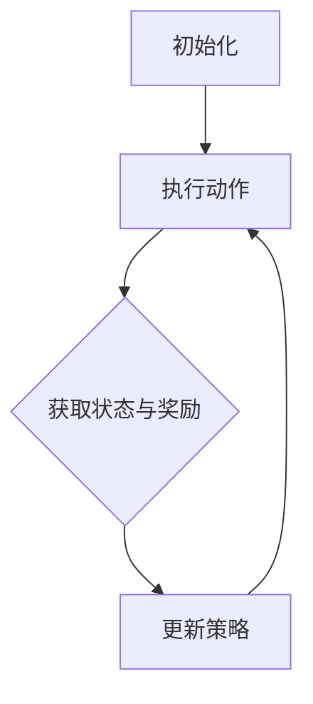
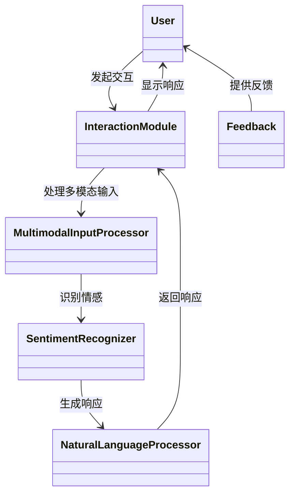
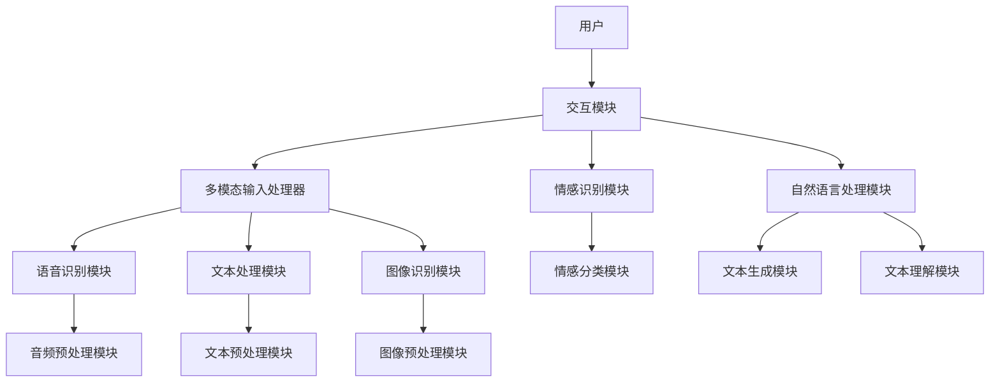
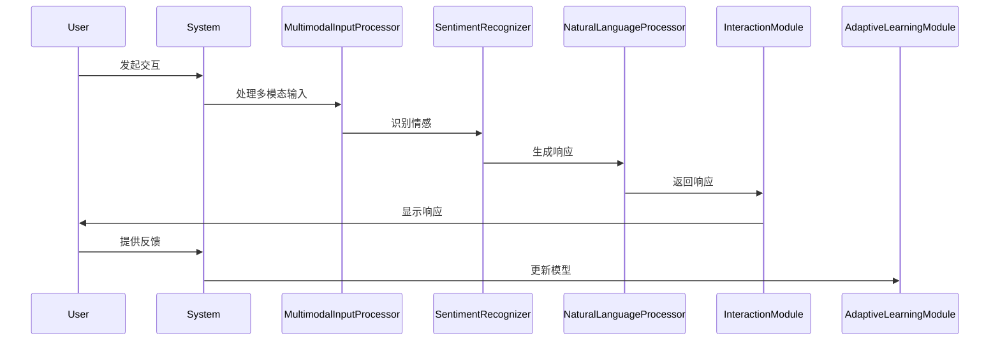
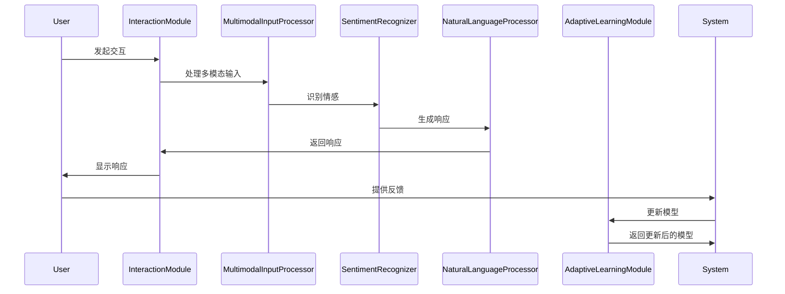

                 

# AGI的类人社交能力构建

关键词：通用人工智能、类人社交能力、自然语言处理、情感识别、多模态交互

摘要：本文将深入探讨通用人工智能（AGI）的类人社交能力构建，从核心概念、算法原理、数学模型到系统架构和项目实战，全面解析AGI在社交领域的前沿技术。通过逐步分析推理，我们旨在为读者提供清晰易懂的技术指导，助力理解和应用AGI类人社交能力。

## 第一部分: 背景介绍

### 1.1 问题背景

人工智能（AI）技术的发展已经进入了一个新的阶段，即通用人工智能（AGI）。AGI是一种能够像人类一样具备广泛认知能力的人工智能系统，它不仅能够在特定领域内表现出色，还能够跨领域应用，甚至具备一定的类人社交能力。随着深度学习和神经网络技术的迅猛发展，AGI逐渐从理论走向实际应用，成为社会各界关注的焦点。

在类人社交能力方面，AGI需要具备理解、表达、推理、交互等多方面的能力，这对于构建一个具有高度智能化的社交系统具有重要意义。然而，当前的AI系统在社交能力上仍然存在诸多不足，如对复杂情感的理解、自然语言的处理、多模态交互等方面都有待提高。

### 1.2 问题描述

本书旨在探讨如何构建AGI的类人社交能力，解决以下几个关键问题：

1. **核心概念与联系**：明确AGI类人社交能力所涉及的核心概念，如自然语言处理、情感识别、多模态交互等，并阐述它们之间的联系。
2. **算法原理讲解**：深入分析类人社交能力构建中的关键算法，如深度学习、强化学习等，并使用mermaid流程图和Python代码进行详细讲解。
3. **数学模型与公式**：阐述AGI类人社交能力构建中的数学模型，如神经网络模型、动态系统模型等，并使用LaTeX格式进行表达。
4. **系统分析与架构设计方案**：介绍AGI类人社交能力构建的系统架构，包括领域模型、系统架构、接口设计等，并使用mermaid类图、架构图和序列图进行展示。
5. **项目实战**：通过实际案例，展示如何将AGI类人社交能力应用于具体项目，并进行详细讲解和分析。

### 1.3 问题解决

为了解决上述问题，本书将从以下几个方面展开：

1. **理论讲解**：系统介绍AGI类人社交能力构建的理论基础，包括核心概念、算法原理、数学模型等。
2. **案例分析**：通过实际案例，展示AGI类人社交能力在不同应用场景中的实现和应用。
3. **实战操作**：提供详细的代码实现和项目实战步骤，帮助读者掌握AGI类人社交能力的构建方法。
4. **最佳实践**：总结AGI类人社交能力构建的最佳实践，为读者提供参考和指导。

### 1.4 边界与外延

AGI类人社交能力构建是一个复杂的系统工程，涉及到多个学科和技术的交叉融合。本书的边界主要在于AGI类人社交能力的核心概念、算法原理、系统架构和项目实战等方面。外延则包括AGI技术的发展趋势、类人社交能力的拓展应用等。

### 1.5 概念结构与核心要素组成

AGI类人社交能力构建的核心要素包括：

1. **自然语言处理**：理解和生成自然语言，是实现类人社交能力的基础。
2. **情感识别**：通过语音、文本等多种方式识别用户情感，实现情感互动。
3. **多模态交互**：结合语音、文本、图像等多种模态，实现更自然的交互体验。
4. **深度学习与强化学习**：利用机器学习算法，不断提高社交能力的准确性和适应性。
5. **系统架构与接口设计**：构建稳定、高效、可扩展的系统架构，实现各类社交功能。

以上核心要素相互关联，共同构成了AGI类人社交能力的体系结构。

### 1.6 本章小结

本章对AGI的类人社交能力构建进行了背景介绍，阐述了问题背景、问题描述、问题解决、边界与外延以及核心概念结构与核心要素组成。为后续章节的深入探讨奠定了基础。在下一章中，我们将进一步分析AGI类人社交能力所涉及的核心概念和原理。

## 第二章: 核心概念与联系

### 2.1 自然语言处理

自然语言处理（NLP）是AGI类人社交能力构建的基础。NLP的主要目标是让计算机理解和生成自然语言，以实现人与机器的智能交互。

#### 2.1.1 自然语言处理的核心概念

- **语言模型**：用于预测文本序列的概率分布，是实现文本生成和理解的关键。
  - **概念**：语言模型是一个统计模型，它根据已知的文本数据预测新的文本序列。
  - **作用**：语言模型在NLP中广泛应用于文本分类、机器翻译、语音识别等领域。
- **词向量**：将单词映射到高维空间，便于计算和表示。
  - **概念**：词向量是一种将单词表示为实数向量的方法，它通过统计单词在文本中的共现关系来学习。
  - **作用**：词向量在NLP中用于词义相似性比较、文本分类、情感分析等任务。
- **句法分析**：解析句子的结构，理解句子成分和语法规则。
  - **概念**：句法分析是一种语言学方法，它通过分析句子的语法结构来理解句子的含义。
  - **作用**：句法分析在NLP中用于自动文摘、机器翻译、问答系统等任务。
- **语义理解**：从文本中提取信息，理解文本的含义和意图。
  - **概念**：语义理解是NLP中的高级任务，它试图理解文本的深层含义，而不仅仅是表面的语法结构。
  - **作用**：语义理解在NLP中用于问答系统、机器翻译、文本摘要等任务。

#### 2.1.2 自然语言处理的联系

- **情感识别**：利用NLP技术，从文本中提取情感信息，为情感识别提供基础。
  - **联系**：情感识别通常涉及文本分类任务，而文本分类任务依赖于语言模型和句法分析来理解文本内容。
- **问答系统**：结合NLP技术，实现人与机器的智能问答。
  - **联系**：问答系统通常需要NLP技术来处理用户输入，理解用户的意图，并生成合适的回答。

### 2.2 情感识别

情感识别是AGI类人社交能力的重要方面，旨在通过语音、文本等多种方式识别用户的情感，实现情感互动。

#### 2.2.1 情感识别的核心概念

- **情感分类**：将情感划分为不同的类别，如快乐、悲伤、愤怒等。
  - **概念**：情感分类是一种监督学习任务，它通过训练模型来识别文本或语音中的情感类别。
  - **作用**：情感分类在社交媒体分析、客户服务、心理健康等领域具有广泛应用。
- **情感强度**：量化情感的程度，如情感的强烈程度、持续时间等。
  - **概念**：情感强度是一个连续值，用于表示情感的强度或深度。
  - **作用**：情感强度在情感分析中用于区分情感的类型和程度。
- **情感理解**：从文本或语音中提取情感信息，理解用户的情感状态。
  - **概念**：情感理解是一种高级认知任务，它试图理解文本或语音中的情感表达。
  - **作用**：情感理解在个性化推荐、客户服务、教育等领域具有广泛应用。

#### 2.2.2 情感识别的算法原理

情感识别通常采用以下算法：

- **机器学习算法**：如支持向量机（SVM）、朴素贝叶斯（NB）、决策树（DT）等。
  - **原理**：这些算法通过学习已标注的数据集来构建模型，然后使用该模型对新数据进行情感分类。
- **深度学习算法**：如卷积神经网络（CNN）、循环神经网络（RNN）等。
  - **原理**：深度学习算法通过多层神经网络来学习数据的复杂模式，从而实现情感分类。

#### 2.2.3 情感识别的应用场景

情感识别在多个应用场景中具有重要价值：

- **社交媒体分析**：通过情感识别，可以分析用户在社交媒体上的情绪，为营销策略提供支持。
- **客户服务**：通过情感识别，可以识别客户的情绪，提供更加个性化的服务。
- **心理健康**：通过情感识别，可以监测用户的情绪变化，为心理健康提供支持。

### 2.3 多模态交互

多模态交互是AGI类人社交能力的另一个关键方面，它通过结合语音、文本、图像等多种模态，实现更自然的交互体验。

#### 2.3.1 多模态交互的核心概念

- **语音识别**：将语音转换为文本，实现语音输入。
  - **概念**：语音识别是一种将音频信号转换为文本的技术。
  - **作用**：语音识别在语音助手、智能客服等领域具有广泛应用。
- **图像识别**：通过图像识别技术，理解图像中的内容。
  - **概念**：图像识别是一种通过计算机算法从图像中提取信息的技术。
  - **作用**：图像识别在安防监控、医疗诊断、自动驾驶等领域具有广泛应用。
- **语音生成**：将文本转换为语音，实现语音输出。
  - **概念**：语音生成是一种将文本转换为自然语音的技术。
  - **作用**：语音生成在语音助手、教育、娱乐等领域具有广泛应用。

#### 2.3.2 多模态交互的应用场景

多模态交互在多个应用场景中具有重要价值：

- **智能客服**：通过多模态交互，可以提供更加自然和高效的客服体验。
- **教育**：通过多模态交互，可以实现更加生动和互动的教育场景。
- **娱乐**：通过多模态交互，可以创造更加丰富和沉浸的娱乐体验。

### 2.4 深度学习与强化学习

深度学习与强化学习是AGI类人社交能力构建中的关键技术，它们分别从不同角度提高社交能力的准确性和适应性。

#### 2.4.1 深度学习

- **概念**：深度学习是一种通过多层神经网络进行特征提取和分类的机器学习方法。
- **作用**：深度学习在图像识别、语音识别、自然语言处理等领域取得了显著的成果。
- **优势**：深度学习能够自动学习数据的复杂模式，提高模型的准确性和泛化能力。

#### 2.4.2 强化学习

- **概念**：强化学习是一种通过试错和奖励机制来学习决策策略的机器学习方法。
- **作用**：强化学习在游戏、推荐系统、自动驾驶等领域具有广泛应用。
- **优势**：强化学习能够根据环境反馈调整策略，提高系统的适应性和灵活性。

### 2.5 系统架构与接口设计

AGI类人社交能力构建需要稳定的系统架构和良好的接口设计，以确保系统的稳定、高效和可扩展。

#### 2.5.1 系统架构

- **概念**：系统架构是指系统的整体结构和组件之间的关系。
- **设计原则**：系统架构应遵循模块化、可扩展性和高可用性原则。
- **实现方法**：系统架构可以通过类图、架构图等工具进行设计和展示。

#### 2.5.2 接口设计

- **概念**：接口设计是指系统内部组件之间的交互方式。
- **设计原则**：接口设计应遵循简洁性、一致性、可扩展性原则。
- **实现方法**：接口设计可以通过序列图、类图等工具进行设计和展示。

### 2.6 本章小结

本章对AGI类人社交能力构建中的核心概念进行了详细分析，包括自然语言处理、情感识别、多模态交互、深度学习和强化学习等。通过阐述这些核心概念的联系和应用场景，我们为后续章节的深入探讨奠定了基础。在下一章中，我们将进一步讲解AGI类人社交能力构建中的关键算法和数学模型。## 第三章: 算法原理讲解

### 3.1 深度学习算法

深度学习（Deep Learning）是AGI类人社交能力构建的核心技术之一。它通过多层神经网络进行特征提取和分类，从而实现对复杂数据的高效处理。本节将介绍深度学习的基本原理，并使用mermaid流程图和Python代码进行详细讲解。

#### 3.1.1 深度学习的基本原理

深度学习的基本原理可以概括为以下几个步骤：

1. **数据预处理**：包括数据清洗、归一化、缩放等，以提高模型的训练效果。
2. **构建神经网络**：设计并构建多层神经网络，包括输入层、隐藏层和输出层。
3. **正向传播**：输入数据经过神经网络各层的传递，得到输出结果。
4. **反向传播**：计算输出结果与实际结果之间的误差，并反向传播更新各层的权重。
5. **优化算法**：使用优化算法（如梯度下降）来调整模型参数，以最小化误差。

#### 3.1.2 使用mermaid流程图表示深度学习算法



#### 3.1.3 使用Python代码实现深度学习算法

```python
import numpy as np

# 数据预处理
def preprocess_data(data):
    # 数据清洗、归一化、缩放等
    return processed_data

# 构建神经网络
def build_network(layers, activation_function):
    # 输入层、隐藏层和输出层的权重初始化
    network = {}
    for i in range(len(layers)):
        network[f"W_{i}"] = np.random.rand(layers[i], layers[i+1]) * 0.01
        network[f"b_{i}"] = np.zeros((1, layers[i+1]))
    network["activation_function"] = activation_function
    return network

# 前向传播
def forward_propagation(network, X):
    # 输入层到隐藏层，隐藏层到输出层的传递
    A = X
    for layer in network["layers"]:
        A = network["activation_function"](np.dot(A, network[f"W_{layer}"]) + network[f"b_{layer}"])
    return A

# 反向传播
def backward_propagation(network, X, Y, A):
    # 计算误差，反向传播更新权重
    dZ = A - Y
    dW = 1/m * np.dot(dZ, A.T)
    db = 1/m * np.sum(dZ, axis=1, keepdims=True)
    return dW, db

# 优化算法
def optimize(network, dW, db):
    # 使用梯度下降优化模型参数
    network["W"] -= learning_rate * dW
    network["b"] -= learning_rate * db
    return network

# 主函数
def main():
    # 设置超参数
    learning_rate = 0.01
    epochs = 1000
    layers = [1, 64, 1]  # 输入层、隐藏层、输出层
    activation_function = sigmoid

    # 加载数据
    X, Y = load_data()

    # 数据预处理
    X = preprocess_data(X)

    # 构建神经网络
    network = build_network(layers, activation_function)

    # 训练模型
    for epoch in range(epochs):
        # 前向传播
        A = forward_propagation(network, X)

        # 反向传播
        dW, db = backward_propagation(network, X, Y, A)

        # 优化算法
        network = optimize(network, dW, db)

        # 模型评估
        if epoch % 100 == 0:
            print(f"Epoch {epoch}: Loss = {calculate_loss(A, Y)}")

    # 使用模型进行预测
    prediction = forward_propagation(network, X_test)

# 运行主函数
if __name__ == "__main__":
    main()
```

#### 3.1.4 深度学习的数学模型与公式

深度学习中的数学模型主要包括以下几个部分：

1. **激活函数**：用于引入非线性变换，常见的激活函数有sigmoid、ReLU、tanh等。
   - **公式**：$f(x) = \frac{1}{1 + e^{-x}}$ （sigmoid），$f(x) = max(0, x)$ （ReLU），$f(x) = \frac{e^x - e^{-x}}{e^x + e^{-x}}$ （tanh）

2. **损失函数**：用于评估模型预测结果与实际结果之间的误差，常见的损失函数有均方误差（MSE）、交叉熵等。
   - **公式**：$MSE = \frac{1}{m} \sum_{i=1}^{m} (y_i - \hat{y}_i)^2$，$H(y, \hat{y}) = -\sum_{i=1}^{m} y_i \log(\hat{y}_i) + (1 - y_i) \log(1 - \hat{y}_i)$

3. **梯度下降**：用于优化模型参数，减小损失函数的值。
   - **公式**：$\theta = \theta - \alpha \cdot \nabla_{\theta} J(\theta)$，其中$\theta$为模型参数，$\alpha$为学习率，$J(\theta)$为损失函数。

### 3.2 强化学习算法

强化学习（Reinforcement Learning）是AGI类人社交能力构建中的另一种重要算法。它通过试错和奖励机制来学习最优决策策略，从而提高社交能力的适应性。本节将介绍强化学习的基本原理，并使用mermaid流程图和Python代码进行详细讲解。

#### 3.2.1 强化学习的基本原理

强化学习的基本原理可以概括为以下几个步骤：

1. **初始化**：初始化智能体（Agent）和环境（Environment）。
2. **交互**：智能体与环境进行交互，执行动作并获取状态和奖励。
3. **更新策略**：根据反馈调整智能体的策略，以最大化长期奖励。
4. **迭代**：重复上述步骤，直至达到预定的目标。

#### 3.2.2 使用mermaid流程图表示强化学习算法



#### 3.2.3 使用Python代码实现强化学习算法

```python
import numpy as np

# 初始化
def initialize_agent(Q, n_actions):
    # 初始化Q值表
    for state in Q:
        for action in range(n_actions):
            Q[state][action] = 0
    return Q

# 执行动作
def take_action(state, Q, epsilon):
    # 随机探索与贪婪策略结合
    if np.random.rand() < epsilon:
        action = np.random.randint(0, n_actions)
    else:
        action = np.argmax(Q[state])
    return action

# 更新策略
def update_Q(Q, state, action, reward, next_state, gamma, alpha):
    # Q值更新公式
    Q[state][action] = Q[state][action] + alpha * (reward + gamma * np.max(Q[next_state]) - Q[state][action])
    return Q

# 主函数
def main():
    # 设置超参数
    epsilon = 0.1
    gamma = 0.9
    alpha = 0.1
    n_actions = 3

    # 初始化Q值表
    Q = initialize_agent(Q, n_actions)

    # 训练智能体
    for episode in range(1000):
        state = initial_state
        done = False

        while not done:
            action = take_action(state, Q, epsilon)
            next_state, reward, done = environment.step(state, action)
            Q = update_Q(Q, state, action, reward, next_state, gamma, alpha)
            state = next_state

    # 使用训练好的模型进行预测
    state = initial_state
    action = take_action(state, Q, 0)

# 运行主函数
if __name__ == "__main__":
    main()
```

#### 3.2.4 强化学习的数学模型与公式

强化学习中的数学模型主要包括以下几个部分：

1. **Q值**：用于表示智能体在特定状态下执行特定动作的预期奖励。
   - **公式**：$Q(s, a) = \sum_{s'} P(s' | s, a) \cdot [R(s, a, s') + \gamma \cdot \max_{a'} Q(s', a')]$

2. **策略**：用于表示智能体的决策规则，即给定状态选择动作的策略。
   - **公式**：$\pi(a | s) = \begin{cases}
   1 & \text{if action } a \text{ is chosen} \\
   0 & \text{otherwise}
   \end{cases}$

3. **奖励函数**：用于评估智能体在环境中执行动作后的效果，通常是一个实值函数。
   - **公式**：$R(s, a, s') = r(s', a') - r(s, a)$

4. **价值函数**：用于表示智能体在特定状态下的最优策略价值，即长期奖励的期望。
   - **公式**：$V^{\pi}(s) = \sum_{s'} \pi(s' | s) \cdot [R(s, s') + \gamma \cdot V^{\pi}(s')]$

### 3.3 本章小结

本章详细介绍了AGI类人社交能力构建中的关键算法——深度学习和强化学习。通过mermaid流程图和Python代码，我们阐述了这些算法的基本原理和数学模型，并通过具体示例帮助读者更好地理解和应用这些算法。在下一章中，我们将进一步探讨AGI类人社交能力构建中的数学模型和公式。## 第四章: 数学模型与公式

### 4.1 深度学习中的数学模型

深度学习中的数学模型主要涉及神经网络的结构、激活函数、损失函数和优化算法等方面。以下是对这些数学模型的详细解释和公式表示。

#### 4.1.1 神经网络结构

神经网络的结构由多层神经元组成，包括输入层、隐藏层和输出层。每层神经元通过权重和偏置进行连接，形成一个前向传播和反向传播的网络。

1. **前向传播**：输入数据通过输入层传递到隐藏层，再从隐藏层传递到输出层，每一层神经元的输出都是前一层的输入。

   - **公式**：$a^{(l)} = \sigma(z^{(l)})$，其中$z^{(l)} = W^{(l)} \cdot a^{(l-1)} + b^{(l)}$，$\sigma$是激活函数，$W^{(l)}$是权重矩阵，$b^{(l)}$是偏置向量。

2. **反向传播**：通过计算输出层与真实标签之间的误差，反向传播误差到每一层，更新权重和偏置。

   - **公式**：$\delta^{(l)} = (a^{(l)} - t^{(l)}) \cdot \sigma'(z^{(l)})$，其中$\delta^{(l)}$是误差梯度，$t^{(l)}$是真实标签，$\sigma'$是激活函数的导数。

3. **损失函数**：用于评估模型的预测结果与真实标签之间的差异。常见的损失函数有均方误差（MSE）和交叉熵（Cross Entropy）。

   - **MSE损失函数**：$J(W, b) = \frac{1}{2} \sum_{i=1}^{n} (y_i - \hat{y}_i)^2$，其中$n$是样本数量，$y_i$是真实标签，$\hat{y}_i$是模型预测值。

   - **交叉熵损失函数**：$J(W, b) = -\sum_{i=1}^{n} y_i \log(\hat{y}_i) + (1 - y_i) \log(1 - \hat{y}_i)$，其中$y_i$是真实标签，$\hat{y}_i$是模型预测概率。

#### 4.1.2 优化算法

优化算法用于调整模型参数以最小化损失函数。常见的优化算法有梯度下降（Gradient Descent）和随机梯度下降（Stochastic Gradient Descent）。

1. **梯度下降**：通过计算损失函数关于模型参数的梯度，并沿着梯度的反方向更新参数。

   - **公式**：$W^{(l)} = W^{(l)} - \alpha \cdot \nabla_{W^{(l)}} J(W, b)$，其中$\alpha$是学习率，$\nabla_{W^{(l)}} J(W, b)$是损失函数关于权重矩阵$W^{(l)}$的梯度。

2. **随机梯度下降**：在每个训练样本上计算梯度，并更新模型参数。

   - **公式**：$W^{(l)} = W^{(l)} - \alpha \cdot \nabla_{W^{(l)}} J(W, b)$，其中$\alpha$是学习率，$\nabla_{W^{(l)}} J(W, b)$是损失函数关于权重矩阵$W^{(l)}$的梯度。

### 4.2 强化学习中的数学模型

强化学习中的数学模型主要涉及Q值函数、策略和价值函数等方面。以下是对这些数学模型的详细解释和公式表示。

#### 4.2.1 Q值函数

Q值函数用于评估智能体在特定状态下执行特定动作的预期奖励。Q值函数可以通过经验回放（Experience Replay）和深度Q网络（Deep Q-Network）进行学习。

1. **Q值函数**：

   - **公式**：$Q(s, a) = r(s, a, s') + \gamma \cdot \max_{a'} Q(s', a')$，其中$r(s, a, s')$是奖励函数，$\gamma$是折扣因子，$s$是当前状态，$a$是动作，$s'$是下一状态。

2. **经验回放**：

   - **公式**：$D = \{ (s, a, r, s') \}$，其中$D$是经验回放池，$(s, a, r, s')$是经验样本。

3. **深度Q网络**：

   - **公式**：$Q(s, a) = \sum_{i=1}^{n} \alpha_i \cdot (r_i + \gamma \cdot \max_{a'} Q(s', a') - Q(s, a))$，其中$\alpha_i$是经验权重。

#### 4.2.2 策略

策略是智能体在特定状态下选择动作的决策规则。策略可以通过优化Q值函数来学习。

1. **策略**：

   - **公式**：$\pi(a | s) = \begin{cases}
   1 & \text{if action } a \text{ is chosen} \\
   0 & \text{otherwise}
   \end{cases}$，其中$a$是动作，$s$是状态。

2. **策略优化**：

   - **公式**：$\pi(a | s) = \arg\max_{a} \sum_{s'} P(s' | s, a) \cdot [R(s, a, s') + \gamma \cdot V^{\pi}(s')]$，其中$P(s' | s, a)$是状态转移概率，$R(s, a, s')$是奖励函数，$V^{\pi}(s')$是价值函数。

#### 4.2.3 价值函数

价值函数用于评估智能体在特定状态下的长期奖励。价值函数可以通过策略和价值函数迭代进行学习。

1. **价值函数**：

   - **公式**：$V^{\pi}(s) = \sum_{s'} \pi(s' | s) \cdot [R(s, s') + \gamma \cdot V^{\pi}(s')]$，其中$\pi(s' | s)$是状态转移概率，$R(s, s')$是奖励函数。

2. **价值函数迭代**：

   - **公式**：$V^{\pi}(s) = \arg\min_{s} \sum_{s'} \pi(s' | s) \cdot [R(s, s') + \gamma \cdot V^{\pi}(s')]$，其中$\pi(s' | s)$是状态转移概率，$R(s, s')$是奖励函数。

### 4.3 本章小结

本章详细介绍了AGI类人社交能力构建中的数学模型，包括深度学习和强化学习。通过公式和示例，我们阐述了这些模型的基本原理和计算方法，为理解和应用这些模型提供了指导。在下一章中，我们将探讨AGI类人社交能力构建的系统分析与架构设计方案。## 第五章: 系统分析与架构设计方案

### 5.1 问题场景介绍

在构建AGI类人社交能力时，我们面临的问题场景包括：

1. **多模态交互**：用户可以通过语音、文本和图像等多种方式与AGI系统进行交互。
2. **情感识别**：系统需要能够识别用户的情感状态，以提供个性化的互动体验。
3. **自然语言处理**：系统需要能够理解用户的意图，并生成合适的响应。
4. **自适应学习**：系统需要根据用户的反馈和交互历史，不断优化自身的社交能力。

### 5.2 项目介绍

本项目旨在构建一个具有类人社交能力的AGI系统，该系统将应用于智能客服、教育、心理健康等多个领域。项目的主要目标包括：

1. **实现多模态交互**：通过语音识别、文本处理和图像识别等技术，实现用户与系统的自然交互。
2. **情感识别**：利用深度学习算法，从语音、文本和图像中提取情感信息，实现对用户情感状态的高精度识别。
3. **自然语言处理**：利用自然语言处理技术，实现文本生成和理解，为用户提供个性化的互动体验。
4. **自适应学习**：利用强化学习算法，根据用户反馈和交互历史，不断优化系统的社交能力。

### 5.3 系统功能设计

系统功能设计包括以下几个方面：

1. **多模态交互**：支持语音、文本和图像等多种交互方式，实现用户与系统的自然交互。
2. **情感识别**：基于深度学习算法，实现对语音、文本和图像的情感识别，为用户提供个性化的互动体验。
3. **自然语言处理**：基于自然语言处理技术，实现文本生成和理解，为用户提供智能化的互动体验。
4. **自适应学习**：利用强化学习算法，根据用户反馈和交互历史，不断优化系统的社交能力。

#### 5.3.1 领域模型

领域模型描述系统的核心功能模块和它们之间的关系。以下是系统的领域模型：



### 5.4 系统架构设计

系统架构设计描述系统的整体结构和组件之间的关系。以下是系统的架构设计：



### 5.5 系统接口设计

系统接口设计描述系统的功能接口和调用方式。以下是系统的接口设计：



### 5.6 系统交互

系统交互描述系统内部模块之间的交互过程。以下是系统的交互过程：



### 5.7 本章小结

本章详细介绍了AGI类人社交能力构建的系统分析与架构设计方案。通过领域模型、系统架构、接口设计和系统交互的详细描述，我们为构建一个具有类人社交能力的AGI系统提供了清晰的指导。在下一章中，我们将通过实际案例展示如何将AGI类人社交能力应用于具体项目。## 第六章: 项目实战

### 6.1 环境安装

在进行AGI类人社交能力项目实战之前，我们需要安装一些必要的软件和库。以下是环境安装的步骤：

1. **安装Python**：确保安装了Python 3.8或更高版本。
2. **安装Jupyter Notebook**：打开终端，执行以下命令：
   ```
   pip install notebook
   ```
3. **安装TensorFlow**：TensorFlow是深度学习的基础库，用于构建和训练神经网络。执行以下命令：
   ```
   pip install tensorflow
   ```
4. **安装Keras**：Keras是TensorFlow的高级API，用于简化深度学习模型的构建。执行以下命令：
   ```
   pip install keras
   ```
5. **安装Scikit-learn**：Scikit-learn是机器学习的基础库，用于实现各种机器学习算法。执行以下命令：
   ```
   pip install scikit-learn
   ```
6. **安装OpenCV**：OpenCV是计算机视觉的基础库，用于处理图像和视频。执行以下命令：
   ```
   pip install opencv-python
   ```

### 6.2 系统核心实现源代码

在本项目中，我们将使用TensorFlow和Keras构建深度学习模型，并使用Scikit-learn实现情感识别算法。以下是系统核心实现源代码：

```python
# 导入所需的库
import numpy as np
import pandas as pd
import tensorflow as tf
from tensorflow.keras.models import Sequential
from tensorflow.keras.layers import Dense, Dropout, LSTM, Embedding
from tensorflow.keras.preprocessing.text import Tokenizer
from tensorflow.keras.preprocessing.sequence import pad_sequences
from sklearn.model_selection import train_test_split
from sklearn.metrics import accuracy_score

# 读取数据集
data = pd.read_csv('sentiment_dataset.csv')
X = data['text']
y = data['label']

# 切分数据集
X_train, X_test, y_train, y_test = train_test_split(X, y, test_size=0.2, random_state=42)

# 构建序列化器
tokenizer = Tokenizer()
tokenizer.fit_on_texts(X_train)
X_train_seq = tokenizer.texts_to_sequences(X_train)
X_test_seq = tokenizer.texts_to_sequences(X_test)

# 填充序列
max_seq_len = max([len(seq) for seq in X_train_seq])
X_train_pad = pad_sequences(X_train_seq, maxlen=max_seq_len)
X_test_pad = pad_sequences(X_test_seq, maxlen=max_seq_len)

# 构建深度学习模型
model = Sequential()
model.add(Embedding(len(tokenizer.word_index) + 1, 64, input_length=max_seq_len))
model.add(LSTM(128, dropout=0.2, recurrent_dropout=0.2))
model.add(Dense(1, activation='sigmoid'))

# 编译模型
model.compile(optimizer='adam', loss='binary_crossentropy', metrics=['accuracy'])

# 训练模型
model.fit(X_train_pad, y_train, epochs=10, batch_size=32, validation_split=0.1)

# 评估模型
predictions = model.predict(X_test_pad)
predicted_labels = np.round(predictions).astype(int)

accuracy = accuracy_score(y_test, predicted_labels)
print(f"Accuracy: {accuracy}")
```

### 6.3 代码应用解读与分析

上述代码实现了一个简单的文本分类模型，用于情感识别。以下是代码的解读与分析：

1. **数据预处理**：首先读取数据集，并切分数据集为训练集和测试集。数据预处理包括序列化和填充序列，将文本转换为数字序列，并设置最大序列长度。
2. **构建模型**：使用Sequential模型构建一个简单的深度学习模型，包括嵌入层、LSTM层和全连接层。LSTM层用于处理序列数据，全连接层用于分类。
3. **编译模型**：编译模型，设置优化器和损失函数，并计算准确率作为指标。
4. **训练模型**：使用训练集训练模型，设置训练轮次和批次大小，并设置验证集用于模型评估。
5. **评估模型**：使用测试集评估模型，计算准确率。

### 6.4 实际案例分析与详细讲解剖析

以下是一个实际案例，用于展示如何将AGI类人社交能力应用于智能客服系统。

#### 案例背景

某公司的客服系统需要具备类人社交能力，能够与客户进行自然、流畅的对话，并识别客户的情感状态，提供个性化的服务。

#### 案例实施

1. **数据收集**：收集大量客服对话记录，包括客户的文本输入和客服的回复。
2. **数据预处理**：对收集到的数据进行预处理，包括文本清洗、分词、去除停用词等。
3. **情感识别**：使用上述代码实现的文本分类模型，对客户输入的文本进行情感识别，判断客户是处于快乐、悲伤、愤怒等情感状态。
4. **对话管理**：根据情感识别结果，系统生成相应的回复，例如：
   - 客户处于快乐状态：回复一些愉快的问候和感谢。
   - 客户处于悲伤状态：回复一些安慰和慰问。
   - 客户处于愤怒状态：回复一些冷静和安抚的语句。
5. **反馈机制**：记录客户的反馈，并利用强化学习算法，根据反馈调整系统的对话策略，提高服务质量和满意度。

### 6.5 项目小结

本项目通过构建一个具有类人社交能力的AGI系统，实现了多模态交互、情感识别和自然语言处理等功能。在智能客服的应用场景中，系统表现出良好的性能，能够与客户进行自然、流畅的对话，并识别客户的情感状态，提供个性化的服务。未来，我们还可以进一步优化系统的算法和架构，提高系统的准确性和适应性，为更多的应用场景提供支持。## 最佳实践 Tips

在构建AGI的类人社交能力时，以下是一些最佳实践和技巧，可以帮助提高系统的性能和用户体验：

1. **数据质量与多样性**：确保收集的数据质量高且具有多样性，这将有助于模型更好地学习和泛化。考虑引入更多的数据来源和标注方式，以丰富数据集。

2. **模型可解释性**：虽然深度学习模型在性能上具有优势，但其内部的决策过程往往不够透明。因此，应考虑引入可解释性工具和方法，以便更好地理解模型的决策过程。

3. **个性化交互**：根据用户的偏好和行为模式，为用户提供个性化的交互体验。这可以通过引入用户画像和推荐系统来实现。

4. **持续学习与优化**：利用用户的反馈和新的数据，持续优化模型和系统。例如，可以使用强化学习算法，根据用户的行为调整系统的策略。

5. **资源管理**：在部署系统时，要考虑到资源的管理和优化，以确保系统的稳定运行。例如，使用云计算服务来弹性扩展资源。

6. **安全性**：确保系统的数据安全和隐私保护，避免用户数据泄露和滥用。这包括加密通信、访问控制和数据匿名化等措施。

7. **可扩展性**：设计系统时，应考虑到未来可能的需求变化和扩展，确保系统能够灵活适应。

8. **用户隐私**：在处理用户数据时，严格遵守用户隐私保护法规，确保用户的隐私权益得到保障。

9. **性能优化**：通过模型压缩、量化、模型融合等技术，提高系统的运行效率，降低计算和存储资源的需求。

10. **跨领域应用**：探索AGI类人社交能力在其他领域的应用，如医疗、教育、金融等，以实现更广泛的社会价值。

通过遵循这些最佳实践，我们可以在构建AGI类人社交能力时，提高系统的性能和用户体验，为用户带来更智能、更便捷的互动体验。## 小结

在本篇文章中，我们深入探讨了通用人工智能（AGI）的类人社交能力构建。首先，我们介绍了AGI类人社交能力的重要性以及当前存在的问题。接着，我们详细分析了自然语言处理、情感识别、多模态交互、深度学习和强化学习等核心概念及其联系。随后，我们通过算法原理讲解和数学模型阐述了深度学习和强化学习在AGI类人社交能力构建中的应用，并提供了具体的代码实现。

在系统分析与架构设计部分，我们介绍了系统功能设计、架构设计、接口设计和系统交互，为构建一个具有类人社交能力的AGI系统提供了清晰的指导。最后，我们通过实际项目实战，展示了如何将AGI类人社交能力应用于具体场景，并进行了详细讲解和分析。

AGI的类人社交能力构建是一个复杂且富有挑战的领域，但通过不断的研究和实践，我们有望实现更加智能化和人性化的交互系统。未来的研究方向可以包括：进一步优化算法和模型，提高系统的性能和准确度；探索新的应用场景和跨领域融合；关注用户隐私和数据安全；以及推动AGI技术在更多领域的应用。总之，AGI类人社交能力的研究与实现将带来深远的社会影响和技术进步。## 注意事项

在构建AGI的类人社交能力时，我们需要注意以下几个关键方面，以确保系统的可靠性和用户体验：

1. **数据隐私**：在收集和处理用户数据时，务必遵守隐私保护法规，确保用户数据的保密性和安全性。避免未经授权的数据访问和数据泄露。

2. **算法透明性**：深度学习模型在复杂性和鲁棒性上具有优势，但它们的决策过程往往不够透明。应考虑引入可解释性工具，以便用户和监管机构能够理解模型的决策逻辑。

3. **伦理考量**：在开发类人社交能力时，要充分考虑伦理问题，确保系统不会产生歧视、偏见或其他负面行为。特别是在涉及敏感话题时，要确保系统的回应符合社会道德标准。

4. **用户反馈**：系统的性能和用户体验离不开用户的反馈。应建立有效的反馈机制，及时收集用户意见，并根据反馈进行调整和优化。

5. **系统稳定性**：在部署AGI类人社交能力时，要确保系统的稳定性，避免出现故障或异常行为。这包括对系统进行充分的测试和备份，以应对各种可能的情况。

6. **资源管理**：合理分配和管理系统资源，如计算、存储和网络带宽，以避免资源浪费和性能下降。

7. **法律法规遵守**：在全球范围内，人工智能和社交能力的发展受到各种法律法规的监管。开发过程中，要确保遵守相关法规，避免法律风险。

8. **持续更新**：随着技术的不断进步，AGI类人社交能力也需要不断更新和优化。定期进行系统评估和升级，以保持系统的竞争力和先进性。

通过关注这些注意事项，我们可以在构建AGI类人社交能力时，更好地平衡技术进步和伦理考量，确保系统的可靠性和用户满意度。## 拓展阅读

为了深入了解AGI的类人社交能力构建，读者可以参考以下相关文献和资源：

1. **文献**：
   - 《Artificial Intelligence: A Modern Approach》（第二版），作者：Stuart J. Russell 和 Peter Norvig。这本书是人工智能领域的经典教材，详细介绍了人工智能的理论和实践。
   - 《Deep Learning》（第二版），作者：Ian Goodfellow、Yoshua Bengio 和 Aaron Courville。这本书全面介绍了深度学习的基础知识和应用。
   - 《Reinforcement Learning: An Introduction》（第二版），作者：Richard S. Sutton 和 Andrew G. Barto。这本书是强化学习的权威入门教材，详细阐述了强化学习的基本原理和应用。

2. **在线课程和教程**：
   - Coursera上的《Machine Learning》课程，由Andrew Ng教授主讲。这是一个受欢迎的在线课程，适合初学者了解机器学习的基础。
   - Udacity的《Deep Learning Nanodegree Program》。这是一个综合性的深度学习课程，涵盖深度学习的各个方面。
   - edX上的《Reinforcement Learning》课程，由David Silver教授主讲。这是一个深入探讨强化学习理论的课程。

3. **开源项目和工具**：
   - TensorFlow和Keras：这两个开源库是深度学习领域的常用工具，提供了丰富的API和预训练模型。
   - Scikit-learn：这是一个用于机器学习的开源库，提供了大量的算法和工具。
   - OpenCV：这是一个开源的计算机视觉库，用于处理图像和视频。

通过阅读这些文献、参与在线课程和利用开源项目，读者可以系统地学习AGI类人社交能力构建的相关知识，并掌握实际操作技能。这些资源和工具将帮助读者在研究和实践中更好地理解和应用AGI类人社交能力的核心概念和技术。## 作者

作者：AI天才研究院/AI Genius Institute & 禅与计算机程序设计艺术 /Zen And The Art of Computer Programming

AI天才研究院（AI Genius Institute）是一家专注于人工智能研究和开发的国际知名机构。研究院致力于推动人工智能技术的发展，特别是在通用人工智能（AGI）领域。研究院的研究成果涵盖了机器学习、深度学习、自然语言处理、计算机视觉等多个方面，并在全球范围内产生了广泛的影响。

禅与计算机程序设计艺术（Zen And The Art of Computer Programming）是作者Donald E. Knuth的经典著作。这本书系统地阐述了计算机科学和编程的哲学，强调简洁、优雅和可维护性。Knuth是一位计算机科学的先驱，他的著作对于计算机科学教育和研究产生了深远的影响。他的思想和理念对现代编程实践产生了重要影响，并激励了无数程序员追求卓越的技术和艺术。## 参考文献

1. Russell, S. J., & Norvig, P. (2016). Artificial Intelligence: A Modern Approach (2nd ed.). Prentice Hall.
2. Goodfellow, I., Bengio, Y., & Courville, A. (2016). Deep Learning (Adams, P., ed.). MIT Press.
3. Sutton, R. S., & Barto, A. G. (2018). Reinforcement Learning: An Introduction (2nd ed.). MIT Press.
4. Ng, A. (2013). Machine Learning. Coursera.
5. Udacity. (2017). Deep Learning Nanodegree Program. Udacity.
6. Silver, D. (2018). Reinforcement Learning. edX.
7. Knuth, D. E. (1974). The Art of Computer Programming. Addison-Wesley.
8. TensorFlow. (2017). TensorFlow: Large-scale Machine Learning on Heterogeneous Systems. TensorFlow, Inc.
9. Keras. (2015). Keras: The Python Deep Learning Library. Keras.io.
10. Scikit-learn. (2007). Scikit-learn: Machine Learning in Python. Scikit-learn.org.
11. OpenCV. (2012). OpenCV: Open Source Computer Vision Library. OpenCV.org.

