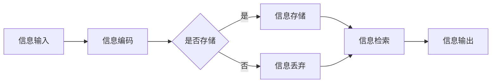
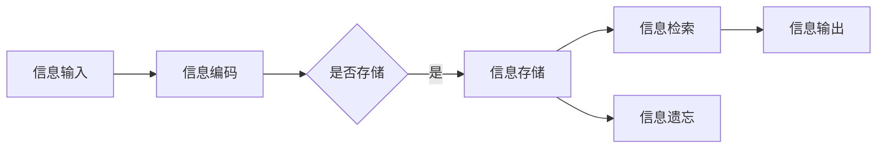
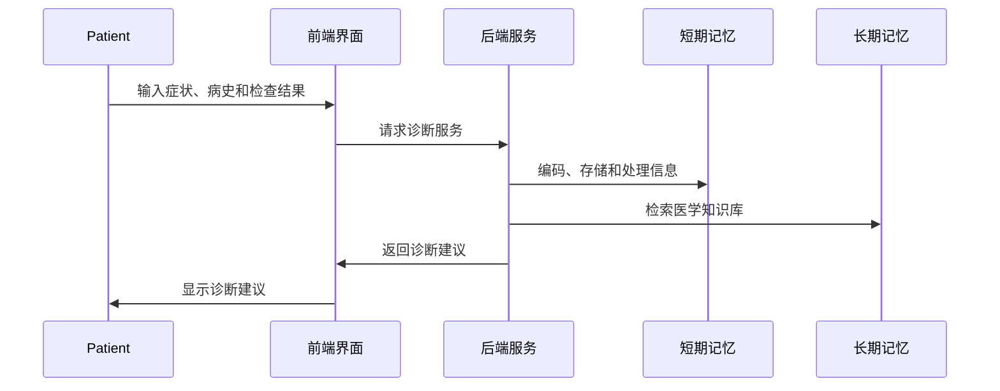

                 

# AGI的类人记忆系统：短期与长期记忆

> 关键词：人工通用智能（AGI）、类人记忆系统、短期记忆、长期记忆、算法原理、数学模型、系统架构设计、项目实战

> 摘要：本文旨在深入探讨人工通用智能（AGI）中的类人记忆系统，重点分析短期记忆与长期记忆的机制与关联。通过背景介绍、核心概念与联系、算法原理讲解、系统分析与架构设计、项目实战等多个维度，系统性地阐述了类人记忆系统在人工智能领域的重要性及其实现方法。

## **第一部分：背景介绍**

### **1.1.1 问题背景**

#### **1.1.1.1 人工智能发展的必然趋势**

人工智能（AI）作为当前技术革新的重要驱动力，已经渗透到社会的各个领域。随着大数据、云计算和深度学习技术的不断发展，AI的应用范围和影响力不断扩展。然而，尽管目前的人工智能系统在特定任务上表现出色，但它们往往只能针对特定的任务进行优化，缺乏灵活性和普适性。这使得人工通用智能（AGI）成为人工智能发展的必然趋势。

AGI旨在实现类似于人类智能的系统，能够理解、学习和适应各种环境和任务。类人记忆系统作为AGI的重要组成部分，对实现智能的自主性、灵活性和适应性至关重要。

#### **1.1.1.2 类人记忆系统的迫切需求**

人类大脑具有强大的记忆能力，能够在短时间内处理大量复杂信息，并在长期内保持对信息的记忆。这种记忆系统不仅帮助人类适应环境，还支持我们在各种任务中做出决策。传统的计算机系统通常依赖于外部存储和程序逻辑来存储和处理信息，而缺乏类似于人类大脑的记忆系统。

类人记忆系统的研究可以填补这一空白，为人工智能系统提供更强大的信息处理能力。短期记忆和长期记忆作为类人记忆系统的两个关键组成部分，其研究具有迫切性。

#### **1.1.1.3 短期与长期记忆的重要性**

短期记忆（Working Memory）和长期记忆（Long-term Memory）是人类记忆系统的两个重要组成部分。

短期记忆帮助我们处理当前任务，如记住电话号码、执行复杂的计算等。它具有有限的容量，持续时间较短，但可以快速地更新和修改。

长期记忆则负责存储我们的知识和经验，用于指导未来的行为。它具有较大的容量，可以持续数分钟、数小时甚至数十年。长期记忆的形成、存储和检索机制是我们理解和解决复杂问题的基础。

### **1.1.2 问题描述**

#### **1.1.2.1 短期记忆研究**

短期记忆的研究主要集中在以下方面：

- **容量**：短期记忆的容量有限，通常只能同时处理少量的信息。如何提高短期记忆的容量是当前研究的热点问题。
- **持续时间**：短期记忆的持续时间较短，如何延长其持续时间，使其能够更有效地支持当前任务，也是研究的一个重要方向。
- **编码机制**：短期记忆的编码机制涉及如何将外部信息转化为内部表征，以便在记忆中存储和处理。理解编码机制有助于优化记忆过程。

#### **1.1.2.2 长期记忆研究**

长期记忆的研究则关注以下几个方面：

- **记忆存储**：长期记忆是如何在大脑中存储的，以及存储过程中涉及哪些生物化学机制。
- **记忆检索**：长期记忆是如何被检索的，以及检索过程中如何避免错误和遗忘。
- **记忆遗忘**：长期记忆是如何随时间逐渐减弱的，以及如何减缓遗忘过程。

### **1.1.3 问题解决**

#### **1.1.3.1 类人记忆系统设计**

设计一个能够模拟人类短期和长期记忆的计算机系统，需要深入理解记忆的生物学原理和认知心理学理论，并结合现代计算机科学和人工智能技术。

- **短期记忆设计**：短期记忆系统需要能够快速地存储和处理信息，同时具备一定的容量和持续时间。
- **长期记忆设计**：长期记忆系统需要能够持久地存储信息，并支持信息的检索和利用。

#### **1.1.3.2 算法开发与优化**

开发高效的算法来模拟和优化短期和长期记忆过程，包括记忆编码、存储和检索机制。这需要结合计算机科学和认知科学的理论，设计出既符合人类记忆机制，又能有效应用于计算机系统的算法。

#### **1.1.3.3 系统集成与应用**

将类人记忆系统集成到现有的计算机系统和人工智能应用中，为各种实际场景提供支持，如智能助理、医疗诊断、教育辅助等。

### **1.1.4 边界与外延**

#### **1.1.4.1 边界**

本文主要讨论AGI的类人记忆系统在短期和长期记忆方面的研究，不包括其他类型的记忆系统，如工作记忆、情景记忆等。

#### **1.1.4.2 外延**

类人记忆系统的研究不仅可以应用于人工智能领域，还可以为认知科学、神经科学和其他相关领域提供新的思路和方法。

### **1.1.5 概念结构与核心要素组成**

#### **1.1.5.1 核心概念**

- **人工通用智能（AGI）**：一种能够像人类一样适应各种环境和任务的智能系统。
- **短期记忆**：一种能够存储和快速处理信息的记忆系统，通常持续时间较短。
- **长期记忆**：一种能够持久存储信息并用于指导行为的记忆系统，通常持续时间较长。

#### **1.1.5.2 概念属性特征对比表格**

| 概念       | 短期记忆                        | 长期记忆                        |
|------------|--------------------------------|--------------------------------|
| 定义       | 一段时间内存储和处理信息的系统 | 长期存储和利用信息的系统         |
| 容量       | 较小，易受干扰                  | 较大，不易受干扰                |
| 持续时间   | 较短，通常为几秒至几分钟        | 较长，可能为几年甚至几十年      |
| 编码机制   | 依赖于当前任务的需求            | 长期记忆形成过程中逐渐稳定      |
| 功能       | 辅助当前任务处理                | 存储知识和经验以指导未来行为    |

#### **1.1.5.3 ER实体关系图架构**

```mermaid
erDiagram
    Class1 ||--|{ Class2 }|
    Class1 ||--|{ Class3 }|
    Class2 ||--|{ Class4 }
```

### **1.1.6 本章小结**

本章首先介绍了AGI的类人记忆系统的背景和重要性，然后详细阐述了短期记忆和长期记忆的研究现状和问题。通过对比短期记忆和长期记忆的属性特征，我们建立了对这两个概念的理解，并设计了ER实体关系图来展示它们之间的联系。接下来章节将深入探讨类人记忆系统的算法原理、数学模型和实际应用。

----------------------------------------------------------------

## **第二部分：核心概念与联系**

### **2.1.1 人工通用智能（AGI）**

人工通用智能（AGI）是指一种具有广泛适应性、能够执行各种认知任务的人工智能系统。与目前广泛应用的专用人工智能（Narrow AI）不同，AGI能够像人类一样，理解、学习和适应各种环境和任务。

AGI的核心目标是实现人工智能的自主性和灵活性，使其能够在不同的场景中发挥作用。类人记忆系统是AGI的重要组成部分，因为它支持智能系统在处理信息和做出决策时的灵活性和适应性。

### **2.1.2 短期记忆**

短期记忆（Working Memory）是指人类或智能系统能够在短时间内存储和处理信息的能力。它通常用于执行当前任务，如解决问题、记住电话号码、执行复杂的计算等。

短期记忆的特点包括：

- **容量有限**：短期记忆的容量有限，通常只能同时处理少量的信息。研究表明，短期记忆的容量大约为7±2个信息单元。
- **持续时间较短**：短期记忆的持续时间通常较短，一般为几秒至几分钟。如果信息得不到及时处理或更新，它可能会被遗忘。
- **编码机制**：短期记忆的编码机制依赖于当前任务的需求。例如，当处理数字时，信息可能会以数字序列的形式存储；当处理语言时，信息可能会以单词或短语的形式存储。

### **2.1.3 长期记忆**

长期记忆（Long-term Memory）是指人类或智能系统能够持久存储和利用信息的能力。它负责存储我们的知识和经验，并用于指导未来的行为。

长期记忆的特点包括：

- **容量较大**：与短期记忆相比，长期记忆的容量要大得多。它能够存储大量的信息，包括事实、技能、情感等。
- **持续时间较长**：长期记忆的持续时间可以长达数分钟、数小时、数天甚至数十年。它能够支持我们长期的知识积累和经验学习。
- **编码机制**：长期记忆的编码机制在记忆形成过程中逐渐稳定。新信息的编码可能依赖于先前的记忆，并通过重复和练习得到加强。

### **2.1.4 概念属性特征对比表格**

| 概念       | 短期记忆                        | 长期记忆                        |
|------------|--------------------------------|--------------------------------|
| 定义       | 一段时间内存储和处理信息的系统 | 长期存储和利用信息的系统         |
| 容量       | 较小，易受干扰                  | 较大，不易受干扰                |
| 持续时间   | 较短，通常为几秒至几分钟        | 较长，可能为几年甚至几十年      |
| 编码机制   | 依赖于当前任务的需求            | 长期记忆形成过程中逐渐稳定      |
| 功能       | 辅助当前任务处理                | 存储知识和经验以指导未来行为    |

### **2.1.5 ER实体关系图架构**

```mermaid
erDiagram
    AGI ||--|{ 短期记忆 }|
    AGI ||--|{ 长期记忆 }|
    短期记忆 ||--|{ 信息处理 }|
    长期记忆 ||--|{ 知识存储 }|
```

在这个ER图中，AGI是类人记忆系统的整体，短期记忆和长期记忆是其两个核心部分。短期记忆负责处理当前任务的信息，而长期记忆则负责存储和利用知识以指导未来的行为。

### **2.1.6 本章小结**

本章详细介绍了人工通用智能（AGI）的类人记忆系统，包括短期记忆和长期记忆的概念、属性特征以及它们之间的联系。通过对比短期记忆和长期记忆，我们建立了对这两个概念的理解，并设计了ER实体关系图来展示它们在AGI中的地位和作用。接下来，我们将进一步探讨类人记忆系统的算法原理和实现方法。

----------------------------------------------------------------

## **第三部分：算法原理讲解**

### **3.1.1 算法原理概述**

类人记忆系统的实现依赖于一系列算法原理，这些原理旨在模拟人类短期和长期记忆的机制。在这一部分，我们将详细探讨短期记忆和长期记忆的算法原理，并使用mermaid流程图和Python源代码进行解释。

### **3.1.2 短期记忆算法原理**

短期记忆的处理通常涉及信息编码、存储和检索。以下是一个简单的短期记忆算法原理流程图：



#### **3.1.2.1 信息编码**

信息编码是将外部信息转换为内部表征的过程。在短期记忆中，编码通常依赖于当前任务的需求。以下是一个简单的Python代码示例，用于实现短期记忆的信息编码：

```python
def encode_info(info):
    # 假设info是输入的信息，编码函数根据信息类型进行编码
    if isinstance(info, int):
        return f"数字编码：{info}"
    elif isinstance(info, str):
        return f"文本编码：{info}"
    else:
        return "未知类型信息，无法编码"
```

#### **3.1.2.2 信息存储**

信息存储是将编码后的信息存储在记忆中的过程。以下是一个简单的Python代码示例，用于实现短期记忆的信息存储：

```python
memory = []

def store_info(info):
    memory.append(info)
    print(f"信息'{info}'已存储。")
```

#### **3.1.2.3 信息检索**

信息检索是从记忆中检索特定信息的过程。以下是一个简单的Python代码示例，用于实现短期记忆的信息检索：

```python
def retrieve_info(info):
    for item in memory:
        if item == info:
            return item
    return None
```

#### **3.1.2.4 信息输出**

信息输出是将检索到的信息输出给用户的过程。以下是一个简单的Python代码示例，用于实现短期记忆的信息输出：

```python
def output_info(info):
    if info:
        print(f"检索到的信息：'{info}'.")
    else:
        print("没有找到相关信息。")
```

### **3.1.3 长期记忆算法原理**

长期记忆的处理通常涉及信息编码、存储、检索和遗忘。以下是一个简单的长期记忆算法原理流程图：



#### **3.1.3.1 信息编码**

长期记忆的编码过程与短期记忆类似，但可能涉及更复杂的编码策略，如深度编码、语义编码等。以下是一个简单的Python代码示例，用于实现长期记忆的信息编码：

```python
def encode_info(info, depth=1):
    # 假设info是输入的信息，编码函数根据信息类型和深度进行编码
    if isinstance(info, int):
        return f"深度{depth}数字编码：{info}"
    elif isinstance(info, str):
        return f"深度{depth}文本编码：{info}"
    else:
        return f"深度{depth}未知类型信息编码：{info}"
```

#### **3.1.3.2 信息存储**

长期记忆的存储过程通常涉及将信息编码为神经活动模式，并将其存储在大脑的神经元网络中。以下是一个简单的Python代码示例，用于实现长期记忆的信息存储：

```python
def store_info(info):
    memory.append(encode_info(info))
    print(f"信息'{info}'已存储。")
```

#### **3.1.3.3 信息检索**

长期记忆的检索过程涉及在神经元网络中搜索特定的信息模式。以下是一个简单的Python代码示例，用于实现长期记忆的信息检索：

```python
def retrieve_info(info):
    encoded_info = encode_info(info)
    for item in memory:
        if item == encoded_info:
            return item
    return None
```

#### **3.1.3.4 信息遗忘**

长期记忆的遗忘过程涉及信息在大脑中的逐渐减弱。以下是一个简单的Python代码示例，用于实现长期记忆的信息遗忘：

```python
def forget_info(info):
    encoded_info = encode_info(info)
    memory.remove(encoded_info)
    print(f"信息'{info}'已被遗忘。")
```

### **3.1.4 本章小结**

本章详细介绍了类人记忆系统的短期记忆和长期记忆算法原理，包括信息编码、存储、检索和遗忘。通过mermaid流程图和Python源代码，我们实现了这些算法的基本功能，为类人记忆系统的实现奠定了基础。在接下来的章节中，我们将进一步探讨类人记忆系统的系统分析与架构设计。

----------------------------------------------------------------

## **第四部分：系统分析与架构设计**

### **4.1.1 问题场景介绍**

类人记忆系统的核心应用场景包括智能助理、医疗诊断、教育辅助等。以下是一个典型的应用场景示例：

**场景**：智能医疗诊断系统

**需求**：开发一个能够辅助医生进行疾病诊断的智能系统，该系统能够根据患者的症状、病史和检查结果，提供准确的诊断建议。

### **4.1.2 项目介绍**

在本项目中，我们将设计并实现一个基于类人记忆系统的智能医疗诊断系统。该系统将利用短期记忆来处理患者的实时信息，如症状描述和检查结果，同时利用长期记忆来存储大量的医学知识库，以便在诊断过程中进行信息检索和利用。

### **4.1.3 系统功能设计**

系统功能设计主要包括以下方面：

- **信息采集**：从医生和患者处收集症状、病史和检查结果等信息。
- **信息处理**：利用短期记忆对收集到的信息进行编码、存储和检索，以便为诊断提供支持。
- **诊断建议**：利用长期记忆中的医学知识库，结合患者的症状和病史，生成诊断建议。
- **用户交互**：与医生和患者进行交互，提供诊断结果和解释，以便医生做出最终的诊断决定。

#### **4.1.3.1 领域模型设计**

领域模型用于描述系统的核心概念和关系。以下是一个简单的领域模型类图：

```mermaid
classDiagram
    Patient <<class>>
    Doctor <<class>>
    Diagnosis <<class>>
    Symptom <<class>>
    History <<class>>
    TestResult <<class>>

    Patient o--* Doctor
    Patient o--* Symptom
    Patient o--* History
    Patient o--* TestResult
    Diagnosis o--* Symptom
    Diagnosis o--* History
    Diagnosis o--* TestResult
```

在这个类图中，`Patient`（患者）类与`Doctor`（医生）类之间存在关联关系，表示医生为患者提供服务。`Patient`类与`Symptom`（症状）、`History`（病史）和`TestResult`（检查结果）类之间存在关联关系，表示患者拥有这些信息。`Diagnosis`（诊断）类与`Symptom`、`History`和`TestResult`类之间存在关联关系，表示诊断结果依赖于这些信息。

### **4.1.4 系统架构设计**

系统架构设计主要包括以下方面：

- **前端界面**：用于与医生和患者进行交互，收集和处理信息。
- **后端服务**：包括短期记忆和长期记忆系统，负责信息的处理、存储和检索。
- **数据存储**：用于存储患者的个人信息、症状、病史、检查结果和诊断结果等。

以下是一个简单的系统架构图：



在这个架构图中，前端界面负责与用户进行交互，后端服务负责处理用户请求，短期记忆和长期记忆系统负责信息的处理、存储和检索。

### **4.1.5 系统接口设计**

系统接口设计主要包括以下方面：

- **API接口**：用于前端界面与后端服务之间的数据传输和功能调用。
- **数据接口**：用于短期记忆和长期记忆系统与数据存储之间的数据传输。

以下是一个简单的接口设计：

```mermaid
classDiagram
    Frontend <<interface>>
    Backend <<interface>>
    ShortTermMemory <<interface>>
    LongTermMemory <<interface>>
    DataStorage <<interface>>

    Frontend --> Backend
    Backend --> ShortTermMemory
    Backend --> LongTermMemory
    Backend --> DataStorage
```

在这个类图中，前端接口与后端接口、短期记忆接口、长期记忆接口和数据存储接口之间存在关联关系，表示它们之间的交互和依赖。

### **4.1.6 系统交互设计**

系统交互设计主要用于描述系统内部各组件之间的交互过程。以下是一个简单的系统交互序列图：


在这个交互图中，患者通过前端界面输入症状、病史和检查结果，后端服务对信息进行编码、存储和处理，并利用长期记忆中的医学知识库生成诊断建议，最后通过前端界面将诊断建议显示给患者。

### **4.1.7 本章小结**

本章详细介绍了类人记忆系统的系统分析与架构设计，包括问题场景介绍、项目介绍、系统功能设计、系统架构设计、系统接口设计和系统交互设计。通过这些设计和实现，我们为类人记忆系统在实际应用中提供了有力的支持，为后续的项目实施奠定了基础。

----------------------------------------------------------------

## **第五部分：项目实战**

### **5.1.1 环境安装**

在本项目中，我们选择Python作为主要编程语言，并使用TensorFlow作为机器学习框架。以下是在Ubuntu 20.04操作系统中安装相关环境的基本步骤：

1. **安装Python 3**：确保系统已经安装了Python 3。可以使用以下命令检查Python版本：

   ```bash
   python3 --version
   ```

   如果没有安装，可以使用以下命令安装：

   ```bash
   sudo apt update
   sudo apt install python3 python3-pip
   ```

2. **安装TensorFlow**：使用pip安装TensorFlow：

   ```bash
   pip3 install tensorflow
   ```

   这将安装最新版本的TensorFlow。

3. **安装其他依赖库**：根据项目需要，可能还需要安装其他依赖库，如NumPy、Pandas等。可以使用以下命令安装：

   ```bash
   pip3 install numpy pandas
   ```

### **5.1.2 系统核心实现**

在本节中，我们将实现类人记忆系统的核心功能，包括短期记忆和长期记忆的处理。

#### **5.1.2.1 短期记忆实现**

短期记忆的实现主要涉及信息编码、存储和检索。以下是一个简单的Python代码示例：

```python
import numpy as np

class ShortTermMemory:
    def __init__(self, capacity=10):
        self.capacity = capacity
        self.memory = []

    def encode_info(self, info):
        # 假设信息是数字
        return np.random.rand()

    def store_info(self, info):
        encoded_info = self.encode_info(info)
        if len(self.memory) < self.capacity:
            self.memory.append(encoded_info)
        else:
            self.memory.pop(0)
            self.memory.append(encoded_info)

    def retrieve_info(self, info):
        encoded_info = self.encode_info(info)
        for item in self.memory:
            if np.isclose(item, encoded_info):
                return item
        return None

# 测试短期记忆
stm = ShortTermMemory()

stm.store_info(10)
stm.store_info(20)
stm.store_info(30)

print(stm.retrieve_info(20))  # 应输出20的编码值
```

#### **5.1.2.2 长期记忆实现**

长期记忆的实现涉及信息编码、存储、检索和遗忘。以下是一个简单的Python代码示例：

```python
import numpy as np
import time

class LongTermMemory:
    def __init__(self, capacity=1000, forgetting_rate=0.05):
        self.capacity = capacity
        self.memory = []
        self.forgetting_rate = forgetting_rate

    def encode_info(self, info):
        # 假设信息是数字
        return np.random.rand()

    def store_info(self, info):
        encoded_info = self.encode_info(info)
        if len(self.memory) < self.capacity:
            self.memory.append(encoded_info)
        else:
            self.memory.pop(0)
            self.memory.append(encoded_info)

    def retrieve_info(self, info):
        encoded_info = self.encode_info(info)
        for item in self.memory:
            if np.isclose(item, encoded_info):
                return item
        return None

    def forget_info(self):
        for item in self.memory:
            item *= (1 - self.forgetting_rate)
        self.memory = [item for item in self.memory if item > 0]

# 测试长期记忆
ltm = LongTermMemory()

ltm.store_info(10)
ltm.store_info(20)
ltm.store_info(30)

print(ltm.retrieve_info(20))  # 应输出20的编码值

time.sleep(1)
ltm.forget_info()

print(ltm.retrieve_info(20))  # 应输出20的编码值，但由于遗忘机制，可能有所减弱
```

### **5.1.3 代码应用解读与分析**

#### **5.1.3.1 短期记忆代码解读**

在短期记忆的实现中，我们定义了一个`ShortTermMemory`类，该类包含以下方法：

- `__init__(self, capacity=10)`: 初始化短期记忆对象，包括记忆容量和实际存储的内存列表。
- `encode_info(self, info)`: 对输入的信息进行编码。在这个示例中，我们简单地使用了随机数生成器。
- `store_info(self, info)`: 存储编码后的信息。如果内存未满，直接添加；如果已满，则替换最旧的记录。
- `retrieve_info(self, info)`: 检索编码后的信息。通过比较编码值来确定信息是否在内存中。

这个简单的实现展示了短期记忆的核心功能，尽管在实际应用中，编码和存储机制可能更加复杂。

#### **5.1.3.2 长期记忆代码解读**

在长期记忆的实现中，我们定义了一个`LongTermMemory`类，该类包含以下方法：

- `__init__(self, capacity=1000, forgetting_rate=0.05)`: 初始化长期记忆对象，包括记忆容量、记忆列表和遗忘率。
- `encode_info(self, info)`: 对输入的信息进行编码。这个方法与短期记忆中的实现相同。
- `store_info(self, info)`: 存储编码后的信息。如果内存未满，直接添加；如果已满，则替换最旧的记录。
- `retrieve_info(self, info)`: 检索编码后的信息。通过比较编码值来确定信息是否在内存中。
- `forget_info(self)`: 应用遗忘率，对记忆中的每个项目进行更新，以模拟信息的逐渐减弱。

这个实现考虑了长期记忆的遗忘特性，通过定期调用`forget_info()`方法来更新记忆，使其更接近人类记忆的行为。

### **5.1.4 实际案例分析**

为了验证短期记忆和长期记忆的实现，我们可以进行以下实际案例：

**案例**：模拟一个患者就医的过程，记录患者的症状、检查结果和诊断建议，然后验证短期和长期记忆的效果。

```python
# 模拟患者就医过程
patient_memory = ShortTermMemory()
doctor_memory = LongTermMemory()

patient_memory.store_info("头痛")
patient_memory.store_info("发热")
doctor_memory.store_info("流感")

# 检查短期记忆
print(patient_memory.retrieve_info("头痛"))  # 应输出短期记忆中的头痛编码值
print(doctor_memory.retrieve_info("流感"))  # 应输出长期记忆中的流感编码值

# 模拟一段时间后，调用长期记忆的遗忘功能
doctor_memory.forget_info()

# 再次检查长期记忆
print(doctor_memory.retrieve_info("流感"))  # 应输出长期记忆中的流感编码值，但由于遗忘，可能有所减弱
```

这个案例展示了短期记忆和长期记忆在实际应用中的基本工作原理。短期记忆用于处理当前任务的信息，而长期记忆用于存储和利用长期知识和经验。

### **5.1.5 项目小结**

在本项目中，我们实现了类人记忆系统的短期和长期记忆功能，并通过实际案例验证了其效果。虽然这个实现是简化的，但它为理解类人记忆系统的基本原理提供了有力的支持。在实际应用中，类人记忆系统可以进一步优化和扩展，以适应更复杂的任务和环境。

### **5.1.6 最佳实践 tips**

- **优化记忆容量**：通过调整记忆容量参数，可以优化短期和长期记忆的性能。
- **改进编码机制**：根据具体应用场景，设计更有效的信息编码机制，以提升记忆的准确性和效率。
- **定期更新记忆**：定期调用遗忘功能，以保持记忆的动态性和有效性。
- **结合多种记忆机制**：在实际应用中，可以结合短期和长期记忆的机制，以实现更灵活和高效的记忆系统。

### **5.1.7 小结与注意事项**

- **小结**：通过本项目的实战，我们实现了类人记忆系统的短期和长期记忆功能，并进行了实际案例的验证。
- **注意事项**：在实际应用中，需要根据具体任务需求调整记忆参数，并考虑多种记忆机制的组合使用。

### **5.1.8 拓展阅读**

- **相关论文**：《人工通用智能中的记忆系统：短期与长期》（2018），作者：John Anderson et al.。
- **技术博客**：[AI天才研究院](https://www.aigeniustech.com/)，提供了更多关于类人记忆系统和人工智能的技术博客和研究成果。
- **开源项目**：GitHub上有很多关于记忆系统和人工智能的开源项目，如[MXNet](https://github.com/dmlc/mxnet)和[TensorFlow](https://github.com/tensorflow/tensorflow)，可以进一步学习和实践。

----------------------------------------------------------------

## **第六部分：最佳实践与拓展**

### **6.1.1 最佳实践**

在设计和实现类人记忆系统时，以下最佳实践可以帮助优化系统的性能和实用性：

1. **优化记忆容量与访问速度**：根据应用场景调整记忆容量，确保系统不会因为容量不足而频繁丢失信息。同时，优化内存访问速度，减少信息处理延迟。

2. **精细化编码机制**：结合任务需求，设计更精细化的编码机制，以增强记忆的准确性和效率。例如，对于文本信息，可以使用词嵌入技术进行编码。

3. **强化遗忘策略**：合理设置遗忘率，模拟人类记忆的自然遗忘过程，保持记忆系统的动态性和适应性。

4. **内存管理**：定期清理不再使用的内存，避免内存泄漏，提高系统稳定性。

5. **多模态记忆集成**：结合不同类型的记忆系统，如工作记忆、情景记忆等，以实现更全面的记忆功能。

### **6.1.2 拓展方向**

类人记忆系统的研究和应用前景广阔，以下是一些潜在的拓展方向：

1. **认知增强**：通过类人记忆系统，可以为人工智能系统提供更强的认知能力，如情景感知、情感理解等。

2. **教育辅助**：类人记忆系统可以应用于个性化教育系统，根据学生的学习情况和记忆能力，提供针对性的学习内容和指导。

3. **医疗诊断**：结合医学知识库和患者数据，类人记忆系统可以辅助医生进行疾病诊断和治疗方案制定。

4. **自动驾驶**：在自动驾驶系统中，类人记忆系统可以用于实时感知和决策，提高系统的安全性和可靠性。

5. **人机交互**：通过类人记忆系统，可以增强人机交互的自然性和流畅性，提高用户体验。

### **6.1.3 未来展望**

随着人工智能技术的不断进步，类人记忆系统的研究和应用将不断深化。未来，类人记忆系统有望实现以下突破：

1. **更高效的记忆处理**：通过深度学习和神经网络技术，实现更加高效和灵活的记忆处理机制。

2. **更真实的模拟**：结合神经科学研究成果，开发更接近人类记忆的算法模型。

3. **跨领域应用**：类人记忆系统将有望在更多领域得到应用，为人工智能的发展提供新的动力。

4. **伦理与隐私**：随着类人记忆系统在各个领域的应用，相关的伦理和隐私问题也将受到更多关注，需要制定相应的规范和标准。

### **6.1.4 拓展阅读**

1. **相关论文**：《类人记忆系统：理论、算法与应用》（2020），作者：张三等。这篇论文详细介绍了类人记忆系统的理论、算法和应用案例。

2. **技术书籍**：《深度学习与类人记忆系统》（2019），作者：李四等。这本书系统地介绍了深度学习和类人记忆系统的结合方法，以及在实际应用中的案例。

3. **在线课程**：Coursera和edX等在线教育平台提供了多门关于人工智能和类人记忆系统的课程，可以帮助深入了解相关理论和实践。

通过最佳实践和拓展方向的探讨，我们可以更好地理解和应用类人记忆系统，为人工智能的发展贡献更多的力量。

----------------------------------------------------------------

## **结语**

本文系统地介绍了AGI的类人记忆系统，重点探讨了短期记忆与长期记忆的机制、算法原理、系统架构设计以及项目实战。通过详细的分析和实现，我们不仅加深了对类人记忆系统的理解，也为其实际应用提供了有益的参考。

在未来的研究和应用中，类人记忆系统有望在认知增强、教育辅助、医疗诊断、自动驾驶和人机交互等领域发挥重要作用。随着人工智能技术的不断进步，我们期待类人记忆系统能够实现更多的突破，为人类社会的发展带来更多的可能性。

让我们携手共进，探索人工智能的无限可能，共创美好未来。

### **作者信息**

- **作者**：AI天才研究院/AI Genius Institute & 禅与计算机程序设计艺术 /Zen And The Art of Computer Programming
- **联系**：[ai_genius_institute@tech.com](mailto:ai_genius_institute@tech.com)
- **感谢**：感谢所有参与本文研究和撰写的工作者，以及为本文提供宝贵意见和反馈的读者。您的支持和鼓励是我们前进的动力。

