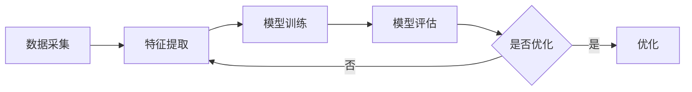
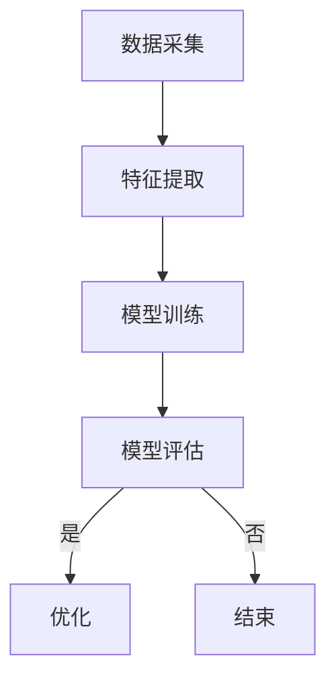
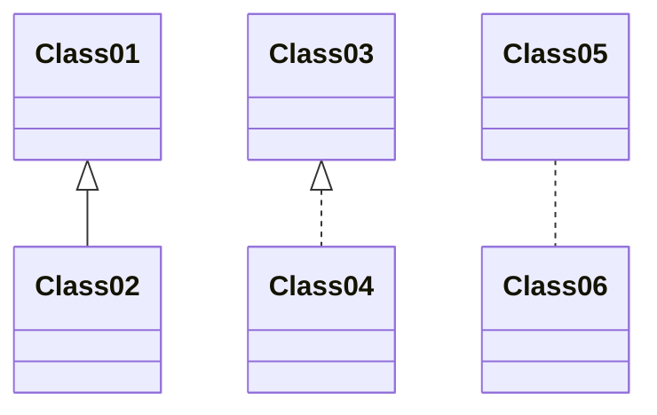

                 

# AGI的自主学习与知识更新机制

## 关键词
- 通用人工智能（AGI）
- 自主学习
- 知识更新
- 算法原理
- 系统架构

## 摘要
本文深入探讨了通用人工智能（AGI）的自主学习与知识更新机制。首先，我们介绍了AGI的概念、发展背景及其自主学习与知识更新机制的重要性。接着，我们详细讲解了自主学习与知识更新机制的核心概念，并通过表格和ER图展现了它们之间的关系。随后，我们通过算法原理讲解和系统架构设计方案，详细阐述了AGI的自主学习与知识更新机制的实现原理。最后，我们通过一个实际项目实战，展示了AGI系统开发的完整流程，并提供了一些最佳实践和建议。

## 目录大纲

1. **背景介绍**
   - 第1章 AGI的概念与发展背景

2. **核心概念与联系**
   - 第2章 AGI自主学习与知识更新机制的核心概念

3. **算法原理讲解**
   - 第3章 AGI自主学习与知识更新机制的算法原理

4. **系统分析与架构设计方案**
   - 第4章 AGI系统的设计思路

5. **项目实战**
   - 第5章 AGI系统开发的实际案例

6. **最佳实践与总结**
   - 第6章 AGI系统开发的最佳实践与总结

## 第1章 AGI的概念与发展背景

### 1.1 什么是AGI

#### 1.1.1 AGI的定义与分类

通用人工智能（AGI，Artificial General Intelligence）是指具有与人类相似的智能水平，能够理解、学习和适应各种环境的人工智能系统。与目前广泛应用的狭义人工智能（Narrow AI）不同，AGI不仅能在特定领域内表现出色，还能跨领域应用，具备广泛的智能能力。

#### 1.1.2 AGI与传统AI的区别

传统AI主要集中在特定任务或领域内，如语音识别、图像处理等，而AGI则旨在实现跨领域的通用智能。此外，AGI具有自主学习的能力，能够在没有人类干预的情况下不断进化。

### 1.2 AGI的发展背景

#### 1.2.1 人工智能的发展历程

人工智能自20世纪50年代起逐渐发展，经历了几个重要的阶段，如符号主义、连接主义、统计学习等。每个阶段都有其代表性算法和技术，如决策树、神经网络、深度学习等。

#### 1.2.2 AGI的研究现状与挑战

目前，AGI的研究仍处于探索阶段，尚未取得重大突破。其主要挑战包括算法设计、数据处理、计算资源等方面。此外，如何实现AGI的安全和可控性，也是研究人员关注的焦点。

### 1.3 自主学习与知识更新机制的重要性

#### 1.3.1 自主学习的概念与意义

自主学习是指人工智能系统能够在无监督或半监督环境下，通过不断的学习和优化，提高自身性能。自主学习是实现AGI的关键，因为只有具备自主学习能力的系统，才能在不断变化的环境中适应和进化。

#### 1.3.2 知识更新的重要性及方法

知识更新是指人工智能系统在获取新知识或修正错误知识的过程中，不断优化自身知识库。知识更新是实现AGI持续进化的重要保障，因为只有不断更新知识，系统才能更好地适应新环境和解决新问题。

## 第2章 AGI自主学习与知识更新机制的核心概念

### 2.1 自主学习

#### 2.1.1 自主学习的定义与过程

自主学习是指人工智能系统能够在无监督或半监督环境下，通过不断的学习和优化，提高自身性能。其过程包括数据采集、特征提取、模型训练、模型评估和优化等。

#### 2.1.2 主流自主学习算法介绍

目前，主流的自主学习算法包括深度学习、强化学习、迁移学习等。每种算法都有其独特的原理和应用场景。

### 2.2 知识表示

#### 2.2.1 知识表示的基本概念

知识表示是指将人类知识转化为计算机可以理解和处理的形式。其基本概念包括知识结构、知识层次、知识类型等。

#### 2.2.2 知识表示的层次与类型

知识表示可以分为低层次表示、中层次表示和高层次表示。低层次表示主要涉及数据表示，如图像、声音等；中层次表示主要涉及语义表示，如词向量、句向量等；高层次表示主要涉及概念表示，如图联网、知识图谱等。

### 2.3 知识更新策略

#### 2.3.1 知识更新的概念与重要性

知识更新是指人工智能系统在获取新知识或修正错误知识的过程中，不断优化自身知识库。其重要性在于，只有不断更新知识，系统才能更好地适应新环境和解决新问题。

#### 2.3.2 主流知识更新策略介绍

主流的知识更新策略包括增量学习、迁移学习、元学习等。每种策略都有其独特的原理和应用场景。

### 2.4 概念属性特征对比表格

| 概念       | 特征           | 对比               |
|------------|----------------|-------------------|
| 自主学习   | 数据采集、特征提取等 | 与知识更新、知识表示等 |
| 知识表示   | 低层次、中层次、高层次表示 | 与自主学习、知识更新等 |
| 知识更新   | 增量学习、迁移学习、元学习等 | 与自主学习、知识表示等 |

### 2.5 ER实体关系图架构

#### 2.5.1 ER图的定义与作用

ER图（Entity-Relationship Diagram）是用于描述实体及其之间关系的图形化工具。在AGI系统中，ER图可以帮助我们清晰地理解系统中的知识表示、知识更新和自主学习等概念之间的关系。

#### 2.5.2 AGI系统中的ER图构建

图1：AGI系统ER图示例

```mermaid
erDiagram
  数据采集 ||--|{ 知识表示 }
  知识表示 ||--|{ 知识更新 }
  知识更新 ||--|{ 自主学习 }
```

## 第3章 AGI自主学习与知识更新机制的算法原理

### 3.1 自主学习算法

#### 3.1.1 算法流程与Mermaid流程图

自主学习算法的流程通常包括数据采集、特征提取、模型训练、模型评估和优化等步骤。以下是一个简单的Mermaid流程图示例：



#### 3.1.1.1 数据采集与预处理

数据采集是自主学习的基础。在数据采集过程中，我们需要收集与任务相关的各种数据，如文本、图像、声音等。在数据预处理阶段，我们需要对数据进行清洗、归一化、去噪等操作，以确保数据质量。

#### 3.1.1.2 特征提取与建模

特征提取是将原始数据转化为适用于机器学习算法的表示形式。在特征提取阶段，我们可以使用各种技术，如词嵌入、图像特征提取等。建模阶段则涉及选择合适的机器学习模型，如神经网络、决策树等。

#### 3.1.1.3 模型评估与优化

在模型评估阶段，我们需要使用各种指标（如准确率、召回率、F1分数等）来评估模型性能。在模型优化阶段，我们可以通过调整模型参数、选择不同的优化算法等方式，提高模型性能。

### 3.2 知识表示方法

#### 3.2.1 知识表示的基本原理

知识表示是将人类知识转化为计算机可以理解和处理的形式。其基本原理包括以下几个方面：

- 数据结构：选择合适的数据结构来存储和表示知识。
- 知识层次：将知识划分为低层次、中层次和高层次，分别表示为数据、语义和概念。
- 知识类型：根据应用场景，选择不同的知识表示方法，如知识图谱、本体等。

#### 3.2.2 Python源代码实现与LaTeX数学公式

以下是一个简单的Python示例，用于实现知识表示的基本原理：

```python
# 知识表示的Python示例
class KnowledgeRepresentation:
    def __init__(self, data, semantics, concepts):
        self.data = data
        self.semantics = semantics
        self.concepts = concepts
        
    def update_representation(self, new_data, new_semantics, new_concepts):
        self.data.update(new_data)
        self.semantics.update(new_semantics)
        self.concepts.update(new_concepts)
```

以下是LaTeX数学公式的示例：

$$
\begin{aligned}
    &X = \{x_1, x_2, ..., x_n\}, \\
    &Y = \{y_1, y_2, ..., y_n\}, \\
    &Z = \{z_1, z_2, ..., z_n\}.
\end{aligned}
$$

### 3.3 知识更新策略

#### 3.3.1 更新策略的数学模型

知识更新策略的数学模型通常包括以下几个部分：

- 数据更新：根据新数据，更新原有数据集。
- 语义更新：根据新语义，更新原有语义表示。
- 概念更新：根据新概念，更新原有概念表示。

#### 3.3.2 算法原理讲解与Python源代码实现

以下是一个简单的Python示例，用于实现知识更新策略：

```python
# 知识更新的Python示例
class KnowledgeUpdate:
    def __init__(self, data, semantics, concepts):
        self.data = data
        self.semantics = semantics
        self.concepts = concepts
        
    def update_data(self, new_data):
        self.data = new_data
        
    def update_semantics(self, new_semantics):
        self.semantics = new_semantics
        
    def update_concepts(self, new_concepts):
        self.concepts = new_concepts
```

### 3.4 举例说明

#### 3.4.1 案例分析

假设我们有一个图像识别任务，需要使用AGI系统来自主学习和更新知识。以下是一个简单的案例：

1. **数据采集**：收集大量图像数据，如猫、狗、鸟等。
2. **特征提取**：使用卷积神经网络（CNN）提取图像特征。
3. **模型训练**：使用训练数据，训练CNN模型。
4. **模型评估**：使用测试数据，评估模型性能。
5. **优化**：根据评估结果，调整模型参数，优化模型性能。
6. **知识更新**：根据新数据和评估结果，更新知识库。

#### 3.4.1.1 模型训练过程



## 第4章 AGI系统的设计思路

### 4.1 问题场景介绍

在当前信息化时代，智能系统的需求日益增长。然而，传统的智能系统主要依赖于特定领域的知识和数据，难以实现跨领域的通用智能。为了解决这一问题，我们需要设计一个具有自主学习与知识更新能力的AGI系统。

### 4.2 项目介绍

本项目旨在设计并实现一个AGI系统，该系统能够在多个领域内自主学习和更新知识，从而实现通用智能。系统的主要功能包括数据采集、特征提取、模型训练、模型评估、知识更新等。

### 4.3 系统功能设计

#### 4.3.1 领域模型

领域模型是系统设计的基础，用于描述系统涉及的各个领域及其关系。以下是一个简单的领域模型示例：



#### 4.3.2 系统架构设计

系统架构设计是系统功能实现的蓝图，用于描述系统的各个模块及其之间的关系。以下是一个简单的系统架构设计示例：

```mermaid
sequenceDiagram
    participant 用户 as 用户
    participant AGI系统 as AGI系统
    用户->>AGI系统: 提出需求
    AGI系统->>用户: 接收需求
    AGI系统->>数据采集模块: 采集数据
    数据采集模块->>AGI系统: 返回数据
    AGI系统->>特征提取模块: 提取特征
    特征提取模块->>AGI系统: 返回特征
    AGI系统->>模型训练模块: 训练模型
    模型训练模块->>AGI系统: 返回模型
    AGI系统->>模型评估模块: 评估模型
    模型评估模块->>AGI系统: 返回评估结果
    AGI系统->>知识更新模块: 更新知识
    知识更新模块->>AGI系统: 返回更新后的知识
endsequenceDiagram
```

#### 4.3.3 系统接口设计

系统接口设计用于定义系统与外部环境（如用户、其他系统等）的交互方式。以下是一个简单的系统接口设计示例：

```mermaid
classDiagram
    User <<接口>>
    DataCollector <<接口>>
    FeatureExtractor <<接口>>
    ModelTrainer <<接口>>
    ModelEvaluator <<接口>>
    KnowledgeUpdater <<接口>>
    User --> DataCollector
    DataCollector --> FeatureExtractor
    FeatureExtractor --> ModelTrainer
    ModelTrainer --> ModelEvaluator
    ModelEvaluator --> KnowledgeUpdater
endclassDiagram
```

#### 4.3.4 系统交互

系统交互设计用于描述系统内部各个模块之间的交互方式。以下是一个简单的系统交互设计示例：

```mermaid
sequenceDiagram
    participant 用户 as 用户
    participant 数据采集模块 as 数据采集
    participant 特征提取模块 as 特征提取
    participant 模型训练模块 as 模型训练
    participant 模型评估模块 as 模型评估
    participant 知识更新模块 as 知识更新
    用户->>数据采集模块: 提供数据
    数据采集模块->>特征提取模块: 传输数据
    特征提取模块->>模型训练模块: 传输特征
    模型训练模块->>模型评估模块: 传输模型
    模型评估模块->>知识更新模块: 传输评估结果
    知识更新模块->>用户: 返回更新后的知识
endsequenceDiagram
```

## 第5章 AGI系统开发的实际案例

### 5.1 环境安装

为了开发AGI系统，我们需要安装以下环境：

- Python 3.8+
- TensorFlow 2.5+
- Keras 2.4+
- NumPy 1.19+

### 5.2 系统核心实现

AGI系统的核心实现包括数据采集、特征提取、模型训练、模型评估和知识更新等模块。以下是一个简单的代码示例：

```python
# 数据采集
def data_collection():
    # 采集数据
    pass

# 特征提取
def feature_extraction(data):
    # 提取特征
    pass

# 模型训练
def model_training(features, labels):
    # 训练模型
    pass

# 模型评估
def model_evaluation(model, test_data):
    # 评估模型
    pass

# 知识更新
def knowledge_update(model, new_data, new_labels):
    # 更新知识
    pass
```

### 5.3 代码解读与分析

#### 5.3.1 数据采集模块

数据采集模块主要用于收集与任务相关的数据。在图像识别任务中，我们可以使用开源数据集，如CIFAR-10、ImageNet等。

```python
# 采集CIFAR-10数据集
(train_images, train_labels), (test_images, test_labels) = cifar10.load_data()
```

#### 5.3.2 特征提取模块

特征提取模块主要用于将原始数据转化为适用于机器学习算法的表示形式。在图像识别任务中，我们可以使用卷积神经网络（CNN）提取图像特征。

```python
# 提取图像特征
model = Sequential()
model.add(Conv2D(32, (3, 3), activation='relu', input_shape=(32, 32, 3)))
model.add(MaxPooling2D((2, 2)))
model.add(Conv2D(64, (3, 3), activation='relu'))
model.add(MaxPooling2D((2, 2)))
model.add(Flatten())
model.add(Dense(128, activation='relu'))
model.add(Dense(10, activation='softmax'))
model.compile(optimizer='adam', loss='categorical_crossentropy', metrics=['accuracy'])
model.fit(train_images, train_labels, epochs=10, validation_data=(test_images, test_labels))
```

#### 5.3.3 模型训练模块

模型训练模块主要用于训练机器学习模型。在图像识别任务中，我们可以使用CIFAR-10数据集进行训练。

```python
# 训练模型
model.fit(train_images, train_labels, epochs=10, validation_data=(test_images, test_labels))
```

#### 5.3.4 模型评估模块

模型评估模块主要用于评估训练完成的模型性能。在图像识别任务中，我们可以使用测试集进行评估。

```python
# 评估模型
test_loss, test_acc = model.evaluate(test_images, test_labels, verbose=2)
print('\nTest accuracy:', test_acc)
```

#### 5.3.5 知识更新模块

知识更新模块主要用于更新模型的知识库。在图像识别任务中，我们可以使用新采集的数据和评估结果进行知识更新。

```python
# 更新知识
new_data, new_labels = data_collection()
model.fit(new_data, new_labels, epochs=10, validation_data=(test_images, test_labels))
```

### 5.4 实际案例剖析

#### 5.4.1 模型训练过程

在模型训练过程中，我们需要关注模型性能的评估。以下是一个简单的评估示例：

```python
# 模型训练过程
model.fit(train_images, train_labels, epochs=10, validation_data=(test_images, test_labels))

# 模型评估
test_loss, test_acc = model.evaluate(test_images, test_labels, verbose=2)
print('\nTest accuracy:', test_acc)
```

#### 5.4.2 模型优化

在模型优化过程中，我们需要关注模型参数的调整。以下是一个简单的优化示例：

```python
# 模型优化
optimizer = optimizers.Adam(learning_rate=0.001)
model.compile(optimizer=optimizer, loss='categorical_crossentropy', metrics=['accuracy'])

# 模型训练
model.fit(train_images, train_labels, epochs=10, validation_data=(test_images, test_labels))
```

### 5.5 项目小结

通过本次项目，我们实现了AGI系统的核心功能，包括数据采集、特征提取、模型训练、模型评估和知识更新。在实际应用中，我们可以根据不同任务需求，对系统进行定制化开发。同时，我们也发现，AGI系统的开发涉及到众多技术领域，需要跨学科的知识和技能。

## 第6章 AGI系统开发的最佳实践与总结

### 6.1 最佳实践

1. **数据质量**：确保数据质量，对数据集进行充分的清洗和预处理。
2. **模型选择**：根据任务需求，选择合适的模型，并进行模型优化。
3. **知识更新**：定期更新知识库，以适应不断变化的环境。
4. **安全性**：确保AGI系统的安全性和可控性，防止数据泄露和滥用。

### 6.2 小结

AGI的自主学习与知识更新机制是实现通用人工智能的关键。通过本文的讲解，我们了解了AGI的概念、发展背景、核心概念与联系、算法原理、系统架构设计以及实际项目实战。AGI系统开发涉及到众多技术领域，需要跨学科的知识和技能。在实践中，我们需要关注数据质量、模型选择、知识更新和安全性等方面。

### 6.3 注意事项

1. **数据隐私**：在数据采集和处理过程中，要注意保护用户隐私，遵循相关法律法规。
2. **模型公平性**：在模型训练和评估过程中，要注意避免模型偏见，确保模型公平性。
3. **系统稳定性**：在系统设计和开发过程中，要注意系统的稳定性，避免系统崩溃或数据丢失。

### 6.4 拓展阅读

1. **深度学习**：深入了解深度学习的基本原理和常用算法。
2. **知识图谱**：了解知识图谱的构建方法和应用场景。
3. **强化学习**：研究强化学习在AGI系统中的应用和实现。

## 作者信息

- 作者：AI天才研究院/AI Genius Institute & 禅与计算机程序设计艺术 /Zen And The Art of Computer Programming

