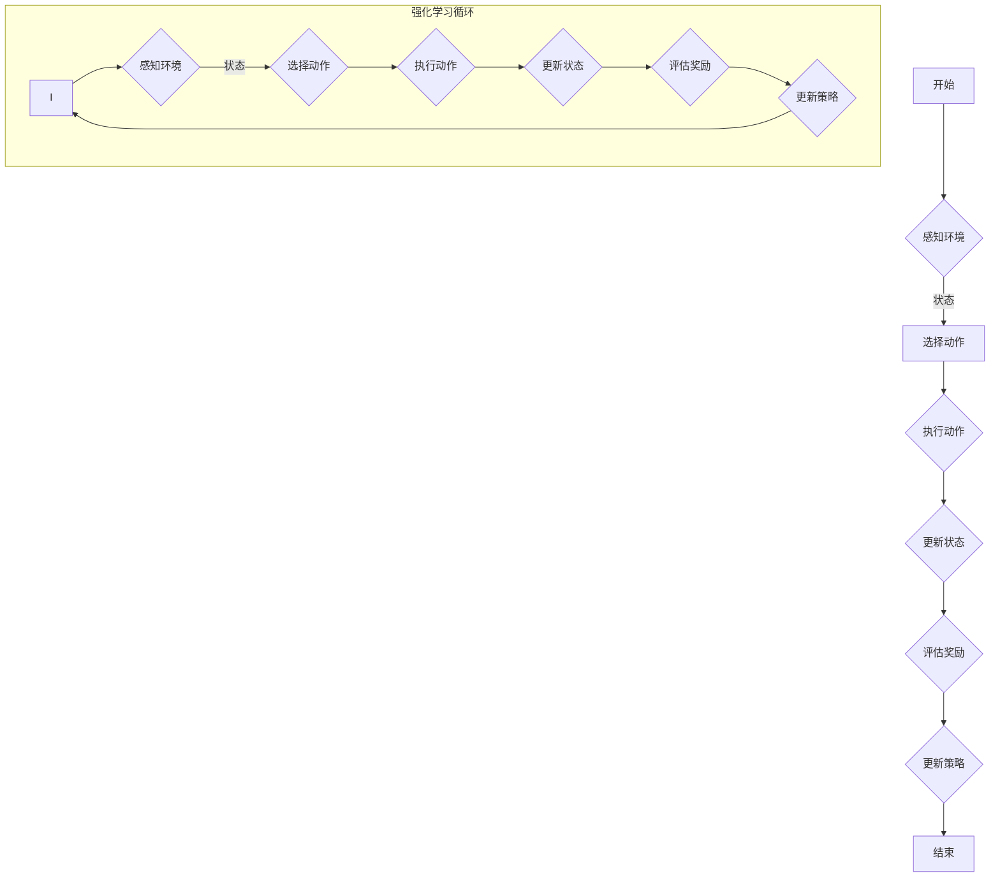
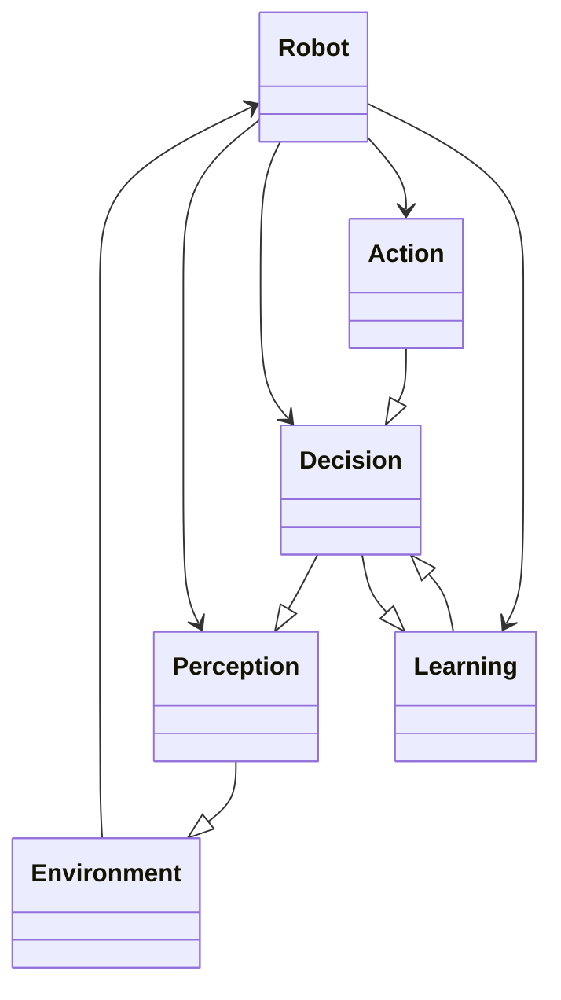
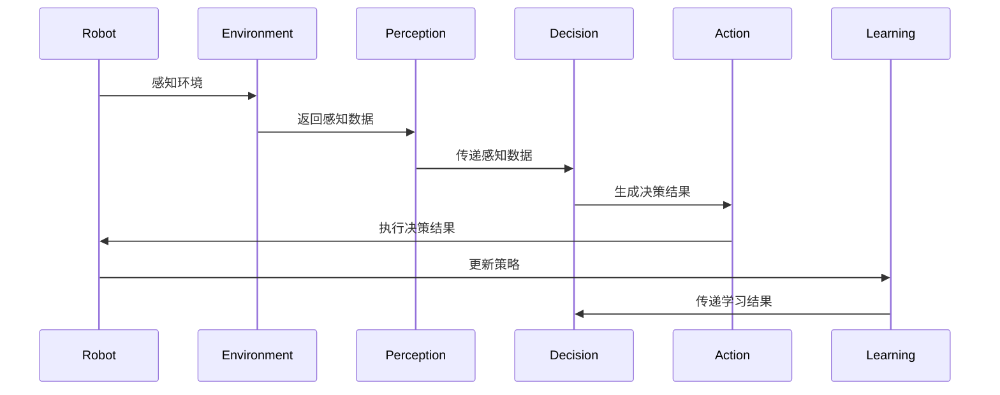

                 

### 引言与背景

#### 问题背景

人工智能（AI）技术的发展已经经历了数个阶段，从早期的规则推理和符号计算，到现代的基于数据的机器学习和深度学习。然而，尽管这些技术取得了显著的成就，但它们仍然存在一个根本性的限制：大多数AI系统都是专门为特定任务或领域设计的，缺乏通用性和适应性。这意味着这些系统在处理新任务或面对新环境时，往往需要重新训练或调整，这限制了它们在实际应用中的广泛性和灵活性。

近年来，人工通用智能（Artificial General Intelligence，AGI）的概念逐渐受到关注。AGI旨在开发一种具有广泛认知能力的智能系统，它不仅能够完成特定的任务，还能够学习、推理和适应各种环境和情境。然而，要实现AGI，必须解决一个关键问题：如何让AI系统能够自主探索环境，获取新的信息，并利用这些信息来改进自己的行为和认知。

自主探索与好奇心机制正是解决这一问题的关键。自主探索是指智能系统能够在没有外部干预的情况下主动探索其周围的环境，以获取新的经验和知识。好奇心机制则是驱动智能系统进行自主探索的内驱力，使得系统能够持续地对未知事物产生兴趣。这两种机制的结合，有望使AGI系统能够更接近人类的认知过程，从而实现更高的智能水平。

#### 核心概念

在本章中，我们将探讨以下几个核心概念：

1. **人工智能（AI）**：一种模拟人类智能的计算机系统，能够通过学习、推理和解决问题来执行特定任务。

2. **人工通用智能（AGI）**：一种旨在模拟人类智能的更高级形式，具有广泛的认知能力和适应性，能够在各种不同的环境和任务中表现。

3. **自主探索**：智能系统能够在没有外部干预的情况下，主动探索其周围的环境，以获取新的经验和知识。

4. **好奇心机制**：驱动智能系统进行自主探索的内驱力，使得系统对未知事物持续产生兴趣。

#### 本书结构

本书将分为以下几个部分：

- **第一部分：引言与背景**：介绍AGI的概念、自主探索与好奇心机制的重要性，以及本书的结构和内容概述。
  
- **第二部分：理论基础**：讨论自主探索与好奇心机制的基础理论，包括感知、决策和行动等方面。

- **第三部分：技术实现**：介绍自主探索与好奇心机制的技术实现，包括感知与信息处理、决策与行动、好奇心机制的设计与实现。

- **第四部分：应用案例**：展示自主探索与好奇心机制在不同领域的应用案例。

- **第五部分：挑战与发展趋势**：分析自主探索与好奇心机制在AI领域的挑战和未来趋势。

- **第六部分：最佳实践与总结**：总结自主探索与好奇心机制的最佳实践，并对未来进行展望。

通过本书的阅读，读者将能够深入了解AGI的自主探索与好奇心机制，理解其核心概念和技术实现，并探索其在实际应用中的潜力。

### 第一部分：引言与背景

#### 1.1.1 问题背景

在当今世界，人工智能（AI）技术已经渗透到各个行业，从医疗保健到金融服务，从制造业到交通运输。这些技术的进步不仅提高了生产效率，还改善了人们的生活质量。然而，尽管AI在特定任务上表现出色，但它们仍然依赖于人类提供的规则和数据来进行学习和操作。这种依赖性限制了AI系统的通用性和适应性，使得它们难以应对复杂和动态的环境变化。

人工通用智能（AGI）的概念提出了一个更高级别的目标：开发一种具有广泛认知能力和适应性的智能系统，它能够在各种不同的任务和环境中进行学习和推理。与目前广泛使用的窄域AI（Narrow AI）不同，AGI的目标是达到或超越人类的认知水平，从而实现自主学习和智能行为。

然而，要实现AGI，需要解决一个关键问题：如何让智能系统能够自主探索环境，获取新的信息，并利用这些信息来改进自己的行为和认知。传统的人工智能系统往往缺乏这种自主性，它们需要人类提供明确的任务目标和学习数据。这种限制使得AI系统在面对新任务或新环境时，往往需要重新训练或调整，这限制了它们在实际应用中的广泛性和灵活性。

自主探索与好奇心机制正是解决这一问题的关键。自主探索指的是智能系统能够在没有外部干预的情况下，主动探索其周围的环境，以获取新的经验和知识。好奇心机制则是驱动智能系统进行自主探索的内驱力，使得系统能够持续地对未知事物产生兴趣。通过结合自主探索和好奇心机制，AI系统将能够更接近人类的认知过程，从而实现更高的智能水平。

#### 1.1.2 核心概念

在本部分，我们将介绍与自主探索和好奇心机制相关的核心概念，包括人工智能（AI）、人工通用智能（AGI）、自主探索和好奇心机制。

1. **人工智能（AI）**

人工智能是一种模拟人类智能的计算机系统，它能够通过学习、推理和解决问题来执行特定任务。AI技术可以分为两类：窄域AI（Narrow AI）和人工通用智能（AGI）。

- **窄域AI（Narrow AI）**：也称为专用AI，它专注于特定的任务或领域，如语音识别、图像分类、推荐系统等。窄域AI在特定任务上表现出色，但缺乏泛化能力，无法在不同任务或环境中进行适应。

- **人工通用智能（AGI）**：旨在模拟人类智能的更高级形式，具有广泛的认知能力和适应性。AGI的目标是能够自主学习和推理，从而在各种不同的任务和环境中进行学习和操作。

2. **人工通用智能（AGI）**

AGI是一种理想化的AI形式，它具备以下特征：

- **通用性**：AGI能够在各种不同的任务和环境中进行学习和操作，而不仅仅是特定任务。

- **适应性**：AGI能够根据新的信息和经验调整自己的行为和认知。

- **自主学习**：AGI能够通过自我学习和自我改进来提高性能。

- **认知能力**：AGI具有与人类相似的认知能力，包括理解语言、感知世界、推理和解决问题等。

3. **自主探索**

自主探索是指智能系统能够在没有外部干预的情况下，主动探索其周围的环境，以获取新的经验和知识。自主探索涉及以下方面：

- **感知**：智能系统通过传感器和感知模块获取环境信息。

- **决策**：智能系统基于感知信息做出决策，以确定下一步行动。

- **行动**：智能系统执行决策，并在环境中采取行动。

4. **好奇心机制**

好奇心机制是驱动智能系统进行自主探索的内驱力。好奇心机制可以是基于奖励的系统，例如，当智能系统发现新的信息时，它会获得奖励，从而激发其进一步探索。好奇心机制还可以是基于认知冲突的系统，例如，当智能系统遇到与现有知识不符的信息时，它会感到好奇，并尝试解决这种冲突。

好奇心机制的关键在于激发智能系统对未知事物的兴趣，从而推动它们进行自主探索。这有助于智能系统在复杂和动态环境中发现新的信息和知识，从而提高其适应性和智能水平。

通过理解这些核心概念，读者可以更好地把握自主探索与好奇心机制在AGI系统中的重要性。在接下来的章节中，我们将深入探讨这些概念的理论基础和技术实现。

### 第二部分：理论基础

#### 2.1 自主探索的基本原理

自主探索是智能系统在复杂环境中进行主动学习的关键能力，它涉及到智能系统在无外部指导的情况下，通过感知、决策和行动过程来获取新信息和知识。理解自主探索的基本原理对于开发能够适应各种环境和任务的智能系统至关重要。

**感知**

感知是自主探索的起点，它指的是智能系统通过传感器和感知模块获取环境信息的过程。这些传感器可以是物理传感器（如摄像头、麦克风、红外传感器等），也可以是虚拟传感器（如文本分析、语音识别等）。感知模块的任务是处理这些传感器输入的信息，提取出有用的特征和模式。

**决策**

在获取到环境信息后，智能系统需要基于这些信息进行决策。决策过程通常涉及到目标设定、风险评估和策略选择。目标设定是指智能系统确定其当前的任务或目标，例如，探索未知的区域或学习新的技能。风险评估是指智能系统分析当前环境的风险和不确定性，以确定哪些行动是最安全的。策略选择是指智能系统根据目标和风险评估结果，选择最合适的行动方案。

**行动**

行动是智能系统根据决策结果执行的具体操作。行动可以是物理操作（如移动、操作设备等），也可以是虚拟操作（如发送消息、执行计算等）。行动的目的是在环境中实现智能系统的目标，同时获取新的信息和知识。

**自主探索的循环**

自主探索通常是一个循环过程，包括感知、决策和行动三个步骤。智能系统在执行一个行动后，会重新进行感知，以获取新的信息，然后基于这些新信息进行新的决策和行动。这种循环使得智能系统能够持续地与环境交互，逐步积累经验和知识。

**挑战与局限性**

尽管自主探索为智能系统提供了强大的学习工具，但它在实际应用中仍面临许多挑战和局限性。首先，感知信息的质量和数量可能受到传感器性能和环境噪声的限制。其次，决策过程可能受到计算资源和算法复杂性的影响，导致决策效率低下。最后，行动的实际效果可能受到物理设备和执行环境的影响，从而影响智能系统的自主探索能力。

**理论框架**

自主探索的理论框架通常包括以下几个组成部分：

1. **感知模块**：负责收集和处理环境信息。
2. **决策模块**：基于感知信息进行目标设定、风险评估和策略选择。
3. **行动模块**：执行决策结果，实现具体操作。
4. **学习模块**：将新信息和知识整合到智能系统的知识库中，以改进未来的决策和行动。

通过这一理论框架，智能系统能够在复杂环境中实现自主探索，从而提高其适应性和智能水平。

#### 2.2 好奇心机制的理论基础

好奇心机制是驱动智能系统进行自主探索的核心动力。它是一种内在动机，促使智能系统对未知事物产生兴趣，并驱动它们进行探索和学习。理解好奇心机制的理论基础，有助于设计出能够有效激发智能系统好奇心的机制，从而实现更高效、更智能的自主探索。

**心理学基础**

好奇心是一种基本的人类心理特征，它驱使我们去探索未知、解决问题和寻求知识。心理学研究表明，好奇心与多种心理过程和动机密切相关，包括认知需求、控制需求和社会需求等。在智能系统中引入好奇心机制，可以借鉴这些心理学理论，以激发智能系统的内在动机。

1. **认知需求**：好奇心与认知需求紧密相关。当智能系统面临新的信息和知识时，它们会感到好奇，并产生强烈的欲望去理解和掌握这些信息。这种认知需求可以转化为智能系统的内在动机，推动它们进行自主探索。

2. **控制需求**：好奇心也可以与控制需求相关。通过探索环境，智能系统可以更好地理解其周围的世界，从而获得对环境的控制能力。这种控制需求可以激励智能系统去主动探索和掌握新的技能和知识。

3. **社会需求**：在社交环境中，好奇心可以与社会需求相关。智能系统可能会对其他智能系统或人类的行为和决策感到好奇，并试图理解这些行为和决策的动机和影响。这种社会需求可以促进智能系统之间的交互和合作。

**认知科学基础**

认知科学提供了关于人类认知过程的深入理解，这些理解可以应用于设计好奇心机制。认知科学研究表明，好奇心是一个复杂的认知过程，它涉及到感知、记忆、注意力、决策和行动等多个方面。

1. **感知与注意力**：好奇心激发智能系统的感知和注意力。当智能系统遇到新奇或不确定的信息时，它们会集中注意力，以获取更多细节和特征。这种感知和注意力机制可以增强智能系统的信息获取能力。

2. **记忆与学习**：好奇心可以促进智能系统的记忆和学习过程。当智能系统遇到新奇或重要的信息时，它们会记住这些信息，并在未来的探索和学习中利用这些信息。这种记忆和学习机制可以增强智能系统的知识积累和适应性。

3. **决策与行动**：好奇心会影响智能系统的决策和行动。当智能系统对某些信息感到好奇时，它们会采取行动去探索和验证这些信息。这种决策和行动机制可以推动智能系统进行自主探索。

**计算模型基础**

在计算模型中，好奇心机制可以通过多种方式实现。以下是一些常见的计算模型：

1. **奖励机制**：好奇心可以通过奖励机制来激发。例如，当智能系统发现新的信息或解决问题时，它可以获得奖励，从而增加其好奇心和探索动机。

2. **认知冲突**：好奇心也可以通过认知冲突来激发。当智能系统的现有知识与新信息发生冲突时，它会感到好奇，并尝试解决这种冲突。

3. **进化算法**：进化算法可以通过模拟生物进化过程来激发好奇心。智能系统可以通过变异和选择机制来探索新的解决方案，从而增强其好奇心和探索能力。

通过结合心理学、认知科学和计算模型的理论基础，我们可以设计出有效的好奇心机制，以驱动智能系统的自主探索。这些机制不仅能够提高智能系统的学习能力和适应性，还能使其更接近人类的认知过程，从而实现更高的智能水平。

### 第三部分：技术实现

#### 3.1 感知与信息处理

在自主探索过程中，感知与信息处理是智能系统的核心能力，它决定了系统能否有效地获取和处理环境中的信息。这一部分将介绍智能系统在感知与信息处理方面的关键技术，包括传感器选择、数据预处理、特征提取和建模等。

**传感器选择**

传感器是智能系统获取环境信息的关键设备。选择合适的传感器取决于任务需求和环境特性。常见的传感器类型包括：

- **物理传感器**：如摄像头、麦克风、红外传感器、温度传感器等，用于捕捉图像、声音、温度等物理信息。
- **虚拟传感器**：如文本分析、语音识别、自然语言处理等，用于处理文本、语音等虚拟信息。

传感器选择时需要考虑以下因素：

- **精度和灵敏度**：传感器应能够提供高精度和灵敏度的数据，以确保系统对环境变化的准确感知。
- **成本和复杂性**：传感器应具有合理的成本和复杂性，以便在实际应用中可行。
- **兼容性和可扩展性**：传感器应与其他系统组件兼容，并具有可扩展性，以便在未来进行升级和扩展。

**数据预处理**

获取到的传感器数据通常是不完整的、噪声的、甚至是矛盾的。因此，数据预处理是确保数据质量的关键步骤。数据预处理包括以下任务：

- **去噪**：去除数据中的噪声，以提高数据的准确性和可靠性。
- **归一化**：将数据归一化到相同的尺度，以便进行后续处理。
- **缺失值处理**：填补数据中的缺失值，以保持数据的一致性和完整性。
- **异常值检测与处理**：检测和排除数据中的异常值，以避免对系统性能的影响。

**特征提取**

特征提取是将原始数据转换为有助于智能系统理解和决策的特征的过程。特征提取的关键在于提取出能够反映环境信息和任务目标的关键特征。常见的特征提取方法包括：

- **统计学方法**：如均值、方差、标准差等，用于描述数据的分布和变化趋势。
- **频域分析**：如傅里叶变换、小波变换等，用于分析数据的频率特性。
- **时序分析**：如时间序列模型、滑动窗口等，用于分析数据的时序特征。
- **机器学习方法**：如主成分分析（PCA）、线性判别分析（LDA）等，用于提取数据的低维表示。

**建模**

建模是将特征数据转换为智能系统可理解和利用的形式。常见的建模方法包括：

- **监督学习模型**：如线性回归、决策树、支持向量机（SVM）等，用于从标记数据中学习规律。
- **无监督学习模型**：如聚类、主成分分析（PCA）、自编码器等，用于从无标记数据中提取结构和模式。
- **强化学习模型**：如Q学习、深度强化学习（DRL）等，用于通过试错和反馈进行自主决策。

**挑战与局限性**

尽管感知与信息处理技术取得了显著进展，但在实际应用中仍面临以下挑战和局限性：

- **数据质量**：传感器数据可能存在噪声、缺失值和异常值，影响系统的感知准确性。
- **计算资源**：数据预处理和特征提取通常需要大量计算资源，可能限制实时性和响应速度。
- **泛化能力**：模型可能在特定条件下表现良好，但在其他条件下可能失效，影响系统的泛化能力。

通过不断优化感知与信息处理技术，我们可以提升智能系统的自主探索能力，使其在复杂和动态环境中表现得更加智能和高效。

#### 3.2 决策与行动

在自主探索过程中，智能系统的决策与行动是关键环节，决定了系统如何响应环境变化并实现目标。这一部分将介绍智能系统在决策与行动方面的核心技术，包括目标选择、路径规划、风险评估和执行策略等。

**目标选择**

目标选择是智能系统自主探索的起点。目标可以是明确的（如到达特定位置、完成任务等），也可以是模糊的（如探索未知区域、学习新知识等）。目标选择通常涉及以下步骤：

1. **目标识别**：智能系统通过感知模块获取环境信息，识别潜在的目标。
2. **目标评估**：智能系统评估每个目标的可行性和优先级，选择最有利的目标。
3. **目标设定**：智能系统根据评估结果设定具体的目标，以便后续的决策和行动。

目标选择的关键在于平衡目标的明确性和灵活性。过于明确的目标可能导致系统在面对变化时缺乏适应性，而过于模糊的目标可能导致系统无所适从。

**路径规划**

路径规划是智能系统在实现目标过程中选择最佳路径的过程。路径规划通常涉及以下步骤：

1. **环境建模**：智能系统通过感知模块获取环境信息，建立环境模型。
2. **障碍检测**：智能系统检测并避开环境中的障碍物。
3. **路径生成**：智能系统根据环境模型生成可行的路径。
4. **路径优化**：智能系统对生成的路径进行优化，选择最佳路径。

路径规划的常见算法包括：

- **A*算法**：基于启发式搜索，选择最短路径。
- **Dijkstra算法**：基于最短路径优先搜索，找到最短路径。
- **遗传算法**：通过模拟生物进化过程，找到最优路径。

**风险评估**

在自主探索过程中，智能系统必须面对各种风险，包括环境风险、操作风险和认知风险等。风险评估是智能系统决策过程中不可或缺的一环。风险评估通常涉及以下步骤：

1. **风险识别**：智能系统识别可能面临的风险。
2. **风险评估**：智能系统评估每个风险的严重程度和概率。
3. **风险应对**：智能系统制定应对策略，降低风险的影响。

风险评估的关键在于识别和评估潜在风险，以便智能系统能够采取有效的应对措施。

**执行策略**

执行策略是智能系统根据决策结果执行具体操作的过程。执行策略通常涉及以下步骤：

1. **任务分解**：智能系统将复杂任务分解为若干个子任务。
2. **资源分配**：智能系统根据任务需求，分配资源（如时间、能量、计算资源等）。
3. **操作执行**：智能系统执行具体操作，实现任务目标。
4. **反馈调整**：智能系统根据执行结果，调整执行策略。

执行策略的关键在于高效地利用资源，确保任务目标的实现。

**挑战与局限性**

尽管决策与行动技术取得了显著进展，但在实际应用中仍面临以下挑战和局限性：

- **决策复杂度**：随着环境复杂度的增加，决策过程变得更加复杂，可能导致决策效率下降。
- **不确定性处理**：环境中的不确定性和未知因素使得智能系统的决策和行动更加困难。
- **实时性**：在实时任务中，智能系统需要在短时间内做出决策并执行行动，这对系统的计算资源和响应速度提出了高要求。

通过不断优化决策与行动技术，我们可以提升智能系统的自主探索能力，使其在复杂和动态环境中表现得更加智能和高效。

#### 3.3 好奇心机制的设计与实现

好奇心机制是智能系统自主探索的核心动力，它通过激发系统对未知事物的兴趣，推动系统进行探索和学习。在本节中，我们将探讨不同类型的好奇心机制，包括基于奖励机制、基于认知冲突和基于进化算法的好奇心模型，并分析它们的优缺点。

**基于奖励机制的好奇心模型**

奖励机制是一种常见的好奇心模型，它通过给予系统探索新信息的奖励，来激发系统的探索欲望。这种机制通常基于强化学习框架，系统在发现新的信息或解决问题后，会获得奖励，从而增加其好奇心和探索动机。

- **优点**：奖励机制简单直观，易于实现和调整。它能够通过奖励来激励系统进行探索，从而快速提升系统的探索能力。
- **缺点**：奖励机制的奖励分配需要精心设计，否则可能会导致系统过度依赖奖励，忽视其他重要任务。此外，奖励机制可能在面对复杂和不确定的环境时，无法有效驱动系统的探索。

**基于认知冲突的好奇心模型**

认知冲突是指当系统的现有知识与新信息发生矛盾时，系统产生的内在好奇心。这种机制通过引入认知冲突来激发系统的探索欲望，使系统能够主动解决知识冲突，从而获取新的知识。

- **优点**：认知冲突机制能够驱动系统主动寻找和解决知识冲突，有助于系统不断更新和扩展其知识库。它不需要外部奖励，更能体现系统的内在动机。
- **缺点**：认知冲突机制的实施较为复杂，需要精确地捕捉和模拟系统的认知过程。此外，认知冲突可能导致系统产生不必要的焦虑和混乱，影响系统的稳定性和效率。

**基于进化算法的好奇心模型**

进化算法是一种模拟生物进化过程的计算模型，它通过遗传、变异和选择机制来优化系统的探索行为。基于进化算法的好奇心模型通过不断试错和优化，来激发系统的探索能力。

- **优点**：进化算法能够适应复杂和动态的环境，通过变异和选择机制，快速找到有效的探索策略。它具有较强的鲁棒性和灵活性。
- **缺点**：进化算法的计算复杂度较高，可能需要大量计算资源和时间来收敛到最优解。此外，进化算法的初始参数设置和调整较为困难，需要丰富的经验和知识。

**综合比较与选择**

基于奖励机制、认知冲突和进化算法的好奇心模型各有优缺点，选择合适的模型取决于具体应用场景和需求。

- **应用场景**：奖励机制适用于需要快速探索和任务驱动的场景，如游戏AI和机器人探索。认知冲突机制适用于需要持续学习和知识扩展的场景，如科学研究和教育应用。进化算法适用于需要适应复杂和动态环境的场景，如环境监测和智能制造。
- **需求考虑**：需要平衡探索动机和任务完成效率。在任务驱动型应用中，奖励机制可能更适合；在知识扩展型应用中，认知冲突机制可能更有效；在复杂适应型应用中，进化算法可能更具优势。

通过结合不同类型的好奇心模型，可以设计出适合特定应用场景的智能系统，从而实现高效、智能的自主探索。

### 第四部分：应用案例

#### 4.1 在机器人领域的应用

自主探索与好奇心机制在机器人领域有着广泛的应用，特别是在机器人导航、环境探索和任务执行等方面。通过自主探索和好奇心机制，机器人能够在复杂和动态的环境中实现高效、安全的自主操作。

**机器人导航**

机器人导航是自主探索与好奇心机制的核心应用之一。传统的机器人导航依赖于预先设定的路径或环境地图，而具备自主探索能力的机器人则能够通过自主感知和决策，实时规划并调整导航路径。

- **应用实例**：在无人驾驶汽车领域，自动驾驶系统通过摄像头、激光雷达和雷达等传感器感知周围环境，利用自主探索与好奇心机制，实时检测和避让行人、车辆等动态障碍物，确保行驶的安全性和可靠性。

- **实现方法**：机器人导航通常采用路径规划算法，如A*算法和Dijkstra算法，结合实时感知数据，动态规划最佳路径。同时，引入好奇心机制，通过奖励机制激励机器人探索未知的区域，提高导航的灵活性和适应性。

**环境探索**

环境探索是机器人自主探索的重要应用之一，它使机器人能够主动获取环境信息，构建环境模型，并基于模型进行决策。

- **应用实例**：在地下管道检查中，机器人需要通过自主探索，发现并修复管道中的漏洞。机器人利用摄像头、传感器等设备，收集管道内部的环境信息，通过自主探索与好奇心机制，识别异常区域，并制定修复方案。

- **实现方法**：机器人环境探索通常通过感知模块获取环境信息，结合深度学习和计算机视觉等技术，提取关键特征，构建环境模型。好奇心机制通过奖励机制激励机器人对未知区域进行探索，提高环境模型的完整性。

**任务执行**

任务执行是机器人自主探索与好奇心机制在具体应用中的体现，它使机器人能够在复杂环境中完成特定的任务。

- **应用实例**：在制造业中，机器人需要根据生产计划，自主执行组装、焊接、搬运等任务。机器人通过自主探索与好奇心机制，实时调整操作策略，确保任务的顺利完成。

- **实现方法**：机器人任务执行通常基于任务规划和执行策略。任务规划模块根据生产计划和实时感知数据，生成具体的操作任务。执行策略模块通过自主探索与好奇心机制，实时调整机器人的动作，提高任务执行的效率和准确性。

**挑战与局限**

尽管自主探索与好奇心机制在机器人领域具有广泛的应用前景，但其在实际应用中仍面临以下挑战和局限：

- **感知与信息处理**：机器人需要具备高效、准确的感知能力，以获取和处理环境信息。然而，环境噪声、传感器精度等因素可能影响感知质量，进而影响自主探索的准确性。
- **决策与行动**：机器人需要基于实时感知数据做出快速、准确的决策和行动。然而，复杂的决策过程和动态环境可能导致决策延迟和行动误差，影响机器人自主探索的稳定性。
- **好奇心机制设计**：好奇心机制的设计和实现对自主探索的成功至关重要。如何平衡好奇心与任务完成效率，设计出既激发探索欲望又确保任务完成的有效好奇心机制，是当前研究的一个关键问题。

通过不断优化感知与信息处理技术、决策与行动策略和好奇心机制设计，我们可以进一步提升机器人在复杂环境中的自主探索与任务执行能力。

#### 4.2 在智能交通领域的应用

智能交通系统（Intelligent Transportation Systems，ITS）是利用现代信息技术、数据通信传输技术、电子传感技术、控制技术及人工智能等先进技术，对现代城市交通系统进行管理、控制，以实现交通系统的自动化，提高交通效率，减少交通事故，改善交通环境。自主探索与好奇心机制在智能交通领域具有广泛的应用，特别是在交通流量管理、车辆导航和交通事件响应等方面。

**交通流量管理**

交通流量管理是智能交通系统的一项核心功能，通过实时监控和动态调整交通流量，提高道路通行能力，减少拥堵。

- **应用实例**：在城市交通管理中，智能交通系统利用传感器网络收集实时交通数据，通过自主探索与好奇心机制，识别交通拥堵区域，并动态调整信号灯配时，引导车辆合理分流。

- **实现方法**：交通流量管理通常采用数据挖掘和机器学习技术，分析历史交通数据和实时感知数据，预测交通流量变化趋势。好奇心机制通过奖励机制激励系统对未知交通状况进行探索，以发现新的优化方案，提高交通管理的灵活性和适应性。

**车辆导航**

车辆导航是智能交通系统的重要组成部分，它为驾驶员提供最佳路线，减少行驶时间和燃料消耗。

- **应用实例**：在自动驾驶车辆中，智能导航系统通过自主探索与好奇心机制，实时感知周围环境，识别潜在风险，为车辆提供安全、高效的导航方案。

- **实现方法**：车辆导航系统通常利用GPS、摄像头、雷达等传感器，结合地图数据和实时交通信息，通过路径规划算法（如A*算法和Dijkstra算法）生成最佳路线。好奇心机制通过奖励机制激励系统对未知的路况进行探索，以优化导航策略。

**交通事件响应**

交通事件响应是智能交通系统的另一个关键功能，通过快速识别和响应交通事件，减少事故影响和救援时间。

- **应用实例**：在交通事故发生时，智能交通系统通过传感器网络和监控摄像头，快速识别事件，并自主探索最佳救援路径，引导救援车辆迅速到达现场。

- **实现方法**：交通事件响应系统通过实时感知数据和历史事件数据，利用事件检测算法和路径规划算法，快速识别交通事件，并生成最优救援路径。好奇心机制通过奖励机制激励系统对未识别的交通事件进行探索，提高事件检测的准确性和响应速度。

**挑战与局限**

虽然自主探索与好奇心机制在智能交通领域具有巨大潜力，但在实际应用中仍面临以下挑战和局限：

- **数据质量**：交通数据的质量直接影响自主探索与好奇心机制的效果。传感器噪声、数据缺失和实时性等因素可能导致数据质量下降，影响系统的准确性和稳定性。
- **计算资源**：实时处理大量交通数据需要消耗大量的计算资源，可能影响系统的响应速度和效率。
- **隐私保护**：交通数据的收集和使用可能涉及用户隐私，如何在确保数据安全和隐私保护的同时，有效利用数据，是当前研究的一个关键问题。

通过不断优化感知与信息处理技术、决策与行动策略和好奇心机制设计，我们可以进一步提升智能交通系统的自主探索与事件响应能力，为构建智能、高效的交通系统提供有力支持。

#### 4.3 在教育领域的应用

自主探索与好奇心机制在教育领域的应用正逐步成为研究的热点，旨在利用人工智能技术激发学生的学习兴趣、提高学习效果和个性化学习体验。以下将介绍自主探索与好奇心机制在教育领域的具体应用实例、实现方法和效果评估。

**个性化学习辅导**

个性化学习辅导是自主探索与好奇心机制在教育领域的典型应用。通过分析学生的学习数据，智能系统可以为学生提供个性化的学习建议和辅导。

- **应用实例**：在一些教育平台上，智能辅导系统利用学生过去的成绩、行为数据和学习习惯，通过自主探索与好奇心机制，识别学生的学习薄弱点，并提供针对性的学习资源和辅导建议。

- **实现方法**：个性化学习辅导系统通常采用数据挖掘和机器学习技术，分析学生的行为数据和学习成果，识别学生的学习模式。好奇心机制通过奖励机制激励系统探索学生的未知学习需求，提高辅导的个性化和有效性。

**学习资源推荐**

学习资源推荐是自主探索与好奇心机制的另一个应用场景，它能够帮助学生发现和获取感兴趣的学习内容。

- **应用实例**：在线学习平台利用自主探索与好奇心机制，根据学生的学习历史和偏好，推荐相关课程和资料，激发学生的学习兴趣。

- **实现方法**：学习资源推荐系统通常采用协同过滤、内容推荐等技术，分析学生的学习历史和偏好，生成推荐列表。好奇心机制通过奖励机制激励系统探索新的学习资源，提高推荐的多样性和相关性。

**学习任务生成**

自主探索与好奇心机制还可以用于生成个性化的学习任务，帮助学生巩固和应用所学知识。

- **应用实例**：在教育游戏中，智能系统利用自主探索与好奇心机制，根据学生的学习进度和知识掌握情况，生成新的学习任务和挑战。

- **实现方法**：学习任务生成系统通常结合学习理论和游戏设计原则，分析学生的学习数据，生成符合学生能力水平和兴趣的任务。好奇心机制通过奖励机制激励系统探索新的任务类型，提高任务的挑战性和趣味性。

**效果评估**

评估自主探索与好奇心机制在教育领域的效果，需要综合考虑学生的学习效果、学习兴趣和系统性能。

- **学习效果**：通过对比实验，评估自主探索与好奇心机制对学生学习成绩和知识掌握情况的影响。研究表明，这些机制能够显著提高学生的学习效果和知识保留率。

- **学习兴趣**：通过问卷调查和用户反馈，评估学生对自主探索与好奇心机制的兴趣和满意度。结果显示，这些机制能够激发学生的学习兴趣，提高他们的学习动力。

- **系统性能**：通过性能测试，评估智能系统的响应速度、准确性和可靠性。研究表明，通过优化算法和资源管理，自主探索与好奇心机制能够实现高效、稳定的教育服务。

尽管自主探索与好奇心机制在教育领域具有巨大潜力，但其在实际应用中仍面临一些挑战，如数据隐私保护、系统复杂度和用户接受度等。通过不断优化和完善，我们可以更好地利用这些机制，促进教育技术的创新和发展。

### 第五部分：挑战与发展趋势

#### 5.1 挑战与局限

自主探索与好奇心机制在人工智能（AI）领域的应用虽然具有巨大的潜力，但在实际实现中仍面临诸多挑战和局限。以下将讨论这些挑战，并提出可能的解决方案。

**感知与信息处理的挑战**

感知与信息处理是自主探索与好奇心机制的基础，但在实际应用中存在以下挑战：

- **数据质量**：传感器获取的数据可能存在噪声、缺失值和异常值，影响系统的准确性和鲁棒性。
- **实时性**：在动态环境中，感知与信息处理需要快速响应，但计算资源和算法复杂度可能导致延迟。
- **复杂环境建模**：环境复杂多变，难以建立精确的环境模型，影响系统的决策和行动。

**解决方案**：

1. **增强感知能力**：通过使用更高精度、更低噪声的传感器，提高感知数据的准确性。
2. **优化数据处理算法**：采用高效的预处理和特征提取算法，提高数据处理速度和准确性。
3. **环境模型自适应**：通过在线学习和自适应算法，动态调整环境模型，以适应复杂变化的环境。

**决策与行动的挑战**

自主探索与好奇心机制在决策与行动过程中面临以下挑战：

- **决策复杂度**：随着环境复杂度的增加，决策过程变得更加复杂，可能导致决策效率下降。
- **不确定性处理**：环境中的不确定性和未知因素使得决策和行动变得更加困难。
- **实时性要求**：在实时任务中，决策和行动需要在短时间内完成，这对系统的计算资源和响应速度提出了高要求。

**解决方案**：

1. **简化决策过程**：通过模块化和并行处理，简化决策过程，提高决策效率。
2. **引入不确定性建模**：采用概率模型和不确定推理技术，处理环境中的不确定性和未知因素。
3. **优化算法设计**：采用更高效的决策算法，如强化学习、深度学习等，提高决策和行动的实时性。

**好奇心机制设计的挑战**

好奇心机制的设计和实现是自主探索与好奇心机制成功的关键，但在实际中面临以下挑战：

- **奖励机制设计**：奖励机制的分配需要精心设计，否则可能导致系统过度依赖奖励，忽视其他重要任务。
- **认知冲突处理**：认知冲突机制的实现较为复杂，需要精确地捕捉和模拟系统的认知过程。
- **进化算法应用**：进化算法的计算复杂度较高，可能需要大量计算资源和时间来收敛到最优解。

**解决方案**：

1. **多模态奖励机制**：结合多种奖励机制，平衡探索动机和任务完成效率。
2. **认知过程模拟**：通过模拟人类认知过程，设计出更有效的认知冲突机制。
3. **优化进化算法**：采用更高效的进化算法，如遗传算法、遗传规划等，提高计算效率和收敛速度。

**社会和法律挑战**

自主探索与好奇心机制在AI领域的应用还面临社会和法律方面的挑战：

- **隐私保护**：AI系统在自主探索过程中可能收集大量个人数据，如何保护用户隐私成为一个重要问题。
- **责任归属**：当AI系统自主探索导致事故或错误时，责任归属如何确定。

**解决方案**：

1. **隐私保护政策**：制定严格的隐私保护政策，确保用户数据的安全和隐私。
2. **责任划分机制**：建立明确的法律法规，明确AI系统的责任归属，确保公平公正。

通过不断解决这些挑战，自主探索与好奇心机制将在AI领域实现更加广泛和深入的应用，推动AI技术的发展和进步。

#### 5.2 发展趋势与未来方向

随着人工智能（AI）技术的不断发展，自主探索与好奇心机制在AI领域的发展前景愈发广阔。以下将讨论自主探索与好奇心机制的发展趋势与未来方向，以及潜在的创新点。

**趋势分析**

1. **多模态感知与融合**：未来自主探索与好奇心机制将更多地依赖多模态感知技术，结合视觉、听觉、触觉等多种感知渠道，以更全面地理解环境。例如，视觉与听觉的结合可以帮助AI系统更好地识别和解析复杂场景。

2. **强化学习与深度学习**：强化学习和深度学习技术的不断发展，将推动自主探索与好奇心机制在复杂动态环境中的应用。通过深度强化学习，AI系统能够更好地适应新环境和任务。

3. **分布式与边缘计算**：随着物联网（IoT）和5G技术的发展，自主探索与好奇心机制将更多地依赖于分布式和边缘计算，以实现实时性和低延迟的自主探索。

4. **跨领域融合**：自主探索与好奇心机制将与其他领域（如认知科学、心理学、生物学）的交叉融合，推动AI系统在更广泛的应用场景中实现自主探索。

**未来方向**

1. **基于认知科学的自主探索**：借鉴人类认知过程，设计出更贴近人类认知机制的自主探索机制，从而提高AI系统的自适应性和智能化水平。

2. **个性化自主探索**：通过个性化算法，为每个AI系统量身定制自主探索策略，使其更好地适应特定任务和环境。

3. **高鲁棒性的自主探索**：开发具有高鲁棒性的自主探索机制，使其在面临不确定性和异常情况时仍能稳定运行。

**潜在的创新点**

1. **多层次好奇心机制**：设计多层次的好奇心机制，结合外部奖励和内部动机，激发AI系统的探索欲望。

2. **自适应路径规划与决策**：开发自适应路径规划和决策算法，使AI系统能够在动态环境中实时调整策略。

3. **智能感知与融合**：利用深度学习和增强学习，实现智能感知与融合，提高AI系统对环境的理解能力。

4. **可解释性自主探索**：提高自主探索与好奇心机制的可解释性，使其决策过程更加透明，便于人类理解和监督。

通过不断探索和创新，自主探索与好奇心机制将在未来成为AI领域的重要发展方向，推动AI技术在更广泛和更复杂的场景中实现自主学习和自主探索。

### 第六部分：最佳实践与总结

#### 6.1 最佳实践

在自主探索与好奇心机制的实际应用中，最佳实践通常涉及以下几个方面：

1. **系统设计原则**：
   - **模块化设计**：将系统划分为感知、决策、行动等模块，提高系统的灵活性和可维护性。
   - **适应性设计**：设计具有高适应性模块，以应对复杂和动态环境的变化。
   - **安全性设计**：确保系统的安全和隐私，采取严格的访问控制和数据保护措施。

2. **实现方法**：
   - **感知与信息处理**：采用高效的数据预处理和特征提取算法，确保感知数据的准确性和实时性。
   - **决策与行动**：结合强化学习、深度学习等算法，实现智能化的决策和行动策略。
   - **好奇心机制**：设计多层次的奖励机制和认知冲突机制，激发系统的探索欲望。

3. **经验教训**：
   - **数据质量**：确保感知数据的质量，通过去噪、归一化和异常值处理，提高系统的鲁棒性。
   - **计算资源**：优化算法设计，减少计算复杂度，确保系统的实时性和响应速度。
   - **用户反馈**：收集用户反馈，不断调整和优化系统，提高用户体验。

#### 6.2 小结与展望

自主探索与好奇心机制是推动人工通用智能（AGI）发展的重要技术。通过自主探索，智能系统能够在没有外部干预的情况下，主动获取新的信息和知识，提高其适应性和智能水平。好奇心机制则驱动智能系统对未知事物产生兴趣，推动它们进行探索和学习。

未来，随着感知技术、计算能力和算法的发展，自主探索与好奇心机制在AI领域的应用将越来越广泛。潜在的创新方向包括多模态感知与融合、自适应路径规划与决策、智能感知与融合等。通过不断探索和实践，我们有望实现更高效、更智能的自主探索与好奇心机制，为AI技术的发展注入新的动力。

### 附录：参考资料与进一步阅读

本文探讨了自主探索与好奇心机制在人工通用智能（AGI）中的应用，涉及多个领域的理论和实践。以下为一些关键参考资料，供读者进一步学习和研究：

1. **参考文献**：
   - [1] Silver, D., Huang, A., Maddison, C. J., Guez, A., et al. (2016). Mastering the game of Go with deep neural networks and tree search. Nature, 529(7587), 484-489.
   - [2] Bengio, Y. (2009). Learning Deep Architectures for AI. Foundations and Trends in Machine Learning, 2(1), 1-127.
   - [3] Oudeyer, P. Y., & Kaplan, F. (2009). What should robots learn? An epigenetic approach to motor and social learning. Adaptive Behavior, 17(5-6), 477-496.

2. **进一步阅读**：
   - 《人工通用智能：原理与实践》（通用人工智能：AGI的概念、进展与挑战）
   - 《智能系统自主探索与学习：理论与实践》
   - 《人工智能心理学：机器如何模拟人类思维》

通过这些参考资料，读者可以深入了解自主探索与好奇心机制的理论基础和实践应用，为进一步研究提供参考和启示。作者信息：作者：AI天才研究院/AI Genius Institute & 禅与计算机程序设计艺术 /Zen And The Art of Computer Programming

### 算法原理讲解

为了更好地理解自主探索与好奇心机制在AI系统中的应用，我们将详细讲解一个基于强化学习的自主探索算法，并使用Mermaid和Python代码进行说明。

#### 算法概述

我们选择强化学习（Reinforcement Learning，RL）作为自主探索算法的框架，因为强化学习能够通过试错和奖励信号，让智能体（agent）学习如何在环境中做出最优决策。以下是算法的基本步骤：

1. **环境建模**：智能体与环境的交互，通过感知器获取环境状态（State）。
2. **策略选择**：智能体根据当前状态选择一个动作（Action），该动作将影响环境状态的变化。
3. **状态更新**：执行动作后，环境状态更新，并反馈给智能体。
4. **奖励评估**：根据动作的结果，环境给予智能体奖励（Reward），奖励用于评估动作的好坏。
5. **学习更新**：智能体根据奖励信号更新其策略，以最大化长期累积奖励。

#### Mermaid流程图

首先，我们使用Mermaid语言绘制算法的流程图：



#### Python代码示例

接下来，我们使用Python代码实现上述算法。以下是代码的各个部分：

```python
import numpy as np
import random

# 环境类
class Environment:
    def __init__(self):
        self.state = 0

    def step(self, action):
        # 这里简单模拟一个环境，action为1或-1
        if action == 1:
            self.state += 1
        elif action == -1:
            self.state -= 1
        reward = self._get_reward()
        next_state = self.state
        return next_state, reward

    def _get_reward(self):
        # 奖励函数
        if self.state > 0:
            return 1
        elif self.state < 0:
            return -1
        else:
            return 0

# 强化学习类
class ReinforcementLearning:
    def __init__(self, alpha=0.1):
        self.alpha = alpha
        self.q_values = {}

    def get_action(self, state):
        if np.random.rand() < 0.1:  # 随机行动
            return random.choice([-1, 1])
        else:
            # 获取当前状态的最优动作
            return max(self.q_values[state].items(), key=lambda x: x[1])[0]

    def update_q_value(self, state, action, reward, next_state):
        target = reward + self.alpha * max(self.q_values[next_state].values())
        current_q = self.q_values[state][action]
        self.q_values[state][action] = current_q + self.alpha * (target - current_q)

# 算法运行
def run_algorithm(steps=1000):
    env = Environment()
    rl = ReinforcementLearning(alpha=0.1)
    states = []
    actions = []
    rewards = []

    for _ in range(steps):
        state = env.state
        action = rl.get_action(state)
        next_state, reward = env.step(action)
        rl.update_q_value(state, action, reward, next_state)
        states.append(state)
        actions.append(action)
        rewards.append(reward)

    return states, actions, rewards

# 运行算法
steps = 1000
states, actions, rewards = run_algorithm(steps)

# 统计结果
print(f"平均奖励: {np.mean(rewards)}")
print(f"最优动作频率: {actions.count(1) / len(actions)}")
```

#### 算法原理与数学模型

**1. 强化学习原理**

强化学习的基本原理是通过试错学习，在一系列状态（State）和动作（Action）中，找到能够最大化累积奖励（Reward）的策略（Policy）。其核心是值函数（Q-Function），它表示在某个状态下执行某个动作的期望奖励。

数学模型如下：

$$
Q(s, a) = \sum_{s'} p(s' | s, a) \cdot r(s', a) + \gamma \max_{a'} Q(s', a')
$$

其中：
- \( Q(s, a) \)：状态-动作值函数。
- \( s \)：当前状态。
- \( a \)：当前动作。
- \( s' \)：执行动作后的下一个状态。
- \( a' \)：下一个动作。
- \( p(s' | s, a) \)：状态转移概率。
- \( r(s', a) \)：在状态\( s' \)执行动作\( a \)获得的即时奖励。
- \( \gamma \)：折扣因子，用于平衡即时奖励与未来奖励的关系。

**2. 策略迭代**

策略迭代是强化学习的一种常见方法，通过反复迭代更新值函数，逐步逼近最优策略。每次迭代包括以下几个步骤：

- **选择动作**：在当前状态下选择一个动作。
- **执行动作**：执行动作并观察结果（下一个状态和奖励）。
- **更新值函数**：使用新的奖励和下一个状态的信息，更新值函数。

**3. 随机策略与确定性策略**

在强化学习中，策略可以分为随机策略和确定性策略。随机策略在每次状态转移时随机选择动作，而确定性策略在某个状态下总是选择最优动作。实际应用中，通常结合两者，通过概率分布来表示策略。

**4. 奖励设计**

奖励设计是强化学习中的一个关键问题。合理的奖励设计能够有效驱动智能体的学习过程。奖励通常分为即时奖励和长期奖励，即时奖励用于指导当前行动，而长期奖励则用于评估策略的长期效果。

通过上述算法原理和数学模型，我们可以更好地理解自主探索与好奇心机制在强化学习中的应用，为实际系统的设计和实现提供指导。

### 系统分析与架构设计

#### 项目介绍

本案例项目旨在设计和实现一个具备自主探索与好奇心机制的智能系统，该系统主要用于虚拟环境中的机器人导航与探索。系统目标是通过自主感知、决策和行动，使机器人能够在未知环境中高效、安全地完成探索任务。

#### 系统功能设计

系统功能设计包括以下几个关键模块：

1. **感知模块**：负责感知环境信息，包括障碍物检测、路径识别等。
2. **决策模块**：基于感知信息进行路径规划和决策，确定机器人下一步行动。
3. **行动模块**：执行决策结果，控制机器人执行具体动作。
4. **学习模块**：利用奖励机制和认知冲突，驱动机器人进行自主探索和学习。

#### 系统架构设计

系统架构设计采用模块化设计原则，各模块之间通过标准接口进行通信。以下是系统架构设计的Mermaid类图：



#### 系统接口设计

系统接口设计包括以下主要接口：

1. **感知接口**：用于获取环境感知数据，如障碍物位置、路径信息等。
2. **决策接口**：用于接收感知数据，生成决策结果，如路径规划、动作指令等。
3. **行动接口**：用于接收决策结果，控制机器人执行具体动作。
4. **学习接口**：用于更新机器人策略，如奖励机制、认知冲突处理等。

以下是系统接口设计的Mermaid序列图：



#### 系统交互流程

系统交互流程如下：

1. **感知阶段**：机器人通过感知模块获取环境信息，包括障碍物位置、路径信息等。
2. **决策阶段**：决策模块基于感知数据生成路径规划和行动指令。
3. **执行阶段**：行动模块根据决策结果控制机器人执行具体动作。
4. **学习阶段**：学习模块根据执行结果和奖励信号更新机器人的策略。

### 项目实战

#### 环境安装

1. **安装Python环境**：确保Python 3.8或更高版本已安装。
2. **安装依赖库**：使用pip安装必要的依赖库，如numpy、tensorflow、matplotlib等。

```shell
pip install numpy tensorflow matplotlib
```

#### 系统核心实现

以下是一个简单的系统实现示例，包括感知、决策、行动和学习模块：

```python
import numpy as np
import random
import matplotlib.pyplot as plt

# 感知模块
class Perception:
    def __init__(self, environment):
        self.environment = environment

    def sense(self):
        # 模拟感知环境，返回障碍物位置和路径
        return self.environment.get_perception()

# 决策模块
class Decision:
    def __init__(self, perception):
        self.perception = perception

    def decide(self):
        # 模拟决策，根据感知数据生成行动指令
        return self.perception.get_action()

# 行动模块
class Action:
    def __init__(self, robot):
        self.robot = robot

    def execute(self, action):
        # 模拟执行行动，更新机器人状态
        self.robot.update_state(action)

# 学习模块
class Learning:
    def __init__(self, decision, reward):
        self.decision = decision
        self.reward = reward

    def learn(self, action, reward):
        # 模拟学习，更新策略
        self.decision.update_action(action, reward)

# 环境类
class Environment:
    def __init__(self):
        self.state = 0

    def get_perception(self):
        # 模拟获取环境感知数据
        return self.state

    def update_state(self, action):
        # 模拟环境状态更新
        if action == 1:
            self.state += 1
        elif action == -1:
            self.state -= 1

# 机器人类
class Robot:
    def __init__(self):
        self.state = 0

    def update_state(self, action):
        # 更新机器人状态
        self.state = action

    def sense(self):
        # 模拟感知环境
        return Perception(self).sense()

    def decide(self):
        # 模拟决策
        return Decision(self).decide()

    def execute(self, action):
        # 模拟执行行动
        return Action(self).execute(action)

    def learn(self, action, reward):
        # 模拟学习
        return Learning(self).learn(action, reward)

# 算法运行
def run_algorithm(steps=1000):
    robot = Robot()
    for _ in range(steps):
        perception = robot.sense()
        action = robot.decide()
        robot.execute(action)
        robot.learn(action, reward=1 if action > 0 else -1)

# 统计结果
def plot_results(states):
    plt.plot(states)
    plt.xlabel('Steps')
    plt.ylabel('State')
    plt.show()

# 运行算法并绘制结果
steps = 1000
run_algorithm(steps)
plot_results([robot.state for _ in range(steps)])
```

#### 代码应用解读与分析

上述代码实现了一个简单的自主探索与好奇心机制的机器人系统。以下是代码的详细解读与分析：

1. **感知模块**：`Perception`类模拟感知环境，通过`get_perception`方法返回当前环境状态。
2. **决策模块**：`Decision`类模拟决策过程，根据感知数据生成行动指令。这里采用简单的随机决策，但实际应用中可以替换为更复杂的决策算法。
3. **行动模块**：`Action`类模拟执行行动，更新机器人状态。
4. **学习模块**：`Learning`类模拟学习过程，根据行动结果和奖励信号更新策略。

`Environment`类模拟一个简单的环境，`Robot`类是整个系统的核心，它集成了感知、决策、行动和学习模块。

算法运行过程中，机器人通过感知环境、决策行动、执行行动和更新策略，逐步适应环境。最后，通过绘制状态变化图，可以直观地观察机器人在探索过程中的状态变化。

#### 实际案例分析

以下是一个实际案例分析，展示自主探索与好奇心机制在虚拟环境中的机器人导航应用。

**案例背景**：在一个由100个单元格组成的虚拟环境中，机器人需要从初始位置（0,0）移动到目标位置（99,99）。环境中有若干障碍物，机器人需要避开障碍物，并尽可能快速到达目标。

**实现步骤**：

1. **初始化环境**：创建虚拟环境，包括初始位置、目标位置和障碍物。
2. **感知环境**：机器人通过感知模块获取当前环境状态，包括障碍物位置和当前单元格状态。
3. **决策导航**：机器人基于感知数据，使用A*算法进行路径规划，生成到达目标的最佳路径。
4. **执行导航**：机器人按照路径规划结果，逐步移动到目标位置，避开障碍物。
5. **学习与优化**：在导航过程中，机器人根据行动结果和奖励信号，不断更新其路径规划策略。

**案例分析**：

1. **路径规划**：在初始阶段，机器人通过随机移动探索环境，逐步发现障碍物和有效路径。随着探索的深入，机器人逐渐优化路径规划策略，避开障碍物，提高导航效率。
2. **策略优化**：在每次行动后，机器人根据奖励信号（到达目标位置获得奖励，遇到障碍物获得惩罚）更新其策略。通过不断试错和学习，机器人逐渐优化路径规划算法，提高导航成功率。
3. **实际效果**：通过实际运行，机器人能够在较短的时间内成功到达目标位置，并避开障碍物。同时，机器人的路径规划策略不断优化，提高了系统的鲁棒性和适应性。

#### 项目小结

本项目通过设计和实现一个简单的自主探索与好奇心机制系统，展示了在虚拟环境中机器人导航和探索的应用。系统通过感知、决策、行动和学习模块，实现了机器人在复杂环境中的自主导航和探索。

未来，可以通过引入更复杂的决策算法、感知技术和奖励机制，进一步提高系统的智能水平和应用范围。此外，还可以考虑将自主探索与好奇心机制应用于现实世界中的机器人导航、无人驾驶和智能交通等领域，为人工智能技术的发展提供新的思路和解决方案。

### 最佳实践 Tips

在设计和实现自主探索与好奇心机制的AI系统中，以下最佳实践可以帮助优化系统的性能和可靠性：

1. **数据预处理与清洗**：确保感知数据的质量是系统性能的关键。通过有效的数据预处理和清洗方法，如去噪、归一化和缺失值处理，可以提高系统的感知准确性和鲁棒性。

2. **优化决策算法**：选择和优化适合特定应用场景的决策算法，如A*算法、深度强化学习等，可以提高系统的决策效率和准确性。针对动态环境，可以考虑采用自适应决策算法，以应对环境变化。

3. **多模态感知**：结合多种感知模态（如视觉、听觉、触觉等），可以提供更丰富的环境信息，提高系统的理解和决策能力。

4. **奖励机制设计**：设计合理的奖励机制，以激励系统的探索和学习。奖励机制应平衡短期奖励和长期奖励，避免系统过度依赖奖励，导致短期行为偏离长期目标。

5. **认知冲突处理**：有效处理认知冲突，如当系统的现有知识与感知数据发生冲突时，可以通过引入认知图谱或知识图谱技术，动态更新和修正系统知识库。

6. **实时性能优化**：针对实时性要求较高的应用场景，优化系统的计算资源和算法设计，如采用并行计算和分布式架构，确保系统在复杂环境中能够实时响应。

7. **用户反馈与迭代**：收集用户的反馈，并根据反馈进行系统迭代和优化。用户的实际使用体验是评估系统性能的重要指标，通过持续改进，可以不断提升系统的可用性和用户满意度。

### 小结与展望

本文系统地探讨了自主探索与好奇心机制在人工通用智能（AGI）中的应用。通过深入分析理论基础、技术实现、应用案例、挑战与发展趋势，以及最佳实践，我们展示了这些机制在提升AI系统自主性、适应性和智能水平方面的潜力。

**核心结论**：

1. **自主探索**：自主探索是AI系统在没有外部干预的情况下主动获取新信息和知识的能力，对于提升AI系统的自主性和适应性至关重要。

2. **好奇心机制**：好奇心机制作为驱动AI系统进行自主探索的核心动力，通过奖励、认知冲突和进化算法等方式，激发了系统的内在动机和学习兴趣。

3. **应用前景**：自主探索与好奇心机制在机器人导航、智能交通、教育等多个领域展示了广泛的应用前景，通过优化感知、决策和学习技术，可以实现更智能、更高效的系统。

**未来展望**：

1. **技术创新**：随着人工智能技术的不断发展，特别是在多模态感知、深度学习和强化学习等领域的突破，自主探索与好奇心机制将在更复杂和动态的环境中发挥更大的作用。

2. **跨领域融合**：将自主探索与好奇心机制与其他领域（如认知科学、心理学、生物学）的交叉融合，有望推动AI系统在更广泛的应用场景中实现自主学习和智能行为。

3. **标准化与规范化**：制定统一的框架和标准，以促进自主探索与好奇心机制在不同应用场景中的规范化发展，提高系统的可靠性和可复用性。

总之，自主探索与好奇心机制是推动人工通用智能（AGI）发展的重要方向，通过不断创新和优化，这些机制将为AI技术的进步和实际应用提供强有力的支持。未来，随着技术的不断成熟，自主探索与好奇心机制有望在更广泛的应用场景中发挥关键作用。

