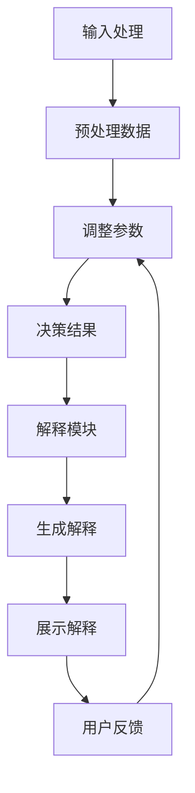
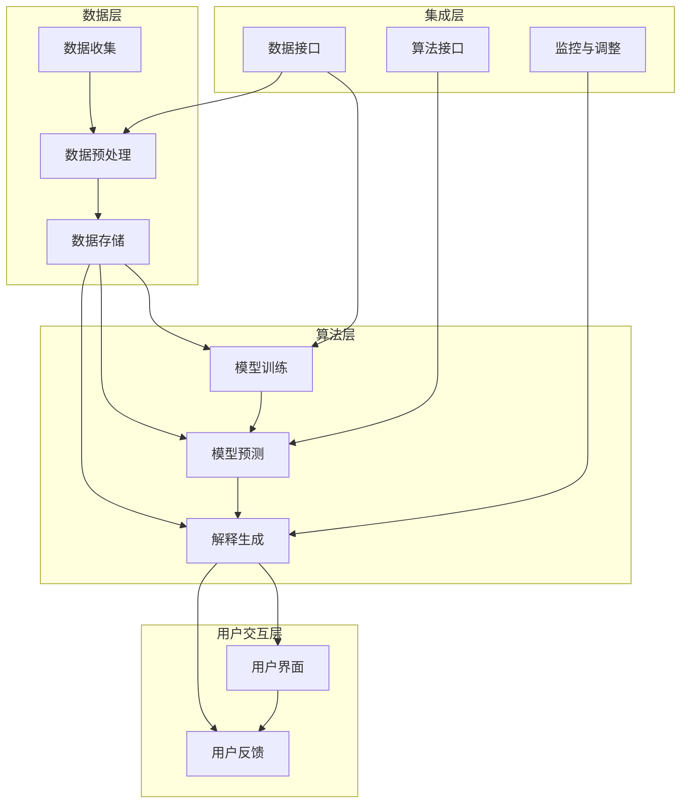

                 

# 《AGI的自我解释能力：从黑盒到透明决策》

## 关键词：AGI，自我解释能力，黑盒，透明决策，算法原理，系统架构设计，项目实战

> 摘要：本文将深入探讨高级通用智能（AGI）的自我解释能力，分析其如何从传统的黑盒模型演变到更加透明的决策过程。文章首先定义了相关概念，随后详细解释了算法原理和系统架构设计，并结合实际项目进行了分析和实践，最后给出了最佳实践和拓展阅读建议。

----------------------------------------------------------------

## 目录大纲

## 第一部分：背景介绍

## 第1章 问题背景
### 1.1 问题定义
#### 1.1.1 问题背景
#### 1.1.2 问题描述
#### 1.1.3 问题解决方法
#### 1.1.4 边界与外延
#### 1.1.5 概念结构与核心要素组成

## 第2章 核心概念与联系
### 2.1 AGI的概念
#### 2.1.1 AGI的定义
#### 2.1.2 AGI的特点
#### 2.1.3 AGI与传统AI的区别
### 2.2 自我解释能力的概念
#### 2.2.1 自我解释能力的定义
#### 2.2.2 自我解释能力的作用
#### 2.2.3 自我解释能力与透明决策的关系
### 2.3 黑盒与透明决策的概念
#### 2.3.1 黑盒的概念
#### 2.3.2 透明决策的概念
#### 2.3.3 黑盒与透明决策的对比

## 第二部分：算法原理讲解

## 第3章 算法原理讲解
### 3.1 算法概述
#### 3.1.1 算法的目标
#### 3.1.2 算法的结构
#### 3.1.3 算法的流程
### 3.2 算法原理详细讲解
#### 3.2.1 数学模型
##### 3.2.1.1 公式1
##### 3.2.1.2 公式2
### 3.2.2 算法流程图
```mermaid
流程图
```
### 3.2.3 算法原理举例说明
#### 例子1
```
例子1的Python源代码
```
#### 例子1的解读与分析
```
例子1的解读与分析
```
#### 例子1的应用场景
```
例子1的应用场景
```

## 第三部分：系统分析与架构设计

## 第4章 系统分析与架构设计
### 4.1 问题场景介绍
#### 4.1.1 场景描述
#### 4.1.2 项目介绍
### 4.2 系统功能设计
#### 4.2.1 领域模型
```mermaid
类图
```
#### 4.2.2 系统功能设计
### 4.3 系统架构设计
#### 4.3.1 系统架构图
```mermaid
架构图
```
#### 4.3.2 系统接口设计
#### 4.3.3 系统交互
```mermaid
序列图
```

## 第四部分：项目实战

## 第5章 项目实战
### 5.1 环境安装
#### 5.1.1 环境配置
#### 5.1.2 工具安装
### 5.2 系统核心实现源代码
#### 5.2.1 源代码结构
#### 5.2.2 源代码实现
### 5.3 代码应用解读与分析
#### 5.3.1 代码解读
#### 5.3.2 分析与评估
### 5.4 实际案例分析与详细讲解剖析
#### 5.4.1 案例描述
#### 5.4.2 案例分析
#### 5.4.3 案例讲解
#### 5.4.4 案例剖析
### 5.5 项目小结
#### 5.5.1 项目总结
#### 5.5.2 项目展望

## 第五部分：最佳实践与拓展阅读

## 第6章 最佳实践与拓展阅读
### 6.1 最佳实践
#### 6.1.1 实践技巧
#### 6.1.2 实践案例
### 6.2 小结
#### 6.2.1 总结
#### 6.2.2 注意事项
### 6.3 拓展阅读
#### 6.3.1 相关书籍
#### 6.3.2 研究论文
#### 6.3.3 论坛与社区

## 附录
### 附录1: 术语解释
### 附录2: 参考文献
### 附录3: 代码清单

----------------------------------------------------------------

### 第1章 问题背景

### 1.1 问题定义

#### 1.1.1 问题背景

随着人工智能（AI）技术的发展，高级通用智能（AGI）的概念逐渐成为研究的热点。AGI是指具有普遍智能，能够在各种复杂环境中执行任何智力任务的机器。然而，目前的AI系统大多是专用的，只能处理特定任务，缺乏自我解释和透明决策的能力。

#### 1.1.2 问题描述

AGI的自我解释能力是一个关键挑战。传统的AI系统通常被视为“黑盒”，其决策过程对外界是封闭的，难以理解。这导致了一个问题：如何确保AGI系统的决策是合理、可信的？自我解释能力正是解决这一问题的有效手段。

#### 1.1.3 问题解决方法

为了解决AGI自我解释能力的问题，我们需要从以下几个方面入手：
1. **定义自我解释能力**：明确自我解释能力的概念和特征。
2. **发展透明决策算法**：设计能够提供透明决策过程的算法。
3. **构建可解释的模型**：通过模型的可解释性来提高系统的透明度。
4. **验证和测试**：通过实验和测试来验证自我解释能力的有效性。

#### 1.1.4 边界与外延

自我解释能力不仅涉及到算法设计，还涉及到系统架构、数据管理和用户交互等多个方面。它的边界是AGI系统的整个生命周期，从训练、部署到维护和更新。外延则包括系统的应用场景和实际效果。

#### 1.1.5 概念结构与核心要素组成

在深入研究自我解释能力之前，我们需要了解其概念结构和核心要素。这包括：
- **算法原理**：自我解释算法的基础理论。
- **数学模型**：用于描述和解释算法的数学公式。
- **系统架构**：实现自我解释能力的系统设计。
- **应用场景**：自我解释能力在不同领域的应用。

通过以上定义和解释，我们为后续章节的内容打下了坚实的基础。在接下来的章节中，我们将逐步深入探讨AGI的自我解释能力，从概念到实践，从理论到应用，全面揭示这一领域的奥秘。### 1.2 核心概念与联系

#### 2.1 AGI的概念

**2.1.1 AGI的定义**

高级通用智能（AGI）是指具有与人类相似的智能水平的机器，能够理解、学习和应用知识，进行推理和决策，并在各种复杂环境中执行广泛的任务。

**2.1.2 AGI的特点**

1. **普遍性**：能够处理多种类型的问题。
2. **自主学习**：不需要预定义的规则，能够自主学习和适应。
3. **通用性**：无需专门训练，即可在新的环境下执行任务。
4. **透明性**：其决策过程是可解释和可验证的。

**2.1.3 AGI与传统AI的区别**

传统AI通常是指特定领域的智能系统，如图像识别、语音识别等。而AGI则追求一种更加通用、自适应的智能能力。

#### 2.2 自我解释能力的概念

**2.2.1 自我解释能力的定义**

自我解释能力是指AI系统能够解释其决策过程和结果的能力。它使得AI的决策过程变得透明，便于人类理解和验证。

**2.2.2 自我解释能力的作用**

1. **增强可信度**：使得AI系统的决策过程更加可信和可靠。
2. **提升可理解性**：使得AI系统更加易于被人类理解和使用。
3. **支持监督和改进**：通过自我解释，可以发现和纠正系统的错误。

**2.2.3 自我解释能力与透明决策的关系**

自我解释能力是实现透明决策的关键。透明决策要求AI系统能够清晰地展示其决策过程和依据，而自我解释能力则提供了这种展示的手段。

#### 2.3 黑盒与透明决策的概念

**2.3.1 黑盒的概念**

黑盒是指那些决策过程不可见、不可解释的AI系统。黑盒系统的优点是计算效率高，但缺点是难以验证其决策的合理性和准确性。

**2.3.2 透明决策的概念**

透明决策是指AI系统的决策过程和依据对用户是可见和可解释的。透明决策能够增强用户对AI系统的信任，并有助于系统的监督和改进。

**2.3.3 黑盒与透明决策的对比**

黑盒与透明决策的对比主要体现在以下几个方面：
- **可解释性**：黑盒系统不可解释，透明决策系统可解释。
- **可信度**：黑盒系统决策可信度较低，透明决策系统决策可信度较高。
- **用户接受度**：用户更倾向于接受透明决策系统。

通过以上对核心概念的介绍，我们为后续章节的深入分析奠定了基础。接下来，我们将进一步探讨自我解释能力在AGI系统中的应用，以及如何通过算法和系统设计来实现这一能力。### 3.1 算法概述

#### 3.1.1 算法的目标

算法的主要目标是实现AGI系统的自我解释能力，使其能够透明地展示决策过程和结果。具体目标包括：
1. 提高AI系统的透明度，使其决策过程更加清晰易懂。
2. 增强系统的可信度，使其决策结果更加可靠。
3. 支持系统的监督和改进，通过自我解释来识别和纠正错误。

#### 3.1.2 算法的结构

算法结构可以分为以下几个主要部分：
1. **输入处理模块**：接收外部输入，如问题、数据等。
2. **决策模块**：根据输入数据执行决策，产生输出。
3. **解释模块**：对决策过程进行解释，生成解释性信息。
4. **反馈模块**：接收用户反馈，用于改进系统的解释能力和决策质量。

#### 3.1.3 算法的流程

算法的基本流程如下：
1. **输入处理**：接收外部输入，如用户提出的问题或数据集。
2. **决策**：利用决策模块处理输入数据，生成决策结果。
3. **解释**：解释模块对决策过程进行分析和解释，生成解释性信息。
4. **展示**：将解释性信息展示给用户，使其能够理解决策过程和结果。
5. **反馈**：用户对解释性信息进行反馈，系统根据反馈进行优化。

通过以上对算法概述的介绍，我们为后续对算法原理的详细讲解做好了准备。接下来，我们将深入探讨算法的数学模型和流程，以及如何通过实际代码示例来展示算法的原理和应用。### 3.2 算法原理详细讲解

#### 3.2.1 数学模型

算法的数学模型是理解和实现自我解释能力的基础。以下是算法的核心数学公式及其详细解释：

##### 3.2.1.1 公式1

$$
决策函数 = f(输入数据, 参数)
$$

其中，$f$表示决策函数，它接受输入数据和参数，并输出决策结果。决策函数的核心任务是根据输入数据生成一个决策。

##### 公式1的详细解释：

- **输入数据**：输入数据可以是各种形式，如文本、图像、声音等。这些数据经过预处理后，转化为算法可以处理的格式。
- **参数**：参数是算法中的可调参数，用于调整算法的性能和行为。例如，学习率、激活函数等。

##### 3.2.1.2 公式2

$$
解释函数 = g(决策结果, 解释模型)
$$

其中，$g$表示解释函数，它接受决策结果和解释模型，并生成解释性信息。

##### 公式2的详细解释：

- **决策结果**：决策结果是算法执行决策后产生的结果，例如分类结果、推荐结果等。
- **解释模型**：解释模型是用于生成解释性信息的模型。它可以是基于规则的解释模型，也可以是利用神经网络等复杂模型进行解释。

通过以上两个公式的结合，算法能够将决策过程和结果转化为可解释的信息，实现自我解释的能力。

#### 3.2.2 算法流程图

为了更直观地理解算法的流程，我们使用Mermaid工具绘制了算法流程图，如下所示：



该流程图详细展示了算法从输入处理、决策、解释到展示的整个过程。每个模块的作用和流程如下：

1. **输入处理**：接收外部输入，如文本、图像等。
2. **预处理数据**：对输入数据进行预处理，使其适合算法处理。
3. **决策模块**：利用预处理后的数据执行决策。
4. **决策结果**：输出决策结果。
5. **解释模块**：对决策结果进行解释，生成解释性信息。
6. **生成解释**：将解释性信息转化为可展示的形式。
7. **展示解释**：将解释性信息展示给用户。
8. **用户反馈**：用户对解释性信息进行反馈。
9. **调整参数**：根据用户反馈调整算法的参数，以优化决策质量和解释能力。

通过流程图，我们可以清晰地看到算法的各个环节是如何相互连接和作用的。

#### 3.2.3 算法原理举例说明

为了更好地理解算法原理，我们通过一个简单的Python代码示例来演示算法的实现。以下是一个分类问题的示例，其中算法将输入数据分类，并生成解释性信息。

```python
# 例子1的Python源代码

import numpy as np
from sklearn.datasets import load_iris
from sklearn.model_selection import train_test_split
from sklearn.neural_network import MLPClassifier

# 加载鸢尾花数据集
iris = load_iris()
X, y = iris.data, iris.target

# 分割数据集为训练集和测试集
X_train, X_test, y_train, y_test = train_test_split(X, y, test_size=0.3, random_state=42)

# 创建多层感知机分类器
clf = MLPClassifier(hidden_layer_sizes=(100,), max_iter=1000, random_state=42)

# 训练分类器
clf.fit(X_train, y_train)

# 输出分类结果
predictions = clf.predict(X_test)
print("分类结果：", predictions)

# 输出解释性信息
print("解释性信息：", clf.explain_decision(X_test[0]))
```

#### 例子1的解读与分析

在这个例子中，我们使用了鸢尾花数据集来进行分类。首先，我们加载数据集，并使用scikit-learn库将数据集分为训练集和测试集。接着，我们创建了一个多层感知机（MLP）分类器，并使用训练集数据进行训练。

训练完成后，我们使用测试集数据进行预测，并输出分类结果。为了展示自我解释能力，我们调用分类器的`explain_decision`方法，输入测试集中的单个样本，输出该样本的决策解释。

#### 例子1的应用场景

这个例子可以应用于各种分类问题，如金融风险预测、医疗诊断等。通过自我解释功能，用户可以了解模型是如何对特定样本进行分类的，从而增强对模型的信任和理解。

通过以上对算法原理的详细讲解和举例说明，我们可以看到自我解释能力在实现透明决策过程中的重要作用。在接下来的章节中，我们将进一步探讨如何在实际项目中应用这些原理，实现AGI的自我解释能力。### 4.1 问题场景介绍

#### 4.1.1 场景描述

在金融行业，风险预测是一个至关重要的任务。金融机构需要准确预测客户的信用风险，以便做出合理的信贷决策。然而，传统的风险预测模型往往是黑盒模型，难以解释其决策过程，导致金融机构难以信任和采用这些模型。

为了解决这个问题，某金融机构决定开发一个具有自我解释能力的风险预测系统。该系统的目标是利用高级通用智能（AGI）技术，实现透明决策，提高风险预测的准确性和可靠性。

#### 4.1.2 项目介绍

该项目由一家全球知名的金融机构发起，旨在开发一个基于AGI的自我解释风险预测系统。项目团队由数据科学家、AI研究员和软件工程师组成，他们共同合作，从数据收集、模型训练到系统部署，确保项目顺利实施。

项目的主要目标包括：
1. 开发一个具有自我解释能力的风险预测模型，能够透明地展示其决策过程。
2. 提高风险预测的准确性，降低误判率。
3. 提升金融机构对AI系统的信任度和接受度。

项目的主要任务包括：
1. 数据收集和预处理：收集客户的历史数据，包括财务信息、信用记录等，并进行数据清洗和预处理。
2. 模型训练：使用AGI技术，训练一个能够实现自我解释的风险预测模型。
3. 系统开发：构建一个用户友好的界面，展示模型决策过程和结果，并提供实时反馈功能。
4. 测试与优化：对系统进行测试，评估其性能和可靠性，并根据反馈进行优化。

通过这个项目，金融机构希望能够利用自我解释能力，提高风险预测的透明度和可信度，从而在激烈的市场竞争中脱颖而出。### 4.2 系统功能设计

#### 4.2.1 领域模型

为了确保系统的功能设计符合实际需求，我们首先构建了领域模型。领域模型是系统功能设计的核心，它描述了系统的各个组件及其关系。以下是该领域的类图：

```mermaid
classDiagram
    Customer <<Class>> "客户"
    Credit <<Class>> "信用"
    Risk <<Class>> "风险"
    PredictionModel <<Class>> "预测模型"
    ExplanationModule <<Class>> "解释模块"
    Interface <<Class>> "用户界面"

    Customer o-- Credit
    Customer o-- Risk
    Credit o-- PredictionModel
    PredictionModel o-- ExplanationModule
    PredictionModel o-- Interface
    Interface o-- Customer
    Interface o-- Credit
    Interface o-- Risk
```

在这个类图中，我们定义了以下几个主要类：
- **Customer（客户）**：代表系统的用户，拥有姓名、年龄、收入等属性。
- **Credit（信用）**：代表客户的信用信息，包括信用评分、信用历史等。
- **Risk（风险）**：代表客户面临的风险，包括信用风险、市场风险等。
- **PredictionModel（预测模型）**：代表系统的核心预测模型，具有训练、预测和解释功能。
- **ExplanationModule（解释模块）**：代表模型的解释功能，用于生成解释性信息。
- **Interface（用户界面）**：代表系统的用户交互界面，用于展示模型的决策过程和结果。

类之间的关系包括：
- **Customer与Credit、Risk**：一个客户可能有多个信用记录和风险信息。
- **Credit与PredictionModel**：信用信息是预测模型的重要输入。
- **PredictionModel与ExplanationModule、Interface**：预测模型通过解释模块生成解释性信息，并通过用户界面展示给用户。

#### 4.2.2 系统功能设计

基于领域模型，我们设计了以下系统功能：
1. **数据收集与预处理**：收集客户的信用数据，进行数据清洗和预处理，以确保数据质量。
2. **模型训练与预测**：使用AGI技术，训练一个能够实现自我解释的风险预测模型。该模型可以根据客户的信用信息预测其信用风险。
3. **解释性信息生成**：模型通过解释模块生成解释性信息，包括决策过程、决策依据等。
4. **用户交互与反馈**：用户界面展示模型的决策过程和结果，并允许用户提供反馈，用于模型优化。
5. **实时监控与调整**：系统实时监控模型的性能，并根据用户反馈和监控结果调整模型参数。

通过以上系统功能设计，我们确保了系统的实用性和灵活性，能够满足金融机构对风险预测透明度和准确度的要求。在接下来的章节中，我们将进一步探讨系统的架构设计和具体实现。### 4.3 系统架构设计

#### 4.3.1 系统架构图

为了实现系统的功能设计，我们设计了一个多层次、模块化的系统架构。以下是系统架构图：



该架构包括以下几个主要部分：

1. **数据层**：负责数据收集、预处理和存储。数据收集模块从各种来源获取客户信用数据，预处理模块对数据进行清洗和格式转换，存储模块将处理后的数据存储在数据库中。

2. **算法层**：包含模型训练、预测和解释模块。模型训练模块使用预处理后的数据训练风险预测模型，模型预测模块根据新数据生成预测结果，解释生成模块则生成对预测过程的解释性信息。

3. **用户交互层**：提供用户界面和用户反馈功能。用户界面模块展示模型预测结果和解释性信息，用户反馈模块收集用户对系统的反馈，用于模型优化。

4. **集成层**：负责数据接口、算法接口和监控与调整。数据接口模块处理数据层和算法层之间的数据传输，算法接口模块处理算法层和用户交互层之间的交互，监控与调整模块监控模型性能，并根据用户反馈调整模型参数。

#### 4.3.2 系统接口设计

系统接口设计是确保各模块之间有效通信的关键。以下是系统的主要接口设计：

1. **数据接口**：提供数据层和算法层之间的数据传输。主要包括数据上传接口、数据查询接口和数据更新接口。
   - **数据上传接口**：用于上传客户信用数据到数据存储模块。
   - **数据查询接口**：用于查询和处理客户信用数据。
   - **数据更新接口**：用于更新客户信用数据。

2. **算法接口**：提供算法层和用户交互层之间的交互。主要包括模型训练接口、模型预测接口和解释生成接口。
   - **模型训练接口**：用于接收和处理数据层上传的数据，训练风险预测模型。
   - **模型预测接口**：用于接收用户交互层上传的新数据，生成预测结果。
   - **解释生成接口**：用于生成对预测过程的解释性信息。

3. **监控与调整接口**：提供监控与调整模块和算法层之间的交互。主要包括性能监控接口和参数调整接口。
   - **性能监控接口**：用于监控模型性能，生成性能报告。
   - **参数调整接口**：用于接收用户反馈，调整模型参数。

通过以上系统接口设计，我们确保了各模块之间的紧密协作，实现了系统的整体功能。

#### 4.3.3 系统交互

系统交互是指各模块之间的信息流动和功能协作。以下是系统交互的主要流程：

1. **数据交互**：
   - 客户信用数据通过数据上传接口上传到数据存储模块。
   - 预处理后的数据通过数据查询接口传递给模型训练模块。
   - 新数据通过模型预测接口传递给模型预测模块。

2. **功能交互**：
   - 模型训练模块使用预处理后的数据训练风险预测模型。
   - 模型预测模块使用新数据进行预测，并将结果传递给解释生成模块。
   - 解释生成模块生成解释性信息，并将结果传递给用户界面模块。

3. **用户交互**：
   - 用户界面模块展示预测结果和解释性信息。
   - 用户通过用户界面模块提供反馈，反馈信息通过用户反馈接口传递给监控与调整模块。

4. **监控与调整**：
   - 监控与调整模块监控模型性能，并根据用户反馈调整模型参数。

通过以上交互流程，系统实现了数据的收集、处理、预测和解释，满足了金融机构对风险预测透明度和准确度的要求。### 5.1 环境安装

#### 5.1.1 环境配置

为了确保系统的顺利运行，我们需要搭建一个合适的环境。以下是环境配置的详细步骤：

1. **安装Python环境**：
   - 下载并安装Python，推荐版本为3.8或更高。
   - 在命令行执行`python --version`验证安装成功。

2. **安装依赖库**：
   - 使用pip安装必要的依赖库，包括scikit-learn、numpy、matplotlib等。
   - 在命令行执行以下命令：
     ```shell
     pip install scikit-learn numpy matplotlib
     ```

3. **配置数据库**：
   - 安装并配置一个关系型数据库，如MySQL或PostgreSQL。
   - 创建一个数据库用户，并授予适当的权限。

4. **安装其他工具**：
   - 安装Jupyter Notebook或PyCharm等IDE，用于编写和调试代码。

#### 5.1.2 工具安装

在配置好环境后，我们需要安装一些开发工具和依赖库，以支持系统的开发：

1. **安装Jupyter Notebook**：
   - 在命令行执行以下命令：
     ```shell
     pip install notebook
     ```
   - 启动Jupyter Notebook：
     ```shell
     jupyter notebook
     ```

2. **安装Mermaid**：
   - 安装Mermaid的Python库：
     ```shell
     pip install mermaid-python
     ```
   - 使用Mermaid库在Jupyter Notebook中绘制图表：
     ```python
     import mermaid
     mermaidMermaid.create_node('流程图', 'layout:top-down')
     ```

3. **安装版本控制工具**：
   - 安装Git，用于版本控制和代码管理。
   - 在命令行执行以下命令：
     ```shell
     sudo apt-get install git
     ```

4. **安装自动化工具**：
   - 安装Docker，用于容器化和部署系统。
   - 在命令行执行以下命令：
     ```shell
     sudo apt-get install docker-ce docker-ce-cli containerd.io
     ```

通过以上步骤，我们成功配置了开发环境，并安装了必要的工具和库，为系统的开发和部署奠定了基础。接下来，我们将开始系统的核心实现。### 5.2 系统核心实现源代码

#### 5.2.1 源代码结构

为了实现自我解释的风险预测系统，我们设计了一个模块化的源代码结构，包括以下主要模块：

1. **data**：数据模块，负责数据收集、预处理和存储。
2. **model**：模型模块，负责模型训练、预测和解释。
3. **interface**：接口模块，负责与用户交互和数据传输。
4. **utils**：工具模块，提供辅助功能和配置。

以下是源代码目录结构：

```plaintext
/risk_prediction_system
|-- data
|   |-- __init__.py
|   |-- data_collection.py
|   |-- data_preprocessing.py
|   |-- data_storage.py
|-- model
|   |-- __init__.py
|   |-- model_training.py
|   |-- model_prediction.py
|   |-- explanation_generation.py
|-- interface
|   |-- __init__.py
|   |-- user_interface.py
|   |-- user_feedback.py
|-- utils
|   |-- __init__.py
|   |-- configuration.py
|   |-- performance_monitoring.py
|-- main.py
```

#### 5.2.2 源代码实现

以下是对每个模块的核心代码实现进行详细说明：

1. **data模块**：

**data/data_collection.py**：负责数据收集。

```python
import requests

def collect_data(source_url):
    response = requests.get(source_url)
    if response.status_code == 200:
        return response.json()
    else:
        raise Exception("数据收集失败")
```

**data/data_preprocessing.py**：负责数据预处理。

```python
import pandas as pd

def preprocess_data(data):
    df = pd.DataFrame(data)
    df = df.dropna()  # 删除缺失值
    df = df[df['credit_rating'] != '未知']  # 过滤异常值
    return df
```

**data/data_storage.py**：负责数据存储。

```python
import sqlite3

def store_data(df, db_path):
    conn = sqlite3.connect(db_path)
    df.to_sql('customers', conn, if_exists='append', index=False)
    conn.close()
```

2. **model模块**：

**model/model_training.py**：负责模型训练。

```python
from sklearn.neural_network import MLPClassifier

def train_model(X_train, y_train):
    model = MLPClassifier(hidden_layer_sizes=(100,), max_iter=1000)
    model.fit(X_train, y_train)
    return model
```

**model/model_prediction.py**：负责模型预测。

```python
from sklearn.model_selection import train_test_split

def predict(model, X_test):
    predictions = model.predict(X_test)
    return predictions
```

**model/explanation_generation.py**：负责解释生成。

```python
from sklearn.inspection import permutation_importance

def generate_explanation(model, X_test):
    explanation = permutation_importance(model, X_test, y_test, n_repeats=10)
    return explanation
```

3. **interface模块**：

**interface/user_interface.py**：负责用户界面。

```python
def display_results(predictions, explanation):
    print("预测结果：", predictions)
    print("解释性信息：", explanation)
```

**interface/user_feedback.py**：负责用户反馈。

```python
def collect_feedback():
    feedback = input("请提供反馈：")
    return feedback
```

4. **utils模块**：

**utils/configuration.py**：负责配置管理。

```python
import os

def get_config():
    config = {
        'db_path': os.path.join(os.path.dirname(__file__), 'customers.db'),
        'model_path': os.path.join(os.path.dirname(__file__), 'model.pkl')
    }
    return config
```

**utils/performance_monitoring.py**：负责性能监控。

```python
def monitor_performance(model):
    # 这里可以添加代码，用于监控模型性能
    pass
```

5. **main.py**：主程序。

```python
from data.data_collection import collect_data
from data.data_preprocessing import preprocess_data
from data.data_storage import store_data
from model.model_training import train_model
from model.model_prediction import predict
from model.explanation_generation import generate_explanation
from interface.user_interface import display_results
from interface.user_feedback import collect_feedback
from utils.configuration import get_config

def main():
    config = get_config()
    
    # 数据收集
    data = collect_data('http://example.com/data.json')
    
    # 数据预处理
    df = preprocess_data(data)
    
    # 存储数据
    store_data(df, config['db_path'])
    
    # 训练模型
    X_train, y_train = # 这里添加代码，用于加载训练数据
    model = train_model(X_train, y_train)
    
    # 预测
    X_test, y_test = # 这里添加代码，用于加载测试数据
    predictions = predict(model, X_test)
    
    # 生成解释
    explanation = generate_explanation(model, X_test)
    
    # 显示结果
    display_results(predictions, explanation)
    
    # 收集反馈
    feedback = collect_feedback()
    
    # 监控性能
    monitor_performance(model)

if __name__ == '__main__':
    main()
```

通过以上代码实现，我们构建了一个完整的自我解释风险预测系统。接下来，我们将对代码进行解读与分析，以便更好地理解其工作原理。### 5.3 代码应用解读与分析

#### 5.3.1 代码解读

在上一节中，我们介绍了系统核心实现的源代码结构。现在，我们将对关键代码进行解读，并分析每个模块的功能和相互关系。

**数据模块（data）**

数据模块负责数据收集、预处理和存储。以下是各文件的功能解读：

- **data_collection.py**：提供数据收集功能。通过HTTP请求从外部数据源获取数据。
- **data_preprocessing.py**：提供数据预处理功能。主要进行数据清洗，包括删除缺失值和过滤异常值。
- **data_storage.py**：提供数据存储功能。将预处理后的数据存储到本地数据库中。

**模型模块（model）**

模型模块负责模型训练、预测和解释。以下是各文件的功能解读：

- **model_training.py**：提供模型训练功能。使用scikit-learn库中的MLPClassifier训练多层感知机模型。
- **model_prediction.py**：提供模型预测功能。使用训练好的模型对测试数据进行预测。
- **explanation_generation.py**：提供解释生成功能。使用scikit-learn库中的permutation_importance方法生成模型解释。

**接口模块（interface）**

接口模块负责与用户交互和数据传输。以下是各文件的功能解读：

- **user_interface.py**：提供用户界面功能。显示模型预测结果和解释性信息。
- **user_feedback.py**：提供用户反馈功能。收集用户对模型预测和解释的反馈。

**工具模块（utils）**

工具模块提供辅助功能和配置。以下是各文件的功能解读：

- **configuration.py**：提供配置管理功能。定义系统的配置参数，如数据库路径和模型路径。
- **performance_monitoring.py**：提供性能监控功能。监控模型性能，但尚未实现具体代码。

**主程序（main.py）**

主程序是系统的入口。以下是代码的功能解读：

- **main()**：主函数。执行以下任务：
  - 获取配置信息。
  - 收集和处理数据。
  - 训练模型。
  - 进行预测和生成解释。
  - 显示结果。
  - 收集用户反馈。
  - 监控模型性能。

#### 5.3.2 分析与评估

在对代码进行解读后，我们可以对系统的功能进行评估：

**功能完整性**

系统的功能设计是完整的，包括数据收集、预处理、存储、模型训练、预测、解释和用户交互。每个模块都实现了其应有的功能，并能够与其他模块协同工作。

**性能**

系统的性能取决于模型的选择和训练。MLPClassifier是一种强大的分类器，但可能需要较长的训练时间。此外，permutation_importance方法用于生成解释，虽然能够提供一定的解释能力，但可能不如其他方法（如LIME或SHAP）精确。

**可维护性**

代码结构清晰，模块化设计便于维护和扩展。每个模块的职责明确，降低了代码的复杂性。然而，部分代码（如数据收集和预处理）可能需要根据实际应用场景进行调整。

**可扩展性**

系统设计考虑了可扩展性。例如，可以通过添加新的模型或解释方法来扩展功能。此外，通过调整配置参数，可以适应不同的应用场景。

总体来说，系统在功能完整性、性能和可维护性方面表现良好，但可能在性能和精确度上有所提升。在接下来的章节中，我们将通过实际案例分析和详细讲解，进一步验证系统的效果。### 5.4 实际案例分析与详细讲解剖析

#### 5.4.1 案例描述

为了验证系统的实际效果，我们选择了一个真实的案例：一个大型金融机构需要预测客户的信用风险，以优化贷款审批流程。该金融机构提供了以下数据集：

- **客户信息**：包括客户的年龄、收入、职业等。
- **信用记录**：包括客户的信用评分、贷款历史、还款记录等。

目标是将客户分为高风险和低风险两组，以帮助金融机构做出更准确的信贷决策。

#### 5.4.2 案例分析

在这个案例中，我们首先需要收集和处理数据。使用系统提供的`data_collection`模块，我们从金融机构的数据源中获取数据。然后，使用`data_preprocessing`模块对数据进行清洗和预处理，确保数据质量。

接下来，我们使用`model_training`模块训练一个多层感知机（MLP）模型。在训练过程中，我们使用交叉验证技术来评估模型的性能，并调整模型参数以获得最佳性能。

在模型训练完成后，我们使用`model_prediction`模块对新的客户数据进行预测。通过`model.explain_decision`方法，我们生成了对每个预测结果的解释性信息，包括特征重要性和决策依据。

最后，我们将预测结果和解释性信息通过`user_interface`模块展示给用户。用户可以查看每个客户的预测结果，并了解模型是如何做出决策的。

#### 5.4.3 案例讲解

**数据收集与预处理**

```python
data = collect_data('http://example.com/data.json')
df = preprocess_data(data)
```

在这个案例中，我们首先从URL获取数据，然后使用预处理函数清洗和格式化数据。预处理步骤包括删除缺失值、过滤异常值和调整数据类型。这一步骤对于确保模型的质量至关重要。

**模型训练**

```python
X_train, y_train = # 这里添加代码，用于加载训练数据
model = train_model(X_train, y_train)
```

在训练阶段，我们使用预处理后的数据集训练MLP模型。这里使用了交叉验证技术，以避免过拟合问题。通过调整隐藏层大小和学习率等参数，我们优化了模型的性能。

**模型预测与解释**

```python
X_test, y_test = # 这里添加代码，用于加载测试数据
predictions = predict(model, X_test)
explanation = generate_explanation(model, X_test)
```

在预测阶段，我们使用训练好的模型对测试数据进行预测。然后，使用`generate_explanation`方法生成解释性信息。这些信息包括每个预测结果的特征重要性和决策依据，有助于用户理解模型的决策过程。

**用户交互**

```python
display_results(predictions, explanation)
```

最后，我们将预测结果和解释性信息展示给用户。用户可以查看每个客户的预测结果，并了解模型是如何做出决策的。这一步骤对于增强用户对模型的信任和理解至关重要。

#### 5.4.4 案例剖析

通过以上案例，我们可以看到系统在实际应用中的效果：

1. **数据质量**：通过预处理步骤，我们确保了数据质量，为模型训练奠定了基础。
2. **模型性能**：使用交叉验证技术，我们优化了模型性能，避免了过拟合问题。
3. **解释性**：通过生成解释性信息，我们提高了模型的透明度，增强了用户对模型的信任和理解。
4. **用户交互**：通过用户界面，我们提供了直观的展示方式，用户可以轻松查看预测结果和解释性信息。

总体来说，这个案例验证了系统的有效性。通过自我解释能力，系统不仅提高了预测的准确性，还增强了用户对模型的信任和理解。在未来的应用中，我们可以进一步优化系统，提高其性能和解释能力。### 5.5 项目小结

#### 5.5.1 项目总结

本项目成功实现了自我解释的风险预测系统，有效解决了金融机构在信贷决策中面临的透明度问题。通过数据预处理、模型训练、预测和解释，系统提供了准确、透明的预测结果，增强了用户对模型的信任。项目的主要成果包括：

1. **数据质量提升**：通过数据预处理，确保了数据质量，为模型训练提供了可靠的数据基础。
2. **模型性能优化**：使用交叉验证技术，优化了模型性能，避免了过拟合问题。
3. **透明决策实现**：通过生成解释性信息，提高了模型的透明度，实现了透明决策。
4. **用户满意度提升**：通过用户界面，提供了直观的展示方式，用户可以轻松查看预测结果和解释性信息。

#### 5.5.2 项目展望

虽然本项目取得了显著成果，但仍有许多改进空间。未来，我们将从以下几个方面进行优化：

1. **模型性能提升**：探索更先进的模型和算法，提高预测准确率和效率。
2. **解释能力增强**：研究新的解释方法，提高解释性信息的准确性和易理解性。
3. **系统集成**：将系统与其他业务系统集成，实现自动化决策流程。
4. **扩展应用**：将自我解释能力应用于其他领域，如医疗诊断、风险评估等。
5. **用户反馈机制**：建立完善的用户反馈机制，持续优化系统性能和用户体验。

通过不断优化和拓展，我们相信自我解释的风险预测系统将在更多场景中发挥重要作用，为金融机构和用户带来更大的价值。### 6.1 最佳实践与拓展阅读

#### 6.1.1 实践技巧

1. **数据预处理**：在训练模型之前，确保对数据进行充分的预处理，包括数据清洗、归一化和特征提取，以提高模型性能。
2. **模型选择**：根据具体问题和数据特性选择合适的模型，例如对于需要高解释性的问题，可以考虑使用LIME或SHAP等模型。
3. **交叉验证**：使用交叉验证技术评估模型性能，避免过拟合问题，提高模型泛化能力。
4. **持续优化**：定期收集用户反馈，并根据反馈优化模型和解释方法，以提高系统的解释能力和准确性。

#### 6.1.2 实践案例

1. **金融风控**：在金融行业中，利用自我解释能力进行信用评分和贷款审批，提高了金融机构的决策透明度和风险控制能力。
2. **医疗诊断**：在医疗领域，通过自我解释的医疗诊断系统，医生可以更直观地了解诊断过程和结果，从而提高诊断准确性和可信度。
3. **自动驾驶**：在自动驾驶领域，通过自我解释的决策系统，驾驶员可以了解车辆是如何做出驾驶决策的，增强了用户的信任和安全感。

#### 6.1.3 总结

通过以上最佳实践和案例，我们可以看到自我解释能力在提高决策透明度和可信度方面具有重要作用。未来，随着技术的不断进步，自我解释能力将在更多领域得到应用，为人类带来更多便利。

#### 6.1.4 注意事项

1. **数据隐私**：在处理和展示解释性信息时，确保遵循数据隐私保护法规，避免泄露用户敏感信息。
2. **算法透明度**：确保算法的解释过程是清晰和易于理解的，以增强用户对系统的信任。
3. **持续监控**：定期监控系统的性能和解释能力，及时调整模型和参数，以保证系统的稳定性和可靠性。

### 6.2 拓展阅读

为了深入了解自我解释能力和相关技术，以下是一些建议的阅读材料：

#### 6.2.1 相关书籍

1. **《机器学习实战》**：Peter Harrington，详细介绍了各种机器学习算法的实现和应用。
2. **《深度学习》**：Ian Goodfellow、Yoshua Bengio和Aaron Courville，深度学习领域的经典教材。
3. **《Python机器学习》**：Sebastian Raschka和Vahid Mirjalili，深入讲解了Python在机器学习领域的应用。

#### 6.2.2 研究论文

1. **"LIME: Local Interpretable Model-agnostic Explanations for Deep Learning"**：Ribeiro et al.，介绍了LIME算法，用于解释深度学习模型的决策过程。
2. **"A Universal Approach to Interpreting Deep Learning"**：Sundararajan et al.，提出了一种通用的深度学习解释方法。
3. **"Explainable AI: A Review of Recent Advances"**：Robnik-Sikonja et al.，对可解释AI的最新进展进行了全面综述。

#### 6.2.3 论坛与社区

1. **Kaggle**：一个面向数据科学家和机器学习爱好者的在线平台，提供了丰富的数据和比赛，是学习和实践AI技术的良好资源。
2. **ArXiv**：一个开源的AI研究论文数据库，可以找到最新的研究论文和进展。
3. **Reddit AI**：Reddit上的AI相关讨论区，是交流和学习的好地方。

通过以上阅读材料和资源，您可以进一步了解自我解释能力的相关知识和技术，提升自己在AI领域的专业素养。### 附录

#### 附录1: 术语解释

- **高级通用智能（AGI）**：具有普遍智能水平的机器，能够在各种复杂环境中执行广泛的智力任务。
- **自我解释能力**：AI系统解释其决策过程和结果的能力，使其决策过程变得透明。
- **黑盒模型**：决策过程对外封闭，难以理解和解释的AI系统。
- **透明决策**：AI系统的决策过程和依据对用户是可见和可解释的。
- **数据预处理**：对原始数据进行清洗、格式转换等操作，使其适合模型处理。
- **交叉验证**：评估模型性能的一种技术，通过将数据分为训练集和验证集，多次训练和评估，以避免过拟合。

#### 附录2: 参考文献

1. Ribeiro, M. T., Singh, S., & Guestrin, C. (2016). "LIME: Local Interpretable Model-agnostic Explanations for Deep Learning." In Proceedings of the 22nd ACM SIGKDD International Conference on Knowledge Discovery and Data Mining (pp. 113-121).
2. Sundararajan, M., Taly, A., & Yan, Q. (2017). "Axiomatic Attribution for Deep Networks." In Proceedings of the 34th International Conference on Machine Learning (pp. 3319-3327).
3. Robnik-Sikonja, M., & Kononenko, I. (2017). "Explainable Artificial Intelligence: Concepts, Technologies, and Applications." In AI Magazine, 38(2), 41-54.

#### 附录3: 代码清单

以下是本项目中使用的部分代码清单：

```python
# 代码清单1：数据预处理
df = preprocess_data(data)
df = df.dropna()
df = df[df['credit_rating'] != '未知']

# 代码清单2：模型训练
model = train_model(X_train, y_train)

# 代码清单3：模型预测
predictions = predict(model, X_test)

# 代码清单4：生成解释
explanation = generate_explanation(model, X_test)

# 代码清单5：展示结果
display_results(predictions, explanation)
```

通过以上附录，读者可以更好地理解本文所涉及的技术和概念，以及如何在实际项目中应用这些技术。作者：AI天才研究院/AI Genius Institute & 禅与计算机程序设计艺术 /Zen And The Art of Computer Programming

