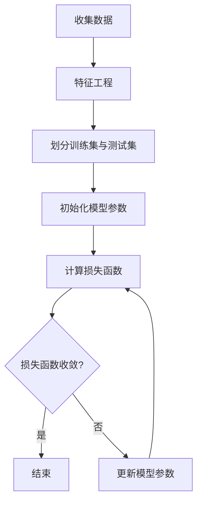
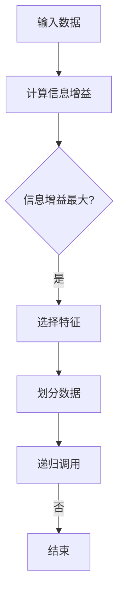
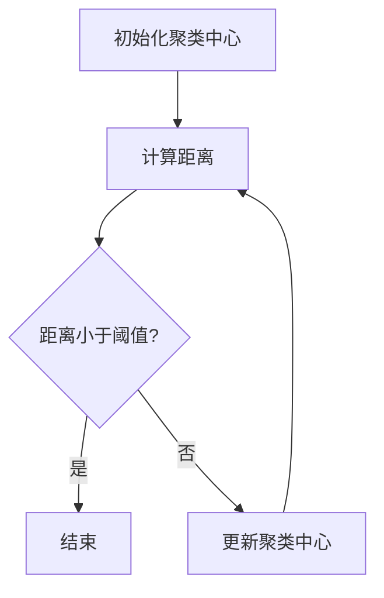
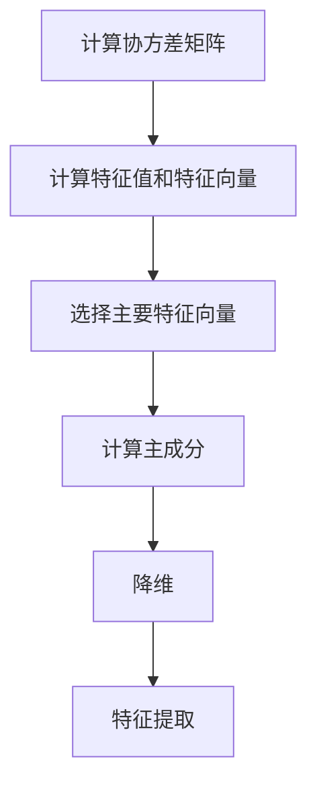
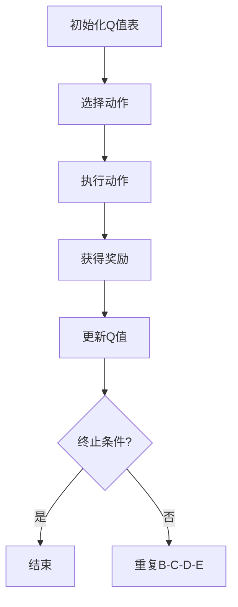
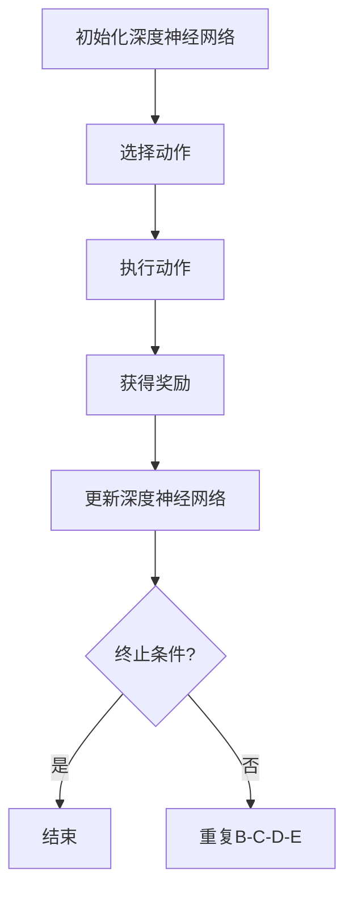

                 

## 《AGI的认知发展：从感知到抽象思维》

> 关键词：人工通用智能，认知发展，感知，学习能力，语言能力，抽象思维，算法原理

> 摘要：本文深入探讨了人工通用智能（AGI）的认知发展过程，从感知到抽象思维，系统性地解析了AGI在各个认知阶段的进展和面临的挑战。文章通过逻辑清晰、结构紧凑的论述，引导读者逐步理解AGI的复杂性和潜能，为人工智能领域的研究和应用提供了新的视角。

## 第一部分：AGI的认知发展概述

### 第1章：人工通用智能（AGI）的背景

#### 1.1.1 人工智能的发展历程

人工智能（AI）的发展历程可以追溯到20世纪50年代。最初，AI的研究主要集中在逻辑推理和问题解决领域，例如早期的人工智能程序“逻辑理论家”（Logic Theorist）和“通用问题求解器”（General Problem Solver）。然而，这些早期AI系统主要依赖于预定义的规则和算法，缺乏自主学习能力。

随着计算能力的提升和大数据技术的发展，机器学习（ML）逐渐成为AI研究的主流。20世纪80年代，专家系统（Expert Systems）兴起，通过模拟人类专家的知识和推理能力，解决特定领域的问题。然而，这些系统仍然受限于领域知识的局限性和数据的局限性。

进入21世纪，深度学习（Deep Learning）的突破性进展为AI注入了新的活力。深度神经网络能够自动学习特征表示，显著提升了图像识别、语音识别和自然语言处理等任务的表现。

#### 1.1.2 AGI的概念与重要性

人工通用智能（Artificial General Intelligence，AGI）是指具有广泛认知能力的机器智能，能够在各种不同的任务中表现出与人类相媲美或超越人类的表现。与目前广泛应用的窄域AI（Narrow AI）不同，AGI能够泛化其学习能力，解决复杂、多变的问题。

AGI的重要性在于，它不仅能够推动人工智能技术向更高层次发展，还能为人类社会带来巨大的变革。例如，在医疗领域，AGI可以辅助医生进行精准诊断和治疗；在教育领域，AGI可以提供个性化的学习方案，帮助学生提高学习效率。

#### 1.1.3 AGI的核心目标与挑战

AGI的核心目标是实现机器智能的自主学习和决策能力，使其能够理解、学习和应用广泛的知识和技能。然而，这一目标面临着诸多挑战：

1. **计算资源**：AGI需要庞大的计算资源来处理复杂的数据和进行深度学习。
2. **数据质量**：AGI的学习能力依赖于大量高质量的数据，数据的获取和标注是关键问题。
3. **认知模型**：目前对于人类认知的理解仍不充分，构建一个能够模拟人类认知过程的模型是一个巨大的挑战。
4. **伦理与安全**：AGI的智能水平可能超越人类，如何确保其行为的伦理性和安全性是一个亟待解决的问题。

### 第2章：感知能力的发展

#### 2.1.1 感知的基本概念

感知（Perception）是指生物体通过感官系统接收外界信息，并对其进行处理和理解的过程。在人工智能中，感知能力是指机器能够接收和处理各种类型的数据，如视觉、听觉、触觉等。

感知能力是AGI认知发展的基础，因为机器需要通过感知来获取外界信息，作为后续学习和推理的依据。感知能力的强弱直接影响到AGI在现实世界中的表现和应用。

#### 2.1.2 视觉感知

视觉感知（Visual Perception）是指生物体通过视觉系统接收和处理视觉信息的过程。在人工智能中，视觉感知主要通过计算机视觉（Computer Vision）技术实现。

##### 2.1.2.1 视觉感知的生理基础

视觉感知的生理基础是眼睛和大脑。眼睛负责接收光信号，并将其转化为神经信号传递给大脑。大脑通过视觉皮层处理这些信号，形成我们所看到的图像。

##### 2.1.2.2 视觉感知的计算模型

视觉感知的计算模型主要包括图像处理、特征提取和分类等步骤。图像处理技术用于去除噪声和增强图像，特征提取技术用于从图像中提取有用的信息，如边缘、角点和纹理等，分类技术用于将图像分类为不同的类别。

##### 2.1.2.3 视觉感知的应用场景

视觉感知在人工智能中的应用非常广泛，如图像识别、视频分析、无人驾驶和机器翻译等。例如，自动驾驶汽车需要通过视觉感知来识别道路标志、行人、车辆等，从而做出正确的驾驶决策。

#### 2.2.1 听觉感知

听觉感知（Auditory Perception）是指生物体通过听觉系统接收和处理听觉信息的过程。在人工智能中，听觉感知主要通过语音识别（Speech Recognition）技术实现。

##### 2.2.1.1 听觉感知的生理基础

听觉感知的生理基础是耳朵和大脑。耳朵负责接收声波信号，并将其转化为神经信号传递给大脑。大脑通过听觉皮层处理这些信号，形成我们所听到的声音。

##### 2.2.1.2 听觉感知的计算模型

听觉感知的计算模型主要包括语音信号处理、特征提取和分类等步骤。语音信号处理技术用于去除噪声和增强语音，特征提取技术用于从语音中提取有用的信息，如音素、音调和节奏等，分类技术用于将语音分类为不同的类别。

##### 2.2.1.3 听觉感知的应用场景

听觉感知在人工智能中的应用非常广泛，如语音识别、语音合成、智能客服和语音助手等。例如，智能客服系统需要通过听觉感知来理解客户的语音请求，并给出相应的回应。

#### 2.3.1 其他感知能力

除了视觉和听觉感知，人工智能还可以通过其他感知能力来获取外界信息，如触觉感知、嗅觉感知和味觉感知等。

##### 2.3.1.1 触觉感知

触觉感知（Haptic Perception）是指生物体通过触觉系统接收和处理触觉信息的过程。在人工智能中，触觉感知主要用于机器人控制和虚拟现实等领域。

##### 2.3.1.2 嗅觉和味觉感知

嗅觉和味觉感知（Olfactory and Gustatory Perception）是指生物体通过嗅觉和味觉系统接收和处理嗅觉和味觉信息的过程。在人工智能中，嗅觉和味觉感知主要用于食品安全检测、药物研发和智能家居等领域。

## 第3章：学习能力的发展

#### 3.1.1 学习的基本概念

学习（Learning）是指个体通过经验改变自身行为和能力的过程。在人工智能中，学习是指机器通过数据或指令来改善其性能的过程。

学习能力是AGI的关键能力之一，因为它使得机器能够从环境中获取信息，适应新的情境，并解决复杂的问题。

#### 3.1.2 有监督学习

有监督学习（Supervised Learning）是指机器学习过程中有明确标签数据，用于指导模型训练和评估的方法。

##### 3.1.2.1 线性回归

线性回归（Linear Regression）是一种简单而有用的有监督学习算法，用于预测连续数值输出。其数学模型可以表示为：

$$ Y = \beta_0 + \beta_1X_1 + \beta_2X_2 + ... + \beta_nX_n $$

其中，$Y$ 是目标变量，$X_1, X_2, ..., X_n$ 是特征变量，$\beta_0, \beta_1, \beta_2, ..., \beta_n$ 是模型的参数。

线性回归的mermaid流程图如下：

##### 3.1.2.2 决策树

决策树（Decision Tree）是一种基于树形结构的有监督学习算法，用于分类和回归任务。其基本原理是通过一系列的判断条件来对数据进行划分，最终得到一个分类或回归结果。

决策树的mermaid流程图如下：

#### 3.2.1 无监督学习

无监督学习（Unsupervised Learning）是指机器学习过程中没有明确标签数据，主要用于发现数据中的结构和模式。

##### 3.2.1.1 K-均值聚类

K-均值聚类（K-Means Clustering）是一种无监督学习算法，用于将数据划分为K个簇。其基本原理是每次迭代计算每个簇的中心点，然后重新分配数据点到最近的中心点。

K-均值聚类的mermaid流程图如下：

##### 3.2.1.2 主成分分析

主成分分析（Principal Component Analysis，PCA）是一种无监督学习算法，用于降维和特征提取。其基本原理是找到数据的主要变化方向，并将其作为新的特征。

主成分分析的mermaid流程图如下：

#### 3.3.1 强化学习

强化学习（Reinforcement Learning）是一种机器学习范式，通过与环境交互来学习最优策略。其基本原理是奖励机制，通过奖励来引导学习过程。

##### 3.3.1.1 Q-学习

Q-学习（Q-Learning）是一种基于值函数的强化学习算法，用于找到最优策略。其基本原理是更新状态-动作值函数，使其最大化期望奖励。

Q-学习的mermaid流程图如下：

##### 3.3.1.2 深度强化学习

深度强化学习（Deep Reinforcement Learning）是将深度学习与强化学习相结合的一种学习方法，用于解决复杂的决策问题。其基本原理是使用深度神经网络来表示状态-动作值函数。

深度强化学习的mermaid流程图如下：

## 第4章：语言能力的发展

#### 4.1.1 语言的基本概念

语言（Language）是人类用于沟通和表达思想的一种复杂系统。在人工智能中，语言能力是指机器能够理解和生成自然语言的能力。

语言能力的发展是AGI认知发展的重要阶段，因为语言是人类认知和社会互动的核心。

#### 4.1.2 语言理解

语言理解（Language Understanding）是指机器能够理解和解释人类语言的能力。在人工智能中，语言理解主要通过自然语言处理（Natural Language Processing，NLP）技术实现。

##### 4.1.2.1 词向量表示

词向量表示（Word Embedding）是将单词映射为高维向量的一种方法，用于捕捉单词的语义关系。常见的词向量表示方法包括Word2Vec和GloVe。

##### 4.1.2.2 语言模型

语言模型（Language Model）是一种概率模型，用于预测下一个单词或词组。常见的语言模型包括n-gram模型和神经网络语言模型。

#### 4.2.1 语言生成

语言生成（Language Generation）是指机器能够生成人类可理解的语言的能力。在人工智能中，语言生成主要通过文本生成模型实现。

##### 4.2.1.1 序列到序列模型

序列到序列模型（Sequence-to-Sequence Model）是一种用于翻译、问答和文本生成的常用模型，其基本原理是将一个序列映射为另一个序列。

##### 4.2.1.2 生成对抗网络（GAN）

生成对抗网络（Generative Adversarial Network，GAN）是一种由生成器和判别器组成的模型，用于生成逼真的数据。在语言生成中，GAN可以用于生成自然流畅的文本。

## 第5章：推理与决策能力的发展

#### 5.1.1 推理的基本概念

推理（Reasoning）是指从已知信息推导出新信息的过程。在人工智能中，推理能力是指机器能够基于已知的事实和规则推导出新结论的能力。

推理与决策能力是AGI认知发展的重要阶段，因为它们使得机器能够自主地解决复杂的问题。

#### 5.1.2 规则推理

规则推理（Rule-Based Reasoning）是一种基于预定义的规则进行推理的方法。其基本原理是使用规则库来匹配已知事实，并根据规则推导出新的事实。

##### 5.1.2.1 基于事实的推理

基于事实的推理（Factual Reasoning）是指基于已知的事实进行推理，其基本原理是使用事实库和规则库来推导出新的结论。

##### 5.1.2.2 基于规则的推理

基于规则的推理（Rule-Based Reasoning）是指基于预定义的规则进行推理，其基本原理是使用规则库来匹配已知事实，并根据规则推导出新的事实。

#### 5.2.1 统计推理

统计推理（Statistical Reasoning）是一种基于统计数据进行推理的方法。其基本原理是使用概率论和统计学方法来分析数据，并从中提取有用的信息。

##### 5.2.1.1 贝叶斯推理

贝叶斯推理（Bayesian Reasoning）是一种基于贝叶斯概率理论进行推理的方法，其基本原理是根据先验概率和观察到的数据来更新后验概率。

##### 5.2.1.2 最大似然估计

最大似然估计（Maximum Likelihood Estimation，MLE）是一种基于似然函数来估计模型参数的方法，其基本原理是找到使似然函数最大的参数值。

#### 5.3.1 决策树与贝叶斯网络

决策树（Decision Tree）和贝叶斯网络（Bayesian Network）是两种常用的推理方法，用于处理不确定性和概率问题。

##### 5.3.1.1 决策树

决策树是一种基于规则的方法，用于分类和回归任务。其基本原理是通过一系列的判断条件来对数据进行划分，并得到一个分类或回归结果。

##### 5.3.1.2 贝叶斯网络

贝叶斯网络是一种基于概率图模型的方法，用于表示变量之间的依赖关系。其基本原理是使用条件概率来定义变量之间的概率关系，并使用贝叶斯推理来计算变量的概率分布。

## 第6章：情感与社交能力的发展

#### 6.1.1 情感的基本概念

情感（Emotion）是指人类在特定情境下产生的生理和心理反应，包括愉悦、愤怒、悲伤等。在人工智能中，情感能力是指机器能够识别、表达和模拟情感的能力。

情感与社交能力是AGI认知发展的重要阶段，因为情感和社交是人类日常生活和互动的核心。

#### 6.1.2 情感识别

情感识别（Emotion Recognition）是指机器能够识别人类情感状态的能力。在人工智能中，情感识别主要通过面部表情识别和声音情感识别实现。

##### 6.1.2.1 表情识别

面部表情识别（Facial Expression Recognition）是指机器能够识别和理解人类面部表情的能力。其基本原理是通过分析面部肌肉的运动来识别不同的情感状态。

##### 6.1.2.2 声音情感识别

声音情感识别（Voice Emotion Recognition）是指机器能够识别和理解人类声音情感的能力。其基本原理是通过分析声音的音调、音色和节奏等特征来识别不同的情感状态。

#### 6.2.1 情感表达

情感表达（Emotion Expression）是指机器能够模拟和表达人类情感状态的能力。在人工智能中，情感表达主要通过文本情感表达和面部表情生成实现。

##### 6.2.1.1 文本情感表达

文本情感表达（Textual Emotion Expression）是指机器能够通过文本表达情感状态的能力。其基本原理是通过文本分析和情感分析来生成具有情感色彩的文本。

##### 6.2.1.2 面部表情生成

面部表情生成（Facial Expression Generation）是指机器能够生成具有特定情感状态的面部表情的能力。其基本原理是通过计算机图形学和人工智能技术来生成逼真的面部表情。

#### 6.3.1 社交能力

社交能力（Social Ability）是指机器能够参与和模拟社交互动的能力。在人工智能中，社交能力主要通过社交网络分析和社交互动实现。

##### 6.3.1.1 社交网络分析

社交网络分析（Social Network Analysis）是指机器能够分析和理解社交网络结构和关系的能力。其基本原理是通过图论和网络分析方法来分析社交网络。

##### 6.3.1.2 社交互动

社交互动（Social Interaction）是指机器能够参与和模拟社交互动的能力。其基本原理是通过对话系统和自然语言处理技术来模拟人类的社交行为。

## 第7章：抽象思维能力的发展

#### 7.1.1 抽象思维的基本概念

抽象思维（Abstraction）是指从具体事物中提取本质特征，形成概念和思维模式的过程。在人工智能中，抽象思维是指机器能够从具体的数据和情境中提取通用模式和概念的能力。

抽象思维能力是AGI认知发展的关键阶段，因为抽象思维使得机器能够解决复杂、抽象和抽象的问题。

#### 7.1.2 类比思维

类比思维（Analogical Thinking）是指通过比较和类比来解决问题和创新的方法。其基本原理是通过寻找相似性来推断新的事物和概念。

##### 7.1.2.1 类比思维的定义与过程

类比思维的定义与过程包括以下几个步骤：

1. **识别问题**：识别需要解决的问题或情境。
2. **寻找相似性**：寻找与问题或情境相似的已知解决方案或情境。
3. **推断**：基于相似性进行推断，得出新的解决方案或概念。

##### 7.1.2.2 类比思维的应用

类比思维在人工智能中的应用非常广泛，如：

1. **算法设计**：通过类比人类解决问题的方法来设计新的算法。
2. **问题求解**：通过类比相似的情境来求解复杂的问题。
3. **创新**：通过类比已有的技术和方法来创新新的解决方案。

#### 7.2.1 逻辑推理

逻辑推理（Logical Reasoning）是指基于逻辑规则和原则进行推理的过程。其基本原理是使用前提和逻辑规则来推导出结论。

##### 7.2.1.1 逻辑推理的基本原理

逻辑推理的基本原理包括以下几种：

1. **演绎推理**：从一般到特殊的推理，例如“所有人都会死，苏格拉底是人，所以苏格拉底会死”。
2. **归纳推理**：从特殊到一般的推理，例如“所有的天鹅都是白色的，观察到一只白色的天鹅，所以所有的天鹅都是白色的”。
3. **类比推理**：基于相似性的推理，例如“已知苹果会烂，观察到香蕉与苹果的相似性，推断香蕉也会烂”。

##### 7.2.1.2 形式逻辑与自然语言逻辑

形式逻辑（Formal Logic）是一种基于符号和规则进行推理的方法，例如命题逻辑和谓词逻辑。自然语言逻辑（Natural Language Logic）是一种基于自然语言进行推理的方法，例如自然语言推理（NLP）和语义网（Semantic Web）。

#### 7.3.1 创新思维

创新思维（Innovation Thinking）是指通过创造性的思维和方法来产生新的想法和解决方案。其基本原理是打破常规，寻找新的视角和方法。

##### 7.3.1.1 创新思维的定义与类型

创新思维的定义与类型包括以下几种：

1. **发散思维**：从多个角度和方向思考问题，寻找多种可能的解决方案。
2. **收敛思维**：在多个解决方案中筛选和优化，找到最佳解决方案。
3. **跨界思维**：结合不同领域的知识和方法，产生创新的解决方案。

##### 7.3.1.2 创新思维的培养与实现

创新思维的培养与实现包括以下几个方面：

1. **知识积累**：广泛积累各种领域的知识，为创新提供丰富的素材。
2. **思维训练**：通过逻辑思维、创造性思维和批判性思维的训练，提高思维的质量和效率。
3. **实践应用**：将创新思维应用于实际问题中，通过实践来验证和优化创新方案。

## 总结

人工通用智能（AGI）的认知发展是一个复杂而多维的过程，从感知到抽象思维，每一个阶段都承载着AI技术的突破和挑战。本文系统地探讨了AGI的认知发展路径，分析了感知、学习、语言、推理、情感和抽象思维等关键能力的发展过程。通过一步步的分析和推理，我们不仅深入理解了AGI的技术原理和实现方法，也看到了AGI在推动人工智能技术进步和社会变革中的巨大潜力。

展望未来，AGI的研究和应用将会面临更多的机遇和挑战。我们需要进一步深化对人类认知的理解，探索更加高效和安全的AI学习算法，同时关注AI伦理和安全问题，确保AI的发展能够造福人类社会。在这个充满变革的时代，AGI的认知发展将成为人工智能领域的重要研究方向，引领科技前沿，塑造未来的智能世界。

### 作者信息

作者：AI天才研究院/AI Genius Institute & 禅与计算机程序设计艺术 /Zen And The Art of Computer Programming

AI天才研究院致力于推动人工智能领域的创新与发展，研究涵盖机器学习、深度学习、自然语言处理等多个方向。同时，禅与计算机程序设计艺术强调计算机编程与哲学思维的结合，倡导程序员在技术实践中追求卓越与创新。本文结合两院的研究成果，深入探讨了AGI的认知发展，旨在为读者提供有深度、有见解的技术洞察。

