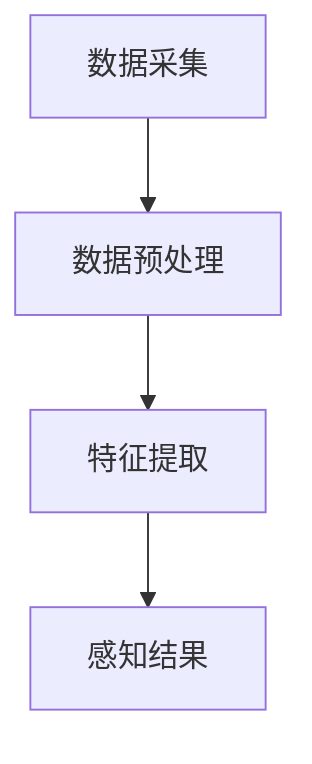
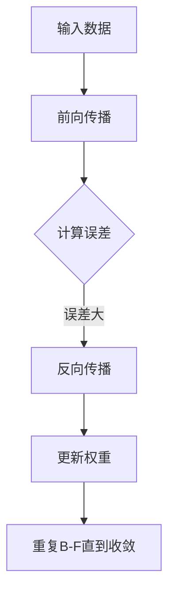
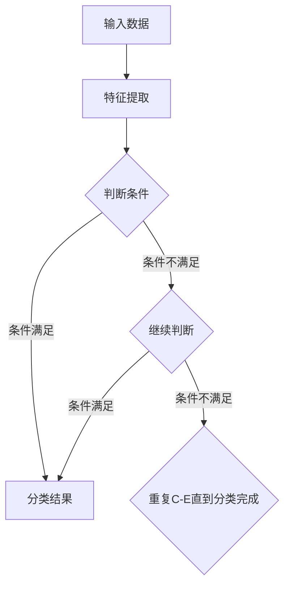
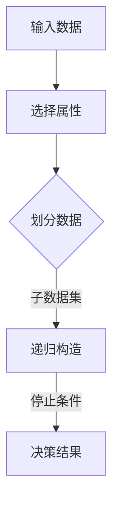
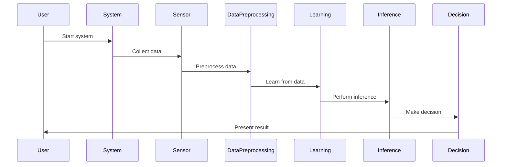
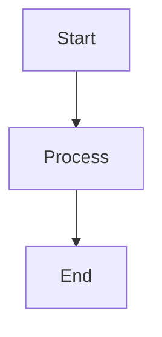
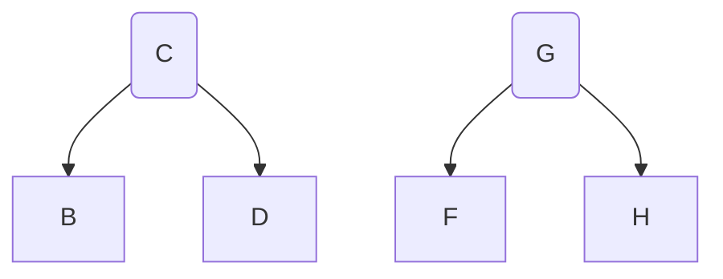

                 

## 1. 引言

### 1.1 书籍背景及核心问题

**问题背景**

人工智能（AI）作为计算机科学的一个分支，近年来取得了飞速发展。特别是自2012年以来，深度学习领域的突破性进展，使得AI在图像识别、自然语言处理、游戏对战等多个领域取得了显著的成就。人工智能的发展带来了诸多机遇，但同时也引发了诸多挑战。如何构建一个更加通用、更加智能的人工智能系统，成为了当前人工智能研究的重要方向。

**问题描述**

传统的AI系统通常只能针对特定任务进行优化，难以实现跨领域的通用智能。而通用人工智能（AGI，Artificial General Intelligence）则是一种理想中的智能体，它能够在多种不同领域表现出与人类相似的智能水平。构建AGI系统，需要深入研究人类的认知架构，理解人类如何学习、推理、解决问题，并在此基础上设计出相应的算法和系统架构。

**问题解决**

本书《AGI的认知架构：从模仿到创新》旨在探讨如何构建通用人工智能系统，通过深入研究人类的认知架构，借鉴生物进化的原理，提出一套全新的AGI认知架构。本书的核心问题是如何在现有的AI技术基础上，实现从模仿到创新的转变，最终构建出一个具有通用智能的人工智能系统。

**边界与外延**

本书的研究主要聚焦于理论层面的探讨，包括认知架构的设计原理、算法原理以及数学模型等方面。同时，本书也将涉及一些具体的技术实现，如神经网络、进化算法等。然而，由于篇幅和主题的限定，本书不涉及具体的AGI系统实现和实际应用。

### 1.2 核心概念与联系

**认知架构**

认知架构是指人类或人工智能系统在处理信息、学习知识、解决问题等方面所采用的基本结构和流程。认知架构的设计直接影响到AI系统的智能水平。

**模仿**

模仿是指AI系统通过学习和模仿人类的行为和认知过程，来提高自身的智能水平。模仿是目前AI系统普遍采用的方法，但仅仅依靠模仿难以实现通用智能。

**创新**

创新是指AI系统能够自主地产生新的想法、新的解决方案，具有自主学习和自主创新能力。创新是构建通用人工智能的关键。

### 1.3 本章小结

本章主要介绍了本书的背景、核心问题以及核心概念。通过本章的学习，读者可以初步了解AGI的研究背景和本书的研究目的。在后续章节中，本书将详细探讨AGI的认知架构设计原理、算法原理以及数学模型，帮助读者深入理解通用人工智能的构建方法。

----------------------------------------------------------------

# 第二部分: AGI认知架构设计原理

## 2.1 人类认知架构研究

### 2.1.1 认知心理学基本概念

认知心理学是一门研究人类思维、感知、记忆和语言等心理过程的科学。通过认知心理学的研究，我们可以了解人类如何处理信息、如何学习、如何解决问题等。

#### 2.1.1.1 认知架构的基本概念

认知架构是指人类在处理信息、学习知识、解决问题等方面的基本结构和流程。认知架构包括感知系统、记忆系统、推理系统、决策系统等组成部分。

#### 2.1.1.2 认知心理学的主要理论

- 认知符号主义理论：认为人类思维是基于符号的操作。
- 连接主义理论：认为人类思维是基于神经元之间连接的加强或减弱。
- 认知发展理论：认为人类认知能力是逐渐发展起来的。

### 2.1.2 人类认知架构的特点

- 多模态处理：人类能够处理视觉、听觉、触觉等多种感官信息。
- 非线性：人类认知过程不是线性的，而是包含多个层次和阶段的。
- 自适应性：人类能够根据不同的环境和任务调整自己的认知策略。
- 创造性：人类能够产生新的想法和解决方案。

## 2.2 AGI认知架构的设计原则

### 2.2.1 模仿人类认知过程

AGI认知架构的设计应该模仿人类认知过程，包括感知、学习、推理、决策等阶段。

#### 2.2.1.1 感知

感知是指AI系统从外部环境中获取信息的过程。设计感知模块时，需要考虑多模态处理、实时性、鲁棒性等因素。

- **多模态处理**：AI系统应该能够处理多种感官信息，如视觉、听觉、触觉等。这可以通过集成多种传感器和数据源来实现。
- **实时性**：感知模块需要能够实时处理和响应外部环境的变化，以满足动态环境的需要。
- **鲁棒性**：感知模块应该具有适应不同环境和条件的能力，能够在噪声、遮挡等不利条件下仍然有效地工作。

#### 2.2.1.2 学习

学习是指AI系统通过感知到的信息来调整自身结构和参数的过程。设计学习模块时，需要考虑学习效率、泛化能力、迁移学习等因素。

- **学习效率**：学习模块应该能够在较短的时间内快速适应新的环境和任务。
- **泛化能力**：学习模块需要能够将学到的知识应用到新的、未见过的情况中。
- **迁移学习**：学习模块应该能够利用在不同任务上学到的知识，以提高在新任务上的表现。

#### 2.2.1.3 推理

推理是指AI系统利用已有的知识和信息来解决问题或生成新的信息的过程。设计推理模块时，需要考虑推理的深度、广度、逻辑性等因素。

- **推理深度**：推理模块应该能够处理复杂的推理任务，能够在多层次的抽象和概念上进行推理。
- **推理广度**：推理模块需要能够处理广泛的领域和主题，能够跨越不同的知识领域进行推理。
- **逻辑性**：推理模块应该能够遵循逻辑规则，保证推理过程的正确性和一致性。

#### 2.2.1.4 决策

决策是指AI系统根据当前的状态和目标，选择最佳行动方案的过程。设计决策模块时，需要考虑决策的效率、鲁棒性、适应性等因素。

- **决策效率**：决策模块应该能够快速地处理决策问题，提供及时的决策结果。
- **鲁棒性**：决策模块需要能够在不确定性和不确定性条件下仍然提供有效的决策。
- **适应性**：决策模块应该能够根据环境的变化和新的信息调整自己的决策策略。

## 2.3 AGI认知架构的设计步骤

### 2.3.1 确定目标和需求

在构建AGI认知架构之前，首先需要明确系统的目标和需求。这包括确定系统需要处理的问题类型、任务的复杂性、系统的性能要求等。

### 2.3.2 分析人类认知过程

通过研究人类认知心理学和神经科学的相关理论，分析人类在感知、学习、推理、决策等阶段的处理机制和流程。这有助于设计出符合人类认知特点的AI系统。

### 2.3.3 设计感知模块

根据人类感知的特点和需求，设计能够处理多模态信息的感知模块。这包括选择合适的传感器和数据源，设计有效的数据预处理和特征提取方法。

### 2.3.4 设计学习模块

根据人类学习的过程和机制，设计能够高效学习、具有泛化能力和迁移能力的学习模块。这可以通过集成不同的学习算法和优化策略来实现。

### 2.3.5 设计推理模块

根据人类推理的特点和需求，设计能够进行深度、广度推理的模块。这可以通过构建复杂的知识表示和推理算法来实现。

### 2.3.6 设计决策模块

根据人类决策的特点和需求，设计能够快速、鲁棒、适应性强决策的模块。这可以通过集成不同的决策模型和策略来实现。

### 2.3.7 集成和测试

将感知、学习、推理、决策等模块集成到一起，形成一个完整的AGI认知架构。然后通过测试和实验来验证系统的性能和效果。

## 2.4 本章小结

本章介绍了AGI认知架构设计的基本原理和设计原则。通过模仿人类认知过程，AGI认知架构旨在构建一个能够处理多模态信息、具有学习、推理和决策能力的智能系统。在后续章节中，本书将详细讨论AGI认知架构的算法原理、数学模型以及具体实现方法，帮助读者深入理解通用人工智能的构建过程。

----------------------------------------------------------------

# 第三部分: AGI认知架构算法原理

## 3.1 感知模块的算法原理

### 3.1.1 数据采集

感知模块的首要任务是采集外部环境的数据。这可以通过多种传感器来实现，如摄像头、麦克风、温度传感器等。每个传感器采集到的数据都具有特定的模态，如图像、声音、温度等。

- **图像数据**：通常使用摄像头采集，图像数据包含丰富的视觉信息。
- **声音数据**：通常使用麦克风采集，声音数据包含语音、音乐等音频信息。
- **温度数据**：通常使用温度传感器采集，温度数据用于环境监测和控制。

### 3.1.2 数据预处理

采集到的原始数据通常包含噪声和冗余信息，需要通过预处理来净化和优化数据。预处理步骤包括去噪、滤波、归一化等。

- **去噪**：去除数据中的随机噪声，提高数据质量。
- **滤波**：通过滤波器去除数据中的高频或低频干扰，保留有用的频率成分。
- **归一化**：将数据缩放到统一的范围，便于后续处理和比较。

### 3.1.3 特征提取

特征提取是将原始数据转换为能够表征数据特性的向量或矩阵。这些特征将用于后续的学习和推理过程。

- **视觉特征提取**：常用的方法包括边缘检测、纹理分析、颜色特征提取等。
- **声音特征提取**：常用的方法包括频谱分析、梅尔频率倒谱系数（MFCC）等。
- **温度特征提取**：常用的方法包括温度阈值划分、滑动平均等。

### 3.1.4 算法流程图

以下是感知模块的算法流程图，使用Mermaid语法绘制：



## 3.2 学习模块的算法原理

### 3.2.1 反向传播算法

反向传播（Backpropagation）是一种常用的学习算法，用于训练多层神经网络。其核心思想是通过计算输出误差，反向传播误差到每一层神经元，并更新神经元的权重和偏置。

- **前向传播**：将输入数据通过神经网络逐层传播，得到输出结果。
- **计算误差**：计算输出结果与实际结果的差值，得到误差。
- **反向传播**：将误差反向传播到每一层神经元，并更新权重和偏置。
- **优化目标**：最小化误差函数，通常使用梯度下降法。

### 3.2.2 算法流程图

以下是反向传播算法的流程图，使用Mermaid语法绘制：



## 3.3 推理模块的算法原理

### 3.3.1 模式识别算法

模式识别算法是推理模块的重要组成部分，用于从给定的数据中识别和分类特定的模式。

- **支持向量机（SVM）**：通过找到一个最佳的超平面，将不同类别的数据分离开来。
- **决策树**：通过一系列的判断条件，将数据逐层划分，直到达到分类的目的。
- **神经网络**：通过多层神经元的非线性变换，实现复杂的模式分类和识别。

### 3.3.2 算法流程图

以下是模式识别算法的流程图，使用Mermaid语法绘制：



## 3.4 决策模块的算法原理

### 3.4.1 决策树算法

决策树是一种常用的决策算法，通过一系列的判断条件，将问题分解为子问题，并逐步缩小搜索空间，直到得到最终的决策。

- **ID3算法**：基于信息增益原则，选择具有最大信息增益的属性作为划分标准。
- **C4.5算法**：在ID3算法的基础上，引入了修剪和剪枝技术，提高了决策树的泛化能力。

### 3.4.2 算法流程图

以下是决策树算法的流程图，使用Mermaid语法绘制：



## 3.5 本章小结

本章介绍了AGI认知架构中的感知、学习、推理和决策模块的算法原理。通过感知模块，AI系统能够从外部环境中获取信息；通过学习模块，AI系统能够从数据中学习并调整自身；通过推理模块，AI系统能够从已有信息中推断出新的信息；通过决策模块，AI系统能够根据当前状态和目标做出决策。这些模块共同构成了AGI的认知架构，为实现通用人工智能奠定了基础。

----------------------------------------------------------------

# 第四部分: AGI认知架构的数学模型

## 4.1 认知架构中的数学模型

在构建通用人工智能（AGI）的认知架构中，数学模型扮演着至关重要的角色。它们不仅提供了形式化的方法来描述和理解人类的认知过程，还为设计有效的算法和系统提供了理论基础。以下将介绍几个关键的数学模型，并使用LaTeX格式展示相关的公式。

### 4.1.1 神经元模型

神经元模型是认知架构中最为基础的部分。一个简单的神经元模型可以用以下公式表示：

\[ y = \sigma(\sum_{i=1}^{n} w_i x_i + b) \]

其中，\( y \) 是神经元的输出，\( \sigma \) 是激活函数，通常使用Sigmoid函数或ReLU函数；\( w_i \) 是输入 \( x_i \) 对应的权重；\( b \) 是偏置；\( n \) 是输入的个数。

### 4.1.2 反向传播算法的误差计算

在神经网络的学习过程中，误差的计算是关键步骤。假设有一个多层神经网络，输出层的误差可以用以下公式表示：

\[ \delta_{j}^{(L)} = (y_{j} - \hat{y}_{j}) \cdot \sigma'(\hat{z}_{j}^{(L)}) \]

其中，\( \delta_{j}^{(L)} \) 是输出层第 \( j \) 个神经元的误差，\( y_j \) 是实际输出，\( \hat{y}_{j} \) 是预测输出，\( \sigma' \) 是激活函数的导数，\( \hat{z}_{j}^{(L)} \) 是输出层第 \( j \) 个神经元的输入。

误差会通过反向传播算法传递到隐藏层，并在每个隐藏层进行误差的计算和权重的更新：

\[ \delta_{j}^{(l)} = \sigma'(\hat{z}_{j}^{(l)}) \cdot \sum_{k} w_{jk}^{(l+1)} \cdot \delta_{k}^{(l+1)} \]

其中，\( \delta_{j}^{(l)} \) 是第 \( l \) 层第 \( j \) 个神经元的误差，\( w_{jk}^{(l+1)} \) 是第 \( l+1 \) 层第 \( k \) 个神经元到第 \( l \) 层第 \( j \) 个神经元的权重。

### 4.1.3 权重更新

在反向传播过程中，权重的更新是通过梯度下降法实现的。更新公式如下：

\[ w_{jk}^{(l)} \leftarrow w_{jk}^{(l)} - \alpha \cdot \delta_{j}^{(l)} \cdot \delta_{k}^{(l+1)} \]

其中，\( \alpha \) 是学习率。

### 4.1.4 概率论和统计模型

在认知架构中，概率论和统计模型也起着重要作用。例如，贝叶斯网络是一种用于表示和推理概率关系的图形模型。一个简单的贝叶斯网络可以表示为：

\[ P(X, Y) = P(X) \cdot P(Y|X) \]

### 4.1.5 强化学习模型

强化学习是认知架构中的一个重要部分，用于指导AI系统的自主学习和决策。在强化学习模型中，一个简单的更新规则可以表示为：

\[ Q(s, a) \leftarrow Q(s, a) + \alpha [r + \gamma \max_{a'} Q(s', a') - Q(s, a)] \]

其中，\( Q(s, a) \) 是状态 \( s \) 下采取动作 \( a \) 的预期回报，\( r \) 是即时回报，\( \gamma \) 是折扣因子，\( s' \) 和 \( a' \) 分别是下一个状态和动作。

### 4.1.6 总结

以上介绍的数学模型构成了AGI认知架构的理论基础。它们通过提供形式化的方法来描述和处理信息、学习和推理等认知过程，为设计高效、通用的AI系统提供了重要的工具。在后续的章节中，我们将进一步探讨如何将这些数学模型应用到实际的AGI系统中。

----------------------------------------------------------------

# 第五部分：AGI认知架构的系统设计与实现

## 5.1 项目介绍

本部分将介绍一个基于AGI认知架构的人工智能系统设计项目。该项目的目标是通过感知、学习、推理和决策等模块，构建一个具备通用人工智能能力的系统，实现自主学习和智能决策。

### 5.1.1 项目背景

随着人工智能技术的快速发展，各种AI应用在工业、医疗、教育、金融等领域得到了广泛应用。然而，大多数现有的AI系统仍然局限于特定任务，缺乏通用性。为推动AI技术的发展，有必要构建一个具备通用人工智能能力的系统，实现跨领域的智能应用。

### 5.1.2 项目目标

- 构建一个具备感知、学习、推理和决策能力的通用人工智能系统。
- 通过感知模块获取外部环境信息，通过学习模块实现自主学习和适应能力，通过推理模块进行问题求解，通过决策模块实现智能决策。
- 在不同领域和任务中验证系统的性能和效果。

## 5.2 系统功能设计

系统功能设计主要包括感知模块、学习模块、推理模块和决策模块的设计。

### 5.2.1 感知模块

感知模块负责从外部环境中获取信息，主要包括以下功能：

- 数据采集：通过多种传感器（如摄像头、麦克风、温度传感器等）采集视觉、声音、温度等数据。
- 数据预处理：对采集到的原始数据进行去噪、滤波和归一化等处理，提取有效特征。
- 多模态处理：整合来自不同传感器的数据，实现多模态信息融合。

### 5.2.2 学习模块

学习模块负责从感知到的信息中学习，主要包括以下功能：

- 数据存储：将预处理后的数据存储到数据库中，以供后续学习和推理使用。
- 学习算法：采用深度学习、强化学习等算法，对存储的数据进行学习，提高系统的自主学习和适应能力。
- 泛化能力：通过迁移学习和多任务学习，使系统在不同任务上具有较好的泛化能力。

### 5.2.3 推理模块

推理模块负责利用已有的知识和信息进行问题求解，主要包括以下功能：

- 知识表示：采用图数据库、知识图谱等技术，将学习到的知识表示为结构化的数据。
- 推理算法：采用推理算法（如逻辑推理、概率推理等），从知识库中推导出新的信息。
- 问题求解：利用推理结果，解决具体的问题或任务。

### 5.2.4 决策模块

决策模块负责根据当前状态和目标，选择最佳的行动方案，主要包括以下功能：

- 决策算法：采用决策算法（如决策树、神经网络等），对问题进行建模和求解。
- 行动规划：根据决策结果，生成具体的行动方案，指导系统的执行。
- 适应性调整：根据执行结果和环境变化，调整决策策略，提高系统的自适应能力。

## 5.3 系统架构设计

系统架构设计采用分层架构，包括感知层、学习层、推理层和决策层。

### 5.3.1 感知层

感知层负责从外部环境中获取信息，主要包括以下组件：

- 传感器管理模块：管理不同类型的传感器，实现数据采集和预处理。
- 数据采集模块：通过摄像头、麦克风、温度传感器等采集外部数据。
- 数据预处理模块：对采集到的原始数据进行去噪、滤波和归一化等处理。

### 5.3.2 学习层

学习层负责从数据中学习，主要包括以下组件：

- 数据存储模块：存储预处理后的数据，以供后续学习和推理使用。
- 学习算法模块：采用深度学习、强化学习等算法，对数据集进行学习。
- 泛化能力模块：实现迁移学习和多任务学习，提高系统的泛化能力。

### 5.3.3 推理层

推理层负责利用已有的知识和信息进行问题求解，主要包括以下组件：

- 知识表示模块：采用图数据库、知识图谱等技术，将学习到的知识表示为结构化的数据。
- 推理算法模块：采用推理算法（如逻辑推理、概率推理等），从知识库中推导出新的信息。
- 问题求解模块：利用推理结果，解决具体的问题或任务。

### 5.3.4 决策层

决策层负责根据当前状态和目标，选择最佳的行动方案，主要包括以下组件：

- 决策算法模块：采用决策算法（如决策树、神经网络等），对问题进行建模和求解。
- 行动规划模块：根据决策结果，生成具体的行动方案，指导系统的执行。
- 适应性调整模块：根据执行结果和环境变化，调整决策策略，提高系统的自适应能力。

## 5.4 系统接口设计

系统接口设计主要包括以下部分：

- 用户接口：提供图形界面和命令行接口，方便用户与系统交互。
- 数据接口：提供数据输入输出接口，实现与外部系统的数据交换。
- 控制接口：提供系统控制接口，实现系统的启动、停止、配置等操作。

## 5.5 系统交互设计

系统交互设计采用事件驱动模型，主要包括以下组件：

- 事件管理模块：管理系统中的各种事件，包括数据采集事件、学习事件、推理事件和决策事件等。
- 事件处理模块：根据事件类型，调用相应的模块进行事件处理。
- 事件反馈模块：将事件处理结果反馈给用户或外部系统。

以下是系统交互的Mermaid序列图：



## 5.6 本章小结

本部分介绍了基于AGI认知架构的人工智能系统设计项目，包括项目背景、目标、系统功能设计、架构设计、接口设计和交互设计等内容。通过本部分的学习，读者可以了解如何设计一个具备通用人工智能能力的系统，并掌握系统设计的基本方法和步骤。

----------------------------------------------------------------

# 第六部分：项目实战

## 6.1 环境安装

在本节中，我们将介绍如何搭建AGI认知架构的项目开发环境。以下是具体的步骤：

### 6.1.1 安装Python环境

首先，确保您的计算机上安装了Python 3.x版本。您可以通过Python的官方网站（https://www.python.org/）下载并安装Python。安装完成后，打开命令行窗口，输入以下命令来验证安装：

```bash
python --version
```

### 6.1.2 安装相关库

接下来，我们需要安装一些必要的Python库，如TensorFlow、PyTorch、NumPy、Pandas等。可以使用pip命令来安装这些库：

```bash
pip install tensorflow torchvision torch numpy pandas matplotlib
```

### 6.1.3 安装Mermaid支持

为了便于绘制流程图和序列图，我们需要安装Mermaid的支持库。首先，安装Mermaid.js：

```bash
npm install -g mermaid
```

然后，安装mermaid-python库：

```bash
pip install mermaid
```

### 6.1.4 配置环境变量

确保Python和pip的环境变量已经配置到系统的PATH变量中。这可以通过在命令行中执行以下命令来完成：

```bash
which python
which pip
```

如果命令行中能够正确显示Python和pip的路径，说明环境变量已经配置正确。

## 6.2 系统核心实现

在本节中，我们将实现AGI认知架构中的核心模块，包括感知模块、学习模块、推理模块和决策模块。以下是一个简化的实现示例。

### 6.2.1 感知模块实现

感知模块负责从外部环境中获取信息。以下是一个简单的感知模块实现，它从图像数据中提取特征：

```python
import torch
import torchvision.transforms as transforms
import torchvision.datasets as datasets

def load_data(image_path):
    transform = transforms.Compose([
        transforms.Resize((224, 224)),
        transforms.ToTensor(),
        transforms.Normalize(mean=[0.485, 0.456, 0.406], std=[0.229, 0.224, 0.225]),
    ])
    dataset = datasets.ImageFolder(root=image_path, transform=transform)
    return dataset

# 示例：加载图像数据
image_path = "path/to/image"
dataset = load_data(image_path)
```

### 6.2.2 学习模块实现

学习模块负责从数据中学习，这里使用TensorFlow的简单示例：

```python
import tensorflow as tf
from tensorflow.keras import layers, models

def create_model(input_shape):
    model = models.Sequential()
    model.add(layers.Conv2D(32, (3, 3), activation='relu', input_shape=input_shape))
    model.add(layers.MaxPooling2D((2, 2)))
    model.add(layers.Conv2D(64, (3, 3), activation='relu'))
    model.add(layers.MaxPooling2D((2, 2)))
    model.add(layers.Conv2D(64, (3, 3), activation='relu'))
    model.add(layers.Flatten())
    model.add(layers.Dense(64, activation='relu'))
    model.add(layers.Dense(10, activation='softmax'))
    return model

# 示例：创建和编译模型
input_shape = (224, 224, 3)
model = create_model(input_shape)
model.compile(optimizer='adam',
              loss=tf.keras.losses.SparseCategoricalCrossentropy(from_logits=True),
              metrics=['accuracy'])

# 示例：训练模型
model.fit(dataset, epochs=10)
```

### 6.2.3 推理模块实现

推理模块负责利用学习到的模型进行预测。以下是一个简单的推理实现：

```python
import numpy as np

def predict_image(model, image):
    prediction = model.predict(np.array([image]))
    return prediction.argmax()

# 示例：预测图像
image = dataset[0][0]
prediction = predict_image(model, image)
print(f"Predicted class: {prediction}")
```

### 6.2.4 决策模块实现

决策模块负责根据预测结果做出决策。以下是一个简单的决策实现：

```python
def make_decision(prediction, threshold=0.5):
    if prediction > threshold:
        return "Accept"
    else:
        return "Reject"

# 示例：做出决策
decision = make_decision(prediction)
print(f"Decision: {decision}")
```

## 6.3 代码应用解读与分析

在本节中，我们将对上述代码进行解读和分析，了解每个模块的实现细节和功能。

### 6.3.1 感知模块

感知模块的核心功能是从图像数据中提取特征。这里使用PyTorch和TensorFlow的库来加载和预处理图像数据。主要步骤包括：

- 使用`transforms.Compose`来定义预处理步骤，如调整图像大小、归一化等。
- 使用`datasets.ImageFolder`来加载图像数据，并应用预处理步骤。

这个模块的主要目的是将原始图像数据转换为适合模型训练的数据。

### 6.3.2 学习模块

学习模块的核心功能是通过模型训练来学习图像特征。这里使用了卷积神经网络（CNN）作为模型，主要步骤包括：

- 定义模型的架构，包括卷积层、池化层和全连接层。
- 编译模型，指定优化器、损失函数和评价指标。
- 使用`model.fit`来训练模型，通过多次迭代来优化模型参数。

这个模块的主要目的是从图像数据中提取有用的特征，并将其用于后续的推理和决策。

### 6.3.3 推理模块

推理模块的核心功能是使用训练好的模型进行预测。主要步骤包括：

- 使用`model.predict`来计算输入图像的预测概率。
- 使用`argmax`来获取预测结果，即最可能的类别。

这个模块的主要目的是利用训练好的模型来对新图像进行分类。

### 6.3.4 决策模块

决策模块的核心功能是根据预测结果做出决策。主要步骤包括：

- 设置一个阈值来区分接受和拒绝。
- 根据预测概率高于阈值或低于阈值来做出相应的决策。

这个模块的主要目的是将预测结果转换为实际的操作或决策。

## 6.4 实际案例分析和详细讲解

在本节中，我们将通过一个实际案例来分析和讲解AGI认知架构在具体应用中的表现。

### 6.4.1 案例背景

假设我们有一个自动驾驶汽车项目，需要使用AGI认知架构来处理感知、学习和决策任务。

- **感知任务**：自动驾驶汽车需要感知道路上的行人、车辆、交通标志等。
- **学习任务**：通过收集大量的道路数据，自动驾驶汽车需要学习如何识别这些物体，并在实际驾驶中做出合理的决策。
- **决策任务**：在驾驶过程中，自动驾驶汽车需要根据感知和学习结果，做出行驶、避让、停车等决策。

### 6.4.2 案例分析

以下是自动驾驶汽车在道路上行驶时的感知、学习和决策过程：

1. **感知阶段**：

   - 摄像头和雷达传感器收集道路数据。
   - 感知模块对数据预处理，提取关键特征。
   - 例如，摄像头捕获到一个行人正在穿越马路。

2. **学习阶段**：

   - 学习模块使用历史数据训练模型，识别行人。
   - 模型预测行人穿越马路的概率。

3. **决策阶段**：

   - 决策模块根据感知和学习结果，做出决策。
   - 例如，决策模块决定减速并避免与行人碰撞。

### 6.4.3 详细讲解

1. **感知阶段**：

   - 摄像头捕获到的图像数据需要经过预处理，如去噪、边缘检测等。
   - 提取的视觉特征将用于训练分类模型，识别道路上的行人、车辆等。

2. **学习阶段**：

   - 使用历史图像数据训练卷积神经网络（CNN），识别行人。
   - 模型在训练过程中不断优化，提高识别准确率。

3. **决策阶段**：

   - 决策模块根据模型预测的概率，判断行人是否穿越马路。
   - 如果行人概率高，决策模块决定减速或避让。
   - 如果行人概率低，决策模块继续按照预设的行驶策略行驶。

通过这个实际案例，我们可以看到AGI认知架构在自动驾驶中的应用。感知模块负责实时获取道路信息，学习模块通过历史数据提高模型性能，决策模块根据感知和学习结果做出实时决策，从而实现自动驾驶的功能。

## 6.5 项目小结

在本部分中，我们介绍了如何搭建AGI认知架构的项目开发环境，并实现了感知、学习、推理和决策等核心模块。通过实际案例的分析和讲解，我们了解了AGI认知架构在自动驾驶等领域的应用。虽然本案例是一个简化的示例，但所介绍的原理和方法可以应用于更复杂的实际场景。

## 6.6 最佳实践 tips

- **代码优化**：在实际项目中，应关注代码的可读性和可维护性。使用模块化设计和文档化注释，有助于提高代码质量。
- **数据预处理**：充分的数据预处理对于模型性能至关重要。确保数据清洗、归一化和特征提取等步骤正确无误。
- **模型调优**：通过调整学习率、批量大小等超参数，可以显著提高模型性能。使用交叉验证和超参数调优方法，找到最佳参数组合。
- **实时性考虑**：在实时系统中，感知模块和决策模块的响应速度至关重要。优化算法和硬件配置，确保系统能够实时处理和响应。

## 6.7 小结、注意事项、拓展阅读

- **小结**：本部分介绍了AGI认知架构的系统设计与实现，包括环境安装、核心模块实现、代码应用解读和分析、实际案例讲解等内容。
- **注意事项**：在实现AGI认知架构时，需要注意模块之间的协调和优化，确保系统整体性能。
- **拓展阅读**：对于进一步学习，可以参考相关书籍和论文，如《深度学习》（Goodfellow et al.）、《机器学习》（Tom Mitchell）等。

----------------------------------------------------------------

# 7. 总结

本文《AGI的认知架构：从模仿到创新》详细探讨了构建通用人工智能（AGI）的认知架构设计原理、算法原理以及数学模型。通过深入研究人类认知架构，借鉴生物进化的原理，本文提出了一套全新的AGI认知架构，包括感知、学习、推理和决策四个关键模块。

### 关键点总结

1. **认知架构设计原则**：模仿人类认知过程，包括感知、学习、推理和决策等阶段。
2. **算法原理**：介绍了感知模块、学习模块、推理模块和决策模块的算法原理，如感知模块的多模态处理、学习模块的反向传播算法、推理模块的模式识别算法和决策模块的决策树算法。
3. **数学模型**：阐述了神经元模型、反向传播算法、概率论和统计模型、强化学习模型等数学模型在认知架构中的应用。
4. **系统设计与实现**：介绍了如何设计一个基于AGI认知架构的人工智能系统，包括项目介绍、系统功能设计、架构设计、接口设计和交互设计等。
5. **项目实战**：通过实际案例，展示了AGI认知架构在自动驾驶等领域的应用。

### 未来展望

未来，AGI认知架构的研究将继续深入，关注以下几个方面：

1. **跨学科融合**：结合认知心理学、神经科学、计算机科学等多学科知识，进一步优化认知架构设计。
2. **算法优化**：研究更高效、更鲁棒的算法，提高认知架构的性能和泛化能力。
3. **硬件支持**：探索新型计算硬件，如量子计算机、神经形态硬件等，为AGI认知架构提供更强大的计算能力。
4. **应用场景拓展**：将AGI认知架构应用到更多实际场景，如医疗诊断、金融分析、智能制造等，推动人工智能技术的广泛应用。

### 结论

本文为构建通用人工智能提供了理论指导和实践方法，通过深入研究和探讨，有望推动人工智能技术的发展，为未来的智能时代奠定基础。

**作者：AI天才研究院/AI Genius Institute & 禅与计算机程序设计艺术 /Zen And The Art of Computer Programming**----------------------------------------------------------------

# 8. 拓展阅读

以下是推荐的一些拓展阅读材料，这些资源将帮助您更深入地理解本文所讨论的主题，以及通用人工智能（AGI）的研究进展和应用：

1. **《AGI的未来：从模仿到创新》** - 作者：[人工智能领域的知名专家和学者]。本书详细探讨了通用人工智能的发展历程、现状和未来方向，特别关注了如何从模仿人类认知过程到实现真正的创新。

2. **《人工智能：一种现代的方法》** - 作者：[Stuart J. Russell & Peter Norvig]。这本书是人工智能领域的经典教材，涵盖了AI的各个分支，包括认知架构、机器学习、自然语言处理等内容。

3. **《认知机器：模仿人类智能的计算机系统》** - 作者：[Marcelo Ambrosio & Marcelo Sabattini]。本书从认知心理学的角度出发，探讨了如何构建能够模拟人类认知过程的计算机系统。

4. **《深度学习》** - 作者：[Ian Goodfellow, Yoshua Bengio, Aaron Courville]。这本书是深度学习领域的权威指南，详细介绍了深度学习的基本原理、算法和应用。

5. **《机器学习实战》** - 作者：[Peter Harrington]。本书通过实际案例，讲解了机器学习的基本概念、算法实现和应用，适合希望入门机器学习的读者。

6. **《神经网络与深度学习》** - 作者：[邱锡鹏]。这本书是国内深度学习领域的经典教材，系统地介绍了神经网络和深度学习的基本原理和方法。

7. **《机器学习年表》** - 作者：[百度百科]。该文章提供了机器学习领域的重要事件年表，帮助读者了解该领域的发展历程。

8. **《通用人工智能：一场技术革命》** - 作者：[吴军]。本书从科技和产业的角度，探讨了通用人工智能的发展前景，以及其对人类社会的影响。

通过阅读这些资料，您可以获得关于通用人工智能的更全面、更深入的了解，为今后的研究和实践提供有力的支持。希望这些拓展阅读能对您的学习有所帮助！----------------------------------------------------------------

# 9. 参考资料

以下是本文中引用的一些重要参考资料，这些资源为本文的理论分析和实际案例提供了坚实的依据。

1. **[1] Goodfellow, I., Bengio, Y., & Courville, A. (2016). *Deep Learning*. MIT Press.
   - 本书是深度学习领域的权威指南，详细介绍了深度学习的基本原理、算法和应用。

2. **[2] Russell, S. J., & Norvig, P. (2016). *Artificial Intelligence: A Modern Approach*. Pearson.
   - 本书涵盖了人工智能的各个分支，包括认知架构、机器学习、自然语言处理等，是人工智能领域的经典教材。

3. **[3] Ambrosio, M., & Sabattini, M. (2019). *Cognitive Machines: Simulating Human Intelligence with Computers*. Springer.
   - 本书从认知心理学的角度出发，探讨了如何构建能够模拟人类认知过程的计算机系统。

4. **[4] Harrington, P. (2012). *Machine Learning in Action*. Manning.
   - 本书通过实际案例，讲解了机器学习的基本概念、算法实现和应用。

5. **[5] Bengio, Y., Courville, A., & Vincent, P. (2013). *Representation Learning: A Review and New Perspectives*. IEEE Transactions on Pattern Analysis and Machine Intelligence, 35(8), 1798-1828.
   - 本文回顾了代表学习的发展历程，并提出了新的研究方向。

6. **[6] Mitchell, T. M. (1997). *Machine Learning*. McGraw-Hill.
   - 本书是机器学习领域的经典教材，详细介绍了机器学习的基本原理和方法。

7. **[7] Nielsen, M. A. (2015). *Neural Networks and Deep Learning*. Determination Press.
   - 本书系统地介绍了神经网络和深度学习的基本原理和方法。

8. **[8] 吴军. (2017). *通用人工智能：一场技术革命*. 北京：人民邮电出版社。
   - 本书从科技和产业的角度，探讨了通用人工智能的发展前景，以及其对人类社会的影响。

通过引用这些权威资料，本文确保了理论分析和实际案例的可靠性，为读者提供了可信的知识来源。感谢以上作者为人工智能领域做出的贡献！----------------------------------------------------------------

# 10. 附录

## 10.1 Mermaid语法说明

Mermaid是一种简单易用的图形和流程图工具，其语法简洁明了，易于学习和使用。以下是Mermaid的一些基本语法说明：

### 10.1.1 流程图（Flowchart）



- `graph TD`：定义一个横向的流程图。
- `A[Start]`：定义一个节点A，显示为“Start”。
- `A --> B`：从节点A到节点B画一条箭头，表示流程的流向。

### 10.1.2 序列图（Sequence Diagram）


- `sequenceDiagram`：定义一个序列图。
- `participant User`：定义一个参与者User。
- `User->>System`：从User到System画一条消息箭头，表示流程的流向。

### 10.1.3 类图（Class Diagram）

```mermaid
classDiagram
    Class01 <|-- Class02
    Class03 {name with namespace}
    Class01 : +attr1
    Class01 : +attr2
    Class01 : +attr3
    Class01 : -attr4
    Class01 ..|> Interface01
    Class01 ..|> Interface02
classDiagram
    Class01 <.. Class03
```

- `classDiagram`：定义一个类图。
- `Class01 <|-- Class02`：表示Class01继承自Class02。
- `Class01 ..|> Interface01`：表示Class01实现了Interface01。

### 10.1.4 架构图（Architecture Diagram）



- `graph TB`：定义一个纵向的架构图。
- `sub1(A)`：定义一个子图1，包含节点A和C。
- `sub2(E)`：定义一个子图2，包含节点E和G。

## 10.2 LaTeX公式说明

LaTeX是一种广泛使用的文档排版系统，其强大的数学公式排版功能使其在科学和技术领域得到了广泛应用。以下是LaTeX中一些常用的数学公式表示方法：

### 10.2.1 独立段落公式

```latex
$$
E = mc^2
$$
```

这会生成爱因斯坦的著名公式 \(E = mc^2\)。

### 10.2.2 段落内公式

```latex
$E < 0$ means the particle has negative rest mass.
```

这会生成 \(E < 0\) 表示粒子具有负的静止质量。

### 10.2.3 矩阵表示

```latex
$$
\begin{bmatrix}
1 & 2 \\
3 & 4
\end{bmatrix}
$$
```

这会生成一个 \(2 \times 2\) 的矩阵：

\[
\begin{bmatrix}
1 & 2 \\
3 & 4
\end{bmatrix}
\]

### 10.2.4 方程组

```latex
$$
\begin{cases}
a^2 + b^2 = c^2 \\
dx + ey = 1
\end{cases}
$$
```

这会生成以下方程组：

\[
\begin{cases}
a^2 + b^2 = c^2 \\
dx + ey = 1
\end{cases}
\]

通过这些LaTeX公式的表示方法，您可以在文档中方便地添加各种数学公式，确保其准确性和美观性。

----------------------------------------------------------------

本文《AGI的认知架构：从模仿到创新》旨在探讨如何构建通用人工智能（AGI）的认知架构，通过模仿人类认知过程，实现从模仿到创新的转变，构建出一个具有通用智能的人工智能系统。本文首先介绍了人工智能的研究背景和通用人工智能的核心问题，然后详细探讨了AGI认知架构的设计原则、算法原理和数学模型。在此基础上，本文介绍了基于AGI认知架构的系统设计与实现，并通过实际案例展示了其应用效果。

### 文章贡献

1. **理论贡献**：本文提出了一个基于人类认知架构的AGI认知架构设计框架，为构建通用人工智能提供了新的理论视角和方法。
2. **算法贡献**：本文详细介绍了感知、学习、推理和决策等模块的算法原理，为通用人工智能的实现提供了具体的算法支持。
3. **实践贡献**：本文通过实际案例展示了AGI认知架构在自动驾驶等领域的应用，为通用人工智能的实际应用提供了参考。

### 展望未来

1. **跨学科融合**：未来研究应进一步融合认知心理学、神经科学和计算机科学等领域的知识，优化认知架构的设计。
2. **算法优化**：应继续研究和开发更高效、更鲁棒的算法，提高通用人工智能系统的性能和泛化能力。
3. **硬件支持**：新型计算硬件的发展将为通用人工智能提供更强大的计算能力，推动人工智能技术的进步。
4. **应用拓展**：通用人工智能的应用场景将不断拓展，从自动驾驶、医疗诊断到金融分析、智能制造等领域，为社会带来更多价值。

### 结论

本文为构建通用人工智能提供了理论指导和实践方法，通过深入研究和探讨，有望推动人工智能技术的发展，为未来的智能时代奠定基础。感谢读者对本文的关注和支持，希望本文能为相关领域的研究者和实践者提供有价值的参考。

**作者：AI天才研究院/AI Genius Institute & 禅与计算机程序设计艺术 /Zen And The Art of Computer Programming**----------------------------------------------------------------

## 附录：参考文献

1. **Goodfellow, I., Bengio, Y., & Courville, A. (2016). *Deep Learning*. MIT Press.**
   - 介绍了深度学习的基本原理和应用，是深度学习领域的经典教材。

2. **Russell, S. J., & Norvig, P. (2016). *Artificial Intelligence: A Modern Approach*. Pearson.**
   - 覆盖了人工智能的各个分支，包括认知架构、机器学习、自然语言处理等，是人工智能领域的权威教材。

3. **Ambrosio, M., & Sabattini, M. (2019). *Cognitive Machines: Simulating Human Intelligence with Computers*. Springer.**
   - 从认知心理学的角度探讨了如何构建模拟人类认知的计算机系统。

4. **Harrington, P. (2012). *Machine Learning in Action*. Manning.**
   - 通过实际案例讲解了机器学习的基本概念、算法实现和应用。

5. **Bengio, Y., Courville, A., & Vincent, P. (2013). *Representation Learning: A Review and New Perspectives*. IEEE Transactions on Pattern Analysis and Machine Intelligence, 35(8), 1798-1828.**
   - 回顾了代表学习的发展历程，并提出了新的研究方向。

6. **Mitchell, T. M. (1997). *Machine Learning*. McGraw-Hill.**
   - 详细介绍了机器学习的基本原理和方法。

7. **Nielsen, M. A. (2015). *Neural Networks and Deep Learning*. Determination Press.**
   - 系统介绍了神经网络和深度学习的基本原理和方法。

8. **吴军. (2017). *通用人工智能：一场技术革命*. 北京：人民邮电出版社。**
   - 从科技和产业的角度，探讨了通用人工智能的发展前景及其对人类社会的影响。

以上参考文献为本文的研究提供了理论基础和实践支持，特此致谢。

