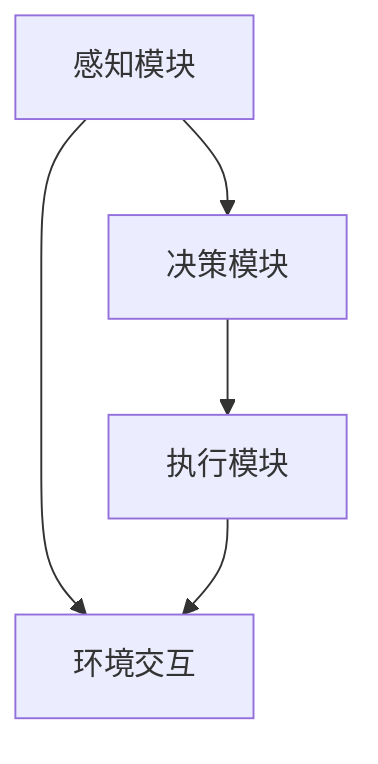
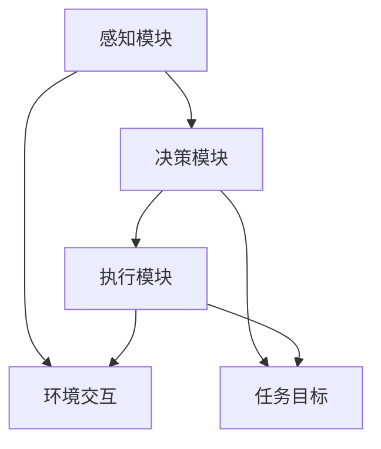

                 

# AGI的认知架构：从模块化到整体性

## 关键词

- AGI
- 模块化设计
- 整体性设计
- 认知架构
- 智能机器人
- 自动驾驶

## 摘要

本文深入探讨了AGI（通用人工智能）的认知架构，重点关注模块化设计与整体性设计两大原则。通过对AGI的定义、发展历程、核心概念及其应用领域进行背景介绍，文章逐步分析了模块化设计的优势与挑战，以及整体性设计的定义与关键要素。在此基础上，本文结合实际案例分析模块化与整体性在智能机器人和自动驾驶中的应用，最后提出了AGI认知架构的设计原则和实现与评估方法。通过逻辑清晰、结构紧凑的阐述，本文旨在为读者提供关于AGI认知架构的全面理解和深入思考。

## 第一部分: AGI的认知架构概述

### 第1章: 问题背景与核心概念

#### 1.1 问题背景

#### 1.1.1 AGI的定义与重要性

AGI，即Artificial General Intelligence，是指具有人类水平智能的人工智能系统。这种智能系统能够在多种不同领域中表现出与人类相似或超越人类的智能水平。AGI的核心在于其通用性，即能够适应各种不同类型的问题解决，而不仅仅局限于特定领域。

AGI的重要性不言而喻。首先，随着科技的不断发展，人类社会对智能系统的需求日益增长。AGI的出现将极大提高生产效率，解决复杂问题，推动社会进步。其次，AGI的突破有望为人类带来更多的便利和福利，如智能医疗、智能交通、智能家居等。最后，AGI的研究具有深远的意义，它不仅涉及计算机科学、认知科学、神经科学等领域，也涉及伦理、法律、社会学等多个方面。

#### 1.1.2 AGI的发展历程与现状

AGI的概念最早由John McCarthy于1950年提出。自此之后，研究者们在多个领域进行了大量探索，如神经网络、强化学习、多模态感知等。然而，距离实现真正的AGI仍存在很大差距。目前，大多数人工智能系统都属于Narrow AI（弱AI），即只能在特定领域内表现出智能行为。

在过去的几十年中，AGI的研究取得了重要进展。例如，深度学习技术的突破使得图像识别、语音识别等任务取得了显著的成果。然而，这些技术仍然受限于特定任务的领域适应性，无法实现真正的通用性。因此，AGI的研究仍然任重道远。

#### 1.2 核心概念

##### 1.2.1 模块化

模块化是AGI架构设计的一个关键原则。它旨在将智能系统划分为多个功能模块，以提高系统的灵活性和可扩展性。每个模块负责特定功能，如感知、决策、动作执行等。模块化设计使得系统能够方便地添加、删除或替换模块，从而实现系统的灵活性和可扩展性。

##### 1.2.2 整体性

整体性则强调各个模块之间需要相互协作，形成一个统一的整体，以实现更高层次的智能行为。整体性设计旨在确保各个模块能够高效协作，共同实现系统的目标。通过整体性设计，系统能够更好地适应复杂环境，提高智能水平。

#### 1.3 边界与外延

##### 1.3.1 AGI与其他AI技术的区别

与目前广泛应用的Narrow AI（弱AI）不同，AGI旨在实现通用性，即能够适应各种不同领域的问题解决。Narrow AI通常只能在特定领域内表现出智能行为，而AGI则希望实现跨领域的智能。

##### 1.3.2 AGI应用领域的拓展

AGI的应用前景广泛，包括但不限于自动驾驶、智能医疗、自然语言处理、智能决策等领域。在自动驾驶领域，AGI可以使得车辆具备更高水平的自主驾驶能力，提高交通安全和效率。在智能医疗领域，AGI可以辅助医生进行疾病诊断和治疗决策，提高医疗水平。在自然语言处理领域，AGI可以使得计算机更好地理解和生成自然语言，提高人机交互的效率。

### 第2章: 模块化设计原理

#### 2.1 模块化设计的优势

##### 2.1.1 灵活性与可扩展性

模块化设计使得系统可以在不影响整体性能的前提下，方便地添加、删除或替换模块。这种灵活性使得系统能够更好地适应不断变化的需求和环境。

##### 2.1.2 系统重构与维护

模块化有助于系统的重构和维护，提高了系统的可维护性和可读性。每个模块都具有明确的输入输出接口，使得模块之间相互独立，降低了系统的复杂度。

#### 2.2 模块化设计的挑战

##### 2.2.1 模块之间的协调

模块之间的协调是模块化设计的关键挑战，需要确保各个模块能够高效协作。模块之间的协调不仅涉及到技术层面，还包括管理层面，如模块的分工、任务分配等。

##### 2.2.2 模块的独立性

模块的独立性是模块化设计的基础，需要确保各个模块具有明确的输入输出接口。然而，在实际设计中，模块之间的依赖关系难以完全避免，这会对模块的独立性造成一定的影响。

### 第3章: 整体性设计原理

#### 3.1 整体性的定义与作用

##### 3.1.1 整体性的定义

整体性是指各个模块在协同工作中形成的一种统一性和协调性。整体性设计强调各个模块之间的相互依赖和相互作用，通过协同工作实现系统的整体性能优化。

##### 3.1.2 整体性的作用

整体性能够提高系统的智能水平，实现更高层次的智能行为。通过整体性设计，系统能够更好地适应复杂环境，提高应对各种挑战的能力。

#### 3.2 整体性设计的关键要素

##### 3.2.1 模块间的协作机制

模块间的协作机制是整体性设计的关键，包括信息交换、任务分配和协同控制等。通过建立高效的模块间协作机制，各个模块能够更好地协同工作，实现整体性能优化。

##### 3.2.2 智能决策与学习

智能决策与学习是整体性设计的核心，通过不断学习和优化，提升系统的整体性能。智能决策与学习机制使得系统能够根据环境变化和反馈进行调整，提高系统的适应性和鲁棒性。

### 第4章: 模块化与整体性结合的应用

#### 4.1 模块化与整体性结合的优势

##### 4.1.1 模块化与整体性的互补

模块化与整体性的结合能够充分发挥两者的优势，实现更高效、更智能的系统。模块化提供了系统的灵活性，而整体性则保证了系统的协同性和整体性能。

##### 4.1.2 应用场景拓展

模块化与整体性结合的应用场景广泛，包括智能机器人、自动驾驶等。在智能机器人领域，模块化与整体性结合可以实现机器人在不同环境中的灵活适应和高效运作。在自动驾驶领域，模块化与整体性结合可以实现车辆在复杂交通环境中的智能决策和自主驾驶。

#### 4.2 实际案例分析

##### 4.2.1 模块化与整体性在智能机器人中的应用

以智能机器人为例，模块化与整体性结合可以使得机器人在不同任务中灵活切换和协同工作。例如，机器人可以模块化地配置感知模块、决策模块和执行模块，通过整体性设计，这些模块能够高效协同，实现机器人的智能行为。

##### 4.2.2 模块化与整体性在自动驾驶中的应用

在自动驾驶领域，模块化与整体性结合可以使得车辆在复杂交通环境中进行智能决策和自主驾驶。例如，车辆可以模块化地配置感知模块、决策模块和控制模块，通过整体性设计，这些模块能够高效协同，实现车辆的自主驾驶功能。

### 第5章: AGI的认知架构设计原则

#### 5.1 设计原则概述

##### 5.1.1 设计原则的重要性

设计原则是AGI认知架构设计的基础，有助于确保系统的高效性、稳定性和可扩展性。设计原则为AGI架构设计提供了明确的指导，使得设计过程更加有序和系统。

##### 5.1.2 设计原则的内容

AGI认知架构设计原则包括模块化设计原则、整体性设计原则、智能决策与学习原则等。模块化设计原则强调系统的灵活性、可扩展性和独立性。整体性设计原则强调模块间的协作、整体性能优化。智能决策与学习原则强调系统的自适应性和鲁棒性。

#### 5.2 模块化设计原则

##### 5.2.1 模块的独立性

确保每个模块具有明确的输入输出接口，具有独立的运行能力。模块的独立性是模块化设计的基础，有助于降低模块之间的依赖关系，提高系统的可维护性和可扩展性。

##### 5.2.2 模块的标准化

采用统一的模块接口规范，便于模块的替换和扩展。模块标准化有助于提高系统的互操作性和通用性，使得模块能够方便地集成到系统中。

#### 5.3 整体性设计原则

##### 5.3.1 模块间的协作机制

建立高效的模块间协作机制，实现模块之间的无缝连接。模块间的协作机制包括信息交换、任务分配和协同控制等，有助于提高系统的整体性能。

##### 5.3.2 整体性能优化

通过优化模块间的协作，提升整体性能。整体性能优化包括算法优化、资源分配优化等，旨在提高系统的效率、稳定性和可靠性。

## 第二部分: AGI的认知架构实现与评估

### 第6章: AGI的认知架构实现方法

#### 6.1 实现方法概述

AGI的认知架构实现方法主要包括以下几个方面：

1. **模块设计**：根据系统需求，设计出各个功能模块，明确模块的输入输出接口和功能职责。
2. **模块集成**：将设计好的模块进行集成，建立模块间的协作机制，确保系统能够高效运作。
3. **系统优化**：通过算法优化、资源分配优化等手段，提升系统的整体性能。
4. **实验验证**：通过实验验证系统在不同场景下的表现，评估系统的性能和可靠性。

#### 6.2 模块设计

##### 6.2.1 模块定义

模块设计的第一步是定义各个模块的功能和职责。例如，在智能机器人系统中，可以定义以下模块：

- **感知模块**：负责感知周围环境，包括视觉、听觉、触觉等。
- **决策模块**：负责根据感知模块收集到的信息，进行决策，包括路径规划、行为决策等。
- **执行模块**：负责执行决策模块生成的动作指令，如移动、抓取等。

##### 6.2.2 模块接口设计

模块接口设计是模块设计的核心，它定义了模块间的通信方式和数据格式。模块接口需要具备以下特点：

- **清晰明确**：接口设计需要明确模块的输入输出参数，确保模块之间的数据传递清晰明确。
- **一致性**：接口设计需要保持一致性，确保模块之间能够无缝连接。
- **灵活性**：接口设计需要具有一定的灵活性，以适应不同场景下的需求变化。

#### 6.3 模块集成

##### 6.3.1 模块协作机制

模块集成的过程就是建立模块间的协作机制，确保模块之间能够高效协同工作。模块协作机制主要包括以下方面：

- **信息交换**：模块之间需要通过信息交换来共享数据，实现数据的流通和共享。
- **任务分配**：根据系统的需求，将任务分配给不同的模块，确保任务能够高效完成。
- **协同控制**：通过协同控制机制，确保模块之间的动作协调一致，避免冲突和错误。

##### 6.3.2 集成方法

模块集成的具体方法可以根据系统的需求和复杂性进行选择。常见的方法包括：

- **顺序集成**：按照模块的顺序依次集成，每个模块集成完成后，再进行下一个模块的集成。
- **并行集成**：多个模块同时集成，通过并行处理提高集成效率。
- **迭代集成**：在集成过程中，不断迭代和优化，逐步完善系统功能。

#### 6.4 系统优化

##### 6.4.1 算法优化

系统优化的重要方面是算法优化。通过优化算法，可以提高系统的效率和性能。常见的算法优化方法包括：

- **算法改进**：对现有算法进行改进，提高算法的效率。
- **算法选择**：根据系统的需求，选择适合的算法，避免算法之间的冗余和冲突。
- **算法融合**：将多个算法融合在一起，发挥各自的优势，提高系统的整体性能。

##### 6.4.2 资源分配优化

资源分配优化是系统优化的重要方面，通过优化资源分配，可以提高系统的效率和可靠性。常见的资源分配优化方法包括：

- **负载均衡**：通过负载均衡机制，合理分配系统资源，避免资源浪费和过度消耗。
- **资源调度**：通过资源调度机制，优化资源的利用效率，提高系统的响应速度。
- **资源预留**：在资源紧张时，预留一部分资源，以应对突发情况，提高系统的可靠性。

#### 6.5 实验验证

##### 6.5.1 实验设计

实验验证是评估系统性能和可靠性的重要手段。实验设计需要充分考虑系统的需求和目标，设计出合理的实验场景和实验方法。实验设计主要包括以下几个方面：

- **实验场景**：设计出模拟实际应用场景的实验环境，确保实验结果具有代表性。
- **实验方法**：选择合适的实验方法，如测试用例设计、性能测试、可靠性测试等，确保实验结果的准确性和可靠性。
- **实验数据**：收集和分析实验数据，评估系统的性能和可靠性。

##### 6.5.2 实验结果分析

实验结果分析是实验验证的关键步骤。通过分析实验结果，可以评估系统的性能和可靠性，发现系统存在的问题和不足，为系统的改进提供依据。实验结果分析主要包括以下几个方面：

- **性能评估**：分析系统的响应速度、处理能力、资源利用率等性能指标，评估系统的性能水平。
- **可靠性评估**：分析系统的故障率、错误率等可靠性指标，评估系统的可靠性。
- **优化建议**：根据实验结果，提出系统优化的建议，如算法改进、资源分配优化等。

### 第7章: AGI的认知架构评估方法

#### 7.1 评估方法概述

AGI的认知架构评估方法主要包括以下几个方面：

1. **性能评估**：评估系统的性能水平，包括处理速度、处理能力、资源利用率等。
2. **可靠性评估**：评估系统的可靠性，包括故障率、错误率等。
3. **适应性评估**：评估系统在不同场景下的适应能力，包括环境的适应性、任务的适应性等。
4. **安全性评估**：评估系统的安全性，包括数据安全性、操作安全性等。

#### 7.2 性能评估

##### 7.2.1 性能指标

性能评估的关键是确定合适的性能指标。常见的性能指标包括：

- **响应时间**：系统处理请求所需的时间，反映了系统的处理速度。
- **吞吐量**：单位时间内系统处理的请求量，反映了系统的处理能力。
- **资源利用率**：系统资源的利用程度，反映了系统的资源利用效率。

##### 7.2.2 性能评估方法

性能评估的方法主要包括：

- **基准测试**：使用预先设定的测试用例，模拟实际场景，评估系统的性能。
- **压力测试**：在极限条件下，评估系统的性能，检测系统的稳定性和可靠性。
- **性能调优**：根据性能评估的结果，对系统进行优化，提高系统的性能。

#### 7.3 可靠性评估

##### 7.3.1 可靠性指标

可靠性评估的关键是确定合适的可靠性指标。常见的可靠性指标包括：

- **故障率**：单位时间内系统发生故障的次数，反映了系统的稳定性。
- **错误率**：单位时间内系统发生错误的次数，反映了系统的正确性。
- **平均故障间隔时间（MTTF）**：系统平均无故障运行的时间，反映了系统的可靠性。

##### 7.3.2 可靠性评估方法

可靠性评估的方法主要包括：

- **故障树分析（FTA）**：通过分析系统故障的原因和影响，评估系统的可靠性。
- **蒙特卡罗模拟**：使用随机模拟方法，评估系统的可靠性。
- **历史数据分析**：分析系统运行过程中的故障记录，评估系统的可靠性。

#### 7.4 适应性评估

##### 7.4.1 适应性指标

适应性评估的关键是确定合适的适应性指标。常见的适应性指标包括：

- **环境适应性**：系统在不同环境下的运行能力，包括温度、湿度、光照等。
- **任务适应性**：系统在不同任务下的表现能力，包括任务的复杂度、任务的多样性等。

##### 7.4.2 适应性评估方法

适应性评估的方法主要包括：

- **场景测试**：在不同场景下，评估系统的表现，检测系统的适应性。
- **任务切换测试**：在不同任务间切换，评估系统的适应性，检测系统的灵活性。
- **适应性调优**：根据适应性评估的结果，对系统进行优化，提高系统的适应性。

#### 7.5 安全性评估

##### 7.5.1 安全性指标

安全性评估的关键是确定合适的安全性指标。常见的安全性指标包括：

- **数据安全性**：系统的数据是否安全，包括数据的完整性、保密性、可用性等。
- **操作安全性**：系统的操作是否安全，包括防止非法访问、防止恶意攻击等。

##### 7.5.2 安全性评估方法

安全性评估的方法主要包括：

- **漏洞扫描**：通过扫描系统，检测系统中的漏洞和安全隐患。
- **渗透测试**：模拟恶意攻击，评估系统的安全性。
- **安全防护**：通过配置防火墙、加密数据等手段，提高系统的安全性。

### 第8章: AGI的认知架构优化与改进

#### 8.1 优化原则

AGI的认知架构优化与改进需要遵循以下原则：

1. **性能优化**：提高系统的处理速度和处理能力，降低系统的资源消耗。
2. **可靠性优化**：提高系统的稳定性和可靠性，降低故障率和错误率。
3. **适应性优化**：提高系统在不同场景下的适应能力，提高系统的灵活性。
4. **安全性优化**：提高系统的数据安全性和操作安全性，防止非法访问和恶意攻击。

#### 8.2 优化方法

AGI的认知架构优化与改进可以采用以下方法：

1. **算法优化**：对系统中的算法进行优化，提高系统的性能和效率。
2. **结构优化**：对系统的结构进行优化，提高系统的模块化和整体性设计。
3. **资源优化**：对系统的资源进行优化，提高系统的资源利用效率。
4. **安全性优化**：对系统的安全性进行优化，提高系统的数据安全性和操作安全性。

#### 8.3 改进策略

AGI的认知架构改进可以采用以下策略：

1. **迭代改进**：通过不断迭代和优化，逐步提高系统的性能、可靠性和适应性。
2. **用户反馈**：根据用户的反馈和需求，对系统进行改进和优化。
3. **技术进步**：结合最新的技术和研究成果，对系统进行改进和优化。
4. **跨领域融合**：结合不同领域的知识和技术，对系统进行改进和优化。

### 第9章: AGI的认知架构未来发展

#### 9.1 发展趋势

AGI的认知架构未来发展将呈现出以下趋势：

1. **模块化与整体性的深度融合**：模块化与整体性将更加紧密地融合，实现系统的灵活性和整体性能的优化。
2. **智能化与自适应性的提升**：系统将具备更高的智能化水平和自适应性，能够更好地适应复杂多变的环境和任务。
3. **跨领域融合与协同**：不同领域的知识和技术将更加紧密地融合，实现跨领域的协同工作和智能化应用。
4. **人机交互的优化**：人机交互将更加自然、高效，系统将更好地理解和满足用户的需求。

#### 9.2 发展挑战

AGI的认知架构未来发展将面临以下挑战：

1. **技术挑战**：如何实现高效、稳定、可靠的模块化与整体性设计，提高系统的智能化水平和自适应性。
2. **伦理挑战**：如何确保系统的道德和伦理规范，避免对人类造成负面影响。
3. **法律挑战**：如何制定和完善相关法律法规，确保系统的合法合规运行。
4. **社会挑战**：如何适应和应对人工智能带来的社会变革和挑战，确保社会稳定和可持续发展。

### 第10章: 结论与展望

#### 10.1 总结

本文从问题背景、核心概念、设计原理、实现方法和评估方法等方面，全面探讨了AGI的认知架构。通过模块化设计与整体性设计的结合，AGI的认知架构实现了灵活性与协同性的统一，为通用人工智能的发展奠定了基础。

#### 10.2 展望

未来，AGI的认知架构将在模块化与整体性的深度融合、智能化与自适应性的提升、跨领域融合与协同等方面取得突破。同时，也将面临技术、伦理、法律和社会等多方面的挑战。通过持续的研究和探索，我们有理由相信，AGI的认知架构将迎来更加广阔的发展前景。

### 参考文献

1. John McCarthy, "A Proposal for the Dartmouth Conference", 1955.
2. Michael J. Friedmann, "Artificial General Intelligence: Definition and Current Frontiers", 2010.
3. Stanford University, "Artificial General Intelligence", https://web.stanford.edu/class/robotics-staff/AGI.html.
4. Kevin Kelly, "Out of Control: The New Biology of Machines: Social Systems, and the Economic World", 1994.
5. Stuart J. Russell & Peter Norvig, "Artificial Intelligence: A Modern Approach", 2016.

## 附录

### 附录A: 术语表

- **AGI（Artificial General Intelligence）**：通用人工智能，指具有人类水平智能的人工智能系统。
- **模块化设计**：将系统划分为多个功能模块，以提高系统的灵活性、可扩展性和独立性。
- **整体性设计**：强调各个模块之间相互协作，形成统一的整体，以实现更高层次的智能行为。
- **Narrow AI（弱AI）**：只能在特定领域内表现出智能行为的人工智能系统。
- **模块化与整体性结合**：模块化设计与整体性设计的结合，实现系统的灵活性与协同性的统一。

### 附录B: Mermaid 图

#### B.1 模块化设计原理



#### B.2 整体性设计原理



### 附录C: Python 源代码示例

```python
class SensorModule:
    def perceive(self):
        # 模拟感知环境
        return "感知到环境"

class DecisionModule:
    def make_decision(self, perception):
        # 根据感知结果做出决策
        return "决策结果"

class ActionModule:
    def execute_action(self, decision):
        # 执行决策生成的动作
        return "执行动作"

# 实例化模块
sensor = SensorModule()
decision = DecisionModule()
action = ActionModule()

# 模块协作
perception = sensor.perceive()
decision_result = decision.make_decision(perception)
action.execute_action(decision_result)

```

### 作者信息

**作者：AI天才研究院/AI Genius Institute & 禅与计算机程序设计艺术 /Zen And The Art of Computer Programming**

