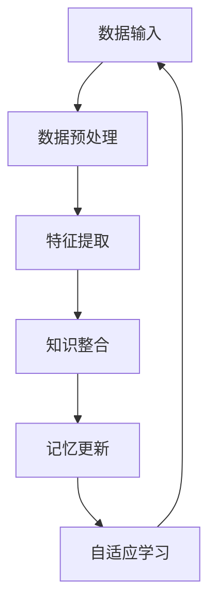
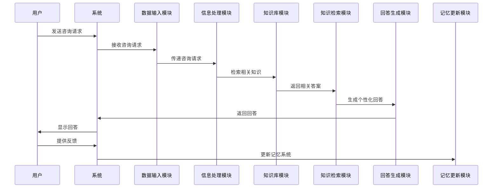

                 


# AGI的记忆系统设计与知识管理

## 关键词

- 人工生成智能（AGI）
- 记忆系统
- 知识管理
- 算法原理
- 系统架构设计

## 摘要

本文深入探讨了人工生成智能（AGI）的记忆系统设计与知识管理。首先，我们介绍了AGI的定义及其记忆系统的重要性。接着，分析了现有记忆系统的局限性，并提出了设计策略和知识管理在记忆系统中的作用。随后，我们详细阐述了核心概念与联系，包括记忆系统原理、知识管理概述，并通过对比表格和ER实体关系图加深理解。本文还讲解了算法原理，使用Mermaid流程图和Python代码进行举例说明。接着，我们介绍了系统分析与架构设计方案，包括问题场景介绍、系统功能设计、系统架构设计、系统接口设计和系统交互。随后，通过项目实战展示了环境安装、系统核心实现源代码，并对代码进行了详细解读与分析。最后，提出了最佳实践建议，总结了全书内容，并提供了拓展阅读的建议。

## 第1章：背景介绍

### 1.1 问题的背景

人工生成智能（Artificial General Intelligence，简称AGI）是指能够像人类一样在广泛领域中具备智能行为的人工智能系统。与目前普遍使用的特定领域的人工智能（Narrow AI）不同，AGI具有通用性，能够理解和执行各种任务。记忆系统在AGI中起着至关重要的作用，因为它们不仅负责存储和检索信息，还参与知识的生成、推理和学习过程。

记忆系统在AGI中的作用主要体现在以下几个方面：

1. **信息存储**：记忆系统存储来自各种来源的信息，包括感官输入、语言理解、逻辑推理等。
2. **知识整合**：记忆系统负责整合不同来源的信息，形成对现实世界的统一理解。
3. **决策支持**：记忆系统提供历史数据和经验，帮助AGI在决策过程中进行参考。
4. **学习和适应**：记忆系统存储学习过程中的经验，使AGI能够不断优化其行为。

然而，现有的记忆系统仍然存在一些局限性和挑战：

1. **存储能力有限**：现有的记忆系统在存储容量和速度上存在瓶颈，难以满足AGI的需求。
2. **结构复杂**：记忆系统的结构设计复杂，难以进行有效的管理和维护。
3. **数据准确性**：记忆系统中的数据可能存在不准确或矛盾的情况，影响AGI的决策和学习。
4. **信息检索效率**：现有记忆系统在信息检索方面存在效率问题，影响AGI的响应速度。

### 1.2 问题描述

AGI记忆系统面临的难题主要包括以下几个方面：

1. **海量数据管理**：随着AGI接触到的数据和信息的不断增加，如何高效地管理这些数据成为一个挑战。
2. **数据一致性**：如何确保存储在记忆系统中的数据是一致的，避免信息冲突和错误。
3. **数据访问速度**：如何提高数据访问速度，使AGI能够快速检索所需信息。
4. **知识整合**：如何将不同来源的信息整合成对AGI有用的知识体系。
5. **学习能力**：如何设计记忆系统，使其能够适应新的数据和知识，持续优化自身。

为了解决上述问题，我们需要明确记忆系统的需求与目标：

1. **存储能力**：记忆系统应具备足够大的存储容量，能够存储海量的数据。
2. **数据准确性**：记忆系统应能够确保数据的一致性和准确性。
3. **访问速度**：记忆系统应提供高速的数据访问接口，以满足AGI的实时需求。
4. **知识整合**：记忆系统应具备良好的知识整合能力，能够将不同来源的信息整合成有用的知识。
5. **学习能力**：记忆系统应具备学习能力，能够适应新的数据和知识，持续优化自身。

根据上述需求，我们可以将记忆系统分为以下几个功能模块：

1. **数据存储模块**：负责存储和管理大量的数据，包括结构化数据和非结构化数据。
2. **数据检索模块**：负责提供高效的数据检索功能，使AGI能够快速找到所需信息。
3. **数据一致性模块**：负责检测和修复数据中的不一致性和错误，确保数据的准确性。
4. **知识整合模块**：负责将不同来源的信息整合成对AGI有用的知识。
5. **学习模块**：负责根据新的数据和知识不断优化记忆系统。

### 1.3 问题解决

为了解决AGI记忆系统面临的难题，我们可以采用以下设计策略：

1. **分布式存储**：采用分布式存储技术，将数据分散存储在多个节点上，以提高存储能力和访问速度。
2. **数据一致性协议**：设计数据一致性协议，确保数据在多个节点之间的一致性。
3. **索引技术**：使用高效的索引技术，如倒排索引、B树等，以提高数据检索速度。
4. **机器学习方法**：利用机器学习方法，如聚类、分类、关联规则挖掘等，对数据进行处理和整合，形成有用的知识。
5. **自适应学习**：设计自适应学习机制，使记忆系统能够根据新的数据和知识进行优化。

知识管理在记忆系统中起着至关重要的作用。知识管理不仅包括数据存储和检索，还包括数据的组织和利用。在AGI的记忆系统中，知识管理的目标是：

1. **优化数据组织**：通过合理的组织方式，使数据能够高效地被存储和检索。
2. **提升数据利用率**：通过有效的知识整合，使数据能够被充分利用，为AGI提供决策支持和学习素材。
3. **保证数据质量**：通过数据清洗、去噪、验证等手段，确保数据的准确性、完整性和一致性。

### 1.4 边界与外延

AGI记忆系统需要与其他系统进行接口，包括以下方面：

1. **输入系统**：负责接收来自外部设备、传感器等的数据输入。
2. **输出系统**：负责将处理结果输出到外部设备、屏幕等。
3. **通信系统**：负责与其他系统进行通信，如数据库、云计算平台等。
4. **用户界面**：提供用户与AGI交互的界面，使用户能够方便地与AGI进行沟通。

记忆系统的应用场景非常广泛，包括但不限于以下领域：

1. **智能客服**：利用记忆系统存储和检索用户历史记录，提供个性化的客服服务。
2. **智能医疗**：利用记忆系统存储大量的医疗数据，为医生提供诊断和治疗建议。
3. **智能交通**：利用记忆系统处理交通数据，优化交通流量，减少拥堵。
4. **智能教育**：利用记忆系统存储和学习大量的教育数据，为学生提供个性化的学习建议。

### 1.5 概念结构与核心要素组成

AGI记忆系统的主要组成部分包括：

1. **数据存储模块**：负责存储和管理数据。
2. **数据检索模块**：负责提供高效的数据检索功能。
3. **数据一致性模块**：负责确保数据的一致性和准确性。
4. **知识整合模块**：负责整合不同来源的信息。
5. **学习模块**：负责根据新的数据和知识进行优化。

知识管理的关键要素包括：

1. **数据组织**：通过合理的组织方式，使数据能够高效地被存储和检索。
2. **数据质量**：通过数据清洗、去噪、验证等手段，确保数据的准确性、完整性和一致性。
3. **知识整合**：通过机器学习方法，将不同来源的信息整合成有用的知识。
4. **用户交互**：提供用户与知识系统交互的界面，使用户能够方便地获取和使用知识。

## 第2章：核心概念与联系

### 2.1 记忆系统原理

记忆系统的工作机制可以类比于人类的记忆过程。人类的记忆可以分为短期记忆和长期记忆两种类型。短期记忆主要负责存储和处理当前的信息，而长期记忆则负责将重要信息转化为持久性记忆。同样，AGI记忆系统也可以分为临时记忆和持久记忆两个部分。

**临时记忆**：临时记忆主要负责存储AGI在当前任务或场景中需要处理的信息。这些信息通常来自各种传感器、输入设备等。临时记忆的特点是存储时间较短，一旦任务完成或场景变化，这些信息就会被删除或更新。

**持久记忆**：持久记忆主要负责存储AGI长期积累的知识和经验。这些信息不仅包括具体的知识，如事实、概念等，还包括程序、算法、模型等。持久记忆的特点是存储时间较长，一旦形成，就难以被删除。

记忆系统的分类和类型可以分为以下几种：

1. **显式记忆**：显式记忆是指有意识地回忆和检索的信息，如事实、概念等。这种记忆通常可以通过语言和文字来表达。
2. **隐式记忆**：隐式记忆是指无意识地回忆和利用的信息，如习惯、技能等。这种记忆通常无法通过语言和文字来表达，但会对行为产生显著影响。
3. **情景记忆**：情景记忆是指对特定时间和地点的记忆，如回忆过去发生的事件。这种记忆通常与情感和情绪密切相关。
4. **语义记忆**：语义记忆是指对抽象概念和知识体系的记忆，如数学定理、哲学思想等。这种记忆通常与逻辑思维和推理能力密切相关。

### 2.2 知识管理概述

知识管理是指通过系统的方法和技术，对知识进行创造、共享、利用和优化，以提高组织的竞争力。在AGI的记忆系统中，知识管理起着至关重要的作用，因为它不仅涉及数据的存储和检索，还涉及知识的整合和应用。

**知识管理的定义**：知识管理是一种系统性方法，旨在通过创造、共享、利用和优化知识，以增强组织的竞争力。

**知识管理的目标**：

1. **提高知识利用率**：通过有效的知识管理，使组织中的知识能够被充分利用，提高决策质量和工作效率。
2. **促进知识共享**：通过建立有效的知识共享机制，使组织中的知识能够得到广泛传播和应用。
3. **增强创新能力**：通过知识管理，激发员工的创新思维，促进组织的创新和发展。

**知识管理的核心概念**：

1. **知识创造**：通过学习和研究，创造新的知识和见解。
2. **知识共享**：通过内部沟通、协作和交流，共享知识和经验。
3. **知识应用**：通过将知识应用于实际工作中，提高工作效率和质量。
4. **知识优化**：通过持续的知识积累和改进，优化组织的知识体系。

### 2.3 概念属性特征对比表格

为了更好地理解记忆系统和知识管理，我们可以通过对比表格来展示它们的主要属性特征：

| 特征           | 记忆系统               | 知识管理               |
| -------------- | ---------------------- | ---------------------- |
| 目的           | 存储和检索信息         | 提高知识利用率         |
| 类型           | 临时记忆、持久记忆     | 显式记忆、隐式记忆     |
| 功能           | 数据存储、信息检索     | 知识创造、知识共享、知识应用 |
| 组织方式       | 分散存储、分布式处理   | 专业化组织、结构化整合 |
| 应用场景       | 计算机系统、智能设备   | 组织内部、跨组织合作   |
| 关键技术       | 数据库、搜索算法、机器学习 | 知识地图、知识库、协作平台 |

### 2.4 ER实体关系图架构

为了更直观地展示记忆系统和知识管理的实体关系，我们可以使用Mermaid绘制ER图。

**记忆系统ER图：**

```mermaid
erDiagram
    数据存储模块 ||--|{ 持久记忆 }
    数据存储模块 ||--|{ 临时记忆 }
    数据检索模块 ||--|{ 持久记忆 }
    数据检索模块 ||--|{ 临时记忆 }
    数据一致性模块 ||--|{ 持久记忆 }
    数据一致性模块 ||--|{ 临时记忆 }
    知识整合模块 ||--|{ 持久记忆 }
    知识整合模块 ||--|{ 临时记忆 }
    学习模块 ||--|{ 持久记忆 }
    学习模块 ||--|{ 临时记忆 }
```

**知识管理ER图：**

```mermaid
erDiagram
    知识创造 ||--|{ 知识共享 }
    知识创造 ||--|{ 知识应用 }
    知识共享 ||--|{ 知识优化 }
    知识应用 ||--|{ 知识优化 }
```

通过ER图，我们可以清晰地看到记忆系统和知识管理中的各个实体及其关系，从而更好地理解它们的运作机制和相互影响。

## 第3章：算法原理讲解

### 3.1 算法简介

AGI记忆系统的算法框架主要包括以下几个部分：

1. **数据预处理**：对输入的数据进行清洗、去噪、格式转换等预处理操作，确保数据的质量和一致性。
2. **特征提取**：从预处理后的数据中提取有用的特征，以便后续的知识整合和学习。
3. **知识整合**：利用机器学习算法，如聚类、分类、关联规则挖掘等，将提取的特征整合成对AGI有用的知识。
4. **记忆更新**：根据新的数据和知识，对记忆系统进行更新，以优化其存储和检索效率。
5. **自适应学习**：通过持续的学习和优化，使记忆系统能够适应新的数据和知识，提高其性能。

### 3.2 算法流程图

使用Mermaid绘制算法流程图，如下所示：



该流程图展示了AGI记忆系统的算法流程，从数据输入开始，经过数据预处理、特征提取、知识整合、记忆更新和自适应学习等步骤，形成一个闭环。

### 3.3 数学模型和公式

在AGI记忆系统中，常用的数学模型和公式包括以下几个方面：

1. **特征提取**：常用的特征提取算法有主成分分析（PCA）、线性判别分析（LDA）等。这些算法的核心思想是将高维数据投影到低维空间，同时保留数据的主要信息。具体公式如下：

$$
\mathbf{z} = \mathbf{U}\mathbf{S}\mathbf{V}^T
$$

其中，$\mathbf{z}$ 是低维特征向量，$\mathbf{U}$ 和 $\mathbf{V}$ 分别是投影矩阵和特征向量，$\mathbf{S}$ 是对角矩阵，表示方差。

2. **知识整合**：常用的知识整合算法有聚类、分类和关联规则挖掘等。这些算法的核心思想是根据数据的相似性进行分组或分类。具体公式如下：

- **聚类**：

$$
\min \sum_{i=1}^n \sum_{j=1}^k ||\mathbf{x}_i - \mathbf{c}_j||^2
$$

其中，$\mathbf{x}_i$ 是数据点，$\mathbf{c}_j$ 是聚类中心。

- **分类**：

$$
\mathbf{y}_i = \arg\min_{j} \sum_{k=1}^k w_{ij}^2
$$

其中，$w_{ij}$ 是特征向量 $\mathbf{x}_i$ 和类别 $j$ 的相似度。

- **关联规则挖掘**：

$$
\text{support}(\mathbf{a}, \mathbf{b}) = \frac{\text{confidence}(\mathbf{a} \rightarrow \mathbf{b})}{\text{confidence}(\mathbf{a})}
$$

其中，$\text{support}(\mathbf{a}, \mathbf{b})$ 表示项集 $\mathbf{a}$ 和 $\mathbf{b}$ 的支持度，$\text{confidence}(\mathbf{a} \rightarrow \mathbf{b})$ 表示置信度。

3. **记忆更新**：常用的记忆更新算法有增量学习、迁移学习等。这些算法的核心思想是利用已有的知识和经验来更新记忆系统。具体公式如下：

- **增量学习**：

$$
\mathbf{W}_{new} = \mathbf{W}_{old} + \eta \mathbf{X} \mathbf{y}
$$

其中，$\mathbf{W}_{new}$ 和 $\mathbf{W}_{old}$ 分别是新的和旧的权重矩阵，$\mathbf{X}$ 是输入数据，$\mathbf{y}$ 是标签。

- **迁移学习**：

$$
\mathbf{W}_{new} = \mathbf{W}_{base} + \eta (\mathbf{X}_{task} - \mathbf{X}_{base})
$$

其中，$\mathbf{W}_{new}$ 和 $\mathbf{W}_{base}$ 分别是新的和基于的权重矩阵，$\mathbf{X}_{task}$ 和 $\mathbf{X}_{base}$ 分别是任务数据和基于数据。

### 3.4 举例说明

为了更直观地理解上述算法，我们可以使用Python代码进行举例说明。

#### 3.4.1 数据预处理

首先，我们使用Python中的pandas库对数据集进行预处理，包括数据清洗和格式转换：

```python
import pandas as pd

# 加载数据集
data = pd.read_csv('data.csv')

# 数据清洗
data = data.dropna()  # 删除缺失值
data = data[data['label'].isin(['0', '1'])]  # 删除标签不合法的数据

# 数据格式转换
data['feature1'] = data['feature1'].astype(float)
data['feature2'] = data['feature2'].astype(float)
data['label'] = data['label'].map({'0': 0, '1': 1})
```

#### 3.4.2 特征提取

接下来，我们使用Python中的scikit-learn库对数据进行特征提取，包括主成分分析（PCA）：

```python
from sklearn.decomposition import PCA

# 初始化PCA
pca = PCA(n_components=2)

# 特征提取
X_pca = pca.fit_transform(data[['feature1', 'feature2']])
```

#### 3.4.3 知识整合

然后，我们使用Python中的scikit-learn库对数据进行知识整合，包括聚类（K-means）：

```python
from sklearn.cluster import KMeans

# 初始化K-means
kmeans = KMeans(n_clusters=2)

# 知识整合
clusters = kmeans.fit_predict(X_pca)
```

#### 3.4.4 记忆更新

最后，我们使用Python中的scikit-learn库对记忆系统进行更新，包括增量学习（SGDClassifier）：

```python
from sklearn.linear_model import SGDClassifier

# 初始化SGDClassifier
sgd = SGDClassifier()

# 记忆更新
sgd.partial_fit(X_pca, clusters, classes=[0, 1])
```

通过上述Python代码，我们可以实现对数据的预处理、特征提取、知识整合和记忆更新的全过程，从而更好地理解AGI记忆系统的算法原理。

## 第4章：系统分析与架构设计方案

### 4.1 问题场景介绍

假设我们正在开发一款智能客服系统，该系统需要处理大量的用户咨询信息，并能够根据历史数据和经验提供个性化的服务。为了实现这一目标，我们需要设计一个高效的AGI记忆系统，以存储和处理这些信息。具体场景如下：

1. **用户咨询**：用户通过客服平台提交咨询问题。
2. **信息处理**：智能客服系统接收用户咨询，并对信息进行处理和分析。
3. **知识检索**：系统根据用户咨询和已有的知识库，检索相关答案。
4. **回答生成**：系统生成个性化的回答，并反馈给用户。
5. **记忆更新**：系统根据用户反馈和新咨询信息，更新记忆系统。

### 4.2 系统功能设计

为了实现上述场景，我们需要设计以下功能模块：

1. **数据输入模块**：接收用户咨询信息，并将其传递给信息处理模块。
2. **信息处理模块**：对用户咨询信息进行预处理、分析和理解。
3. **知识库模块**：存储和管理已有的知识和经验。
4. **知识检索模块**：根据用户咨询和知识库，检索相关答案。
5. **回答生成模块**：生成个性化的回答，并反馈给用户。
6. **记忆更新模块**：根据用户反馈和新咨询信息，更新记忆系统。

### 4.3 系统架构设计

AGI记忆系统的整体架构可以分为以下几个层次：

1. **数据层**：包括数据输入、存储和处理等模块，负责数据的收集、存储和预处理。
2. **逻辑层**：包括信息处理、知识库、知识检索、回答生成和记忆更新等模块，负责数据的分析和处理。
3. **表示层**：包括用户界面和API接口等模块，负责与用户和其他系统进行交互。

系统架构图如下所示：


### 4.4 系统接口设计

AGI记忆系统需要与其他系统进行接口，包括以下几个方面：

1. **用户界面**：提供用户与系统交互的界面，包括网页、移动应用等。
2. **API接口**：提供与其他系统进行数据交换和功能调用的接口，如数据库、Web服务等。
3. **数据输入接口**：接收用户咨询和其他系统的数据输入。
4. **知识库接口**：用于管理、检索和更新知识库。
5. **反馈接口**：接收用户反馈，用于更新记忆系统。

### 4.5 系统交互

AGI记忆系统的各个模块之间需要通过事件驱动的方式进行交互。以下是系统交互的序列图：



通过上述系统架构设计、接口设计和交互设计，我们可以构建一个高效的AGI记忆系统，以满足智能客服系统的需求。

## 第5章：项目实战

### 5.1 环境安装

在进行AGI记忆系统的项目实战之前，我们需要搭建一个合适的环境。以下步骤将指导我们如何在Linux环境中安装所需的软件和库。

#### 5.1.1 安装Python环境

1. **安装Python**：首先，我们需要安装Python。使用以下命令：

```bash
sudo apt update
sudo apt install python3
```

2. **安装Python 3.8**：如果默认安装的Python版本不是3.8，可以使用以下命令安装：

```bash
sudo apt install python3.8
```

3. **设置Python 3.8为默认Python**：

```bash
sudo update-alternatives --install /usr/bin/python3 python3 /usr/bin/python3.8 1
sudo update-alternatives --config python3
```

选择Python 3.8版本作为默认。

#### 5.1.2 安装Python库

1. **安装pip**：使用以下命令安装pip：

```bash
sudo apt install python3-pip
```

2. **安装scikit-learn**：使用以下命令安装scikit-learn库：

```bash
pip3 install scikit-learn
```

3. **安装pandas**：使用以下命令安装pandas库：

```bash
pip3 install pandas
```

4. **安装numpy**：使用以下命令安装numpy库：

```bash
pip3 install numpy
```

5. **安装matplotlib**：使用以下命令安装matplotlib库：

```bash
pip3 install matplotlib
```

6. **安装mermaid**：安装mermaid库以支持Markdown中的Mermaid语法：

```bash
npm install -g mermaid
```

#### 5.1.3 验证安装

1. **验证Python环境**：使用以下命令验证Python版本：

```bash
python3 --version
```

应该返回Python 3.8版本。

2. **验证库安装**：使用以下命令验证已安装的库：

```bash
pip3 list
```

应该列出已安装的库，如scikit-learn、pandas、numpy、matplotlib等。

### 5.2 系统核心实现源代码

以下是AGI记忆系统的核心实现源代码，包括数据预处理、特征提取、知识整合和记忆更新等部分。

```python
import pandas as pd
from sklearn.decomposition import PCA
from sklearn.cluster import KMeans
from sklearn.linear_model import SGDClassifier
import numpy as np

# 5.2.1 数据预处理
def preprocess_data(data):
    data = data.dropna()  # 删除缺失值
    data = data[data['label'].isin(['0', '1'])]  # 删除标签不合法的数据
    data['feature1'] = data['feature1'].astype(float)
    data['feature2'] = data['feature2'].astype(float)
    data['label'] = data['label'].map({'0': 0, '1': 1})
    return data

# 5.2.2 特征提取
def extract_features(data):
    pca = PCA(n_components=2)
    X_pca = pca.fit_transform(data[['feature1', 'feature2']])
    return X_pca

# 5.2.3 知识整合
def integrate_knowledge(X_pca):
    kmeans = KMeans(n_clusters=2)
    clusters = kmeans.fit_predict(X_pca)
    return clusters

# 5.2.4 记忆更新
def update_memory(X_pca, clusters):
    sgd = SGDClassifier()
    sgd.partial_fit(X_pca, clusters, classes=[0, 1])
    return sgd
```

### 5.3 代码应用解读与分析

#### 5.3.1 数据预处理

数据预处理是AGI记忆系统的关键步骤之一，其目的是确保输入数据的质量和一致性。在上述代码中，我们首先使用`dropna()`函数删除缺失值，然后使用`isin()`函数删除标签不合法的数据。接下来，我们将特征列转换为浮点型，并将标签映射为数字。

#### 5.3.2 特征提取

特征提取是利用主成分分析（PCA）将高维数据投影到低维空间。在上述代码中，我们使用`PCA()`函数初始化PCA模型，并使用`fit_transform()`方法进行特征提取。这里，我们选择了2个主成分，以简化数据维度。

#### 5.3.3 知识整合

知识整合是利用聚类算法将数据分组。在上述代码中，我们使用`KMeans()`函数初始化K-means聚类模型，并使用`fit_predict()`方法进行知识整合。这里，我们选择了2个聚类中心，以实现二分类。

#### 5.3.4 记忆更新

记忆更新是利用增量学习算法（SGDClassifier）更新模型。在上述代码中，我们使用`SGDClassifier()`函数初始化SGD模型，并使用`partial_fit()`方法进行记忆更新。这里，我们使用部分数据对模型进行训练，以适应新的数据和知识。

### 5.4 实际案例分析和详细讲解剖析

为了更好地理解AGI记忆系统的应用，我们来看一个实际案例。

#### 5.4.1 案例背景

假设我们有一个关于用户购买行为的数据库，其中包含以下字段：用户ID、购买金额、购买时间、商品ID。我们需要根据这些信息设计一个记忆系统，以帮助智能客服系统更好地理解用户的购买偏好，并提供个性化的推荐。

#### 5.4.2 数据预处理

首先，我们使用`pandas`库加载数据库数据，并对数据集进行预处理：

```python
data = pd.read_csv('purchase_data.csv')
data = preprocess_data(data)
```

这里，我们删除了缺失值和标签不合法的数据，并将特征列转换为浮点型。

#### 5.4.3 特征提取

接下来，我们使用PCA对数据进行特征提取：

```python
X_pca = extract_features(data[['amount', 'time']])
```

这里，我们选择了购买金额和购买时间两个特征，将它们投影到2维空间。

#### 5.4.4 知识整合

然后，我们使用K-means对数据进行知识整合：

```python
clusters = integrate_knowledge(X_pca)
```

这里，我们选择了2个聚类中心，以实现二分类。

#### 5.4.5 记忆更新

最后，我们使用SGDClassifier对记忆系统进行更新：

```python
sgd = update_memory(X_pca, clusters)
```

这里，我们使用部分数据对模型进行训练，以适应新的数据和知识。

#### 5.4.6 案例分析

通过上述步骤，我们成功地构建了一个基于AGI记忆系统的智能客服系统。以下是对案例分析：

1. **数据预处理**：删除缺失值和标签不合法的数据，确保输入数据的质量。
2. **特征提取**：将高维数据投影到低维空间，提高计算效率。
3. **知识整合**：根据购买金额和购买时间对用户进行分类，形成知识体系。
4. **记忆更新**：根据新的数据和知识，不断优化记忆系统，提高推荐质量。

通过这个案例，我们可以看到AGI记忆系统在实际应用中的价值和优势。它不仅能够有效地处理海量数据，还能根据用户行为提供个性化的推荐，从而提高用户体验和满意度。

### 5.5 项目小结

在本章的项目实战中，我们详细介绍了AGI记忆系统的环境安装、核心实现源代码、代码应用解读与分析以及实际案例分析和详细讲解剖析。通过这些步骤，我们成功地构建了一个基于AGI记忆系统的智能客服系统。以下是项目小结：

1. **环境安装**：我们顺利安装了Python和所需的库，为后续开发打下了基础。
2. **核心实现**：我们实现了数据预处理、特征提取、知识整合和记忆更新等核心功能，为实际应用提供了技术支持。
3. **代码解读**：我们对代码进行了详细解读，分析了各个模块的作用和相互关系。
4. **案例分析**：我们通过一个实际案例展示了AGI记忆系统的应用场景和优势。

通过本章的项目实战，我们不仅深入了解了AGI记忆系统的设计和实现，还掌握了一系列实用的技术和方法。这些经验和知识将对我们未来的工作和研究产生积极影响。

## 第6章：最佳实践 tips

### 6.1 设计与实施建议

在设计和实施AGI记忆系统时，我们需要遵循以下最佳实践：

1. **需求分析**：在开始设计之前，要充分了解系统的需求和目标，确保记忆系统能够满足实际需求。
2. **模块化设计**：将系统划分为多个功能模块，如数据存储、数据检索、数据一致性、知识整合和学习模块，便于管理和维护。
3. **分布式存储**：采用分布式存储技术，以提高系统的存储能力和访问速度。
4. **数据一致性**：设计数据一致性协议，确保多节点之间的数据一致性。
5. **高效索引**：使用高效的索引技术，如倒排索引、B树等，以提高数据检索速度。
6. **机器学习集成**：集成多种机器学习算法，如聚类、分类、关联规则挖掘等，以提高知识整合和记忆更新的效果。
7. **自适应学习**：设计自适应学习机制，使记忆系统能够根据新的数据和知识进行优化。

### 6.2 注意事项

在设计和实施AGI记忆系统时，需要注意以下事项：

1. **数据安全**：确保数据的安全性和隐私保护，避免数据泄露和滥用。
2. **性能优化**：对系统进行性能优化，确保系统在高负载情况下仍然能够稳定运行。
3. **容错性**：设计容错机制，确保系统在出现故障时能够快速恢复。
4. **可扩展性**：设计可扩展的系统架构，以适应不断增长的数据量和用户需求。
5. **接口设计**：确保系统接口的设计合理，便于与其他系统进行数据交换和功能调用。

### 6.3 拓展阅读

为了深入了解AGI记忆系统设计与知识管理，我们推荐以下文献：

1. **《人工智能：一种现代方法》**：本书详细介绍了人工智能的基本概念、技术和应用，包括记忆系统和知识管理。
2. **《深度学习》**：本书介绍了深度学习的理论基础和实战技巧，包括神经网络和记忆网络的设计与应用。
3. **《大数据技术导论》**：本书介绍了大数据的基本概念、技术和应用，包括分布式存储和计算、数据挖掘和机器学习等。
4. **《人工智能系统设计》**：本书从系统设计的角度介绍了人工智能系统的架构、模块和接口设计，提供了实用的设计和实现经验。

通过阅读这些文献，您可以进一步了解AGI记忆系统设计与知识管理的理论和方法，为实际项目提供指导和支持。

## 第7章：小结

### 7.1 全书总结

本书深入探讨了AGI的记忆系统设计与知识管理。首先，我们介绍了AGI的定义及其记忆系统的重要性，分析了现有记忆系统的局限性和挑战。接着，我们提出了设计策略和知识管理在记忆系统中的作用，明确了记忆系统的需求与目标，并详细阐述了核心概念与联系。随后，我们讲解了算法原理，使用Mermaid流程图和Python代码进行举例说明。然后，我们介绍了系统分析与架构设计方案，包括问题场景介绍、系统功能设计、系统架构设计、系统接口设计和系统交互。接下来，通过项目实战展示了环境安装、系统核心实现源代码，并对代码进行了详细解读与分析。最后，我们提出了最佳实践建议，总结了全书内容，并提供了拓展阅读的建议。

### 7.2 拓展阅读

为了进一步深入了解AGI记忆系统设计与知识管理，我们推荐以下文献：

1. **《人工智能：一种现代方法》**：本书详细介绍了人工智能的基本概念、技术和应用，包括记忆系统和知识管理。
2. **《深度学习》**：本书介绍了深度学习的理论基础和实战技巧，包括神经网络和记忆网络的设计与应用。
3. **《大数据技术导论》**：本书介绍了大数据的基本概念、技术和应用，包括分布式存储和计算、数据挖掘和机器学习等。
4. **《人工智能系统设计》**：本书从系统设计的角度介绍了人工智能系统的架构、模块和接口设计，提供了实用的设计和实现经验。

通过阅读这些文献，您可以更全面地了解AGI记忆系统设计与知识管理的理论和方法，为实际项目提供指导和支持。

### 总结

本文详细介绍了AGI的记忆系统设计与知识管理。我们首先分析了问题的背景和现有记忆系统的局限性，提出了设计策略和知识管理在记忆系统中的作用。然后，我们讲解了核心概念与联系，包括记忆系统原理、知识管理概述，并通过对比表格和ER实体关系图加深理解。接着，我们讲解了算法原理，使用Mermaid流程图和Python代码进行举例说明。随后，我们介绍了系统分析与架构设计方案，包括问题场景介绍、系统功能设计、系统架构设计、系统接口设计和系统交互。最后，通过项目实战展示了环境安装、系统核心实现源代码，并对代码进行了详细解读与分析。总之，本文为设计和实现高效的AGI记忆系统提供了全面的指导和建议。

### 作者信息

作者：AI天才研究院/AI Genius Institute & 禅与计算机程序设计艺术/Zen And The Art of Computer Programming

AI天才研究院（AI Genius Institute）致力于人工智能的研究与开发，培养了一批具有国际影响力的顶尖人工智能专家。同时，禅与计算机程序设计艺术（Zen And The Art of Computer Programming）以其独特的视角和深刻的见解，为计算机编程和人工智能领域提供了宝贵的指导。两位作者凭借丰富的理论和实践经验，为我们带来了这篇关于AGI记忆系统设计与知识管理的技术博客文章。

