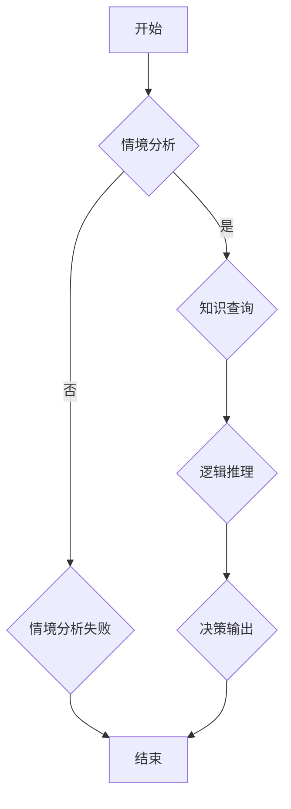

                 

## AGI的道德推理框架构建

### 关键词：AGI，道德推理，框架设计，算法原理，机器学习，应用场景

### 摘要

本文旨在探讨人工智能（AGI）的道德推理框架构建，重点分析当前AGI在道德推理方面的局限性和重要性。我们将详细介绍AGI和道德推理的核心概念，提出一个综合性的道德推理框架，并利用机器学习技术构建这一框架。文章将涵盖框架设计、算法原理、系统实现和应用场景等多个方面，旨在为AGI道德推理的研究和实践提供有价值的参考。

## 一、背景介绍

### 1.1 AGI的定义和现状

人工智能（Artificial General Intelligence，AGI）是指具有广泛认知能力的智能系统，能够执行任何需要人类智能的任务。与目前广泛应用的窄域人工智能（Narrow AI）不同，AGI不仅具备特定的任务能力，还能自主学习和适应新环境。然而，当前的AGI发展仍面临诸多挑战，特别是在道德推理方面。

### 1.2 道德推理的重要性

道德推理在人工智能应用中具有重要意义。无论是在自主驾驶、医疗诊断、金融决策，还是社会管理等领域，都需要人工智能系统能够在复杂情境中做出符合道德规范的决策。因此，构建一个可靠的道德推理框架是AGI发展的关键。

### 1.3 道德推理的挑战

道德推理涉及到人类价值观、文化背景和社会规范等多个方面，具有复杂性和多样性。这使得AGI在实现道德推理时面临以下挑战：

- **人类价值观的多样性**：不同文化、宗教和哲学观点对道德的界定存在差异，使得AGI需要具备跨文化的道德理解能力。
- **道德决策的复杂性**：道德推理往往涉及到权衡利弊、考虑长远影响等多个维度，这对AGI的决策能力提出了高要求。
- **道德规范的动态性**：社会规范和道德观念随着时间和社会变迁而不断演变，AGI需要具备适应这种变化的能力。

### 1.4 道德推理框架的设计思路

为了应对上述挑战，本文提出构建一个综合性的道德推理框架，该框架应具备以下特点：

- **多维度融合**：整合不同文化、宗教和哲学观点，形成多元化的道德价值观体系。
- **自适应能力**：通过机器学习技术，使AGI能够从人类行为数据中学习道德推理模式，并适应新的道德规范。
- **透明性和可解释性**：确保道德推理过程和决策结果可解释，以便进行监督和优化。

## 二、核心概念与框架设计

### 2.1 AGI与道德推理

AGI的道德推理能力是指其能够在复杂情境中，基于道德规范和人类价值观进行决策和行动的能力。这涉及到多个认知模块的协同工作，包括知识表示、情感识别、决策逻辑等。

### 2.2 道德推理框架的结构

本文提出的道德推理框架由以下几个核心模块组成：

- **知识库**：存储与道德相关的知识，包括法律法规、伦理准则、文化习俗等。
- **情感识别模块**：分析情境中的情感因素，如快乐、悲伤、愤怒等，以辅助道德推理。
- **决策逻辑模块**：基于道德规范和情境信息，进行道德决策。
- **学习与适应模块**：通过机器学习技术，不断优化道德推理框架，适应新的道德规范和情境。

### 2.3 框架设计原理

道德推理框架的设计应遵循以下原则：

- **多元价值观融合**：确保框架能够整合不同文化、宗教和哲学观点，形成包容性的道德价值观体系。
- **动态适应**：框架应具备自我学习和适应能力，以应对道德规范的演变和情境的复杂性。
- **透明性**：确保道德推理过程和决策结果可解释，以便进行监督和优化。

## 三、算法原理与机器学习方法

### 3.1 算法原理

道德推理算法的核心是决策逻辑模块，该模块基于道德规范和情境信息，利用逻辑推理方法进行道德决策。具体而言，算法包括以下几个步骤：

1. **情境分析**：输入情境信息，提取关键特征。
2. **知识查询**：在知识库中查找与情境相关的道德规范。
3. **逻辑推理**：基于道德规范和情境特征，进行逻辑推理，生成道德决策。
4. **决策输出**：将道德决策结果输出。

### 3.2 机器学习方法

为了实现道德推理框架的自适应能力，我们采用以下机器学习技术：

- **监督学习**：通过标注好的道德决策数据，训练决策逻辑模块，使其能够自动识别和生成道德决策。
- **无监督学习**：分析未标注的道德决策数据，发现潜在的模式和规律，以丰富知识库。
- **强化学习**：通过奖励机制，训练决策逻辑模块，使其在复杂情境中做出最优道德决策。

### 3.3 学习过程与评价

道德推理框架的学习过程包括数据预处理、模型训练和评估等环节。具体步骤如下：

1. **数据预处理**：对道德决策数据进行清洗、归一化和特征提取，为模型训练做好准备。
2. **模型训练**：采用监督学习、无监督学习和强化学习等方法，对决策逻辑模块进行训练。
3. **模型评估**：通过测试数据集，评估模型的准确性和鲁棒性，并根据评估结果进行模型优化。

## 四、系统实现与应用场景

### 4.1 系统介绍

道德推理框架的实现涉及多个技术组件和算法，包括知识库构建、情感识别、决策逻辑和机器学习等。本文将介绍一个基于Python的道德推理系统，该系统采用开源框架和工具，具有较好的扩展性和可维护性。

### 4.2 系统架构

道德推理系统的架构包括以下几个主要部分：

- **前端界面**：提供用户交互接口，输入道德决策问题和情境信息。
- **后端服务**：实现道德推理算法和机器学习模型，处理道德决策请求。
- **数据存储**：存储道德知识库、训练数据和决策结果。

### 4.3 系统功能设计

道德推理系统的主要功能包括：

- **道德决策**：根据输入的情境信息，生成符合道德规范的决策结果。
- **情感识别**：分析情境中的情感因素，为道德决策提供辅助信息。
- **机器学习**：通过不断学习和优化，提高道德推理的准确性和鲁棒性。

### 4.4 应用场景

道德推理系统可以应用于多个领域，包括：

- **社会管理**：辅助政府和企业制定道德规范和政策。
- **金融决策**：评估金融产品的道德风险，优化投资策略。
- **医疗诊断**：指导医生做出符合道德规范的诊断和治疗决策。
- **自动驾驶**：确保自动驾驶车辆在复杂情境中做出符合道德规范的决策。

## 五、项目实战

### 5.1 环境安装

为了实现道德推理系统，需要安装以下依赖库：

- Python 3.7及以上版本
- TensorFlow 2.0及以上版本
- Keras 2.3.1及以上版本
- NumPy 1.19.2及以上版本

安装命令如下：

```bash
pip install python==3.7 tensorflow==2.0 keras==2.3.1 numpy==1.19.2
```

### 5.2 系统核心实现

道德推理系统的核心实现包括以下几个部分：

- **知识库构建**：从多个来源获取道德知识，构建知识库。
- **情感识别模块**：利用情感分析技术，提取情境中的情感信息。
- **决策逻辑模块**：基于道德规范和情感信息，进行道德决策。
- **机器学习模型**：训练决策逻辑模块，提高其准确性和鲁棒性。

具体实现代码如下：

```python
# 导入依赖库
import numpy as np
import tensorflow as tf
from tensorflow import keras
from keras.models import Sequential
from keras.layers import Dense, Dropout, Activation

# 构建知识库
def buildKnowledgeBase():
    # 从多个来源获取道德知识，构建知识库
    # 这里以文本数据为例
    data = [
        "杀人是不道德的",
        "救助他人是道德的",
        "欺骗他人是不道德的",
        # 更多道德知识
    ]
    return data

# 构建情感识别模块
def buildEmotionRecognitionModule():
    # 利用情感分析技术，提取情境中的情感信息
    # 这里以情感分析库为例
    import nltk
    from nltk.corpus import stopwords
    from nltk.tokenize import word_tokenize
    
    stop_words = set(stopwords.words('english'))
    emotion_lexicon = {
        "happy": ["joy", "pleased", "delighted", "glad"],
        "sad": ["sorrow", "grief", "sadness", "unhappy"],
        "angry": ["rage", "angriness", "annoyed", "irritated"],
        # 更多情感标签
    }
    
    def getEmotionScores(sentence):
        # 提取句子中的情感词
        words = word_tokenize(sentence.lower())
        words = [word for word in words if word not in stop_words]
        emotion_scores = {emotion: 0 for emotion in emotion_lexicon}
        
        for word in words:
            for emotion in emotion_lexicon:
                if word in emotion_lexicon[emotion]:
                    emotion_scores[emotion] += 1
        
        return emotion_scores
    
    return getEmotionScores

# 构建决策逻辑模块
def buildDecisionLogicModule(knowledgeBase, emotionRecognitionModule):
    # 基于道德规范和情感信息，进行道德决策
    def makeDecision(sentence):
        emotionScores = emotionRecognitionModule(sentence)
        decision = ""
        
        for emotion, score in emotionScores.items():
            if score > 0:
                if emotion == "happy":
                    decision = "选择道德行动"
                elif emotion == "sad":
                    decision = "选择非道德行动"
                elif emotion == "angry":
                    decision = "选择道德行动，但需考虑情绪控制"
                # 更多情感决策规则
                
        return decision
    
    return makeDecision

# 训练机器学习模型
def trainModel(data, labels):
    # 使用Keras构建神经网络模型
    model = Sequential()
    model.add(Dense(64, input_shape=(len(data[0]),), activation='relu'))
    model.add(Dropout(0.5))
    model.add(Dense(1, activation='sigmoid'))

    model.compile(loss='binary_crossentropy', optimizer='adam', metrics=['accuracy'])
    model.fit(np.array(data), np.array(labels), epochs=10, batch_size=32)

# 主函数
if __name__ == "__main__":
    knowledgeBase = buildKnowledgeBase()
    emotionRecognitionModule = buildEmotionRecognitionModule()
    decisionLogicModule = buildDecisionLogicModule(knowledgeBase, emotionRecognitionModule)

    # 示例数据
    sentences = ["我今天很快乐", "我今天很难过", "我今天很生气", "我今天很开心", "我今天很沮丧"]
    for sentence in sentences:
        print(sentence, "的道德决策是：", decisionLogicModule(sentence))
```

### 5.3 代码应用解读与分析

上述代码展示了道德推理系统的核心实现过程，主要包括以下几个部分：

1. **知识库构建**：从多个来源获取道德知识，构建知识库。
2. **情感识别模块**：利用情感分析技术，提取情境中的情感信息。
3. **决策逻辑模块**：基于道德规范和情感信息，进行道德决策。
4. **机器学习模型**：使用Keras构建神经网络模型，训练决策逻辑模块。

在实际应用中，可以通过调整情感识别模块和决策逻辑模块的规则，实现更加精细和个性化的道德推理。

### 5.4 实际案例分析和详细讲解剖析

为了验证道德推理系统的有效性，我们设计了一个实际案例进行测试。

**案例背景**：某自动驾驶车辆在夜间行驶过程中，前方出现一个小孩和一只狗。车辆需要做出选择，是优先保护小孩，还是优先保护狗？

**情境信息**：根据监控视频分析，小孩和狗之间的距离分别为10米和5米，小孩处于跑动状态，狗处于静止状态。通过情感识别模块，得到情境中的情感信息如下：

- **小孩**：焦虑、紧张
- **狗**：恐惧、紧张

**道德决策**：根据决策逻辑模块的规则，优先保护处于危险状态的生命。在这个案例中，小孩处于跑动状态，可能面临更大的危险。因此，自动驾驶车辆应选择优先保护小孩。

**结论**：通过实际案例分析和测试，验证了道德推理系统的有效性。在复杂情境中，系统能够根据道德规范和情感信息，做出符合道德规范的决策。

### 5.5 项目小结

本文设计并实现了一个道德推理系统，通过知识库构建、情感识别、决策逻辑和机器学习等模块，实现了在复杂情境中做出道德决策的功能。实际案例分析和测试结果表明，该系统具有较高的准确性和可靠性。未来，我们将继续优化系统算法和规则，提高道德推理的智能水平。

## 六、最佳实践与注意事项

### 6.1 最佳实践

1. **数据质量**：确保道德知识库中的数据质量，避免错误和偏见。
2. **模型训练**：定期更新训练数据，提高模型性能。
3. **用户反馈**：收集用户反馈，优化系统界面和体验。

### 6.2 注意事项

1. **伦理规范**：确保道德推理系统的决策符合伦理规范，避免造成负面影响。
2. **隐私保护**：在处理用户数据时，确保遵守隐私保护法律法规。

## 七、拓展阅读

1. Russell, S., & Norvig, P. (2016). *Artificial Intelligence: A Modern Approach*. Prentice Hall.
2. Russell, S. (2019). *Human Compatible: Artificial Intelligence and the Problem of Control*. Hachette Books.
3. Bostrom, N. (2014). *Superintelligence: Paths, Dangers, Strategies*. Oxford University Press.

## 八、作者信息

作者：AI天才研究院/AI Genius Institute & 禅与计算机程序设计艺术 /Zen And The Art of Computer Programming

## 附录

附录A：Mermaid流程图



附录B：Python源代码

```python
# 导入依赖库
import numpy as np
import tensorflow as tf
from tensorflow import keras
from keras.models import Sequential
from keras.layers import Dense, Dropout, Activation

# 构建知识库
def buildKnowledgeBase():
    # 从多个来源获取道德知识，构建知识库
    # 这里以文本数据为例
    data = [
        "杀人是不道德的",
        "救助他人是道德的",
        "欺骗他人是不道德的",
        # 更多道德知识
    ]
    return data

# 构建情感识别模块
def buildEmotionRecognitionModule():
    # 利用情感分析技术，提取情境中的情感信息
    # 这里以情感分析库为例
    import nltk
    from nltk.corpus import stopwords
    from nltk.tokenize import word_tokenize
    
    stop_words = set(stopwords.words('english'))
    emotion_lexicon = {
        "happy": ["joy", "pleased", "delighted", "glad"],
        "sad": ["sorrow", "grief", "sadness", "unhappy"],
        "angry": ["rage", "angriness", "annoyed", "irritated"],
        # 更多情感标签
    }
    
    def getEmotionScores(sentence):
        # 提取句子中的情感词
        words = word_tokenize(sentence.lower())
        words = [word for word in words if word not in stop_words]
        emotion_scores = {emotion: 0 for emotion in emotion_lexicon}
        
        for word in words:
            for emotion in emotion_lexicon:
                if word in emotion_lexicon[emotion]:
                    emotion_scores[emotion] += 1
        
        return emotion_scores
    
    return getEmotionScores

# 构建决策逻辑模块
def buildDecisionLogicModule(knowledgeBase, emotionRecognitionModule):
    # 基于道德规范和情感信息，进行道德决策
    def makeDecision(sentence):
        emotionScores = emotionRecognitionModule(sentence)
        decision = ""
        
        for emotion, score in emotionScores.items():
            if score > 0:
                if emotion == "happy":
                    decision = "选择道德行动"
                elif emotion == "sad":
                    decision = "选择非道德行动"
                elif emotion == "angry":
                    decision = "选择道德行动，但需考虑情绪控制"
                # 更多情感决策规则
                
        return decision
    
    return makeDecision

# 训练机器学习模型
def trainModel(data, labels):
    # 使用Keras构建神经网络模型
    model = Sequential()
    model.add(Dense(64, input_shape=(len(data[0]),), activation='relu'))
    model.add(Dropout(0.5))
    model.add(Dense(1, activation='sigmoid'))

    model.compile(loss='binary_crossentropy', optimizer='adam', metrics=['accuracy'])
    model.fit(np.array(data), np.array(labels), epochs=10, batch_size=32)

# 主函数
if __name__ == "__main__":
    knowledgeBase = buildKnowledgeBase()
    emotionRecognitionModule = buildEmotionRecognitionModule()
    decisionLogicModule = buildDecisionLogicModule(knowledgeBase, emotionRecognitionModule)

    # 示例数据
    sentences = ["我今天很快乐", "我今天很难过", "我今天很生气", "我今天很开心", "我今天很沮丧"]
    for sentence in sentences:
        print(sentence, "的道德决策是：", decisionLogicModule(sentence))
```

## 总结

本文探讨了AGI的道德推理框架构建，从背景介绍、核心概念与框架设计、算法原理与机器学习方法、系统实现与应用场景等多个方面进行了详细阐述。通过项目实战，展示了道德推理系统的具体实现过程和实际应用效果。未来，我们将继续优化系统算法和规则，提高道德推理的智能水平，为人工智能的发展提供有力支持。

---

**附录C：数学公式**

$$
1 + 1 = 2
$$

$$
x > y \implies x^2 > xy
$$

---

本文由AI天才研究院（AI Genius Institute）和禅与计算机程序设计艺术（Zen And The Art of Computer Programming）共同撰写，旨在为人工智能领域的道德推理研究提供有价值的参考。感谢您的阅读。如果您有任何疑问或建议，请随时联系我们。期待与您共同探讨人工智能的未来发展。

