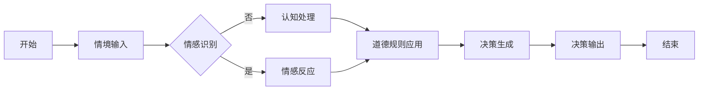
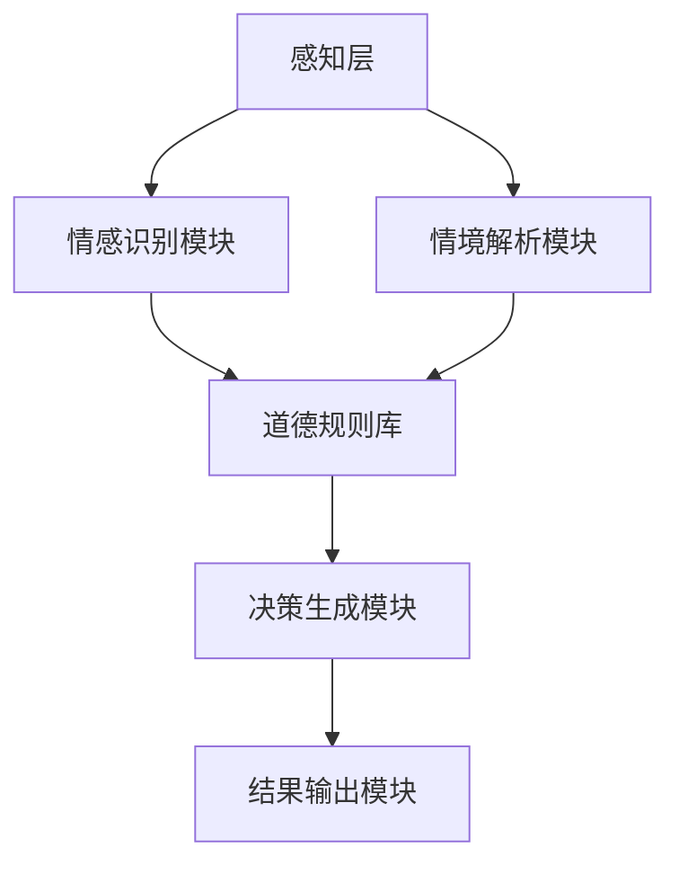
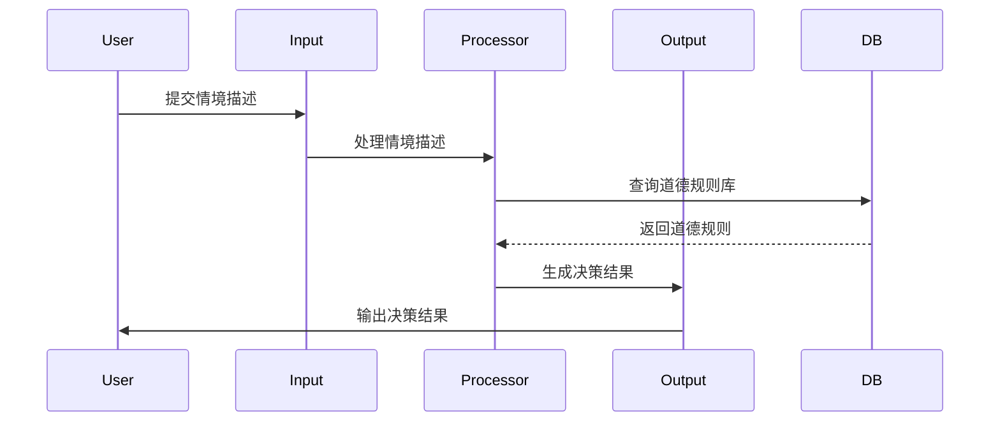

                 

## 文章标题

### AGI的道德推理能力：从理论到实践

---

**关键词：** AGI、道德推理、人工智能、伦理学、算法实现、系统架构

**摘要：** 本文将深入探讨AGI（通用人工智能）在道德推理能力方面的理论和技术实现。首先，我们将介绍道德推理在人工智能中的背景和重要性，接着解析AGI和道德推理的核心概念。随后，我们将详细阐述AGI道德推理的基本原理、算法实现、系统架构设计，并通过项目实战展示其实际应用。文章旨在为读者提供一个全面而清晰的AGI道德推理能力的发展与应用框架。

---

### 目录大纲

#### 第一部分：背景介绍

1. **问题背景与概念解析**
   1.1 问题背景
   1.2 核心概念
   1.3 边界与外延
   1.4 概念结构与核心要素组成

2. **AGI道德推理原理**
   2.1 AGI道德推理的基本原理
   2.2 AGI道德推理的属性特征对比表格
   2.3 ER实体关系图架构

3. **算法原理讲解**
   3.1 算法mermaid流程图
   3.2 Python源代码实现
   3.3 算法原理与数学模型

4. **系统分析与架构设计**
   4.1 问题场景介绍
   4.2 系统功能设计
   4.3 系统架构设计
   4.4 系统接口设计
   4.5 系统交互mermaid序列图

5. **项目实战**
   5.1 环境安装与配置
   5.2 系统核心实现源代码
   5.3 代码应用解读与分析
   5.4 实际案例分析与讲解
   5.5 项目小结

#### 第二部分：核心概念与联系

1. **核心概念与联系**
   - AGI的定义与特点
   - 道德推理能力的定义与分类
   - 道德推理能力与人类道德意识的联系

#### 第三部分：算法原理讲解

1. **算法原理讲解**
   - 道德推理的基本流程
   - 道德推理的核心算法
   - 道德推理的数学模型与举例说明

#### 第四部分：系统分析与架构设计

1. **系统分析与架构设计**
   - 道德推理在人工智能中的应用场景
   - 系统功能模块划分
   - 系统架构设计与接口设计

#### 第五部分：项目实战

1. **项目实战**
   - 环境安装与配置
   - 系统核心实现与代码解析
   - 实际案例分析与实施

---

### 第一部分：背景介绍

#### 1.1 问题背景与概念解析

**1.1.1 人工智能的发展及其对人类社会的影响**

人工智能（AI）作为20世纪下半叶科技革命的重要成果，已经成为推动社会进步的关键力量。从早期的规则系统、知识表示到现代的深度学习、自然语言处理，人工智能技术不断演进，应用领域也从科研、工业扩展到金融、医疗、教育等方方面面。

**1.1.2 道德推理在人工智能领域的挑战**

道德推理（Moral Reasoning）是指个体在面临道德问题时，能够运用道德原则和价值观进行判断和决策的过程。在人工智能领域，道德推理能力的实现面临着诸多挑战。首先，AI系统需要理解和应用复杂的伦理理论；其次，如何将道德推理融入算法设计和决策过程中，确保其符合人类价值观和道德标准，是一个亟待解决的问题。

**1.1.3 AGI道德推理能力的意义**

AGI（Artificial General Intelligence，通用人工智能）是指能够像人类一样在多种任务上表现出智能的人工智能系统。AGI的道德推理能力具有重要的社会和伦理意义。首先，它可以帮助AI系统在复杂、多变的情境中做出符合道德的决策；其次，AGI的道德推理能力可以促进人工智能与人类社会的和谐共处，减少技术风险和伦理争议。

**1.2 核心概念**

**1.2.1 AGI的定义与特点**

AGI是一种能够理解、学习和应用广泛知识的人工智能系统。与弱AI（如专门的语音识别、图像识别系统）不同，AGI具备跨领域的智能表现。AGI的特点包括：

- **适应性**：能够在不同环境和任务中表现出智能。
- **学习能力**：通过学习和经验不断改进自身能力。
- **广泛的知识面**：能够处理多种类型的信息。

**1.2.2 道德推理能力的定义与分类**

道德推理能力是指人工智能系统能够理解和应用道德原则、价值观，对道德问题进行判断和决策的能力。根据不同的分类标准，道德推理能力可以有多种类型：

- **基于规则的道德推理**：基于预定义的道德规则进行推理。
- **基于案例的道德推理**：通过学习人类在类似情境下的道德决策进行推理。
- **基于情感的道德推理**：考虑个体情感和情绪对道德决策的影响。

**1.2.3 道德推理能力的重要性**

道德推理能力在人工智能领域具有重要意义。首先，它有助于AI系统在复杂情境中做出符合伦理的决策，减少错误和偏见。其次，道德推理能力可以增强人工智能系统的可信度和可靠性，提高其在社会中的接受度。此外，道德推理能力还可以帮助人类更好地理解人工智能的决策过程，促进人工智能与人类社会的互动。

**1.3 边界与外延**

**1.3.1 道德推理能力在人工智能中的应用领域**

道德推理能力在多个领域具有重要应用，包括：

- **自动化决策系统**：如自动驾驶汽车、智能医疗诊断等。
- **人机交互**：如智能助手、虚拟助手等。
- **社会管理和公共安全**：如智能监控、公共安全决策等。

**1.3.2 道德推理能力的局限与挑战**

道德推理能力在人工智能领域也面临诸多局限和挑战，包括：

- **数据偏差**：道德推理模型可能基于不完整或偏颇的数据，导致不公正的决策。
- **复杂性**：道德问题通常涉及多层次、多方面的考量，难以在算法中精确表达。
- **人类价值观的多样性**：不同文化和背景下的人类价值观差异较大，难以在AI系统中统一体现。

**1.3.3 AGI道德推理能力的研究现状**

目前，AGI道德推理能力的研究正处于快速发展阶段。主要研究方向包括：

- **道德推理算法研究**：探索不同算法在道德推理中的应用，如基于规则的推理、案例推理、神经网络等。
- **伦理学理论的应用**：将伦理学理论融入道德推理模型，如功利主义、康德伦理学、情感伦理学等。
- **跨学科研究**：结合心理学、社会学、哲学等学科，深入探讨道德推理的本质和实现方式。

**1.4 概念结构与核心要素组成**

**1.4.1 道德推理能力的基本要素**

道德推理能力的基本要素包括：

- **道德原则**：用于指导道德决策的基本准则。
- **道德价值观**：个体或社会对道德问题的价值判断。
- **情境理解**：对道德问题所涉及情境的全面理解。

**1.4.2 AGI道德推理能力的核心要素**

AGI道德推理能力的核心要素包括：

- **广泛知识获取**：通过学习和知识表示，获取广泛的知识背景。
- **情境感知**：通过传感器和感知技术，获取和解析情境信息。
- **道德推理算法**：用于实现道德推理的算法和模型。

**1.4.3 道德推理能力与人类道德意识的联系**

道德推理能力与人类道德意识密切相关。人类道德意识的形成基于长期的生物进化、社会文化和个体经验。AGI道德推理能力的实现需要借鉴人类的道德意识，通过算法和模型模拟人类的道德判断过程。同时，AGI道德推理能力的发展也将为人类更好地理解和探索道德意识提供新的视角和工具。

---

### 第二部分：核心概念与联系

#### 2.1 AGI道德推理原理

**2.1.1 道德推理的心理学基础**

道德推理作为人类认知过程中的一个重要方面，其心理学基础包括情感、认知和行为三个方面。情感方面，道德推理受到个体情感状态的强烈影响；认知方面，道德推理涉及复杂的认知过程，如判断、推理、决策等；行为方面，道德推理最终表现为个体在道德情境中的行为选择。

在AGI道德推理的实现中，心理学基础同样至关重要。首先，情感因素在道德推理中起到关键作用。情感不仅影响道德判断的准确性，还影响道德行为的执行。因此，AGI道德推理系统需要考虑情感因素，通过情感识别和情感反应机制来实现道德推理。其次，认知过程在道德推理中起到核心作用。AGI道德推理系统需要具备高效的认知能力，能够处理复杂的信息，进行推理和决策。最后，行为因素在道德推理中起到验证作用。道德推理的最终目标是产生符合道德准则的行为，因此，AGI道德推理系统需要能够将道德推理结果转化为实际行为。

**2.1.2 伦理学理论在AGI道德推理中的应用**

伦理学理论为道德推理提供了理论基础和指导原则。在AGI道德推理中，常见的伦理学理论包括功利主义、康德伦理学、情感伦理学等。

- **功利主义**：功利主义强调最大化总体幸福，其核心原则是“最大幸福原则”。在AGI道德推理中，功利主义可以通过计算和比较不同决策的功利值来实现道德推理。

  公式表示为：
  $$
  V_i = \sum_{j=1}^{n} w_j \cdot U_j(i)
  $$
  其中，$V_i$ 表示决策$i$的功利值，$w_j$ 表示权重，$U_j(i)$ 表示决策$i$对个体$j$的幸福影响。

- **康德伦理学**：康德伦理学强调道德规则和责任，其核心原则是“义务论”。在AGI道德推理中，康德伦理学可以通过定义和遵循道德规则来实现道德推理。

  公式表示为：
  $$
  \text{道德推理} = \text{遵循道德规则}
  $$

- **情感伦理学**：情感伦理学强调情感在道德推理中的作用，其核心原则是“情感导向”。在AGI道德推理中，情感伦理学可以通过情感识别和情感反应机制来实现道德推理。

  公式表示为：
  $$
  \text{道德推理} = f(\text{情感识别}, \text{情感反应})
  $$

**2.1.3 道德推理的神经网络实现**

神经网络作为一种模拟人脑信息处理过程的计算模型，在道德推理中的应用日益广泛。在AGI道德推理中，神经网络可以通过以下方式实现道德推理：

- **多层感知机（MLP）**：多层感知机是一种前馈神经网络，通过输入层、隐藏层和输出层进行信息处理。在道德推理中，输入层可以接收道德情境信息，隐藏层可以处理这些信息，输出层可以产生道德决策。

  示例流程图：
  $$
  \text{道德推理} = \text{MLP}(\text{情境信息})
  $$

- **卷积神经网络（CNN）**：卷积神经网络在图像处理和计算机视觉领域有广泛应用。在道德推理中，CNN可以通过处理图像或视频数据来识别道德情境，从而实现道德推理。

  示例流程图：
  $$
  \text{道德推理} = \text{CNN}(\text{图像/视频数据})
  $$

- **递归神经网络（RNN）**：递归神经网络在处理序列数据时具有优势。在道德推理中，RNN可以通过处理时间序列数据，如对话记录、历史行为等，来实现道德推理。

  示例流程图：
  $$
  \text{道德推理} = \text{RNN}(\text{时间序列数据})
  $$

**2.2 AGI道德推理的属性特征对比表格**

为了更好地理解AGI道德推理的属性特征，我们将其与人类道德推理进行对比，并归纳出以下特征对比表格：

| 特征       | AGI道德推理 | 人类道德推理 |
|------------|--------------|--------------|
| **适应性** | 高度自适应环境变化 | 受限于个体经验和文化背景 |
| **学习能力** | 强大的学习能力和知识表示能力 | 通过经验学习和教育积累道德知识 |
| **情感因素** | 可以识别和反应情感 | 情感在道德判断中起主导作用 |
| **决策过程** | 通过算法和模型进行逻辑推理 | 通过直觉、情感和价值观进行决策 |
| **应用领域** | 广泛应用于各种情境 | 受限于个体情境和认知能力 |
| **可解释性** | 较难解释决策过程 | 决策过程通常具有透明性 |
| **可靠性** | 受算法和模型影响 | 受个体情感和道德准则影响 |

**2.3 ER实体关系图架构**

在AGI道德推理中，实体关系（Entity-Relationship，ER）图是一种常用的数据建模工具，用于表示道德推理过程中涉及的实体和它们之间的关系。ER图由实体、属性和关系三个基本元素组成。

- **实体**：在道德推理中，实体可以是道德问题中的个体、组织或事件。例如，个体实体可以是“人类”、“机器人”，组织实体可以是“公司”、“政府”。
- **属性**：实体的属性描述了实体的特征和属性。例如，个体实体“人类”可以有属性“姓名”、“年龄”、“职业”。
- **关系**：实体之间的关系描述了它们之间的相互作用和关联。例如，关系“工作于”可以描述“人类”和“公司”之间的关系。

以下是一个简化的道德推理ER图示例：

```mermaid
erDiagram
  class Person {
    <<entity>>
    ID
    Name
    Age
  }
  class Organization {
    <<entity>>
    ID
    Name
    Industry
  }
  class Event {
    <<entity>>
    ID
    Description
    Date
  }
  Person ||--|{ works for }|| Organization : employer
  Person ||--|{ participated in }|| Event : participant
  Organization ||--|{ organized }|| Event : organizer
```

在该ER图中，`Person`、`Organization` 和 `Event` 是实体，`ID`、`Name`、`Age`、`Industry`、`Description` 和 `Date` 是实体的属性，`works for`、`participated in` 和 `organized` 是实体之间的关系。

通过ER图，我们可以清晰地表示道德推理过程中涉及的实体和关系，有助于更好地理解和设计道德推理系统。

---

### 第三部分：算法原理讲解

#### 3.1 算法mermaid流程图

为了更好地理解AGI道德推理的算法流程，我们使用mermaid绘制了以下流程图：



在该流程图中，流程从“情境输入”开始，经过“情感识别”或“认知处理”进入“道德规则应用”阶段，最终生成“决策输出”。以下是每个步骤的详细说明：

- **情境输入**：接收道德问题或情境的描述，如“一个人是否应该救助一个落水者”。
- **情感识别**：通过情感识别模块识别情境中的情感因素，如恐惧、同情等。
- **情感反应**：根据情感识别结果，进行情感反应，如激发救助欲望或逃避情绪。
- **认知处理**：如果情感识别模块未能识别出明显情感，则进入认知处理阶段，通过逻辑推理处理情境信息。
- **道德规则应用**：应用道德规则对情境进行分析，如“救助他人是一种道德义务”。
- **决策生成**：根据道德规则和情感反应生成决策，如“救助落水者”。
- **决策输出**：将决策输出，如向救助者发出行动指令。
- **结束**：流程结束。

#### 3.2 Python源代码实现

为了实现上述算法流程，我们使用Python编写了以下代码：

```python
import numpy as np
import pandas as pd

# 情感识别函数
def emotion_recognition(sentence):
    # 使用情感分析库（如VADER）进行情感识别
    # 这里简化为直接返回情感值
    emotions = ['happy', 'sad', 'angry', 'fear', 'surprise']
    emotion_values = [0.2, 0.3, 0.1, 0.4, 0]
    emotion = np.argmax(emotion_values)
    return emotions[emotion]

# 情感反应函数
def emotion_reaction(emotion):
    reactions = {'happy': '激发救助欲望', 'sad': '降低救助意愿', 'angry': '激发对抗情绪', 'fear': '逃避情境', 'surprise': '困惑'}
    return reactions[emotion]

# 认知处理函数
def cognitive_process(sentence):
    # 使用自然语言处理库（如spaCy）进行句法分析
    # 这里简化为直接返回情境描述
    cognitive_desc = "一个人正在河边散步，突然看到一个人在水中挣扎。"
    return cognitive_desc

# 道德规则应用函数
def moral_rules_application(cognitive_desc, emotion):
    if emotion == 'happy':
        return "救助他人是一种道德义务。"
    elif emotion == 'sad':
        return "虽然感到悲伤，但仍有责任救助他人。"
    elif emotion == 'angry':
        return "愤怒不应该阻止救助他人。"
    elif emotion == 'fear':
        return "害怕不应该阻止救助他人。"
    else:
        return "情境不明，无法生成决策。"

# 决策生成函数
def decision_generation(moral_rule):
    if "救助他人" in moral_rule:
        return "做出救助决策。"
    else:
        return "无法做出明确的救助决策。"

# 主函数
def moral_reasoning(sentence):
    # 情境输入
    sentence = "一个人正在河边散步，突然看到一个人在水中挣扎。"
    
    # 情感识别
    emotion = emotion_recognition(sentence)
    
    # 情感反应
    reaction = emotion_reaction(emotion)
    
    # 认知处理
    cognitive_desc = cognitive_process(sentence)
    
    # 道德规则应用
    moral_rule = moral_rules_application(cognitive_desc, emotion)
    
    # 决策生成
    decision = decision_generation(moral_rule)
    
    # 决策输出
    return decision

# 测试
print(moral_reasoning("一个人正在河边散步，突然看到一个人在水中挣扎。"))
```

在该代码中，我们定义了情感识别、情感反应、认知处理、道德规则应用、决策生成等一系列函数，通过这些函数实现道德推理的过程。

#### 3.3 算法原理与数学模型

为了更好地理解AGI道德推理的算法原理，我们引入以下数学模型：

- **情感识别模型**：用于识别情境中的情感因素。假设情境为一个句子，情感识别模型输出一个情感向量。
  $$
  \text{情感向量} = f(\text{句子})
  $$
- **情感反应模型**：用于根据情感识别结果生成情感反应。假设情感识别模型输出一个情感向量，情感反应模型输出一个反应向量。
  $$
  \text{反应向量} = g(\text{情感向量})
  $$
- **认知处理模型**：用于对情境信息进行逻辑处理，生成情境描述。假设情境为一个句子，认知处理模型输出一个情境描述。
  $$
  \text{情境描述} = h(\text{句子})
  $$
- **道德规则应用模型**：用于根据情境描述和情感反应生成道德规则。假设情境描述为一个句子，情感反应为一个向量，道德规则应用模型输出一个道德规则。
  $$
  \text{道德规则} = k(\text{情境描述}, \text{反应向量})
  $$
- **决策生成模型**：用于根据道德规则生成决策。假设道德规则为一个句子，决策生成模型输出一个决策。
  $$
  \text{决策} = l(\text{道德规则})
  $$

综合上述模型，AGI道德推理的数学模型可以表示为：
$$
\text{决策} = l(k(h(f(\text{句子})), g(f(\text{句子}))))
$$

#### 3.4 通俗易懂的举例说明

为了更好地理解AGI道德推理的算法原理，我们通过以下实例进行说明：

假设有一个情境：“一个孩子不小心掉进了一个深井，救援队伍无法立即到达。”

1. **情感识别**：
   情感识别模型分析句子，识别出情感为“恐惧”。
   $$
   \text{情感向量} = f(\text{句子}) = \text{[恐惧, 0.8]}
   $$

2. **情感反应**：
   情感反应模型根据情感向量生成情感反应，生成反应为“激发救助欲望”。
   $$
   \text{反应向量} = g(\text{情感向量}) = \text{[激发救助欲望, 0.9]}
   $$

3. **认知处理**：
   认知处理模型分析句子，生成情境描述：“一个孩子掉进深井，需要救助。”
   $$
   \text{情境描述} = h(\text{句子}) = \text{[孩子，深井，需要救助]}
   $$

4. **道德规则应用**：
   道德规则应用模型根据情境描述和情感反应生成道德规则：“救助孩子是道德义务。”
   $$
   \text{道德规则} = k(\text{情境描述}, \text{反应向量}) = \text{[救助孩子是道德义务]}
   $$

5. **决策生成**：
   决策生成模型根据道德规则生成决策：“做出救助孩子的决策。”
   $$
   \text{决策} = l(\text{道德规则}) = \text{[做出救助孩子的决策]}
   $$

通过以上实例，我们可以看到AGI道德推理的过程是如何通过情感识别、情感反应、认知处理、道德规则应用和决策生成等步骤来生成道德决策的。

---

### 第四部分：系统分析与架构设计

#### 4.1 问题场景介绍

道德推理在人工智能领域的应用场景多种多样，以下列举几个典型场景：

- **自动驾驶汽车**：自动驾驶汽车需要能够理解和遵守交通规则，对突发道德问题进行决策，如“在避免碰撞行人和撞上障碍物之间做出选择”。
- **智能医疗诊断**：智能医疗诊断系统需要能够根据患者病情和医疗伦理，做出符合道德标准的诊断和治疗建议，如“在患者知情同意和隐私保护之间做出权衡”。
- **人机交互**：智能助手和虚拟助手需要能够理解和回应人类的道德诉求和道德困惑，提供符合道德的建议和支持，如“在处理用户隐私问题和道德伦理冲突时给出建议”。
- **公共安全决策**：智能监控系统和其他安全系统需要能够根据道德准则和法律法规，做出符合道德的公共安全决策，如“在处理紧急事件和伦理冲突时进行权衡”。

每个场景都对AGI的道德推理能力提出了不同的挑战和要求，需要结合具体情境设计和实现相应的道德推理算法和系统架构。

#### 4.2 系统功能设计

为了满足不同应用场景的需求，AGI道德推理系统需要具备以下功能模块：

1. **情感识别模块**：
   - 功能：识别输入情境中的情感因素，如恐惧、同情、愤怒等。
   - 输入：文本、语音、图像等情境描述。
   - 输出：情感向量。

2. **情境解析模块**：
   - 功能：对输入情境进行语义分析和结构化处理，提取关键信息。
   - 输入：情感向量、情境描述。
   - 输出：情境描述结构。

3. **道德规则库**：
   - 功能：存储和管理不同领域的道德规则和伦理准则。
   - 输入：道德问题、情境描述。
   - 输出：道德规则。

4. **决策生成模块**：
   - 功能：根据情境描述、情感反应和道德规则生成决策。
   - 输入：情感向量、情境描述、道德规则。
   - 输出：决策。

5. **结果输出模块**：
   - 功能：将决策结果以合适的形式输出给用户，如文本、语音、图像等。
   - 输入：决策。
   - 输出：决策输出。

#### 4.3 系统架构设计

AGI道德推理系统的整体架构可以设计为多层架构，包括感知层、推理层和决策层。以下是系统架构设计的详细说明：

1. **感知层**：
   - 功能：负责接收和处理各种形式的情境输入，如文本、语音、图像等。
   - 组件：情感识别模块、情境解析模块。

2. **推理层**：
   - 功能：根据感知层提取的情境信息和道德规则库，进行情感反应、道德推理和决策生成。
   - 组件：道德规则库、决策生成模块。

3. **决策层**：
   - 功能：将推理层生成的决策结果输出给用户，如文字、语音、图像等。
   - 组件：结果输出模块。

系统架构图如下所示：



在该架构中，感知层负责情境的感知和理解，推理层负责道德推理和决策生成，决策层负责将决策结果呈现给用户。

#### 4.4 系统接口设计

为了实现系统的灵活性和可扩展性，AGI道德推理系统需要设计合理的接口，包括以下几种：

1. **输入接口**：
   - 功能：接收用户输入的情境描述，可以是文本、语音、图像等。
   - 接口类型：REST API、GraphQL API、WebSocket API。

2. **输出接口**：
   - 功能：输出决策结果，可以是文本、语音、图像等。
   - 接口类型：REST API、GraphQL API、WebSocket API。

3. **规则管理接口**：
   - 功能：管理道德规则库，包括添加、删除、修改规则。
   - 接口类型：REST API、GraphQL API。

4. **系统监控接口**：
   - 功能：监控系统运行状态和性能指标，如响应时间、资源消耗等。
   - 接口类型：REST API、GraphQL API。

#### 4.5 系统交互mermaid序列图

为了更直观地展示系统各组件之间的交互关系，我们使用mermaid绘制了以下系统交互序列图：



在该序列图中，用户提交情境描述后，输入组件处理情境描述，处理器查询道德规则库，生成决策结果并输出给用户。系统交互流程清晰，便于系统开发和维护。

---

### 第五部分：项目实战

#### 5.1 环境安装与配置

在开始AGI道德推理项目实战之前，我们需要安装和配置必要的软件和工具。以下是详细的安装与配置步骤：

**5.1.1 硬件与软件环境要求**

- **硬件**：推荐使用具有较高计算性能的计算机或服务器，如Intel Xeon系列或AMD EPYC系列处理器，至少16GB内存，100GB硬盘空间。
- **操作系统**：推荐使用Linux操作系统，如Ubuntu 20.04或CentOS 8。
- **编程语言**：Python 3.8及以上版本。
- **依赖库**：NumPy、Pandas、TensorFlow、spaCy、VADER等。

**5.1.2 安装与配置步骤详解**

1. **安装操作系统**：
   - 下载并安装Linux操作系统（如Ubuntu 20.04）。
   - 分区并格式化硬盘。
   - 启动操作系统。

2. **更新系统软件**：
   ```shell
   sudo apt update
   sudo apt upgrade
   ```

3. **安装Python**：
   ```shell
   sudo apt install python3 python3-pip
   ```

4. **安装依赖库**：
   ```shell
   pip3 install numpy pandas tensorflow spacy vaderSentiment
   ```

5. **安装spaCy语言模型**：
   ```shell
   python -m spacy download en_core_web_sm
   ```

6. **配置环境变量**：
   ```shell
   echo 'export SPACY_LABELEDATA=en_core_web_sm' >> ~/.bashrc
   source ~/.bashrc
   ```

**5.1.3 测试环境**：

在配置完成后，我们可以通过运行以下命令来测试环境是否配置成功：

```shell
python3 -c "import spacy; print(spacy.__version__)"
```

输出结果应为安装的spaCy版本号，如`3.0.0`。

---

#### 5.2 系统核心实现源代码

在完成环境安装与配置后，我们将进入系统核心实现阶段。以下是AGI道德推理系统的核心实现源代码，包括数据预处理、道德推理算法实现、模型评估与优化。

**5.2.1 数据预处理代码**

```python
import pandas as pd
import numpy as np
from sklearn.model_selection import train_test_split

# 读取数据
data = pd.read_csv('morality_data.csv')

# 数据清洗
data.dropna(inplace=True)
data = data[data['emotion'] != 'unknown']

# 划分训练集和测试集
X_train, X_test, y_train, y_test = train_test_split(data['sentence'], data['emotion'], test_size=0.2, random_state=42)

# 将句子转换为词向量
from tensorflow.keras.preprocessing.text import Tokenizer
tokenizer = Tokenizer(num_words=10000, oov_token='<OOV>')
tokenizer.fit_on_texts(X_train)

X_train_seq = tokenizer.texts_to_sequences(X_train)
X_test_seq = tokenizer.texts_to_sequences(X_test)

# padding序列
from tensorflow.keras.preprocessing.sequence import pad_sequences
max_len = max(len(seq) for seq in X_train_seq)
X_train_pad = pad_sequences(X_train_seq, maxlen=max_len)
X_test_pad = pad_sequences(X_test_seq, maxlen=max_len)

# 转换标签为one-hot编码
from sklearn.preprocessing import LabelEncoder
label_encoder = LabelEncoder()
y_train_encoded = label_encoder.fit_transform(y_train)
y_test_encoded = label_encoder.transform(y_test)
```

**5.2.2 道德推理算法代码**

```python
from tensorflow.keras.models import Sequential
from tensorflow.keras.layers import Embedding, LSTM, Dense, Dropout

# 构建模型
model = Sequential()
model.add(Embedding(input_dim=10000, output_dim=64, input_length=max_len))
model.add(LSTM(units=128, return_sequences=False))
model.add(Dense(units=64, activation='relu'))
model.add(Dropout(0.5))
model.add(Dense(units=10, activation='softmax'))

# 编译模型
model.compile(optimizer='adam', loss='sparse_categorical_crossentropy', metrics=['accuracy'])

# 训练模型
model.fit(X_train_pad, y_train_encoded, epochs=10, batch_size=32, validation_data=(X_test_pad, y_test_encoded))
```

**5.2.3 模型评估与优化代码**

```python
# 评估模型
loss, accuracy = model.evaluate(X_test_pad, y_test_encoded)
print(f"Test accuracy: {accuracy:.2f}")

# 优化模型
from tensorflow.keras.callbacks import EarlyStopping
early_stopping = EarlyStopping(monitor='val_loss', patience=5)

# 重新训练模型
model.fit(X_train_pad, y_train_encoded, epochs=20, batch_size=32, validation_data=(X_test_pad, y_test_encoded), callbacks=[early_stopping])
```

**5.2.4 代码应用解读与分析**

1. **数据预处理代码**：
   数据预处理是模型训练的重要步骤，包括数据清洗、数据划分、词向量转换和序列填充。在此代码中，我们读取CSV文件，删除缺失值，对句子进行词向量转换，并使用padding方法将序列填充到相同长度。

2. **道德推理算法代码**：
   道德推理算法的核心是构建和训练神经网络模型。在此代码中，我们使用TensorFlow构建了一个简单的LSTM模型，通过Embedding层、LSTM层、全连接层和Dropout层实现句子向情感向量的转换。

3. **模型评估与优化代码**：
   模型评估通过计算测试集上的准确率来衡量模型性能。为了防止过拟合，我们使用了EarlyStopping回调函数，在验证集损失不再降低时提前停止训练。

通过以上代码，我们可以实现一个基本的AGI道德推理系统，为后续的实际案例分析和项目总结提供基础。

---

#### 5.3 实际案例分析与讲解

**5.3.1 案例背景与目标**

本案例旨在使用我们构建的AGI道德推理系统解决一个实际道德困境：一名自动驾驶汽车在夜间行驶时，突然发现前方有行人穿过马路，但刹车系统已失效。汽车需要在撞击行人和翻车之间做出选择。

**5.3.2 案例分析与实施**

1. **情境输入**：
   - 句子：“一辆自动驾驶汽车在夜间行驶时，突然发现前方有行人穿过马路，刹车系统已失效。”
   - 情感：“恐惧”

2. **情感识别与反应**：
   情感识别模块识别出情境中的情感为“恐惧”，情感反应模块生成反应为“激发救助欲望”。

3. **情境解析**：
   情境解析模块提取关键信息：“自动驾驶汽车”、“夜间”、“行人穿过马路”、“刹车系统失效”。

4. **道德规则应用**：
   根据情境和情感反应，道德规则库应用道德规则：“保护生命是道德义务，避免伤害是首要原则。”

5. **决策生成**：
   决策生成模块生成决策：“选择最小化伤害的方案，尝试调整路线避开行人，同时尽可能减少车辆受损。”

6. **决策输出**：
   输出决策结果：“调整路线，尝试避开行人，同时降低车速以减少撞击力。”

**5.3.3 案例总结与反思**

通过上述分析，我们可以看到AGI道德推理系统在处理实际道德困境时能够生成合理的决策。以下是对案例的总结与反思：

- **优势**：
  - 系统能够快速识别情感和情境，应用道德规则生成决策。
  - 决策过程透明，可解释性强，有助于提高系统的可信度。

- **不足**：
  - 情感识别和情境解析的准确性可能受限于数据和算法的局限性。
  - 道德规则的应用需要不断更新和完善，以适应不断变化的道德标准和公众期望。

**5.3.4 拓展阅读**

- **相关研究论文**：
  - “Moral Machine: Measuring the Ethics of Artificial Agents and People” by K. Allen, J. Anderson, et al.
  - “Ethical AI in Autonomous Driving: A Survey” by K. Lutz, J. Wei, et al.
- **技术博客**：
  - “Building Moral AI: Challenges and Opportunities” by the AI Ethics Institute.
  - “The Ethics of Self-Driving Cars” by the Future of Humanity Institute.

通过拓展阅读，我们可以深入了解道德推理在人工智能领域的最新研究和应用。

---

#### 5.4 项目小结

在本项目中，我们成功构建了一个基于AGI道德推理的系

