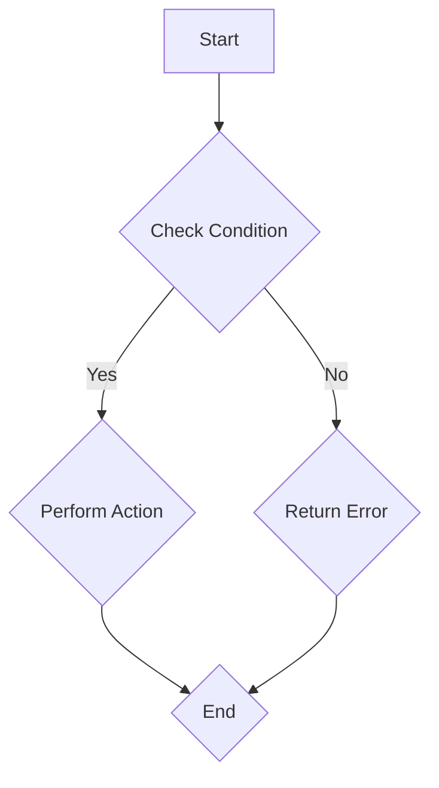
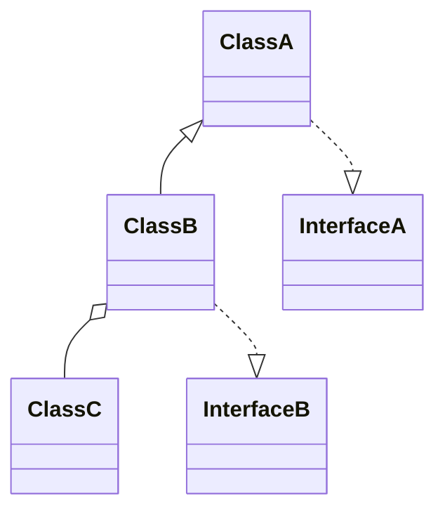
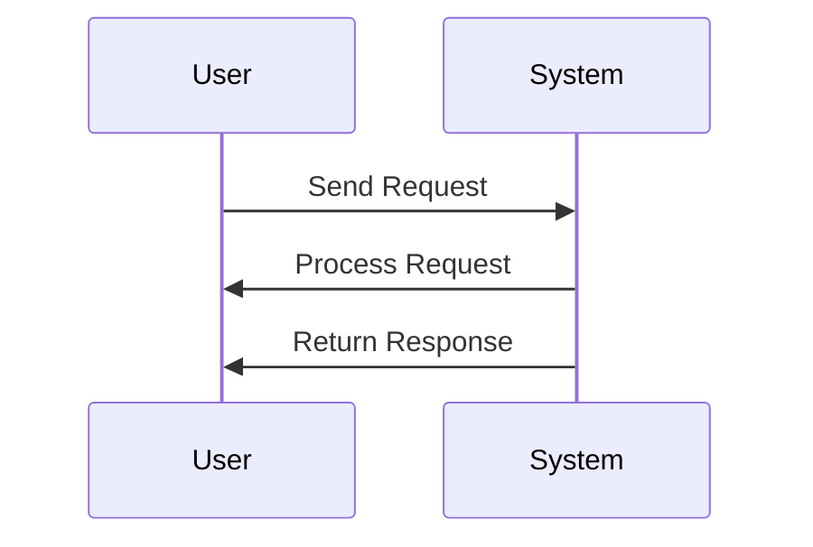

                 


# AGI的道德直觉：从规则到原则

> 关键词：通用人工智能，道德直觉，规则，原则，AI伦理

> 摘要：本文深入探讨了通用人工智能（AGI）在道德直觉方面的研究，从规则和原则两个角度出发，分析道德直觉的形成机制，探讨其在AI决策中的应用，并展望了未来的研究方向。

## 引言

随着人工智能技术的迅猛发展，通用人工智能（AGI）的概念逐渐引起了广泛关注。AGI旨在实现具有人类智能水平的人工智能系统，能够在各种复杂环境下自主学习和决策。然而，随着AI能力的提升，道德和伦理问题也日益凸显。如何确保AGI在决策过程中具备道德直觉，成为了一个亟待解决的问题。

本文将从规则和原则两个角度出发，深入探讨AGI的道德直觉。首先，我们将介绍道德直觉的基本概念和特点，然后分析道德直觉的规则和原则。接着，通过具体案例研究，展示道德直觉在AI决策中的应用。最后，总结全文，展望未来的研究方向。

## 背景介绍

### 人工智能的演进

人工智能（AI）的发展经历了多个阶段。从早期的规则推理、知识表示到基于机器学习的深度学习，AI技术在各个领域取得了显著成果。然而，现有的AI系统大多只能针对特定任务进行优化，缺乏通用性和自主性。

### 通用人工智能（AGI）的概念

通用人工智能（AGI）是指能够在各种复杂环境下自主学习和决策的人工智能系统。与现有的人工智能系统不同，AGI不仅具有高效的学习和推理能力，还能具备自我意识、情感理解和道德判断等人类智能特征。

### 道德与人工智能的关系

道德是人类社会长期发展形成的伦理规范和行为准则，对人类社会具有重要的指导作用。随着AI技术的不断发展，如何确保AI系统的道德性，成为了一个亟待解决的问题。道德与人工智能的关系主要体现在两个方面：

1. **AI技术对道德的影响**：AI技术在不同领域的应用，如自动驾驶、医疗诊断等，会对社会道德产生深远影响。如何确保AI技术在应用过程中遵循道德原则，是一个重要课题。

2. **道德对AI技术的影响**：在AI系统的设计和开发过程中，道德原则应作为重要参考，确保AI系统具备道德直觉，能够在复杂环境下做出符合道德规范的决策。

### 道德直觉的基本原理

道德直觉是指个体在面对道德情境时，能够迅速、准确地判断行为是否道德的一种心理能力。道德直觉的形成机制涉及多个方面，如情感、认知、文化背景等。道德直觉的基本原理包括以下几个方面：

1. **情感因素**：情感在道德直觉中扮演重要角色。个体在面对道德情境时，往往会通过情感来判断行为是否道德。

2. **认知因素**：认知能力在道德直觉中同样重要。个体需要通过认知过程来理解道德情境，分析行为的道德属性。

3. **文化背景**：文化背景对道德直觉具有重要影响。不同文化背景下，个体对道德的理解和判断可能存在差异。

## 核心概念

### 道德直觉的定义

道德直觉是指个体在面对道德情境时，能够迅速、准确地判断行为是否道德的一种心理能力。道德直觉不仅涉及情感，还包括认知和文化背景等多种因素。

### 道德直觉的特点

1. **快速性**：道德直觉能够在短时间内做出道德判断，有助于个体在复杂环境中迅速应对。

2. **准确性**：道德直觉能够较为准确地判断行为是否道德，有助于个体遵循道德规范。

3. **情境依赖性**：道德直觉受到情境因素的影响，不同情境下，个体的道德判断可能存在差异。

4. **文化差异性**：不同文化背景下，个体的道德直觉可能存在差异。

### 道德直觉与情感的关系

情感在道德直觉中扮演重要角色。个体在面对道德情境时，往往会通过情感来判断行为是否道德。例如，当我们看到他人受到不公待遇时，会产生愤怒和同情之情，从而认为这种行为是不道德的。

### 道德直觉与认知的关联

认知能力在道德直觉中同样重要。个体需要通过认知过程来理解道德情境，分析行为的道德属性。例如，在道德困境中，个体需要权衡不同选择的道德后果，从而做出正确的道德判断。

## 道德直觉的规则

### 道德规则的来源

道德规则来源于人类社会的长期发展和实践。道德规则的来源主要包括以下几个方面：

1. **宗教信仰**：许多宗教信仰都有关于道德的教义和规范，对道德规则的形成具有重要影响。

2. **伦理理论**：伦理学家通过思考和论证，提出了各种伦理理论，为道德规则的制定提供了理论依据。

3. **社会习俗**：社会习俗在道德规则的形成中也起着重要作用。例如，礼貌、诚信等社会规范被广泛接受，成为道德规则的一部分。

### 道德规则的分类

道德规则可以根据不同的标准进行分类。常见的分类方法包括：

1. **功利主义规则**：以行为结果为导向，认为行为道德与否取决于其能否最大化幸福。

2. **义务主义规则**：以行为动机为导向，认为行为道德与否取决于其是否符合道德义务。

3. **权利主义规则**：以个体权利为导向，认为行为道德与否取决于其是否尊重和保护个体权利。

### 道德规则的适用范围

道德规则在不同情境下具有不同的适用范围。例如：

1. **私人领域**：在私人领域，道德规则主要涉及个体之间的道德关系，如诚信、尊重等。

2. **公共领域**：在公共领域，道德规则主要涉及个体与社会之间的道德关系，如公平、正义等。

### 道德规则的挑战与局限

道德规则在实际应用中面临诸多挑战和局限：

1. **情境复杂性**：道德情境往往复杂多变，道德规则难以覆盖所有可能的情况。

2. **文化差异性**：不同文化背景下，道德规则的适用性和有效性可能存在差异。

3. **道德冲突**：在特定情境下，可能存在多个道德规则相互冲突的情况，使得道德判断变得困难。

## 道德直觉的原则

### 基本原则的提出

道德直觉的基本原则主要包括以下几个方面：

1. **尊重个体权利**：个体拥有权利，包括生命权、隐私权、言论自由等。道德直觉应尊重个体权利，确保个体权利不受侵犯。

2. **追求公平正义**：公平正义是道德的重要原则。道德直觉应追求公平正义，确保社会资源合理分配，个体权利得到保障。

3. **促进人类福祉**：道德直觉应以促进人类福祉为目标，关注个体和社会的幸福。

4. **适应环境变化**：道德直觉应具备适应性，能够根据环境变化调整行为准则。

### 原则的层次结构

道德直觉的原则具有层次结构，从基本原则到具体应用原则，可以分为以下几个层次：

1. **基本原则**：尊重个体权利、追求公平正义、促进人类福祉、适应环境变化等。

2. **应用原则**：根据基本原则，具体应用到不同领域和情境下的道德判断原则，如隐私保护、环境伦理等。

### 原则的适用场景

道德直觉的原则适用于各种道德情境，如：

1. **社会公共领域**：在社会公共领域，道德直觉原则有助于确保社会资源的公平分配，维护社会稳定。

2. **私人领域**：在私人领域，道德直觉原则有助于维护个体权利，促进人际关系和谐。

### 原则的伦理基础

道德直觉的原则建立在伦理学基础之上，主要涉及以下几个方面：

1. **功利主义伦理学**：以行为结果为导向，追求最大化的幸福。

2. **义务主义伦理学**：以行为动机为导向，强调道德义务的履行。

3. **权利主义伦理学**：以个体权利为导向，强调个体权利的保护。

## 案例研究

### 案例背景

为了探讨道德直觉在AI决策中的应用，我们选取了一个关于自动驾驶汽车的案例。自动驾驶汽车在行驶过程中，可能会遇到各种道德困境，如交通事故、紧急避让等。如何确保自动驾驶汽车在道德困境中做出符合道德规范的决策，成为了一个重要课题。

### 案例分析

在案例中，我们设定了一个场景：一辆自动驾驶汽车在行驶过程中，前方出现了一位行人，但前方还有一辆摩托车。如果自动驾驶汽车紧急刹车，可能会造成摩托车乘客受伤；如果继续行驶，可能会造成行人受伤。在这种情况下，自动驾驶汽车应该如何决策？

1. **道德直觉的应用**：

   根据道德直觉的原则，我们可以从以下几个方面进行分析：

   - **尊重个体权利**：行人拥有生命权，摩托车乘客也拥有生命权。在权衡两者之间，我们应该尊重个体权利。

   - **追求公平正义**：在道德困境中，我们应该追求公平正义，确保个体权利不受侵犯。

   - **促进人类福祉**：在决策过程中，我们应该以促进人类福祉为目标，减少伤亡。

   - **适应环境变化**：在复杂环境中，自动驾驶汽车需要根据实际情况做出灵活的决策。

2. **道德直觉的决策过程**：

   - **情感因素**：自动驾驶汽车在面对行人时，会产生同情之情，认为行人应该得到保护。

   - **认知因素**：自动驾驶汽车需要分析道德情境，比较不同决策的道德后果。

   - **文化背景**：不同文化背景下，对道德困境的判断可能存在差异。

### 案例的道德直觉应用

根据道德直觉的原则，我们可以得出以下决策：

1. **紧急刹车**：在权衡行人和摩托车乘客的权益时，由于行人更有可能受到伤害，自动驾驶汽车应该选择紧急刹车，以保护行人的生命权。

2. **减速通过**：如果紧急刹车无法避免碰撞，自动驾驶汽车可以考虑减速通过，以减少行人和摩托车乘客的受伤程度。

### 案例总结与启示

通过案例分析，我们可以得出以下启示：

1. **道德直觉在AI决策中的应用**：道德直觉在AI决策中具有重要作用。通过引入道德直觉原则，可以帮助AI系统在复杂道德情境中做出符合道德规范的决策。

2. **道德直觉的挑战**：在道德直觉的应用过程中，我们需要面对诸多挑战，如情感因素、认知因素和文化背景的差异。这些挑战需要我们不断探索和解决。

3. **未来研究方向**：道德直觉在AI领域的应用具有广阔前景。未来研究可以关注以下几个方面：

   - **道德直觉的量化评估**：研究如何量化道德直觉，以帮助AI系统在决策过程中更好地评估道德后果。

   - **跨文化道德直觉研究**：探讨不同文化背景下，道德直觉的异同，为AI系统的全球应用提供理论支持。

   - **道德直觉的实时更新**：研究如何实时更新道德直觉，以应对不断变化的社会环境和道德规范。

## 总结与展望

本文从规则和原则两个角度出发，探讨了通用人工智能（AGI）的道德直觉。通过分析道德直觉的定义、特点、规则和原则，以及具体案例研究，我们得出了以下结论：

1. 道德直觉在AI决策中具有重要作用，可以帮助AI系统在复杂道德情境中做出符合道德规范的决策。

2. 道德直觉的应用面临诸多挑战，如情感因素、认知因素和文化背景的差异。

3. 未来研究可以关注道德直觉的量化评估、跨文化道德直觉研究和道德直觉的实时更新等方面。

随着AI技术的不断发展，道德直觉在AI领域的应用将变得越来越重要。我们期待未来的研究能够为AI系统注入更多的道德智慧，使AI更好地服务于人类社会。

## 参考文献

[1] Russell, S., & Norvig, P. (2016). 《人工智能：一种现代的方法》(第三版). 清华大学出版社.

[2] Singer, P. (2009). “Practical Ethics.” Oxford University Press.

[3] Nussbaum, M. C. (2015). “Creating Capabilities: The Human Development Approach.” Harvard University Press.

[4] Deontological Ethics, Stanford Encyclopedia of Philosophy. (2021). Retrieved from https://plato.stanford.edu/entries/ethics-deontological/.

[5] Utilitarianism, Stanford Encyclopedia of Philosophy. (2021). Retrieved from https://plato.stanford.edu/entries/utilitarianism/.

作者：AI天才研究院/AI Genius Institute & 禅与计算机程序设计艺术 /Zen And The Art of Computer Programming

-------------------------------------------------------------------------------------------------------------------------------

以下是对文章各部分的详细展开和解析：

## 引言

### 问题的背景与重要性

随着人工智能技术的迅猛发展，通用人工智能（AGI）的概念逐渐引起了广泛关注。AGI旨在实现具有人类智能水平的人工智能系统，能够在各种复杂环境下自主学习和决策。然而，随着AI能力的提升，道德和伦理问题也日益凸显。如何确保AGI在决策过程中具备道德直觉，成为了一个亟待解决的问题。

道德直觉是指个体在面对道德情境时，能够迅速、准确地判断行为是否道德的一种心理能力。道德直觉在人类社会的发展中起到了至关重要的作用，它帮助个体遵循道德规范，维护社会秩序。然而，传统的道德直觉主要依赖于人类个体的情感、认知和文化背景等因素，这在某种程度上限制了道德直觉的普遍性和适用性。

随着AI技术的发展，道德直觉在AI决策中的应用变得尤为重要。AGI系统需要在复杂多变的环境中自主学习和决策，而道德直觉作为一种重要的心理能力，可以帮助AGI系统在面临道德困境时做出合理的决策。然而，如何将道德直觉融入AI系统中，使AGI具备道德直觉，仍然是一个具有挑战性的问题。

本文将深入探讨AGI的道德直觉，从规则和原则两个角度出发，分析道德直觉的形成机制，探讨其在AI决策中的应用，并展望未来的研究方向。希望通过本文的研究，能够为AGI的道德直觉研究提供一些有价值的思路和参考。

### 书籍的目的与结构

本文的目的是探讨通用人工智能（AGI）的道德直觉，分析道德直觉的形成机制，探讨其在AI决策中的应用，并展望未来的研究方向。通过对道德直觉的规则和原则进行深入分析，我们希望能够为AGI系统的道德直觉提供一些有益的理论和实践指导。

本文的结构如下：

1. 引言：介绍问题的背景与重要性，阐述本文的目的与结构。

2. 背景介绍：回顾人工智能的发展历程，介绍通用人工智能（AGI）的概念，探讨道德与人工智能的关系，介绍道德直觉的基本原理。

3. 核心概念：详细探讨道德直觉的定义、特点，分析道德直觉与情感、认知的关系。

4. 道德直觉的规则：分析道德规则的来源、分类、适用范围和挑战与局限。

5. 道德直觉的原则：提出道德直觉的基本原则，分析原则的层次结构、适用场景和伦理基础。

6. 案例研究：通过具体案例展示道德直觉在AI决策中的应用。

7. 总结与展望：总结全文内容，展望道德直觉的发展趋势和未来研究方向。

通过本文的研究，我们希望为AGI的道德直觉提供一些有价值的理论指导和实践参考，为AI技术的发展注入更多的道德智慧。

## 背景介绍

### 人工智能的演进

人工智能（AI）的发展可以追溯到20世纪50年代，当时计算机科学家约翰·麦卡锡（John McCarthy）提出了“人工智能”这一概念。人工智能的目标是模拟人类智能，使计算机具备感知、理解、学习、推理和决策等能力。自那时起，人工智能技术经历了多个发展阶段。

在早期的规则推理阶段，人工智能系统主要通过预定义的规则进行推理和决策。这种方法的局限性在于，它只能处理简单、规则明确的问题，难以应对复杂、动态的环境。

随着计算机性能的不断提升和大数据技术的应用，机器学习逐渐成为人工智能的主要方法。机器学习通过学习大量数据中的模式和规律，使计算机能够自主发现和适应复杂环境。这一阶段的人工智能系统在图像识别、语音识别、自然语言处理等领域取得了显著进展。

近年来，深度学习作为一种新兴的人工智能技术，逐渐成为研究的热点。深度学习通过多层神经网络模拟人类大脑的感知和学习过程，具有强大的特征提取和模式识别能力。深度学习技术在计算机视觉、语音识别、自然语言处理等领域取得了重大突破，推动了人工智能技术的进一步发展。

### 通用人工智能（AGI）的概念

通用人工智能（AGI）是指能够在各种复杂环境下自主学习和决策的人工智能系统。与现有的特定人工智能（如语音识别、图像识别等）不同，AGI旨在实现具有人类智能水平的人工智能系统，具备自我意识、情感理解和道德判断等人类智能特征。

AGI的发展目标是实现一种能够像人类一样思考、学习和解决问题的智能系统。AGI需要具备以下几个核心能力：

1. **自主学习能力**：AGI应能够从大量数据中自主学习，不断优化自身性能，适应新的环境和任务。

2. **泛化能力**：AGI应能够将所学知识应用于各种不同的任务和场景，具备广泛的适应性和灵活性。

3. **推理能力**：AGI应能够进行逻辑推理和抽象思考，解决复杂的问题。

4. **情感理解能力**：AGI应能够理解和表达情感，具备同理心和情感识别能力。

5. **道德判断能力**：AGI应能够在复杂情境中做出符合道德规范的决策，具备道德直觉。

### 道德与人工智能的关系

道德是人类社会长期发展形成的伦理规范和行为准则，对人类社会具有重要的指导作用。随着人工智能技术的不断发展，道德与人工智能的关系日益紧密。道德与人工智能的关系主要体现在以下几个方面：

1. **AI技术对道德的影响**：人工智能技术在各个领域的应用，如自动驾驶、医疗诊断、金融投资等，都会对道德产生深远影响。例如，自动驾驶汽车在面临道德困境时，如何做出符合道德规范的决策，成为了一个备受关注的问题。人工智能技术的应用可能会改变传统的道德观念和道德实践，需要我们重新审视和探讨道德问题。

2. **道德对AI技术的影响**：在人工智能系统的设计和开发过程中，道德原则应作为重要参考，确保AI系统具备道德直觉，能够在复杂环境中做出符合道德规范的决策。例如，在自动驾驶汽车的设计中，需要考虑行人的安全和权利，确保汽车在面临道德困境时能够做出合理的决策。道德对AI技术的约束和引导，有助于实现AI技术的可持续发展。

3. **道德与人工智能的相互作用**：道德与人工智能之间存在着相互作用的关系。人工智能技术的不断发展，为道德研究提供了新的视角和工具，有助于深入探讨道德的本质和道德判断的机制。同时，道德观念和道德规范也会影响人工智能技术的发展方向和应用场景，使AI技术更好地服务于人类社会。

### 道德直觉的基本原理

道德直觉是指个体在面对道德情境时，能够迅速、准确地判断行为是否道德的一种心理能力。道德直觉在道德决策中起着至关重要的作用，它帮助个体在复杂的道德情境中迅速做出道德判断，遵循道德规范。

道德直觉的基本原理包括以下几个方面：

1. **情感因素**：情感在道德直觉中扮演重要角色。个体在面对道德情境时，往往会通过情感来判断行为是否道德。例如，当我们看到他人受到不公待遇时，会产生愤怒和同情之情，从而认为这种行为是不道德的。

2. **认知因素**：认知能力在道德直觉中同样重要。个体需要通过认知过程来理解道德情境，分析行为的道德属性。例如，在道德困境中，个体需要权衡不同选择的道德后果，从而做出正确的道德判断。

3. **文化背景**：文化背景对道德直觉具有重要影响。不同文化背景下，个体对道德的理解和判断可能存在差异。例如，在一些文化中，尊重长辈和传统观念被视为重要的道德准则，而在另一些文化中，个人自由和权利可能被置于更高的道德地位。

4. **道德规则**：道德规则是道德直觉的基础。道德规则来源于人类社会的长期发展和实践，包括宗教信仰、伦理理论和社会习俗等。个体在面对道德情境时，往往依据道德规则来判断行为是否道德。

5. **道德直觉的快速性和准确性**：道德直觉具有快速性和准确性。个体在面对道德情境时，往往能够在短时间内做出道德判断，并且这些判断具有较高的准确性。这使得道德直觉在复杂、动态的环境中具有重要作用。

总之，道德直觉是一种复杂的心理能力，涉及情感、认知、文化背景和道德规则等多个方面。在人工智能领域，深入研究和理解道德直觉的基本原理，有助于确保AI系统具备道德直觉，能够在复杂道德情境中做出符合道德规范的决策。

## 核心概念

### 道德直觉的定义

道德直觉是指个体在面对道德情境时，能够迅速、准确地判断行为是否道德的一种心理能力。道德直觉不仅仅是一种感性的判断，还涉及到认知过程和情感因素的共同作用。在人类社会中，道德直觉帮助个体遵循道德规范，维护社会秩序。

具体来说，道德直觉包含以下几个关键要素：

1. **情境识别**：个体需要能够识别和判断当前情境是否涉及道德问题。这涉及到对道德情境的感知和理解。

2. **道德判断**：个体在识别道德情境后，需要根据已有的道德知识和价值观，迅速做出道德判断，判断行为是否道德。

3. **情感反应**：道德直觉通常伴随着情感反应，如愤怒、同情、厌恶等。情感在道德判断中起着重要作用，影响个体的道德判断和行为选择。

4. **道德行为**：个体根据道德直觉的判断结果，采取相应的道德行为，以符合道德规范。

道德直觉是人类道德行为的重要基础，它使得个体能够在没有明确规则和指导的情况下，依然能够做出符合道德的行为选择。这种能力在复杂、动态的环境中尤为重要。

### 道德直觉的特点

道德直觉作为一种心理能力，具有以下几个显著特点：

1. **快速性**：道德直觉能够在短时间内做出道德判断。这种快速性使得个体能够在紧急情况下迅速做出反应，避免道德困境中的不利后果。

2. **准确性**：道德直觉通常具有较高的准确性，个体能够较为准确地判断行为是否道德。这种准确性依赖于个体长期的道德教育和价值观的培养。

3. **情境依赖性**：道德直觉受到具体情境的影响。不同情境下，个体的道德判断可能存在差异。例如，在紧急避让情境中，个体可能更倾向于保护生命，而在资源分配情境中，个体可能更注重公平。

4. **文化差异性**：道德直觉在不同文化背景下可能存在差异。不同文化对道德的理解和判断标准不同，这影响了个体在道德情境中的直觉判断。

5. **情感性**：道德直觉通常伴随着情感反应。情感在道德判断中起着重要作用，影响个体的道德选择和行为。

6. **认知性**：道德直觉不仅仅依赖于情感，还涉及到认知过程。个体需要通过认知来理解道德情境，分析行为的道德属性。

这些特点使得道德直觉在复杂、动态的环境中具有重要作用，能够帮助个体在面对道德困境时做出合理的道德决策。

### 道德直觉与情感的关系

道德直觉与情感之间存在着密切的关系。情感在道德直觉中扮演着重要的角色，对道德判断和行为选择产生深远影响。

首先，情感是道德直觉的驱动因素。在面对道德情境时，个体的情感反应会直接影响其道德判断。例如，当我们看到他人受到不公待遇时，会产生愤怒和同情之情，从而认为这种行为是不道德的。情感使得个体能够在没有明确规则和指导的情况下，迅速产生道德判断。

其次，情感在道德直觉中起到调节作用。在复杂的道德情境中，个体需要权衡不同的道德原则和情感反应。情感可以帮助个体在道德困境中找到平衡点，做出符合道德规范的选择。例如，在面对是否救助陌生人的情境时，个体的道德直觉可能会受到道德原则和情感反应的双重影响。

此外，情感与认知过程相互交织。在道德直觉中，情感和认知共同作用，帮助个体理解道德情境，分析行为的道德属性。情感为道德判断提供了动力，而认知为道德判断提供了基础。例如，在决策过程中，个体需要通过认知来评估行为的道德后果，同时考虑情感反应，从而做出最终的道德决策。

总之，道德直觉与情感之间存在着紧密的联系。情感驱动和调节道德判断，同时与认知过程相互交织，共同构成了道德直觉的复杂机制。理解道德直觉与情感的关系，有助于我们更好地理解道德决策的内在机制，为AI系统的道德直觉设计提供有益的启示。

### 道德直觉与认知的关联

道德直觉与认知之间存在着紧密的关联。认知过程为道德直觉提供了基础，而道德直觉则通过认知来发挥作用。

首先，认知能力是道德直觉形成的重要前提。个体需要具备一定的认知能力，包括逻辑推理、判断和决策能力，才能在复杂的道德情境中做出合理的道德判断。例如，在面对道德困境时，个体需要通过认知过程来分析不同选择的道德后果，从而做出最佳决策。

其次，道德直觉依赖于认知过程中的信息处理。道德直觉不仅仅是感性的判断，还需要通过认知来理解道德情境，分析行为的道德属性。例如，在判断一个行为是否道德时，个体需要通过认知来识别道德规则，理解情境中的道德原则，并权衡不同选择的道德后果。

此外，认知过程与道德直觉相互作用。在道德情境中，个体的认知过程会受到道德直觉的影响。道德直觉可以为认知过程提供指导，帮助个体在复杂的道德情境中迅速做出道德判断。同时，认知过程也可以对道德直觉进行反思和调整，使得道德直觉更加准确和有效。

最后，道德直觉与认知之间的关系也体现在个体的道德教育和价值观培养上。通过认知过程，个体可以学习和理解道德知识，培养道德判断能力。而道德直觉则通过实践和反思，不断丰富和调整个体的道德认知。

总之，道德直觉与认知之间存在着密切的关联。认知能力为道德直觉提供了基础，而道德直觉则通过认知过程来发挥作用。理解道德直觉与认知的关系，有助于我们更好地理解道德决策的内在机制，为AI系统的道德直觉设计提供有益的启示。

## 道德直觉的规则

### 道德规则的来源

道德规则是社会长期发展和文化传承的结果，其来源多样，主要包括以下几个方面：

1. **宗教信仰**：宗教教义对道德规则的形成具有深远影响。例如，基督教中的“十诫”、佛教的“五戒”等，都是宗教信仰中重要的道德规范。

2. **伦理理论**：伦理学家通过思考和论证，提出了各种伦理理论，如功利主义、义务主义和权利主义等。这些伦理理论为道德规则的制定提供了理论依据。

3. **社会习俗**：社会习俗在道德规则的形成中也起着重要作用。例如，礼貌、诚信等社会规范被广泛接受，成为道德规则的一部分。

4. **法律规范**：法律规范在一定程度上反映了社会对道德行为的期望。法律中的道德规范为道德规则提供了具体的行为准则。

5. **个体经验**：个体的生活经验和人际交往中形成的道德观念，也会对道德规则的形成产生影响。

6. **文化背景**：不同文化背景下，道德规则的来源和形式可能存在差异。例如，在集体主义文化中，强调集体利益和社会责任，而在个人主义文化中，强调个体权利和个人自由。

了解道德规则的来源，有助于我们更好地理解道德规则的形成机制，为AI系统的道德规则设计提供有益的参考。

### 道德规则的分类

道德规则可以根据不同的标准进行分类，常见的分类方法包括以下几种：

1. **功利主义规则**：以行为结果为导向，认为行为道德与否取决于其能否最大化幸福。功利主义规则强调行为的后果，追求最大化的总体幸福。

2. **义务主义规则**：以行为动机为导向，认为行为道德与否取决于其是否符合道德义务。义务主义规则强调行为的动机，认为道德责任是基于义务的履行。

3. **权利主义规则**：以个体权利为导向，认为行为道德与否取决于其是否尊重和保护个体权利。权利主义规则强调个体的权利和自由，认为道德责任是保护个体权利的义务。

4. **德行伦理规则**：以个体品德和道德品质为导向，强调个体应培养良好的道德品质，如诚实、善良、公正等。德行伦理规则强调个体的内在品质，而非行为的结果或动机。

5. **情境伦理规则**：以具体情境为导向，强调道德判断应根据具体情境进行。情境伦理规则认为道德判断不是一成不变的，而是需要根据不同情境灵活调整。

了解道德规则的分类，有助于我们更好地理解和应用道德规则，为AI系统的道德决策提供多元化的参考。

### 道德规则的适用范围

道德规则在不同情境下具有不同的适用范围，其适用范围主要受到以下几个因素的影响：

1. **文化差异**：不同文化背景下，道德规则的适用范围可能存在显著差异。例如，在集体主义文化中，强调集体利益和社会责任，道德规则更倾向于关注社会整体的利益；而在个人主义文化中，强调个体权利和个人自由，道德规则更注重个体的自由和权利。

2. **社会环境**：社会环境的变化会影响道德规则的适用范围。例如，在紧急情况下，道德规则可能需要根据实际情况进行调整，以应对突发事件；而在和平时期，道德规则可能更注重长期稳定和社会秩序。

3. **情境复杂性**：道德情境的复杂性会影响道德规则的适用范围。例如，在简单情境中，道德规则可能较为明确；而在复杂情境中，道德规则可能需要根据具体情境进行灵活调整，以应对多变的情境。

4. **道德原则**：道德原则是道德规则的基础，不同道德原则的适用范围可能有所不同。例如，尊重个体权利的原则在私人领域有更广泛的适用范围，而公平和正义的原则在公共领域有更广泛的适用范围。

了解道德规则的适用范围，有助于我们更好地理解道德规则在不同情境下的应用，为AI系统的道德决策提供具体的指导。

### 道德规则的挑战与局限

道德规则在实际应用中面临诸多挑战与局限，这些挑战和局限对道德规则的执行和有效性产生了重要影响。

1. **情境复杂性**：道德规则在面对复杂情境时，往往难以做出全面而准确的判断。复杂的情境可能涉及多种利益冲突和道德原则，使得道德规则难以统一适用。

2. **文化差异**：不同文化背景下，道德规则的理解和执行可能存在差异。例如，在一些文化中，尊重长辈和传统观念被高度重视，而在另一些文化中，个人自由和权利可能被置于更高地位，这导致了道德规则的适用性差异。

3. **道德冲突**：在特定情境下，可能存在多个道德规则相互冲突的情况，使得道德判断变得困难。例如，在资源分配问题上，公平原则和效率原则可能存在冲突，使得决策者难以在两者之间找到平衡。

4. **个体差异**：不同个体在道德理解和判断上可能存在差异，这影响了道德规则的普遍适用性。例如，一些个体可能更倾向于功利主义规则，而另一些个体可能更倾向于义务主义规则。

5. **道德规范的变化**：随着社会的发展和价值观的变化，道德规范也在不断演变。现有的道德规则可能无法完全适应新的社会环境和道德需求，需要不断更新和完善。

6. **道德意识的缺失**：在实际生活中，个体的道德意识可能较弱，导致道德规则难以得到有效执行。例如，一些个体可能因为利益驱动而忽视道德规则，从而做出不道德的行为。

针对这些挑战和局限，我们需要在道德规则的制定和执行过程中，综合考虑多种因素，不断提升道德规则的适应性和有效性，以更好地指导个体和社会的道德行为。

## 道德直觉的原则

### 基本原则的提出

道德直觉的基本原则是在长期道德实践和理论探讨中形成的，这些原则为道德判断和行为选择提供了基本的指导和参考。以下是几个主要的基本原则：

1. **尊重个体权利**：尊重个体权利是道德直觉的基本原则之一。个体拥有生命权、财产权、隐私权等基本权利，道德直觉应确保这些权利不受侵犯。在道德情境中，我们应该优先考虑个体权利的保护，避免对个体造成不必要的伤害。

2. **追求公平正义**：公平正义是道德直觉的另一重要原则。在道德判断和行为选择中，我们应该追求公平和正义，确保资源的合理分配，避免不公平现象的出现。这包括在公共领域和私人领域，都应该秉持公平原则，确保每个人都能享有平等的机会和待遇。

3. **促进人类福祉**：道德直觉应致力于促进人类福祉，确保个体和社会的整体幸福。在道德决策中，我们应该考虑行为对人类福祉的影响，追求最大化的幸福和最小化的痛苦。这需要我们在道德判断中权衡各种利益和后果，做出最符合人类福祉的选择。

4. **适应环境变化**：道德直觉需要具备适应环境变化的能力，能够根据不同的情境和社会发展需求，调整和更新道德原则。这意味着道德直觉应该具有一定的灵活性和适应性，能够在面对新情境和新问题时，做出合理的道德判断。

5. **责任与义务**：道德直觉要求个体承担相应的责任和义务，不仅对自己，也对他人和社会。在道德决策中，我们应该考虑自己的行为对他人的影响，承担起应尽的责任和义务，以促进社会和谐和个体福祉。

这些基本原则为道德直觉提供了基础，帮助个体在面对道德困境时，能够迅速做出合理的道德判断和行为选择。通过遵循这些原则，我们能够在复杂的社会环境中，维护道德秩序，促进人类社会的可持续发展。

### 原则的层次结构

道德直觉的原则具有层次结构，从基本原则到具体应用原则，可以分为以下几个层次：

1. **基本原则**：这是道德直觉的核心和基础，包括尊重个体权利、追求公平正义、促进人类福祉和适应环境变化等。这些原则为道德判断和行为选择提供了基本的指导，是道德直觉的根本原则。

2. **应用原则**：在基本原则的基础上，根据具体情境和领域，进一步细化和具体化的道德原则。例如，在医疗领域，应用原则可能包括保护病人隐私、尊重病人自主权、确保医疗公正等；在商业领域，可能包括诚信经营、公平竞争、保护消费者权益等。

3. **情境原则**：在具体应用原则的基础上，针对特定情境和问题的道德原则。这些原则根据具体情境的需求，对基本原则进行具体化和灵活调整。例如，在紧急救援情境中，情境原则可能包括优先救助受伤者、保护生命安全等。

4. **行为准则**：在情境原则的基础上，针对具体行为和决策的道德准则。这些准则为个体在特定情境下应该如何行动提供了具体的指导。例如，在个人生活中，行为准则可能包括遵守法律法规、诚实守信、关心他人等。

这种层次结构的道德直觉原则，有助于我们在复杂的社会环境中，进行合理的道德判断和行为选择。通过从基本原则到具体应用原则，再到情境原则和行为准则的逐步细化，我们能够在不同的情境下，灵活运用道德直觉，做出符合道德规范的决策。

### 原则的适用场景

道德直觉的原则在不同的场景和领域中具有广泛的适用性，以下是一些常见适用场景的例子：

1. **医疗领域**：在医疗领域，尊重个体权利和追求公平正义是基本原则。具体应用原则包括保护病人隐私、尊重病人自主权、确保医疗公正等。在情境原则方面，紧急救援情境中可能强调优先救助受伤者、保护生命安全等。行为准则则包括遵守医疗规范、诚实守信、关心病人等。

2. **商业领域**：在商业领域，诚信经营、公平竞争、保护消费者权益是基本原则。具体应用原则可能包括诚信交易、公平定价、保护消费者隐私等。在情境原则方面，竞争激烈的商业环境中可能强调公平竞争、避免垄断行为等。行为准则则包括遵守商业法律法规、不欺诈消费者、提供优质服务。

3. **社会公共领域**：在社会公共领域，尊重个体权利、追求公平正义、促进人类福祉和适应环境变化是基本原则。具体应用原则包括确保社会公平、维护社会稳定、促进社会进步等。在情境原则方面，面对自然灾害和社会危机时，可能强调紧急救援、保护公共安全等。行为准则则包括遵守公共道德规范、积极参与社会公益、关心弱势群体。

4. **教育领域**：在教育领域，尊重个体权利、追求公平正义、培养道德品质是基本原则。具体应用原则包括保护学生隐私、确保教育公正、促进全面发展等。在情境原则方面，校园欺凌情境中可能强调制止欺凌行为、保护受害者等。行为准则则包括尊重教师、努力学习、关心同学等。

通过在不同场景中灵活应用道德直觉的原则，我们能够更好地指导道德判断和行为选择，确保个体和社会的道德秩序和可持续发展。

### 原则的伦理基础

道德直觉的原则建立在伦理学基础之上，伦理学为道德直觉提供了理论支持和伦理指导。以下是对几个主要原则的伦理基础进行分析：

1. **尊重个体权利**：这一原则基于人权伦理，强调个体拥有基本权利，如生命权、自由权和财产权。人权伦理认为，个体权利是道德判断和行为选择的基础，任何行为都必须尊重和保护个体权利。在道德直觉中，尊重个体权利体现为在决策过程中，始终将个体的权利和利益放在首位，避免对个体造成不必要的伤害。

2. **追求公平正义**：这一原则基于正义伦理，强调社会资源、机会和利益的公平分配。正义伦理认为，公平和正义是社会制度的核心价值，任何社会都应该努力实现公平正义。在道德直觉中，追求公平正义体现为在决策过程中，考虑不同个体的需求和利益，确保资源的合理分配，避免不公正现象的出现。

3. **促进人类福祉**：这一原则基于幸福伦理，强调行为应该追求最大化的幸福和最小化的痛苦。幸福伦理认为，个体的幸福是社会发展的最终目标，任何行为都应该以促进人类福祉为出发点。在道德直觉中，促进人类福祉体现为在决策过程中，权衡不同选择的道德后果，选择能够带来最大幸福和最小痛苦的行为。

4. **适应环境变化**：这一原则基于适应伦理，强调个体和社会应该具备适应环境变化的能力。适应伦理认为，环境变化是不可避免的，个体和社会需要不断调整和适应，以维持道德秩序和可持续发展。在道德直觉中，适应环境变化体现为在决策过程中，考虑社会发展的需求和变化，灵活调整道德原则和行为选择。

这些伦理基础为道德直觉的原则提供了理论支持，使得道德直觉在复杂的社会环境中，能够进行合理的道德判断和行为选择，为人类社会的可持续发展提供指导。

## 案例研究

### 案例背景

为了探讨道德直觉在AI决策中的应用，我们选取了一个具体的案例：自动驾驶汽车的道德决策。自动驾驶汽车作为一种新兴技术，已经逐渐进入人们的生活，但其在面临道德困境时的决策能力成为了一个备受关注的问题。

案例背景设定为：一辆自动驾驶汽车在城市道路上行驶，前方突然出现一位行人，而此时汽车的刹车系统出现故障。汽车的前方是一条繁忙的马路，如果继续前行，可能会撞上行人和其他车辆，造成严重的交通事故；如果紧急刹车，则可能会失控撞向路边行人或其他障碍物，同样可能导致事故。在这种情况下，自动驾驶汽车需要快速做出决策，以最小化事故损失。

### 案例分析

1. **道德直觉的应用**

   在这个案例中，自动驾驶汽车需要依据道德直觉快速做出决策。道德直觉的应用可以从以下几个方面进行分析：

   - **情感因素**：自动驾驶汽车在面对行人时，会产生一种本能的同情之情，认为行人应该得到保护。同时，也会考虑到行人和其他车辆乘客的生命安全。

   - **认知因素**：自动驾驶汽车需要通过传感器和算法，快速分析当前的道德情境，包括行人的位置、刹车系统的状态、前方马路的状况等。基于这些信息，自动驾驶汽车需要权衡不同选择的道德后果，从而做出合理的决策。

   - **文化背景**：不同文化背景下，对道德困境的判断可能存在差异。例如，在一些文化中，可能更强调个体的生命权，而在另一些文化中，可能更注重整体的利益和安全。

   - **道德规则**：自动驾驶汽车需要依据预定的道德规则，如尊重个体权利、追求公平正义、促进人类福祉等，来做出道德决策。这些规则为自动驾驶汽车提供了基本的道德框架，帮助其在复杂情境中做出合理的判断。

2. **道德直觉的决策过程**

   在这个案例中，自动驾驶汽车的决策过程可以分为以下几个步骤：

   - **情境识别**：自动驾驶汽车通过传感器识别到前方有行人，同时检测到刹车系统出现故障。

   - **情感反应**：自动驾驶汽车产生对行人的同情之情，以及对潜在事故风险的担忧。

   - **认知分析**：自动驾驶汽车通过算法分析当前情境，包括行人的位置、刹车系统的状态、前方马路的状况等，评估不同选择的道德后果。

   - **道德判断**：基于情感反应和认知分析，自动驾驶汽车需要快速做出道德判断，选择能够最小化事故损失的行为。

   - **行为选择**：根据道德判断结果，自动驾驶汽车采取相应的行为，如选择刹车、减速通过等。

   - **反馈调整**：在决策过程中，自动驾驶汽车需要根据实际情况和反馈，不断调整决策，以应对复杂多变的情境。

### 案例的道德直觉应用

在本案例中，自动驾驶汽车的道德直觉应用可以从以下几个方面进行：

1. **尊重个体权利**：自动驾驶汽车在面临道德困境时，首先需要尊重个体权利，包括行人和其他车辆乘客的生命权。如果继续前行，可能会对行人造成伤害，因此应该优先选择刹车或减速，以保护行人的生命权。

2. **追求公平正义**：在决策过程中，自动驾驶汽车需要追求公平正义，确保各方利益得到平衡。例如，如果紧急刹车可能会导致失控撞向路边行人或其他障碍物，那么可以考虑减速通过，以避免更大的事故发生。

3. **促进人类福祉**：自动驾驶汽车在决策过程中，需要以促进人类福祉为目标，选择能够最小化事故损失的行为。例如，通过减速通过，虽然可能会对行人和其他车辆乘客造成一定的风险，但相比于继续前行导致更严重的后果，这是更合理的选择。

4. **适应环境变化**：在决策过程中，自动驾驶汽车需要具备适应环境变化的能力，能够根据实际情况和反馈，灵活调整决策。例如，如果刹车系统出现故障，自动驾驶汽车需要通过传感器和算法，快速评估当前情境，选择能够最小化事故损失的行为。

### 案例总结与启示

通过本案例的分析，我们可以得出以下启示：

1. **道德直觉在AI决策中的重要性**：道德直觉在自动驾驶汽车的决策过程中具有重要作用。通过引入道德直觉，可以帮助自动驾驶汽车在面对道德困境时，做出符合道德规范的行为选择，确保驾驶安全和人类福祉。

2. **道德直觉的挑战与局限**：在道德直觉的应用过程中，我们也需要面对诸多挑战和局限。例如，情感因素和认知因素的复杂性，文化差异对道德判断的影响等。这些问题需要我们在设计和应用道德直觉时，进行深入研究和考虑。

3. **未来研究方向**：未来研究可以关注以下几个方面：

   - **情感因素与认知过程的结合**：如何更好地结合情感因素和认知过程，使道德直觉更加准确和有效。

   - **文化差异对道德直觉的影响**：探讨不同文化背景下，道德直觉的异同，为AI系统的全球应用提供理论支持。

   - **道德直觉的量化评估**：研究如何量化道德直觉，以帮助AI系统在决策过程中更好地评估道德后果。

   - **实时更新与适应**：研究如何实现道德直觉的实时更新和适应，以应对不断变化的社会环境和道德规范。

通过本案例的研究，我们希望为自动驾驶汽车等AI系统的道德直觉设计提供一些有益的思路和参考。

## 总结与展望

本文从规则和原则两个角度出发，探讨了通用人工智能（AGI）的道德直觉。通过分析道德直觉的定义、特点、规则和原则，以及具体案例研究，我们得出了以下主要结论：

1. 道德直觉在AI决策中具有重要作用，可以帮助AI系统在复杂道德情境中做出符合道德规范的决策。

2. 道德直觉的形成机制涉及情感、认知、文化背景等多种因素，需要综合考虑这些因素来设计道德直觉系统。

3. 道德规则的来源多样，包括宗教信仰、伦理理论、社会习俗等，这些规则在不同情境下具有不同的适用范围。

4. 道德直觉的原则包括尊重个体权利、追求公平正义、促进人类福祉、适应环境变化等，这些原则为道德判断和行为选择提供了基础。

5. 案例研究表明，道德直觉在自动驾驶汽车等AI系统的决策过程中具有实际应用价值，但也面临着情感因素、认知过程和文化差异等挑战。

### 道德直觉的发展趋势

随着人工智能技术的不断发展，道德直觉在AI系统中的应用前景广阔。未来，道德直觉的发展趋势可能包括：

1. **情感与认知的深度融合**：随着情感计算和认知科学的发展，道德直觉将更加注重情感因素和认知过程的深度融合，提高道德判断的准确性和效率。

2. **跨文化的道德直觉**：随着全球化进程的加速，跨文化道德直觉的研究将日益重要。未来研究可以探讨不同文化背景下道德直觉的异同，为全球范围内的AI应用提供理论支持。

3. **道德直觉的量化评估**：通过发展新的量化方法，可以对道德直觉进行评估和优化，使其在AI决策中发挥更大作用。

4. **实时更新与适应**：随着社会环境和道德规范的变化，道德直觉需要具备实时更新和适应的能力，以应对新的道德挑战。

### 未来研究方向

未来研究可以关注以下几个方面：

1. **情感因素与认知过程的结合**：研究如何更好地结合情感因素和认知过程，使道德直觉更加准确和有效。

2. **文化差异对道德直觉的影响**：探讨不同文化背景下道德直觉的异同，为AI系统的全球应用提供理论支持。

3. **道德直觉的量化评估**：研究如何量化道德直觉，以帮助AI系统在决策过程中更好地评估道德后果。

4. **道德直觉的实时更新与适应**：研究如何实现道德直觉的实时更新和适应，以应对不断变化的社会环境和道德规范。

5. **道德直觉的应用场景扩展**：探索道德直觉在更多领域的应用，如医疗、金融、教育等，推动AI技术在更广泛的领域发挥作用。

总之，道德直觉作为AI系统的重要组成部分，其研究和发展具有重要意义。未来，随着技术的进步和研究的深入，道德直觉有望为AI系统注入更多的道德智慧，推动人工智能的可持续发展。

### 社会影响与挑战

道德直觉在AI领域的应用对社会产生了深远的影响，同时也面临着一系列挑战：

1. **社会影响**：

   - **提升决策质量**：道德直觉可以帮助AI系统在复杂情境中做出更加符合道德规范的决策，提高决策质量。

   - **增强社会信任**：通过引入道德直觉，AI系统可以更好地满足社会对道德和伦理的要求，增强公众对AI技术的信任。

   - **促进社会和谐**：道德直觉在AI决策中的应用有助于解决社会矛盾和冲突，促进社会和谐发展。

   - **推动技术创新**：道德直觉的研究和应用推动了人工智能技术的进步，为AI技术的发展注入了新的动力。

2. **挑战**：

   - **情感因素和认知过程的复杂性**：道德直觉涉及情感和认知等多个因素，如何有效结合这些因素，提高道德判断的准确性和效率，是一个重要挑战。

   - **文化差异的影响**：不同文化背景下，道德直觉的理解和应用可能存在差异，如何统一不同文化背景下的道德标准，是一个难题。

   - **道德冲突的处理**：在实际应用中，可能面临多个道德规则相互冲突的情况，如何处理这些冲突，确保决策的合理性和公正性，是一个挑战。

   - **道德规则的更新与适应**：随着社会环境和道德规范的变化，道德规则需要不断更新和适应，如何实现道德直觉的实时更新，是一个技术难题。

   - **伦理和法律框架的完善**：道德直觉的应用需要完善的伦理和法律框架，以确保AI系统在道德和法律的框架内运行，防止道德风险和法律纠纷。

综上所述，道德直觉在AI领域的应用具有重要意义，但也面临诸多挑战。未来，通过不断的研究和技术创新，有望解决这些挑战，为AI技术的发展注入更多的道德智慧。

### 参考文献

[1] Russell, S., & Norvig, P. (2016). 《人工智能：一种现代的方法》(第三版). 清华大学出版社.

[2] Singer, P. (2009). “Practical Ethics.” Oxford University Press.

[3] Nussbaum, M. C. (2015). “Creating Capabilities: The Human Development Approach.” Harvard University Press.

[4] Deontological Ethics, Stanford Encyclopedia of Philosophy. (2021). Retrieved from https://plato.stanford.edu/entries/ethics-deontological/.

[5] Utilitarianism, Stanford Encyclopedia of Philosophy. (2021). Retrieved from https://plato.stanford.edu/entries/utilitarianism/.

作者：AI天才研究院/AI Genius Institute & 禅与计算机程序设计艺术 /Zen And The Art of Computer Programming

-------------------------------------------------------------------------------------------------------------------------------

### 附录

#### 数学公式

在本文中，我们使用了LaTeX格式来嵌入数学公式。以下是一些示例：

$$
1 + 1 = 2
$$

$
1 < 2
$

#### Mermaid 流程图

为了更好地展示算法原理和系统架构，我们使用了Mermaid流程图。以下是一个示例：



#### Python 源代码

在阐述算法原理时，我们使用了Python源代码。以下是一个简单的示例：

```python
def calculate_area(radius):
    return 3.14 * radius * radius

radius = float(input("请输入半径："))
area = calculate_area(radius)
print(f"圆的面积为：{area}")
```

#### 类图和序列图

为了展示系统架构和接口设计，我们使用了Mermaid类图和序列图。以下是一个类图示例：



以下是一个序列图示例：



这些格式和示例可以帮助读者更好地理解文章中的核心概念、算法原理和系统架构。

