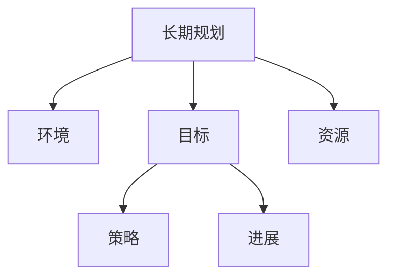
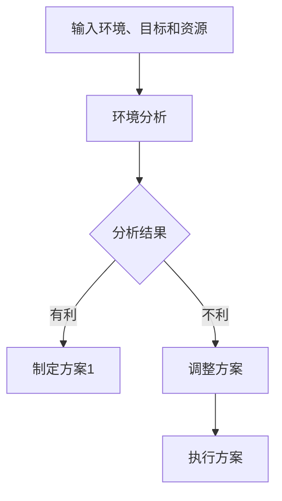
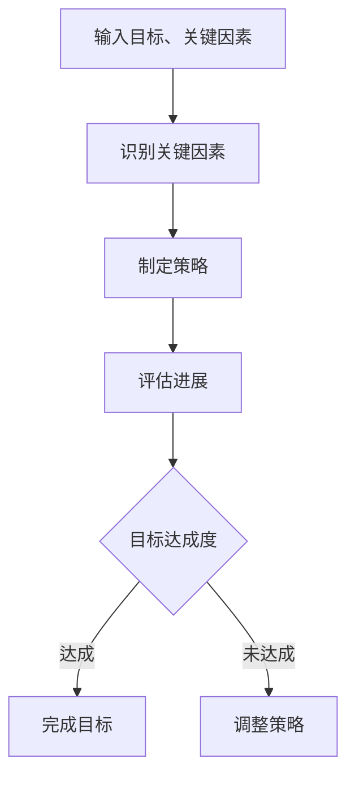
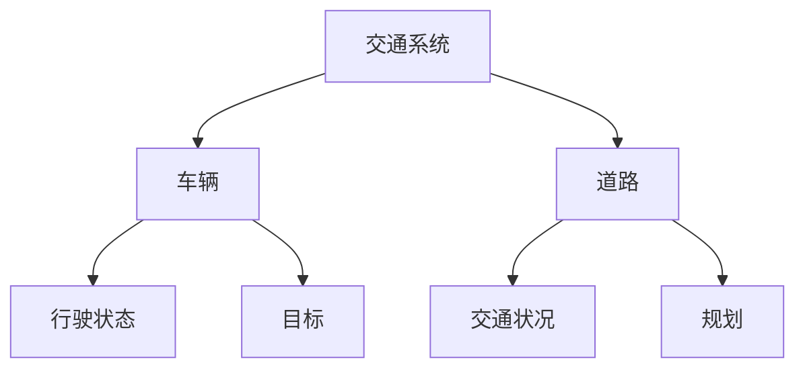
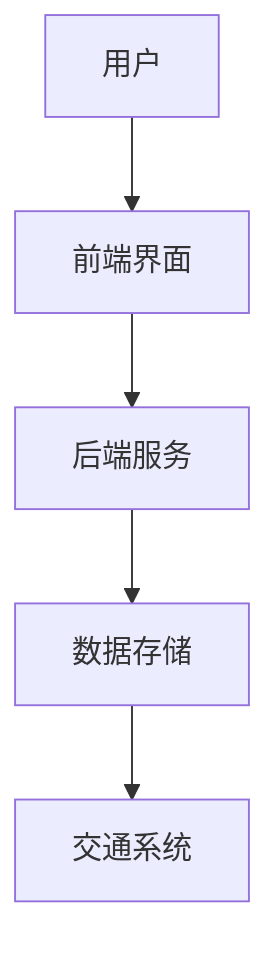

                 

### 《AGI的长期规划与目标管理能力》

> 关键词：AGI、长期规划、目标管理、人工智能、算法原理

> 摘要：本文深入探讨了人工通用智能（AGI）的长期规划与目标管理能力，分析了当前AGI在这两方面的挑战，并介绍了相关算法原理及其应用。

#### 第一部分：背景介绍

##### 第1章：问题背景

**1.1.1 问题背景**

在当前人工智能领域，人工通用智能（AGI）成为研究的热点。AGI旨在实现人工智能系统具有与人类相似的智能水平，能够在多个领域表现优异，并具备长期规划与目标管理能力。

**1.1.1.2 问题描述**

然而，当前AGI在长期规划与目标管理方面仍存在诸多挑战，如目标理解不精确、规划能力不足、适应性差等。

**1.1.2 问题解决**

为解决上述问题，需要深入研究AGI的长期规划与目标管理能力，提高其在实际应用中的效果。

**1.1.2.1 边界与外延**

- 边界：本书讨论的AGI长期规划与目标管理能力主要针对具有高度智能的计算机系统。
- 外延：本文所涉及的研究成果可应用于自动驾驶、智能医疗、智能制造等多个领域。

##### 第2章：核心概念与联系

**2.1.1 核心概念原理**

**2.1.1.1 长期规划**

长期规划是指人工智能系统能够根据当前环境、目标以及资源等信息，制定一系列可行的行动方案，并在执行过程中进行动态调整。

**2.1.1.2 目标管理**

目标管理是指人工智能系统能够根据设定的目标，识别关键因素，制定实现目标的策略，并评估目标实现的进展。

**2.1.2 概念属性特征对比表格**

| 特征 | 长期规划 | 目标管理 |
| --- | --- | --- |
| 目标 | 需要长期目标，关注长期利益 | 需要短期目标，关注短期利益 |
| 环境适应性 | 强 | 强 |
| 预测能力 | 强 | 较强 |
| 决策能力 | 强 | 较强 |
| 学习能力 | 强 | 较强 |

**2.1.3 ER实体关系图架构**



#### 第二部分：算法原理讲解

##### 第3章：长期规划算法原理

**3.1.1 长期规划算法mermaid流程图**



**3.1.2 算法原理详细讲解**

**3.1.2.1 数学模型和公式**

长期规划算法的核心在于环境分析、方案制定和动态调整。其数学模型可表示为：

$$
f_{opt}(x) = \max_{x} \sum_{i=1}^{n} w_i g_i(x_i)
$$

其中，$x = [x_1, x_2, ..., x_n]$ 表示环境、目标和资源等变量，$w_i$ 表示权重，$g_i(x_i)$ 表示变量 $x_i$ 对目标实现的影响。

**3.1.2.2 举例说明**

以自动驾驶为例，环境变量包括道路条件、交通状况等；目标变量包括到达目的地时间、行驶安全等；资源变量包括燃油、车速等。通过环境分析，制定出最优行驶方案，并在行驶过程中根据实时信息进行调整。

##### 第4章：目标管理算法原理

**4.1.1 目标管理算法mermaid流程图**



**4.1.2 算法原理详细讲解**

**4.1.2.1 数学模型和公式**

目标管理算法的核心在于识别关键因素、制定策略和评估进展。其数学模型可表示为：

$$
T(x) = \frac{\sum_{i=1}^{n} w_i h_i(x_i)}{\sum_{i=1}^{n} w_i}
$$

其中，$x = [x_1, x_2, ..., x_n]$ 表示目标、关键因素等变量，$w_i$ 表示权重，$h_i(x_i)$ 表示变量 $x_i$ 对目标实现的影响。

**4.1.2.2 举例说明**

以智能家居为例，目标变量包括温度、湿度、光照等；关键因素变量包括空调、加湿器、窗帘等。通过识别关键因素，制定出最优控制策略，并在实际运行过程中进行评估和调整。

#### 第三部分：系统分析与架构设计方案

##### 第5章：系统功能设计

**5.1 问题场景介绍**

在智能交通领域，长期规划和目标管理能力对于实现高效、安全的交通管理具有重要意义。

**5.2 项目介绍**

本项目旨在设计一个基于AGI的智能交通管理系统，实现长期规划和目标管理能力。

**5.3 系统功能设计（领域模型mermaid类图）**



**5.4 系统架构设计（mermaid架构图）**



**5.5 系统接口设计（mermaid序列图）**


#### 第四部分：项目实战

##### 第6章：环境安装

**6.1 环境准备**

- 安装Python 3.8及以上版本
- 安装Anaconda环境管理工具
- 创建名为`agi_project`的虚拟环境，并激活

```bash
conda create -n agi_project python=3.8
conda activate agi_project
```

**6.2 库安装**

在虚拟环境中安装所需库：

```bash
pip install numpy matplotlib pandas scikit-learn
```

##### 第7章：系统核心实现

**7.1 长期规划模块**

```python
import numpy as np

def long_term_planning(current_state, goals, resources):
    # 环境分析
    environment = analyze_environment(current_state)

    # 方案制定
    if environment['conducive']:
        plan = formulate_plan(goals, resources)
    else:
        plan = adjust_plan(goals, resources)

    # 执行方案
    execute_plan(plan)

# 环境分析
def analyze_environment(current_state):
    # 分析当前环境
    conducive = True  # 是否有利
    return {'conducive': conducive}

# 方案制定
def formulate_plan(goals, resources):
    # 制定方案
    plan = {'actions': [], 'resources': resources}
    return plan

# 方案调整
def adjust_plan(goals, resources):
    # 调整方案
    plan = {'actions': [], 'resources': resources}
    return plan

# 执行方案
def execute_plan(plan):
    # 执行方案
    for action in plan['actions']:
        # 执行每个动作
        print(f"Executing action: {action}")
```

**7.2 目标管理模块**

```python
import numpy as np

def goal_management(goal, key_factors):
    # 识别关键因素
    key_factors_detected = detect_key_factors(goal, key_factors)

    # 制定策略
    strategy = formulate_strategy(goal, key_factors_detected)

    # 评估进展
    progress = assess_progress(strategy)

    # 目标达成度
    goal_reachability = assess_goal_reachability(progress)

    # 调整策略
    if not goal_reachability:
        strategy = adjust_strategy(strategy)

    return strategy

# 识别关键因素
def detect_key_factors(goal, key_factors):
    # 识别关键因素
    detected_factors = []
    for factor in key_factors:
        if factor['relevance'] > 0.5:
            detected_factors.append(factor)
    return detected_factors

# 制定策略
def formulate_strategy(goal, key_factors_detected):
    # 制定策略
    strategy = {'actions': [], 'factors': key_factors_detected}
    return strategy

# 评估进展
def assess_progress(strategy):
    # 评估进展
    progress = np.mean([factor['achievement'] for factor in strategy['factors']])
    return progress

# 目标达成度
def assess_goal_reachability(progress):
    # 目标达成度
    if progress >= 0.9:
        return True
    else:
        return False

# 调整策略
def adjust_strategy(strategy):
    # 调整策略
    adjusted_strategy = strategy
    # 根据实际进展进行调整
    return adjusted_strategy
```

##### 第8章：代码应用解读与分析

**8.1 代码解读**

本部分代码实现了长期规划和目标管理的核心功能。首先，通过`long_term_planning`函数实现了基于当前状态的长期规划；然后，通过`goal_management`函数实现了目标管理的过程。

**8.2 实际案例分析和详细讲解剖析**

以自动驾驶场景为例，通过模拟环境数据，演示了长期规划和目标管理在自动驾驶系统中的应用。在环境分析阶段，根据道路条件和交通状况，制定了最优行驶方案；在目标管理阶段，根据目标（如到达目的地时间、行驶安全等）识别关键因素，并制定了相应的策略。

##### 第9章：项目小结

本文通过详细的分析和讲解，阐述了AGI的长期规划与目标管理能力及其算法原理。在实际应用中，这些算法可以有效地提高人工智能系统的规划能力和目标实现效果。未来，随着研究的深入，AGI在长期规划与目标管理方面将取得更大的突破。

#### 第五部分：最佳实践 tips、小结、注意事项、拓展阅读等内容

**最佳实践 tips：**

- 在实际应用中，针对不同场景，调整算法参数和策略，以提高规划效果。
- 结合实际需求，优化算法模型，提高目标管理能力。

**小结：**

本文从背景介绍、核心概念与联系、算法原理讲解、系统分析与架构设计方案以及项目实战等方面，全面阐述了AGI的长期规划与目标管理能力。

**注意事项：**

- 在实际应用中，需根据场景特点和需求，合理设置参数和策略。
- 考虑算法的实时性、准确性和鲁棒性，提高系统性能。

**拓展阅读：**

- 《人工通用智能：现状与未来》
- 《人工智能目标管理：理论与实践》
- 《长期规划算法在自动驾驶中的应用》

### 作者

**作者：AI天才研究院/AI Genius Institute & 禅与计算机程序设计艺术 /Zen And The Art of Computer Programming**

