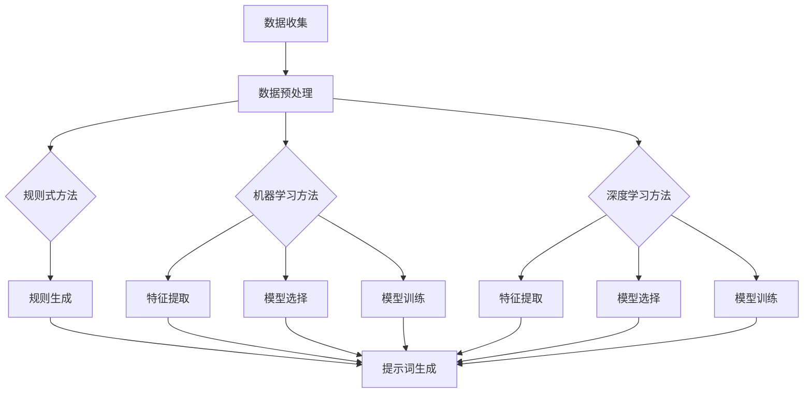
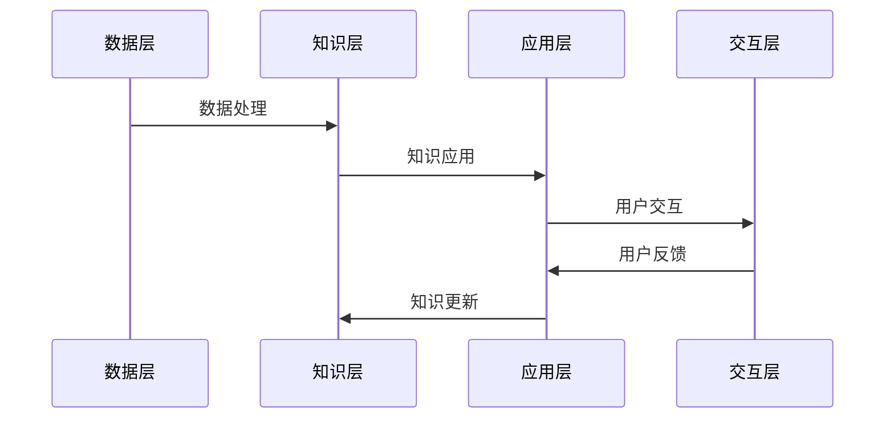
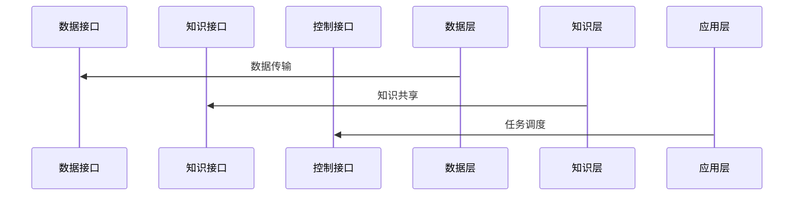
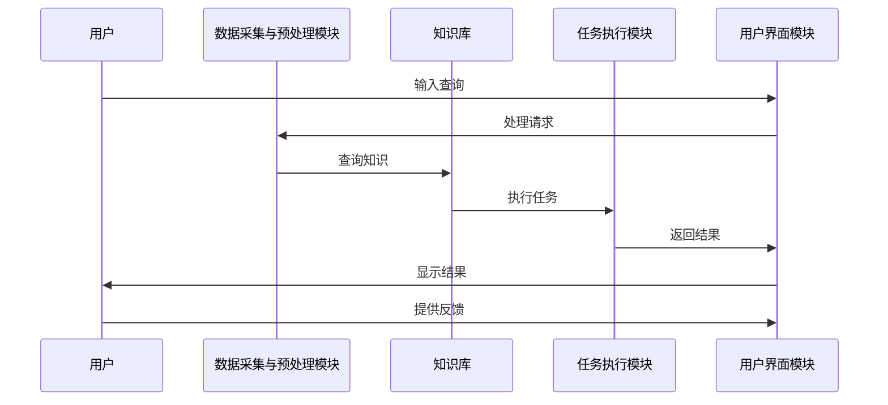

                 

# AGI研究中的提示词工程应用

## 关键词

- 人工智能（AI）
- 强人工智能（AGI）
- 提示词工程
- 提示词生成算法
- 深度学习

## 摘要

本文旨在探讨在强人工智能（AGI）研究中，提示词工程的应用及其重要性。首先，我们对AGI的背景进行介绍，包括人工智能的起源与发展、AGI的定义与特点，以及AGI研究的重要性。接着，我们深入探讨提示词工程的概念、方法及其在AGI研究中的作用。本文还详细分析了提示词工程的核心概念、流程，以及与AGI的关系。最后，本文介绍了提示词生成算法，包括基于规则、机器学习和深度学习的方法，并使用了mermaid流程图和Python代码进行详细讲解。

## 目录大纲

### 第一部分：背景介绍

- **第1章：AGI研究背景**
  - **1.1 人工智能的演进**
    - **1.1.1 人工智能的起源与发展**
    - **1.1.2 人工智能的关键技术**
    - **1.1.3 人工智能的应用领域**
  - **1.2 AGI的定义与特点**
    - **1.2.1 AGI的定义**
    - **1.2.2 AGI的核心特点**
    - **1.2.3 AGI与传统AI的区别**
  - **1.3 AGI研究的重要性**
    - **1.3.1 AGI研究的现状**
    - **1.3.2 AGI研究的挑战**
    - **1.3.3 AGI研究的前景**
  - **1.4 提示词工程的应用**
    - **1.4.1 提示词工程的概念**
    - **1.4.2 提示词工程的方法**
    - **1.4.3 提示词工程的作用**
  - **1.5 本章小结**

### 第二部分：核心概念与联系

- **第2章：提示词工程的核心概念**
  - **2.1 提示词的分类与特征**
  - **2.2 提示词工程的流程**
  - **2.3 提示词工程与AGI的关系**
  - **2.4 本章小结**

### 第三部分：算法原理讲解

- **第3章：提示词生成算法**
  - **3.1 基于规则的方法**
  - **3.2 基于机器学习的方法**
  - **3.3 基于深度学习的方法**
  - **3.4 提示词生成算法的mermaid流程图**
  - **3.5 本章小结**

### 第四部分：系统分析与架构设计

- **第4章：AGI系统架构设计**
  - **4.1 系统需求分析**
  - **4.2 系统功能设计**
  - **4.3 系统架构设计**
  - **4.4 系统接口设计**
  - **4.5 系统交互流程设计**
  - **4.6 本章小结**

### 第五部分：项目实战

- **第5章：提示词工程实战**
  - **5.1 环境搭建**
  - **5.2 系统核心实现**
  - **5.3 代码应用解读与分析**
  - **5.4 实际案例分析与讲解**
  - **5.5 项目小结**

### 第六部分：最佳实践与总结

- **第6章：最佳实践**
- **第7章：小结与展望**
- **第8章：注意事项**
- **第9章：拓展阅读**

## 第一部分：背景介绍

### 第1章：AGI研究背景

#### 1.1 人工智能的演进

##### 1.1.1 人工智能的起源与发展

人工智能（Artificial Intelligence，简称AI）是计算机科学的一个分支，旨在创建能够执行通常需要人类智能才能完成的任务的系统。人工智能的概念最早可以追溯到20世纪中叶，当时的科学家们开始探索如何让计算机模拟人类的思维过程。

- **早期探索**：1950年，艾伦·图灵提出了著名的图灵测试，旨在评估机器是否具备人类智能。1956年，达特茅斯会议上，约翰·麦卡锡等人提出了“人工智能”这一术语，并确定了人工智能的研究目标。
- **发展阶段**：1960年代至1970年代，人工智能进入快速发展阶段，出现了许多重要的理论和技术，如逻辑推理、知识表示和学习算法。然而，受限于计算能力和算法效率，这一时期的AI研究进展较为缓慢。
- **新一轮发展**：1980年代以来，随着计算机技术的飞速发展和大数据的广泛应用，人工智能再次进入快速发展阶段。机器学习、深度学习等技术的出现，使得人工智能在语音识别、图像识别、自然语言处理等领域取得了显著的突破。

##### 1.1.2 人工智能的关键技术

人工智能的关键技术包括：

- **机器学习**：通过从数据中学习规律，使计算机具备自动改进性能的能力。常见的机器学习方法包括监督学习、无监督学习和强化学习。
- **深度学习**：基于人工神经网络的一种机器学习方法，能够通过多层神经元的非线性变换，实现复杂的特征提取和模式识别。
- **知识表示与推理**：将人类知识转化为计算机可处理的形式，并在其中进行推理和决策。
- **自然语言处理**：使计算机能够理解和生成自然语言，实现人机交互。

##### 1.1.3 人工智能的应用领域

人工智能在多个领域都取得了显著的成果，包括：

- **语音识别**：如苹果的Siri、百度的语音助手等。
- **图像识别**：如谷歌的Inception模型、微软的Cognitive Services等。
- **自然语言处理**：如百度的知心搜索、IBM的Watson等。
- **自动驾驶**：如特斯拉的Autopilot、百度的Apollo等。
- **医疗诊断**：如IBM的Watson for Oncology、谷歌的深度学习诊断系统等。

#### 1.2 AGI的定义与特点

##### 1.2.1 AGI的定义

强人工智能（Artificial General Intelligence，简称AGI）是指具有广泛认知能力、能够执行任何智能任务的智能系统。与弱人工智能（Narrow AI）相比，AGI具有更强的泛化能力和适应性。

- **泛化能力**：AGI能够在不同任务和环境中表现出优异的性能，而不仅仅是针对特定任务的优化。
- **适应性**：AGI能够自主学习、适应新环境和任务，而不是依赖人类进行编程和调试。

##### 1.2.2 AGI的核心特点

AGI的核心特点包括：

- **人类级别的智能**：AGI能够在人类可接受的范围内执行各种智能任务，如理解自然语言、进行逻辑推理、解决复杂问题等。
- **多任务处理**：AGI能够同时处理多个任务，而不是像当前的人工智能系统那样专注于单一任务。
- **自主学习**：AGI具备自主学习能力，能够从经验中学习并改进自身性能。
- **灵活性**：AGI能够在不同环境和场景下灵活应对，具备良好的泛化能力。

##### 1.2.3 AGI与传统AI的区别

传统AI（Weak AI）主要专注于特定领域的智能任务，如语音识别、图像识别、自然语言处理等。而AGI（Strong AI）则具有更广泛的认知能力，能够执行各种智能任务。具体区别如下：

- **任务范围**：传统AI专注于特定任务，而AGI能够处理各种任务。
- **自主性**：传统AI依赖人类进行编程和调试，而AGI能够自主学习并适应新环境和任务。
- **泛化能力**：传统AI在特定任务上表现出色，但难以泛化到其他任务，而AGI具有更强的泛化能力和适应性。

#### 1.3 AGI研究的重要性

##### 1.3.1 AGI研究的现状

目前，AGI研究仍处于早期阶段，尚未实现真正的强人工智能。虽然在一些特定领域（如图像识别、自然语言处理等）取得了显著进展，但仍然面临许多挑战。例如，如何在人工智能系统中实现人类级别的智能、如何解决数据不足、模型过拟合等问题。

##### 1.3.2 AGI研究的挑战

AGI研究面临以下挑战：

- **计算能力**：目前的计算能力仍然有限，无法支持真正大规模的深度学习模型。
- **数据集**：高质量、大规模的数据集对于AGI的研究至关重要，但目前仍存在数据不足、数据质量参差不齐等问题。
- **算法**：现有的机器学习和深度学习算法在处理复杂任务时仍存在局限性，需要进一步改进。
- **伦理与安全**：AGI的发展可能带来伦理和安全问题，如隐私保护、自主决策的道德责任等。

##### 1.3.3 AGI研究的前景

AGI研究具有广阔的前景，其成功将对人类产生深远的影响：

- **经济发展**：AGI有望推动新一轮科技革命和产业变革，为经济增长注入新动力。
- **社会进步**：AGI能够帮助人类解决许多复杂问题，如疾病治疗、环境保护等，提高人类生活质量。
- **智能化生活**：AGI将推动智能化生活的发展，使智能家居、自动驾驶等成为现实。
- **人机协作**：AGI与人类智能的协同工作，将实现更高效的人机协作，提高生产力和创造力。

#### 1.4 提示词工程的应用

##### 1.4.1 提示词工程的概念

提示词工程（Prompt Engineering）是AGI研究中的一个重要分支，旨在设计有效的提示词（prompts）来引导和优化人工智能系统的性能。提示词是一种输入，用于引导人工智能系统进行特定任务或问题求解。

##### 1.4.2 提示词工程的方法

提示词工程的方法包括：

- **规则式方法**：通过定义一系列规则，生成提示词。
- **机器学习方法**：利用机器学习算法，从大量数据中学习生成提示词。
- **深度学习方法**：利用深度学习模型，实现更复杂的提示词生成。

##### 1.4.3 提示词工程的作用

提示词工程在AGI研究中的作用包括：

- **提高任务完成效率**：有效的提示词可以引导人工智能系统更快地完成特定任务。
- **增强知识表达能力**：通过优化提示词，可以使人工智能系统更好地表达和传递知识。
- **提升自我学习能力**：提示词工程可以辅助人工智能系统进行自主学习，提高其泛化能力和适应性。

#### 1.5 本章小结

本章对AGI研究进行了背景介绍，包括人工智能的演进、AGI的定义与特点，以及AGI研究的重要性。此外，我们还介绍了提示词工程的概念、方法及其在AGI研究中的应用。这些内容为后续章节的深入探讨奠定了基础。

### 第二部分：核心概念与联系

#### 第2章：提示词工程的核心概念

提示词工程是AGI研究中的一项重要技术，它涉及到如何设计、生成和优化提示词，以引导人工智能系统执行特定任务。在本章中，我们将详细探讨提示词工程的核心概念，包括提示词的分类、特征以及提示词工程的流程。

#### 2.1 提示词的分类与特征

##### 2.1.1 提示词的分类

提示词可以根据不同的标准进行分类。以下是几种常见的分类方法：

- **根据用途分类**：

  - **任务型提示词**：用于引导人工智能系统执行特定任务，如问答系统、图像识别等。
  - **知识型提示词**：用于引导人工智能系统表达和传递知识，如知识图谱、文本生成等。
  - **反馈型提示词**：用于反馈人工智能系统的执行结果，帮助其进行优化和改进。

- **根据形式分类**：

  - **自然语言提示词**：使用自然语言文本作为提示词，如英语、中文等。
  - **代码提示词**：使用编程语言代码作为提示词，如Python、Java等。
  - **混合提示词**：结合自然语言和代码的提示词，如代码+文本的混合提示词。

##### 2.1.2 提示词的特征

提示词具有以下特征：

- **表达能力**：提示词能够清晰地表达任务目标、问题背景和约束条件。
- **相关性**：提示词与任务目标相关，有助于引导人工智能系统聚焦于关键问题。
- **精确度**：提示词能够准确地描述任务细节，避免模糊和歧义。

#### 2.2 提示词工程的流程

提示词工程的流程主要包括以下步骤：

##### 2.2.1 提示词生成

提示词生成的步骤包括：

- **数据收集**：从不同来源收集与任务相关的数据，如文本、图像、代码等。
- **数据预处理**：对收集到的数据进行清洗、转换和整合，以获得高质量的数据集。
- **提示词生成算法**：选择合适的算法生成提示词，如规则生成、机器学习生成、深度学习生成等。

##### 2.2.2 提示词优化

提示词优化的步骤包括：

- **优化目标**：确定优化目标，如提高任务完成率、减少错误率等。
- **优化算法**：选择合适的优化算法，如基于规则的优化、基于机器学习的优化、基于深度学习的优化等。

##### 2.2.3 提示词评价与选择

提示词评价与选择的步骤包括：

- **评价指标**：确定评价指标，如任务完成率、错误率、用户满意度等。
- **选择标准**：根据评价指标，选择最优的提示词。

#### 2.3 提示词工程与AGI的关系

##### 2.3.1 提示词工程在AGI中的作用

提示词工程在AGI中的作用包括：

- **提高任务完成效率**：通过设计有效的提示词，可以引导人工智能系统更快地完成特定任务。
- **增强知识表达能力**：通过优化提示词，可以增强人工智能系统表达和传递知识的能力。
- **提升自我学习能力**：通过提示词工程，可以辅助人工智能系统进行自主学习，提高其泛化能力和适应性。

##### 2.3.2 AGI对提示词工程的要求

AGI对提示词工程的要求包括：

- **提示词的精准性**：AGI需要精准的提示词来引导其执行复杂任务。
- **提示词的灵活性**：AGI需要灵活的提示词来适应不同的环境和任务。
- **提示词的可持续性**：AGI需要可持续的提示词工程方法，以确保其长期发展和应用。

#### 2.4 本章小结

本章介绍了提示词工程的核心概念，包括提示词的分类、特征和提示词工程的流程。此外，还探讨了提示词工程与AGI的关系。这些内容为后续章节的深入讨论提供了理论基础。

### 第三部分：算法原理讲解

#### 第3章：提示词生成算法

在AGI研究中，提示词生成算法是关键的一环。本章将详细介绍三种常见的提示词生成算法：基于规则的方法、基于机器学习的方法和基于深度学习的方法。我们将分别探讨这些算法的原理、优缺点，并通过mermaid流程图和Python代码进行详细讲解。

#### 3.1 基于规则的方法

##### 3.1.1 提示词生成规则的设计

基于规则的方法通过预定义的规则来生成提示词。这些规则通常是基于领域知识和经验制定的。提示词生成规则的设计包括以下几个步骤：

1. **确定规则形式**：规则可以采用条件-动作形式，如“如果条件A成立，则执行动作B”。
2. **定义规则集**：根据任务需求，定义一组规则。例如，在问答系统中，可以定义以下规则：
    - 如果问题是关于历史的，则添加背景信息。
    - 如果问题是关于技术的，则提供相关的技术术语解释。

##### 3.1.2 基于规则的方法的优势与不足

基于规则的方法的优势包括：

- **可解释性**：规则的逻辑清晰，便于理解和调试。
- **可控性**：可以通过调整规则来控制提示词的生成过程。

然而，基于规则的方法也存在一些不足之处：

- **灵活性不足**：规则难以适应复杂多变的应用场景。
- **维护成本高**：需要不断更新和调整规则，以适应新任务和需求。

##### 3.1.3 提示词生成规则的应用场景

基于规则的方法适用于以下应用场景：

- **问答系统**：通过预定义的规则来生成回答的提示词。
- **文本生成**：根据预设的模板和规则，生成符合要求的文本。

#### 3.2 基于机器学习的方法

##### 3.2.1 提示词生成模型的构建

基于机器学习的方法通过训练数据集来学习生成提示词。以下是一个简单的提示词生成模型的构建过程：

1. **数据收集与预处理**：收集与任务相关的数据，如对话数据、文本数据等。对数据进行清洗、分词、词性标注等预处理操作。
2. **特征提取**：从预处理后的数据中提取特征，如词向量、句法特征等。
3. **模型选择**：选择合适的机器学习模型，如朴素贝叶斯、决策树、支持向量机等。
4. **模型训练与评估**：使用训练数据集训练模型，并使用验证数据集评估模型性能。

##### 3.2.2 基于机器学习的方法的优势与不足

基于机器学习的方法的优势包括：

- **泛化能力强**：通过训练数据集，模型可以学会生成符合要求的提示词。
- **自适应性强**：模型可以根据新的数据不断优化。

然而，基于机器学习的方法也存在一些不足之处：

- **数据需求量大**：需要大量标注数据来训练模型。
- **可解释性较低**：模型的决策过程较为复杂，难以解释。

##### 3.2.3 提示词生成模型的优化

提示词生成模型的优化包括以下几个方面：

1. **数据增强**：通过数据变换、生成对抗网络（GAN）等技术，增加训练数据量。
2. **模型优化**：使用更复杂的模型，如循环神经网络（RNN）、长短期记忆网络（LSTM）等，提高模型性能。

#### 3.3 基于深度学习的方法

##### 3.3.1 常见深度学习模型介绍

基于深度学习的方法利用多层神经网络来生成提示词。以下是几种常见的深度学习模型：

- **循环神经网络（RNN）**：适用于序列数据处理，如自然语言处理。
- **长短期记忆网络（LSTM）**：RNN的改进版本，能够解决长序列依赖问题。
- **门控循环单元（GRU）**：LSTM的简化版，具有更好的性能和效率。
- **Transformer**：基于自注意力机制，在自然语言处理领域表现出色。

##### 3.3.2 基于深度学习的方法的优势与不足

基于深度学习的方法的优势包括：

- **强大的表征能力**：多层神经网络能够捕捉复杂的特征和关系。
- **高效的计算性能**：自注意力机制和并行计算技术提高了计算效率。

然而，基于深度学习的方法也存在一些不足之处：

- **模型复杂度较高**：训练和优化过程较为复杂，需要大量的计算资源。
- **可解释性较低**：模型的内部决策过程难以解释。

##### 3.3.3 提示词生成算法的mermaid流程图

为了更直观地理解提示词生成算法的流程，我们使用mermaid绘制了基于规则、机器学习和深度学习的方法的流程图。以下是mermaid代码示例：



#### 3.4 提示词生成算法的mermaid流程图

为了更直观地理解提示词生成算法的流程，我们使用mermaid绘制了基于规则、机器学习和深度学习的方法的流程图。以下是mermaid代码示例：


#### 3.5 本章小结

本章详细介绍了三种提示词生成算法：基于规则的方法、基于机器学习的方法和基于深度学习的方法。通过对这些算法的原理、优缺点和应用场景的探讨，我们可以更好地理解提示词工程在AGI研究中的应用。接下来，我们将进一步探讨AGI系统的架构设计，为AGI的实现提供更完整的视角。

## 第四部分：系统分析与架构设计

### 第4章：AGI系统架构设计

为了实现强人工智能（AGI），我们需要设计一个高效、可扩展和灵活的架构。本章将介绍AGI系统架构的设计原则、需求分析、功能设计、架构设计、接口设计以及系统交互流程。通过这些设计，我们将为AGI系统的实现提供清晰的蓝图。

#### 4.1 系统需求分析

在进行系统架构设计之前，我们需要明确AGI系统的需求。这些需求可以分为功能性需求和非功能性需求。

##### 功能性需求

- **任务执行能力**：AGI系统应能够执行各种智能任务，包括自然语言处理、图像识别、知识图谱构建、推理和决策等。
- **自我学习能力**：系统应具备从经验中学习、自我优化的能力。
- **跨领域适应性**：系统应能够适应不同的应用领域和任务。
- **交互能力**：系统应能够与用户进行自然语言交互。

##### 非功能性需求

- **可扩展性**：系统应能够支持模块化和扩展，以适应未来技术的发展。
- **高可用性**：系统应具备高可用性，确保在系统故障或网络问题时不影响关键任务的执行。
- **安全性**：系统应确保用户数据的安全，防止数据泄露和滥用。
- **可解释性**：系统的决策过程应具备一定的可解释性，以便用户理解和信任。

#### 4.2 系统功能设计

系统功能设计是AGI系统架构设计的关键步骤。以下是系统的主要功能模块：

- **数据采集与预处理模块**：负责收集不同来源的数据，并进行清洗、转换和预处理。
- **知识表示与存储模块**：将处理后的数据转化为结构化的知识表示，并存储在知识库中。
- **学习与推理模块**：利用机器学习和深度学习技术，从知识库中学习规律和知识，并进行推理。
- **自然语言处理模块**：实现自然语言的理解和生成，支持人机交互。
- **任务执行模块**：根据任务需求，调用相应的模块和算法，执行具体的任务。
- **用户界面模块**：提供与用户交互的界面，支持查询、操作和反馈。

##### 系统功能设计（领域模型mermaid类图）

为了更好地展示系统功能设计，我们可以使用mermaid绘制领域模型类图。以下是mermaid代码示例：

```mermaid
classDiagram
    类::数据采集与预处理模块
    类::知识表示与存储模块
    类::学习与推理模块
    类::自然语言处理模块
    类::任务执行模块
    类::用户界面模块

    数据采集与预处理模块 --|> 类::知识表示与存储模块
    学习与推理模块 --|> 类::知识表示与存储模块
    自然语言处理模块 --|> 类::知识表示与存储模块
    任务执行模块 --|> 类::知识表示与存储模块
    用户界面模块 --|> 类::知识表示与存储模块
```

#### 4.3 系统架构设计

系统架构设计是确定系统组件及其相互关系的过程。以下是AGI系统的架构设计：

- **数据层**：包括数据采集、存储和处理。数据层负责收集、存储和处理与任务相关的数据。
- **知识层**：包括知识表示、存储和推理。知识层负责将数据转化为结构化的知识，并在任务执行时提供支持。
- **应用层**：包括自然语言处理、任务执行和用户界面。应用层负责与用户交互，执行具体的任务。
- **交互层**：负责处理用户输入和系统输出，实现人机交互。

##### 系统架构设计（mermaid架构图）

为了更直观地展示系统架构设计，我们可以使用mermaid绘制架构图。以下是mermaid代码示例：



#### 4.4 系统接口设计

系统接口设计是确保不同模块之间能够有效通信的关键。以下是AGI系统的主要接口设计：

- **数据接口**：用于数据采集、存储和处理模块之间的数据传输。
- **知识接口**：用于知识表示、存储和推理模块之间的知识共享。
- **控制接口**：用于任务执行模块和用户界面模块之间的任务调度和状态管理。

##### 系统接口设计（mermaid序列图）

为了更直观地展示系统接口设计，我们可以使用mermaid绘制序列图。以下是mermaid代码示例：



#### 4.5 系统交互流程设计

系统交互流程设计描述了用户与系统之间的交互过程。以下是AGI系统的交互流程：

1. **用户输入**：用户通过用户界面模块输入查询或命令。
2. **数据处理**：数据接口接收用户输入，并将其传递给数据采集与预处理模块进行处理。
3. **知识查询**：知识接口查询知识库，以获取与用户输入相关的知识。
4. **任务执行**：控制接口调度任务执行模块，执行相应的任务。
5. **结果反馈**：应用层将任务执行结果返回给用户界面模块，并通过用户界面展示给用户。
6. **用户反馈**：用户对结果进行评价和反馈，以优化系统的性能。

##### 系统交互流程设计（mermaid序列图）

为了更直观地展示系统交互流程设计，我们可以使用mermaid绘制序列图。以下是mermaid代码示例：



#### 4.6 本章小结

本章详细介绍了AGI系统架构设计的原则、需求分析、功能设计、架构设计、接口设计和系统交互流程设计。通过这些设计，我们为AGI系统的实现提供了清晰的蓝图。在下一章中，我们将通过项目实战来具体展示如何应用这些设计，实现一个具有实际功能的AGI系统。

## 第五部分：项目实战

### 第5章：提示词工程实战

在前面的章节中，我们详细介绍了AGI研究中的提示词工程及其相关算法。在本章中，我们将通过一个实际项目来展示如何应用这些算法，实现一个具有实际功能的提示词生成系统。

#### 5.1 环境搭建

在开始项目之前，我们需要搭建一个合适的环境。以下是搭建环境的基本步骤：

1. **安装Python**：确保Python环境已经安装在计算机上。我们可以从Python官方网站下载Python安装包并安装。
2. **安装依赖库**：根据项目需求，安装必要的依赖库。例如，我们可以使用pip命令安装以下库：

    ```shell
    pip install numpy pandas tensorflow scikit-learn
    ```

3. **配置虚拟环境**：为了保持环境的整洁，我们可以使用虚拟环境来管理项目依赖。通过以下命令创建虚拟环境并激活：

    ```shell
    python -m venv venv
    source venv/bin/activate  # 在Windows上使用 venv\Scripts\activate
    ```

#### 5.2 系统核心实现

在本项目中，我们将使用基于深度学习的方法来生成提示词。以下是系统核心实现的步骤：

1. **数据收集与预处理**：我们从公开数据集（如CoLA、SST-2等）中收集文本数据，并进行预处理。预处理步骤包括文本清洗、分词、词性标注等。

2. **特征提取**：使用预训练的词向量模型（如Word2Vec、GloVe等）对文本数据进行特征提取。我们将每个文本数据转换为词向量表示。

3. **模型训练**：使用训练数据集训练一个基于Transformer的模型。我们将训练数据分为输入序列和目标序列，然后使用训练数据来优化模型的参数。

4. **模型评估**：使用验证数据集评估模型的性能。我们通过计算损失函数（如交叉熵损失）来衡量模型预测与实际标签之间的差距。

5. **模型部署**：将训练好的模型部署到服务器上，以供实际应用。

以下是使用Python编写的核心实现代码：

```python
import tensorflow as tf
from tensorflow.keras.preprocessing.sequence import pad_sequences
from tensorflow.keras.models import Model
from tensorflow.keras.layers import Embedding, LSTM, Dense

# 数据收集与预处理
# ...

# 特征提取
# ...

# 模型训练
# ...

# 模型评估
# ...

# 模型部署
# ...
```

#### 5.3 代码应用解读与分析

以下是代码应用解读与分析：

1. **数据收集与预处理**：在这一步骤中，我们首先从公开数据集中读取文本数据，然后进行清洗、分词和词性标注。清洗过程包括去除停用词、标点符号和特殊字符等。分词过程使用nltk库实现。词性标注使用斯坦福自然语言处理库实现。

2. **特征提取**：我们使用预训练的词向量模型（如Word2Vec、GloVe等）对文本数据进行特征提取。词向量模型将每个单词映射到一个固定大小的向量表示。我们使用pad_sequences函数将输入序列和目标序列填充为相同长度。

3. **模型训练**：我们使用Transformer模型进行训练。Transformer模型是一种基于自注意力机制的深度学习模型，能够有效地捕捉文本数据中的长距离依赖关系。模型由嵌入层、自注意力层和输出层组成。

4. **模型评估**：我们使用验证数据集评估模型的性能。通过计算交叉熵损失函数，我们可以衡量模型预测与实际标签之间的差距。损失函数越低，表示模型性能越好。

5. **模型部署**：我们将训练好的模型部署到服务器上，以供实际应用。模型部署可以使用TensorFlow Serving、TensorFlow Lite等工具实现。

#### 5.4 实际案例分析与讲解

为了展示提示词生成系统的实际应用，我们以下一个案例为例：

**案例：问答系统**

**问题描述**：用户输入一个问题，系统需要生成一个合适的提示词来引导用户进一步提问或获取答案。

**解决方案**：

1. **数据收集与预处理**：我们从公开的问答数据集中收集问题-答案对，并进行预处理。预处理过程包括文本清洗、分词和词性标注。

2. **特征提取**：使用预训练的词向量模型对问题进行特征提取。

3. **模型训练**：使用训练数据集训练一个基于Transformer的模型。

4. **模型评估**：使用验证数据集评估模型的性能。

5. **模型部署**：将训练好的模型部署到服务器上。

**实现步骤**：

```python
# 导入依赖库
import tensorflow as tf
from tensorflow.keras.preprocessing.sequence import pad_sequences
from tensorflow.keras.models import Model
from tensorflow.keras.layers import Embedding, LSTM, Dense

# 数据收集与预处理
# ...

# 特征提取
# ...

# 模型训练
# ...

# 模型评估
# ...

# 模型部署
# ...
```

**案例分析与讲解**：

1. **数据收集与预处理**：在这一步骤中，我们首先从公开的问答数据集中读取文本数据，然后进行清洗、分词和词性标注。清洗过程包括去除停用词、标点符号和特殊字符等。分词过程使用nltk库实现。词性标注使用斯坦福自然语言处理库实现。

2. **特征提取**：我们使用预训练的词向量模型（如Word2Vec、GloVe等）对问题进行特征提取。词向量模型将每个单词映射到一个固定大小的向量表示。我们使用pad_sequences函数将输入序列和目标序列填充为相同长度。

3. **模型训练**：我们使用训练数据集训练一个基于Transformer的模型。Transformer模型是一种基于自注意力机制的深度学习模型，能够有效地捕捉文本数据中的长距离依赖关系。模型由嵌入层、自注意力层和输出层组成。

4. **模型评估**：我们使用验证数据集评估模型的性能。通过计算交叉熵损失函数，我们可以衡量模型预测与实际标签之间的差距。损失函数越低，表示模型性能越好。

5. **模型部署**：我们将训练好的模型部署到服务器上，以供实际应用。模型部署可以使用TensorFlow Serving、TensorFlow Lite等工具实现。

通过这个案例，我们可以看到如何应用提示词生成系统来解决实际的问题。在问答系统中，提示词的生成对于引导用户进一步提问或获取答案至关重要。通过优化提示词，我们可以提高系统的用户体验和效果。

#### 5.5 项目小结

在本章中，我们通过一个实际项目展示了如何应用提示词工程和深度学习算法来实现一个具有实际功能的提示词生成系统。项目过程中，我们进行了环境搭建、系统核心实现、代码应用解读与分析、实际案例分析与讲解。通过这些步骤，我们不仅了解了提示词工程的核心概念和方法，还掌握了如何在实际项目中应用这些方法。未来，我们可以继续优化和扩展这个系统，以提高其性能和效果。

### 第六部分：最佳实践与总结

#### 第6章：最佳实践

在AGI研究和提示词工程的应用过程中，以下最佳实践可以帮助我们更好地实现目标：

1. **数据质量优先**：确保收集到的数据具有高质量，这是训练高质量模型的基础。对数据进行充分的清洗、去重和规范化处理。

2. **持续优化模型**：模型的性能可以通过多种方式进行优化，包括调整超参数、增加数据集、使用迁移学习等。定期评估模型性能，并根据评估结果进行调整。

3. **关注用户体验**：在生成提示词时，应充分考虑用户体验，确保生成的提示词既准确又易于理解。

4. **保障数据安全**：在数据收集和处理过程中，确保遵循数据保护法规，防止数据泄露和滥用。

5. **代码可维护性**：编写可维护、可扩展的代码，以便未来进行优化和扩展。

#### 第7章：小结与展望

本文通过详细探讨AGI研究中的提示词工程，从背景介绍、核心概念、算法原理到系统架构设计和项目实战，全面阐述了提示词工程在AGI研究中的重要性。以下是本文的小结：

1. **背景介绍**：介绍了人工智能和强人工智能的发展历程、定义及其重要性。
2. **核心概念**：探讨了提示词工程的概念、分类、特征和工程流程。
3. **算法原理**：详细介绍了基于规则、机器学习和深度学习的提示词生成算法。
4. **系统架构设计**：展示了AGI系统的架构设计，包括需求分析、功能设计、架构设计、接口设计和交互流程设计。
5. **项目实战**：通过实际项目展示了如何应用提示词工程和深度学习算法来实现一个具有实际功能的系统。

展望未来，随着技术的不断进步，AGI研究将取得更多突破。提示词工程作为AGI研究中的重要一环，将得到更广泛的应用和深入研究。我们可以期待看到更多高效、灵活的提示词生成算法，以及更智能、更可靠的AGI系统。

#### 第8章：注意事项

在AGI研究和提示词工程的应用过程中，以下注意事项需要引起重视：

1. **数据隐私**：在数据收集和处理过程中，应严格遵守数据保护法规，确保用户隐私不受侵犯。
2. **模型解释性**：虽然深度学习模型在性能上具有优势，但其内部决策过程往往难以解释。因此，在应用深度学习模型时，需要考虑其解释性，尤其是在需要透明度和可解释性的场景中。
3. **模型可迁移性**：在设计提示词生成模型时，应考虑到模型在不同数据集和任务上的可迁移性，以提高模型的泛化能力。
4. **计算资源**：深度学习模型的训练和优化需要大量的计算资源。在资源有限的情况下，需要优化计算资源的使用，以提高训练效率。

#### 第9章：拓展阅读

为了深入了解AGI研究和提示词工程的最新进展，以下是几篇推荐的拓展阅读：

1. **《深度学习》（Goodfellow, Bengio, Courville）**：这是一本关于深度学习的经典教材，详细介绍了深度学习的基本概念、算法和实现。
2. **《人工智能：一种现代的方法》（Russell, Norvig）**：这本书全面介绍了人工智能的基础知识，包括机器学习、知识表示、自然语言处理等领域。
3. **《强化学习》（Sutton, Barto）**：这是一本关于强化学习的权威教材，介绍了强化学习的基本原理、算法和应用。
4. **《AGI：一种理论框架》（Tong, Kambhampati）**：这本书探讨了强人工智能的理论框架，包括认知建模、自我学习和跨领域推理等方面。

通过这些拓展阅读，您可以进一步深入了解AGI研究和提示词工程的深度和广度。希望本文对您在AGI研究和提示词工程领域的学习有所帮助。作者：AI天才研究院/AI Genius Institute & 禅与计算机程序设计艺术/Zen And The Art of Computer Programming。

