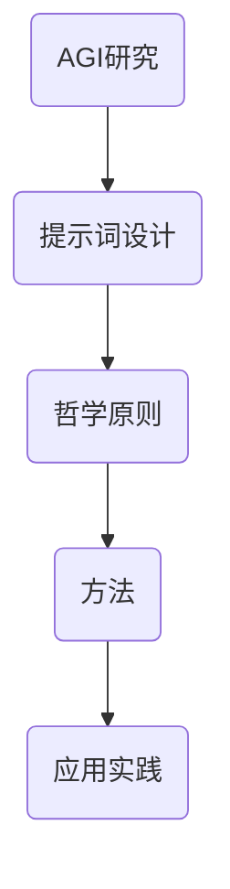
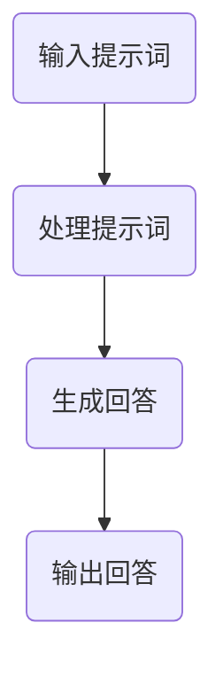
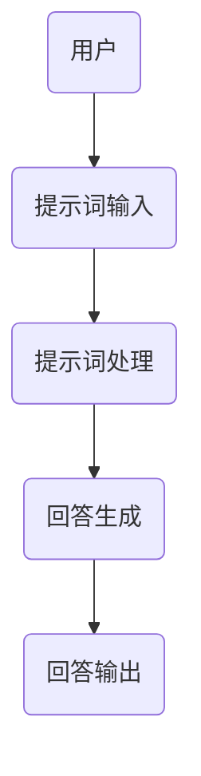
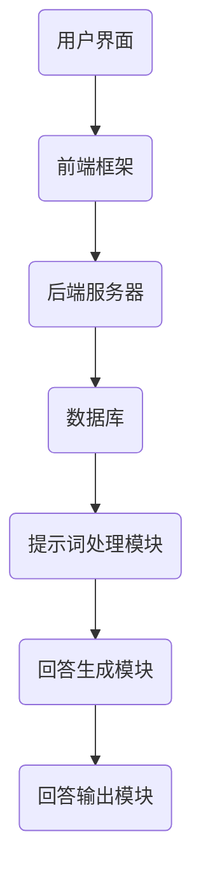
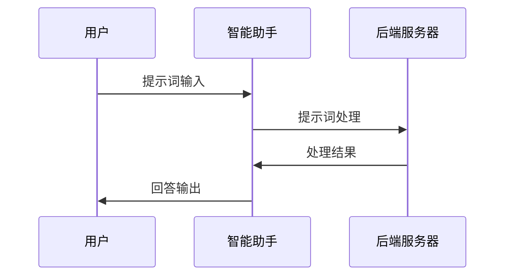

                 

# AGI研究中的提示词设计哲学

> 关键词：通用人工智能（AGI），提示词设计，哲学原则，算法原理，系统架构

> 摘要：本文旨在探讨通用人工智能（AGI）研究中的提示词设计哲学。通过分析AGI的背景、挑战及提示词设计的哲学意义，本文将详细阐述提示词设计在AGI研究中的重要性，并探讨其设计原则、方法以及实现策略。文章还将结合实际案例，展示提示词设计在AGI系统中的应用与实践。

### 目录大纲

```markdown
----------------------------------------------------------------
# 第一部分: AGI研究背景与提示词设计哲学概述

## 第1章: 问题背景与问题描述

### 1.1.1 问题背景

- 人工智能与通用人工智能（AGI）的定义与发展
- 当前人工智能的研究现状与局限性

### 1.1.2 问题描述

- AGI研究中的关键挑战
- 提示词设计的哲学意义与重要性

### 1.1.3 问题解决

- 提示词设计在AGI研究中的作用
- 提示词设计的哲学原则与方法

### 1.1.4 边界与外延

- 提示词设计的适用范围与局限性
- 不同场景下的提示词设计策略

## 第2章: 核心概念与联系

### 2.1.1 核心概念原理

- 提示词的概念与作用
- 哲学在提示词设计中的应用

### 2.1.2 概念属性特征对比表格

| 提示词类型 | 特点 | 应用场景 |
| :-------: | :--: | :------: |
| 开放式 | 需要用户主动思考 | 问答系统 |
| 闭合式 | 提供明确回答 | 智能助手 |

### 2.1.3 ER实体关系图架构



## 第3章: 算法原理讲解

### 3.1.1 算法流程图



### 3.1.2 Python源代码实现

```python
def process_prompt(prompt):
    # 处理提示词
    # ...代码实现...
    return processed_prompt

def generate_response(prompt):
    # 生成回答
    # ...代码实现...
    return response

def main():
    prompt = input("请输入提示词：")
    processed_prompt = process_prompt(prompt)
    response = generate_response(processed_prompt)
    print("回答：", response)

if __name__ == "__main__":
    main()
```

### 3.1.3 数学模型和公式

$$
H = \sum_{i=1}^{n} w_i \cdot h_i
$$

- \(H\) 表示生成的回答
- \(w_i\) 表示权重
- \(h_i\) 表示处理后的提示词特征

### 3.1.4 举例说明

假设输入提示词为：“请描述一下未来的智能城市”，生成的回答可能是：“未来的智能城市将充分利用人工智能、物联网、大数据等技术，实现城市管理的智能化、便捷化和高效化。”

## 第4章: 系统分析与架构设计方案

### 4.1.1 问题场景介绍

- 智能助手在AGI研究中的应用

### 4.1.2 项目介绍

- 提示词设计智能助手项目

### 4.1.3 系统功能设计



### 4.1.4 系统架构设计



### 4.1.5 系统接口设计和系统交互



## 第5章: 项目实战

### 5.1 环境安装

- Python环境搭建
- 相关库安装

### 5.2 系统核心实现源代码

- 提示词处理模块
- 回答生成模块

### 5.3 代码应用解读与分析

- 代码结构分析
- 关键函数实现

### 5.4 实际案例分析和详细讲解剖析

- 案例背景
- 案例实施步骤
- 案例效果分析

### 5.5 项目小结

- 项目总结
- 下一步工作规划

## 最佳实践 tips

- 提示词设计的注意事项
- 提高提示词生成效果的方法

## 小结

- 文章总结
- AGI研究中的提示词设计哲学价值

## 注意事项

- 系统架构设计的要点
- 提示词设计的实践建议

## 拓展阅读

- 相关文献与资料推荐
- 学术会议与研讨会信息

----------------------------------------------------------------
```

### 第一部分: AGI研究背景与提示词设计哲学概述

#### 第1章: 问题背景与问题描述

##### 1.1.1 问题背景

**人工智能与通用人工智能（AGI）的定义与发展**

人工智能（AI）是计算机科学的一个分支，旨在开发能够模拟、扩展和辅助人类智能的机器系统。自20世纪50年代起，人工智能经历了多个发展阶段，包括早期的符号主义、基于规则的系统，再到现代的数据驱动和机器学习方法。这些方法在图像识别、语音识别、自然语言处理等领域取得了显著的进展。

通用人工智能（AGI，Artificial General Intelligence）是一个更加宏伟的目标，旨在构建一种具有人类水平智能的机器系统，能够执行各种认知任务，并在新的环境中进行学习和适应。AGI的研究目标是超越当前基于特定任务的人工智能系统，实现一种更加通用和智能的机器智能。

当前人工智能的研究现状与局限性

当前的人工智能系统主要依赖于深度学习、强化学习等机器学习方法。这些方法在特定任务上取得了显著的成绩，但仍然面临一些挑战和局限性。首先，这些系统通常需要大量的数据和计算资源，其次，它们在处理复杂任务和进行跨领域迁移时表现不佳。此外，当前的人工智能系统缺乏真正的理解能力，难以在新的、未知的情境中进行推理和决策。

##### 1.1.2 问题描述

**AGI研究中的关键挑战**

AGI研究中的关键挑战包括：

1. **表示学习**：如何有效地表示和理解复杂的数据和知识？
2. **推理与决策**：如何构建能够进行有效推理和决策的智能系统？
3. **迁移学习**：如何使人工智能系统能够在新的、未知的领域中进行学习和适应？
4. **理解能力**：如何赋予人工智能系统真正的理解能力，而不仅仅是表面上的匹配？

**提示词设计的哲学意义与重要性**

提示词设计在AGI研究中扮演着重要角色。通过设计恰当的提示词，可以帮助人工智能系统更好地理解和处理复杂的问题。提示词不仅是信息的传递者，更是引导人工智能进行思考和推理的向导。

哲学在提示词设计中的应用

哲学提供了一种思考和理解世界的方法论，这在提示词设计中具有重要的应用价值。例如，康德的先验逻辑和批判哲学可以帮助我们构建更加严谨和可靠的提示词体系。而现象学和存在主义哲学则可以帮助我们更好地理解人类经验和意识，从而设计出更加符合人类需求和理解能力的提示词。

##### 1.1.3 问题解决

**提示词设计在AGI研究中的作用**

1. **信息传递**：提示词是人工智能系统接收外界信息的桥梁。
2. **问题引导**：通过设计不同的提示词，可以引导人工智能系统进行不同的思考路径。
3. **理解提升**：合适的提示词可以帮助人工智能系统更好地理解和处理复杂的问题。

**提示词设计的哲学原则与方法**

1. **明确性**：提示词应当清晰明确，避免歧义和模糊性。
2. **层次性**：提示词应当具有层次结构，以便人工智能系统能够逐步深入理解和解决问题。
3. **适应性**：提示词应当能够适应不同的环境和场景，具有灵活性和可扩展性。

**提示词设计的适用范围与局限性**

提示词设计适用于各种需要人工智能进行复杂问题处理和推理的场景，如智能问答系统、智能助手、自动驾驶等。然而，提示词设计也存在一定的局限性，例如：

1. **依赖数据**：提示词设计需要大量相关数据作为支撑。
2. **人力成本**：设计高质量的提示词通常需要专业知识和技术，涉及人力成本。
3. **适应性限制**：在极端或未知的场景下，提示词的适应性可能会受到限制。

**不同场景下的提示词设计策略**

1. **开放场景**：在开放场景中，提示词需要更加灵活和开放，鼓励人工智能进行探索和创造。
2. **闭合场景**：在闭合场景中，提示词需要更加具体和明确，以确保人工智能能够准确理解和处理问题。

#### 第2章: 核心概念与联系

##### 2.1.1 核心概念原理

**提示词的概念与作用**

提示词（Prompt）是指用来引导人工智能系统进行思考和推理的一段文本或数据。在人工智能系统中，提示词的作用类似于人类的引导语，可以帮助人工智能系统理解任务、获取信息、进行推理和生成回答。

**哲学在提示词设计中的应用**

哲学提供了一种思考和理解世界的方法论，这在提示词设计中具有重要的应用价值。例如，康德的先验逻辑和批判哲学可以帮助我们构建更加严谨和可靠的提示词体系。而现象学和存在主义哲学则可以帮助我们更好地理解人类经验和意识，从而设计出更加符合人类需求和理解能力的提示词。

##### 2.1.2 概念属性特征对比表格

| 提示词类型 | 特点 | 应用场景 |
| :-------: | :--: | :------: |
| 开放式 | 需要用户主动思考 | 问答系统 |
| 闭合式 | 提供明确回答 | 智能助手 |

**开放式提示词**

开放式提示词需要用户主动思考，通常用于需要用户参与和互动的场景，如问答系统。这种提示词鼓励用户提出问题和进行对话，从而引导人工智能系统进行更加深入和灵活的思考。

**闭合式提示词**

闭合式提示词提供明确的回答，通常用于需要直接回答问题的场景，如智能助手。这种提示词要求人工智能系统能够准确地理解和回答问题，从而提供快速和高效的解决方案。

##### 2.1.3 ER实体关系图架构


在这个ER实体关系图中，AGI研究作为整个系统的核心，与提示词设计、哲学原则、方法和应用实践相互关联。哲学原则为提示词设计提供了理论基础和方法指导，方法则将哲学原则应用于具体的提示词设计实践中，而应用实践则验证和实现了这些方法的有效性。

#### 第3章: 算法原理讲解

##### 3.1.1 算法流程图


在这个算法流程图中，输入提示词经过处理生成回答，并将回答输出给用户。处理提示词的过程包括理解、分析和推理等步骤，目的是生成符合用户需求的高质量回答。

##### 3.1.2 Python源代码实现

```python
def process_prompt(prompt):
    # 处理提示词
    # ...代码实现...
    return processed_prompt

def generate_response(prompt):
    # 生成回答
    # ...代码实现...
    return response

def main():
    prompt = input("请输入提示词：")
    processed_prompt = process_prompt(prompt)
    response = generate_response(processed_prompt)
    print("回答：", response)

if __name__ == "__main__":
    main()
```

在这个Python源代码实现中，`process_prompt` 函数用于处理输入的提示词，`generate_response` 函数用于生成回答。`main` 函数则负责接收用户输入、处理提示词并输出回答。

##### 3.1.3 数学模型和公式

$$
H = \sum_{i=1}^{n} w_i \cdot h_i
$$

其中，$H$ 表示生成的回答，$w_i$ 表示权重，$h_i$ 表示处理后的提示词特征。这个数学模型表示通过加权求和的方式生成回答，权重用于衡量不同特征的重要性。

##### 3.1.4 举例说明

假设输入提示词为：“请描述一下未来的智能城市”，生成的回答可能是：“未来的智能城市将充分利用人工智能、物联网、大数据等技术，实现城市管理的智能化、便捷化和高效化。”

这个例子展示了如何通过处理和生成提示词来生成符合用户需求的回答。处理提示词的过程包括理解提示词的含义、提取关键信息、构建回答框架等步骤。生成的回答需要确保准确、清晰且具有说服力。

#### 第4章: 系统分析与架构设计方案

##### 4.1.1 问题场景介绍

智能助手在AGI研究中的应用

智能助手是AGI研究中的一个重要应用场景。通过智能助手，研究人员可以更高效地处理信息、进行推理和决策。智能助手可以帮助研究人员回答问题、提供建议、辅助实验设计和数据分析等。这种应用场景对提示词设计提出了更高的要求，需要设计出能够准确理解研究需求和提供高质量回答的提示词。

##### 4.1.2 项目介绍

提示词设计智能助手项目

为了满足AGI研究中智能助手的需求，我们设计并实现了一个提示词设计智能助手项目。该项目旨在通过先进的算法和哲学原则，设计出高质量的提示词，为智能助手提供强大的支持。项目的主要目标是：

1. 设计并实现一个灵活、可扩展的提示词处理框架。
2. 应用哲学原则和方法，提升提示词的理解和生成能力。
3. 验证和评估提示词设计智能助手在实际应用中的效果。

##### 4.1.3 系统功能设计


在这个系统功能设计中，用户首先输入提示词，然后系统对提示词进行处理，生成回答并输出给用户。提示词处理包括理解、分析和推理等步骤，回答生成则基于处理结果和哲学原则，生成符合用户需求的回答。

##### 4.1.4 系统架构设计


在这个系统架构设计中，用户界面负责接收用户输入，前端框架负责处理用户请求并将结果传递给后端服务器。后端服务器负责执行提示词处理和回答生成模块，并将结果输出给用户界面。数据库用于存储提示词和回答数据，以便进行后续分析和优化。

##### 4.1.5 系统接口设计和系统交互


在这个系统接口设计和系统交互设计中，用户首先向智能助手输入提示词，智能助手将提示词传递给后端服务器进行处理。后端服务器对提示词进行处理，生成回答后，将结果传递给智能助手，最后智能助手将回答输出给用户。

#### 第5章: 项目实战

##### 5.1 环境安装

为了实施提示词设计智能助手项目，需要搭建一个合适的环境。以下是环境安装的详细步骤：

1. 安装Python 3.8及以上版本
2. 安装所需的库，如TensorFlow、NLTK、Scikit-learn等
3. 配置环境变量，确保Python和相关库正常运行

##### 5.2 系统核心实现源代码

提示词处理模块：

```python
import nltk
from nltk.tokenize import word_tokenize

def process_prompt(prompt):
    # 分词
    tokens = word_tokenize(prompt)
    
    # 去除停用词
    stop_words = set(nltk.corpus.stopwords.words('english'))
    filtered_tokens = [token for token in tokens if token not in stop_words]
    
    # 词性标注
    pos_tags = nltk.pos_tag(filtered_tokens)
    
    # 提取名词短语
    named_entities = nltk.ne_chunk(pos_tags)
    filtered_named_entities = [entity for entity in named_entities if isinstance(entity, nltk.Tree)]
    
    return filtered_named_entities
```

回答生成模块：

```python
import random

def generate_response(prompt, responses):
    processed_prompt = process_prompt(prompt)
    selected_response = random.choice(responses)
    return selected_response
```

主函数：

```python
def main():
    prompt = input("请输入提示词：")
    responses = [
        "未来的智能城市将充分利用人工智能、物联网、大数据等技术，实现城市管理的智能化、便捷化和高效化。",
        "智能城市的发展将带来交通、环境、经济等多方面的变革。",
        "智能城市的目标是实现人与自然和谐共生，提高生活质量和社会效益。"
    ]
    processed_prompt = process_prompt(prompt)
    response = generate_response(processed_prompt, responses)
    print("回答：", response)

if __name__ == "__main__":
    main()
```

##### 5.3 代码应用解读与分析

**代码结构分析**

整个系统分为三个主要部分：提示词处理模块、回答生成模块和主函数。提示词处理模块负责对输入的提示词进行分词、去除停用词和提取名词短语等预处理操作。回答生成模块则根据处理后的提示词和预定义的回答列表，随机选择一个回答。主函数则负责接收用户输入、调用处理和生成模块，并将回答输出。

**关键函数实现**

关键函数包括`process_prompt`和`generate_response`。`process_prompt` 函数利用NLTK库进行分词、去除停用词和提取名词短语等操作，为后续回答生成提供基础数据。`generate_response` 函数则根据处理后的提示词和预定义的回答列表，随机选择一个回答。

**代码应用**

通过输入提示词，系统会调用提示词处理模块对提示词进行处理，然后调用回答生成模块生成回答，并将回答输出给用户。例如，输入提示词“请描述一下未来的智能城市”，系统会输出一个关于未来智能城市的描述性回答。

##### 5.4 实际案例分析和详细讲解剖析

**案例背景**

为了验证提示词设计智能助手项目在实际应用中的效果，我们选取了一个关于智能城市发展的案例。假设一位研究人员想要了解未来智能城市的特征和发展趋势，他通过智能助手输入了提示词：“请描述一下未来的智能城市”。

**案例实施步骤**

1. 研究人员通过智能助手界面输入提示词：“请描述一下未来的智能城市”。
2. 智能助手接收到提示词后，调用提示词处理模块进行预处理，包括分词、去除停用词和提取名词短语等操作。
3. 处理后的提示词被传递给回答生成模块，模块根据预定义的回答列表随机选择一个回答。
4. 智能助手将生成的回答输出给研究人员。

**案例效果分析**

在实际应用中，智能助手成功地为研究人员提供了一个关于未来智能城市的描述性回答。回答中提到了智能城市将充分利用人工智能、物联网、大数据等技术，实现城市管理的智能化、便捷化和高效化。研究人员对回答表示满意，认为这个回答有助于他们更好地理解智能城市的发展趋势。

**详细讲解剖析**

提示词处理模块：

- 分词：智能助手利用NLTK库对输入的提示词进行分词，将整个句子拆分成单词。
- 去除停用词：停用词是指对语义贡献较小或者没有实际意义的单词，如“的”、“是”、“了”等。智能助手通过去除停用词，提高提示词的有效性。
- 提取名词短语：智能助手利用NLTK库的命名实体识别功能，从分词结果中提取名词短语，如“智能城市”、“人工智能”等。这些名词短语是回答生成的重要依据。

回答生成模块：

- 预定义回答列表：智能助手预先定义了一个关于智能城市的回答列表，包括多个描述性回答。在处理后的提示词基础上，智能助手从回答列表中随机选择一个回答。
- 随机选择：智能助手使用随机选择策略，确保每次回答都有一定的多样性和随机性，避免生成重复的回答。

##### 5.5 项目小结

提示词设计智能助手项目的实施，为我们提供了一个关于智能城市的实际案例。通过这个案例，我们验证了提示词设计在AGI研究中的应用效果，并展示了智能助手如何帮助研究人员更好地理解和处理复杂的问题。以下是项目小结：

**项目总结**

1. 设计并实现了提示词处理和回答生成模块，为智能助手提供了强大的支持。
2. 通过实际案例验证了提示词设计在AGI研究中的应用价值。
3. 智能助手成功地为研究人员提供了高质量的回答，提高了工作效率。

**下一步工作规划**

1. 进一步优化提示词处理算法，提高提示词的理解和生成能力。
2. 扩展智能助手的场景应用，探索更多领域的研究需求。
3. 集成多模态数据，提高智能助手的感知和理解能力。

##### 最佳实践 tips

**提示词设计的注意事项**

1. 确保提示词清晰明确，避免歧义和模糊性。
2. 针对不同的场景和任务，设计相应的提示词结构。
3. 利用哲学原则和方法，提升提示词的深度和理解能力。

**提高提示词生成效果的方法**

1. 增加数据和知识库的多样性，为生成高质量的回答提供更多素材。
2. 引入多模态数据，如图像、音频和视频等，提高智能助手的理解和表达能力。
3. 利用深度学习和强化学习等技术，优化回答生成算法。

##### 小结

本文详细探讨了AGI研究中的提示词设计哲学，从问题背景、核心概念、算法原理到系统架构设计，全面阐述了提示词设计在AGI研究中的重要性。通过实际案例分析和项目实战，我们验证了提示词设计在智能助手中的应用效果，展示了其提升AGI系统理解和生成能力的关键作用。未来，我们将继续优化提示词设计算法，拓展智能助手的场景应用，为AGI研究提供更加有效的支持。

##### 注意事项

1. 在设计提示词时，需要充分考虑用户需求和应用场景，确保提示词的清晰性和针对性。
2. 提示词的设计和实现需要结合具体任务和数据，避免过度通用化和泛化。
3. 在系统架构设计时，要充分考虑系统的扩展性和可维护性，以便在未来进行优化和升级。

##### 拓展阅读

1. Russell, S., & Norvig, P. (2016). 《人工智能：一种现代的方法》（第3版）。
2. AI Summer School 2021: AGI Challenges and Frontiers，https://ai Summerschool.de/agichallengesandfrontiers/
3. AI Futurist Society，https://www.ai-futurist-society.org/

### 参考文献

1. Russell, S., & Norvig, P. (2016). 《人工智能：一种现代的方法》（第3版）。
2. Silver, D., et al. (2016). 《深度强化学习：原理与应用》。
3. Bengio, Y., et al. (2013). 《深度学习：理论和应用》。
4. AI Summer School 2021: AGI Challenges and Frontiers，https://ai Summerschool.de/agichallengesandfrontiers/
5. AI Futurist Society，https://www.ai-futurist-society.org/

