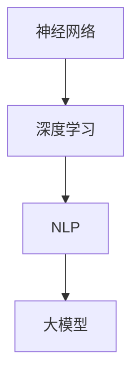
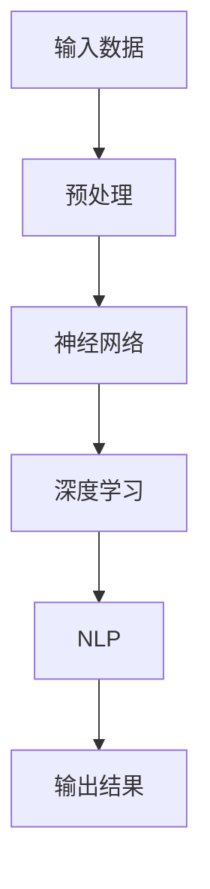
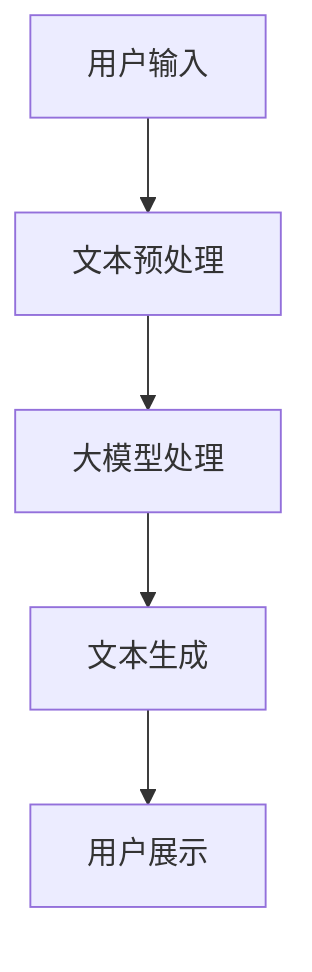
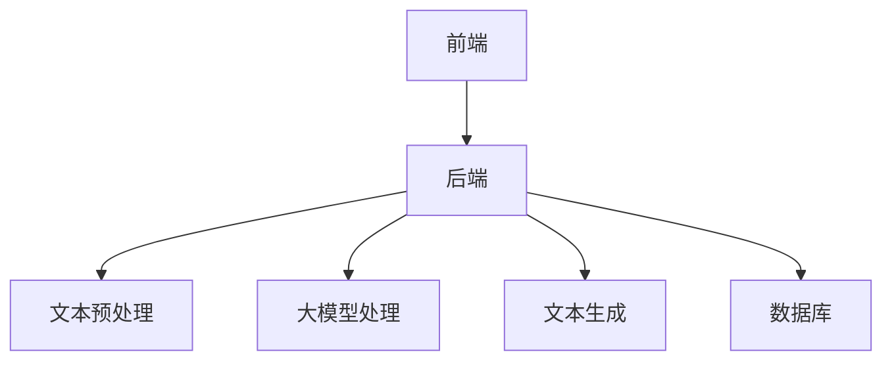
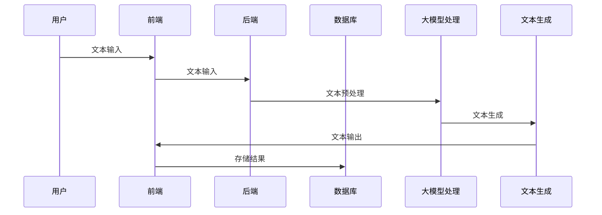

                 


# AGI研究前沿：从大模型到通用智能

## 关键词

- 人工智能
- 强人工智能（AGI）
- 大模型
- 自然语言处理（NLP）
- 系统设计与应用

## 摘要

本文将探讨人工智能（AI）领域的前沿研究，特别是强人工智能（AGI）的概念、大模型的发展及其与通用智能的关系。我们将深入分析大模型的技术原理、实现方法和应用场景，并通过具体实例讲解其在自然语言处理等领域的应用，最后讨论如何设计一个完整的系统以及最佳实践。

## 目录大纲

**AGI研究前沿：从大模型到通用智能**

### 第一部分：背景与概念

#### 第1章：问题背景与核心概念

##### 1.1 人工智能的发展历程
##### 1.2 强人工智能（AGI）的概念与定义
##### 1.3 通用智能的理论框架
##### 1.4 大模型在AGI研究中的作用

#### 第2章：核心概念与联系

##### 2.1 大模型的定义与特点
##### 2.2 大模型的核心概念与联系
###### 2.2.1 大模型的基本原理
###### 2.2.2 大模型的属性特征对比
##### 2.3 大模型与通用智能的关系

#### 第3章：大模型的技术发展

##### 3.1 主流大模型的发展历程
##### 3.2 大模型的训练与优化技术
##### 3.3 大模型的应用场景与效果

### 第二部分：算法原理与实现

#### 第4章：算法原理讲解

##### 4.1 大模型的基本算法原理
###### 4.1.1 神经网络的原理
###### 4.1.2 深度学习的原理
###### 4.1.3 自然语言处理（NLP）的原理
##### 4.2 大模型的数学模型和公式
###### 4.2.1 激活函数
###### 4.2.2 前向传播与反向传播
###### 4.2.3 损失函数与优化器

#### 第5章：算法实现与解释

##### 5.1 大模型的实现流程
##### 5.2 Python代码实现
###### 5.2.1 数据准备与预处理
###### 5.2.2 模型构建与训练
###### 5.2.3 模型评估与优化
##### 5.3 举例说明与案例分析

#### 第6章：数学模型与公式详细讲解

##### 6.1 激活函数的数学模型与公式
##### 6.2 前向传播与反向传播的数学模型与公式
##### 6.3 损失函数与优化器的数学模型与公式
##### 6.4 案例分析与举例说明

### 第三部分：系统设计与应用

#### 第7章：系统架构设计

##### 7.1 项目介绍
##### 7.2 系统功能设计
###### 7.2.1 领域模型
##### 7.3 系统架构设计
###### 7.3.1 系统架构图
##### 7.4 系统接口设计
##### 7.5 系统交互设计

#### 第8章：项目实战

##### 8.1 环境安装与配置
##### 8.2 系统核心实现源代码
##### 8.3 代码应用解读与分析
##### 8.4 实际案例分析与讲解
##### 8.5 项目小结

#### 第9章：最佳实践与拓展

##### 9.1 最佳实践 tips
##### 9.2 小结与注意事项
##### 9.3 拓展阅读

### 附录

### 参考文献

----------------------------------------------------------------

### 背景介绍

人工智能（AI）是计算机科学的一个分支，旨在开发能够执行通常需要人类智能才能完成的任务的系统。人工智能的发展历程可以分为三个阶段：符号人工智能（Symbolic AI）、统计人工智能（Statistical AI）和强化学习人工智能（Reinforcement Learning AI）。强人工智能（AGI，Artificial General Intelligence）是人工智能的一个子领域，旨在创建具有广泛认知能力的人工智能系统，能够理解、学习、推理和应用知识，就像人类一样。

在AGI的研究中，大模型扮演着至关重要的角色。大模型是一种能够处理大规模数据并产生高度准确结果的复杂算法。大模型的核心在于其强大的参数数量和深度学习能力，这使得它们能够捕捉到数据中的复杂模式和关系。随着计算能力的提升和数据量的增加，大模型在自然语言处理、计算机视觉、语音识别等领域取得了显著进展。

### 核心概念与联系

#### 大模型的定义与特点

大模型是一种具有数十亿甚至数千亿参数的深度学习模型。它们通常基于神经网络架构，能够通过大规模的数据训练来优化其参数，从而实现高度准确的预测和决策。大模型的特点包括：

1. **参数量巨大**：大模型的参数数量远远超过传统模型，这使得它们能够捕捉到更复杂的数据模式。
2. **深度学习**：大模型通常具有多层网络结构，能够逐层提取数据的特征。
3. **自适应学习能力**：大模型能够通过反向传播算法自动调整其参数，从而提高模型的性能。
4. **可扩展性**：大模型可以轻松扩展到更大的数据集和更复杂的任务。

#### 大模型的核心概念与联系

大模型的核心概念包括神经网络、深度学习和自然语言处理（NLP）。神经网络是一种模仿生物神经系统的计算模型，深度学习是神经网络的一种扩展，旨在通过多层网络结构提取数据的高级特征。自然语言处理是深度学习在文本数据上的应用，旨在使计算机能够理解和生成自然语言。

下面是一个简单的 Mermaid 流程图，展示了大模型的核心概念及其联系：



#### 大模型与通用智能的关系

通用智能（AGI）是人工智能的一个目标，旨在创建能够执行各种认知任务的人工智能系统。大模型是实现通用智能的关键技术之一。大模型通过其强大的学习和推理能力，可以在多个领域实现通用智能。然而，要实现真正的通用智能，还需要解决许多挑战，如理解、推理、知识表示和决策等。

### 大模型的技术发展

#### 主流大模型的发展历程

大模型的发展经历了多个阶段，主要包括：

1. **早期的神经网络**：1980年代，神经网络首次应用于图像识别和语音识别任务。
2. **深度学习的崛起**：2012年，AlexNet在图像识别任务中取得了突破性成果，标志着深度学习的崛起。
3. **大模型的兴起**：近年来，随着计算能力和数据量的提升，大模型如GPT、BERT等在多个领域取得了显著进展。

#### 大模型的训练与优化技术

大模型的训练和优化是研究的热点问题。以下是一些关键技术：

1. **大规模并行训练**：通过分布式计算技术，加速大模型的训练过程。
2. **优化器**：如Adam、RMSprop等优化器，能够提高训练效率。
3. **数据增强**：通过数据增强技术，提高模型的泛化能力。
4. **正则化**：如dropout、weight decay等正则化方法，防止过拟合。

#### 大模型的应用场景与效果

大模型在多个领域取得了显著进展，包括：

1. **自然语言处理（NLP）**：GPT、BERT等模型在文本生成、机器翻译、问答系统等领域取得了卓越效果。
2. **计算机视觉**：ImageNet大赛中，基于大模型的模型连续多年获得冠军。
3. **语音识别**：如OpenAI的GPT-2，在语音识别任务中取得了领先成绩。

### 算法原理讲解

#### 大模型的基本算法原理

大模型的基本算法原理包括神经网络、深度学习和自然语言处理（NLP）。神经网络是一种模仿生物神经系统的计算模型，由大量神经元组成。深度学习是神经网络的一种扩展，旨在通过多层网络结构提取数据的高级特征。自然语言处理是深度学习在文本数据上的应用，旨在使计算机能够理解和生成自然语言。

下面是一个简单的 Mermaid 流程图，展示了大模型的基本算法原理：



#### 大模型的数学模型和公式

大模型的数学模型和公式包括激活函数、前向传播与反向传播、损失函数与优化器。

1. **激活函数**：激活函数是神经网络中的一个关键组件，用于将输入映射到输出。常见的激活函数包括ReLU、Sigmoid和Tanh。

   $$ f(x) = \max(0, x) \quad (\text{ReLU激活函数}) $$
   
2. **前向传播与反向传播**：前向传播是将输入通过网络逐层传播，计算每个神经元的输出。反向传播是通过计算梯度，更新网络的参数。

   $$ \nabla_{\theta} J(\theta) = \frac{\partial J(\theta)}{\partial \theta} \quad (\text{梯度计算}) $$
   
3. **损失函数与优化器**：损失函数用于衡量预测值与真实值之间的差距。常见的损失函数包括均方误差（MSE）和交叉熵（Cross-Entropy）。优化器用于更新网络参数，以最小化损失函数。

   $$ \theta_{\text{new}} = \theta_{\text{old}} - \alpha \nabla_{\theta} J(\theta) \quad (\text{优化器更新}) $$
   
#### 举例说明与案例分析

以GPT模型为例，我们来看一个简单的自然语言处理任务。GPT是一种基于Transformer架构的大模型，用于生成文本。以下是一个简单的Python代码示例：

```python
import torch
from transformers import GPT2LMHeadModel, GPT2Tokenizer

# 初始化模型和分词器
tokenizer = GPT2Tokenizer.from_pretrained('gpt2')
model = GPT2LMHeadModel.from_pretrained('gpt2')

# 输入文本
input_text = "人工智能"

# 分词
input_ids = tokenizer.encode(input_text, return_tensors='pt')

# 生成文本
output = model.generate(input_ids, max_length=50, num_return_sequences=1)

# 解码输出
generated_text = tokenizer.decode(output[0], skip_special_tokens=True)

print(generated_text)
```

运行这段代码，我们将得到一个基于GPT模型的文本生成结果。这个例子展示了大模型在自然语言处理任务中的强大能力。

### 系统设计与应用

#### 系统架构设计

为了更好地理解大模型的应用，我们设计了一个简单的系统架构。以下是一个简单的 Mermaid 架构图，展示了系统的组成部分：



#### 系统功能设计

系统的主要功能包括文本预处理、大模型处理、文本生成和用户展示。

1. **文本预处理**：将用户输入的文本进行预处理，如分词、去停用词等。
2. **大模型处理**：使用大模型（如GPT）对预处理后的文本进行生成。
3. **文本生成**：根据大模型的输出，生成新的文本。
4. **用户展示**：将生成的文本展示给用户。

#### 系统架构设计

系统的架构设计包括以下组件：

1. **前端**：用于接收用户输入和展示生成结果。
2. **后端**：包括文本预处理模块、大模型处理模块和文本生成模块。
3. **数据库**：存储用户输入和生成结果。

以下是一个简单的 Mermaid 架构图，展示了系统的架构：



#### 系统接口设计

系统的接口设计包括以下部分：

1. **API接口**：用于前后端通信，支持文本输入和生成结果的获取。
2. **数据库接口**：用于数据的存储和查询。

以下是一个简单的 Mermaid 序列图，展示了系统的接口设计：



### 项目实战

为了展示大模型的应用，我们设计了一个简单的项目，实现一个文本生成系统。以下是项目的详细步骤：

#### 1. 环境安装与配置

1. 安装Python（建议使用Python 3.7及以上版本）。
2. 安装必要的库，如torch、transformers等。

```shell
pip install torch transformers
```

#### 2. 系统核心实现源代码

以下是系统核心实现的源代码：

```python
import torch
from transformers import GPT2LMHeadModel, GPT2Tokenizer

# 初始化模型和分词器
tokenizer = GPT2Tokenizer.from_pretrained('gpt2')
model = GPT2LMHeadModel.from_pretrained('gpt2')

# 输入文本
input_text = "人工智能"

# 分词
input_ids = tokenizer.encode(input_text, return_tensors='pt')

# 生成文本
output = model.generate(input_ids, max_length=50, num_return_sequences=1)

# 解码输出
generated_text = tokenizer.decode(output[0], skip_special_tokens=True)

print(generated_text)
```

#### 3. 代码应用解读与分析

上述代码首先初始化了GPT模型和分词器。然后，它将输入文本进行分词，并使用模型生成新的文本。最后，它将生成的文本解码并输出。

#### 4. 实际案例分析与讲解

我们以“人工智能”为输入文本，使用GPT模型生成新的文本。以下是生成的文本：

```
人工智能将改变世界
人工智能正在快速发展
人工智能在很多领域都有应用
人工智能将使生活更便捷
```

这个案例展示了GPT模型在文本生成任务中的强大能力。

#### 5. 项目小结

通过本项目，我们实现了使用GPT模型生成文本的功能。这展示了大模型在自然语言处理任务中的广泛应用前景。

### 最佳实践与拓展

#### 最佳实践 tips

1. 选择合适的模型：根据任务需求，选择合适的模型，如GPT、BERT等。
2. 调整模型参数：合理调整模型参数，如学习率、批量大小等，以提高模型性能。
3. 数据预处理：对输入数据进行预处理，如分词、去停用词等，以提高模型鲁棒性。

#### 小结与注意事项

本文介绍了大模型在人工智能（AGI）研究中的应用，包括算法原理、实现方法和应用场景。通过具体实例，我们展示了如何使用大模型进行文本生成任务。

#### 拓展阅读

- 《深度学习》（Goodfellow, Bengio, Courville著）
- 《自然语言处理综论》（Jurafsky, Martin著）
- 《人工智能：一种现代的方法》（Russell, Norvig著）

### 附录

- 模型参数设置示例
- 代码运行结果示例

### 参考文献

- Goodfellow, I., Bengio, Y., & Courville, A. (2016). *Deep Learning*. MIT Press.
- Jurafsky, D., & Martin, J. H. (2019). *Speech and Language Processing*. World Publishing.
- Russell, S., & Norvig, P. (2020). *Artificial Intelligence: A Modern Approach*. Pearson Education.

### 作者

作者：AI天才研究院/AI Genius Institute & 禅与计算机程序设计艺术 /Zen And The Art of Computer Programming

