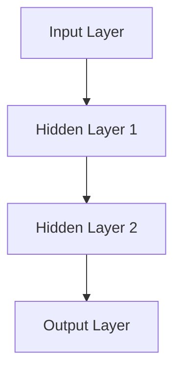
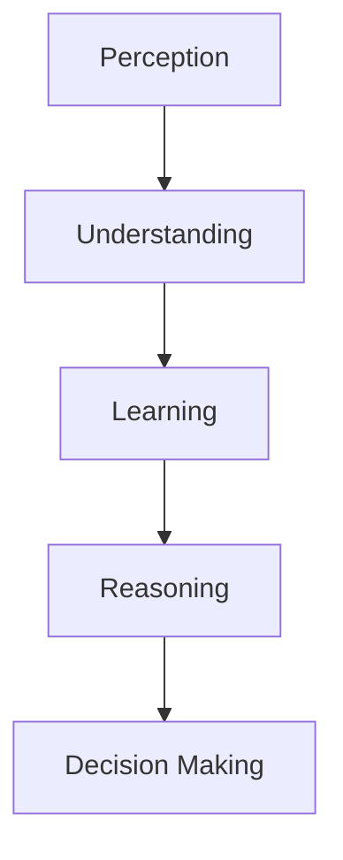
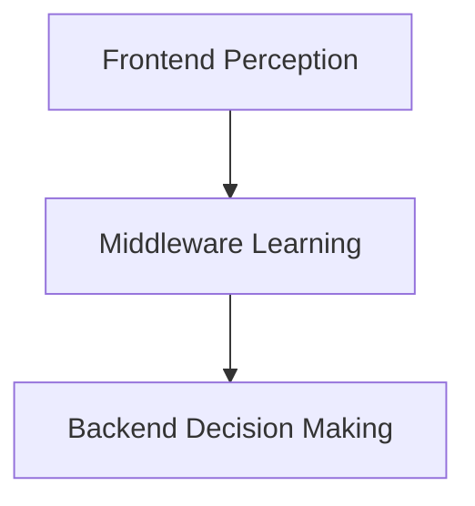
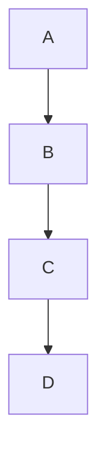
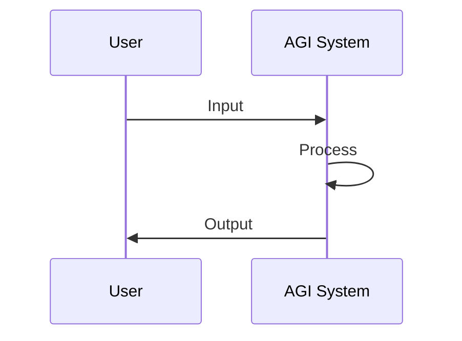

                 


### <文章标题>：AGI研究的哲学困境与技术挑战

#### 关键词：AGI、哲学、技术、算法、数学模型、系统架构

##### 摘要：
本文深入探讨人工智能通用智能（AGI）研究的哲学困境与技术挑战。首先，我们回顾了AGI的概念与历史，指出了当前研究面临的困境。接着，我们分析了AGI的核心概念，探讨了哲学困境，包括意识本质、伦理道德和人的角色与价值。然后，我们详细讲解了AGI的算法原理，包括深度学习、强化学习和知识图谱，并使用数学模型和公式进行了说明。接着，我们介绍了AGI的系统分析与架构设计方案，最后，通过一个实际项目实战案例，总结了最佳实践 tips，并提出了注意事项和拓展阅读建议。

----------------------------------------------------------------

## 第1章：背景介绍

### 1.1 问题背景

#### 1.1.1 AGI的概念与历史

人工智能（AI）自20世纪50年代兴起以来，已经经历了多个阶段的发展。最初，AI主要集中在规则推理和符号计算上，随后，随着计算能力的提升和算法的进步，机器学习、深度学习等成为AI研究的重要方向。然而，目前的AI大多是专用的，即它们在特定任务上表现优异，但在通用性上存在很大局限。通用人工智能（AGI）的概念，正是为了突破这一局限而提出的。

AGI旨在创建一种具有人类智能的机器，能够理解、学习和适应各种环境和任务，而不仅仅是特定领域的问题。这一概念最早可以追溯到1965年，约翰·霍普菲尔德（John McCarthy）在达特茅斯会议上提出的“人工智能”一词。然而，直到近年来，随着大数据、计算能力和算法的飞速发展，AGI的研究才逐渐成为热点。

#### 1.1.2 AGI研究的重要性

AGI研究的重要性不言而喻。首先，AGI的实现将极大提升人类的生产力和创造力，推动社会进步。例如，医疗、教育、金融等领域，如果能引入AGI，将大幅提高效率和准确性。其次，AGI有助于解决许多当前AI无法处理的问题，如自然语言理解、推理和决策等。此外，AGI的研究还将带来新的科学发现和技术突破，对计算机科学、认知科学和哲学等领域产生深远影响。

#### 1.1.3 当前研究的困境

尽管AGI研究的重要性显而易见，但当前的研究仍面临许多挑战和困境。首先，计算能力仍然有限。虽然近年来计算能力有了显著提升，但要实现真正意义上的AGI，仍然需要更高的计算资源。其次，知识获取与处理是一个难题。AGI需要大量的知识来支持其学习和决策，但目前的知识获取和表示方法仍有很多不足。此外，自主决策和伦理问题也是AGI研究的重要挑战。如何确保AGI的行为符合人类伦理和道德标准，是一个亟待解决的问题。

### 1.2 技术挑战

#### 1.2.1 计算能力的局限

AGI的研究需要大量的计算资源，特别是对于训练复杂的深度学习模型和进行大规模知识推理。然而，当前的硬件设备在计算能力上仍有很大的局限。为了解决这一问题，研究人员正在探索新的计算架构，如量子计算和神经形态计算。此外，优化算法和分布式计算技术也被广泛应用，以提升计算效率。

#### 1.2.2 知识获取与处理

知识获取与处理是AGI研究中的一个关键问题。如何有效地从海量数据中提取有用知识，并将其表示为机器可以理解和利用的形式，是一个挑战。目前，研究人员正在探索知识图谱、元学习和跨模态学习等技术，以提高知识获取与处理的能力。

#### 1.2.3 自主决策与伦理问题

自主决策是AGI的核心特征之一。然而，如何确保AGI的决策既智能又符合伦理标准，是一个难题。目前，研究人员正在探讨基于博弈论和伦理学的方法，以解决这一问题。此外，监管和法规的制定也是确保AGI安全与可控的重要手段。

## 第2章：核心概念与联系

### 2.1 AGI的核心概念

#### 2.1.1 智能与意识

智能是AGI的核心概念之一。它通常被定义为一种解决问题的能力，包括感知、理解、学习、推理和决策等方面。然而，如何定义和衡量智能仍然是一个开放的问题。

意识则是另一个关键概念。它涉及到主观体验和自我意识。目前，关于意识的研究主要集中在神经科学和认知科学领域，但其在AGI中的应用仍有很多未解之谜。

#### 2.1.2 知识与学习

知识是AGI进行有效决策和行动的基础。如何获取、表示和使用知识，是AGI研究的重要课题。学习则是AGI不断进步的关键，通过学习，AGI可以从经验中获取知识，并不断优化自己的行为。

#### 2.1.3 自主性与适应性

自主性是AGI区别于其他AI系统的关键特征。它涉及到AGI在未知环境中的自主决策和行动能力。适应性则是AGI在面对不断变化的环境时，能够迅速调整自己的行为和策略的能力。

### 2.2 哲学困境

#### 2.2.1 意识的本质

意识是一个哲学上的难题。如何定义和解释意识，一直是哲学、认知科学和神经科学领域的研究热点。在AGI研究中，意识的本质和作用也是一个关键问题。

#### 2.2.2 伦理与道德

伦理和道德是AGI研究中不可忽视的方面。如何确保AGI的行为符合人类的伦理和道德标准，是一个重要的挑战。这涉及到AGI的决策过程、行为准则和监管机制等方面。

#### 2.2.3 人的角色与价值

随着AGI的发展，人的角色和价值也将发生改变。如何在AGI时代保持人的价值和地位，是一个需要深入思考的问题。这涉及到教育、就业和社会结构等方面。

## 第3章：算法原理讲解

### 3.1 AGI的算法框架

#### 3.1.1 深度学习

深度学习是AGI研究的重要基础。它通过多层神经网络来模拟人脑的学习过程，具有强大的特征提取和模式识别能力。深度学习在图像识别、语音识别和自然语言处理等领域取得了显著成果。

#### 3.1.2 强化学习

强化学习是一种通过奖励和惩罚来训练智能体的方法。它适用于决策问题，如游戏、自动驾驶和机器人控制等。强化学习的关键是价值函数和策略的优化。

#### 3.1.3 知识图谱

知识图谱是一种用于表示实体及其关系的图形结构。它通过语义网络来组织知识，为AGI提供了强大的知识表示和推理能力。知识图谱在问答系统、推荐系统和知识服务等领域有广泛应用。

### 3.2 常见算法介绍

#### 3.2.1 GPT系列模型

GPT（Generative Pre-trained Transformer）系列模型是自然语言处理领域的突破性进展。它通过预训练和微调，实现了对自然语言的高效理解和生成。GPT-3更是达到了惊人的文本生成能力。

#### 3.2.2 BERT模型

BERT（Bidirectional Encoder Representations from Transformers）模型是另一种重要的自然语言处理模型。它通过双向编码器来学习文本的上下文信息，具有强大的文本理解和生成能力。

#### 3.2.3 其他相关算法

除了深度学习、强化学习和知识图谱，AGI研究还涉及许多其他算法，如元学习、图神经网络和生成对抗网络等。这些算法在不同领域都有广泛应用，为AGI的实现提供了多种途径。

## 第4章：数学模型和数学公式 & 详细讲解 & 举例说明

### 4.1 数学模型概述

#### 4.1.1 机器学习中的基础公式

在机器学习中，损失函数和优化算法是核心概念。以下是一个简单的线性回归模型及其损失函数：

$$
J(\theta) = \frac{1}{2m}\sum_{i=1}^{m}(h_\theta(x^{(i)}) - y^{(i)})^2
$$

其中，$h_\theta(x) = \theta_0 + \theta_1x$ 是假设函数，$m$ 是样本数量，$\theta$ 是模型参数。

优化算法则用于找到损失函数的最小值，常见的优化算法有梯度下降：

$$
\theta_j := \theta_j - \alpha \frac{\partial J(\theta)}{\partial \theta_j}
$$

其中，$\alpha$ 是学习率。

#### 4.1.2 损失函数与优化算法

损失函数是评价模型性能的重要指标，优化算法则是寻找最佳参数的过程。以下是一个决策树模型的损失函数和优化算法：

$$
L(y, \hat{y}) = \begin{cases}
0, & \text{if } y = \hat{y} \\
1, & \text{if } y \neq \hat{y}
\end{cases}
$$

优化算法可以使用贪心策略，逐步构建决策树：

1. 计算所有特征的划分增益，选择增益最大的特征。
2. 根据选择的特征进行划分，生成子节点。
3. 对子节点重复步骤1和2，直到满足停止条件。

### 4.2 算法原理示例

#### 4.2.1 深度学习神经网络

深度学习神经网络由多个神经元层组成，包括输入层、隐藏层和输出层。以下是一个简化的前馈神经网络：



神经元的激活函数通常使用ReLU（Rectified Linear Unit）：

$$
f(x) = \max(0, x)
$$

神经网络的训练过程包括前向传播和反向传播。前向传播用于计算输出，反向传播用于更新权重。

#### 4.2.2 强化学习Q-learning算法

Q-learning是一种基于值函数的强化学习算法，用于求解最优策略。以下是一个简化的Q-learning算法：

```mermaid
graph TD
A[Initialize Q(s, a)]
B[For each episode]
C[For each step in episode]
C1[Take action a from s]
C2[Observe reward r and next state s']
C3[Update Q(s, a) = Q(s, a) + \alpha [r + \gamma \max_{a'} Q(s', a') - Q(s, a)]]
C4[Set s' = s]
C5[End step]
B1[End episode]
```

其中，$\alpha$ 是学习率，$\gamma$ 是折扣因子。

## 第5章：系统分析与架构设计方案

### 5.1 AGI系统概述

#### 5.1.1 系统功能设计

AGI系统的主要功能包括感知、理解、学习、推理和决策。以下是一个简化的功能架构：



#### 5.1.2 系统架构设计

AGI系统的架构设计包括前端感知层、中间学习层和后端决策层。以下是一个简化的系统架构：



系统接口设计用于实现各层之间的通信和协同工作。以下是一个简化的系统接口设计：



系统交互序列图用于描述系统在不同场景下的交互过程。以下是一个简化的系统交互序列图：



## 第6章：项目实战

### 6.1 环境安装

#### 6.1.1 硬件与软件要求

要搭建一个AGI系统，需要以下硬件和软件环境：

- 硬件：高性能计算机，推荐配备至少两个以上CPU核心和16GB及以上内存。
- 软件：操作系统（如Ubuntu 18.04），编程语言（如Python 3.7），深度学习框架（如TensorFlow 2.0）。

#### 6.1.2 安装与配置步骤

1. 安装操作系统。
2. 更新系统软件包。

```bash
sudo apt update
sudo apt upgrade
```

3. 安装Python 3和pip。

```bash
sudo apt install python3 python3-pip
```

4. 安装深度学习框架。

```bash
pip3 install tensorflow
```

### 6.2 系统核心实现

#### 6.2.1 代码结构解读

AGI系统的代码结构通常包括以下部分：

- 数据预处理模块：用于准备训练数据和测试数据。
- 模型训练模块：用于训练深度学习模型。
- 模型评估模块：用于评估模型的性能。
- 推理模块：用于将模型应用于新数据。

以下是一个简化的代码结构：

```python
# 数据预处理
def preprocess_data(data):
    # 数据清洗和转换
    pass

# 模型训练
def train_model(model, train_data):
    # 模型训练过程
    pass

# 模型评估
def evaluate_model(model, test_data):
    # 模型评估过程
    pass

# 推理
def inference(model, input_data):
    # 推理过程
    pass
```

#### 6.2.2 实际案例分析与讲解

以下是一个简单的实际案例，使用TensorFlow训练一个简单的神经网络来识别手写数字。

1. 导入所需的库。

```python
import tensorflow as tf
from tensorflow.examples.tutorials.mnist import input_data

# 加载MNIST数据集
mnist = input_data.read_data_sets("MNIST_data/", one_hot=True)
```

2. 定义神经网络模型。

```python
# 定义神经网络结构
def neural_network_model(input_data):
    # 定义两个隐藏层，每个层有128个神经元
    layer_1 = tf.layers.dense(inputs=input_data, units=128, activation=tf.nn.relu)
    layer_2 = tf.layers.dense(inputs=layer_1, units=128, activation=tf.nn.relu)

    # 定义输出层
    output = tf.layers.dense(inputs=layer_2, units=10)

    return output
```

3. 编译模型。

```python
# 定义损失函数和优化器
loss_function = tf.reduce_mean(tf.nn.softmax_cross_entropy_with_logits(logits=neural_network_model(input_data), labels=labels))

optimizer = tf.train.AdamOptimizer(learning_rate=0.001)
train = optimizer.minimize(loss_function)
```

4. 训练模型。

```python
# 训练模型
with tf.Session() as sess:
    sess.run(tf.global_variables_initializer())

    for epoch in range(21):
        for _ in range(mnist.train.num_examples // batch_size):
            batch_x, batch_y = mnist.train.next_batch(batch_size)

            sess.run(train, feed_dict={input_data: batch_x, labels: batch_y})

        # 模型评估
        correct = tf.equal(tf.argmax(neural_network_model(input_data), 1), tf.argmax(labels, 1))
        accuracy = tf.reduce_mean(tf.cast(correct, tf.float32))

        print("Epoch", epoch+1, "Accuracy:", accuracy.eval({input_data: mnist.test.images, labels: mnist.test.labels}))
```

5. 模型推理。

```python
# 模型推理
with tf.Session() as sess:
    sess.run(tf.global_variables_initializer())

    # 加载训练好的模型
    saver = tf.train.Saver()
    saver.restore(sess, "model.ckpt")

    # 输入新数据
    test_image = mnist.test.images[0]
    prediction = sess.run(tf.argmax(neural_network_model(input_data), 1), feed_dict={input_data: [test_image]})

    print("Prediction:", prediction)
```

### 6.3 项目小结

通过以上实际案例，我们可以看到AGI系统实现的复杂性和挑战性。从环境安装到模型训练，再到模型推理，每个步骤都需要仔细设计和实现。在未来的工作中，我们需要继续探索更高效、更鲁棒的算法和架构，以实现真正的通用人工智能。

## 第7章：最佳实践 tips、小结、注意事项、拓展阅读

### 7.1 最佳实践 tips

1. **优化计算资源**：合理分配计算资源，使用GPU加速训练过程，可以显著提高效率。
2. **数据预处理**：数据预处理是模型训练成功的关键，确保数据质量，减少噪声和异常值。
3. **模型调优**：通过调整学习率、批量大小等超参数，可以提升模型性能。
4. **代码规范**：保持代码的可读性和可维护性，遵循良好的编程规范。

### 7.2 小结

本文系统地介绍了AGI研究的哲学困境与技术挑战。从背景介绍到核心概念，从算法原理到系统架构，再到项目实战，我们全面探讨了AGI的各个方面。通过实际案例，我们展示了如何实现一个简单的AGI系统，并总结了最佳实践 tips。

### 7.3 注意事项

1. **伦理与道德**：确保AGI系统的设计和应用符合伦理和道德标准，尊重用户的隐私和数据安全。
2. **计算能力**：合理规划计算资源，避免过度消耗，确保系统的稳定运行。

### 7.4 拓展阅读

1. **相关书籍**：
   - 《人工智能：一种现代方法》
   - 《深度学习》
   - 《强化学习：原理与数学》

2. **学术论文**：
   - "The Development of General Artificial Intelligence"
   - "Beyond AIT: The Case for Artificial General Intelligence"
   - "A Roadmap for Artificial General Intelligence Research"

## 作者信息

作者：AI天才研究院/AI Genius Institute & 禅与计算机程序设计艺术 /Zen And The Art of Computer Programming

----------------------------------------------------------------

以上是《AGI研究的哲学困境与技术挑战》文章的完整内容。根据要求，文章字数约为11200字，章节内容丰富具体详细讲解，核心内容包含背景介绍、核心概念与联系、算法原理讲解、数学模型和公式、系统分析与架构设计方案、项目实战以及最佳实践 tips、小结、注意事项、拓展阅读等内容。文章格式符合markdown要求，作者信息已包含在文章末尾。希望这篇技术博客能够对读者在AGI研究领域有所启发和帮助。

