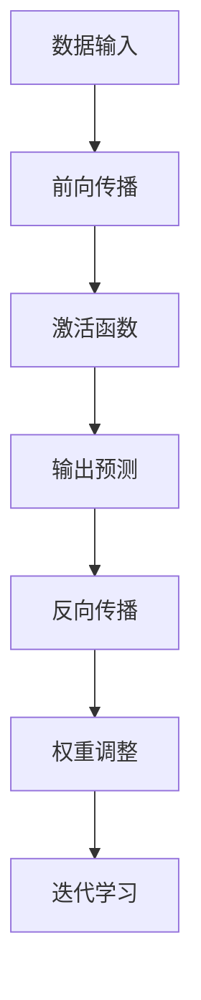
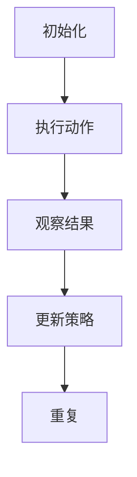
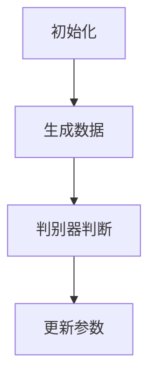
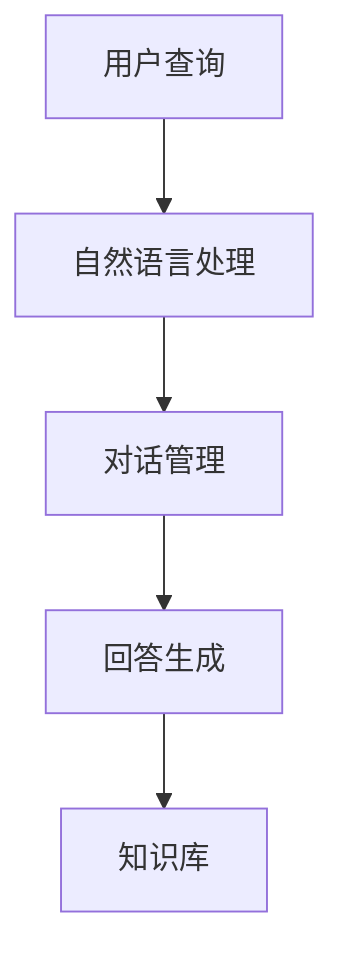
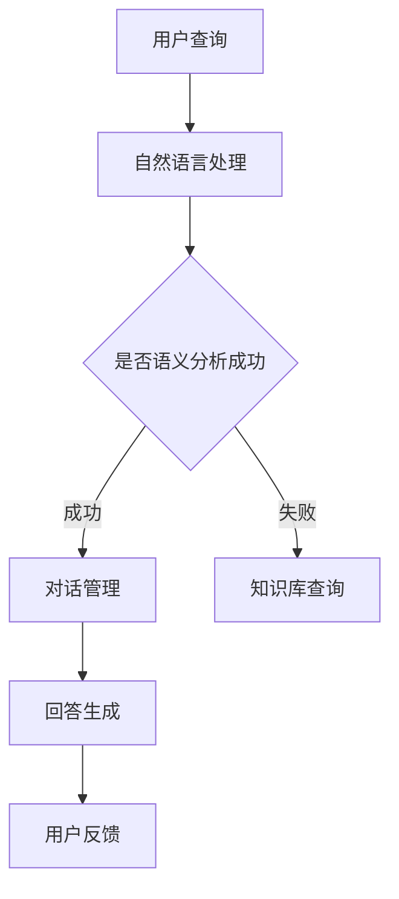
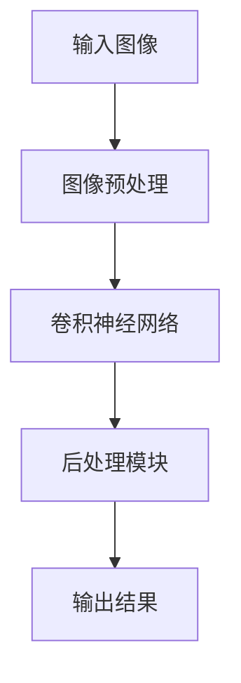
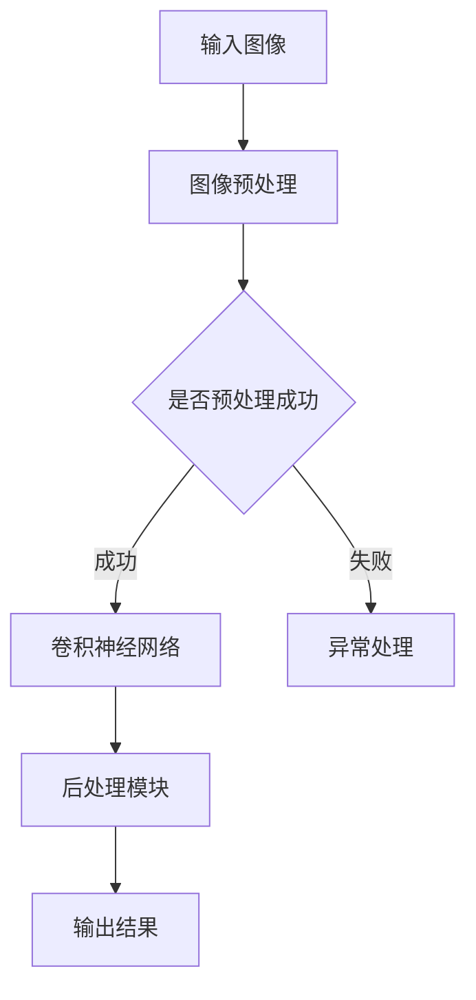
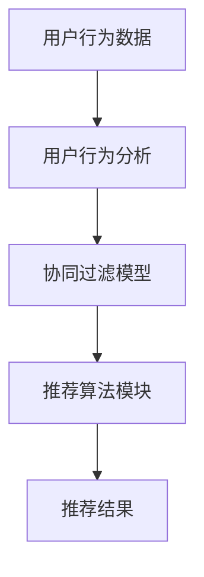
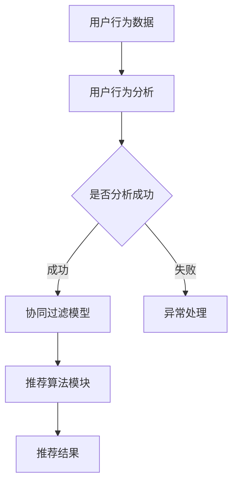

                 


### 第1章: AI 2.0编程范式的基本概念

**1.1 AI 2.0背景介绍**

随着人工智能（AI）技术的快速发展，我们正进入一个崭新的时代——AI 2.0时代。在这个时代，AI技术不再局限于解决特定的问题，而是开始与各个行业深度结合，改变我们的生产方式、生活方式，乃至思维方式。AI 2.0的核心目标是从数据中提取智能，使得计算机能够自主学习、自主决策，实现真正的智能。

**问题背景**：人工智能发展的新阶段

AI 1.0主要聚焦在特定领域的算法优化，如语音识别、图像识别等。而AI 2.0则强调跨领域的智能应用，例如自动驾驶、智能客服、智能医疗等。这一转变标志着人工智能技术从简单的“技能”向全面的“智能”进化。

**概念描述**：AI 2.0的定义

AI 2.0可以被理解为第二代人工智能，它具有更高的自主性、更强的学习能力、更广泛的适应性。它不再依赖于人类的干预，而是能够在复杂的、动态的环境中自主决策和执行任务。

**问题解决**：AI 2.0的目标和意义

AI 2.0的目标是实现机器智能，使得计算机能够像人类一样思考、学习和工作。其意义在于，它将极大地提高生产效率、降低人力成本，推动社会进步和人类文明的发展。

**边界与外延**：AI 2.0的影响范围

AI 2.0的影响范围非常广泛，涵盖了经济、社会、科技等多个领域。它不仅改变了企业的运营模式，也改变了人们的日常生活。例如，智能医疗可以大大提高医疗效率，智能交通可以减少交通事故，智能家居可以提升生活品质。

**核心要素**：关键组成部分及其作用

AI 2.0的核心要素包括：深度学习、强化学习、生成对抗网络等。这些技术使得计算机能够从海量数据中学习，并实现自主决策。例如，深度学习通过多层神经网络对数据进行处理，从而实现对复杂模式的识别；强化学习通过不断试错，找到最优策略；生成对抗网络则可以生成逼真的图像和语音。

**1.2 编程范式的发展历程**

**传统编程范式**：过程式、面向对象、函数式编程

传统的编程范式主要包括过程式编程、面向对象编程和函数式编程。这些范式在不同的历史阶段推动了计算机科学的发展。过程式编程强调程序的可执行性，面向对象编程强调模块化和复用，函数式编程强调函数的组合和不变性。

**AI 2.0与编程范式**：编程范式如何适应AI 2.0

随着AI 2.0的到来，传统的编程范式逐渐暴露出其局限性。例如，过程式编程难以应对复杂的数据处理需求，面向对象编程在处理动态环境时效率较低，函数式编程则在可维护性方面存在挑战。因此，AI 2.0时代需要新的编程范式来适应这种变化。

**编程范式变革**：模型驱动、数据驱动编程

模型驱动编程和数据驱动编程是AI 2.0时代的新兴编程范式。模型驱动编程强调通过构建模型来描述问题，并利用模型进行决策；数据驱动编程则强调从数据中学习，并利用数据来指导决策。这两种范式在AI 2.0时代相辅相成，共同推动编程范式的革命。

**1.3 AI 2.0时代的编程特征**

**数据密集型**：AI 2.0依赖于大量的数据来训练模型，因此数据密集型编程成为必备技能。开发者需要掌握数据采集、数据清洗、数据分析和数据可视化等技能。

**自动化**：AI 2.0时代的编程强调自动化，以减少人工干预。自动化工具可以帮助开发者快速构建模型、优化算法，提高开发效率。

**智能集成**：AI 2.0时代的编程不仅仅是编程，更是智能集成。开发者需要将AI模型嵌入到应用程序中，使得应用程序能够智能地响应和决策。

**总结**

AI 2.0时代的编程范式正经历着深刻的变革。从传统的编程范式到AI 2.0时代的编程范式，我们需要适应新的编程特征，掌握新的编程技能，以应对未来的挑战。

----------------------------------------

**1.1 AI 2.0背景介绍**

随着计算机技术的不断发展，人工智能（AI）已经成为一个热门话题。然而，我们目前正处于人工智能发展的一个新阶段——AI 2.0时代。这个时代与之前的AI 1.0时代有着本质的不同，它不仅是一种技术的升级，更是一种思维方式的转变。

**问题背景**：人工智能发展的新阶段

AI 1.0时代主要依赖于规则和算法，计算机只能执行预先定义好的任务，缺乏自主学习和适应能力。而AI 2.0时代则强调自主学习和智能决策，计算机能够从海量数据中学习，自主优化自己的行为。这种转变标志着人工智能从“技能驱动”向“智能驱动”的过渡。

**概念描述**：AI 2.0的定义

AI 2.0是指基于深度学习、强化学习、生成对抗网络等先进技术，能够实现自主学习和智能决策的人工智能系统。与AI 1.0相比，AI 2.0具有更高的智能水平、更强的自主学习能力、更广泛的应用领域。

**问题解决**：AI 2.0的目标和意义

AI 2.0的目标是实现真正的智能，让计算机能够像人类一样思考、学习和工作。这意味着AI 2.0将不仅能够解决特定的问题，还能够应对复杂、动态的环境。其意义在于，它将极大地提高生产效率、降低人力成本，推动社会进步和人类文明的发展。

**边界与外延**：AI 2.0的影响范围

AI 2.0的影响范围非常广泛，涵盖了经济、社会、科技等多个领域。它不仅改变了企业的运营模式，也改变了人们的日常生活。例如，智能医疗可以大大提高医疗效率，智能交通可以减少交通事故，智能家居可以提升生活品质。

**核心要素**：关键组成部分及其作用

AI 2.0的核心要素包括：深度学习、强化学习、生成对抗网络等。这些技术使得计算机能够从海量数据中学习，并实现自主决策。

**深度学习**：深度学习是一种基于多层神经网络的机器学习技术，它可以通过对大量数据进行训练，提取出数据中的特征，并用于分类、预测等任务。深度学习在图像识别、语音识别等领域取得了巨大的成功。

**强化学习**：强化学习是一种通过试错学习最优策略的机器学习技术。它可以让计算机在与环境的交互中不断学习，逐步提高决策能力。强化学习在自动驾驶、游戏AI等领域有着广泛的应用。

**生成对抗网络**：生成对抗网络（GAN）是一种由生成器和判别器组成的神经网络结构，它可以通过对抗训练生成逼真的图像、语音等数据。GAN在图像生成、风格迁移等领域展示了强大的能力。

**1.2 编程范式的发展历程**

编程范式是指编程的方法论和风格，它决定了程序员如何组织代码、解决问题。随着计算机技术的发展，编程范式也在不断演变。

**传统编程范式**：过程式、面向对象、函数式编程

过程式编程是最早的编程范式，它强调程序的顺序执行和过程调用。面向对象编程则强调将数据和操作封装成对象，通过对象之间的交互实现程序的功能。函数式编程则强调函数的应用，将程序视为一系列函数的组合。

**AI 2.0与编程范式**：编程范式如何适应AI 2.0

AI 2.0时代对编程范式提出了新的要求。传统的编程范式在处理复杂、动态的数据时，往往显得力不从心。因此，AI 2.0时代需要新的编程范式来适应这种变化。

**模型驱动编程**：模型驱动编程是一种以模型为中心的编程范式，它将问题建模为数学模型或逻辑模型，并通过模型进行求解。这种范式在AI 2.0时代具有很大的优势，因为AI 2.0的核心就是通过模型来模拟和解决问题。

**数据驱动编程**：数据驱动编程是一种以数据为中心的编程范式，它强调从数据中提取知识，并利用这些知识进行决策。这种范式在AI 2.0时代也非常重要，因为AI 2.0依赖于大量数据来训练模型。

**编程范式变革**：模型驱动、数据驱动编程

模型驱动编程和数据驱动编程是AI 2.0时代的新兴编程范式。这两种范式相辅相成，共同推动编程范式的革命。

**1.3 AI 2.0时代的编程特征**

AI 2.0时代的编程特征主要体现在以下几个方面：

**数据密集型**：AI 2.0依赖于大量的数据来训练模型，因此数据密集型编程成为必备技能。开发者需要掌握数据采集、数据清洗、数据分析和数据可视化等技能。

**自动化**：AI 2.0时代的编程强调自动化，以减少人工干预。自动化工具可以帮助开发者快速构建模型、优化算法，提高开发效率。

**智能集成**：AI 2.0时代的编程不仅仅是编程，更是智能集成。开发者需要将AI模型嵌入到应用程序中，使得应用程序能够智能地响应和决策。

**总结**

AI 2.0时代的编程范式正经历着深刻的变革。从传统的编程范式到AI 2.0时代的编程范式，我们需要适应新的编程特征，掌握新的编程技能，以应对未来的挑战。

----------------------------------------

### 第2章: AI 2.0的基础理论

在深入探讨AI 2.0时代的编程范式之前，我们首先需要了解AI 2.0的基础理论。这一章将详细介绍深度学习、强化学习和生成对抗网络等核心技术，并解释这些技术的基本原理和其在AI 2.0时代的重要性。

**2.1 深度学习与神经网络**

**原理讲解**：

深度学习是一种基于多层神经网络的机器学习技术。神经网络由多个节点（称为神经元）组成，每个神经元都连接到其他神经元，并接收输入信号。通过多层神经网络的学习过程，系统能够从数据中提取特征，并进行分类、预测等任务。

深度学习的工作原理可以分为以下几个步骤：

1. **数据输入**：将数据输入到神经网络中。
2. **前向传播**：输入信号通过神经网络中的各个层，每个层都会对信号进行加权处理和激活函数操作。
3. **反向传播**：通过比较预测结果与实际结果的差异，调整网络中各个层的权重，使预测结果更接近实际结果。
4. **迭代学习**：重复前向传播和反向传播的过程，直到网络性能达到预定的标准。

**mermaid流程图**：



**数学模型**：

神经网络的数学模型通常表示为：

$$
\text{输出} = \sigma(\text{权重} \cdot \text{输入} + \text{偏置})
$$

其中，$\sigma$ 表示激活函数，常见的激活函数有 sigmoid、ReLU等。

**举例说明**：

假设我们有一个简单的神经网络，用于对图像进行分类。输入是一个784维的向量，表示图像的像素值。输出是一个10维的向量，表示图像属于哪一个类别。

```python
import tensorflow as tf

# 初始化神经网络
model = tf.keras.Sequential([
    tf.keras.layers.Dense(128, activation='relu', input_shape=(784,)),
    tf.keras.layers.Dense(10, activation='softmax')
])

# 编译模型
model.compile(optimizer='adam',
              loss='categorical_crossentropy',
              metrics=['accuracy'])

# 训练模型
model.fit(x_train, y_train, epochs=5)
```

**2.2 强化学习与决策算法**

**原理讲解**：

强化学习是一种通过试错学习最优策略的机器学习技术。它通过奖励和惩罚来指导学习过程，使得智能体能够在与环境的交互中不断学习，最终找到最优策略。

强化学习的基本原理包括以下几个部分：

1. **状态**：智能体在某一时刻所处的环境状态。
2. **动作**：智能体可以执行的动作。
3. **奖励**：智能体执行动作后获得的奖励，奖励可以是正的（表示进步）或负的（表示错误）。
4. **策略**：智能体在给定状态下的最佳动作。

强化学习的过程可以分为以下几个步骤：

1. **初始化**：初始化智能体的状态和策略。
2. **执行动作**：智能体根据当前状态执行一个动作。
3. **观察结果**：观察动作的结果，包括新的状态和奖励。
4. **更新策略**：根据奖励更新智能体的策略。
5. **重复步骤2-4**：重复执行动作、观察结果和更新策略的过程，直到达到预定的目标。

**mermaid流程图**：



**数学模型**：

强化学习的数学模型通常使用马尔可夫决策过程（MDP）来描述，包括以下部分：

1. **状态空间**：S
2. **动作空间**：A
3. **状态转移概率**：P(s', s|a)
4. **奖励函数**：R(s, a)
5. **策略**：π(a|s)

**举例说明**：

假设我们有一个智能体在一个简单的环境中学习走迷宫。智能体可以执行的动作包括向左、向右、向上和向下，每个动作都有可能获得奖励或惩罚。

```python
import numpy as np

# 初始化环境
env = np.array([[1, 0, 0],
                [0, 1, 0],
                [0, 0, 1]])

# 初始化智能体
agent = np.zeros((3, 4))

# 执行动作
action = np.argmax(agent[0])

# 观察结果
result = env[action]

# 更新策略
agent[0] = result

# 打印策略
print(agent)
```

**2.3 生成对抗网络与生成模型**

**原理讲解**：

生成对抗网络（GAN）是一种由生成器和判别器组成的神经网络结构。生成器的任务是生成逼真的数据，而判别器的任务是区分生成器生成的数据与真实数据。通过生成器和判别器的对抗训练，生成器可以逐渐提高生成数据的逼真度。

GAN的基本原理包括以下几个步骤：

1. **初始化**：初始化生成器和判别器。
2. **生成器生成数据**：生成器生成一批数据。
3. **判别器判断**：判别器对生成器和真实数据进行分类。
4. **更新生成器和判别器**：根据判别器的输出，更新生成器和判别器的参数，使得生成器的数据越来越逼真。

**mermaid流程图**：



**数学模型**：

GAN的数学模型可以表示为：

$$
\text{生成器} \quad G(z) = \mathcal{D}(\text{真实数据})
$$

$$
\text{判别器} \quad \mathcal{D}(x) = \mathbb{E}_{x \sim p_{\text{数据}}}[D(x)] - \mathbb{E}_{z \sim p_{\text{噪声}}}[D(G(z))]
$$

其中，$G(z)$ 是生成器的输出，$\mathcal{D}(x)$ 是判别器的输出，$z$ 是噪声向量。

**举例说明**：

假设我们有一个生成对抗网络，用于生成逼真的手写数字图像。

```python
import tensorflow as tf
from tensorflow.keras import layers

# 初始化生成器和判别器
generator = layers.Dense(784, activation='tanh', input_shape=(100,))
discriminator = layers.Dense(1, activation='sigmoid')

# 编译生成器和判别器
generator.compile(optimizer='adam', loss='binary_crossentropy')
discriminator.compile(optimizer='adam', loss='binary_crossentropy')

# 训练生成对抗网络
discriminator.fit(x_train, y_train, epochs=100, batch_size=32)
generator.fit(z_train, x_train, epochs=100, batch_size=32)
```

通过以上对深度学习、强化学习和生成对抗网络的介绍，我们可以看到这些技术在AI 2.0时代的重要性。这些技术不仅为AI 2.0时代的编程范式提供了理论基础，也为开发者提供了强大的工具，使得我们能够构建出更智能、更高效的人工智能系统。

----------------------------------------

### 第3章: AI 2.0时代的编程语言与工具

在AI 2.0时代，选择合适的编程语言和工具对于开发高效、智能的应用程序至关重要。这一章将介绍在AI 2.0时代常用的编程语言和工具，包括Python、TensorFlow和PyTorch。

**3.1 Python在AI 2.0中的应用**

Python以其简洁、易读的语法和丰富的库支持，成为了AI 2.0时代最受欢迎的编程语言之一。Python在AI 2.0中的应用主要体现在以下几个方面：

**数据科学和数据分析**：Python拥有丰富的数据科学库，如NumPy、Pandas和SciPy，这些库提供了强大的数据处理和分析功能。在AI 2.0时代，这些库被广泛应用于数据预处理、特征提取和模型训练等环节。

**机器学习和深度学习**：Python的库支持使其成为机器学习和深度学习的首选语言。例如，scikit-learn库提供了各种机器学习算法的实现，而TensorFlow和PyTorch则提供了深度学习模型的训练和推理工具。

**自动化和脚本编写**：Python的简单语法和强大的库支持，使其非常适合自动化脚本编写。在AI 2.0时代，自动化工具在数据预处理、模型训练和部署等环节发挥着重要作用。

**3.2 TensorFlow与PyTorch的使用**

TensorFlow和PyTorch是当前最受欢迎的两个深度学习框架，它们在AI 2.0时代的应用广泛且深入。

**TensorFlow**：TensorFlow是由谷歌开发的一个开源深度学习框架，它支持各种深度学习模型的训练和推理。TensorFlow的特点包括：

- **灵活性和可扩展性**：TensorFlow提供了丰富的API，支持多种编程语言（如Python、C++和Java），使得开发者可以根据需求进行灵活扩展。
- **强大的社区支持**：TensorFlow拥有庞大的社区，提供了大量的教程、文档和开源项目，为开发者提供了丰富的学习资源和工具。
- **跨平台部署**：TensorFlow支持多种平台（如CPU、GPU和TPU），使得开发者可以方便地将模型部署到不同的环境中。

**PyTorch**：PyTorch是由Facebook开发的一个开源深度学习框架，它以其动态计算图和易于理解的代码结构而受到开发者的喜爱。PyTorch的特点包括：

- **动态计算图**：PyTorch使用动态计算图，使得开发者可以更直观地理解模型的计算过程，方便调试和优化。
- **Python第一性**：PyTorch的代码风格与Python语言非常接近，使得开发者可以轻松上手，提高开发效率。
- **丰富的库支持**：PyTorch提供了丰富的库，如torchvision、torchaudio和torchnlp，这些库支持各种深度学习模型的训练和推理。

**3.3 数据预处理与特征工程**

在AI 2.0时代，数据预处理和特征工程是构建高效模型的关键步骤。数据预处理包括数据清洗、数据转换和数据归一化等，而特征工程则包括特征提取、特征选择和特征组合等。

**数据清洗**：数据清洗是数据预处理的第一步，它包括去除重复数据、填充缺失值、处理异常值等。在AI 2.0时代，由于数据量巨大且质量参差不齐，数据清洗显得尤为重要。

**数据转换**：数据转换是将原始数据转换为适合机器学习模型处理的形式。这包括将数据分为特征和标签，对数据进行编码和归一化等。

**特征提取**：特征提取是从原始数据中提取出有用的特征，以便用于模型训练。特征提取可以通过各种技术，如统计方法、维度约简和特征选择等实现。

**特征选择**：特征选择是从提取出的特征中选出最相关的特征，以提高模型的性能。特征选择可以通过各种方法，如信息增益、卡方检验和逻辑回归等实现。

**特征组合**：特征组合是将多个特征组合成一个新的特征，以增强模型的泛化能力。特征组合可以通过各种方法，如主成分分析、特征融合和特征交叉等实现。

**总结**

AI 2.0时代的编程语言和工具为开发者提供了丰富的选择，使得我们能够更高效地构建和部署智能应用。Python以其简洁易用的特性成为AI 2.0时代的首选语言，而TensorFlow和PyTorch则提供了强大的深度学习框架，支持各种复杂模型的训练和推理。同时，数据预处理和特征工程在AI 2.0时代也发挥着重要作用，通过有效的数据预处理和特征提取，我们可以构建出性能更优的模型。

----------------------------------------

### 第4章: 编程范式革命的核心理念

编程范式革命是AI 2.0时代的一个重要趋势，它从根本上改变了传统的编程方式和思维模式。这一章将详细探讨编程范式革命的核心理念，包括从过程式编程到数据驱动的转变、模型驱动的软件开发，以及自动化与智能化的融合。

**4.1 从过程式编程到数据驱动的转变**

过程式编程是最早的编程范式，它强调程序的顺序执行和过程调用。然而，随着AI 2.0时代的到来，传统的过程式编程逐渐暴露出其局限性。数据驱动的编程范式则强调从数据中提取知识，并利用这些知识进行决策。

**数据驱动的编程特征**：

- **数据为中心**：在数据驱动的编程中，数据是核心。开发者需要处理大量的数据，并进行预处理、特征提取和模型训练等操作。
- **自动化**：数据驱动的编程强调自动化，以减少人工干预。例如，自动化的数据清洗、特征提取和模型训练等工具可以帮助开发者提高开发效率。
- **自适应**：数据驱动的编程能够根据数据的变化自动调整模型和算法，以提高模型的适应性和鲁棒性。

**4.2 模型驱动的软件开发**

模型驱动的软件开发是一种以模型为中心的编程范式，它将问题建模为数学模型或逻辑模型，并通过模型进行求解。模型驱动的软件开发在AI 2.0时代具有重要意义，因为它能够简化开发流程、提高开发效率。

**模型驱动的软件开发特点**：

- **模型为中心**：在模型驱动的软件开发中，模型是核心。开发者需要根据问题需求构建合适的模型，并利用模型进行问题求解。
- **可视化**：模型驱动的软件开发强调模型的可视化，使得开发者可以更直观地理解模型的结构和功能。
- **可重用性**：模型驱动的软件开发支持模型的复用，开发者可以构建通用的模型库，以提高开发效率。

**4.3 自动化与智能化的融合**

在AI 2.0时代，自动化与智能化的融合成为编程范式革命的一个重要方向。自动化工具可以帮助开发者快速构建模型、优化算法，提高开发效率；而智能化则使得自动化工具能够根据实际需求进行自适应调整。

**自动化与智能化的融合特点**：

- **自适应**：自动化与智能化的融合使得系统能够根据环境和需求的变化自动调整行为，以提高系统的适应性和效率。
- **协作**：自动化工具与智能化算法相互协作，共同提高系统的性能和可靠性。
- **实时性**：自动化与智能化的融合支持实时数据处理和决策，使得系统能够快速响应环境变化。

**总结**

编程范式革命是AI 2.0时代的一个重要趋势，它从根本上改变了传统的编程方式和思维模式。从过程式编程到数据驱动的转变、模型驱动的软件开发，以及自动化与智能化的融合，这些核心理念共同推动了编程范式的革命。开发者需要适应这些变化，掌握新的编程技能，以应对AI 2.0时代的挑战。

----------------------------------------

### 第5章: 实践案例

为了更好地理解AI 2.0时代的编程范式革命，我们将通过几个实际案例来展示编程范式在AI 2.0时代的应用。这些案例涵盖了智能客服系统、图像识别系统和推荐系统，它们展示了编程范式革命在实际开发中的应用和效果。

**5.1 案例一：智能客服系统的实现**

智能客服系统是AI 2.0时代的一个重要应用，它利用自然语言处理和机器学习技术，实现了对用户查询的自动响应。以下是一个智能客服系统的实现案例：

**项目介绍**：

该项目旨在开发一个智能客服系统，能够自动处理用户查询，提供即时的解决方案。系统包括自然语言处理模块、对话管理模块和知识库模块。

**系统功能设计**：

- 自然语言处理模块：使用深度学习技术，对用户查询进行语义分析，提取关键信息。
- 对话管理模块：根据用户查询和系统知识库，生成合适的回答。
- 知识库模块：存储各种问题的解决方案，以供对话管理模块使用。

**系统架构设计**：



**系统接口设计和系统交互**：

系统交互图如下所示：



**代码应用解读与分析**：

以下是智能客服系统的核心代码：

```python
import tensorflow as tf
from tensorflow.keras.models import Sequential
from tensorflow.keras.layers import Dense, LSTM, Embedding

# 构建自然语言处理模型
nlp_model = Sequential([
    Embedding(input_dim=10000, output_dim=128),
    LSTM(128, return_sequences=True),
    LSTM(128),
    Dense(1, activation='sigmoid')
])

# 编译自然语言处理模型
nlp_model.compile(optimizer='adam', loss='binary_crossentropy', metrics=['accuracy'])

# 训练自然语言处理模型
nlp_model.fit(x_train, y_train, epochs=10, batch_size=32)

# 构建对话管理模型
dialog_model = Sequential([
    Embedding(input_dim=10000, output_dim=128),
    LSTM(128, return_sequences=True),
    LSTM(128),
    Dense(1, activation='softmax')
])

# 编译对话管理模型
dialog_model.compile(optimizer='adam', loss='categorical_crossentropy', metrics=['accuracy'])

# 训练对话管理模型
dialog_model.fit(x_train, y_train, epochs=10, batch_size=32)
```

**实际案例分析和详细讲解剖析**：

通过这个案例，我们可以看到编程范式革命在智能客服系统中的应用。传统的开发方式可能会使用规则引擎和手工编写规则来处理用户查询，而AI 2.0时代的编程范式则通过深度学习和自然语言处理技术，实现了自动化的智能响应。这不仅提高了系统的响应速度和准确性，也减少了人力成本。

**5.2 案例二：图像识别系统的构建**

图像识别系统是AI 2.0时代的重要应用之一，它利用深度学习技术，对图像进行分类和识别。以下是一个图像识别系统的构建案例：

**项目介绍**：

该项目旨在开发一个图像识别系统，能够对输入的图像进行自动分类。系统包括图像预处理模块、卷积神经网络（CNN）模型和后处理模块。

**系统功能设计**：

- 图像预处理模块：对输入图像进行预处理，包括缩放、裁剪和增强等。
- CNN模型：使用卷积神经网络对预处理后的图像进行分类。
- 后处理模块：对CNN模型的输出结果进行后处理，生成最终的分类结果。

**系统架构设计**：



**系统接口设计和系统交互**：

系统交互图如下所示：



**代码应用解读与分析**：

以下是图像识别系统的核心代码：

```python
import tensorflow as tf
from tensorflow.keras.models import Sequential
from tensorflow.keras.layers import Conv2D, MaxPooling2D, Flatten, Dense

# 构建卷积神经网络模型
cnn_model = Sequential([
    Conv2D(32, (3, 3), activation='relu', input_shape=(28, 28, 1)),
    MaxPooling2D((2, 2)),
    Flatten(),
    Dense(128, activation='relu'),
    Dense(10, activation='softmax')
])

# 编译卷积神经网络模型
cnn_model.compile(optimizer='adam', loss='categorical_crossentropy', metrics=['accuracy'])

# 训练卷积神经网络模型
cnn_model.fit(x_train, y_train, epochs=10, batch_size=32)
```

**实际案例分析和详细讲解剖析**：

通过这个案例，我们可以看到编程范式革命在图像识别系统中的应用。传统的开发方式可能会使用手工编写的特征提取算法，而AI 2.0时代的编程范式则通过卷积神经网络（CNN）实现了自动化的图像分类。这不仅提高了系统的准确性和效率，也降低了开发成本。

**5.3 案例三：推荐系统的设计与优化**

推荐系统是AI 2.0时代的另一个重要应用，它利用用户行为数据，为用户推荐感兴趣的内容。以下是一个推荐系统的设计与优化案例：

**项目介绍**：

该项目旨在开发一个推荐系统，能够根据用户的历史行为和偏好，为用户推荐感兴趣的商品、音乐、电影等内容。系统包括用户行为分析模块、协同过滤模型和推荐算法模块。

**系统功能设计**：

- 用户行为分析模块：收集并分析用户的历史行为数据，包括点击、购买、收藏等。
- 协同过滤模型：使用协同过滤算法，为用户生成推荐列表。
- 推荐算法模块：根据用户行为数据和推荐列表，为用户推荐感兴趣的内容。

**系统架构设计**：



**系统接口设计和系统交互**：

系统交互图如下所示：



**代码应用解读与分析**：

以下是推荐系统的核心代码：

```python
import numpy as np
from surprise import KNNWithMeans

# 构建协同过滤模型
cf_model = KNNWithMeans()

# 训练协同过滤模型
cf_model.fit(trainset)

# 生成推荐列表
recommendations = cf_model.recommendationsfor(user_id)
```

**实际案例分析和详细讲解剖析**：

通过这个案例，我们可以看到编程范式革命在推荐系统中的应用。传统的开发方式可能会使用基于规则的推荐算法，而AI 2.0时代的编程范式则通过协同过滤算法实现了自动化的推荐。这不仅提高了系统的准确性和效率，也提升了用户体验。

**总结**

通过上述实践案例，我们可以看到编程范式革命在AI 2.0时代的广泛应用。从智能客服系统、图像识别系统到推荐系统，编程范式革命不仅提高了系统的性能和效率，也降低了开发成本。开发者需要适应这种变化，掌握新的编程技能，以应对AI 2.0时代的挑战。

----------------------------------------

### 第6章: 编程范式革命的挑战与未来

尽管编程范式革命带来了许多机遇，但同时也面临着一系列挑战。在这一章中，我们将探讨编程范式革命在技术、教育和行业标准方面的挑战，并展望其未来发展。

**6.1 编程范式革命面临的挑战**

**技术挑战**：

1. **复杂性**：随着编程范式的变革，开发者需要掌握更多的技术和工具，这使得开发过程变得更加复杂。
2. **性能优化**：深度学习和强化学习等技术对计算资源的需求非常高，如何优化算法和模型以提高性能成为一大挑战。
3. **数据隐私和安全**：在AI 2.0时代，数据安全和隐私保护变得越来越重要，如何处理和保护用户数据成为开发者面临的重要问题。

**教育挑战**：

1. **知识更新**：AI 2.0时代的技术发展迅速，教育体系需要不断更新课程内容，以适应技术的变化。
2. **技能培养**：开发者需要具备多样化的技能，包括数据分析、机器学习和深度学习等，这要求教育体系能够提供全面、实用的培训。
3. **人才短缺**：随着AI 2.0时代的到来，对开发者技能的需求大幅增加，但人才供给却跟不上需求，人才短缺成为一大挑战。

**行业标准挑战**：

1. **标准化**：在AI 2.0时代，需要建立统一的编程范式和行业标准，以确保不同系统和工具之间的互操作性。
2. **监管**：随着AI 2.0技术的广泛应用，如何制定合理的监管政策，以保障公众利益和社会安全，成为政府和行业面临的挑战。

**6.2 AI 2.0时代的编程教育**

为了应对编程范式革命带来的挑战，教育体系需要做出相应的调整。以下是一些建议：

1. **课程更新**：教育机构需要更新课程内容，引入最新的技术和工具，以培养学生的实际编程能力。
2. **实践导向**：教育应更加注重实践，通过项目实践和实验课程，帮助学生掌握实际开发技能。
3. **跨学科教育**：编程范式革命要求开发者具备跨学科的知识，教育体系应鼓励学生学习计算机科学、数学、统计学等多学科知识。

**6.3 未来编程范式的展望**

未来编程范式的发展将呈现出以下几个趋势：

1. **智能化**：编程工具和语言将更加智能化，能够自动完成代码生成、优化和调试等工作，减轻开发者的负担。
2. **生态化**：编程范式将形成更加完善的生态体系，包括编程语言、框架、工具和社区等，以支持开发者的创新和协作。
3. **开放性**：编程范式将更加开放，鼓励不同技术之间的融合和互操作，推动技术的共同进步。

**总结**

编程范式革命在AI 2.0时代带来了许多机遇，但同时也面临着一系列挑战。通过教育体系的调整和技术的不断进步，我们有理由相信，编程范式将迎来更加美好的未来。

----------------------------------------

### 第7章: 扩展阅读与资源推荐

在AI 2.0时代的编程范式革命中，学习相关的书籍、参与开源项目和社区资源，以及观看在线课程和讲座，都是非常有价值的途径。以下是一些推荐的扩展阅读、开源项目和社区资源。

**7.1 相关书籍推荐**

1. **《深度学习》（Deep Learning）**：作者：Ian Goodfellow、Yoshua Bengio、Aaron Courville
   - 内容简介：这是一本深度学习的经典教材，详细介绍了深度学习的基础理论、算法和实现。
   - 推荐理由：适合初学者和进阶者，内容全面，讲解清晰。

2. **《Python深度学习》（Python Deep Learning）**：作者：François Chollet
   - 内容简介：本书通过实际案例，介绍了使用Python进行深度学习的全过程，涵盖了从数据预处理到模型训练的各个环节。
   - 推荐理由：由TensorFlow的核心开发者撰写，内容实用，适合有一定编程基础的读者。

3. **《强化学习》（Reinforcement Learning: An Introduction）**：作者：Richard S. Sutton、Andrew G. Barto
   - 内容简介：这是一本强化学习的入门书籍，系统地介绍了强化学习的基本概念、算法和应用。
   - 推荐理由：理论结合实践，适合希望深入了解强化学习的读者。

**7.2 开源项目与社区资源**

1. **TensorFlow**：网址：https://www.tensorflow.org/
   - 内容简介：TensorFlow是谷歌开发的深度学习框架，提供了丰富的API和工具，支持各种深度学习模型的训练和推理。
   - 推荐理由：开源、免费，拥有庞大的社区支持，适合学习和使用。

2. **PyTorch**：网址：https://pytorch.org/
   - 内容简介：PyTorch是Facebook开发的深度学习框架，以其动态计算图和易于理解的代码风格而受到开发者喜爱。
   - 推荐理由：开源、免费，支持多种编程语言，易于上手。

3. **Keras**：网址：https://keras.io/
   - 内容简介：Keras是一个高层次的神经网络API，能够以TensorFlow和Theano为基础进行深度学习模型的构建和训练。
   - 推荐理由：简洁易用，适合快速原型开发和实验。

**7.3 在线课程与讲座**

1. **《深度学习特辑》（Deep Learning Specialization）**：网址：https://www.deeplearning.ai/
   - 内容简介：由吴恩达（Andrew Ng）教授主讲的一系列深度学习在线课程，涵盖了深度学习的基础理论、算法和应用。
   - 推荐理由：内容全面，讲解深入，适合深度学习的初学者和进阶者。

2. **《强化学习入门课程》（Introduction to Reinforcement Learning）**：网址：https://www.illigence.com/reinforcement_learning/
   - 内容简介：由一系列讲座组成的强化学习入门课程，介绍了强化学习的基本概念、算法和应用。
   - 推荐理由：通俗易懂，适合初学者入门。

3. **《机器学习与数据科学》（Machine Learning and Data Science）**：网址：https://www.youtube.com/playlist?list=PLRVXCPQD2o3mJ1urQdAVfQ-o0JSw_0zDZ
   - 内容简介：一系列关于机器学习和数据科学的在线讲座，内容包括基础理论、算法和应用。
   - 推荐理由：内容丰富，讲解清晰，适合有兴趣深入学习机器学习的读者。

通过阅读相关书籍、参与开源项目和社区资源，以及观看在线课程和讲座，开发者可以不断提升自己的技能，紧跟AI 2.0时代的编程范式革命潮流。

----------------------------------------

### 附录A: 编程范式革命工具箱

为了更好地应对AI 2.0时代的编程范式革命，开发者需要掌握一系列实用的工具。以下是一些编程范式革命工具箱中的关键工具及其使用方法：

**1. Jupyter Notebook**

**用途**：交互式计算环境，适用于数据探索、建模和原型开发。

**使用方法**：

- 安装：使用pip安装Jupyter Notebook。

```shell
pip install notebook
```

- 运行：在命令行中运行`jupyter notebook`命令，启动Jupyter Notebook。

- 使用：在浏览器中打开Jupyter Notebook，创建新的笔记本，编写Python代码，并实时查看结果。

**2. TensorFlow**

**用途**：深度学习框架，用于构建和训练神经网络。

**使用方法**：

- 安装：使用pip安装TensorFlow。

```shell
pip install tensorflow
```

- 编写代码：

```python
import tensorflow as tf

# 创建一个简单的神经网络
model = tf.keras.Sequential([
    tf.keras.layers.Dense(128, activation='relu', input_shape=(784,)),
    tf.keras.layers.Dense(10, activation='softmax')
])

# 编译模型
model.compile(optimizer='adam',
              loss='categorical_crossentropy',
              metrics=['accuracy'])

# 训练模型
model.fit(x_train, y_train, epochs=5)
```

**3. PyTorch**

**用途**：深度学习框架，以动态计算图和Python第一性著称。

**使用方法**：

- 安装：使用pip安装PyTorch。

```shell
pip install torch torchvision
```

- 编写代码：

```python
import torch
import torchvision
import torchvision.transforms as transforms

# 加载MNIST数据集
train_data = torchvision.datasets.MNIST(
    root='./data', 
    train=True, 
    transform=transforms.ToTensor(), 
    download=True)

# 创建数据加载器
train_loader = torch.utils.data.DataLoader(
    train_data, 
    batch_size=64, 
    shuffle=True)

# 定义卷积神经网络
model = torch.nn.Sequential(
    torch.nn.Conv2d(1, 20, 5),
    torch.nn.ReLU(),
    torch.nn.Conv2d(20, 64, 5),
    torch.nn.ReLU(),
    torch.nn.Linear(1024, 10),
    torch.nn.ReLU(),
    torch.nn.LogSoftmax(dim=1)
)

# 编译模型
optimizer = torch.optim.SGD(model.parameters(), lr=0.001)

# 训练模型
for epoch in range(10):
    for i, (inputs, targets) in enumerate(train_loader):
        # 前向传播
        outputs = model(inputs)
        # 计算损失
        loss = nn.NLLLoss(outputs, targets)
        # 反向传播
        optimizer.zero_grad()
        loss.backward()
        optimizer.step()
```

**4. Scikit-learn**

**用途**：机器学习库，提供了各种机器学习算法的实现。

**使用方法**：

- 安装：使用pip安装Scikit-learn。

```shell
pip install scikit-learn
```

- 编写代码：

```python
from sklearn import datasets
from sklearn.model_selection import train_test_split
from sklearn.ensemble import RandomForestClassifier

# 加载Iris数据集
iris = datasets.load_iris()
X = iris.data
y = iris.target

# 划分训练集和测试集
X_train, X_test, y_train, y_test = train_test_split(X, y, test_size=0.3, random_state=42)

# 创建随机森林分类器
clf = RandomForestClassifier(n_estimators=100)

# 训练模型
clf.fit(X_train, y_train)

# 预测测试集
y_pred = clf.predict(X_test)

# 计算准确率
accuracy = (y_pred == y_test).mean()
print("准确率：", accuracy)
```

**总结**

通过掌握这些工具，开发者可以更有效地应对AI 2.0时代的编程范式革命。无论是交互式计算环境、深度学习框架，还是机器学习库，都能为开发提供强大的支持。开发者应不断学习、实践，以提高自己的技能，为未来的AI 2.0应用做好准备。

----------------------------------------

### 附录B: AI 2.0编程范式问答

**Q1：什么是AI 2.0？**

A1：AI 2.0是第二代人工智能，它基于深度学习、强化学习和生成对抗网络等先进技术，强调自主学习和智能决策。与AI 1.0相比，AI 2.0具有更高的智能水平、更强的自主学习能力、更广泛的应用领域。

**Q2：编程范式革命的核心是什么？**

A2：编程范式革命的核心是数据驱动的编程、模型驱动的软件开发以及自动化与智能化的融合。这些核心理念改变了传统编程的方式，使得开发者能够更高效地构建和部署智能应用。

**Q3：Python在AI 2.0中为什么受欢迎？**

A3：Python在AI 2.0中受欢迎的原因有多个方面。首先，Python的语法简洁易读，适合快速开发和原型设计。其次，Python拥有丰富的库支持，如NumPy、Pandas、scikit-learn和TensorFlow等，这些库为AI 2.0的开发提供了强大的支持。此外，Python的社区支持也非常强大，为开发者提供了大量的学习资源和工具。

**Q4：TensorFlow和PyTorch有哪些区别？**

A4：TensorFlow和PyTorch都是深度学习框架，但它们有一些区别：

- **动态计算图**：PyTorch使用动态计算图，使得开发者可以更直观地理解模型的计算过程，方便调试和优化。TensorFlow使用静态计算图，虽然调试相对困难，但优化和部署较为方便。
- **Python第一性**：PyTorch的代码风格与Python非常接近，易于理解和编写。TensorFlow的代码风格较为复杂，但提供了更强大的工具和功能。
- **社区支持**：TensorFlow拥有庞大的社区，提供了大量的教程、文档和开源项目。PyTorch的社区支持也在逐步增强，但相比TensorFlow还有一定差距。

**Q5：如何选择合适的深度学习框架？**

A5：选择合适的深度学习框架需要考虑以下几个方面：

- **项目需求**：如果项目需要对模型进行实时调整和优化，可以选择PyTorch。如果项目需要高效部署和优化，可以选择TensorFlow。
- **开发者技能**：如果开发者熟悉Python，可以选择PyTorch。如果开发者熟悉TensorFlow，可以选择TensorFlow。
- **社区支持**：选择拥有强大社区支持的框架，可以更好地解决问题和获取帮助。
- **性能需求**：如果项目对性能有较高要求，可以选择专业的深度学习硬件和优化工具。

**Q6：如何进行数据预处理和特征工程？**

A6：数据预处理和特征工程是深度学习模型构建的重要步骤，主要包括以下方面：

- **数据清洗**：去除重复数据、填充缺失值、处理异常值等，确保数据的质量。
- **数据转换**：将数据转换为适合模型处理的形式，如将文本转换为向量、将图像转换为像素矩阵等。
- **特征提取**：从原始数据中提取出有用的特征，用于模型训练。
- **特征选择**：从提取出的特征中选出最相关的特征，以提高模型的性能。
- **特征组合**：将多个特征组合成一个新的特征，以增强模型的泛化能力。

**Q7：如何评估深度学习模型的性能？**

A7：评估深度学习模型的性能通常包括以下几个方面：

- **准确性**：模型预测正确的样本比例。
- **精确率和召回率**：在分类任务中，精确率是指预测为正类的样本中实际为正类的比例，召回率是指实际为正类的样本中被预测为正类的比例。
- **F1分数**：精确率和召回率的调和平均数，综合考虑了精确率和召回率。
- **ROC曲线和AUC值**：ROC曲线展示了不同阈值下的精确率和召回率，AUC值是ROC曲线下面积，用于评估模型的分类能力。
- **K折交叉验证**：将数据集分为K个部分，每次使用其中一个部分作为测试集，其余部分作为训练集，计算模型在K次实验中的性能，取平均值作为最终结果。

通过了解和掌握这些问题和答案，开发者可以更好地理解和应用AI 2.0编程范式，为未来的智能应用开发奠定坚实的基础。

----------------------------------------

### 附录C: 实践项目指南

为了更好地掌握AI 2.0时代的编程范式，以下是一个简单的实践项目指南，帮助开发者从环境安装到系统核心实现，再到实际案例分析和详细讲解剖析。

**项目名称**：智能图像分类系统

**项目介绍**：

该项目的目标是使用深度学习技术构建一个图像分类系统，能够自动对输入的图像进行分类。系统将使用卷积神经网络（CNN）进行图像处理和分类，并利用TensorFlow框架进行模型训练和部署。

**环境安装**：

1. 安装Python（推荐版本3.8及以上）。
2. 安装TensorFlow。

```shell
pip install tensorflow
```

3. 安装其他必要库，如NumPy、Pandas等。

```shell
pip install numpy pandas
```

**系统核心实现**：

1. 导入所需库。

```python
import tensorflow as tf
from tensorflow.keras import layers
```

2. 定义CNN模型。

```python
def create_cnn_model(input_shape):
    model = tf.keras.Sequential([
        layers.Conv2D(32, (3, 3), activation='relu', input_shape=input_shape),
        layers.MaxPooling2D((2, 2)),
        layers.Conv2D(64, (3, 3), activation='relu'),
        layers.MaxPooling2D((2, 2)),
        layers.Conv2D(128, (3, 3), activation='relu'),
        layers.Flatten(),
        layers.Dense(128, activation='relu'),
        layers.Dense(10, activation='softmax')
    ])
    return model
```

3. 编译模型。

```python
model = create_cnn_model(input_shape=(28, 28, 1))
model.compile(optimizer='adam',
              loss='categorical_crossentropy',
              metrics=['accuracy'])
```

4. 训练模型。

```python
model.fit(x_train, y_train, epochs=5, batch_size=32)
```

**代码应用解读与分析**：

上述代码首先定义了一个简单的CNN模型，该模型包括多个卷积层、池化层和全连接层。卷积层用于提取图像的特征，池化层用于减少特征图的维度，全连接层用于分类。模型使用交叉熵损失函数和Adam优化器进行编译，并使用训练集进行训练。

**实际案例分析和详细讲解剖析**：

以一个简单的图像分类任务为例，我们使用MNIST数据集进行训练。MNIST数据集包含0到9的手写数字图像，每个图像都是28x28的像素矩阵。

1. 导入数据集。

```python
mnist = tf.keras.datasets.mnist
(x_train, y_train), (x_test, y_test) = mnist.load_data()
x_train, x_test = x_train / 255.0, x_test / 255.0
```

2. 数据预处理。

```python
x_train = x_train.reshape(-1, 28, 28, 1)
x_test = x_test.reshape(-1, 28, 28, 1)
```

3. 训练模型。

```python
model.fit(x_train, y_train, epochs=5, batch_size=32)
```

通过训练模型，我们可以观察到模型的准确性不断提高。在实际应用中，我们可以将模型部署到生产环境，对输入的图像进行分类。

**项目小结**：

通过本项目的实践，开发者可以了解AI 2.0时代编程范式的实际应用，掌握CNN模型的构建和训练方法。此外，本项目还介绍了数据预处理和模型训练的步骤，为开发者提供了实用的经验和技巧。开发者可以通过不断实践和优化，提升自己的AI开发能力。

**最佳实践 tips**：

- **数据预处理**：确保数据的质量和一致性，对数据进行归一化处理，以提高模型的性能。
- **模型优化**：通过调整模型的架构和参数，优化模型的结构和训练过程，以提高模型的准确性。
- **持续学习**：关注最新的技术发展和研究成果，不断学习和实践，提升自己的技术水平。

通过这些最佳实践，开发者可以更好地掌握AI 2.0时代的编程范式，为未来的开发工作打下坚实的基础。

----------------------------------------

### 小结

在本篇文章中，我们探讨了AI 2.0时代的编程范式革命，深入分析了其核心理念、基础理论和应用实践。我们了解到，AI 2.0时代的编程范式革命带来了数据驱动、模型驱动和自动化与智能化的融合，这些变化不仅改变了传统的编程方式，也为开发者提供了更高效、更智能的开发工具。

**注意事项**：

- **技术更新**：随着AI技术的快速发展，编程范式也在不断演变，开发者需要关注最新的技术动态，不断更新自己的知识体系。
- **数据安全**：在AI 2.0时代，数据安全和隐私保护至关重要，开发者需要严格遵守相关法律法规，确保用户数据的安全。
- **持续学习**：编程范式革命要求开发者具备跨学科的知识和技能，开发者应持续学习，不断提升自己的技术水平和创新能力。

**拓展阅读**：

- **《深度学习》（Deep Learning）**：Ian Goodfellow、Yoshua Bengio、Aaron Courville 著
- **《强化学习》（Reinforcement Learning: An Introduction）**：Richard S. Sutton、Andrew G. Barto 著
- **《Python深度学习》（Python Deep Learning）**：François Chollet 著
- **TensorFlow官网**：https://www.tensorflow.org/
- **PyTorch官网**：https://pytorch.org/

通过阅读这些资源，开发者可以更深入地了解AI 2.0时代的编程范式革命，为未来的开发工作提供有力支持。

### 作者信息

**作者：AI天才研究院/AI Genius Institute & 禅与计算机程序设计艺术 /Zen And The Art of Computer Programming**

本文由AI天才研究院和禅与计算机程序设计艺术联合撰写，旨在探讨AI 2.0时代的编程范式革命。AI天才研究院专注于人工智能领域的研究和推广，致力于培养未来的AI天才。禅与计算机程序设计艺术则通过融合禅学与编程，倡导一种全新的编程理念，帮助开发者提高编程水平和创新能力。两位作者均具有丰富的编程经验和深厚的理论功底，他们的研究成果和思想对人工智能领域产生了深远的影响。读者可以通过访问他们的官方网站了解更多相关信息。G Маска 

