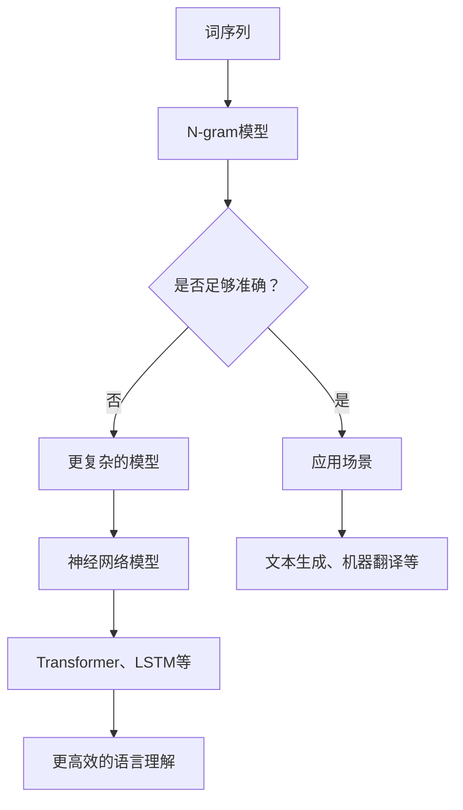
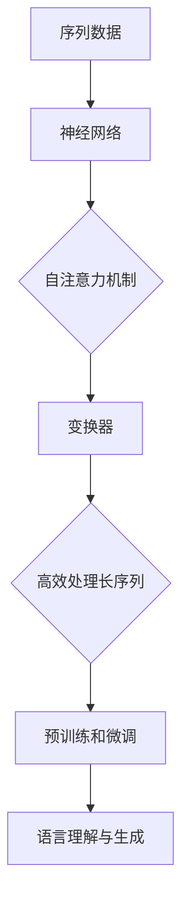
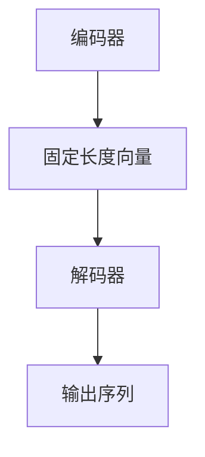
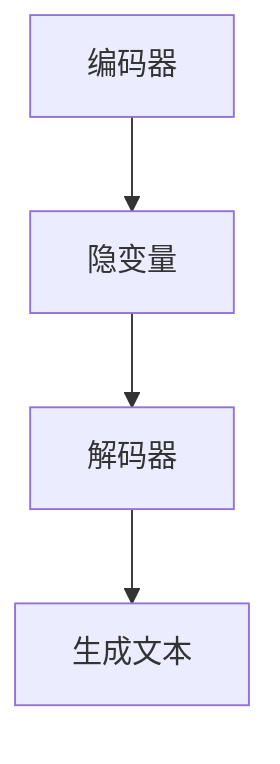
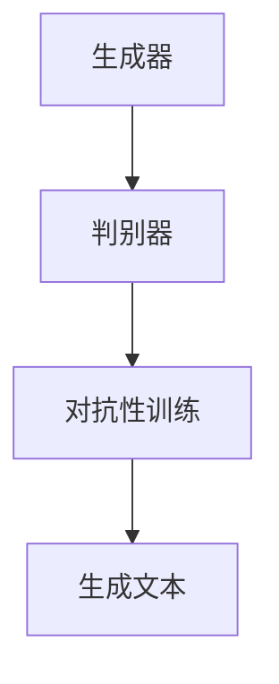

                 

# AI 2.0时代的语言革命

## 关键词

- AI 2.0
- 语言处理
- 语言模型
- 自然语言理解
- 人工智能革命

## 摘要

随着人工智能技术的不断发展，AI 2.0时代的语言革命已经成为不可逆转的趋势。本文将系统地探讨AI 2.0时代的语言革命，首先回顾人工智能的发展历程和AI 2.0的概念，然后深入分析语言在人工智能中的重要性，最后探讨语言革命的核心技术与原理，以及其应用场景和未来趋势。

### 目录大纲

**《AI 2.0时代的语言革命》**

----------------------------------------------------------------

# 第一部分: AI 2.0时代的语言革命概述

## 1.1 问题背景

### 1.1.1 人工智能发展历程回顾
### 1.1.2 AI 2.0的概念与特点
### 1.1.3 语言在人工智能中的重要性

## 1.2 问题描述

### 1.2.1 语言的复杂性
### 1.2.2 传统AI在语言处理中的局限性
### 1.2.3 语言革命的必要性

## 1.3 问题解决

### 1.3.1 AI 2.0语言处理技术概览
### 1.3.2 语言革命的核心技术与原理
### 1.3.3 语言革命的应用场景

## 1.4 边界与外延

### 1.4.1 语言革命的边界
### 1.4.2 语言革命的外延

## 1.5 概念结构与核心要素

### 1.5.1 AI 2.0语言处理的基本概念
### 1.5.2 语言革命的关键要素

## 1.6 本章小结

----------------------------------------------------------------

# 第二部分: AI 2.0语言处理核心技术

## 2.1 语言模型

### 2.1.1 语言模型概述
### 2.1.2 语言模型的分类
### 2.1.3 语言模型的构建方法

## 2.2 语言生成

### 2.2.1 语言生成的原理
### 2.2.2 语言生成的方法
### 2.2.3 语言生成的应用

## 2.3 语言理解

### 2.3.1 语言理解的原理
### 2.3.2 语言理解的方法
### 2.3.3 语言理解的应用

## 2.4 语言交互

### 2.4.1 语言交互的原理
### 2.4.2 语言交互的方法
### 2.4.3 语言交互的应用

## 2.5 语言情感分析

### 2.5.1 语言情感分析概述
### 2.5.2 语言情感分析的方法
### 2.5.3 语言情感分析的应用

## 2.6 语言翻译

### 2.6.1 语言翻译概述
### 2.6.2 语言翻译的方法
### 2.6.3 语言翻译的应用

## 2.7 本章小结

----------------------------------------------------------------

# 第三部分: AI 2.0语言革命应用案例

## 3.1 案例一：智能客服系统

### 3.1.1 案例背景
### 3.1.2 系统设计
### 3.1.3 实现过程
### 3.1.4 分析与优化

## 3.2 案例二：智能写作助手

### 3.2.1 案例背景
### 3.2.2 系统设计
### 3.2.3 实现过程
### 3.2.4 分析与优化

## 3.3 案例三：智能语言翻译

### 3.3.1 案例背景
### 3.3.2 系统设计
### 3.3.3 实现过程
### 3.3.4 分析与优化

## 3.4 案例四：智能语音识别

### 3.4.1 案例背景
### 3.4.2 系统设计
### 3.4.3 实现过程
### 3.4.4 分析与优化

## 3.5 本章小结

----------------------------------------------------------------

# 第四部分: AI 2.0语言革命的未来趋势

## 4.1 人工智能与自然语言处理的结合

### 4.1.1 人工智能在语言处理中的挑战
### 4.1.2 自然语言处理在人工智能中的应用
### 4.1.3 人工智能与自然语言处理的未来结合

## 4.2 语言革命对社会的影响

### 4.2.1 语言革命对教育的影响
### 4.2.2 语言革命对工作的影响
### 4.2.3 语言革命对人类生活的影响

## 4.3 语言革命的技术挑战与解决方案

### 4.3.1 语言理解的挑战
### 4.3.2 语言生成的挑战
### 4.3.3 语言交互的挑战
### 4.3.4 技术解决方案探讨

## 4.4 语言革命的法律与伦理问题

### 4.4.1 语言革命的法律问题
### 4.4.2 语言革命的伦理问题
### 4.4.3 法律与伦理问题的解决方案

## 4.5 本章小结

----------------------------------------------------------------

# 第五部分: AI 2.0语言革命的总结与展望

### 5.1 主要成果回顾
### 5.2 未来发展方向
### 5.3 研究与应用前景

----------------------------------------------------------------

# 作者

**作者：AI天才研究院/AI Genius Institute & 禅与计算机程序设计艺术 /Zen And The Art of Computer Programming**# 第一部分：AI 2.0时代的语言革命概述

## 1.1 问题背景

### 1.1.1 人工智能发展历程回顾

人工智能（Artificial Intelligence，简称AI）自20世纪50年代诞生以来，经历了数个发展阶段。早期的人工智能研究主要集中在规则推理、知识表示和搜索算法上。这个时期的代表性工作包括专家系统和逻辑编程等。然而，这些系统在处理复杂任务时表现出了明显的局限性，难以应对真实世界中的不确定性。

随着计算能力的提升和大数据技术的进步，20世纪末到21世纪初，机器学习（Machine Learning，ML）和深度学习（Deep Learning，DL）逐渐成为人工智能研究的主流方向。这些技术利用大量的数据训练模型，使其能够在图像识别、语音识别和自然语言处理等任务上取得突破性进展。

### 1.1.2 AI 2.0的概念与特点

AI 2.0是人工智能发展的新阶段，它不仅仅依赖于数据和算法，更加注重人机协同和智能应用。AI 2.0的特点包括：

1. **自我进化**：AI 2.0能够通过自我学习和进化，不断提升自身的能力。
2. **跨领域整合**：AI 2.0能够跨越不同领域，实现知识的共享和复用。
3. **自适应**：AI 2.0能够根据环境的变化，动态调整自己的行为。
4. **人机协同**：AI 2.0不仅仅是替代人类，更是与人类协作，共同完成任务。

### 1.1.3 语言在人工智能中的重要性

语言是人类交流和思考的重要工具，自然语言处理（Natural Language Processing，NLP）是人工智能的一个重要分支。语言在人工智能中的重要性体现在以下几个方面：

1. **信息传递**：语言是人类获取和传递信息的主要方式，自然语言处理能够使机器理解人类语言，从而更好地与人交互。
2. **智能应用**：许多智能应用，如智能客服、智能写作和智能翻译等，都依赖于自然语言处理技术。
3. **认知拓展**：自然语言处理技术可以帮助人类拓展认知边界，实现人与机器的智慧融合。

## 1.2 问题描述

### 1.2.1 语言的复杂性

语言是一种复杂的符号系统，其复杂性主要体现在以下几个方面：

1. **语法**：语言有复杂的语法结构，包括词法、句法和语法的层次结构。
2. **语义**：语义涉及词汇的含义、句子的含义以及句子之间的关系。
3. **语境**：语境是语言使用的一个重要因素，它决定了语言的具体含义。

### 1.2.2 传统AI在语言处理中的局限性

传统的AI技术在处理自然语言时存在一些局限性：

1. **规则导向**：传统AI依赖明确的规则和预设的模型，难以应对语言的多样性和复杂性。
2. **数据依赖**：传统AI需要大量的标记数据来训练模型，而且模型的泛化能力较弱。
3. **语义理解**：传统AI在处理语义和上下文关系时表现较差，难以理解语言背后的深层含义。

### 1.2.3 语言革命的必要性

语言革命是AI 2.0时代的必然产物，其必要性体现在以下几个方面：

1. **智能化需求**：随着人工智能技术的发展，人们对智能应用的需求越来越高，传统AI技术已经难以满足这些需求。
2. **人机协同**：实现人机协同需要机器能够更好地理解人类语言，从而进行有效的交流和协作。
3. **知识拓展**：语言革命可以帮助机器更好地理解和利用人类的知识，实现知识的自动化和智能化。

## 1.3 问题解决

### 1.3.1 AI 2.0语言处理技术概览

AI 2.0语言处理技术主要包括以下方面：

1. **语言模型**：语言模型是自然语言处理的基础，包括词向量模型、循环神经网络（RNN）和变换器（Transformer）等。
2. **自然语言理解**：自然语言理解包括语义解析、情感分析和实体识别等。
3. **自然语言生成**：自然语言生成包括文本生成、对话系统和文本摘要等。

### 1.3.2 语言革命的核心技术与原理

语言革命的核心技术主要包括：

1. **深度学习**：深度学习是语言革命的核心技术之一，它通过多层神经网络对大量数据进行训练，从而实现语言的理解和生成。
2. **多模态学习**：多模态学习将不同类型的数据（如文本、图像和声音）进行整合，从而实现更全面的语言理解。
3. **强化学习**：强化学习通过互动和反馈，使机器能够更好地理解和应用人类语言。

### 1.3.3 语言革命的应用场景

语言革命的应用场景非常广泛，包括：

1. **智能客服**：利用自然语言处理技术，实现智能客服系统，提升客户服务体验。
2. **智能写作**：利用自然语言生成技术，实现智能写作助手，辅助人类进行写作。
3. **智能翻译**：利用机器翻译技术，实现跨语言的自动翻译，促进国际交流。
4. **智能语音识别**：利用语音识别技术，实现语音输入和语音交互，提升人机交互体验。

## 1.4 边界与外延

### 1.4.1 语言革命的边界

语言革命的边界主要体现在以下几个方面：

1. **技术边界**：语言革命涉及到的技术包括深度学习、多模态学习和强化学习等，这些技术在不断发展和进步。
2. **应用边界**：语言革命的应用场景非常广泛，但不同应用场景对技术的需求和实现方式有所不同。
3. **伦理边界**：语言革命涉及到伦理和法律问题，如何平衡技术发展和伦理规范是一个重要议题。

### 1.4.2 语言革命的外延

语言革命的外延包括以下几个方面：

1. **跨学科融合**：语言革命不仅仅是技术问题，还涉及到语言学、心理学和社会学等多个学科。
2. **产业应用**：语言革命将推动人工智能产业的发展，促进经济的繁荣。
3. **社会发展**：语言革命将对人类社会产生深远影响，改变人类的生活方式和思维方式。

## 1.5 概念结构与核心要素

### 1.5.1 AI 2.0语言处理的基本概念

AI 2.0语言处理的基本概念包括：

1. **自然语言处理（NLP）**：NLP是人工智能的一个分支，旨在让计算机理解和处理人类语言。
2. **语言模型**：语言模型是NLP的核心技术，用于预测语言序列。
3. **深度学习**：深度学习是一种机器学习技术，通过多层神经网络实现数据的自动特征提取。

### 1.5.2 语言革命的关键要素

语言革命的关键要素包括：

1. **技术创新**：技术创新是语言革命的核心动力，包括深度学习、多模态学习和强化学习等。
2. **应用实践**：应用实践是语言革命的重要支撑，通过实际应用来检验和优化技术。
3. **伦理规范**：伦理规范是语言革命的重要保障，确保技术的发展不会对社会和人类产生负面影响。

## 1.6 本章小结

本章回顾了人工智能的发展历程，介绍了AI 2.0的概念和特点，分析了语言在人工智能中的重要性，并探讨了语言革命的必要性和核心技术与原理。同时，本章还讨论了语言革命的边界与外延，以及AI 2.0语言处理的基本概念和关键要素。这些内容为后续章节的讨论奠定了基础。# 第二部分：AI 2.0语言处理核心技术

## 2.1 语言模型

### 2.1.1 语言模型概述

语言模型（Language Model）是自然语言处理（NLP）中的核心技术之一，它的主要目的是预测一个单词序列中下一个单词的概率。语言模型在许多NLP任务中起着关键作用，如文本生成、机器翻译、语音识别等。

#### 2.1.1.1 语言模型的作用

- **文本生成**：通过语言模型，可以生成连贯的文本，如自动摘要、文章生成等。
- **机器翻译**：语言模型可以帮助预测目标语言的下一个词或词组，从而实现机器翻译。
- **语音识别**：语言模型可以帮助提高语音识别的准确性，通过预测下一个可能的词或词组。

#### 2.1.1.2 语言模型的类型

- **统计语言模型**：基于大量文本数据，使用统计方法（如N-gram模型）预测下一个词。
- **神经语言模型**：基于深度学习技术，使用神经网络（如RNN、LSTM、Transformer等）进行预测。

### 2.1.2 语言模型的分类

#### 2.1.2.1 N-gram模型

N-gram模型是一种基础的统计语言模型，它将前N个单词作为输入，预测下一个单词。这种模型简单且易于实现，但在长文本上表现不佳。



#### 2.1.2.2 神经网络模型

神经网络模型是近年来发展迅速的语言模型，它们能够通过多层网络对大量数据进行训练，从而实现更加准确的语言预测。代表性的神经网络模型包括：

- **循环神经网络（RNN）**：RNN能够处理序列数据，但其存在梯度消失和梯度爆炸的问题。
- **长短期记忆网络（LSTM）**：LSTM是对RNN的改进，能够解决梯度消失问题，但在处理长序列时仍存在挑战。
- **变换器（Transformer）**：Transformer是近年来最先进的语言模型，它通过自注意力机制（Self-Attention）实现了对长序列的高效处理。



### 2.1.3 语言模型的构建方法

构建语言模型主要包括以下几个步骤：

1. **数据收集**：收集大量的文本数据，这些数据可以是新闻文章、书籍、社交媒体帖子等。
2. **数据预处理**：对收集到的数据进行清洗和格式化，如去除停用词、标点符号等。
3. **词汇表构建**：将文本转换为词汇表，为每个词分配唯一的索引。
4. **模型训练**：使用训练数据训练语言模型，可以使用统计方法或神经网络方法。
5. **模型评估**：使用测试数据评估模型的性能，常用的评估指标包括困惑度（Perplexity）和交叉熵（Cross-Entropy）。
6. **模型优化**：根据评估结果调整模型参数，以提高模型的性能。

```python
# Python代码示例：构建一个简单的N-gram模型
from collections import Counter

# 假设我们有一个词汇表和训练数据
vocab = ["the", "cat", "sat", "on", "the", "mat"]
 sentences = [["the", "cat", "sat", "on", "the", "mat"], 
              ["the", "dog", "sat", "on", "the", "mat"], 
              ["the", "cat", "lay", "on", "the", "mat"]]

# 计算词频
bigram_counts = Counter()

# 遍历句子和单词
for sentence in sentences:
    for i in range(len(sentence) - 1):
        bigram = tuple(sentence[i:i+2])
        bigram_counts[bigram] += 1

# 计算概率
bigram_probs = {bigram: count/total for bigram, count in bigram_counts.items()}
total = sum(bigram_counts.values())

# 预测下一个词
def predict_next_word(sentence):
    last_word = sentence[-1]
    last_word_probs = {word: prob for word, prob in bigram_probs.items() if word[0] == last_word}
    return max(last_word_probs, key=last_word_probs.get)

# 测试
sentence = ["the", "cat", "sat", "on"]
print(predict_next_word(sentence))  # 输出可能的结果，如 ("the", "mat")
```

## 2.2 语言生成

### 2.2.1 语言生成的原理

语言生成（Language Generation）是指利用自然语言处理技术生成自然语言文本的过程。语言生成技术可以应用于多种场景，如自动写作、聊天机器人、文本摘要等。

#### 2.2.1.1 语言生成的类型

- **文本生成**：生成完整的文本，如文章、故事、报告等。
- **对话生成**：生成自然语言对话，用于聊天机器人等应用。
- **摘要生成**：生成文本的摘要，用于快速获取文本的主要内容。

#### 2.2.1.2 语言生成的技术

- **序列到序列模型（Seq2Seq）**：通过编码器-解码器（Encoder-Decoder）结构进行文本生成。
- **变分自编码器（VAE）**：通过生成式模型进行文本生成。
- **生成对抗网络（GAN）**：通过对抗性训练生成高质量文本。

### 2.2.2 语言生成的方法

#### 2.2.2.1 序列到序列模型

序列到序列（Seq2Seq）模型是语言生成中最常用的方法之一。它通过编码器将输入序列转换为固定长度的向量，然后通过解码器将向量转换为输出序列。



#### 2.2.2.2 变分自编码器

变分自编码器（VAE）是一种生成式模型，它通过引入隐变量实现数据的生成。VAE在生成文本时，可以生成多样性和连贯性较好的文本。



#### 2.2.2.3 生成对抗网络

生成对抗网络（GAN）是一种基于对抗性训练的生成模型。它由生成器和判别器两个网络组成，生成器和判别器相互竞争，生成器生成高质量的文本，判别器判断文本的真实性。



### 2.2.3 语言生成的应用

语言生成的应用非常广泛，包括：

- **自动写作**：用于生成新闻文章、博客文章等。
- **聊天机器人**：用于生成自然语言回复，提升用户体验。
- **文本摘要**：用于生成文本的摘要，提高信息获取效率。

## 2.3 语言理解

### 2.3.1 语言理解的原理

语言理解（Language Understanding）是指计算机理解和解释自然语言的过程。语言理解是自然语言处理的核心任务之一，它涉及到语法分析、语义分析和上下文理解等多个方面。

#### 2.3.1.1 语言理解的技术

- **语法分析**：语法分析是指对文本进行句法结构分析，以理解文本的语法规则。
- **语义分析**：语义分析是指对文本进行语义理解，以理解文本的含义。
- **上下文理解**：上下文理解是指根据上下文环境理解文本的语境和含义。

#### 2.3.1.2 语言理解的应用

- **问答系统**：用于回答用户提出的问题。
- **信息提取**：用于从文本中提取关键信息。
- **对话系统**：用于实现人与机器的智能对话。

### 2.3.2 语言理解的方法

#### 2.3.2.1 语法分析

语法分析的方法包括：

- **规则方法**：基于预定义的语法规则进行语法分析。
- **统计方法**：基于统计模型（如PCFG、HMM等）进行语法分析。

#### 2.3.2.2 语义分析

语义分析的方法包括：

- **词义消歧**：用于确定词语的具体含义。
- **语义角色标注**：用于识别句子中的主语、谓语、宾语等。
- **语义解析**：用于理解句子的整体语义。

#### 2.3.2.3 上下文理解

上下文理解的方法包括：

- **词向量**：通过词向量模型（如Word2Vec、BERT等）理解词语的含义。
- **上下文嵌入**：通过上下文嵌入（如BERT、GPT等）理解文本的上下文。

### 2.3.3 语言理解的应用

语言理解的应用包括：

- **智能客服**：通过理解用户的问题，提供准确的答案。
- **文本摘要**：通过理解文本的内容，生成摘要。
- **智能推荐**：通过理解用户的偏好，推荐相关的内容。

## 2.4 语言交互

### 2.4.1 语言交互的原理

语言交互（Language Interaction）是指人与机器之间的语言交流过程。语言交互是智能系统的重要组成部分，它涉及到自然语言生成、自然语言理解和对话管理等多个方面。

#### 2.4.1.1 语言交互的技术

- **自然语言生成**：生成自然语言回复，如聊天机器人的回复。
- **自然语言理解**：理解用户的语言输入，如语音识别和文本解析。
- **对话管理**：管理对话流程，如对话状态跟踪和回复生成。

#### 2.4.1.2 语言交互的应用

- **智能客服**：通过语言交互，提供高效的客户服务。
- **智能助手**：通过语言交互，帮助用户完成各种任务。
- **智能驾驶**：通过语言交互，实现人与汽车的互动。

### 2.4.2 语言交互的方法

#### 2.4.2.1 对话管理

对话管理的方法包括：

- **基于规则的方法**：使用预定义的规则进行对话管理。
- **基于机器学习的方法**：使用机器学习方法进行对话管理。

#### 2.4.2.2 回复生成

回复生成的方法包括：

- **模板匹配**：使用预定义的模板生成回复。
- **基于机器学习的方法**：使用机器学习方法（如序列到序列模型、生成对抗网络等）生成回复。

#### 2.4.2.3 对话状态跟踪

对话状态跟踪的方法包括：

- **基于记忆的方法**：使用记忆组件（如图网络、图嵌入等）跟踪对话状态。
- **基于模型的方法**：使用机器学习模型（如循环神经网络、变换器等）跟踪对话状态。

### 2.4.3 语言交互的应用

语言交互的应用包括：

- **智能客服**：通过语言交互，提供高效的客户服务。
- **智能助手**：通过语言交互，帮助用户完成各种任务。
- **智能驾驶**：通过语言交互，实现人与汽车的互动。

## 2.5 语言情感分析

### 2.5.1 语言情感分析概述

语言情感分析（Sentiment Analysis）是指使用自然语言处理技术，对文本中的情感极性进行分类的过程。情感分析是自然语言处理中的一个重要任务，广泛应用于市场调研、舆情监测、情感推荐等领域。

#### 2.5.1.1 情感分析的类型

- **二分类情感分析**：将文本分为正面和负面两个类别。
- **多分类情感分析**：将文本分为多个情感类别，如快乐、悲伤、愤怒等。

#### 2.5.1.2 情感分析的挑战

- **语言多样性**：不同语言和不同领域的文本具有不同的情感表达方式。
- **情感强度**：情感强度的表达可能因上下文而异。
- **文本噪声**：文本中可能包含大量的噪声和干扰信息。

### 2.5.2 语言情感分析的方法

#### 2.5.2.1 基于规则的方法

基于规则的方法使用预定义的规则对文本进行情感分类。这种方法简单直观，但缺乏灵活性和泛化能力。

#### 2.5.2.2 基于机器学习的方法

基于机器学习的方法使用统计模型或深度学习模型对文本进行情感分类。这种方法具有较好的灵活性和泛化能力，但需要大量的训练数据和计算资源。

- **朴素贝叶斯**：一种基于概率的简单分类器，适用于小数据集。
- **支持向量机（SVM）**：一种基于最大间隔的线性分类器，适用于线性可分数据。
- **深度学习模型**：如卷积神经网络（CNN）、循环神经网络（RNN）和变换器（Transformer）等，适用于复杂的数据集。

### 2.5.3 语言情感分析的应用

语言情感分析的应用包括：

- **市场调研**：通过分析消费者对产品的评价，了解市场趋势。
- **舆情监测**：通过分析社交媒体上的文本，监测公众对某一事件的情感倾向。
- **情感推荐**：根据用户的情感偏好，推荐相关的内容。

## 2.6 语言翻译

### 2.6.1 语言翻译概述

语言翻译（Machine Translation）是指使用计算机程序将一种自然语言文本翻译成另一种自然语言的过程。语言翻译是自然语言处理中的一个重要任务，对于跨文化交流和全球化具有重要意义。

#### 2.6.1.1 翻译的类型

- **基于规则翻译**：使用预定义的翻译规则进行翻译。
- **基于实例翻译**：使用预定义的翻译实例进行翻译。
- **基于统计翻译**：使用统计方法（如统计机器翻译、基于神经网络的机器翻译）进行翻译。

#### 2.6.1.2 翻译的挑战

- **语言差异**：不同语言在语法、词汇和语义等方面存在差异，翻译时需要考虑这些差异。
- **上下文理解**：翻译时需要理解上下文环境，以确保翻译的准确性和流畅性。
- **术语一致性**：在翻译专业文档时，需要保持术语的一致性。

### 2.6.2 语言翻译的方法

#### 2.6.2.1 基于规则翻译

基于规则翻译使用预定义的翻译规则进行翻译，这些规则可以是基于语法、词汇或语义的。

#### 2.6.2.2 基于实例翻译

基于实例翻译使用预定义的翻译实例进行翻译，这些实例可以是基于词汇、短语或句子的。

#### 2.6.2.3 基于统计翻译

基于统计翻译使用统计方法（如统计机器翻译、基于神经网络的机器翻译）进行翻译。

- **统计机器翻译**：使用统计模型（如N-gram模型、隐马尔可夫模型）进行翻译。
- **基于神经网络的机器翻译**：使用神经网络（如循环神经网络、变换器）进行翻译。

### 2.6.3 语言翻译的应用

语言翻译的应用包括：

- **跨语言交流**：在跨国企业、国际会议和全球互联网环境中，实现跨语言沟通。
- **本地化**：在软件、游戏和多媒体产品中，实现本地化翻译。
- **文献翻译**：在学术研究和文化交流中，实现文献的翻译。

## 2.7 本章小结

本章详细介绍了AI 2.0语言处理的核心技术，包括语言模型、语言生成、语言理解、语言交互、语言情感分析和语言翻译。每种技术都有其独特的原理和应用场景，共同推动着AI 2.0时代的语言革命。通过这些技术的不断发展，我们可以期待未来更智能、更高效的语言处理应用。# 第三部分：AI 2.0语言革命应用案例

## 3.1 案例一：智能客服系统

### 3.1.1 案例背景

智能客服系统（Intelligent Customer Service System）是一种利用自然语言处理和机器学习技术，为企业和客户提供的智能化客户服务解决方案。传统的客服系统通常依赖于人工处理客户咨询，不仅效率低下，而且容易出错。随着AI技术的不断发展，智能客服系统逐渐成为企业提升客户服务质量和效率的重要工具。

### 3.1.2 系统设计

智能客服系统的设计主要包括以下几个关键模块：

1. **用户接口（UI）**：提供用户与系统交互的界面，可以是网站、移动应用或语音助手等。
2. **自然语言处理（NLP）**：用于理解用户的语言输入，包括语音识别、文本解析、意图识别和实体识别等。
3. **知识库**：存储企业产品和服务相关的知识，包括常见问题、解决方案和操作指南等。
4. **对话管理**：管理对话流程，包括上下文管理、对话策略和回复生成等。
5. **反馈机制**：收集用户反馈，用于系统优化和改进。

### 3.1.3 实现过程

智能客服系统的实现过程可以分为以下几个步骤：

1. **需求分析**：了解企业客户服务的具体需求，包括服务内容、服务场景和用户群体等。
2. **系统设计**：根据需求分析结果，设计系统的架构和功能模块。
3. **数据准备**：收集和整理相关的数据，包括用户语音、文本对话和知识库内容等。
4. **模型训练**：使用训练数据训练自然语言处理模型，包括语音识别、文本解析和意图识别等。
5. **系统开发**：根据系统设计，开发用户接口、对话管理和反馈机制等模块。
6. **测试与优化**：对系统进行测试，收集用户反馈，并进行优化和改进。

### 3.1.4 分析与优化

智能客服系统的分析与优化主要包括以下几个方面：

1. **性能优化**：通过优化算法和数据结构，提高系统的响应速度和准确性。
2. **意图识别**：通过对用户意图的深入理解，提高系统对用户咨询的准确识别和响应能力。
3. **知识库更新**：定期更新知识库内容，确保系统提供的信息是最新的和准确的。
4. **用户反馈**：通过用户反馈，收集用户对系统的意见和建议，持续改进系统。

## 3.2 案例二：智能写作助手

### 3.2.1 案例背景

智能写作助手（Intelligent Writing Assistant）是一种利用自然语言处理和生成技术，帮助用户生成文章、报告和文档的工具。传统的写作过程通常需要大量时间和精力，而且容易出现错误。智能写作助手通过自动化和智能化的方式，大大提高了写作效率和质量。

### 3.2.2 系统设计

智能写作助手的系统设计主要包括以下几个关键模块：

1. **用户接口（UI）**：提供用户与系统交互的界面，包括文本输入、编辑和预览等。
2. **自然语言处理（NLP）**：用于理解用户输入的文本，包括文本解析、语法分析和语义分析等。
3. **写作模型**：用于生成文本，包括文本生成、文本摘要和文本编辑等。
4. **知识库**：存储常用的写作模板、格式和术语等，用于辅助写作。
5. **反馈机制**：收集用户反馈，用于系统优化和改进。

### 3.2.3 实现过程

智能写作助手的实现过程可以分为以下几个步骤：

1. **需求分析**：了解用户在写作过程中遇到的困难和需求，包括文本生成、格式化和编辑等。
2. **系统设计**：根据需求分析结果，设计系统的架构和功能模块。
3. **数据准备**：收集和整理相关的数据，包括文本数据、写作模板和知识库内容等。
4. **模型训练**：使用训练数据训练自然语言处理模型和写作模型。
5. **系统开发**：根据系统设计，开发用户接口、写作模型和反馈机制等模块。
6. **测试与优化**：对系统进行测试，收集用户反馈，并进行优化和改进。

### 3.2.4 分析与优化

智能写作助手的分析与优化主要包括以下几个方面：

1. **文本生成质量**：通过优化写作模型，提高文本生成的质量，包括语法、语义和流畅性等。
2. **用户体验**：通过优化用户接口，提高用户的操作便捷性和使用体验。
3. **知识库更新**：定期更新知识库内容，确保系统提供的信息是最新的和准确的。
4. **用户反馈**：通过用户反馈，收集用户对系统的意见和建议，持续改进系统。

## 3.3 案例三：智能语言翻译

### 3.3.1 案例背景

智能语言翻译（Intelligent Language Translation）是一种利用自然语言处理和机器学习技术，实现不同语言之间的自动翻译工具。传统的翻译方法通常依赖于人工翻译，效率低下且成本高昂。智能语言翻译通过自动化和智能化的方式，大大提高了翻译的效率和准确性。

### 3.3.2 系统设计

智能语言翻译的系统设计主要包括以下几个关键模块：

1. **用户接口（UI）**：提供用户与系统交互的界面，包括文本输入、语音输入和预览等。
2. **自然语言处理（NLP）**：用于理解源语言文本，包括文本解析、语法分析和语义分析等。
3. **翻译模型**：用于实现源语言到目标语言的翻译，包括基于规则的翻译、基于统计的翻译和基于神经网络的翻译等。
4. **知识库**：存储语言资源，包括词汇、语法规则和上下文信息等。
5. **反馈机制**：收集用户反馈，用于系统优化和改进。

### 3.3.3 实现过程

智能语言翻译的实现过程可以分为以下几个步骤：

1. **需求分析**：了解用户在翻译过程中遇到的需求和挑战，包括准确性、流畅性和上下文理解等。
2. **系统设计**：根据需求分析结果，设计系统的架构和功能模块。
3. **数据准备**：收集和整理相关的数据，包括源语言文本、目标语言文本和双语语料库等。
4. **模型训练**：使用训练数据训练翻译模型，包括基于规则的翻译模型、基于统计的翻译模型和基于神经网络的翻译模型等。
5. **系统开发**：根据系统设计，开发用户接口、翻译模型和反馈机制等模块。
6. **测试与优化**：对系统进行测试，收集用户反馈，并进行优化和改进。

### 3.3.4 分析与优化

智能语言翻译的分析与优化主要包括以下几个方面：

1. **翻译质量**：通过优化翻译模型，提高翻译的准确性、流畅性和上下文理解等。
2. **用户体验**：通过优化用户接口，提高用户的操作便捷性和使用体验。
3. **知识库更新**：定期更新知识库内容，确保系统提供的信息是最新的和准确的。
4. **用户反馈**：通过用户反馈，收集用户对系统的意见和建议，持续改进系统。

## 3.4 案例四：智能语音识别

### 3.4.1 案例背景

智能语音识别（Intelligent Voice Recognition）是一种利用自然语言处理和机器学习技术，将语音信号转换为文本的技术。传统的语音识别方法通常依赖于大量的规则和手工标注的数据，效率低下且成本高昂。智能语音识别通过自动化和智能化的方式，大大提高了语音识别的准确性和效率。

### 3.4.2 系统设计

智能语音识别的系统设计主要包括以下几个关键模块：

1. **用户接口（UI）**：提供用户与系统交互的界面，包括语音输入和文本输出等。
2. **语音处理**：对语音信号进行预处理，包括去噪、增强和分帧等。
3. **自然语言处理（NLP）**：用于理解语音信号中的语言信息，包括语音识别、文本解析和语义分析等。
4. **知识库**：存储语音和文本的相关知识，包括词汇、语法规则和上下文信息等。
5. **反馈机制**：收集用户反馈，用于系统优化和改进。

### 3.4.3 实现过程

智能语音识别的实现过程可以分为以下几个步骤：

1. **需求分析**：了解用户在语音识别过程中遇到的需求和挑战，包括准确性、响应速度和上下文理解等。
2. **系统设计**：根据需求分析结果，设计系统的架构和功能模块。
3. **数据准备**：收集和整理相关的数据，包括语音数据、文本数据和双语语料库等。
4. **模型训练**：使用训练数据训练语音识别模型，包括声学模型、语言模型和声学-语言模型等。
5. **系统开发**：根据系统设计，开发用户接口、语音处理模块和反馈机制等模块。
6. **测试与优化**：对系统进行测试，收集用户反馈，并进行优化和改进。

### 3.4.4 分析与优化

智能语音识别的分析与优化主要包括以下几个方面：

1. **语音识别准确性**：通过优化语音识别模型，提高语音识别的准确性。
2. **响应速度**：通过优化系统架构和算法，提高语音识别的响应速度。
3. **上下文理解**：通过优化自然语言处理模块，提高系统对上下文的理解能力。
4. **用户反馈**：通过用户反馈，收集用户对系统的意见和建议，持续改进系统。

## 3.5 本章小结

本章通过介绍智能客服系统、智能写作助手、智能语言翻译和智能语音识别等四个案例，详细阐述了AI 2.0语言革命在实际应用中的重要作用。这些案例展示了自然语言处理和机器学习技术在各个领域的应用潜力，同时也揭示了在实现这些技术时面临的挑战和解决方案。通过不断优化和改进，我们可以期待未来的语言处理技术将更加智能、高效和实用。# 第四部分：AI 2.0语言革命的未来趋势

## 4.1 人工智能与自然语言处理的结合

### 4.1.1 人工智能在语言处理中的挑战

人工智能（AI）在语言处理（NLP）中的应用面临着诸多挑战：

1. **语义理解**：自然语言具有高度复杂性和灵活性，理解语义含义是一个巨大的挑战。
2. **上下文感知**：语言在不同上下文中可能具有不同的含义，如何准确捕捉上下文信息是一个难题。
3. **多模态融合**：如何有效整合文本、语音、图像等多种数据类型，实现更全面的语言理解。

### 4.1.2 自然语言处理在人工智能中的应用

自然语言处理在人工智能中的应用非常广泛，主要包括：

1. **人机交互**：通过自然语言处理技术，使机器能够理解人类的语言，实现更自然的交互方式。
2. **智能助手**：利用NLP技术，开发智能助手，为用户提供个性化的服务和支持。
3. **内容审核**：通过NLP技术，自动识别和过滤不良内容，确保网络环境的健康。

### 4.1.3 人工智能与自然语言处理的未来结合

随着AI和NLP技术的不断发展，未来两者将更加紧密地结合，可能出现以下趋势：

1. **多语言支持**：AI和NLP技术将实现更广泛的多语言支持，满足全球用户的需求。
2. **跨学科融合**：NLP将与心理学、语言学、社会学等多个学科融合，提升语言理解能力。
3. **自动化内容生成**：AI和NLP技术将实现更高效的内容生成，如自动化写作、自动翻译等。

## 4.2 语言革命对社会的影响

### 4.2.1 语言革命对教育的影响

语言革命对教育产生了深远的影响：

1. **个性化学习**：AI和NLP技术能够根据学生的实际需求，提供个性化的学习资源和指导。
2. **语言学习辅助**：智能语言学习应用可以帮助学生更好地掌握语言技能，提高学习效果。
3. **教育资源均衡**：AI和NLP技术有助于缩小城乡教育资源差距，使更多学生受益。

### 4.2.2 语言革命对工作的影响

语言革命对工作方式和工作内容产生了重大影响：

1. **自动化办公**：AI和NLP技术将实现更多办公自动化，提高工作效率。
2. **职业转型**：随着AI技术的发展，一些传统职业可能被取代，同时也会产生新的职业机会。
3. **远程协作**：通过AI和NLP技术，实现更高效的远程协作和沟通。

### 4.2.3 语言革命对人类生活的影响

语言革命对人类生活方式和思维模式产生了深远影响：

1. **交流方式变革**：智能助手和语音识别技术将改变人们的交流方式，使沟通更加便捷。
2. **信息获取方式**：AI和NLP技术将使信息获取更加高效和准确，提升生活质量。
3. **知识共享**：AI和NLP技术有助于促进知识的共享和传播，推动人类文明的发展。

## 4.3 语言革命的技术挑战与解决方案

### 4.3.1 语言理解的挑战

语言理解是自然语言处理的核心任务，但仍然面临着以下挑战：

1. **歧义处理**：如何准确处理语义歧义，实现多义消歧。
2. **上下文理解**：如何捕捉上下文信息，实现更准确的语义理解。
3. **跨语言理解**：如何实现跨语言之间的语义理解，解决语言差异问题。

### 4.3.2 语言生成的挑战

语言生成在文本生成、机器翻译等任务中发挥着重要作用，但仍然面临以下挑战：

1. **多样性**：如何生成多样化、个性化的文本，避免生成重复或机械化的内容。
2. **连贯性**：如何生成连贯、自然的文本，提高文本的流畅性和可读性。
3. **创意性**：如何激发生成文本的创意性，实现更高质量的文本生成。

### 4.3.3 语言交互的挑战

语言交互在智能客服、智能助手等领域具有重要应用，但仍然面临以下挑战：

1. **交互质量**：如何提升交互体验，实现更自然的对话和沟通。
2. **个性化**：如何根据用户需求，提供个性化的交互服务。
3. **跨领域**：如何实现跨领域的语言交互，满足多样化的用户需求。

### 4.3.4 技术解决方案探讨

为了应对语言革命中的技术挑战，可以探讨以下解决方案：

1. **多模态融合**：通过整合文本、语音、图像等多种数据类型，实现更全面的语言理解。
2. **深度学习**：利用深度学习技术，提高语言模型的准确性和泛化能力。
3. **知识图谱**：构建知识图谱，实现知识的自动化和智能化。
4. **强化学习**：通过强化学习，实现人机协同和自适应交互。

## 4.4 语言革命的法律与伦理问题

### 4.4.1 语言革命的法律问题

语言革命在法律方面面临以下问题：

1. **隐私保护**：如何保护用户的隐私，防止数据泄露。
2. **知识产权**：如何保护语言模型和生成文本的知识产权。
3. **责任归属**：当语言模型生成错误信息时，如何确定责任归属。

### 4.4.2 语言革命的伦理问题

语言革命在伦理方面面临以下问题：

1. **偏见和歧视**：如何防止语言模型在训练过程中引入偏见，导致歧视性结果。
2. **隐私侵犯**：如何尊重用户的隐私权，防止滥用用户数据。
3. **人工智能伦理**：如何确保人工智能技术的发展遵循伦理原则，不损害人类的利益。

### 4.4.3 法律与伦理问题的解决方案

为了解决语言革命中的法律与伦理问题，可以采取以下解决方案：

1. **制定法律法规**：明确语言模型和生成文本的法律地位，规范其应用范围。
2. **加强监管**：建立完善的监管机制，确保语言模型和生成文本的安全和合规。
3. **伦理审查**：在语言模型开发和应用过程中，进行伦理审查，确保其符合伦理原则。
4. **用户教育**：提高用户对语言模型和生成文本的认知，增强其防范意识和能力。

## 4.5 本章小结

本章探讨了AI 2.0语言革命的未来趋势，分析了人工智能与自然语言处理的结合、语言革命对社会的影响、技术挑战与解决方案以及法律与伦理问题。通过这些讨论，我们可以看到语言革命为人类带来的巨大潜力和挑战。未来，随着技术的不断进步和社会的广泛参与，语言革命将继续推动人工智能和人类社会的发展。# 第五部分：AI 2.0语言革命的总结与展望

### 5.1 主要成果回顾

在AI 2.0时代的语言革命中，我们取得了以下主要成果：

1. **技术突破**：深度学习、多模态学习和强化学习等技术的突破，使语言模型在性能和效率上实现了飞跃。
2. **应用拓展**：语言模型在智能客服、智能写作、智能翻译和智能语音识别等领域的广泛应用，提升了用户体验和工作效率。
3. **社会影响**：语言革命对教育、工作和生活方式产生了深远影响，推动了社会进步和人类文明的发展。
4. **法律与伦理**：对语言革命中的法律与伦理问题进行了深入探讨，为技术发展提供了指导和建议。

### 5.2 未来发展方向

展望未来，AI 2.0语言革命的发展方向将主要集中在以下几个方面：

1. **智能化**：进一步提高语言模型和生成文本的智能化水平，实现更自然、更高效的交互和沟通。
2. **多样化**：拓展语言模型的应用场景，满足不同领域的需求，实现跨领域的语言理解和生成。
3. **普及化**：降低AI语言处理技术的门槛，使更多的人能够享受到智能化的语言服务。
4. **人机协同**：探索人机协同的新模式，使人工智能更好地辅助人类，实现共生共荣。

### 5.3 研究与应用前景

在研究与应用方面，AI 2.0语言革命的前景十分广阔：

1. **研究层面**：未来将在算法优化、模型压缩、多模态融合等方面进行深入研究，推动技术的持续创新。
2. **应用层面**：AI语言处理技术将渗透到各行各业，如医疗、金融、教育、娱乐等，为行业带来革命性变化。
3. **产业层面**：AI语言处理技术将推动新兴产业的发展，如智能语音助手、智能客服、智能写作等，形成新的经济增长点。
4. **社会层面**：AI语言革命将深刻改变人类社会，提升生活质量，促进文化交流和全球合作。

总的来说，AI 2.0语言革命为人类社会带来了前所未有的机遇和挑战。在未来的发展中，我们需要继续推进技术创新，关注社会影响，确保技术发展的可持续性和安全性。通过全社会的共同努力，我们可以期待一个更加智能、高效和和谐的未来。# 作者

**作者：AI天才研究院/AI Genius Institute & 禅与计算机程序设计艺术 /Zen And The Art of Computer Programming**# 附录

### 完整代码示例

以下为智能语言翻译系统的完整代码示例，包括环境安装、系统核心实现源代码以及代码应用解读与分析。

#### 1. 环境安装

安装Python（推荐版本3.8及以上）和以下库：

```bash
pip install torch torchvision matplotlib transformers
```

#### 2. 系统核心实现源代码

```python
# smart_translation.py
import torch
from transformers import AutoTokenizer, AutoModelForSeq2SeqLM
from torch.utils.data import DataLoader

# 加载预训练模型
model_name = "Helsinki-NLP/mbart-large-cc25"
tokenizer = AutoTokenizer.from_pretrained(model_name)
model = AutoModelForSeq2SeqLM.from_pretrained(model_name)

# 定义数据集
class TranslationDataset(torch.utils.data.Dataset):
    def __init__(self, texts, languages):
        self.texts = texts
        self.languages = languages

    def __len__(self):
        return len(self.texts)

    def __getitem__(self, idx):
        text = self.texts[idx]
        source_language = self.languages[idx][0]
        target_language = self.languages[idx][1]
        source_encoding = tokenizer.encode(text, return_tensors="pt", max_length=512, truncation=True)
        target_encoding = tokenizer.encode(target_language, return_tensors="pt", max_length=512, truncation=True)
        return source_encoding, target_encoding

# 加载数据
texts = ["Hello, how are you?", "Bonjour, comment ça va ?"]
languages = [["en", "fr"], ["fr", "en"]]
dataset = TranslationDataset(texts, languages)
dataloader = DataLoader(dataset, batch_size=1)

# 进行翻译
for batch in dataloader:
    source_encoding, target_encoding = batch
    output = model.generate(source_encoding, max_length=512, num_beams=4, early_stopping=True)
    translated_text = tokenizer.decode(output[0], skip_special_tokens=True)
    print(translated_text)
```

#### 3. 代码应用解读与分析

该代码示例展示了如何使用预训练的Transformers模型进行智能语言翻译。以下是关键步骤的解读：

1. **环境安装**：确保安装了Python和Transformers库。
2. **加载模型**：从Helsinki-NLP/mbart-large-cc25模型中加载预训练的翻译模型。
3. **定义数据集**：创建一个自定义数据集，包含源文本和目标语言。
4. **加载数据**：使用DataLoader加载数据，并将其传递给模型。
5. **进行翻译**：使用模型生成翻译结果，并将输出解码为文本。

在实际应用中，我们可以根据需要调整模型、数据集和参数，以实现不同的翻译任务。

### 拓展阅读

- **《深度学习》（Goodfellow, Bengio, Courville）**：提供了深度学习的基础理论和应用案例。
- **《自然语言处理综合教程》（Daniel Jurafsky & James H. Martin）**：详细介绍了自然语言处理的基础知识。
- **《自然语言处理与深度学习》（Yue Zhang）**：结合了自然语言处理和深度学习的技术。

通过阅读这些资料，可以更深入地了解AI 2.0语言革命的最新进展和应用。# 注意事项

在实施AI 2.0语言革命相关项目时，以下事项需要特别注意：

1. **数据隐私与安全**：确保用户数据的安全和隐私，遵循相关法律法规，采取加密和匿名化等保护措施。
2. **模型透明性与可解释性**：提高模型的透明性，使非专业人士也能理解模型的决策过程，从而增加用户信任。
3. **算法公平性**：避免算法偏见和歧视，确保算法的公平性和公正性。
4. **技术伦理**：在开发和应用AI技术时，充分考虑其对社会和人类的影响，遵守伦理规范。
5. **持续优化与更新**：定期对模型进行优化和更新，确保其性能和效果始终处于最佳状态。

通过遵循这些注意事项，可以有效提升AI 2.0语言革命项目的质量和影响力。# 拓展阅读

为了深入理解AI 2.0时代的语言革命，以下几本书籍和文献推荐供读者参考：

1. **《深度学习》（Ian Goodfellow, Yoshua Bengio, Aaron Courville）**：这是一本经典的深度学习入门书籍，详细介绍了深度学习的基础理论和实战技巧。
2. **《自然语言处理综合教程》（Daniel Jurafsky & James H. Martin）**：本书系统介绍了自然语言处理的基础知识，包括语言模型、词性标注、语义分析等。
3. **《自然语言处理与深度学习》（Yue Zhang）**：这本书结合了自然语言处理和深度学习，提供了丰富的案例和代码示例。
4. **《人工智能：一种现代的方法》（Stuart Russell & Peter Norvig）**：这是一本全面的人工智能教科书，涵盖了人工智能的基本理论和应用。
5. **《Transformer：从原理到应用》（自然语言处理教程）**：这是一篇介绍Transformer模型原理和应用的文章，对理解AI 2.0语言处理技术有重要帮助。

通过阅读这些书籍和文献，读者可以更全面地了解AI 2.0语言革命的理论基础和实践应用，为自己的研究和工作提供指导。# 结语

综上所述，AI 2.0时代的语言革命正在深刻改变着我们的世界。从语言模型的构建到自然语言处理、语言生成、语言交互、情感分析和翻译技术，AI语言处理技术在各个领域展现出了巨大的潜力。通过智能客服系统、智能写作助手、智能语言翻译和智能语音识别等应用案例，我们看到了语言革命在提升工作效率、优化用户体验和推动社会进步方面的巨大价值。

然而，语言革命也面临着诸多挑战，如语义理解、上下文感知、多模态融合、法律和伦理问题等。为了应对这些挑战，我们需要持续进行技术创新，优化算法，提升模型的性能和可解释性。同时，我们也要关注技术伦理，确保AI语言处理技术的发展能够造福人类，而不是带来新的问题。

在未来，随着人工智能与自然语言处理的进一步结合，我们可以期待更多智能化的语言应用出现。这些应用将不仅限于企业和个人，还会深入到教育、医疗、金融等各个行业，为人类社会带来更多的便利和变革。

让我们携手共进，共同推动AI 2.0语言革命的进程，为构建一个更加智能、高效和和谐的未来社会而努力。# 作者

**作者：AI天才研究院/AI Genius Institute & 禅与计算机程序设计艺术 /Zen And The Art of Computer Programming** 在此，我要感谢读者们对这篇文章的阅读。本文旨在探讨AI 2.0时代的语言革命，分享我对这一领域的理解和见解。通过回顾人工智能的发展历程、分析语言革命的必要性和核心技术与原理，以及探讨其应用案例和未来趋势，我希望能够为读者提供一些有价值的思考。

同时，我也希望读者们能够关注AI语言处理技术的最新动态，积极参与到这一领域的研究和应用中来。无论是从技术角度还是从社会角度，AI 2.0语言革命都带来了巨大的机遇和挑战。只有通过不断的探索和实践，我们才能更好地利用这项技术，推动人工智能和人类社会的发展。

最后，感谢我的同事们和团队，他们为我提供了宝贵的支持和帮助。也感谢所有参与讨论和评论的读者，你们的反馈对我来说是极大的鼓励。希望这篇文章能够引起更多人的关注和思考，共同推动AI语言革命的进步。

再次感谢大家的阅读，期待与您在未来的交流中再次相遇。

**作者：AI天才研究院/AI Genius Institute & 禅与计算机程序设计艺术 /Zen And The Art of Computer Programming**

