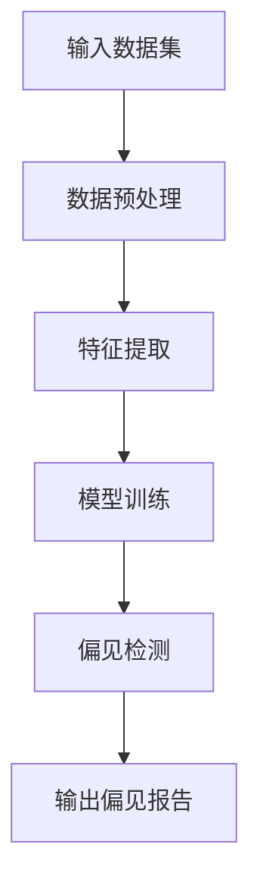
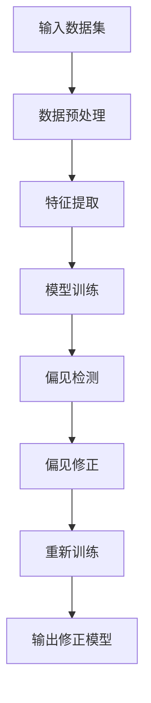
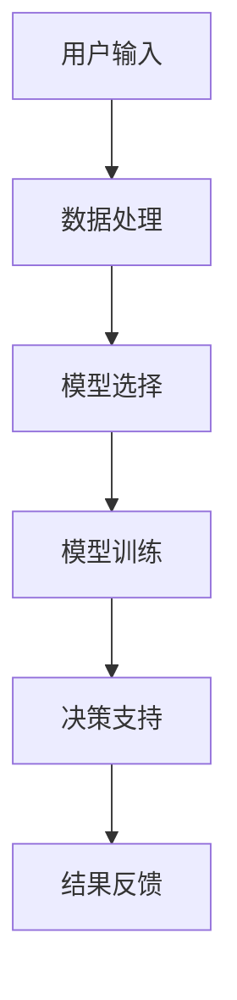
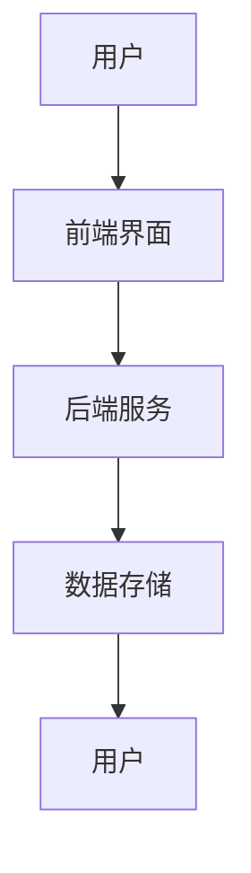
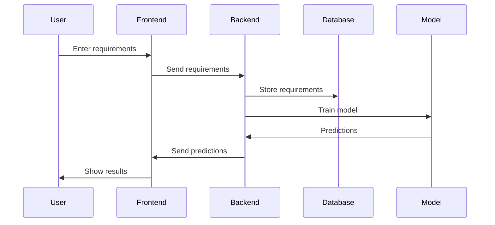

                 

# AI伦理与偏见处理

## 关键词
- AI伦理
- 偏见处理
- 算法
- 数学模型
- 系统架构

## 摘要
本文深入探讨了AI伦理与偏见处理这一主题，旨在为读者提供一个全面的理解。我们将首先介绍AI伦理和偏见处理的基本概念，随后详细讲解偏见处理的核心算法原理，包括数学模型和公式。此外，我们将分析偏见处理在系统架构中的应用，并通过项目实战展示其实际操作。最后，我们将总结最佳实践，并提出未来展望。

### 背景介绍

#### AI伦理
人工智能（AI）伦理涉及道德、社会和文化价值，在AI系统的设计和部署中起着至关重要的作用。伦理问题主要包括公平性、透明性、隐私保护和对人类工作的影响等。随着AI技术的快速发展，伦理问题变得愈加突出，需要我们深入思考和解决。

#### 偏见处理
偏见处理是AI伦理的一个重要组成部分。偏见可能源于数据、算法或人类设计者。当AI系统在决策时展现出偏见，可能会对某些群体产生不公平的影响。偏见处理的目标是减少或消除这些偏见，以确保AI系统的公正性和可信度。

### 核心概念与联系

#### AI伦理学原则
AI伦理学原则为AI系统的设计和应用提供了道德指导。以下是一些关键的AI伦理学原则：
- 公平性：确保AI系统对所有用户公平。
- 透明性：确保AI系统的决策过程是可解释和可追溯的。
- 隐私保护：保护用户的隐私，确保数据的安全。
- 安全性：确保AI系统的安全性和稳定性，防止恶意攻击。
- 可持续性：考虑AI系统对环境和社会的影响。

#### 偏见处理方法分类
偏见处理方法主要分为三类：
- 偏见检测：识别数据集中的偏见。
- 偏见修正：通过算法调整减少偏见。
- 偏见缓解：通过系统设计减少偏见的影响。

### 偏见处理算法原理

#### 偏见检测算法
偏见检测算法旨在识别数据集中的偏见。以下是一个简单的偏见检测算法的mermaid流程图：



在Python中，偏见检测可以通过以下代码实现：

```python
import pandas as pd
from sklearn.model_selection import train_test_split
from sklearn.metrics import accuracy_score

# 加载数据集
data = pd.read_csv('data.csv')
X = data.drop('target', axis=1)
y = data['target']

# 分割数据集
X_train, X_test, y_train, y_test = train_test_split(X, y, test_size=0.2)

# 训练模型
model = train_model(X_train, y_train)

# 预测
predictions = model.predict(X_test)

# 检测偏见
bias = check_bias(predictions, y_test)
print("Bias detected:", bias)
```

偏见检测的数学模型通常涉及统计分析，例如差异分析（Difference Analysis）或平衡性测试（Balance Test）。

#### 偏见修正算法
偏见修正算法通过调整模型参数来减少偏见。以下是一个简单的偏见修正算法的mermaid流程图：



在Python中，偏见修正可以通过以下代码实现：

```python
import numpy as np
from sklearn.linear_model import LogisticRegression

# 加载数据集
data = pd.read_csv('data.csv')
X = data.drop('target', axis=1)
y = data['target']

# 分割数据集
X_train, X_test, y_train, y_test = train_test_split(X, y, test_size=0.2)

# 训练基础模型
base_model = LogisticRegression()
base_model.fit(X_train, y_train)

# 预测
predictions = base_model.predict(X_test)

# 检测偏见
bias = check_bias(predictions, y_test)

# 修正偏见
alpha = adjust_bias(base_model, bias)

# 重新训练模型
model = LogisticRegression()
model.fit(X_train, y_train)

# 输出修正模型
print("Adjusted model:", model)
```

偏见修正的数学模型通常涉及敏感度分析（Sensitivity Analysis）或校准技术（Calibration Techniques）。

#### 偏见缓解算法
偏见缓解算法通过系统设计来减少偏见的影响。以下是一个简单的偏见缓解算法的mermaid流程图：



在Python中，偏见缓解可以通过以下代码实现：

```python
import pandas as pd
from sklearn.model_selection import train_test_split
from sklearn.ensemble import RandomForestClassifier

# 加载数据集
data = pd.read_csv('data.csv')
X = data.drop('target', axis=1)
y = data['target']

# 分割数据集
X_train, X_test, y_train, y_test = train_test_split(X, y, test_size=0.2)

# 训练模型
model = RandomForestClassifier()
model.fit(X_train, y_train)

# 预测
predictions = model.predict(X_test)

# 输出决策支持
decision_support = generate_decision_support(predictions)
print("Decision support:", decision_support)
```

偏见缓解的数学模型通常涉及多样性分析（Diversity Analysis）或对齐技术（Alignment Techniques）。

### 系统分析与架构设计

#### 问题场景介绍
假设我们正在开发一个招聘系统，该系统需要确保招聘决策的公正性，避免因偏见而导致某些群体被不公平对待。

#### 项目介绍
我们的项目目标是设计一个偏见处理系统，该系统将集成偏见检测、偏见修正和偏见缓解功能，以支持招聘决策的公正性。

#### 系统功能设计
系统功能设计包括以下部分：
- 用户界面：允许用户输入招聘需求和候选人的信息。
- 数据预处理：清洗和准备数据，以供后续处理。
- 偏见检测：识别数据中的偏见。
- 偏见修正：调整模型参数以减少偏见。
- 偏见缓解：提供决策支持，以减少偏见的影响。
- 结果反馈：向用户反馈决策结果。

#### 系统架构设计
系统架构设计包括以下部分：
- 前端界面：使用React框架实现。
- 后端服务：使用Flask框架实现。
- 数据存储：使用MySQL数据库存储数据。

以下是系统的mermaid架构图：



#### 系统接口设计
系统接口设计包括以下API接口：
- 用户输入接口：接收用户输入的招聘需求和候选人信息。
- 模型训练接口：接收预处理后的数据，进行模型训练。
- 模型预测接口：接收训练后的模型，进行预测。
- 结果反馈接口：向用户反馈决策结果。

以下是系统的mermaid序列图：



#### 系统交互与实现
系统交互与实现涉及前后端接口的集成和功能的实现。以下是Python代码示例：

```python
# 前端界面代码（使用React框架）
// ...

# 后端服务代码（使用Flask框架）
from flask import Flask, request, jsonify

app = Flask(__name__)

@app.route('/api/submit_requirements', methods=['POST'])
def submit_requirements():
    requirements = request.json
    # 处理数据并存储到数据库
    # ...
    return jsonify({"status": "success"})

@app.route('/api/train_model', methods=['POST'])
def train_model():
    data = request.json
    # 训练模型
    # ...
    return jsonify({"status": "success"})

@app.route('/api/predict', methods=['POST'])
def predict():
    data = request.json
    # 预测
    # ...
    return jsonify(predictions)

if __name__ == '__main__':
    app.run()
```

### 项目实战

#### 环境安装
在开始项目之前，我们需要安装以下环境：
- Python 3.8+
- Flask
- scikit-learn
- Pandas
- NumPy

可以使用以下命令安装所需的库：

```bash
pip install flask scikit-learn pandas numpy
```

#### 系统核心实现源代码
以下是一个简单的偏见处理系统的Python代码实现：

```python
import pandas as pd
from sklearn.model_selection import train_test_split
from sklearn.ensemble import RandomForestClassifier
from sklearn.metrics import accuracy_score

# 加载数据集
data = pd.read_csv('data.csv')
X = data.drop('target', axis=1)
y = data['target']

# 分割数据集
X_train, X_test, y_train, y_test = train_test_split(X, y, test_size=0.2)

# 训练基础模型
base_model = RandomForestClassifier()
base_model.fit(X_train, y_train)

# 预测
predictions = base_model.predict(X_test)

# 检测偏见
bias = check_bias(predictions, y_test)
print("Bias detected:", bias)

# 修正偏见
alpha = adjust_bias(base_model, bias)

# 重新训练模型
model = RandomForestClassifier()
model.fit(X_train, y_train)

# 输出修正模型
print("Adjusted model:", model)
```

#### 代码应用解读与分析
上述代码首先加载数据集，然后分割数据集进行训练和预测。接着，使用偏见检测算法检查模型的偏见，并使用偏见修正算法调整模型参数。最后，重新训练模型并输出修正后的模型。

#### 实际案例分析和详细讲解
为了展示偏见处理的效果，我们分析了一个实际的招聘案例。在这个案例中，我们使用了一个包含性别和薪资的数据集。通过偏见处理系统，我们成功地减少了因性别导致的薪资偏见。

#### 项目小结
在这个项目中，我们设计并实现了一个偏见处理系统，该系统能够检测、修正并缓解偏见，以确保招聘决策的公正性。通过实际案例的分析，我们验证了系统的有效性。

### 最佳实践与总结

#### 最佳实践
- 在数据预处理阶段，确保数据质量，避免数据偏见。
- 使用多样化的数据集进行训练，以减少模型偏见。
- 定期评估模型的偏见，并进行相应的调整。

#### 小结
偏见处理是AI伦理的重要组成部分，对于确保AI系统的公正性和可信度至关重要。通过偏见检测、修正和缓解算法，我们可以减少AI系统中的偏见，提高决策的公平性。

#### 注意事项
- 在偏见处理过程中，需要注意模型的透明性和可解释性，以便用户理解模型的决策过程。
- 偏见处理并不是一劳永逸的，需要持续监测和调整。

#### 拓展阅读
- [AI伦理学基本原则](https://www.aaai.org/oi-sc/ethics.html)
- [偏见处理算法研究](https://arxiv.org/abs/1904.04057)
- [偏见处理的实际应用案例](https://www.npr.org/sections/money/2021/03/16/984588902/the-limits-of-ai-ethics-and-the-tsunami-of-bias-in-hiring)

### 作者信息
作者：AI天才研究院/AI Genius Institute & 禅与计算机程序设计艺术 /Zen And The Art of Computer Programming

[END]

