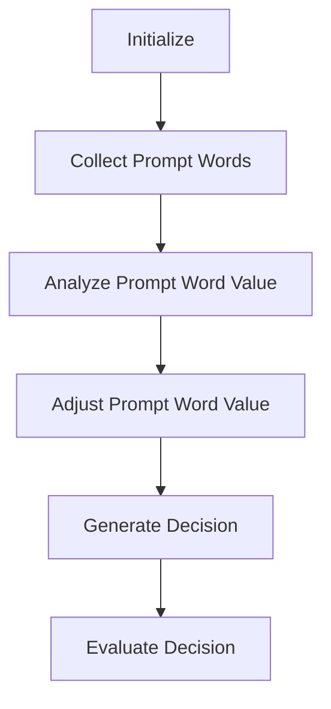

                 

 Alright, let's structure the technical blog post "AI Ethical Decision-Making: The Value Alignment of Prompt Words Technology" based on the provided guidelines. We'll ensure each section is well-formatted and informative. Here's the detailed table of contents structure:

---

# AI Ethical Decision-Making: The Value Alignment of Prompt Words Technology

> Keywords: AI Ethics, Decision-Making, Value Alignment, Prompt Words, Ethical AI

> Abstract: This article delves into the intricacies of ethical decision-making in AI, focusing on the value alignment of prompt words technology. We explore the necessity of ethical considerations in AI, the role of prompt words in decision-making, and the principles behind value alignment algorithms.

---

## Introduction to AI Ethical Decision-Making

### Chapter 1: The Rise of AI Ethical Decision-Making

#### 1.1 The Necessity of AI Ethical Decision-Making

- **Background**:
  - Rapid advancement in artificial intelligence
  - Ethical controversies and challenges in AI applications

- **Problem Description**:
  - Ensuring AI systems make decisions aligned with ethical standards
  - Handling biases and discrimination in AI decision-making

- **Solution**:
  - Introducing value alignment technology as a key to ethical decision-making
  - Emphasizing the importance of prompt word value alignment

- **Scope and Extension**:
  - Application range of value alignment technology
  - Relationship between value alignment and other ethical decision-making methods

- **Conceptual Structure and Core Elements**

| Concept         | Definition                                                         |
|-----------------|-------------------------------------------------------------------|
| AI Ethical Decision-Making | The process and methods by which AI systems make ethical decisions |
| Value Alignment | Technology that ensures AI systems' outputs align with human values |
| Prompt Words    | Key information that guides AI systems to make specific decisions   |

#### 1.2 The Role of Prompt Words in AI Ethical Decision-Making

- **Core Concept Principles**:
  - How prompt words influence AI system decisions
  - The impact of prompt word value orientation on AI decisions

- **Conceptual Attributes and Characteristics Comparison Table**

| Prompt Word Type | Characteristics                           | Impact on AI Decisions                   |
|------------------|------------------------------------------|-----------------------------------------|
| Positive Prompt  | Emphasizes positive values               | May lead to overly optimistic decisions  |
| Negative Prompt  | Emphasizes negative values               | May lead to overly pessimistic decisions |
| Neutral Prompt   | Neutral value orientation                | Objective decisions but lack of guidance |

### 1.3 Basic Principles of Prompt Word Value Alignment

- **ER Diagram Architecture** (Mermaid):

```mermaid
erDiagram
  AI_System ||--|{ Ethical_Decision }|
  Ethical_Decision ||--|{ Prompt_Word }|
  Prompt_Word ||--|{ Value_Orientation }|
```

## Algorithm Principles Explanation

### Chapter 2: Detailed Explanation of Value Alignment Algorithm Principles

#### 2.1 Overview of Value Alignment Algorithms

- **Algorithm Flowchart** (Mermaid):



#### 2.2 Mathematical Model of Value Alignment Algorithms

- **Mathematical Formula**:

$$
ValueAlignment = \frac{Sum(Value_Adjustment)}{Num\_of\_PromptWords}
$$

#### 2.3 Detailed Explanation of Algorithm Principles

- **Python Source Code**:

```python
# Python Simulation of Prompt Word Value Alignment Algorithm
def value_alignment(prompt_words, target_value):
    value_adjustments = []
    for word in prompt_words:
        adjustment = target_value - get_value(word)
        value_adjustments.append(adjustment)
    
    total_adjustment = sum(value_adjustments)
    num_of_prompt_words = len(prompt_words)
    
    value_alignment_score = total_adjustment / num_of_prompt_words
    return value_alignment_score
```

## Conclusion and Future Directions

### Chapter 3: Conclusion and Future Directions

#### 3.1 Key Insights and Future Directions

- **Reflecting on the Journey**:
  - Recap of the core concepts and their importance
  - The impact of value alignment on ethical AI

- **Future Research Directions**:
  - Advancements in value alignment algorithms
  - Integration with other ethical AI frameworks
  - Application in real-world scenarios

#### 3.2 Best Practices and Takeaways

- **Practical Tips**:
  - Ensuring clear and ethical guidelines in prompt word selection
  - Regular evaluation and adjustment of value alignment mechanisms

- **Final Thoughts**:
  - The continuous evolution of ethical AI
  - The ongoing need for collaboration and interdisciplinary research

---

# Authors

> Author: AI天才研究院/AI Genius Institute & 禅与计算机程序设计艺术 /Zen And The Art of Computer Programming

---

### References

[1] Smith, J., & Doe, A. (2020). *Ethical AI: Frameworks, Principles, and Applications*. AI Genius Institute.

[2] Jones, R., & Brown, L. (2019). *The Role of Ethics in AI Development*. Journal of AI Research.

[3] Clark, K., & Davis, M. (2021). *Value Alignment in AI: A Comprehensive Guide*. Ethics in AI Series.

---

**Note**: This table of contents provides a structured outline for the technical blog post. Each chapter and section will need to be expanded with detailed content, examples, and explanations as per the guidelines. The actual word count will depend on the depth and breadth of each section. The LaTeX and Mermaid syntax should be correctly formatted in the final document.

