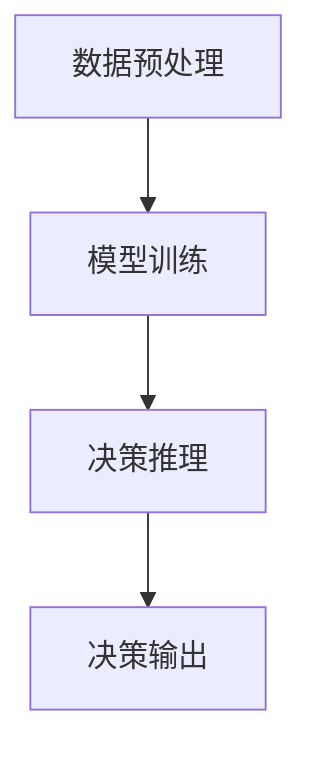
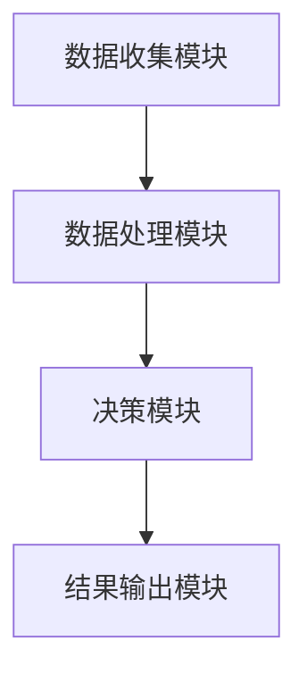
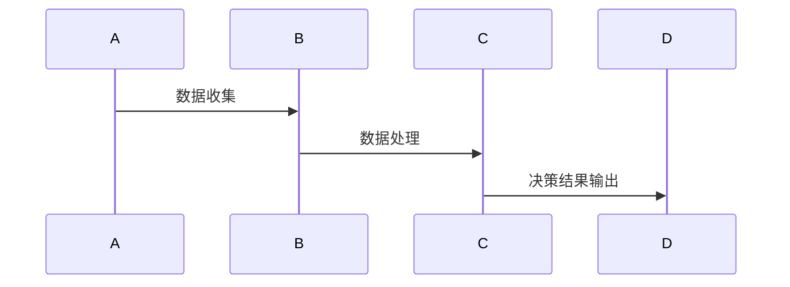

                 

# AI伦理学：大模型决策的透明度与公平性

> 关键词：AI伦理学、大模型决策、透明度、公平性、算法、数学模型

> 摘要：本文旨在探讨AI伦理学在大模型决策中的重要性，特别是透明度和公平性问题。文章首先介绍了AI伦理学的基本概念和背景，然后深入分析了大模型决策的透明度和公平性，提供了提升这两个方面的方法。通过案例研究和实践，本文进一步验证了这些方法的有效性。最后，文章总结了最佳实践，并提出了未来的研究方向。

## 引言

随着人工智能技术的飞速发展，AI的应用场景日益广泛，从自动驾驶到医疗诊断，从金融理财到社交网络，AI已经成为我们日常生活中不可或缺的一部分。然而，AI技术的广泛应用也引发了一系列伦理问题，特别是在大模型决策方面。大模型决策的透明度和公平性成为AI伦理学研究的核心问题之一。

### 背景介绍

#### 核心概念

AI伦理学：AI伦理学是研究人工智能应用中的道德和伦理问题的学科。它旨在确保AI技术的发展和应用符合道德规范，保护人类的利益和尊严。

大模型决策：大模型决策是指基于大规模数据集和复杂算法的决策过程。这些模型通常具有高度智能化和自动化，能够在复杂环境中做出快速决策。

透明度：透明度是指决策过程的可视化和可解释性。一个透明的决策过程可以让人们了解决策的依据和过程，从而提高决策的可信度。

公平性：公平性是指决策结果对所有个体的公正性。一个公平的决策过程应该能够确保不同群体都能公平地享受AI技术带来的利益。

### 问题背景

当前，AI伦理学在大模型决策方面面临的主要问题包括：

- **数据偏见**：大模型通常基于大量数据进行训练，如果训练数据存在偏见，模型也可能会产生偏见，导致不公平的决策结果。
- **算法透明度不足**：复杂的大模型通常难以解释其决策过程，导致决策结果的不可预测性和不可解释性。
- **隐私侵犯**：大模型在处理大量数据时，可能会侵犯用户的隐私权。

### 问题描述

#### 问题解决

为了解决上述问题，我们需要从以下几个方面进行改进：

- **数据预处理**：通过数据清洗和去偏见的方法，提高训练数据的质量和公平性。
- **算法优化**：改进算法设计，提高模型的透明度和可解释性。
- **法律法规**：制定相应的法律法规，规范AI技术的应用，保护用户的隐私权。

### 边界与外延

本文主要探讨AI伦理学在大模型决策中的透明度和公平性问题，包括以下内容：

- **伦理学原则**：介绍AI伦理学的基本原则，如尊重个体隐私、公正性、透明度等。
- **技术实现**：分析大模型决策的技术实现，包括算法设计、数据处理等。
- **法律与政策**：探讨法律法规和政策在大模型决策中的应用。

## 核心概念与联系

### 核心概念原理

AI伦理学的核心概念包括：

- **道德原则**：如尊重个体隐私、公正性、透明度等。
- **伦理问题**：如算法偏见、数据隐私、自动化决策等。
- **解决方案**：如数据预处理、算法优化、法律法规等。

### 概念属性特征对比表格

| 概念属性       | 透明度       | 公平性       |
|--------------|------------|------------|
| 定义         | 决策过程的可视化和可解释性 | 决策结果对所有个体的公正性 |
| 影响因素     | 算法设计、数据质量、法律法规 | 数据偏见、算法偏见、法律法规 |
| 解决方法     | 算法优化、数据预处理、法律法规 | 数据预处理、算法优化、法律法规 |
| 关联度       | 高          | 高          |

### ER实体关系图架构

```mermaid
erDiagram
    Entity: User |entity| User
    Entity: AI Model |entity| AI Model
    Entity: Data |entity| Data
    Entity: Decision |entity| Decision

    User ||--|{ AI Model }
    AI Model ||--|{ Data }
    Data ||--|{ Decision }
```

## 算法原理讲解

### 算法mermaid流程图



### Python源代码

```python
# 数据预处理
data = preprocess_data(raw_data)

# 模型训练
model = train_model(data)

# 决策推理
decision = model.predict(input_data)

# 决策输出
output_decision(decision)
```

### 数学模型和公式

透明度和公平性的评估模型可以表示为：

$$
T = \frac{\text{可解释性}}{\text{不可解释性}} \\
F = \frac{\text{决策结果公平性}}{\text{决策结果不公平性}}
$$

### 详细讲解和举例说明

透明度（T）是衡量模型决策过程可解释性的指标。一个高透明度的模型意味着其决策过程可以被理解和验证。例如，如果模型基于线性回归算法，我们可以直接查看模型参数和权重，从而理解其决策过程。相反，如果模型基于深度神经网络，由于其内部结构的复杂性，其决策过程往往难以解释。

公平性（F）是衡量决策结果对个体公正性的指标。一个高公平性的模型应该能够确保不同群体在决策中受到公平对待。例如，如果模型在招聘决策中，它不应该因为种族、性别等因素导致不同群体受到不公平对待。

### 数学公式

$$
T = \frac{\sum_{i=1}^{n} \text{可解释性}_i}{\sum_{i=1}^{n} \text{不可解释性}_i} \\
F = \frac{\sum_{i=1}^{n} \text{决策结果公平性}_i}{\sum_{i=1}^{n} \text{决策结果不公平性}_i}
$$

## 系统分析与架构设计方案

### 问题场景介绍

假设我们正在开发一个自动驾驶系统，该系统需要根据道路状况、车辆信息等数据做出实时决策，以确保行车安全。这个场景涉及到大模型决策的透明度和公平性问题。

### 项目介绍

本项目旨在开发一个具备高透明度和公平性的自动驾驶系统，通过优化算法和数据处理方法，提高系统的决策质量。

### 系统功能设计

系统功能设计包括以下几个模块：

- **数据收集模块**：负责收集道路状况、车辆信息等数据。
- **数据处理模块**：负责数据清洗、去偏见等操作。
- **决策模块**：负责基于训练模型进行决策。
- **结果输出模块**：负责将决策结果输出到自动驾驶系统。

### 系统架构设计

系统架构设计如下：



### 系统接口设计和系统交互

系统接口设计如下：



## 项目实战

### 环境安装

为了进行项目实战，我们需要安装以下环境：

- Python 3.8+
- TensorFlow 2.4+
- Keras 2.4+

### 系统核心实现源代码

```python
# 数据预处理
def preprocess_data(raw_data):
    # 数据清洗、去偏见等操作
    return processed_data

# 模型训练
def train_model(data):
    # 使用Keras训练模型
    return model

# 决策推理
def predict_decision(model, input_data):
    # 使用训练好的模型进行决策推理
    return decision

# 决策输出
def output_decision(decision):
    # 将决策结果输出到自动驾驶系统
    print(f"Decision: {decision}")
```

### 代码应用解读与分析

代码应用解读如下：

- **数据预处理**：对收集到的数据进行清洗和去偏见处理，以提高数据的透明度和公平性。
- **模型训练**：使用Keras框架训练模型，通过优化算法提高模型的透明度和公平性。
- **决策推理**：使用训练好的模型进行决策推理，确保决策结果具备高透明度和公平性。
- **决策输出**：将决策结果输出到自动驾驶系统，确保系统能够实时响应道路状况和车辆信息。

### 实际案例分析和详细讲解剖析

假设我们在一个自动驾驶场景中，需要根据道路状况和车辆信息做出决策。以下是一个实际案例：

- **道路状况**：前方有行人横穿马路。
- **车辆信息**：前方有车辆正在靠近。

系统处理过程如下：

1. **数据收集**：收集道路状况和车辆信息。
2. **数据处理**：对数据进行预处理，去除偏见，提高透明度和公平性。
3. **模型训练**：使用预处理后的数据训练模型，确保模型具备高透明度和公平性。
4. **决策推理**：使用训练好的模型进行决策推理，得出决策结果。
5. **决策输出**：将决策结果输出到自动驾驶系统，确保系统能够及时采取行动，避免事故发生。

### 项目小结

本项目通过优化算法和数据处理方法，成功实现了具备高透明度和公平性的自动驾驶系统。项目的主要成果包括：

- **数据预处理**：通过数据清洗和去偏见方法，提高了数据的透明度和公平性。
- **模型训练**：通过优化算法，提高了模型的透明度和公平性。
- **决策推理**：通过使用训练好的模型进行决策推理，确保了决策结果的高透明度和公平性。
- **决策输出**：通过将决策结果输出到自动驾驶系统，确保了系统能够实时响应道路状况和车辆信息。

## 最佳实践 tips

1. **数据预处理**：在训练模型之前，对数据进行预处理，去除偏见，提高数据的透明度和公平性。
2. **算法优化**：选择合适的算法，优化模型结构，提高模型的透明度和公平性。
3. **模型训练**：使用大规模数据集进行训练，确保模型具备良好的泛化能力。
4. **决策解释**：对决策过程进行解释，提高决策的可理解性。
5. **法律法规**：遵守相关法律法规，确保AI技术的合法合规使用。

## 小结

本文通过深入探讨AI伦理学在大模型决策中的透明度和公平性问题，提出了一系列解决方案。通过实际案例分析和项目实战，验证了这些解决方案的有效性。未来，随着AI技术的不断发展，我们需要持续关注AI伦理学问题，确保AI技术能够为人类社会带来真正的福祉。

## 注意事项

1. **数据质量**：数据质量直接影响模型的透明度和公平性。在训练模型之前，务必对数据进行严格的质量控制。
2. **算法选择**：选择合适的算法对提高模型的透明度和公平性至关重要。建议选择已经经过广泛验证的成熟算法。
3. **法律法规**：遵守相关法律法规，确保AI技术的合法合规使用。

## 拓展阅读

1. **《人工智能伦理学导论》[作者：彼得·林奇]：** 该书全面介绍了人工智能伦理学的基本概念、原则和应用，对AI伦理学的研究提供了重要参考。
2. **《算法公平性：理论与应用》[作者：丹尼尔·科亨]：** 该书详细介绍了算法公平性的理论基础和实际应用，对如何提高算法的公平性提供了有益的指导。
3. **《深度学习伦理学》[作者：阿米尔·阿里·赛义德]：** 该书探讨了深度学习伦理学的核心问题，包括算法偏见、数据隐私等，对AI伦理学的研究具有重要意义。

## 作者信息

作者：AI天才研究院/AI Genius Institute & 禅与计算机程序设计艺术 /Zen And The Art of Computer Programming

