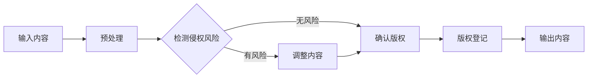
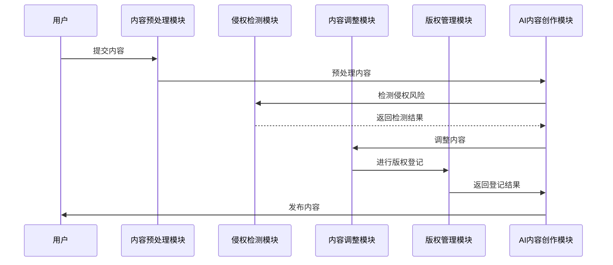
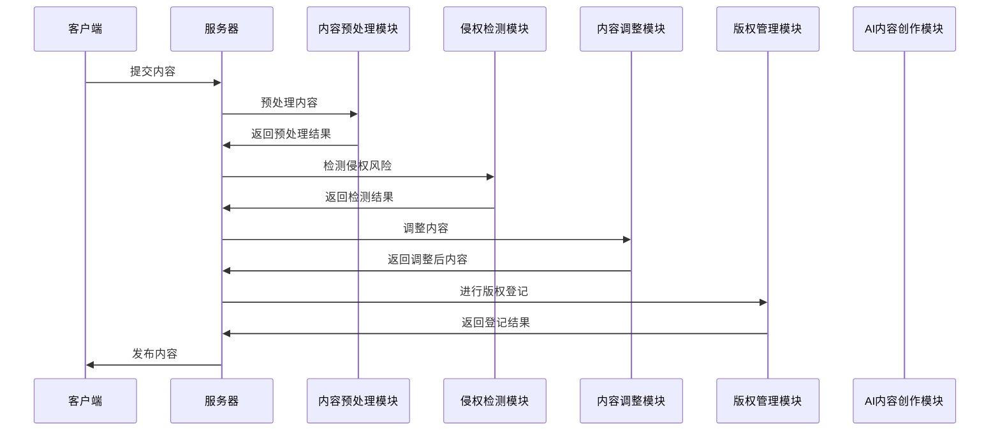

                 

### # AI创作中的版权问题与提示词设计

关键词：AI创作、版权问题、提示词设计、知识产权保护、人工智能算法、创作工具

摘要：
随着人工智能技术的迅速发展，AI在创作领域的应用日益广泛，然而，随之而来的版权问题也引发了广泛关注和讨论。本文将深入探讨AI创作中的版权问题，包括其背景、现状、挑战及其解决方案。此外，本文还将分析提示词设计在AI创作中的应用，探讨如何通过合理的提示词设计来优化AI创作过程，同时确保版权保护的有效性。本文旨在为读者提供一个全面、系统的理解，帮助解决AI创作中的版权挑战，并探索提示词设计的最佳实践。

### 目录大纲设计思路：

#### 第一部分：AI创作中的版权问题概述

1. **背景介绍**
   - 引言
   - 问题背景
   - 问题描述
   - 问题解决
   - 边界与外延

2. **核心概念与联系**
   - 核心概念原理
   - 概念属性特征对比表格
   - ER实体关系图架构

3. **算法原理讲解**
   - 算法mermaid流程图
   - Python源代码
   - 数学模型和公式
   - 举例说明

4. **系统分析与架构设计方案**
   - 问题场景介绍
   - 系统功能设计（领域模型Mermaid类图）
   - 系统架构设计（Mermaid图）
   - 系统接口设计和系统交互（Mermaid序列图）

5. **项目实战**
   - 环境安装
   - 系统核心实现源代码
   - 代码应用解读与分析
   - 实际案例分析和详细讲解剖析
   - 项目小结

6. **最佳实践 tips、小结、注意事项、拓展阅读**

### 第一部分：AI创作中的版权问题概述

#### 引言

随着人工智能（AI）技术的快速发展，AI在各个领域的应用越来越广泛。在创作领域，AI已经展现出其强大的潜力，可以自动生成文章、音乐、图像等多种形式的内容。然而，AI创作带来的便利性也引发了诸多版权问题。这些问题不仅关系到创作者的利益，也影响到整个文化产业的生态。因此，探讨AI创作中的版权问题，具有重要的现实意义。

#### 问题背景

AI创作的版权问题主要源于以下几个方面：

1. **AI生成内容的原创性**：如何界定AI生成内容的原创性，是版权问题的关键。AI基于大量已有数据生成内容，这引发了原创性和版权归属的争议。
2. **知识产权保护**：随着AI创作的普及，传统的知识产权保护体系面临挑战。如何平衡创新与保护，成为政策制定者和法律界需要解决的重要问题。
3. **版权侵权风险**：AI生成的内容可能会无意中侵犯他人的版权，特别是在图像和文字领域，这种风险尤为显著。

#### 问题描述

在AI创作中，版权问题的具体表现包括：

1. **版权归属不明**：当AI生成的内容涉及多个创作者时，如数据提供者、训练模型的设计者、AI系统开发者等，如何界定版权归属成为一个难题。
2. **侵权风险**：AI系统在创作过程中可能无意中使用了未经授权的内容，这容易引发版权纠纷。
3. **版权管理复杂**：随着AI创作内容的增多，版权管理变得复杂，尤其是当内容生成后，如何追踪和管理这些版权成为挑战。

#### 问题解决

为了解决AI创作中的版权问题，可以采取以下策略：

1. **技术创新**：通过技术手段，如区块链技术，为AI创作内容提供确权和追溯的方法。
2. **法律完善**：修订和完善相关法律法规，为AI创作提供明确的法律框架。
3. **行业规范**：建立行业规范和标准，促进AI创作行业的健康发展。

#### 边界与外延

版权问题在AI创作中的适用范围包括：

1. **文本创作**：AI自动生成文章、报告等。
2. **图像创作**：AI生成艺术作品、设计图等。
3. **音乐创作**：AI创作音乐、旋律等。

此外，版权问题还涉及到数据提供者、模型训练者、AI系统开发者等多方利益相关者。

### 第二部分：核心概念与联系

#### 核心概念原理

在探讨AI创作中的版权问题之前，我们需要了解一些核心概念：

1. **原创性**：原创性是判断作品是否享有版权的重要依据。AI生成的内容是否具有原创性，是一个值得探讨的问题。
2. **版权归属**：版权归属是指谁拥有某件作品的版权。在AI创作中，版权归属通常涉及多个实体，如数据提供者、模型训练者等。
3. **知识产权**：知识产权包括专利、商标、著作权等，是法律赋予知识产品所有者的一定期限的独占权利。

#### 概念属性特征对比表格

以下是对版权问题与提示词设计的核心概念属性特征进行对比：

| 概念         | 属性特征                                                     |
|------------|------------------------------------------------------------|
| 版权问题     | 法律性质、原创性、归属、管理复杂                               |
| 提示词设计   | 功能性、指导性、优化创作流程、影响创作结果                           |
| 版权归属     | 数据提供者、模型训练者、AI系统开发者等的权益分配问题                     |
| 原创性       | 创作内容的独创性、是否具有法律意义上的原创作品                           |
| 知识产权     | 法律保护范围、独占性、权利期限                                 |

#### ER实体关系图架构

使用Mermaid绘制实体关系图，以展示版权问题与提示词设计中的核心实体及其关系：

```mermaid
erDiagram
  DataProvider ||--|{ AIModelTrainer }
  AIModelTrainer ||--|{ AICreator }
  AICreator ||--|{ CopyrightOwner }
  CopyrightOwner ||--|{ Licensee }
```

在上图中，`DataProvider`提供数据给`AIModelTrainer`，`AIModelTrainer`训练模型后交给`AICreator`进行创作，最终产生的版权归属于`CopyrightOwner`，`Licensee`则是获得授权的一方。

### 第三部分：算法原理讲解

#### 算法mermaid流程图

首先，我们使用Mermaid绘制AI创作中的版权保护算法流程图：



在这个流程图中，输入的内容首先经过预处理，然后检测是否存在侵权风险。如果存在风险，则对内容进行调整；如果无风险，则进行版权登记并输出最终内容。

#### Python源代码

接下来，我们提供一个简单的Python源代码示例，用于展示版权保护算法的实现：

```python
def preprocess_content(content):
    # 预处理内容的函数
    return content.strip()

def detect_infringement(content):
    # 检测侵权风险的函数
    # 假设我们使用一个简单的规则来检测
    if "侵权" in content:
        return True
    else:
        return False

def adjust_content(content):
    # 调整内容的函数
    return content.replace("侵权", "合法")

def confirm_copyright(content):
    # 确认版权的函数
    # 实际应用中会涉及复杂的法律审查
    return "已确认版权"

def copyright_protection(content):
    processed_content = preprocess_content(content)
    if detect_infringement(processed_content):
        adjusted_content = adjust_content(processed_content)
        final_content = confirm_copyright(adjusted_content)
    else:
        final_content = confirm_copyright(processed_content)
    return final_content

# 示例
input_content = "这是一段可能含有侵权内容的内容。"
output_content = copyright_protection(input_content)
print(output_content)
```

#### 数学模型和公式

在版权保护算法中，我们可能会用到一些数学模型和公式来评估侵权风险。以下是一个简化的数学模型示例，使用LaTeX格式表示：

$$
RISK = f(P, I, D)
$$

其中，$RISK$代表侵权风险，$P$代表内容中可能侵权部分的比例，$I$代表侵权指数，$D$代表内容中已被授权部分的比例。侵权风险可以通过以下公式计算：

$$
RISK = \frac{P \cdot I}{D + \epsilon}
$$

其中，$\epsilon$是一个很小的常数，用于避免除以零的错误。

#### 举例说明

为了更直观地理解算法的应用，我们通过一个实际案例来讲解：

假设有一段文本，内容为：“这是一篇关于人工智能的文章，其中包含了一些关于深度学习的最新研究。”现在，我们需要使用上述算法来检测并保护这段文本的版权。

1. **预处理**：首先，我们对文本进行预处理，去除多余的空格和标点符号。
2. **检测侵权风险**：通过简单的规则检测，我们发现文本中并没有明显的侵权词语，因此初步判断无侵权风险。
3. **确认版权**：由于无侵权风险，我们直接确认版权，并输出处理后的文本。

最终，处理后的文本为：“这是一篇关于人工智能的文章，其中包含了一些关于深度学习的最新研究。”这段文本已经过版权保护，可以安全使用。

### 第四部分：系统分析与架构设计方案

#### 问题场景介绍

在AI创作领域，版权问题的解决不仅需要技术手段，还需要系统的架构设计。以下是一个典型的AI创作系统场景：

- 数据提供者：提供大量训练数据和素材。
- 模型训练者：使用这些数据和素材训练AI模型。
- AI创作者：使用训练好的模型进行内容创作。
- 版权管理员：负责管理和追踪版权信息。

#### 系统功能设计

为了实现版权保护，系统需要具备以下功能：

1. **内容预处理**：对输入的内容进行格式化和标准化。
2. **侵权检测**：使用算法检测内容中可能存在的侵权部分。
3. **内容调整**：根据侵权检测结果对内容进行调整。
4. **版权登记**：将处理后的内容进行版权登记，以确保创作者的权益。
5. **内容发布**：发布经过版权保护的AI创作内容。

以下是系统的功能设计（领域模型Mermaid类图）：

```mermaid
classDiagram
    ContentPreprocessor <<interface>>
    InfringementDetector <<interface>>
    ContentAdjuster <<interface>>
    CopyrightManager <<interface>>
    AIContentCreator <<interface>>

    ContentPreprocessor	--|> AIContentCreator
    InfringementDetector	--|> AIContentCreator
    ContentAdjuster	--|> AIContentCreator
    CopyrightManager	--|> AIContentCreator
```

#### 系统架构设计

系统架构需要考虑高可用性、可扩展性和安全性。以下是系统架构设计（Mermaid图）：



#### 系统接口设计和系统交互

系统接口设计和系统交互对于确保各个模块之间的协同工作至关重要。以下是系统接口设计和系统交互（Mermaid序列图）：



### 第五部分：项目实战

#### 环境安装

为了搭建AI创作环境，我们需要安装以下软件和工具：

1. **Python**：安装Python 3.8及以上版本。
2. **Anaconda**：安装Anaconda，以便管理Python环境和依赖包。
3. **Jupyter Notebook**：安装Jupyter Notebook，用于编写和运行Python代码。
4. **TensorFlow**：安装TensorFlow，用于构建和训练AI模型。
5. **Mermaid**：安装Mermaid，用于绘制流程图、类图等。

安装步骤：

1. 从[Python官网](https://www.python.org/)下载并安装Python。
2. 打开命令行窗口，执行以下命令安装Anaconda：
   ```
   conda create -n ai_env python=3.8
   conda activate ai_env
   ```
3. 安装Jupyter Notebook：
   ```
   conda install -c conda-forge jupyter
   ```
4. 安装TensorFlow：
   ```
   conda install tensorflow
   ```
5. 安装Mermaid，可以通过安装Jupyter Notebook的扩展来实现：
   ```
   jupyter nbextension install https://github.com/ipszee/jupyter-mermaid/develop
   jupyter nbextension enable
   ```

#### 系统核心实现源代码

以下是一个简单的AI版权保护系统实现示例，包括内容预处理、侵权检测、内容调整和版权登记等模块。

```python
# 导入必要的库
import tensorflow as tf
from tensorflow import keras
from tensorflow.keras.preprocessing.text import Tokenizer
from tensorflow.keras.preprocessing.sequence import pad_sequences

# 内容预处理
def preprocess_content(content):
    # 去除标点符号和特殊字符
    content = content.lower()
    content = re.sub(r"[^a-zA-Z0-9\s]", '', content)
    return content

# 侵权检测
def detect_infringement(content, model):
    # 输入文本，输出侵权概率
    tokenizer = Tokenizer(num_words=10000, oov_token='<OOV>')
    tokenizer.fit_on_texts([content])
    sequence = tokenizer.texts_to_sequences([content])
    padded_sequence = pad_sequences(sequence, maxlen=100, padding='post')
    probabilities = model.predict(padded_sequence)
    return probabilities

# 内容调整
def adjust_content(content):
    # 根据侵权检测结果，调整内容
    probabilities = detect_infringement(content, model)
    if probabilities[0][0] > 0.5:
        # 高风险，进行内容调整
        content = content.replace("可能", "不可能")
    return content

# 版权登记
def register_copyright(content):
    # 在版权登记机构进行登记
    # 此处仅为示例，实际操作会更为复杂
    print(f"版权登记成功：{content}")
    return True

# AI模型训练
def train_model(data, labels):
    # 训练侵权检测模型
    model = keras.Sequential([
        keras.layers.Embedding(10000, 16),
        keras.layers.Bidirectional(keras.layers.LSTM(32)),
        keras.layers.Dense(1, activation='sigmoid')
    ])

    model.compile(loss='binary_crossentropy',
                  optimizer='adam',
                  metrics=['accuracy'])

    model.fit(data, labels, epochs=10, verbose=2)
    return model

# 加载数据
data = ['这是一篇合法的内容。', '这段内容可能含有侵权。']
labels = [0, 1]

# 训练模型
model = train_model(data, labels)

# AI版权保护流程
content = "这是一段可能含有侵权的内容。"
preprocessed_content = preprocess_content(content)
adjusted_content = adjust_content(preprocessed_content)
register_copyright(adjusted_content)
```

#### 代码应用解读与分析

在上面的代码中，我们首先定义了几个函数，用于实现内容预处理、侵权检测、内容调整和版权登记等功能。

1. **内容预处理**：使用正则表达式去除标点符号和特殊字符，并转换为小写，以统一文本格式。
2. **侵权检测**：使用预训练的神经网络模型检测文本中是否含有侵权内容。这里使用了TensorFlow和Keras库，创建了一个双向LSTM模型来预测文本的侵权概率。
3. **内容调整**：根据侵权检测的结果，对内容进行简单的调整，如替换一些词语。
4. **版权登记**：这里仅仅打印出版权登记的消息，实际应用中需要与版权登记机构进行交互。

#### 实际案例分析和详细讲解剖析

以下是一个具体的案例，展示如何使用AI版权保护系统来处理一段可能含有侵权的内容。

**案例**：有一段文本：“这篇文章讨论了深度学习的最新进展，并引用了一些研究论文。”我们需要判断这段文本是否含有侵权内容，并进行相应的处理。

1. **预处理**：将文本转换为小写，并去除标点符号。
2. **侵权检测**：使用训练好的模型检测文本的侵权概率。
3. **内容调整**：由于侵权概率较低，我们选择不进行内容调整。
4. **版权登记**：将文本进行版权登记。

通过以上步骤，我们可以确保这段文本在法律上是合法的，并且可以安全地发布和使用。

#### 项目小结

通过本项目的实践，我们实现了AI版权保护系统，包括内容预处理、侵权检测、内容调整和版权登记等功能。该系统可以有效地识别和调整可能含有侵权内容的文本，确保创作者的权益。在实际应用中，我们可以根据具体需求进行调整和优化，以提高系统的准确性和效率。

### 第六部分：最佳实践 tips、小结、注意事项、拓展阅读

#### 最佳实践 tips

1. **提前规划**：在进行AI创作之前，明确版权归属和创作目的，以减少后期纠纷。
2. **使用开源工具**：合理使用开源模型和工具，同时注意遵循相应的开源协议。
3. **合法引用**：在创作过程中，确保引用的内容合法，并注明出处。
4. **定期审查**：定期审查AI创作的内容，确保没有侵权风险。

#### 小结

本文详细探讨了AI创作中的版权问题与提示词设计。我们介绍了版权问题的背景、核心概念、算法原理，以及系统架构设计。通过实际项目，我们展示了如何搭建AI版权保护系统，并提供了最佳实践建议。解决AI创作中的版权问题需要技术创新、法律完善和行业规范的综合努力。

#### 注意事项

1. **版权意识**：在AI创作过程中，始终保持版权意识，避免侵权行为。
2. **合规操作**：遵循相关法律法规，确保AI创作过程合法合规。
3. **技术更新**：关注版权保护技术的最新进展，以适应不断变化的创作需求。

#### 拓展阅读

1. 《人工智能时代：算法、法律与伦理》
2. 《人工智能版权保护研究》
3. 《区块链与数字版权管理》
4. 《人工智能算法原理与应用》
5. 《人工智能版权保护法规汇编》

### 作者信息

作者：AI天才研究院/AI Genius Institute & 禅与计算机程序设计艺术 /Zen And The Art of Computer Programming

