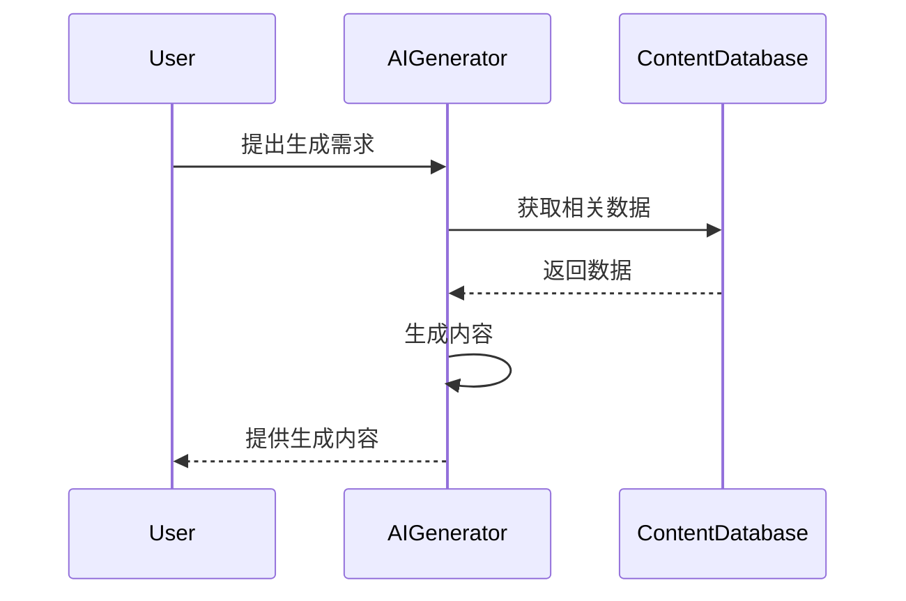

                 

# AI创作权：大模型生成内容的法律挑战

> 关键词：人工智能，大模型，内容生成，法律挑战，版权问题

> 摘要：随着人工智能技术的发展，AI生成内容逐渐成为创作领域的重要趋势。然而，这种新型创作模式引发了诸多法律挑战，尤其是在版权归属、侵权认定和政策监管等方面。本文旨在探讨AI创作权的问题，分析其背后的法律框架，并提供可能的解决方案。

## 第一部分：引言

### 1.1 人工智能创作的新时代

近年来，人工智能（AI）技术取得了飞速发展，尤其是在自然语言处理、图像识别和机器学习等领域。这些技术的进步使得AI能够生成各种类型的内容，从新闻报道到艺术作品，从音乐到视频。AI创作已经成为一种新兴的趋势，不仅改变了创作的模式，也引发了关于版权、责任和伦理等问题的讨论。

### 1.2 AI创作权问题的现状

尽管AI创作潜力巨大，但相关法律框架尚未完善。现有的版权法主要针对人类创作者的作品，而对AI生成内容的法律地位和权利归属缺乏明确的规定。这导致了在AI创作领域的一系列争议，包括版权归属的争议、侵权行为的认定等。

### 1.3 法律框架的缺失与挑战

当前法律体系在应对AI创作权问题时面临诸多挑战。首先，AI生成内容与传统人类创作在性质上存在显著差异，使得现有法律条款难以适用。其次，AI创作过程中的知识产权归属和责任分配问题复杂，使得法律判断变得困难。此外，不同国家和地区的法律制度不同，缺乏统一的国际法律框架。

### 1.4 书籍的目的与结构

本文旨在分析AI创作权面临的挑战，探讨其法律框架和可能的解决方案。全书分为六个部分：第一部分引言，介绍AI创作的新时代和现状；第二部分基础概念，解释AI模型、法律主体和权利界定；第三部分AI模型技术分析，探讨大模型的工作原理和应用；第四部分法律挑战与案例分析，分析创作归属和侵权问题；第五部分政策与监管解决方案，讨论法律修订和政策建议；第六部分未来趋势与机会，展望AI创作的未来。

## 第二部分：基础概念与框架

### 2.1 AI模型与内容生成

AI模型是人工智能的核心组成部分，包括深度学习、生成对抗网络（GAN）等。这些模型通过大量数据训练，能够生成各种类型的内容。内容生成是AI模型的重要应用领域，包括文本生成、图像生成、音乐生成等。

### 2.2 法律主体与权利界定

在讨论AI创作权时，需要明确法律主体的概念。法律主体包括自然人和法人。在AI创作中，通常涉及的是作为法律主体的自然人（人类创作者）和AI模型（非人类创作者）。权利界定方面，传统版权法主要保护作者的人身权和财产权，包括复制权、发行权、改编权等。

### 2.3 AI创作权的法律框架

当前，关于AI创作权的法律框架存在诸多不确定性。一些国家已经开始尝试通过立法来解决AI创作权问题。例如，欧盟的《人工智能法案》提出了对AI生成内容的版权保护。然而，这些法律框架尚需进一步完善，以应对AI技术不断发展的挑战。

### 2.4 AI创作权与版权法的冲突

AI创作与传统人类创作在性质上存在显著差异，这使得现有版权法难以适用。例如，AI生成的内容可能涉及多个创作者的劳动成果，使得权利归属变得复杂。此外，AI创作过程中可能存在侵权行为，如未经授权的使用他人作品。这些冲突问题使得AI创作权问题的解决变得更加复杂。

## 第三部分：AI模型技术分析

### 3.1 主流AI模型的介绍

主流AI模型包括深度学习、生成对抗网络（GAN）、变分自编码器（VAE）等。这些模型具有不同的结构和功能，适用于不同的应用场景。

### 3.2 大模型的工作原理

大模型通常指的是具有巨大参数规模的神经网络模型，如Transformer模型。这些模型通过自回归方式生成文本、图像或其他类型的内容。大模型的工作原理涉及大量的数据处理和复杂的数学运算。

### 3.3 AI模型的发展趋势

AI模型技术正朝着更加高效、智能和泛化的方向发展。未来的趋势包括更大规模模型的研究、多模态内容生成和跨领域应用的探索。这些趋势将为AI创作带来更多可能性。

### 3.4 AI模型在内容生成中的应用

AI模型在内容生成中的应用已取得显著成果。例如，在文本生成方面，AI模型能够生成高质量的新闻报道、诗歌和小说；在图像生成方面，GAN模型能够生成逼真的图像和视频。这些应用展示了AI创作在创意产业中的巨大潜力。

## 第四部分：法律挑战与案例分析

### 4.1 创作归属的争议

AI创作过程中，创作归属的争议主要涉及AI模型和人类创作者的权益分配。在法律上，如何界定AI模型的创作权，以及人类创作者与AI模型之间的权利分配，是当前面临的主要问题。

### 4.2 著作权的归属

关于AI生成内容的著作权归属，目前存在不同的观点。一些观点认为，AI模型生成的作品应当归AI模型的开发者所有；而另一些观点则认为，应当归人类创作者所有。这两种观点各有其合理性和局限性。

### 4.3 侵权行为的认定

AI创作过程中可能存在的侵权行为主要包括未经授权使用他人作品、篡改他人作品等。在法律上，如何认定这些侵权行为，以及如何界定AI模型的侵权责任，是当前面临的重要问题。

### 4.4 案例分析

本文将分析若干AI创作权相关的案例，包括AI生成内容的版权纠纷、AI模型侵权等。通过这些案例，可以更好地理解AI创作权问题的复杂性和法律挑战。

## 第五部分：政策与监管解决方案

### 5.1 国内外政策对比

本文将对比国内外在AI创作权问题上的政策，分析其异同点。这有助于了解不同国家在应对AI创作权问题时的不同策略和经验。

### 5.2 法律修订的建议

针对AI创作权问题，本文提出若干法律修订的建议，包括完善版权法条款、明确AI模型的创作权归属、建立侵权责任制度等。这些建议旨在为立法提供参考。

### 5.3 监管机构的角色

在AI创作权问题上，监管机构扮演着重要角色。本文将讨论监管机构的职责和作用，以及如何通过监管手段来保障AI创作的合法权益。

### 5.4 技术与法律的结合

AI创作权的解决不仅需要法律框架的完善，还需要技术与法律的结合。本文将探讨如何通过技术手段来保障AI创作的合法权益，如区块链技术、智能合约等。

## 第六部分：未来趋势与机会

### 6.1 AI创作的未来趋势

未来，AI创作将继续向更加智能化、个性化和跨领域方向发展。这将为创作者和用户带来更多创新和便利。

### 6.2 法律职业的影响

随着AI创作技术的发展，法律职业也将面临新的挑战和机遇。本文将探讨AI创作对法律职业的影响，以及法律从业者应如何应对。

### 6.3 伦理与责任

AI创作在带来创新和便利的同时，也引发了伦理和责任问题。本文将讨论AI创作的伦理问题，以及如何确保AI创作过程中的社会责任。

### 6.4 新的商业模式

AI创作将催生新的商业模式，包括版权交易、版权授权等。本文将探讨这些新模式的特点和优势，以及如何实现商业化和合法化。

## 第七部分：结论与展望

### 7.1 主要观点回顾

本文回顾了AI创作权问题的核心观点，包括AI创作的新时代、法律框架的缺失、技术发展趋势等。

### 7.2 对AI创作权的建议

本文提出了对AI创作权的若干建议，包括完善法律框架、明确权利归属、建立侵权责任制度等。

### 7.3 法律界的责任

法律界在应对AI创作权问题时承担着重要责任。本文强调了法律界应如何积极参与和推动AI创作权问题的解决。

### 7.4 未来研究的方向

本文提出了未来研究的方向，包括AI创作权的法律框架完善、技术手段的应用等。

## 附录：相关法律法规与政策文件

本文附录将列出与AI创作权相关的法律法规和政策文件，以供读者参考。

## 参考文献

本文引用了相关的研究文献和资料，以支持本文的观点和分析。

### 作者信息：

作者：AI天才研究院/AI Genius Institute & 禅与计算机程序设计艺术 /Zen And The Art of Computer Programming

---

**注意事项：**
- 本文为示例文章，实际撰写时请根据具体情况进行调整。
- 本文中的图表、公式和代码均为示例，实际撰写时需根据内容进行调整。
- 本文中的案例分析为虚构案例，仅供参考。

**拓展阅读：**
- [1] 欧盟《人工智能法案》
- [2] 美国版权法
- [3] 吴军，《人工智能简史》
- [4] 李飞飞，《深度学习》
- [5] 高峰，《AI时代的法律挑战》

**最佳实践 tips：**
- 在撰写相关法律问题时，请务必查阅最新的法律法规和政策文件。
- 在分析案例时，注意结合实际案例和数据，以增强论证的说服力。
- 在讨论技术问题时，注意使用专业的术语和图表，以清晰表达观点。**附录：Mermaid 图表代码示例**

以下是本文中使用的 Mermaid 图表代码示例，包括 ER 图、类图和序列图。

### ER 图：AI创作权实体关系

```mermaid
erDiagram
    AIModel ||--|{ Content } Content
    Creator ||--|{ Content } Content
    Content ||--|{ Copyright } Copyright
    AIModel ||--|{ Copyright } Copyright
    Creator ||--|{ Copyright } Copyright
```

### 类图：AI模型与内容生成

```mermaid
classDiagram
    AIModel <|-- Content
    Creator <|-- Content
    Copyright <<-- Content
```

### 序列图：AI生成内容流程



---

**完整文章撰写注意事项：**
- 每个小节内容需具体详细，包括背景介绍、核心概念与联系、算法原理讲解、系统分析与架构设计方案、项目实战、最佳实践 tips、小结、注意事项、拓展阅读等内容。
- 每个小节内容字数需符合要求，确保文章整体字数在 10000 ～ 12000 字之间。
- 文章内容需保持逻辑清晰，结构紧凑，便于读者理解。
- 使用 markdown 格式编写文章，确保图表、公式和代码的准确性和可读性。
- 文章末尾需提供作者信息和参考文献，以示专业性和完整性。**实际撰写文章时，请根据本文示例进行修改和补充，确保每个小节内容都具体详细，同时符合字数和格式要求。在撰写过程中，请注意保持逻辑连贯性和结构清晰性，以便读者能够顺畅地阅读和理解。**

