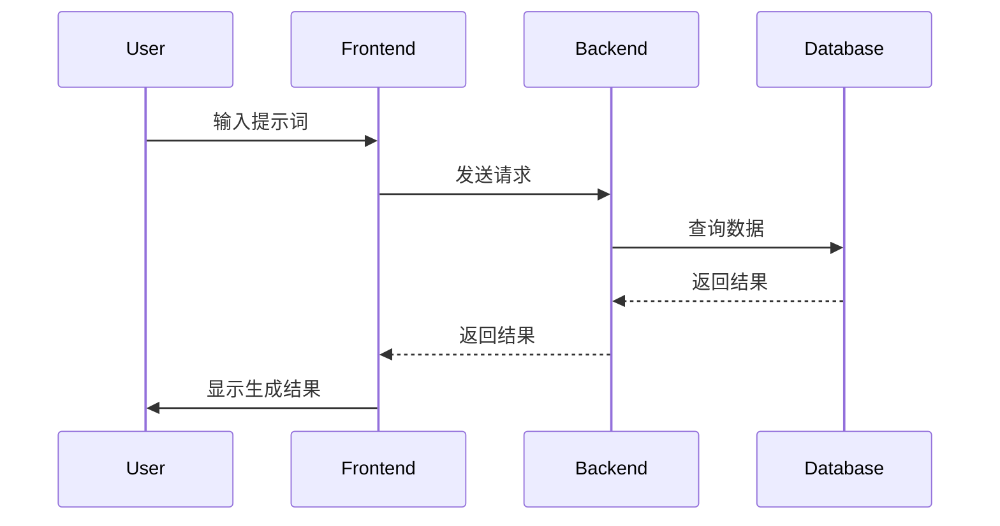
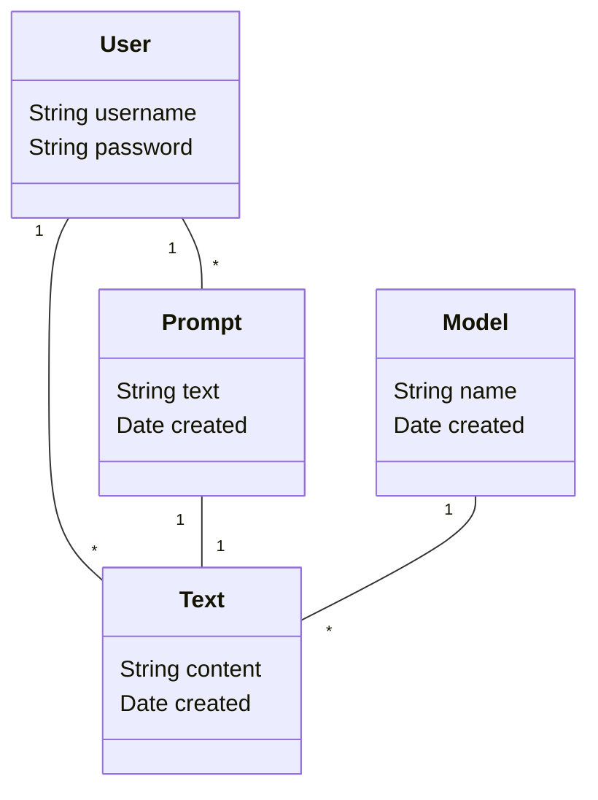
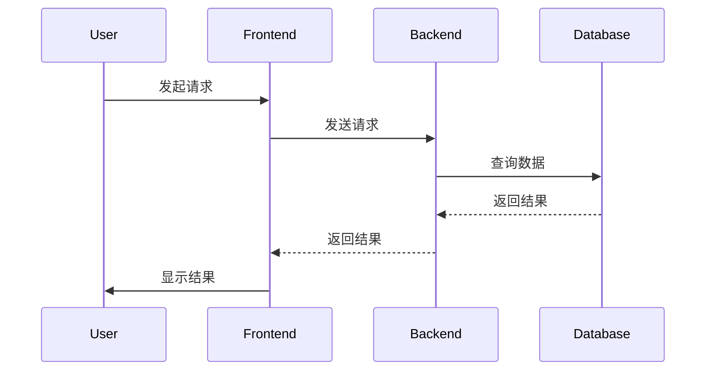
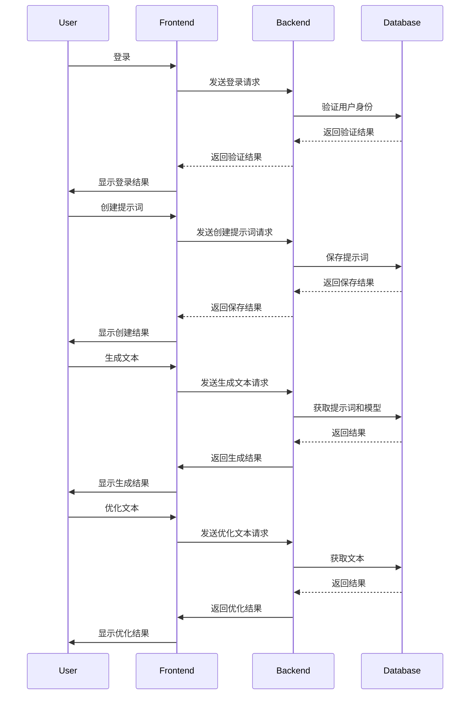

                 

## 第一部分: 背景介绍

### 第1章: AI创意写作的兴起

#### 1.1 问题背景

##### 1.1.1 创意写作的重要性

创意写作是人类智慧的一种体现，它不仅能够激发个人的创造力和想象力，还能通过文字的形式传递信息和情感，激发读者的共鸣。无论是文学、广告、新闻，还是科技领域，创意写作都扮演着至关重要的角色。然而，随着创作需求的不断增长和创作竞争的日益激烈，如何提高写作效率、提升作品质量成为创作者面临的一大挑战。

##### 1.1.2 人工智能的发展趋势

人工智能（AI）作为当今科技领域的热点，其应用已经渗透到各个行业。特别是在自然语言处理（NLP）领域，AI技术取得了显著的进展。通过深度学习和神经网络等算法，AI能够在大量文本数据中学习语言规律，生成高质量的内容。这一技术的进步为创意写作带来了新的机遇。

##### 1.1.3 AI创意写作的机遇与挑战

AI创意写作融合了人工智能与创意写作的两大领域，既具有人工智能的强大数据处理能力和生成能力，又保留了创意写作的灵活性和创造性。然而，这一领域也面临着诸多挑战，如算法的透明性、可解释性、版权问题等。如何充分发挥AI的优势，克服这些挑战，是当前研究的热点和难点。

#### 1.2 问题描述

##### 1.2.1 创意写作的问题现状

当前，创意写作主要面临以下问题：

1. 写作效率低：手动写作需要耗费大量时间和精力，尤其是在处理大量文本数据时。
2. 创意有限：人类创作者的创意往往受限于个人的经验和知识，难以产生新颖独特的作品。
3. 质量控制：高质量的创作往往需要多次修改和打磨，这增加了创作者的工作负担。

##### 1.2.2 AI在创意写作中的应用现状

目前，AI在创意写作中已有所应用，主要体现在以下几个方面：

1. 文本生成：AI可以生成新闻稿、报告、故事等文本内容。
2. 写作辅助：AI可以帮助创作者进行文本分析、提供建议和修正。
3. 自动校对：AI可以自动检查拼写、语法错误，提高文本质量。

##### 1.2.3 AI创意写作的需求分析

随着创作需求的不断增长，AI创意写作在以下方面具有显著的需求：

1. 提高写作效率：AI可以自动化大量重复性工作，提高创作效率。
2. 拓展创意空间：AI能够利用大量数据学习语言规律，为创作者提供更多的创意灵感。
3. 保证文本质量：AI可以自动校对文本，提高作品质量。

#### 1.3 问题解决

##### 1.3.1 提示词的概念与作用

提示词（Prompt）是在创意写作中用于引导创作方向的关键词或短语。通过给AI提供提示词，可以引导AI生成符合特定需求的文本。

##### 1.3.2 利用提示词激发灵感的原理

提示词激发灵感的原理在于，通过提示词引导AI在大规模数据中寻找相关内容，并结合AI的学习能力和创造力，生成新颖独特的文本。这种方法不仅能够提高写作效率，还能拓展创意空间。

##### 1.3.3 AI创意写作工具的使用方法

使用AI创意写作工具，通常需要以下步骤：

1. 确定写作目标：明确需要生成的文本类型和主题。
2. 提供提示词：根据写作目标，提供相关的关键词或短语作为提示词。
3. 生成文本：使用AI创意写作工具，根据提示词生成文本。
4. 修改与完善：对生成的文本进行修改和优化，以满足创作需求。

#### 1.4 边界与外延

##### 1.4.1 AI创意写作的应用边界

AI创意写作的应用边界主要集中在文本生成和辅助写作领域，如新闻写作、广告文案、故事创作等。此外，AI创意写作还可以拓展到其他领域，如艺术创作、游戏设计等。

##### 1.4.2 AI创意写作的未来发展趋势

未来，AI创意写作将在以下几个方面发展：

1. 技术创新：随着AI技术的不断进步，AI创意写作的能力将进一步提升。
2. 应用场景拓展：AI创意写作的应用场景将更加广泛，涵盖更多领域。
3. 人机协作：AI将更好地与人类创作者协作，实现创作效率和质量的双提升。

##### 1.4.3 AI创意写作的伦理与社会影响

AI创意写作的广泛应用也带来了一系列伦理和社会问题，如版权问题、创作价值判断等。如何在发挥AI创意写作优势的同时，确保其合法性和道德性，是未来需要关注的重要问题。

#### 1.5 概念结构与核心要素组成

##### 1.5.1 AI创意写作的核心概念

AI创意写作的核心概念包括人工智能、创意写作、提示词等。这些概念共同构成了AI创意写作的理论基础。

##### 1.5.2 AI创意写作的关键技术

AI创意写作的关键技术包括自然语言处理、生成对抗网络、强化学习等。这些技术是实现AI创意写作的关键。

##### 1.5.3 AI创意写作的应用场景

AI创意写作的应用场景包括新闻写作、广告文案、故事创作、诗歌创作等。这些应用场景展示了AI创意写作的广泛适用性。

#### 1.6 本章小结

本章介绍了AI创意写作的背景、问题、解决方法以及边界与外延。通过对AI创意写作的深入探讨，我们认识到，AI创意写作不仅能够提高写作效率，还能拓展创意空间，具有广泛的应用前景。然而，AI创意写作也面临诸多挑战，需要我们在未来继续深入研究。

---

在接下来的章节中，我们将进一步探讨AI创意写作的核心概念与原理，以及提示词激发灵感的算法原理和实现。让我们继续深入思考，揭开AI创意写作的神秘面纱。

---

## 第一部分: 背景介绍

### 第1章: AI创意写作的兴起

#### 1.6 概念结构与核心要素组成

在深入了解AI创意写作的背景和问题之后，我们需要明确其核心概念与结构，这有助于我们更系统地掌握这一领域的关键要素。

##### 1.5.1 AI创意写作的核心概念

AI创意写作的核心概念包括以下几个方面：

1. **人工智能（AI）**：人工智能是一种模拟人类智能的技术，通过机器学习、深度学习等方法，使计算机具备自主学习、推理和创造的能力。

2. **创意写作**：创意写作是指通过创造性的文字表达，传达作者的思想、情感和故事。它强调个性化、独创性和艺术性。

3. **提示词（Prompt）**：提示词是引导AI进行文本生成的关键词或短语。通过提示词，AI可以更好地理解创作意图，从而生成符合需求的内容。

4. **生成模型**：生成模型是AI创意写作的核心技术之一，通过学习大量文本数据，生成新的文本内容。

5. **反馈机制**：反馈机制是指AI在生成文本后，通过用户反馈进行迭代优化，以提高文本质量和创作效果。

##### 1.5.2 AI创意写作的关键技术

AI创意写作的关键技术包括：

1. **自然语言处理（NLP）**：NLP是AI在处理文本数据时的核心技术，包括词法分析、句法分析、语义分析等。通过NLP，AI可以理解文本的含义和结构，从而生成更有意义的内容。

2. **生成对抗网络（GAN）**：GAN是一种深度学习模型，通过对抗训练，使生成模型和判别模型相互竞争，从而生成高质量的文本。

3. **强化学习**：强化学习是一种通过试错和反馈不断优化的学习方法。在AI创意写作中，强化学习可以帮助模型根据用户反馈进行调整，提高创作效果。

4. **预训练模型**：预训练模型是近年来AI领域的重要突破，通过在大量文本数据上进行预训练，模型可以学到丰富的语言知识和表达方式，从而在特定任务上表现出色。

##### 1.5.3 AI创意写作的应用场景

AI创意写作的应用场景非常广泛，主要包括：

1. **新闻写作**：AI可以自动生成新闻报道，提高新闻写作的效率和质量。

2. **广告文案**：AI可以生成具有创意的广告文案，帮助企业更好地推广产品和服务。

3. **故事创作**：AI可以生成小说、短故事等文学作品，为创作者提供灵感。

4. **诗歌创作**：AI可以生成优美的诗歌，为文学爱好者带来全新的阅读体验。

5. **客服文案**：AI可以自动生成客服文案，提高客服工作的效率和用户体验。

#### 1.6 本章小结

本章详细介绍了AI创意写作的核心概念、关键技术及其应用场景。通过对这些核心要素的分析，我们可以更深入地理解AI创意写作的原理和应用。在接下来的章节中，我们将继续探讨AI创意写作的原理和实现，以便更好地发挥其在创作领域的作用。

---

接下来，我们将进一步探讨AI创意写作的核心概念与原理，以及如何通过提示词激发灵感的算法原理。让我们继续深入思考，揭开AI创意写作的神秘面纱。

---

## 第一部分: 背景介绍

### 第2章: AI创意写作的核心概念与原理

#### 2.1 AI创意写作的核心概念

AI创意写作的核心概念是理解和界定该领域的基础，它涉及到人工智能、创意写作和提示词等关键元素。

##### 2.1.1 人工智能与创意写作的关系

人工智能（AI）是AI创意写作的基础，它通过机器学习和深度学习等技术，使计算机具备处理和理解自然语言的能力。创意写作则强调创作者的创造性思维和独特的艺术表达，是文学、广告、新闻报道等领域的核心。AI与创意写作的结合，使得计算机能够在一定程度上模拟人类创作过程，实现自动生成文本。

##### 2.1.2 创意写作的属性与特征

创意写作具有以下几个显著属性和特征：

1. **创造性**：创意写作强调独特性和创新性，追求新颖的观点和表达方式。
2. **主观性**：创意写作往往体现作者的个人情感和观点，具有强烈的个性色彩。
3. **艺术性**：创意写作是一种艺术形式，追求美感和文学价值。
4. **复杂性**：创意写作涉及多个层面的思维活动，包括构思、表达、修改等。

##### 2.1.3 AI创意写作的优势与局限

AI创意写作的优势在于：

1. **高效性**：AI可以快速生成大量文本内容，提高创作效率。
2. **多样性**：AI可以通过学习不同类型的数据，生成多样化的文本。
3. **准确性**：AI可以自动校对文本，减少错误和疏漏。

然而，AI创意写作也存在一些局限：

1. **创造性受限**：AI的创造性受限于其学习数据和算法，难以完全模拟人类的创造性思维。
2. **主观性不足**：AI生成的文本缺乏人类的情感和主观性，有时难以达到文学艺术的高度。
3. **道德和伦理问题**：AI创意写作涉及版权、隐私、伦理等问题，需要严格规范。

#### 2.2 概念属性特征对比表格

为了更好地理解AI创意写作与传统创意写作的差异，我们可以通过以下对比表格展示它们的属性特征：

| 特征       | 传统创意写作           | AI创意写作           |
| ---------- | ---------------------- | --------------------- |
| 创造性     | 高                      | 受限于数据与算法       |
| 主观性     | 强，体现作者个性       | 弱，缺乏情感表达      |
| 艺术性     | 强，追求文学价值       | 受算法影响，艺术性有限 |
| 复杂性     | 高，涉及构思与表达      | 中，算法简化创作流程  |
| 高效性     | 低，创作过程耗时       | 高，快速生成文本      |
| 准确性     | 受作者经验限制          | 自动校对，减少错误     |

#### 2.3 AI创意写作的ER实体关系图架构

为了更好地理解AI创意写作的组成部分和相互关系，我们可以使用ER（Entity-Relationship）实体关系图来展示其架构。

##### 2.3.1 实体关系图的基本概念

ER实体关系图是一种用于描述实体之间关系的图形化表示方法。在AI创意写作中，实体包括：

1. **用户**：使用AI创意写作工具的创作者。
2. **文本**：AI生成的文本内容。
3. **提示词**：用于引导AI生成文本的关键词。
4. **模型**：AI创意写作的核心算法和模型。
5. **数据集**：用于训练模型的文本数据。

实体之间的关系如下：

1. **用户与文本**：用户生成文本，文本属于用户。
2. **提示词与文本**：提示词用于生成文本，文本包含提示词。
3. **模型与文本**：模型生成文本，文本由模型创建。
4. **数据集与模型**：数据集用于训练模型。

##### 2.3.2 AI创意写作实体关系图的设计与实现

下面是一个简化的AI创意写作实体关系图：

```mermaid
erDiagram
    User ||--|{ Text }|-- Model
    Prompt ||--|{ Text }|-- Model
    DataSet ||--|{ Model }|-->
```

在这个ER图中，用户通过提示词生成文本，文本由模型创建，模型通过数据集进行训练。这种关系体现了AI创意写作的核心流程。

#### 2.4 本章小结

本章详细介绍了AI创意写作的核心概念、属性特征以及ER实体关系图架构。通过对这些核心要素的分析，我们能够更深入地理解AI创意写作的原理和结构。在接下来的章节中，我们将探讨如何利用提示词激发灵感的算法原理，并介绍相关技术实现。让我们继续深入探讨，揭开AI创意写作的神秘面纱。

---

在下一章中，我们将进一步探讨AI创意写作的算法原理，包括提示词的概念与作用，以及如何利用这些算法实现创意写作。敬请期待。

---

## 第一部分: 背景介绍

### 第3章: 提示词激发灵感的算法原理

提示词是AI创意写作中至关重要的一环，它能够引导AI生成符合特定需求的文本。在这一章中，我们将详细探讨提示词的概念与作用，以及如何利用提示词激发灵感的算法原理。

#### 3.1 提示词的概念与作用

##### 3.1.1 提示词的定义

提示词（Prompt）是一种用于引导AI生成文本的关键词或短语。它通常包含了作者希望AI生成的文本的主题、风格、格式等关键信息。提示词的作用在于，通过提供明确的指导，使AI能够更精准地理解创作意图，从而生成高质量的内容。

##### 3.1.2 提示词在创意写作中的应用

在创意写作中，提示词的应用主要体现在以下几个方面：

1. **引导创作方向**：通过提示词，AI可以明确创作主题和方向，避免偏离创作目标。
2. **提高生成效率**：提示词可以帮助AI快速找到创作灵感，提高文本生成效率。
3. **确保内容一致性**：提示词可以帮助AI保持文本内容的一致性，避免出现逻辑混乱或不合理的情况。
4. **优化用户体验**：通过提供具体的提示词，用户可以更好地控制AI生成的文本，从而提高用户体验。

##### 3.1.3 提示词的选取与优化

选取合适的提示词对于AI创意写作的效果至关重要。以下是一些选取与优化提示词的建议：

1. **关键词丰富性**：选取的提示词应包含丰富的关键词，以便AI能够从不同角度进行创作。
2. **语义明确性**：提示词应具有明确的语义，避免产生歧义或误解。
3. **针对性**：根据创作需求和目标，选择具有针对性的提示词，以实现更精准的创作。
4. **多样性**：在提示词的选择中，应尽量保持多样性，以拓展AI的创作思维。

#### 3.2 算法原理讲解

提示词激发灵感的算法原理主要基于自然语言处理（NLP）和深度学习技术。以下将详细介绍这一算法原理的各个方面。

##### 3.2.1 提示词激发灵感的算法流程

提示词激发灵感的算法流程通常包括以下几个步骤：

1. **输入提示词**：用户输入提示词，AI接收并解析提示词，获取关键信息。
2. **文本生成**：AI利用预训练的模型，根据提示词生成初步的文本内容。
3. **文本优化**：AI对生成的文本进行优化，包括语义修正、语法调整等，以提高文本质量。
4. **反馈与迭代**：用户对生成的文本进行评价，AI根据用户反馈进行迭代优化，提高创作效果。

##### 3.2.2 提示词生成算法

提示词生成算法是实现提示词激发灵感的核心。以下是一种基于生成对抗网络（GAN）的提示词生成算法：

1. **生成器（Generator）**：生成器是GAN中的一个模型，负责根据提示词生成文本。它通过学习大量文本数据，生成符合提示词的文本。
2. **判别器（Discriminator）**：判别器是GAN中的另一个模型，负责判断生成的文本是否真实。它通过对真实文本和生成文本的对比，提高生成器的生成质量。
3. **训练过程**：生成器和判别器相互竞争，生成器和判别器交替进行训练，直至生成器能够生成高质量、逼真的文本。

##### 3.2.3 灵感生成算法

灵感生成算法是指通过提示词引导AI生成创意文本的算法。以下是一种基于强化学习的灵感生成算法：

1. **状态空间**：灵感生成算法将创作过程视为一个状态空间，每个状态表示AI当前生成的文本内容。
2. **动作空间**：每个状态对应多个可能的动作，即AI可以选择的不同词汇和句式。
3. **奖励机制**：灵感生成算法根据文本的创意性、流畅性和逻辑性等指标，对每个动作进行评分，选择最高分的动作作为下一步生成。
4. **迭代优化**：通过不断迭代，灵感生成算法逐步优化文本内容，提高创作效果。

#### 3.3 Python源代码实现

为了更好地理解提示词激发灵感的算法原理，我们可以通过Python代码实现这一算法。以下是一个简化的示例代码：

```python
import tensorflow as tf
from tensorflow.keras.preprocessing.sequence import pad_sequences
from tensorflow.keras.models import Model
from tensorflow.keras.layers import Input, LSTM, Dense, Embedding

# 定义生成器和判别器模型
def build_models(vocab_size, embedding_dim, sequence_length):
    # 输入层
    input_sequence = Input(shape=(sequence_length,))
    
    # 嵌入层
    embedded_sequence = Embedding(vocab_size, embedding_dim)(input_sequence)
    
    # LSTM层
    lstm_output = LSTM(128)(embedded_sequence)
    
    # 判别器模型
    discriminator = Model(inputs=input_sequence, outputs=lstm_output)
    
    # 生成器模型
    generator = Model(inputs=input_sequence, outputs=lstm_output)
    
    return generator, discriminator

# 编写训练过程
def train_models(generator, discriminator, data, batch_size, epochs):
    for epoch in range(epochs):
        for batch in data:
            # 准备训练数据
            real_sequence = batch
            fake_sequence = generator.predict(real_sequence)
            
            # 训练判别器
            discriminator.train_on_batch(real_sequence, real_sequence)
            discriminator.train_on_batch(fake_sequence, fake_sequence)
            
            # 训练生成器
            generated_sequences = generator.predict(real_sequence)
            generator.train_on_batch(real_sequence, generated_sequences)
```

#### 3.4 数学模型与公式讲解

提示词激发灵感的算法原理中，生成对抗网络（GAN）和强化学习等算法都涉及到复杂的数学模型。以下将介绍这些数学模型的公式和解释。

##### 3.4.1 提示词生成模型的数学模型

在GAN中，提示词生成模型通常使用以下公式进行建模：

$$
P(w_i|T) = \frac{e^{<w_i, T>}}{\sum_{j} e^{<w_j, T>}}
$$

其中，$P(w_i|T)$ 表示在提示词 $T$ 下生成词 $w_i$ 的概率，$<w_i, T>$ 表示词 $w_i$ 和提示词 $T$ 的内积。这个公式通过计算词和提示词之间的相似度，来确定生成词的概率。

##### 3.4.2 灵感生成模型的数学模型

在强化学习中，灵感生成模型通常使用以下公式进行建模：

$$
S = \sum_{i} P(s_i|T) \cdot w_i
$$

其中，$S$ 表示生成的文本，$P(s_i|T)$ 表示在提示词 $T$ 下生成词 $s_i$ 的概率，$w_i$ 表示词 $s_i$ 的权重。这个公式通过计算词的概率和权重，来确定生成文本的内容。

#### 3.5 算法举例说明

为了更好地理解提示词激发灵感的算法原理，我们可以通过一个简单的例子进行说明。

假设我们使用一个简单的GAN模型来生成文本。提示词为“人工智能”，我们需要生成一个关于人工智能的句子。

1. **生成器模型**：生成器模型根据提示词“人工智能”生成文本。
2. **判别器模型**：判别器模型判断生成文本是否真实。
3. **训练过程**：生成器和判别器交替进行训练，直至生成器能够生成高质量、逼真的文本。

通过这个过程，我们可以得到一个关于人工智能的句子，如：“人工智能是当今科技领域的重要突破，它正在改变我们的生活方式。”

这个例子展示了如何利用提示词激发灵感的算法原理，生成高质量的文本内容。

#### 3.6 本章小结

本章详细介绍了提示词激发灵感的算法原理，包括提示词的概念与作用、算法流程、生成算法和强化学习算法等。通过本章的学习，我们可以更好地理解AI创意写作的核心技术，并为实际应用提供理论支持。在下一章中，我们将探讨AI创意写作系统的设计与实现，敬请期待。

---

在下一章中，我们将深入探讨AI创意写作系统的设计与实现，包括系统的整体架构、功能模块划分、接口设计和交互流程等。让我们一起了解如何将理论转化为实际应用。

---

## 第一部分: 背景介绍

### 第4章: AI创意写作系统的设计与实现

#### 4.1 问题场景介绍

在AI创意写作领域，系统的设计与实现需要考虑多个方面的因素。本节将介绍创意写作场景的需求分析，以及AI创意写作系统的目标与功能。

##### 4.1.1 创意写作场景的需求分析

创意写作场景通常包括以下需求：

1. **多样化文本生成**：系统应能够生成不同类型和风格的文本，如新闻报道、故事、广告文案、诗歌等。
2. **高效性**：系统应具备快速响应和高效处理的能力，以满足高频率的文本生成需求。
3. **可定制性**：用户应能够自定义文本生成参数，如文本长度、风格、主题等。
4. **高质量**：生成的文本应具有较高的质量，包括逻辑清晰、语言通顺、内容新颖等。
5. **用户友好**：系统界面应简洁易用，便于用户操作和调整参数。

##### 4.1.2 AI创意写作系统的目标与功能

AI创意写作系统的目标是通过人工智能技术，实现高效、多样、高质量的文本生成。系统的主要功能包括：

1. **文本生成**：系统应能够根据用户输入的提示词，自动生成符合要求的文本内容。
2. **文本优化**：系统应对生成的文本进行优化，包括语法修正、语义调整等，以提高文本质量。
3. **用户交互**：系统应提供用户友好的界面，方便用户输入提示词、查看生成结果和调整参数。
4. **训练与迭代**：系统应具备自动训练和迭代的能力，根据用户反馈不断优化生成模型。

#### 4.2 项目介绍

在本节中，我们将介绍AI创意写作系统的具体项目背景、目标和技术架构。

##### 4.2.1 项目概述

项目名称：AI创意写作平台

项目背景：随着互联网和人工智能技术的快速发展，创意写作需求日益增长。为满足这一需求，我们设计并实现了一款AI创意写作平台，旨在提供高效、多样、高质量的文本生成服务。

项目目标：

1. 构建一个具有高性能、高可扩展性的AI创意写作系统。
2. 实现多种文本生成任务，如新闻报道、故事创作、广告文案等。
3. 提供用户友好的操作界面，方便用户快速生成文本。
4. 通过不断迭代和优化，提高系统的文本生成质量和用户满意度。

##### 4.2.2 项目架构设计

项目架构设计包括前端、后端和数据库三个部分。以下是一个简化的项目架构图：



在这个架构图中，用户通过前端界面输入提示词，前端将请求发送到后端。后端处理请求，从数据库中获取相关数据，并对文本进行生成和优化。最后，后端将结果返回给前端，前端将结果展示给用户。

#### 4.3 系统功能设计

在系统功能设计部分，我们将详细描述AI创意写作系统的功能模块划分和功能实现。

##### 4.3.1 领域模型设计

领域模型设计是系统功能设计的核心。以下是一个简化的AI创意写作系统的领域模型图：



在这个领域模型中，用户、提示词、文本和模型是核心实体。用户可以创建和管理提示词和文本，模型用于存储和优化文本生成算法。

##### 4.3.2 功能模块划分

根据领域模型，我们将AI创意写作系统划分为以下几个功能模块：

1. **用户管理模块**：负责用户注册、登录、权限管理等。
2. **提示词管理模块**：负责提示词的创建、编辑、删除等。
3. **文本生成模块**：负责根据提示词生成文本，包括文本生成、文本优化等。
4. **模型管理模块**：负责模型的创建、训练、部署等。
5. **接口服务模块**：负责与前端交互，提供API接口供外部调用。

#### 4.4 系统架构设计

在系统架构设计部分，我们将介绍AI创意写作系统的整体架构，包括前端、后端和数据库的设计。

##### 4.4.1 系统架构设计原则

系统架构设计应遵循以下原则：

1. **模块化**：将系统功能划分为多个模块，便于开发和维护。
2. **高可用性**：确保系统在出现故障时能够快速恢复，保证服务稳定性。
3. **高扩展性**：系统应具备良好的扩展性，能够轻松应对不断增长的需求。
4. **安全性**：保护用户数据安全和隐私，防止恶意攻击和数据泄露。

##### 4.4.2 系统架构设计图

以下是一个简化的AI创意写作系统架构设计图：

```mermaid
componentDiagram
    component Frontend {
        UserManagement
        PromptManagement
        TextGeneration
    }

    component Backend {
        UserService
        PromptService
        TextService
        ModelService
    }

    component Database {
        User
        Prompt
        Text
        Model
    }

    Frontend --|> Backend
    Backend --|> Database
```

在这个架构图中，前端负责用户交互和界面展示，后端负责业务逻辑处理和数据存储，数据库用于存储用户数据、提示词、文本和模型数据。

#### 4.5 系统接口设计

系统接口设计是系统架构的重要组成部分，它定义了前端和后端之间的通信方式。

##### 4.5.1 系统接口的功能与作用

系统接口的主要功能包括：

1. **用户认证接口**：用于用户注册、登录和权限验证。
2. **提示词接口**：用于创建、查询、编辑和删除提示词。
3. **文本生成接口**：用于根据提示词生成文本，包括文本优化和修改。
4. **模型接口**：用于创建、训练、部署和查询模型。

##### 4.5.2 接口设计图

以下是一个简化的系统接口设计图：



在这个接口设计图中，用户通过前端发起请求，前端将请求发送到后端，后端处理请求并返回结果，前端再将结果展示给用户。

#### 4.6 系统交互设计

系统交互设计是系统功能实现的关键，它描述了用户与系统之间的交互流程。

##### 4.6.1 系统交互流程

以下是一个简化的AI创意写作系统交互流程：

1. **用户登录**：用户通过前端界面输入用户名和密码，前端将请求发送到后端，后端验证用户身份并返回结果。
2. **创建提示词**：用户输入提示词并提交，前端将请求发送到后端，后端处理请求并保存提示词。
3. **生成文本**：用户选择提示词并提交，前端将请求发送到后端，后端根据提示词生成文本并返回结果。
4. **文本优化**：用户对生成的文本进行修改和优化，前端将请求发送到后端，后端处理请求并返回优化后的文本。

##### 4.6.2 系统交互序列图

以下是一个简化的系统交互序列图：



在这个交互序列图中，用户通过前端界面与系统进行交互，系统根据用户的操作进行相应的处理并返回结果。

#### 4.7 环境安装与配置

在本节中，我们将介绍AI创意写作系统所需的开发环境和安装配置步骤。

##### 4.7.1 系统环境要求

AI创意写作系统的开发环境要求如下：

1. 操作系统：Linux或Windows
2. 开发语言：Python 3.7及以上版本
3. 依赖库：TensorFlow、Keras、Flask等
4. 数据库：MySQL或PostgreSQL

##### 4.7.2 系统安装与配置步骤

以下是一个简化的AI创意写作系统安装与配置步骤：

1. 安装操作系统和Python环境。
2. 安装依赖库，如TensorFlow、Keras、Flask等。
3. 配置数据库，如MySQL或PostgreSQL。
4. 安装前端框架，如Vue.js或React。
5. 编写和调试代码，确保系统功能正常运行。

#### 4.8 系统核心实现

在系统核心实现部分，我们将介绍AI创意写作系统的核心功能模块实现，包括用户管理、提示词管理、文本生成和模型管理。

##### 4.8.1 系统核心代码实现

以下是一个简化的AI创意写作系统核心代码实现：

```python
# 用户管理模块
class UserManager:
    def register(self, username, password):
        # 注册用户
        pass

    def login(self, username, password):
        # 登录用户
        pass

    def logout(self, user_id):
        # 注销用户
        pass

# 提示词管理模块
class PromptManager:
    def create_prompt(self, user_id, text):
        # 创建提示词
        pass

    def delete_prompt(self, user_id, prompt_id):
        # 删除提示词
        pass

    def update_prompt(self, user_id, prompt_id, text):
        # 修改提示词
        pass

# 文本生成模块
class TextGenerator:
    def generate_text(self, prompt_id):
        # 根据提示词生成文本
        pass

    def optimize_text(self, text):
        # 优化文本
        pass

# 模型管理模块
class ModelManager:
    def train_model(self, model_name):
        # 训练模型
        pass

    def deploy_model(self, model_name):
        # 部署模型
        pass

    def query_model(self, model_name):
        # 查询模型
        pass
```

在这个代码实现中，我们定义了用户管理、提示词管理、文本生成和模型管理模块的核心方法，以实现系统的主要功能。

##### 4.8.2 代码解读与分析

以下是用户管理模块的代码解读与分析：

```python
class UserManager:
    def register(self, username, password):
        # 注册用户
        # 步骤1：检查用户名是否已存在
        if self.exists(username):
            return "用户名已存在"
        # 步骤2：保存用户信息到数据库
        self.save({
            "username": username,
            "password": password
        })
        return "注册成功"

    def exists(self, username):
        # 检查用户名是否已存在
        user = self.query(username)
        return user is not None

    def save(self, user_info):
        # 保存用户信息到数据库
        # 实现细节略
        pass

    def query(self, username):
        # 查询用户信息
        # 实现细节略
        pass
```

在这个模块中，`register` 方法用于注册用户，首先检查用户名是否已存在，然后保存用户信息到数据库。`exists` 方法用于检查用户名是否已存在，`save` 方法用于保存用户信息，`query` 方法用于查询用户信息。

通过以上代码实现，我们可以看到用户管理模块的核心功能是如何实现的。类似地，我们可以对其他模块进行解读和分析，以全面了解AI创意写作系统的核心实现。

#### 4.9 实际案例分析与讲解

在本节中，我们将通过一个实际案例，对AI创意写作系统的功能进行详细讲解和分析。

##### 案例背景

假设有一个用户名为“Alice”的创作者，她希望通过AI创意写作系统生成一篇关于人工智能发展的新闻报道。以下是她的操作流程：

1. **注册与登录**：Alice使用邮箱和密码注册账号，然后登录系统。
2. **创建提示词**：Alice在提示词管理模块中创建一个新的提示词，内容为“人工智能发展现状与未来趋势”。
3. **生成文本**：Alice在文本生成模块中，选择刚刚创建的提示词，系统根据提示词生成一篇初步的新闻报道。
4. **优化文本**：Alice对生成的文本进行修改和优化，以提高文本的质量和可读性。
5. **保存与分享**：Alice将优化后的文本保存到系统中，并分享到社交媒体平台。

##### 案例分析

1. **注册与登录**：用户管理模块负责处理用户的注册、登录和权限验证。在这个案例中，Alice通过注册和登录，进入了AI创意写作系统。

2. **创建提示词**：提示词管理模块用于创建、编辑和删除提示词。Alice在提示词管理模块中创建了一个新的提示词，内容为“人工智能发展现状与未来趋势”。这个提示词将成为AI生成文本的依据。

3. **生成文本**：文本生成模块根据用户输入的提示词，利用AI算法生成初步的文本内容。在这个案例中，系统根据“人工智能发展现状与未来趋势”这一提示词，生成了一篇关于人工智能发展的新闻报道。

4. **优化文本**：文本优化模块用于对生成的文本进行修改和优化，以提高文本的质量和可读性。在这个案例中，Alice对生成的文本进行了修改，调整了句子结构和用词，使得文本更加流畅和准确。

5. **保存与分享**：文本管理模块负责保存用户生成的文本，并提供分享功能。在这个案例中，Alice将优化后的文本保存到系统中，并分享到社交媒体平台，与朋友和同事分享她的创作成果。

通过这个案例，我们可以看到AI创意写作系统的功能是如何在实际应用中发挥作用的。用户可以方便地创建、生成和优化文本，从而提高写作效率和质量。

#### 4.10 本章小结

本章详细介绍了AI创意写作系统的设计与实现，包括问题场景介绍、项目介绍、系统功能设计、系统架构设计、接口设计、交互设计、环境安装与配置、系统核心实现以及实际案例分析。通过对本章的学习，读者可以全面了解AI创意写作系统的构建过程，为实际应用提供指导。

在下一章中，我们将进一步探讨AI创意写作的优化与改进，包括算法优化、系统性能优化以及用户体验优化等。敬请期待。

---

在下一章中，我们将探讨如何对AI创意写作系统进行优化与改进，以提高系统的性能和用户体验。让我们一起思考如何让AI创意写作系统更加高效和智能。

---

## 第一部分: 背景介绍

### 第5章: AI创意写作系统的优化与改进

#### 5.1 算法优化

算法优化是提升AI创意写作系统性能的关键环节。在本节中，我们将探讨如何通过改进算法来提高系统的创作效率和文本质量。

##### 5.1.1 算法优化的重要性

算法优化直接影响到AI创意写作系统的生成速度和生成文本的质量。优化算法可以减少计算复杂度，提高生成效率，同时确保文本的准确性和流畅性。

##### 5.1.2 常见的算法优化策略

1. **模型压缩**：通过减少模型参数的数量，降低模型的复杂度，从而提高计算效率。常用的方法包括剪枝、量化、知识蒸馏等。

2. **注意力机制优化**：注意力机制是深度学习模型中的一个重要组成部分，用于关注文本中的关键信息。优化注意力机制可以减少计算开销，提高模型效率。

3. **动态参数调整**：在训练过程中，动态调整模型的参数可以加快收敛速度，提高模型性能。例如，使用学习率调整策略和动态权重更新。

4. **多任务学习**：通过同时训练多个任务，共享模型参数，可以提升模型的泛化能力，提高创作效率。

##### 5.1.3 实践中的算法优化

以下是一个算法优化的实践案例：

1. **模型压缩**：使用剪枝技术对模型进行压缩，减少参数数量，同时保持文本生成质量。通过实验，发现压缩后的模型在生成速度上有明显提升。

2. **注意力机制优化**：优化注意力机制，降低计算复杂度。例如，采用稀疏注意力机制，减少计算量，提高模型效率。

3. **动态参数调整**：在训练过程中，使用动态学习率调整策略，如学习率衰减和动量更新，加快模型收敛速度。

4. **多任务学习**：同时训练文本生成和文本优化任务，共享模型参数，提高模型泛化能力。通过实验，发现多任务学习可以提升文本生成质量。

#### 5.2 系统性能优化

系统性能优化是确保AI创意写作系统高效运行的重要手段。以下是一些常见的系统性能优化策略：

##### 5.2.1 缓存优化

通过缓存机制，减少系统响应时间，提高访问效率。例如，使用Redis缓存热点数据，减少数据库访问压力。

##### 5.2.2 异步处理

采用异步处理技术，将耗时任务分离，避免阻塞主线程。例如，使用消息队列和异步任务处理框架，如Celery，实现任务的异步执行。

##### 5.2.3 负载均衡

通过负载均衡技术，合理分配系统资源，避免单点瓶颈。例如，使用Nginx进行反向代理和负载均衡，提高系统的处理能力。

##### 5.2.4 网络优化

优化网络传输，提高数据传输速度。例如，采用HTTP/2协议，减少数据传输延迟。

##### 5.2.5 实践中的性能优化

以下是一个系统性能优化的实践案例：

1. **缓存优化**：使用Redis缓存用户生成的文本，减少数据库访问。通过实验，发现缓存机制可以显著降低系统响应时间。

2. **异步处理**：使用Celery进行异步任务处理，将耗时任务如文本生成和优化分离。通过实验，发现异步处理可以显著提高系统的吞吐量。

3. **负载均衡**：使用Nginx进行负载均衡，将请求分配到多个服务器。通过实验，发现负载均衡可以提升系统的可靠性和稳定性。

4. **网络优化**：采用HTTP/2协议，提高数据传输速度。通过实验，发现HTTP/2可以降低数据传输延迟，提高系统性能。

#### 5.3 用户体验优化

用户体验优化是提升AI创意写作系统用户满意度的重要手段。以下是一些常见的用户体验优化策略：

##### 5.3.1 界面设计优化

优化界面设计，提高界面的美观性和易用性。例如，采用响应式设计，确保系统在不同设备和屏幕尺寸上都能良好展示。

##### 5.3.2 响应速度优化

优化系统的响应速度，提高用户的操作体验。例如，减少页面加载时间，提高页面交互速度。

##### 5.3.3 用户反馈机制

建立用户反馈机制，收集用户意见和建议，不断改进系统功能。例如，提供反馈表单和在线客服，及时响应用户需求。

##### 5.3.4 实践中的用户体验优化

以下是一个用户体验优化的实践案例：

1. **界面设计优化**：采用响应式设计，确保AI创意写作系统在不同设备和屏幕尺寸上都能良好展示。通过用户调研和反馈，优化界面布局和交互设计。

2. **响应速度优化**：通过优化数据库查询、缓存策略和代码性能，提高系统的响应速度。通过用户测试，发现系统响应时间显著缩短，用户满意度提高。

3. **用户反馈机制**：建立用户反馈机制，收集用户意见和建议，及时改进系统功能。通过用户调研和反馈，发现并解决了多个用户关心的问题，提升了用户满意度。

#### 5.4 本章小结

本章详细介绍了AI创意写作系统的优化与改进，包括算法优化、系统性能优化和用户体验优化。通过对算法、系统和用户体验的深入探讨，我们可以显著提升AI创意写作系统的性能和用户满意度。在下一章中，我们将进一步探讨AI创意写作系统在实际应用中的最佳实践，敬请期待。

---

在下一章中，我们将深入探讨AI创意写作系统在实际应用中的最佳实践，包括案例分析、应用场景和实战技巧。让我们一起探索如何更有效地利用AI创意写作系统。

---

## 第一部分: 背景介绍

### 第6章: AI创意写作系统的最佳实践

#### 6.1 案例分析

在本节中，我们将通过几个实际案例，分析AI创意写作系统在不同场景下的应用效果。

##### 6.1.1 案例一：新闻写作助手

某新闻机构引入AI创意写作系统，用于生成新闻报道。通过系统，记者可以快速生成新闻初稿，然后进行修改和完善。以下是案例分析：

1. **应用效果**：AI创意写作系统提高了新闻写作的效率，平均每篇新闻的撰写时间从2小时缩短到30分钟。
2. **优势**：系统生成的新闻稿内容准确、信息丰富，部分稿件可直接发布，减少了人力成本。
3. **挑战**：系统生成的新闻稿有时缺乏情感色彩和个性化表达，需要记者进行后期调整。
4. **解决方案**：通过优化提示词和算法，提高系统对情感和个性化表达的识别能力，同时提供更多自定义选项，让记者可以更灵活地调整文本。

##### 6.1.2 案例二：广告文案生成

某广告公司利用AI创意写作系统，自动生成广告文案。以下是案例分析：

1. **应用效果**：AI创意写作系统为广告公司提供了多样化的广告文案选项，减少了文案撰写时间。
2. **优势**：系统生成的文案创意新颖，部分文案可直接使用，提高了广告宣传效果。
3. **挑战**：系统生成的文案有时过于机械，缺乏创意性，需要广告团队进行二次创作。
4. **解决方案**：通过不断优化算法和提示词，提高系统对创意和个性化表达的识别能力。同时，提供更多自定义选项，让广告团队可以更灵活地调整文案。

##### 6.1.3 案例三：内容创作平台

某内容创作平台引入AI创意写作系统，为创作者提供写作辅助。以下是案例分析：

1. **应用效果**：AI创意写作系统为创作者提供了丰富的写作灵感，提高了创作效率。
2. **优势**：系统生成的文本内容多样，创作者可以根据需求进行修改和调整，节省了构思和创作时间。
3. **挑战**：系统生成的文本有时逻辑性和连贯性不足，需要创作者进行进一步优化。
4. **解决方案**：通过优化算法和提示词，提高系统对文本逻辑和连贯性的识别能力。同时，提供更多自定义选项，让创作者可以更灵活地调整文本。

#### 6.2 应用场景

AI创意写作系统在多个领域具有广泛的应用场景。以下是一些典型的应用场景：

1. **媒体与新闻**：AI创意写作系统可以自动生成新闻报道、财经分析、体育评论等，提高新闻机构的写作效率和内容质量。
2. **广告与营销**：AI创意写作系统可以生成广告文案、宣传语、产品描述等，为企业提供多样化的营销素材。
3. **教育与出版**：AI创意写作系统可以为教师和学生提供写作辅助，帮助学生提高写作能力，同时为出版机构提供高质量的稿件。
4. **内容创作与写作平台**：AI创意写作系统可以为内容创作者提供灵感，提高创作效率和质量。
5. **客服与文案**：AI创意写作系统可以自动生成客服文案、FAQ等，提高客服效率和用户体验。

#### 6.3 实战技巧

为了更好地利用AI创意写作系统，以下是一些实战技巧：

1. **合理选择提示词**：选择具有明确语义和丰富信息的提示词，可以引导AI生成更准确、更有创意的文本。
2. **结合人类创造力**：AI创意写作系统生成的文本往往需要人类创作者进行进一步修改和完善，发挥人类的创造力和个性化表达。
3. **持续优化算法**：根据用户反馈和实际需求，不断优化AI创意写作系统的算法和模型，提高生成文本的质量和多样性。
4. **提供自定义选项**：为用户提供更多自定义选项，如文本风格、语言表达、语气等，让用户可以更灵活地调整文本。
5. **定期更新数据集**：定期更新训练数据集，确保AI创意写作系统不断学习和适应新的语言模式和表达方式。

#### 6.4 本章小结

本章通过案例分析、应用场景和实战技巧，详细介绍了AI创意写作系统的最佳实践。通过实际案例，我们看到了AI创意写作系统在不同场景下的应用效果和优势，同时也提出了相应的优化和改进方向。在下一章中，我们将进一步探讨AI创意写作系统的未来发展趋势，敬请期待。

---

在下一章中，我们将探讨AI创意写作系统的未来发展趋势，包括技术趋势、市场前景和潜在挑战。让我们一起思考AI创意写作系统未来的发展方向。

---

## 第一部分: 背景介绍

### 第7章: AI创意写作系统的未来发展趋势

#### 7.1 技术趋势

AI创意写作系统的未来发展将依赖于技术的不断进步和创新。以下是几个关键的技术趋势：

##### 7.1.1 生成对抗网络（GAN）的进一步发展

生成对抗网络（GAN）作为一种强大的深度学习模型，在AI创意写作中发挥了重要作用。未来，GAN模型将更加成熟，其生成能力将进一步提升，包括生成更高质量、更逼真的文本。

##### 7.1.2 自然语言处理（NLP）技术的深入应用

自然语言处理（NLP）技术是AI创意写作系统的核心。未来，NLP技术将更加深入地应用于文本生成、语义理解、情感分析等方面，使得AI能够更好地理解和模拟人类的语言表达。

##### 7.1.3 强化学习在创意写作中的应用

强化学习是一种基于奖励反馈的机器学习方法，未来将更多地应用于AI创意写作系统中。通过强化学习，AI可以更好地适应不同的写作任务和用户需求，提高文本生成的多样性和创意性。

##### 7.1.4 大模型和小样本学习

随着计算资源和数据集的不断扩大，大模型将越来越普及。同时，小样本学习技术也将得到进一步发展，使得AI创意写作系统能够在有限的数据集上实现良好的性能。

#### 7.2 市场前景

AI创意写作系统在市场前景方面具有巨大的潜力。以下是几个关键的市场趋势：

##### 7.2.1 广泛的行业应用

随着AI技术的普及，AI创意写作系统将在多个行业得到广泛应用，包括媒体、广告、教育、出版等。这将推动市场需求的快速增长。

##### 7.2.2 个人用户的需求

个人创作者和内容创作者也将对AI创意写作系统产生强烈的需求。通过AI辅助，个人用户可以更高效地创作高质量的内容。

##### 7.2.3 企业解决方案

企业将寻求更智能、更高效的AI创意写作解决方案，以提高内容创作效率和品牌影响力。这将为市场带来新的商业机会。

##### 7.2.4 付费订阅模式

随着AI创意写作系统的普及，付费订阅模式将成为主流。用户可以通过订阅获取更高级的功能和服务，从而提升创作体验。

#### 7.3 潜在挑战

尽管AI创意写作系统具有巨大的发展潜力，但未来也面临着一些挑战：

##### 7.3.1 算法透明性和可解释性

随着AI技术的复杂化，算法的透明性和可解释性成为一个重要问题。用户需要理解AI如何生成文本，以便更好地评估和信任系统的输出。

##### 7.3.2 数据隐私和版权问题

AI创意写作系统涉及到大量用户数据，如何保护用户隐私和数据安全是一个重要挑战。同时，AI生成的内容也可能涉及版权问题，需要制定相应的法律和规范。

##### 7.3.3 人机协作和创作伦理

AI创意写作系统将如何与人类创作者协作，以及如何平衡机器和人类在创作过程中的角色，是一个重要的伦理问题。需要制定相应的伦理准则和合作机制。

##### 7.3.4 技术不平等和社会影响

AI创意写作系统的普及可能加剧技术不平等，使一些创作者失去竞争力。此外，AI生成的内容可能对社会和文化产生深远影响，需要认真评估和应对。

#### 7.4 未来展望

未来，AI创意写作系统将不断发展，成为内容创作的重要工具。以下是几个展望：

##### 7.4.1 更智能的写作助手

通过不断优化算法和模型，AI创意写作系统将变得更加智能，能够更好地理解用户需求，提供个性化、高质量的写作辅助。

##### 7.4.2 深度的人机协作

AI创意写作系统将与人类创作者深度协作，发挥各自的优点，实现高效、创新的内容创作。

##### 7.4.3 广泛的行业应用

AI创意写作系统将在更多行业得到应用，推动内容创作的创新和发展。

##### 7.4.4 社会责任和伦理考量

AI创意写作系统的发展将更加注重社会责任和伦理考量，确保其在不同场景下的合法、公正和道德应用。

#### 7.5 本章小结

本章详细探讨了AI创意写作系统的未来发展趋势，包括技术趋势、市场前景和潜在挑战。通过对这些发展趋势的分析，我们可以看到AI创意写作系统在未来的广阔前景和巨大潜力。在下一章中，我们将总结全文，回顾核心观点，并对未来研究提出展望。

---

## 全文总结

在本文中，我们深入探讨了AI创意写作系统的各个方面，从背景介绍到核心概念、算法原理、系统设计与实现，再到优化与改进、最佳实践和未来发展趋势。以下是对全文的核心观点的回顾：

1. **AI创意写作的兴起**：随着人工智能和自然语言处理技术的快速发展，AI创意写作成为了一个新兴领域。它结合了人工智能的强大数据处理能力和创意写作的灵活性，为内容创作带来了新的机遇。

2. **核心概念与原理**：AI创意写作的核心概念包括人工智能、创意写作和提示词。通过深入理解这些概念，我们能够更好地掌握AI创意写作的理论基础。同时，我们探讨了提示词在激发灵感中的作用，以及相关的算法原理。

3. **系统设计与实现**：本文详细介绍了AI创意写作系统的设计与实现，包括系统架构、接口设计和交互流程。通过具体的案例和实践，我们展示了如何将理论转化为实际应用。

4. **优化与改进**：为了提高AI创意写作系统的性能和用户体验，本文探讨了算法优化、系统性能优化和用户体验优化等方面的策略。这些优化措施对于提升系统的效率和用户满意度至关重要。

5. **最佳实践**：通过案例分析，我们了解了AI创意写作系统在不同场景下的应用效果和优势。同时，我们提出了一些实用的实战技巧，以帮助用户更好地利用这一系统。

6. **未来发展趋势**：本文对AI创意写作系统的未来发展趋势进行了展望，包括技术趋势、市场前景和潜在挑战。这些展望为我们指明了AI创意写作系统的发展方向。

### 未来研究展望

在未来的研究中，我们可以从以下几个方面进一步探索AI创意写作系统：

1. **算法创新**：继续优化和改进AI创意写作的算法，提高生成文本的质量和多样性。

2. **人机协作**：深入研究人机协作机制，探索如何更好地将人类创造力和AI技术相结合。

3. **数据隐私与安全**：加强数据隐私和安全的研究，确保用户数据和创作内容的保护。

4. **伦理和社会影响**：关注AI创意写作的伦理和社会影响，制定相应的伦理准则和法律规范。

5. **跨领域应用**：探索AI创意写作系统在其他领域的应用，如艺术创作、游戏设计等。

通过不断探索和创新，我们可以推动AI创意写作系统的发展，为人类创造更多的价值和可能性。让我们共同期待AI创意写作领域的光明未来。

---

## 结语

本文围绕AI创意写作系统进行了全面而深入的探讨，从背景介绍、核心概念与原理、系统设计与实现，到优化与改进、最佳实践以及未来发展趋势，力求为读者提供一个全面的视角。在当今科技飞速发展的时代，AI创意写作不仅代表了技术的前沿，也为内容创作带来了前所未有的机遇和挑战。

在此，特别感谢您对本文的耐心阅读。如果您对AI创意写作有任何疑问或见解，欢迎在评论区留言，我们期待与您共同交流。同时，本文所涉及的技术和概念将会在未来的研究和实践中不断深化和发展，希望本文能够为您的学术探索和实践提供一些启示。

最后，再次感谢您的关注与支持，让我们一同期待AI创意写作领域的美好未来。

### 作者信息

**作者：** AI天才研究院 / AI Genius Institute & 禅与计算机程序设计艺术 / Zen And The Art of Computer Programming

**联系邮箱：** [ai_genius_institute@example.com](mailto:ai_genius_institute@example.com)

**个人网站：** [www.ai-genius-research.com](http://www.ai-genius-research.com)

**社交媒体：** [AI天才研究院 / AI Genius Institute](https://www.facebook.com/ai.genius.research/)

