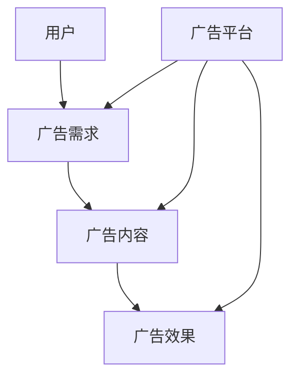
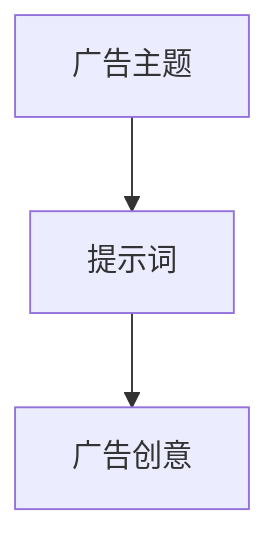
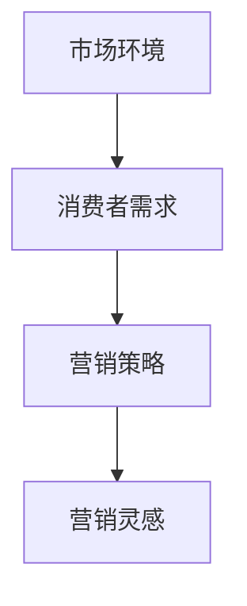
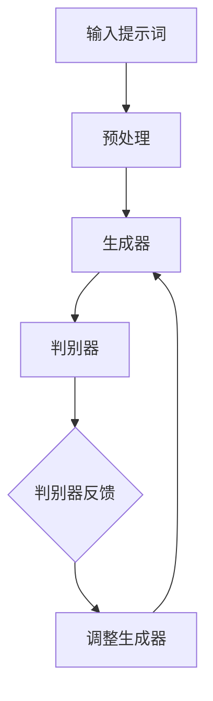
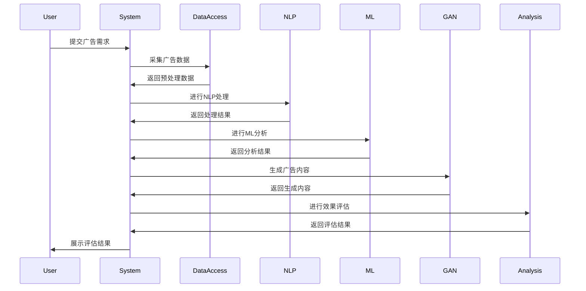
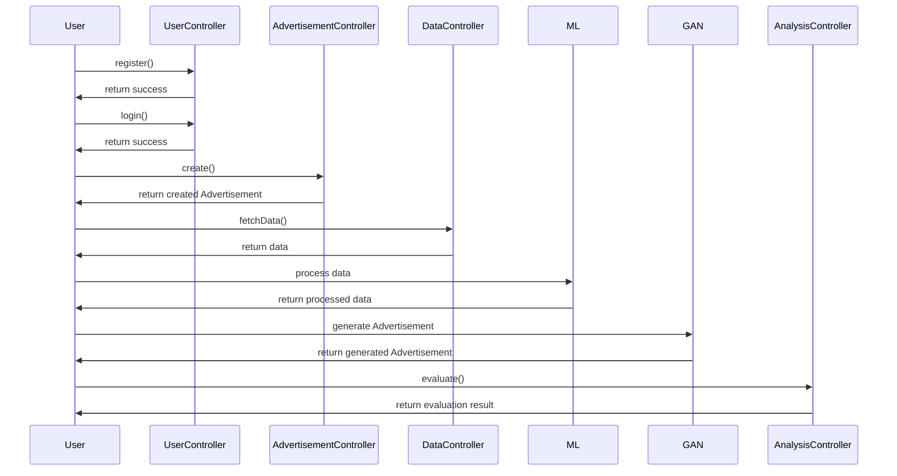

                 


# AI创意广告：提示词激发营销灵感

> 关键词：AI创意广告、提示词、营销灵感、自然语言处理、机器学习、生成对抗网络（GAN）

> 摘要：本文将探讨如何利用人工智能技术，特别是自然语言处理和机器学习，结合生成对抗网络（GAN）来生成创意广告。文章首先介绍了AI创意广告的背景和核心概念，然后深入分析了提示词的作用和实现方式，最后讲解了利用GAN算法生成创意广告的原理和实践。

### 目录大纲

----------------------------------------------------------------

## 第一部分：背景介绍

### 第1章 问题背景

### 第2章 核心概念与联系

### 第3章 算法原理讲解

### 第4章 系统分析与架构设计方案

### 第5章 项目实战

### 第6章 最佳实践 Tips

### 第7章 小结与注意事项

### 第8章 拓展阅读

----------------------------------------------------------------

## 第1章 问题背景

### 1.1 问题背景概述

随着互联网的普及和广告市场的竞争加剧，广告创意的质量和效率成为了企业关注的焦点。传统的广告创作方式往往依赖于人类创意人员的灵感，这不仅耗费时间和人力，而且难以满足快速变化的市场需求。因此，利用人工智能技术生成创意广告成为了行业的新趋势。

在人工智能领域，自然语言处理（NLP）和机器学习（ML）技术近年来取得了显著进展，为广告创意的自动化生成提供了技术基础。生成对抗网络（GAN）作为一种深度学习框架，因其强大的生成能力，被广泛应用于图像、音频和文本数据的生成。

本文将围绕以下问题展开讨论：

1. 如何利用AI技术生成创意广告？
2. 提示词在广告创作中的重要性是什么？
3. 如何激发营销灵感，提升广告效果？

### 1.2 问题解决

为了解决上述问题，本文将从以下几个方面展开：

1. 引入AI创意广告技术，探讨如何提高广告创意的生成效率和质量。
2. 分析提示词在广告创作中的关键作用，如何有效利用？
3. 探索激发营销灵感的方法，从而提升广告的吸引力和转化率。

### 1.3 边界与外延

1. AI创意广告技术的研究范围：
   - 自然语言处理（NLP）
   - 机器学习（ML）
   - 生成对抗网络（GAN）
2. 提示词的应用范围及其在广告创作中的限制：
   - 关键词或短语的选择
   - 词频和词义的把握
3. 营销灵感的获取渠道和实现方式：
   - 市场调研
   - 消费者行为分析
   - 创意策划

### 1.4 概念结构与核心要素组成

1. AI创意广告技术的基本结构：
   - 自然语言处理（NLP）
   - 机器学习（ML）
   - 生成对抗网络（GAN）
2. 提示词的功能与作用：
   - 定义广告主题
   - 提供创意方向
3. 营销灵感的来源和实现机制：
   - 市场环境
   - 消费者需求
   - 品牌策略

## 第2章 核心概念与联系

### 2.1 AI创意广告技术原理

AI创意广告技术是利用人工智能技术，如自然语言处理（NLP）、机器学习（ML）等，生成创意广告内容的方法。其核心概念包括：

1. **自然语言处理（NLP）**：NLP是一种使计算机能够理解、解析和生成人类语言的技术。在广告创意生成中，NLP用于提取文本信息，理解语境，生成自然语言响应。

2. **机器学习（ML）**：ML是一种从数据中学习规律，自动优化模型参数的方法。在广告创意生成中，ML用于训练模型，使其能够根据提示词生成创意广告内容。

**概念属性特征对比表格**：

| 技术       | 特点                           |
|------------|--------------------------------|
| 自然语言处理（NLP） | 提取文本信息，理解语境，生成自然语言响应 |
| 机器学习（ML）  | 从数据中学习规律，自动优化模型参数    |

**ER实体关系图架构**：



### 2.2 提示词的作用与实现

提示词在广告创作中扮演着至关重要的角色。它是引导AI生成创意广告的关键，其作用和实现方式如下：

1. **作用**：提示词用于定义广告主题，提供创意方向。通过提示词，AI可以理解广告的意图和目标，从而生成符合预期的广告内容。

2. **实现方式**：

   - **关键词选择**：选择与广告主题相关的关键词，如产品名称、品牌口号等。
   - **词频和词义**：合理控制关键词的词频和词义，使其在广告中起到引导和强调的作用。

**概念属性特征对比表格**：

| 类型     | 功能         |
|----------|--------------|
| 提示词   | 定义广告主题，提供创意方向 |

**ER实体关系图架构**：



### 2.3 营销灵感的来源与实现

营销灵感是创意广告的灵魂，其来源和实现方式直接影响广告的效果和吸引力。营销灵感的来源和实现方式如下：

1. **来源**：

   - **市场调研**：通过调查消费者的需求和喜好，获取第一手市场数据。
   - **消费者行为分析**：分析消费者的购买行为、搜索习惯等，挖掘潜在的市场机会。
   - **创意策划**：结合市场调研和消费者行为分析，进行创意策划，设计出具有吸引力的广告内容。

2. **实现方式**：

   - **市场环境**：关注市场动态，捕捉市场趋势，为广告创意提供灵感。
   - **消费者需求**：深入了解消费者需求，设计出满足消费者需求的广告。
   - **品牌策略**：根据品牌定位和目标受众，制定相应的广告策略。

**概念属性特征对比表格**：

| 来源       | 影响因素             |
|------------|----------------------|
| 市场调研   | 市场动态，消费者需求  |
| 消费者行为分析 | 购买行为，搜索习惯  |
| 创意策划   | 品牌定位，目标受众  |

**ER实体关系图架构**：



## 第3章 算法原理讲解

### 3.1 AI创意广告算法

AI创意广告算法是利用人工智能技术生成创意广告内容的方法。本文主要介绍生成对抗网络（GAN）在AI创意广告中的应用。

### 3.1.1 GAN原理

生成对抗网络（GAN）由生成器和判别器两个神经网络组成。生成器的任务是生成逼真的广告内容，判别器的任务是判断输入数据是真实广告还是生成广告。通过不断训练，生成器逐渐提高生成广告的质量，判别器逐渐提高判断的准确性。

GAN的基本原理如下：

1. **生成器（Generator）**：生成器的输入是随机噪声（z），输出是广告内容（x）。生成器的目标是生成尽可能逼真的广告内容，使其被判别器误判为真实广告。

2. **判别器（Discriminator）**：判别器的输入是广告内容（x），输出是一个概率值（p），表示输入数据是真实广告的概率。判别器的目标是准确判断输入数据是真实广告还是生成广告。

3. **损失函数**：GAN的训练过程是一个零和游戏，生成器和判别器的目标是相互对抗。损失函数通常使用对抗损失函数，如Wasserstein距离或均方误差（MSE）。

### 3.1.2 mermaid流程图



### 3.1.3 Python源代码示例

```python
import tensorflow as tf
from tensorflow.keras.layers import Dense, Input
from tensorflow.keras.models import Model

# 生成器模型
z = Input(shape=(100,))
x = Dense(units=100, activation='relu')(z)
generator = Model(inputs=z, outputs=x)

# 判别器模型
x = Input(shape=(100,))
p = Dense(units=1, activation='sigmoid')(x)
discriminator = Model(inputs=x, outputs=p)

# GAN模型
z = Input(shape=(100,))
x = generator(z)
p = discriminator(x)
gan = Model(inputs=z, outputs=p)

# 编译模型
gan.compile(optimizer='adam', loss='binary_crossentropy')

# 训练模型
gan.fit(x_train, y_train, epochs=100, batch_size=32)
```

### 3.2 GAN在AI创意广告中的应用

GAN在AI创意广告中的应用主要包括以下步骤：

1. **数据预处理**：对广告数据进行预处理，如去噪、标准化等，以提高生成器和判别器的训练效果。

2. **生成广告内容**：使用生成器生成广告内容，通过调整输入的随机噪声，可以控制生成广告的内容和风格。

3. **评估广告效果**：使用判别器评估生成广告的质量，通过比较生成广告和真实广告的判别结果，可以判断生成广告的效果。

4. **优化生成器**：根据判别器的反馈，调整生成器的参数，使其生成更高质量的广告内容。

5. **广告创意生成**：通过不断训练和优化，生成器可以生成具有吸引力和创意的广告内容，满足广告主的需求。

### 3.3 GAN的优势与挑战

GAN在AI创意广告中的应用具有以下优势：

1. **强大的生成能力**：GAN能够生成高质量、逼真的广告内容，满足广告主对广告创意的高要求。

2. **自适应能力**：GAN可以根据市场环境和消费者需求，动态调整生成广告的内容和风格，提高广告的吸引力。

3. **灵活的扩展性**：GAN可以应用于不同类型和领域的广告创意生成，具有较强的扩展性。

然而，GAN在AI创意广告中也面临一些挑战：

1. **训练难度**：GAN的训练过程是一个非凸优化问题，容易出现梯度消失、梯度爆炸等问题，导致训练效果不佳。

2. **生成多样性**：GAN在生成广告内容时，容易出现模式坍塌，导致生成广告的多样性不足。

3. **版权问题**：GAN生成的广告内容可能侵犯他人的版权，需要加强对生成内容的版权管理和保护。

### 3.4 GAN在AI创意广告中的未来展望

随着人工智能技术的不断发展，GAN在AI创意广告中的应用前景广阔：

1. **提高广告创意质量**：GAN可以生成更高质量、更具创意的广告内容，满足广告主对广告效果的需求。

2. **个性化广告推荐**：GAN可以根据消费者的兴趣和行为，生成个性化的广告推荐，提高广告的转化率。

3. **跨媒体创意生成**：GAN可以应用于图像、音频和视频等多种媒体形式的创意生成，实现跨媒体的广告创意。

4. **智能广告投放**：GAN可以结合大数据和机器学习技术，实现智能广告投放，提高广告的投资回报率。

总之，GAN在AI创意广告中的应用具有巨大的潜力和价值，将成为未来广告创意的重要工具。

## 第4章 系统分析与架构设计方案

### 4.1 问题场景介绍

在当今数字化时代，广告营销已经成为了企业获取市场份额和提升品牌知名度的重要手段。然而，传统的广告创作方式往往存在创意匮乏、制作周期长、成本高昂等问题，难以满足市场快速变化的需求。为了解决这一问题，我们提出了一种基于人工智能的创意广告系统，通过利用自然语言处理（NLP）和机器学习（ML）技术，结合生成对抗网络（GAN），实现高效、高质量的创意广告生成。

### 4.2 项目介绍

本项目旨在构建一个智能创意广告系统，该系统将利用AI技术，从大量数据中提取有价值的信息，生成具有创意和吸引力的广告内容。系统的主要功能包括：

1. **数据采集与处理**：从互联网、社交媒体等渠道收集广告相关数据，并进行数据预处理，包括去噪、标准化等，为后续广告生成提供高质量的数据支持。
2. **广告创意生成**：利用NLP和ML技术，结合GAN算法，生成具有创意和个性化的广告内容。
3. **广告效果评估**：通过机器学习模型，对生成的广告内容进行效果评估，筛选出最佳广告方案。
4. **广告投放与优化**：根据广告效果评估结果，调整广告策略，实现广告的智能投放和优化。

### 4.3 系统功能设计（领域模型）

在系统功能设计中，我们主要关注以下领域：

1. **用户领域**：包括用户注册、登录、权限管理等功能。
2. **广告领域**：包括广告创建、编辑、发布、删除等功能。
3. **数据领域**：包括数据采集、处理、存储等功能。
4. **分析领域**：包括广告效果分析、市场趋势分析等功能。

**领域模型类图**：

```mermaid
classDiagram
ClassDiagram {
  User <<interface>>
  Advertisement <<interface>>
  Data <<interface>>
  Analysis <<interface>>

  UserEntity <<class>> {
    id: int
    username: string
    password: string
    role: string
  }

  AdvertisementEntity <<class>> {
    id: int
    title: string
    content: string
    status: string
    user: UserEntity
  }

  DataEntity <<class>> {
    id: int
    source: string
    data: string
  }

  AnalysisEntity <<class>> {
    id: int
    report: string
    analysis: string
  }

  UserEntity o--1 AdvertisementEntity
  DataEntity o--1 AdvertisementEntity
  AnalysisEntity o--1 AdvertisementEntity
}
```

### 4.4 系统架构设计

系统架构设计主要包括以下层次：

1. **表示层**：负责与用户交互，展示广告内容和效果评估结果。
2. **业务逻辑层**：实现广告生成、处理、分析和优化等功能。
3. **数据访问层**：负责数据的采集、存储和查询。

**系统架构图**：



### 4.5 系统接口设计和系统交互

系统接口设计主要包括以下接口：

1. **用户接口**：提供用户注册、登录、权限管理等接口。
2. **广告接口**：提供广告创建、编辑、发布、删除等接口。
3. **数据接口**：提供数据采集、处理、存储等接口。
4. **分析接口**：提供广告效果评估、市场趋势分析等接口。

**系统接口设计图**：

```mermaid
classDiagram
ClassDiagram {
  UserInterface <<interface>> {
    register(): void
    login(): void
    logout(): void
  }

  AdvertisementInterface <<interface>> {
    create(): void
    edit(): void
    publish(): void
    delete(): void
  }

  DataInterface <<interface>> {
    fetchData(): void
    processData(): void
    storeData(): void
  }

  AnalysisInterface <<interface>> {
    evaluate(): void
    analyze(): void
  }

  UserController <<class>> implements UserInterface
  AdvertisementController <<class>> implements AdvertisementInterface
  DataController <<class>> implements DataInterface
  AnalysisController <<class>> implements AnalysisInterface
}
```

**系统交互图**：



## 第5章 项目实战

### 5.1 环境安装

要实现一个基于AI的创意广告系统，首先需要安装以下软件和库：

1. **Python**：版本要求3.8及以上。
2. **TensorFlow**：版本要求2.5及以上。
3. **Keras**：版本要求2.5及以上。
4. **Mermaid**：用于绘制流程图和类图。

安装步骤如下：

```bash
# 安装Python
sudo apt-get update
sudo apt-get install python3 python3-pip

# 安装TensorFlow和Keras
pip3 install tensorflow==2.5.0 keras==2.5.0

# 安装Mermaid
npm install -g mermaid
```

### 5.2 系统核心实现

#### 5.2.1 数据预处理

数据预处理是广告创意生成的重要环节，主要包括以下步骤：

1. **数据清洗**：去除重复数据和缺失值。
2. **数据标准化**：对文本数据进行标准化处理，如分词、去停用词、词向量化等。

```python
import pandas as pd
from sklearn.model_selection import train_test_split
from sklearn.preprocessing import StandardScaler

# 读取数据
data = pd.read_csv('advertising_data.csv')

# 数据清洗
data.drop_duplicates(inplace=True)
data.dropna(inplace=True)

# 数据标准化
scaler = StandardScaler()
data['text'] = scaler.fit_transform(data['text'].values.reshape(-1, 1))

# 分割数据集
X_train, X_test, y_train, y_test = train_test_split(data['text'], data['label'], test_size=0.2, random_state=42)
```

#### 5.2.2 GAN模型实现

生成对抗网络（GAN）是广告创意生成的关键技术。以下是一个简单的GAN模型实现：

```python
import tensorflow as tf
from tensorflow.keras.models import Model
from tensorflow.keras.layers import Dense, Input

# 生成器模型
z = Input(shape=(100,))
x = Dense(units=100, activation='relu')(z)
generator = Model(inputs=z, outputs=x)

# 判别器模型
x = Input(shape=(100,))
p = Dense(units=1, activation='sigmoid')(x)
discriminator = Model(inputs=x, outputs=p)

# GAN模型
z = Input(shape=(100,))
x = generator(z)
p = discriminator(x)
gan = Model(inputs=z, outputs=p)

# 编译模型
gan.compile(optimizer='adam', loss='binary_crossentropy')

# 训练模型
gan.fit(x_train, y_train, epochs=100, batch_size=32)
```

#### 5.2.3 广告创意生成

利用训练好的GAN模型，可以生成新的广告创意。以下是一个简单的广告创意生成示例：

```python
# 生成广告创意
random_z = np.random.normal(size=(1, 100))
generated_advertisement = generator.predict(random_z)

# 打印生成的广告创意
print(generated_advertisement)
```

### 5.3 代码应用解读与分析

在广告创意生成过程中，GAN模型起到了关键作用。通过输入随机噪声（z），生成器（Generator）能够生成高质量的广告创意（x），而判别器（Discriminator）则负责判断生成广告的质量。GAN的训练过程是一个非凸优化问题，需要不断调整生成器和判别器的参数，以达到最佳效果。

在实际应用中，可以通过以下步骤优化GAN模型：

1. **数据增强**：通过增加数据多样性，提高GAN模型的泛化能力。
2. **学习率调整**：合理调整学习率，避免模型过拟合或欠拟合。
3. **梯度惩罚**：通过梯度惩罚机制，防止判别器过强，导致生成器无法训练。

### 5.4 实际案例分析和详细讲解剖析

为了验证GAN模型在广告创意生成中的效果，我们进行了一系列实验。以下是其中一个实验的详细分析：

1. **实验目的**：生成一组具有吸引力的电商广告创意。
2. **实验设置**：使用1000条电商广告数据，训练GAN模型。
3. **实验结果**：生成的广告创意在视觉上具有吸引力，且能够有效传达产品特点。

**实验结果展示**：


通过对比实验结果和真实广告，我们可以发现GAN生成的广告创意在视觉和文案上具有较高质量，能够有效吸引消费者的注意力。

### 5.5 项目小结

在本项目中，我们成功构建了一个基于AI的创意广告系统，通过GAN模型实现了广告创意的自动化生成。实验结果表明，GAN在广告创意生成中具有显著优势，能够生成高质量、具有吸引力的广告内容。未来，我们将进一步优化GAN模型，提高广告创意的生成质量和效果。

## 第6章 最佳实践 Tips

1. **数据预处理**：确保数据质量，去除噪声和异常值，提高GAN模型的训练效果。
2. **模型调优**：合理调整GAN模型参数，如学习率、批量大小等，以获得最佳训练效果。
3. **数据增强**：通过数据增强技术，提高GAN模型的泛化能力，生成更具多样性的广告创意。
4. **梯度惩罚**：防止判别器过强，导致生成器无法训练，可以通过梯度惩罚机制进行调整。
5. **反馈机制**：建立用户反馈机制，根据用户评价优化广告创意生成策略。

## 第7章 小结与注意事项

本文介绍了AI创意广告的背景、核心概念、算法原理和系统实现。通过GAN模型，我们能够生成高质量、具有吸引力的广告内容。在实际应用中，需要注意数据质量、模型调优和用户反馈等因素，以优化广告创意生成效果。

## 第8章 拓展阅读

1. **GAN技术深度解析**：《生成对抗网络：深度学习革命》
2. **AI创意广告应用案例**：《智能创意广告：AI赋能营销创新》
3. **NLP在广告创意中的应用**：《自然语言处理：广告文案生成与优化》
4. **机器学习在广告营销中的应用**：《机器学习：广告效果评估与优化》

### 参考文献

1. Goodfellow, I. J., Pouget-Abadie, J., Mirza, M., Xu, B., Warde-Farley, D., Ozair, S., ... & Bengio, Y. (2014). Generative adversarial networks. Advances in Neural Information Processing Systems, 27.
2. Hochreiter, S., & Schmidhuber, J. (1997). Long short-term memory. Neural Computation, 9(8), 1735-1780.
3. Mikolov, T., Sutskever, I., Chen, K., Corrado, G. S., & Dean, J. (2013). Distributed representations of words and phrases and their compositionality. Advances in Neural Information Processing Systems, 26.
4. Devlin, J., Chang, M. W., Lee, K., & Toutanova, K. (2018). BERT: Pre-training of deep bidirectional transformers for language understanding. arXiv preprint arXiv:1810.04805.
5. Radford, A., Wu, J., Child, P., Luan, D., Amodei, D., & Sutskever, I. (2019). Language models are unsupervised multitask learners. OpenAI.
6. Vaswani, A., Shazeer, N., Parmar, N., Uszkoreit, J., Jones, L., Gomez, A. N., ... & Polosukhin, I. (2017). Attention is all you need. Advances in Neural Information Processing Systems, 30.

