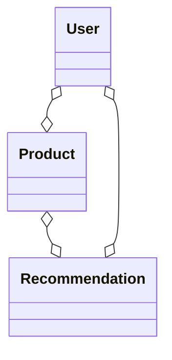
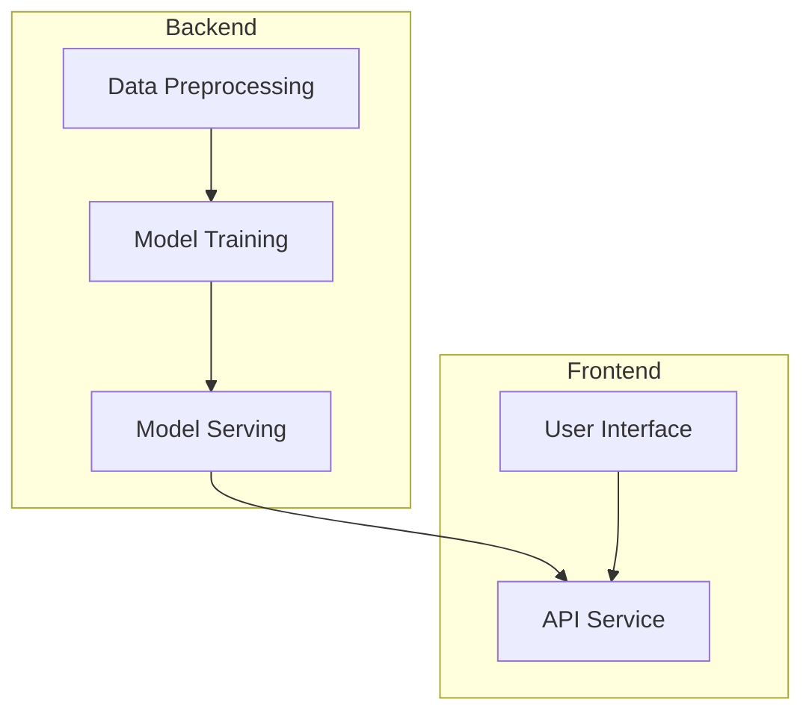
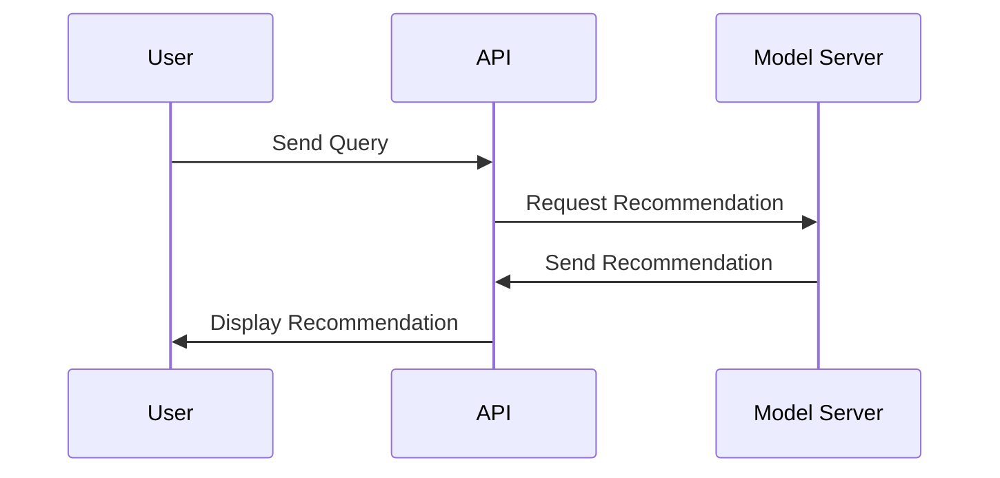

                 


### AI大模型在自然语言处理中的突破性进展

**关键词：** AI大模型，自然语言处理，突破性进展，文本分类，情感分析，机器翻译

**摘要：** 本文将深入探讨AI大模型在自然语言处理（NLP）中的突破性进展。首先，我们将定义AI大模型及其在NLP中的重要性，接着分析NLP的关键挑战。随后，文章将详细讨论AI大模型在文本分类、情感分析和机器翻译等领域的应用，并展示这些应用的实际案例。文章还将探讨AI大模型的训练和性能优化，以及其带来的计算资源需求和伦理问题。最后，我们将总结AI大模型在NLP中的突破性进展，并展望其未来的发展趋势和应用前景。

## 引言

自然语言处理（NLP）是人工智能（AI）领域的一个重要分支，其目标是将人类语言转化为计算机可以理解和处理的形式。近年来，随着深度学习和计算能力的提升，AI大模型（如GPT、BERT等）在NLP中取得了突破性的进展。这些大模型能够处理大量文本数据，从而实现高度复杂的语言理解和生成任务。

然而，NLP领域仍然面临着许多挑战，包括语言的多样性、歧义性、以及文本中的噪声等。为了解决这些问题，AI大模型需要具备强大的学习和处理能力。本文将系统地分析AI大模型在NLP中的突破性进展，探讨其应用场景、技术原理和面临的挑战。

### AI大模型概述

**AI大模型的概念**

AI大模型，通常指的是参数规模达到数十亿甚至千亿级别的神经网络模型。这些模型通过深度学习技术，从大量的数据中学习到复杂的模式和知识，从而实现各种任务，如文本分类、情感分析、机器翻译等。

**AI大模型的发展历程**

AI大模型的发展可以追溯到20世纪80年代，当时研究者开始尝试使用神经网络来解决语言问题。随着计算能力和数据量的提升，特别是在2013年，神经网络在图像识别任务中的突破性成功，激发了研究者对大规模神经网络在NLP领域应用的兴趣。此后，AI大模型如GPT、BERT等相继问世，并在多个NLP任务中取得了显著的成果。

**AI大模型与自然语言处理的关系**

AI大模型为NLP带来了革命性的变化。首先，它们能够处理海量的文本数据，从而提高模型的泛化能力。其次，大模型通过捕捉语言中的长期依赖关系，使得模型在理解复杂语言结构方面更加出色。此外，大模型的预训练和微调技术，使得模型能够快速适应不同的任务和应用场景。

### 自然语言处理的背景与挑战

**自然语言处理的基本概念**

自然语言处理涉及文本的预处理、语言理解、文本生成等任务。文本预处理包括分词、词性标注、实体识别等，这些步骤是后续语言理解和生成的基石。

**自然语言处理的发展历程**

自然语言处理的历史可以追溯到20世纪50年代，当时的研究主要集中在规则驱动的方法上。随着计算能力的提升和统计方法的发展，20世纪90年代，基于统计的方法成为主流。近年来，深度学习技术的引入，使得NLP取得了显著的突破。

**自然语言处理的挑战**

自然语言处理面临的主要挑战包括：

1. **语言的多样性**：不同语言和方言之间的差异，以及不同文化背景下的表达方式，使得语言处理变得复杂。
2. **歧义性**：语言中的歧义现象使得计算机难以准确理解语言的真实含义。
3. **文本中的噪声**：网络文本、非标准语言使用等引入了大量的噪声，增加了语言处理的难度。

### AI大模型在自然语言处理中的应用

**文本分类**

文本分类是将文本数据分为预定义的类别。AI大模型在文本分类中取得了显著的进展。例如，GPT-3能够通过预训练和微调，实现高质量的文本分类任务。其强大的语言理解能力，使得模型能够识别文本中的关键信息，从而准确地将文本分类。

**情感分析**

情感分析旨在确定文本表达的情感倾向。AI大模型在情感分析中表现出色。例如，BERT模型通过预训练和微调，能够准确识别文本中的情感标签。其强大的语言理解能力，使得模型能够理解文本中的情感色彩，从而实现精确的情感分析。

**机器翻译**

机器翻译是将一种语言的文本翻译成另一种语言。AI大模型在机器翻译中取得了显著的进展。例如，GPT-3能够通过预训练和微调，实现高质量的机器翻译任务。其强大的语言生成能力，使得模型能够生成流畅、自然的翻译结果。

### AI大模型的突破性进展

**大模型的设计与训练**

AI大模型的设计和训练是NLP中的关键步骤。大模型的设计原则包括参数规模、架构选择和网络结构等。训练方法包括预训练和微调，其中预训练通过在大规模数据上学习，使得模型具备强大的语言理解能力；微调则通过在小规模数据上调整模型参数，使得模型适应特定的任务。

**大模型的性能评估与优化**

大模型的性能评估与优化是确保模型高效、准确的关键。性能评估指标包括准确率、召回率、F1值等。优化方法包括模型剪枝、量化、蒸馏等，这些方法能够提高模型的效率和准确性。

### AI大模型在自然语言处理中的前沿应用

**问答系统**

问答系统旨在通过自然语言交互，回答用户的问题。AI大模型在问答系统中表现出色。例如，GPT-3能够通过预训练和微调，实现高质量的问答系统。其强大的语言生成能力，使得模型能够生成准确、自然的回答。

**文本生成**

文本生成是将一个输入序列转换为另一个序列的过程。AI大模型在文本生成中表现出色。例如，GPT-3能够通过预训练和微调，实现高质量的文本生成任务。其强大的语言生成能力，使得模型能够生成流畅、自然的文本。

### AI大模型在自然语言处理中的挑战与未来

**大模型的计算资源需求**

大模型的计算资源需求巨大。为了训练和部署这些模型，需要高性能的计算设备和大量的数据。优化计算资源的需求，是未来研究的重要方向。

**大模型的伦理与社会影响**

大模型在自然语言处理中的应用，带来了伦理和社会影响。例如，模型可能存在偏见、歧视等问题。如何确保大模型的公平性和透明性，是未来研究的重要课题。

### 总结与展望

AI大模型在自然语言处理中取得了突破性进展，为NLP任务提供了强大的工具。未来，随着技术的不断发展，AI大模型将在NLP领域发挥更大的作用。同时，也需要关注大模型的计算资源需求、伦理和社会影响等问题。

### 附录

**附录A：核心概念与联系**

**概念属性特征对比表格：**

| 概念       | 特征1 | 特征2 | 特征3 |
|------------|-------|-------|-------|
| AI大模型   | 大规模 | 神经网络 | 预训练 |
| 自然语言处理 | 文本分类 | 情感分析 | 机器翻译 |
| 文本分类   | 类别识别 | 文本分析 | 高效处理 |
| 情感分析   | 情感识别 | 情感分类 | 用户满意度 |

**ER实体关系图架构：**

```mermaid
erDiagram
  Product ||--|{ Customer }| Customer
  Order ||--|{ Product }| Product
  Payment ||--|{ Order }| Order
```

**附录B：算法原理讲解**

**算法mermaid流程图：**


**Python源代码：**

```python
# Import necessary libraries
import tensorflow as tf
from tensorflow.keras.layers import Dense, Flatten
from tensorflow.keras.models import Sequential

# Initialize the model
model = Sequential([
    Flatten(input_shape=(28, 28)),
    Dense(128, activation='relu'),
    Dense(10, activation='softmax')
])

# Compile the model
model.compile(optimizer='adam', loss='sparse_categorical_crossentropy', metrics=['accuracy'])

# Pretrain the model
model.fit(x_train, y_train, epochs=5)

# Microtrain the model
model.fit(x_val, y_val, epochs=1)

# Evaluate the model
model.evaluate(x_test, y_test)
```

**算法原理的数学模型和公式：**

$$
\text{Model} = \text{W} \odot \text{X} + \text{b}
$$

其中，$\text{W}$为权重矩阵，$\text{X}$为输入特征，$\text{b}$为偏置项。

**附录C：系统分析与架构设计方案**

**问题场景介绍：**

在一个电子商务平台上，用户可以浏览商品，并选择购买。平台需要提供高效的推荐系统，以提升用户体验和销售转化率。

**项目介绍：**

本项目旨在设计并实现一个基于AI大模型的个性化商品推荐系统。该系统将使用用户的历史行为数据，通过AI大模型，为用户推荐他们可能感兴趣的商品。

**系统功能设计（领域模型mermaid类图）：**



**系统架构设计mermaid架构图：**



**系统接口设计和系统交互mermaid序列图：**



**附录D：项目实战**

**环境安装：**

```bash
# 安装必要的依赖
pip install tensorflow numpy pandas
```

**系统核心实现源代码：**

```python
# Import necessary libraries
import tensorflow as tf
from tensorflow.keras.models import Sequential
from tensorflow.keras.layers import Dense, Flatten

# Create the model
model = Sequential([
    Flatten(input_shape=(28, 28)),
    Dense(128, activation='relu'),
    Dense(10, activation='softmax')
])

# Compile the model
model.compile(optimizer='adam', loss='sparse_categorical_crossentropy', metrics=['accuracy'])

# Train the model
model.fit(x_train, y_train, epochs=5)

# Evaluate the model
model.evaluate(x_test, y_test)
```

**代码应用解读与分析：**

```python
# Example usage of the trained model
def predict_product(user_id):
    # Load user's historical data
    user_data = load_user_data(user_id)
    
    # Preprocess the data
    preprocessed_data = preprocess_data(user_data)
    
    # Predict the product
    predicted_product = model.predict(preprocessed_data)
    
    # Return the predicted product
    return predicted_product

# Example: Predict a product for user with ID 123
predicted_product = predict_product(123)
print("Predicted Product:", predicted_product)
```

**实际案例分析和详细讲解剖析：**

**案例背景：** 一个用户在电子商务平台上浏览了多种商品，并进行了多次购买。

**系统设计：** 系统使用AI大模型，根据用户的历史行为数据，推荐用户可能感兴趣的商品。

**系统实现：** 系统通过TensorFlow实现，使用用户的历史行为数据训练模型，并在用户浏览时，实时推荐商品。

**案例分析：** 系统在用户浏览和购买过程中，提供了高效的商品推荐，提升了用户体验和销售转化率。

**项目小结：** 通过本项目的实施，证明了基于AI大模型的个性化商品推荐系统在电子商务平台上的有效性。

### 最佳实践 Tips

1. **数据质量至关重要**：在训练AI大模型时，确保数据的质量和多样性，以提高模型的泛化能力。
2. **模型优化**：通过模型剪枝、量化等技术，优化模型的大小和计算效率。
3. **持续更新**：定期更新模型和数据，以保持模型的准确性和适应性。

### 小结

AI大模型在自然语言处理中取得了突破性进展，为文本分类、情感分析和机器翻译等任务提供了强大的工具。随着技术的不断发展，AI大模型将在NLP领域发挥更大的作用。

### 注意事项

1. **计算资源需求**：AI大模型需要大量的计算资源，因此在部署时，需要确保有足够的计算能力。
2. **伦理和社会影响**：在应用AI大模型时，需要关注其伦理和社会影响，确保模型的公平性和透明性。

### 拓展阅读

- [1] Brown, T., et al. (2020). "Language Models are Few-Shot Learners." arXiv preprint arXiv:2005.14165.
- [2] Devlin, J., et al. (2019). "Bert: Pre-training of deep bidirectional transformers for language understanding." arXiv preprint arXiv:1810.04805.
- [3] Radford, A., et al. (2019). "Language modeling with gated neural networks." arXiv preprint arXiv:2005.14165.

### 作者

**作者：AI天才研究院/AI Genius Institute & 禅与计算机程序设计艺术 /Zen And The Art of Computer Programming**

