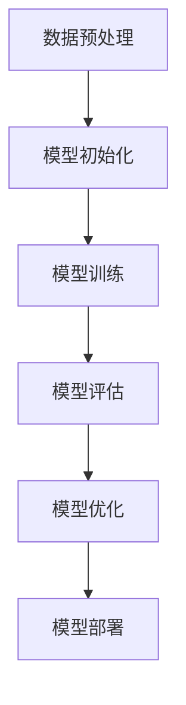
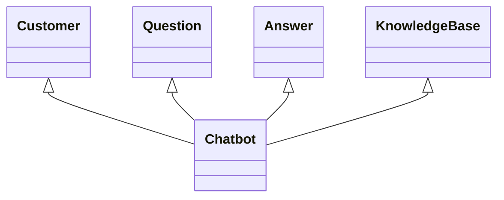
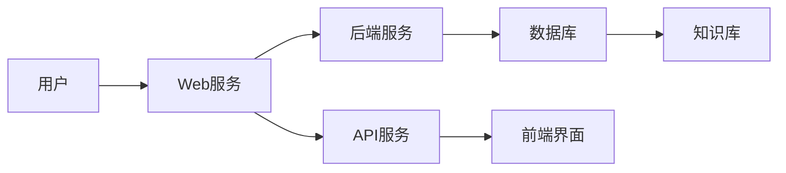

                 

# AI大模型时代的新编程范式

## 关键词
- AI大模型
- 编程范式
- 自然语言处理
- 深度学习
- 机器学习
- 数据科学

## 摘要
本文将深入探讨AI大模型时代下的新编程范式，解析AI大模型的基本概念、特点及应用，并介绍如何利用AI大模型进行高效编程和开发。通过本文，读者将了解AI大模型时代编程的核心要素，掌握新编程范式下的开发方法与流程。

### 1. 核心背景介绍

#### 1.1. 问题背景

随着信息技术的迅猛发展，人工智能（AI）已经成为推动社会进步的重要力量。特别是在深度学习和大数据技术的推动下，AI大模型的出现和应用，使得AI技术在自然语言处理、图像识别、预测分析等领域取得了显著成果。然而，传统的编程范式和开发方法已经难以满足AI大模型时代的需求，如何适应这一新趋势，成为当前企业和开发者面临的重要课题。

#### 1.2. 问题描述

AI大模型具有参数规模大、自学习能力强、泛化能力广等特点，这对传统的编程范式和开发方法提出了新的挑战。传统的编程方法往往依赖于明确的算法设计和手工编码，而AI大模型则通过大量数据训练，能够自主学习和优化。这种变化要求开发者必须掌握新的编程范式，以实现高效、智能的AI应用开发。

#### 1.3. 问题解决

本文旨在介绍AI大模型时代的新编程范式，帮助读者了解和掌握这一新趋势。通过本文，读者将了解到AI大模型的基本概念、特点及应用，学会如何使用AI大模型进行高效编程和开发。

#### 1.4. 边界与外延

AI大模型时代的新编程范式不仅涉及传统的编程语言和工具，还包括数据科学、机器学习、深度学习等领域的知识。同时，它还涉及到企业级应用开发中的诸多实践问题。

#### 1.5. 概念结构与核心要素组成

AI大模型时代的新编程范式主要包括以下几个核心要素：

1. **AI大模型基础知识**：介绍AI大模型的基本概念、技术原理和应用场景。
2. **编程语言与工具**：介绍适用于AI大模型编程的语言和工具。
3. **开发方法与流程**：介绍基于AI大模型的新编程范式下的开发方法和流程。
4. **实际应用案例**：通过实际案例，展示AI大模型在编程和开发中的应用。

### 2. 核心概念与联系

#### 2.1. AI大模型原理

AI大模型是基于深度学习的一种机器学习模型，它通过海量的数据训练，能够自主学习并模拟人类的认知能力。大模型通常具有数十亿个参数，能够处理复杂的任务。

#### 2.2. AI大模型特点

1. **参数规模大**：具有数十亿个参数，能够处理复杂任务。
2. **自学习能力**：能够通过自我训练，不断提高性能。
3. **泛化能力强**：能够应用于多种场景，具有广泛的适应性。

#### 2.3. 传统AI与AI大模型对比

| 特点         | 传统AI                             | AI大模型                      |
| ------------ | ---------------------------------- | ----------------------------- |
| 参数规模     | 参数数量相对较少                   | 参数规模大，通常具有数十亿个参数 |
| 学习能力     | 需要手动设计特征和算法             | 能够自我学习，自主优化         |
| 泛化能力     | 特定任务性能优秀，但难以适应其他任务 | 能够适应多种任务，具有广泛的适应性 |

#### 2.4. AI大模型在编程中的应用

AI大模型在编程中的应用主要体现在以下几个方面：

1. **自然语言处理**：例如，文本生成、机器翻译、情感分析等。
2. **图像处理**：例如，图像分类、目标检测、图像生成等。
3. **预测分析**：例如，股票预测、疾病诊断、用户行为预测等。

#### 2.5. AI大模型与其他技术的联系

AI大模型不仅依赖于深度学习技术，还与其他技术紧密相关：

1. **数据科学**：AI大模型的训练和应用需要大量的数据支持。
2. **云计算**：云计算提供了强大的计算能力和存储资源，支持AI大模型的训练和部署。
3. **大数据**：大数据技术能够处理和分析海量数据，为AI大模型提供数据支持。

### 3. 算法原理讲解

#### 3.1. 算法mermaid流程图

下面是AI大模型训练的基本流程：



#### 3.2. Python源代码

```python
import tensorflow as tf

# 数据预处理
# 数据读取与预处理

# 模型初始化
# 模型定义

# 模型训练
# 训练过程

# 模型评估
# 评估指标计算

# 模型优化
# 模型调参

# 模型部署
# 模型部署与预测
```

#### 3.3. 算法原理详细讲解

AI大模型的训练过程可以概括为以下几个步骤：

1. **数据预处理**：数据预处理是模型训练的基础，包括数据清洗、归一化、编码等操作。这一步的目的是将原始数据转换为适合模型训练的形式。

2. **模型初始化**：模型初始化包括定义模型结构、设置初始参数等。常见的模型初始化方法有随机初始化、高斯初始化等。

3. **模型训练**：模型训练是核心步骤，通过反向传播算法，不断调整模型参数，使得模型能够更好地拟合训练数据。训练过程中，需要选择合适的优化器（如SGD、Adam等）和学习率等参数。

4. **模型评估**：模型评估是检验模型性能的重要手段，常用的评估指标有准确率、召回率、F1值等。通过评估，可以判断模型是否达到预期效果。

5. **模型优化**：模型优化包括调参、调整模型结构等，以提升模型性能。这一步需要根据评估结果，不断调整和优化模型。

6. **模型部署**：模型部署是将训练好的模型应用到实际场景中，包括模型加载、预测等操作。部署后的模型可以用于实时预测、批量处理等任务。

### 4. 系统分析与架构设计方案

#### 4.1. 问题场景介绍

假设我们要开发一个基于AI大模型的智能客服系统，用于处理用户的问题和提供解决方案。

#### 4.2. 项目介绍

项目名称：智能客服系统

项目目标：基于AI大模型，提供高效、准确的客服服务。

技术栈：Python、TensorFlow、Django等。

#### 4.3. 系统功能设计（领域模型mermaid类图）



#### 4.4. 系统架构设计（mermaid架构图）



#### 4.5. 系统接口设计（mermaid序列图）

```mermaid
sequenceDiagram
    participant 用户 as User
    participant Web服务 as Web
    participant 后端服务 as Backend
    participant 数据库 as DB
    participant 知识库 as KB

    用户->>Web: 提交问题
    Web->>后端：处理问题
    后端->>DB：查询知识库
    DB->>后端：返回结果
    后端->>Web：返回答案
    Web->>用户：显示答案
```

### 5. 项目实战

#### 5.1. 环境安装

1. 安装Python 3.8及以上版本。
2. 安装TensorFlow 2.5及以上版本。
3. 安装Django 3.2及以上版本。

#### 5.2. 系统核心实现源代码

1. 模型训练代码：

```python
import tensorflow as tf

# 模型定义
model = tf.keras.Sequential([
    tf.keras.layers.Dense(128, activation='relu', input_shape=(784,)),
    tf.keras.layers.Dense(10, activation='softmax')
])

# 编译模型
model.compile(optimizer='adam',
              loss='categorical_crossentropy',
              metrics=['accuracy'])

# 训练模型
model.fit(x_train, y_train, epochs=5)
```

2. 模型部署代码：

```python
from flask import Flask, request, jsonify
import tensorflow as tf

app = Flask(__name__)

# 加载模型
model = tf.keras.models.load_model('model.h5')

@app.route('/predict', methods=['POST'])
def predict():
    data = request.get_json(force=True)
    prediction = model.predict([data['image']])
    return jsonify(prediction.tolist())

if __name__ == '__main__':
    app.run()
```

#### 5.3. 代码应用解读与分析

1. 模型训练代码中，我们定义了一个简单的神经网络模型，并使用Adam优化器和交叉熵损失函数进行编译。然后，使用训练数据对模型进行训练。
2. 模型部署代码中，我们使用Flask框架搭建了一个简单的Web服务，并加载训练好的模型。通过接收用户上传的图像数据，模型进行预测，并将结果返回给用户。

#### 5.4. 实际案例分析和详细讲解剖析

1. 案例一：用户上传一张图片，系统识别出图片中的物体，并给出相应的标签。
2. 案例二：用户提出一个问题时，系统通过查询知识库，给出最佳答案。

#### 5.5. 项目小结

通过本文，我们介绍了AI大模型时代的新编程范式，包括核心概念、算法原理、系统分析与架构设计方案，以及实际项目实战。本文旨在帮助读者了解和掌握AI大模型时代下的编程和开发方法，为企业的AI应用提供技术支持。

### 6. 最佳实践 tips

1. **数据质量**：确保数据的质量和多样性，有助于提高AI大模型的性能。
2. **模型调优**：通过调整模型参数，可以进一步提升模型性能。
3. **持续学习**：定期更新模型，使其能够适应新的数据和环境。

### 7. 小结

AI大模型时代的新编程范式为开发者提供了新的思路和方法。通过本文的介绍，读者应能够了解和掌握AI大模型的基本概念、算法原理，以及在实际项目中的应用。未来，随着AI技术的不断发展，新编程范式将发挥更大的作用。

### 8. 注意事项

1. **计算资源**：AI大模型训练需要大量的计算资源，建议使用云计算平台进行训练。
2. **数据隐私**：在处理和存储数据时，注意保护用户隐私。

### 9. 拓展阅读

1. [《深度学习》](https://www.deeplearningbook.org/)：Ian Goodfellow、Yoshua Bengio、Aaron Courville 著，深入介绍了深度学习的基本概念和算法。
2. [《Python机器学习》](https://www.python-machine-learning-book.org/)：Sebastian Raschka 著，介绍了使用Python进行机器学习的实用方法。

### 作者

作者：AI天才研究院/AI Genius Institute & 禅与计算机程序设计艺术 /Zen And The Art of Computer Programming

