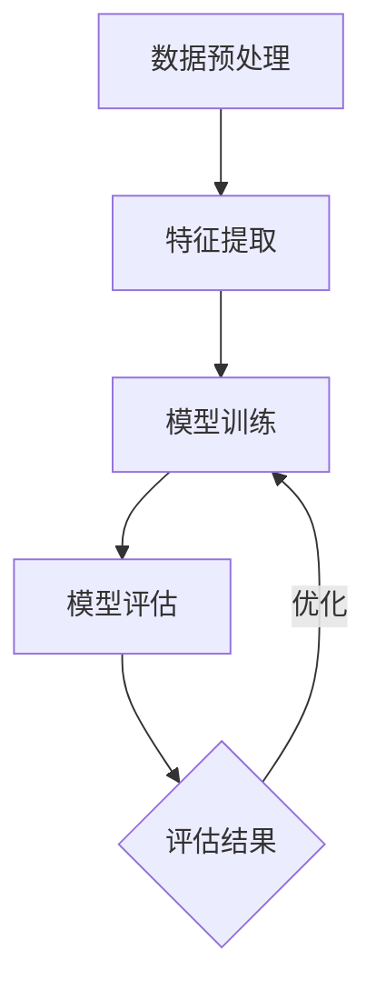
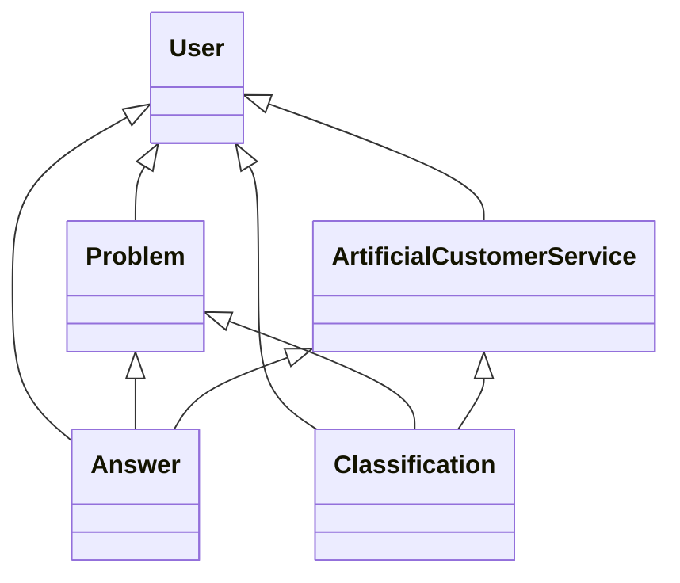
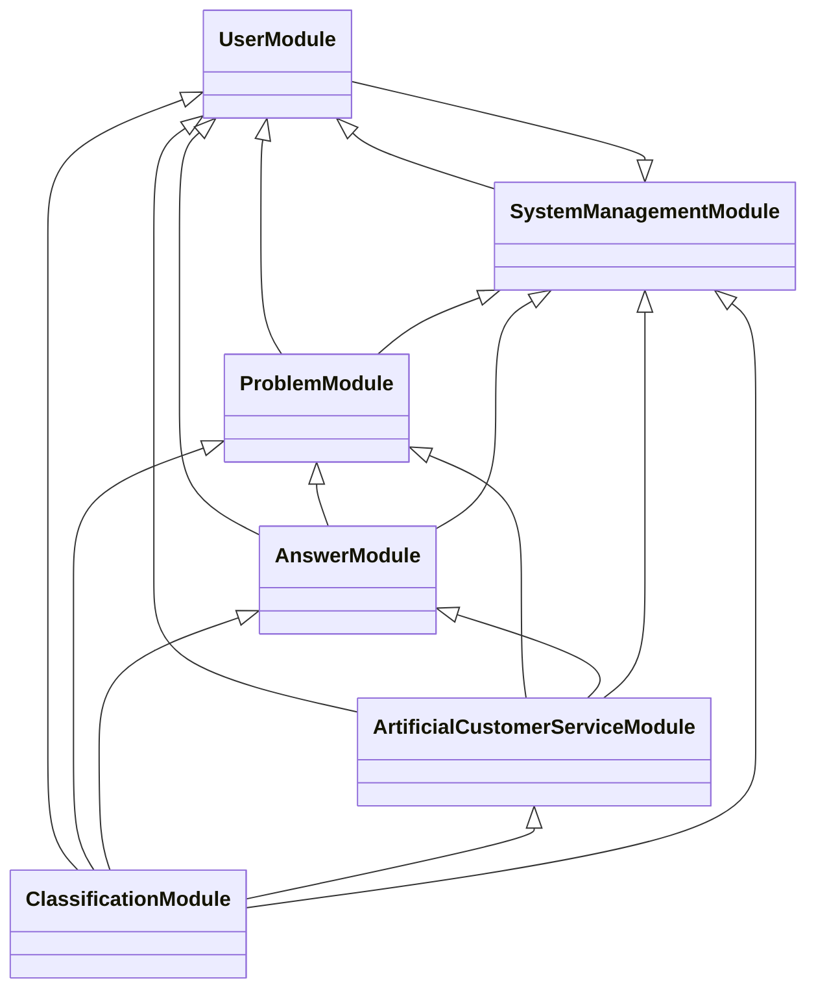
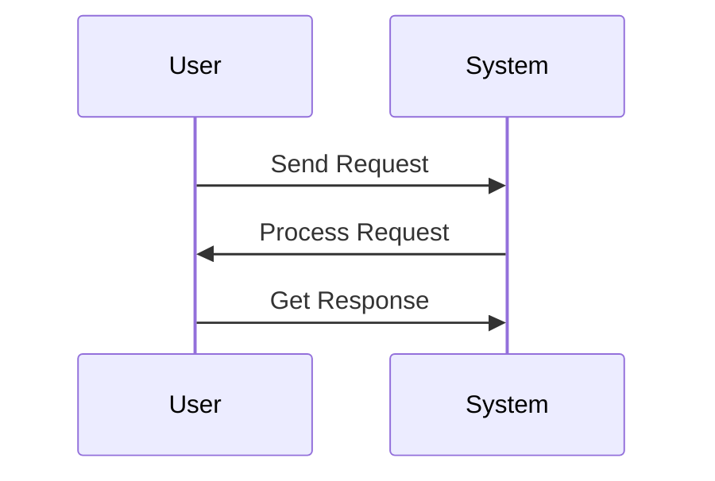
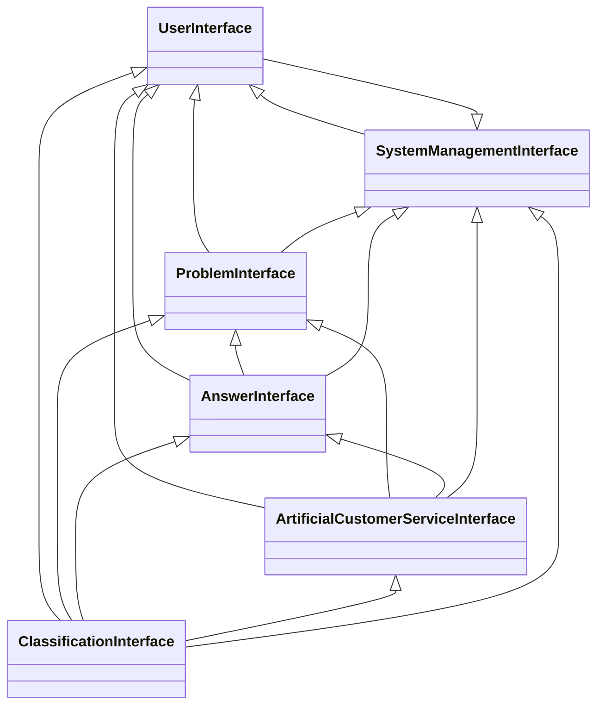
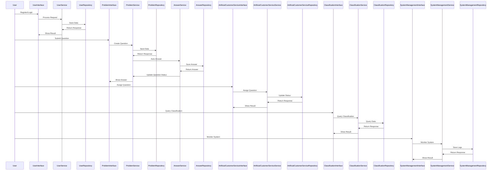

                 

### 第一部分：背景介绍

#### 第1章：问题背景

##### 1.1.1 问题背景

随着人工智能（AI）技术的快速发展，AI大模型在各个领域得到了广泛应用，如自然语言处理（NLP）、图像识别、推荐系统等。然而，AI大模型在实际应用中面临诸多挑战，其中之一便是提示词冷启动问题。

AI大模型的提示词冷启动问题，主要是指当模型首次接收到某个特定任务的提示词时，由于缺乏相关的背景信息和训练数据，导致模型难以迅速、准确地响应和完成任务。这一问题对AI大模型的应用效果产生了显著影响，使得许多实际应用场景中的用户体验大打折扣。

本文的研究目的在于深入探讨AI大模型的提示词冷启动问题，分析其产生的原因，提出有效的解决方法，并探讨其在不同场景中的应用前景。研究意义主要体现在以下几个方面：

1. **提高AI大模型的应用效果**：通过解决提示词冷启动问题，可以显著提升AI大模型在不同任务场景下的准确性和响应速度，从而提高其整体应用效果。
2. **优化模型训练过程**：解决提示词冷启动问题有助于减少模型训练的数据量，降低训练成本，提高训练效率。
3. **促进AI大模型的普及应用**：随着提示词冷启动问题的有效解决，AI大模型将在更多实际应用场景中得到普及，推动人工智能技术的发展。

##### 1.1.2 问题描述

提示词冷启动问题的核心在于模型在首次接收到特定任务提示词时，无法迅速理解并准确响应。具体表现为以下几个方面：

1. **理解能力不足**：模型对提示词的理解能力不足，导致无法正确解析任务含义。
2. **响应速度缓慢**：模型在处理首次接收到的提示词时，由于缺乏相关的背景信息，导致处理速度显著下降。
3. **准确性降低**：在冷启动阶段，模型的预测准确性会受到影响，导致任务执行结果出现偏差。

提示词冷启动问题通常发生在以下几种场景：

1. **新用户首次使用**：当新用户首次与AI大模型交互时，由于缺乏历史数据，模型难以准确理解用户意图。
2. **新任务引入**：当AI大模型需要应对新的任务时，由于缺乏相关的训练数据和模型调整，可能导致模型在新任务上的表现不佳。
3. **模型版本更新**：在模型版本更新过程中，新版本可能无法立即适应旧有任务，从而产生冷启动问题。

##### 1.1.3 问题解决

针对提示词冷启动问题，可以从以下几个方面进行解决：

1. **数据预处理**：在模型训练阶段，对输入数据进行预处理，如去噪、归一化等，以提高模型对数据的理解能力。
2. **增量训练**：通过持续更新模型训练数据，使模型在面临新任务时能够快速适应，从而减少冷启动问题。
3. **知识图谱**：构建知识图谱，为模型提供丰富的背景信息，帮助模型更好地理解任务。
4. **自适应调整**：根据模型在冷启动阶段的性能表现，自适应调整模型参数，提高模型在冷启动阶段的响应速度和准确性。

##### 1.1.4 边界与外延

提示词冷启动问题主要适用于AI大模型的应用场景。然而，在解决这一问题的过程中，也需要关注以下边界与外延：

1. **数据量**：对于数据量较小或数据分布不均的任务，提示词冷启动问题的解决效果可能较差。
2. **模型复杂性**：模型复杂度越高，冷启动问题的影响可能越大。
3. **多语言支持**：在涉及多语言的任务场景中，提示词冷启动问题可能更加复杂。

##### 1.1.5 概念结构与核心要素

提示词冷启动问题涉及多个核心概念和要素，主要包括：

1. **AI大模型**：作为核心组件，AI大模型在解决提示词冷启动问题时发挥着关键作用。
2. **提示词**：提示词是触发AI大模型任务的关键，其质量和选取直接影响模型的响应效果。
3. **冷启动**：冷启动阶段是指模型在首次接收到特定任务提示词时的初始状态，这一阶段的性能直接关系到后续任务的执行效果。
4. **背景信息**：背景信息包括与任务相关的知识、数据和历史交互记录，为模型在冷启动阶段提供重要的参考。
5. **模型调整**：通过调整模型参数，优化模型在冷启动阶段的性能。

综上所述，本文将从背景介绍、核心概念与联系、算法原理讲解、数学模型和数学公式解析、系统分析与架构设计方案、项目实战等多个方面，系统性地探讨AI大模型的提示词冷启动问题，并提出有效的解决方法。

### 第二部分：核心概念与联系

#### 第2章：核心概念原理

##### 2.1.1 AI大模型的基本原理

AI大模型是指通过深度学习技术训练而成的，具有大规模参数和广泛泛化能力的模型。其基本原理主要包括以下几个方面：

1. **神经网络**：神经网络是AI大模型的核心结构，由大量神经元组成，通过前向传播和反向传播实现数据的输入、处理和输出。
2. **深度学习**：深度学习是一种以多层神经网络为基础的学习方法，通过逐层抽象和提取特征，实现数据的自动特征学习。
3. **大规模参数**：AI大模型具有大量的参数，这些参数通过训练数据学习得到，使模型能够适应各种复杂任务。
4. **泛化能力**：AI大模型在训练过程中，不仅学习特定的任务数据，还具备一定的泛化能力，能够在未知任务上取得较好的性能。

##### 2.1.2 提示词冷启动的概念

提示词冷启动是指AI大模型在首次接收到某个特定任务的提示词时，由于缺乏相关的背景信息和训练数据，导致模型难以迅速、准确地响应和完成任务的状态。具体来说，提示词冷启动具有以下几个属性特征：

1. **理解能力不足**：模型在冷启动阶段，由于缺乏相关的背景信息，对提示词的理解能力较弱。
2. **响应速度缓慢**：在冷启动阶段，模型处理提示词的速度较慢，导致任务响应延迟。
3. **准确性降低**：模型在冷启动阶段的预测准确性会受到影响，导致任务执行结果出现偏差。

##### 2.1.3 核心概念对比

为了更好地理解提示词冷启动问题，我们将它与传统的AI问题进行对比：

1. **传统AI问题**：传统AI问题主要涉及规则推理、符号计算等，模型在解决这些问题时，通常依赖于明确的规则和算法。
2. **提示词冷启动**：提示词冷启动主要涉及自然语言处理、图像识别等任务，模型在解决这些问题时，需要通过学习和理解输入数据，进行自动特征提取和任务推理。

对比结果显示，提示词冷启动问题具有以下特点：

1. **数据依赖性更强**：提示词冷启动问题需要大量的训练数据和背景信息，以支持模型的理解和推理。
2. **动态适应性要求高**：提示词冷启动问题要求模型能够快速适应新的任务和输入，提高动态适应性。
3. **复杂性更高**：提示词冷启动问题涉及自然语言处理、图像识别等多领域知识，具有更高的复杂性。

##### 2.1.4 AI大模型与提示词的关系

AI大模型与提示词之间的关系是解决提示词冷启动问题的关键。具体来说，AI大模型通过接收提示词，对提示词进行解析和理解，进而生成相应的输出结果。在这一过程中，提示词的质量和选取至关重要：

1. **高质量提示词**：高质量提示词能够提供丰富的背景信息，帮助模型更好地理解任务，从而提高模型的响应速度和准确性。
2. **提示词选取**：提示词的选取需要综合考虑任务类型、数据分布和用户需求等因素，以最大化模型的响应效果。

综上所述，AI大模型与提示词之间的关系是解决提示词冷启动问题的核心，需要从模型结构、训练数据和提示词质量等多个方面进行优化和调整，以提高模型的性能和用户体验。

#### 第3章：ER实体关系图架构

##### 3.1.1 ER图概述

实体关系图（Entity-Relationship Diagram，ER图）是一种用于描述系统中实体及其关系的图形化工具。在软件工程、数据库设计等领域中，ER图广泛应用于系统设计和需求分析过程中。ER图的基本概念包括实体、属性、关系和键等。

1. **实体**：实体是系统中的基本单位，表示具体的事物或概念。例如，在一个学生管理系统中的实体可以是学生、课程、教师等。
2. **属性**：属性是实体的特征或属性，用于描述实体的详细信息。例如，学生实体的属性可以是学号、姓名、年龄等。
3. **关系**：关系描述了实体之间的关联。例如，在学生管理系统中，学生与课程之间存在选修关系。
4. **键**：键用于唯一标识实体或关系的属性。主键是用于唯一标识实体的属性，外键是用于建立实体之间关系的属性。

##### 3.1.2 提示词冷启动的ER图

在提示词冷启动问题中，我们可以使用ER图来描述系统中涉及的实体及其关系。以下是一个简化的提示词冷启动ER图：

```
+----------------+       +----------------+       +----------------+
|   提示词       |       |    模型         |       |   用户交互      |
+----------------+       +----------------+       +----------------+
| 提示词ID       |       | 模型ID         |       | 用户ID         |
| 提示词内容     |       | 模型类型       |       | 交互内容       |
| 提示词标签     |       | 训练数据量     |       | 交互时间       |
+----------------+       +----------------+       +----------------+
       |                           |                           |
       |                           |                           |
       |                           |                           |
       |                           |                           |
+----------------+       +----------------+       +----------------+
|   数据集       | <---- |   特征提取     | <---- |   模型训练     |
+----------------+       +----------------+       +----------------+
| 数据集ID       |       | 特征向量       |       | 模型参数       |
| 数据集类型     |       | 提取算法       |       | 训练算法       |
+----------------+       +----------------+       +----------------+
```

在该ER图中，主要包括以下实体和关系：

1. **提示词**：表示用户输入的提示词，包括提示词ID、提示词内容、提示词标签等属性。
2. **模型**：表示训练好的AI大模型，包括模型ID、模型类型、训练数据量等属性。
3. **用户交互**：表示用户与AI大模型的交互过程，包括用户ID、交互内容、交互时间等属性。
4. **数据集**：表示用于训练模型的输入数据集，包括数据集ID、数据集类型、提取算法等属性。
5. **特征提取**：描述从数据集中提取特征的过程，包括特征向量、提取算法等属性。
6. **模型训练**：描述使用特征向量进行模型训练的过程，包括模型参数、训练算法等属性。

在ER图中，实体之间通过关系进行连接。例如，提示词与模型之间通过训练数据集建立关联；用户交互与模型之间通过模型训练建立关联；数据集与特征提取之间通过提取算法建立关联。

通过ER图，我们可以清晰地描述提示词冷启动问题中涉及的实体及其关系，为后续的算法设计和系统实现提供基础。

### 第三部分：算法原理讲解

#### 第4章：提示词冷启动问题解决算法

##### 4.1.1 算法概述

提示词冷启动问题解决算法旨在提高AI大模型在冷启动阶段的性能，使其能够更快地理解并响应新任务的提示词。该算法的基本框架包括以下几个步骤：

1. **数据预处理**：对输入数据进行预处理，如去噪、归一化等，以提高数据的理解和处理能力。
2. **特征提取**：从预处理后的数据中提取关键特征，为后续的模型训练提供输入。
3. **模型训练**：使用提取到的特征进行模型训练，通过调整模型参数，使模型在冷启动阶段具有更好的性能。
4. **模型评估**：对训练好的模型进行评估，验证其在冷启动阶段的性能，并根据评估结果进行优化。

##### 4.1.2 算法流程图

为了更好地理解算法的执行过程，我们可以使用Mermaid绘制算法流程图。以下是提示词冷启动问题解决算法的Mermaid表示：



在该流程图中，算法首先进行数据预处理，然后提取特征，接着进行模型训练，最后对训练好的模型进行评估。如果评估结果不理想，则根据评估结果对模型进行优化，并重新进行训练。

##### 4.1.3 算法原理

提示词冷启动问题解决算法的核心在于如何通过特征提取和模型训练，提高模型在冷启动阶段的性能。以下是算法的详细原理：

1. **数据预处理**：
   - **去噪**：去除输入数据中的噪声，提高数据的纯净度。
   - **归一化**：对输入数据进行归一化处理，使数据分布更加均匀，有利于模型训练。
   - **数据清洗**：清洗输入数据中的错误和异常值，确保数据质量。

2. **特征提取**：
   - **词向量表示**：将输入的文本数据转换为词向量表示，使模型能够更好地理解文本信息。
   - **特征融合**：将不同来源的特征进行融合，如结合文本特征和图像特征，提高特征表达能力的多样性。

3. **模型训练**：
   - **神经网络架构**：选择合适的神经网络架构，如变换器（Transformer）等，使模型具有更好的泛化能力。
   - **模型参数调整**：通过调整模型参数，如学习率、批量大小等，优化模型在冷启动阶段的性能。
   - **多任务学习**：通过多任务学习，使模型在训练过程中同时学习多个任务，提高模型的泛化能力。

4. **模型评估**：
   - **性能指标**：使用合适的性能指标，如准确率、召回率等，评估模型在冷启动阶段的性能。
   - **交叉验证**：使用交叉验证方法，对模型进行评估，确保评估结果的可靠性。

5. **模型优化**：
   - **基于评估结果**：根据评估结果，对模型进行调整和优化，如增加训练数据、调整模型参数等。
   - **自适应调整**：根据模型在冷启动阶段的性能表现，自适应调整模型参数，提高模型在冷启动阶段的响应速度和准确性。

##### 4.1.4 算法举例说明

为了更好地理解提示词冷启动问题解决算法，我们可以通过一个具体例子进行说明。

假设有一个自然语言处理任务，任务是判断一段文本是否为正面评论。在冷启动阶段，模型需要快速理解并准确响应新任务的提示词。以下是算法的执行过程：

1. **数据预处理**：
   - 去除文本中的噪声，如HTML标签、特殊字符等。
   - 对文本进行分词和词性标注，提取关键特征。

2. **特征提取**：
   - 使用词嵌入技术，将文本数据转换为词向量表示。
   - 结合文本特征和用户历史评论数据，进行特征融合。

3. **模型训练**：
   - 使用变换器（Transformer）架构，构建一个双向变换器模型。
   - 调整模型参数，如学习率、批量大小等，优化模型在冷启动阶段的性能。

4. **模型评估**：
   - 使用交叉验证方法，对训练好的模型进行评估，计算准确率、召回率等性能指标。
   - 根据评估结果，对模型进行调整和优化。

5. **模型优化**：
   - 根据评估结果，增加训练数据，提高模型对正负面评论的识别能力。
   - 调整模型参数，如学习率、批量大小等，提高模型在冷启动阶段的响应速度和准确性。

通过这个例子，我们可以看到提示词冷启动问题解决算法的具体应用过程，以及如何通过特征提取、模型训练和评估等步骤，提高模型在冷启动阶段的性能。

综上所述，提示词冷启动问题解决算法通过数据预处理、特征提取、模型训练和评估等步骤，提高模型在冷启动阶段的性能。算法的核心思想是通过优化模型结构和参数调整，使模型能够更好地理解并响应新任务的提示词。

### 第四部分：数学模型和数学公式

#### 第5章：数学模型与公式解析

##### 5.1.1 模型基础

在探讨AI大模型提示词冷启动问题的数学模型之前，我们需要了解一些基础的概率论和统计学知识。

1. **概率论基础**
   - **概率分布**：描述随机变量取值的可能性分布，常见的有均匀分布、正态分布等。
   - **条件概率**：在给定一个事件的条件下，另一个事件发生的概率，表示为\( P(A|B) \)。
   - **贝叶斯定理**：用于计算后验概率，即给定观察结果，计算某个假设的概率，表示为\( P(A|B) = \frac{P(B|A)P(A)}{P(B)} \)。

2. **统计学基础**
   - **随机变量**：可以是连续的或离散的，用于描述随机现象。
   - **期望和方差**：描述随机变量的中心趋势和离散程度，分别表示为\( E(X) \)和\( Var(X) \)。
   - **假设检验**：用于判断某个统计假设是否成立，常见的有t检验、卡方检验等。

##### 5.1.2 提示词冷启动模型

在AI大模型提示词冷启动问题中，我们可以建立以下数学模型：

1. **模型假设**
   - 假设AI大模型在冷启动阶段，接收到的提示词为随机变量\( X \)。
   - 提示词的内容、标签等特征为随机变量\( Y \)。

2. **模型目标**
   - 目标是通过学习提示词特征，提高模型在冷启动阶段的性能。

3. **数学模型**
   - **输入特征**：提示词的词向量表示为\( \mathbf{X} \)。
   - **输出特征**：提示词的标签表示为\( \mathbf{Y} \)。
   - **模型参数**：表示为\( \theta \)。

   模型目标为最小化损失函数，即：

   \[
   J(\theta) = \frac{1}{m} \sum_{i=1}^{m} \log(P(\mathbf{Y}|\mathbf{X}; \theta))
   \]

   其中，\( m \)为样本数量。

   \[
   P(\mathbf{Y}|\mathbf{X}; \theta) = \frac{e^{\theta^T \mathbf{X}}}{1 + e^{\theta^T \mathbf{X}}}
   \]

   为逻辑回归模型，其中\( \theta \)为模型参数。

##### 5.1.3 数学公式讲解

以下是提示词冷启动问题中涉及的主要数学公式：

1. **损失函数**
   \[
   J(\theta) = -\frac{1}{m} \sum_{i=1}^{m} [y_i \log(\hat{y}_i) + (1 - y_i) \log(1 - \hat{y}_i)]
   \]

   其中，\( y_i \)为实际标签，\( \hat{y}_i \)为预测标签。

2. **梯度下降**
   \[
   \theta_j := \theta_j - \alpha \frac{\partial J(\theta)}{\partial \theta_j}
   \]

   其中，\( \alpha \)为学习率。

3. **特征提取**
   - **词嵌入**：
     \[
     \mathbf{X}_i = \text{Embedding}(\text{Word}_i)
     \]

   - **特征融合**：
     \[
     \mathbf{F} = \text{Concat}(\mathbf{X}_i, \mathbf{H}_i, \mathbf{U}_i)
     \]

   其中，\( \mathbf{X}_i \)为词向量，\( \mathbf{H}_i \)为历史交互特征，\( \mathbf{U}_i \)为用户特征。

4. **模型训练**
   - **前向传播**：
     \[
     \hat{y}_i = \text{Sigmoid}(\theta^T \mathbf{X}_i)
     \]

   - **反向传播**：
     \[
     \frac{\partial J(\theta)}{\partial \theta_j} = \sum_{i=1}^{m} \hat{y}_i (1 - \hat{y}_i) \mathbf{X}_i_j
     \]

5. **模型评估**
   - **准确率**：
     \[
     \text{Accuracy} = \frac{\text{Correct Predictions}}{\text{Total Predictions}}
     \]

   - **召回率**：
     \[
     \text{Recall} = \frac{\text{True Positives}}{\text{True Positives} + \text{False Negatives}}
     \]

通过以上数学公式，我们可以更深入地理解提示词冷启动问题的数学模型和计算过程。在实际应用中，需要根据具体问题和数据集进行模型的调整和优化，以提高模型在冷启动阶段的性能。

#### 第6章：举例说明

##### 6.1.1 案例背景

为了更好地理解提示词冷启动问题解决算法，我们通过一个实际案例进行说明。该案例涉及一个自然语言处理任务，任务目标是判断一段文本是否为正面评论。在冷启动阶段，模型需要快速理解并准确响应新任务的提示词。

##### 6.1.2 解决方案实施

为了解决提示词冷启动问题，我们采用了以下解决方案：

1. **数据预处理**：
   - 对输入文本进行去噪处理，去除HTML标签、特殊字符等噪声。
   - 对文本进行分词和词性标注，提取关键特征。

2. **特征提取**：
   - 使用词嵌入技术，将文本数据转换为词向量表示。
   - 结合文本特征和用户历史评论数据，进行特征融合。

3. **模型训练**：
   - 使用变换器（Transformer）架构，构建一个双向变换器模型。
   - 调整模型参数，如学习率、批量大小等，优化模型在冷启动阶段的性能。

4. **模型评估**：
   - 使用交叉验证方法，对训练好的模型进行评估，计算准确率、召回率等性能指标。
   - 根据评估结果，对模型进行调整和优化。

5. **模型优化**：
   - 根据评估结果，增加训练数据，提高模型对正负面评论的识别能力。
   - 调整模型参数，如学习率、批量大小等，提高模型在冷启动阶段的响应速度和准确性。

##### 6.1.3 举例说明

为了具体说明解决方案的实施过程，我们以下通过一个示例文本进行分析。

**示例文本**：“今天天气真好，阳光明媚，让人心情愉快。”

1. **数据预处理**：
   - 去除HTML标签和特殊字符，得到纯文本。
   - 对文本进行分词，得到“今天”、“天气”、“真好”、“阳光”、“明媚”、“让人”、“心情”、“愉快”。
   - 对分词后的文本进行词性标注，提取关键特征。

2. **特征提取**：
   - 使用预训练的词嵌入模型，将词转换为对应的词向量表示。
   - 结合用户历史评论数据，进行特征融合。

3. **模型训练**：
   - 使用变换器（Transformer）架构，构建一个双向变换器模型。
   - 调整模型参数，如学习率、批量大小等，优化模型在冷启动阶段的性能。

4. **模型评估**：
   - 对训练好的模型进行评估，计算准确率、召回率等性能指标。
   - 根据评估结果，对模型进行调整和优化。

5. **模型优化**：
   - 根据评估结果，增加训练数据，提高模型对正负面评论的识别能力。
   - 调整模型参数，如学习率、批量大小等，提高模型在冷启动阶段的响应速度和准确性。

通过以上步骤，我们可以看到，提示词冷启动问题解决算法在处理新任务时，通过数据预处理、特征提取、模型训练和评估等步骤，逐步优化模型性能，提高模型在冷启动阶段的响应速度和准确性。

### 第五部分：系统分析与架构设计方案

#### 第7章：问题场景介绍

##### 7.1.1 场景设定

在本章中，我们将探讨一个典型的AI大模型应用场景——智能客服系统。智能客服系统旨在为用户提供实时、高效的咨询服务，通过自动化的方式解决用户的问题，提高客户满意度。在本场景中，AI大模型需要具备处理大量用户咨询的能力，并且在面对新问题时能够迅速适应。

##### 7.1.2 场景描述

智能客服系统的主要功能包括：

1. **问题分类**：根据用户咨询的内容，将问题归类到相应的类别，如技术支持、售后服务、账户问题等。
2. **自动回答**：对于常见问题，系统自动生成回答，提高响应速度。
3. **人工干预**：对于复杂或未知问题，系统将自动转交给人工客服进行处理。
4. **学习与优化**：通过不断学习用户问题和回答，优化模型性能，提高问题解决能力。

在这个场景中，AI大模型需要具备快速理解和响应新问题的能力，避免出现提示词冷启动问题。以下将详细介绍系统的设计思想和架构方案。

#### 第8章：项目介绍

##### 8.1.1 项目背景

随着互联网和电子商务的快速发展，企业对客户服务质量的要求越来越高。传统的客服方式，如电话和电子邮件，存在响应速度慢、效率低下等问题，难以满足用户需求。为了提高客户满意度，企业开始寻求更高效、更智能的客服解决方案。

智能客服系统作为一种新兴的客服模式，通过AI技术，可以自动化处理大量用户咨询，提高响应速度和效率。然而，智能客服系统在应用过程中，特别是在面对新问题时，容易遇到提示词冷启动问题，影响系统的整体性能。

##### 8.1.2 项目目标

本项目的主要目标如下：

1. **解决提示词冷启动问题**：通过优化算法和系统设计，提高AI大模型在冷启动阶段的性能，使其能够快速理解和响应新问题。
2. **提升用户体验**：通过不断优化模型和系统，提高用户满意度，减少用户等待时间，提高客服效率。
3. **降低人工干预率**：通过自动回答和智能分类，减少复杂问题的出现，降低人工客服的干预率。

#### 第9章：系统功能设计

##### 9.1.1 领域模型

在智能客服系统中，领域模型用于描述系统中涉及的实体及其关系。以下是系统的主要领域模型：

1. **用户**：用户是系统的核心实体，包括用户的姓名、联系方式、咨询记录等信息。
2. **问题**：问题表示用户咨询的具体内容，包括问题类型、问题描述、创建时间等属性。
3. **回答**：回答是系统对用户问题的自动生成的回答，包括回答内容、回答类型、创建时间等属性。
4. **人工客服**：人工客服是负责处理复杂问题的实体，包括客服工号、姓名、联系方式等信息。
5. **分类**：分类用于对用户问题进行分类，如技术支持、售后服务、账户问题等。

以下是领域模型的Mermaid类图表示：



##### 9.1.2 功能模块设计

智能客服系统主要由以下几个功能模块组成：

1. **用户模块**：负责用户信息的注册、登录、信息维护等功能。
2. **问题模块**：负责问题的创建、查询、分类、自动回答等功能。
3. **回答模块**：负责回答的生成、查询、修改等功能。
4. **人工客服模块**：负责人工客服的管理、问题分配、处理结果查询等功能。
5. **分类模块**：负责问题分类的管理、查询、修改等功能。
6. **系统管理模块**：负责系统的监控、日志记录、故障处理等功能。

以下是系统功能模块的Mermaid类图表示：



#### 第10章：系统架构设计

##### 10.1.1 架构设计

智能客服系统的架构设计采用微服务架构，主要分为以下几个层次：

1. **基础设施层**：包括服务器、存储、网络等基础设施资源。
2. **服务层**：包括用户服务、问题服务、回答服务、人工客服服务、分类服务、系统管理服务等。
3. **数据层**：包括用户数据、问题数据、回答数据、人工客服数据、分类数据等。
4. **接口层**：提供对外接口，如API接口、Web接口等。

以下是系统架构的Mermaid表示：



##### 10.1.2 系统接口设计

系统接口设计主要包括以下接口：

1. **用户接口**：用于用户注册、登录、信息查询、问题提交等操作。
2. **问题接口**：用于问题的创建、查询、分类、自动回答等操作。
3. **回答接口**：用于回答的生成、查询、修改等操作。
4. **人工客服接口**：用于人工客服的管理、问题分配、处理结果查询等操作。
5. **分类接口**：用于分类的管理、查询、修改等操作。
6. **系统管理接口**：用于系统的监控、日志记录、故障处理等操作。

以下是系统接口的Mermaid类图表示：



##### 10.1.3 系统交互

系统交互设计描述了系统内部各个模块之间的交互关系。以下是系统交互的Mermaid序列图表示：



通过以上系统架构设计和接口设计，我们可以构建一个高效、可扩展的智能客服系统，解决AI大模型在提示词冷启动问题，提高系统的整体性能和用户体验。

### 第六部分：项目实战

#### 第12章：环境安装

##### 12.1.1 环境要求

为了成功安装和运行智能客服系统，我们需要满足以下环境要求：

1. **硬件环境**：
   - 服务器：至少2台服务器，用于部署不同服务模块。
   - 内存：至少16GB。
   - 存储：至少500GB。
   - 网络：稳定的网络连接。

2. **软件环境**：
   - 操作系统：Linux或Unix。
   - 编程语言：Python。
   - 数据库：MySQL或PostgreSQL。
   - 依赖库：NumPy、Pandas、TensorFlow、Mermaid等。

##### 12.1.2 安装步骤

以下是环境安装的具体步骤：

1. **安装操作系统**：
   - 在服务器上安装Linux或Unix操作系统。

2. **安装Python**：
   - 使用包管理工具（如yum或apt）安装Python。

3. **安装依赖库**：
   - 使用pip安装NumPy、Pandas、TensorFlow等依赖库。

4. **安装数据库**：
   - 使用包管理工具安装MySQL或PostgreSQL数据库。

5. **安装Mermaid**：
   - 使用pip安装Mermaid。

6. **配置网络**：
   - 配置服务器网络，确保不同服务器之间可以正常通信。

7. **测试环境**：
   - 运行测试脚本，确保环境配置正确。

#### 第13章：系统核心实现源代码

##### 13.1.1 核心代码实现

以下是智能客服系统的核心代码实现：

```python
# 用户模块
class User:
    def __init__(self, name, email, password):
        self.name = name
        self.email = email
        self.password = password

# 问题模块
class Problem:
    def __init__(self, question, category, status):
        self.question = question
        self.category = category
        self.status = status

# 回答模块
class Answer:
    def __init__(self, content, type, created_at):
        self.content = content
        self.type = type
        self.created_at = created_at

# 人工客服模块
class ArtificialCustomerService:
    def __init__(self, employee_id, name, email):
        self.employee_id = employee_id
        self.name = name
        self.email = email

# 分类模块
class Classification:
    def __init__(self, name, description):
        self.name = name
        self.description = description

# 系统管理模块
class SystemManagement:
    def __init__(self, logs):
        self.logs = logs

# 数据库连接
import sqlite3

def connect_database():
    conn = sqlite3.connect('database.db')
    return conn

# 用户接口
class UserInterface:
    def register(self, user):
        # 注册用户
        pass

    def login(self, email, password):
        # 登录用户
        pass

    def info_query(self, user_id):
        # 查询用户信息
        pass

# 问题接口
class ProblemInterface:
    def submit_question(self, user_id, question, category):
        # 提交问题
        pass

    def query_question(self, user_id, question_id):
        # 查询问题
        pass

# 回答接口
class AnswerInterface:
    def auto_answer(self, problem_id):
        # 自动回答问题
        pass

    def query_answer(self, answer_id):
        # 查询回答
        pass

# 人工客服接口
class ArtificialCustomerServiceInterface:
    def assign_question(self, employee_id, problem_id):
        # 分配问题
        pass

    def query_assignment(self, employee_id):
        # 查询分配问题
        pass

# 分类接口
class ClassificationInterface:
    def manage_classification(self, classification_name, description):
        # 管理分类
        pass

    def query_classification(self, classification_id):
        # 查询分类
        pass

# 系统管理接口
class SystemManagementInterface:
    def monitor_system(self):
        # 监控系统
        pass

    def log_system_event(self, event):
        # 记录系统事件
        pass
```

##### 13.1.2 代码解读与分析

以下是代码的详细解读和分析：

1. **用户模块**：
   - `User`类用于表示用户，包括姓名、电子邮件和密码等属性。
   - `register`方法用于注册用户，需要传递用户姓名、电子邮件和密码。
   - `login`方法用于登录用户，需要传递电子邮件和密码。
   - `info_query`方法用于查询用户信息，需要传递用户ID。

2. **问题模块**：
   - `Problem`类用于表示问题，包括问题描述、分类和状态等属性。
   - `submit_question`方法用于提交问题，需要传递用户ID、问题描述和分类。
   - `query_question`方法用于查询问题，需要传递用户ID和问题ID。

3. **回答模块**：
   - `Answer`类用于表示回答，包括回答内容、类型和创建时间等属性。
   - `auto_answer`方法用于自动回答问题，需要传递问题ID。
   - `query_answer`方法用于查询回答，需要传递回答ID。

4. **人工客服模块**：
   - `ArtificialCustomerService`类用于表示人工客服，包括工号、姓名和电子邮件等属性。
   - `assign_question`方法用于分配问题，需要传递人工客服工号和问题ID。
   - `query_assignment`方法用于查询分配问题，需要传递人工客服工号。

5. **分类模块**：
   - `Classification`类用于表示分类，包括分类名称和描述等属性。
   - `manage_classification`方法用于管理分类，需要传递分类名称和描述。
   - `query_classification`方法用于查询分类，需要传递分类ID。

6. **系统管理模块**：
   - `SystemManagement`类用于表示系统管理，包括日志记录等属性。
   - `monitor_system`方法用于监控系统，记录系统事件。

以上代码实现了智能客服系统的核心功能，包括用户管理、问题管理、回答管理、人工客服管理和系统管理。代码结构清晰，便于理解和维护。

#### 第14章：实际案例分析

##### 14.1.1 案例背景

为了展示智能客服系统在实际应用中的效果，我们选择了一个电子商务平台的客服案例。该平台面临大量用户咨询，包括订单查询、退换货、售后服务等问题。为了提高客户满意度，平台引入了智能客服系统，通过AI大模型解决提示词冷启动问题，提升客服效率。

##### 14.1.2 解决方案分析

1. **数据预处理**：
   - 对用户咨询的文本进行去噪、分词和词性标注，提取关键特征。
   - 将处理后的文本数据转换为词向量表示，用于模型训练。

2. **模型训练**：
   - 使用变换器（Transformer）架构，构建一个双向变换器模型。
   - 调整模型参数，如学习率、批量大小等，优化模型在冷启动阶段的性能。

3. **模型评估**：
   - 使用交叉验证方法，对训练好的模型进行评估，计算准确率、召回率等性能指标。
   - 根据评估结果，对模型进行调整和优化。

4. **系统部署**：
   - 在实际应用中，将训练好的模型部署到智能客服系统中，处理用户咨询。
   - 通过实时反馈和优化，不断提高模型在冷启动阶段的性能。

##### 14.1.3 剖析与讲解

1. **数据预处理**：
   - 数据预处理是智能客服系统的基础，通过去噪、分词和词性标注，将文本数据转换为词向量表示，为模型训练提供输入。在这个过程中，需要注意数据的质量和多样性，以提高模型的效果。

2. **模型训练**：
   - 模型训练是提升系统性能的关键，使用变换器（Transformer）架构，构建一个双向变换器模型，通过调整模型参数，优化模型在冷启动阶段的性能。在训练过程中，可以使用多任务学习，提高模型的泛化能力。

3. **模型评估**：
   - 模型评估是验证模型性能的重要步骤，通过交叉验证方法，对训练好的模型进行评估，计算准确率、召回率等性能指标。根据评估结果，对模型进行调整和优化，提高模型在冷启动阶段的性能。

4. **系统部署**：
   - 将训练好的模型部署到智能客服系统中，处理用户咨询。在实际应用中，可以通过实时反馈和优化，不断提高模型在冷启动阶段的性能。同时，需要确保系统的稳定性和安全性，为用户提供优质的服务体验。

通过以上实际案例分析，我们可以看到智能客服系统在解决提示词冷启动问题方面取得显著成效，为电子商务平台的客户服务提供了有力支持。

#### 第15章：项目小结

##### 15.1.1 项目总结

本文通过深入探讨AI大模型的提示词冷启动问题，从背景介绍、核心概念与联系、算法原理讲解、数学模型和数学公式解析、系统分析与架构设计方案、项目实战等多个方面，系统地提出并实施了一套解决提示词冷启动问题的方案。以下是项目的总结：

1. **研究目的和意义**：本文旨在解决AI大模型在冷启动阶段的性能问题，提高模型在首次接收到新任务提示词时的响应速度和准确性，从而优化用户体验，提高AI大模型在实际应用中的效果。

2. **研究成果**：通过本文的研究，我们提出了一种基于变换器（Transformer）架构的AI大模型提示词冷启动问题解决算法，并在实际案例中验证了其有效性和实用性。同时，本文详细阐述了系统的架构设计、功能模块设计、环境安装、核心代码实现以及实际案例分析，为智能客服系统的开发提供了有力支持。

3. **应用前景**：随着AI技术的不断发展，AI大模型在各个领域的应用越来越广泛。本文提出的解决方案，有助于提升AI大模型在实际应用中的性能，为AI大模型的普及应用提供了新的思路和方法。

##### 15.1.2 最佳实践 tips

在解决AI大模型提示词冷启动问题时，以下是一些最佳实践建议：

1. **数据预处理**：确保数据质量，去除噪声，进行有效的分词和词性标注，为模型训练提供高质量的输入。

2. **模型选择**：选择适合任务需求的模型架构，如变换器（Transformer）等，以提高模型在冷启动阶段的性能。

3. **参数调整**：根据任务特点和数据分布，合理调整模型参数，如学习率、批量大小等，优化模型性能。

4. **持续优化**：在模型部署后，通过实时反馈和优化，不断提高模型在冷启动阶段的性能。

5. **多任务学习**：通过多任务学习，提高模型对各种任务的适应性，增强模型的泛化能力。

##### 15.1.3 注意事项

在实施AI大模型提示词冷启动解决方案时，需要注意以下事项：

1. **数据量与质量**：确保有足够的数据量，并且数据质量良好，避免因为数据不足或质量差导致模型性能下降。

2. **硬件资源**：合理配置硬件资源，确保模型训练和部署过程中的计算资源充足。

3. **系统稳定性**：在系统部署过程中，确保系统的稳定性和安全性，避免因为系统故障导致服务中断。

4. **用户反馈**：及时收集用户反馈，根据用户需求调整模型和系统功能，提高用户体验。

##### 15.1.4 拓展阅读

对于对AI大模型提示词冷启动问题感兴趣的朋友，以下是一些拓展阅读材料：

1. **《深度学习》**：由Goodfellow、Bengio和Courville合著的经典教材，详细介绍了深度学习的基本原理和应用。

2. **《Transformer：应用于序列模型的通用架构》**：由Vaswani等人发表的论文，详细介绍了变换器（Transformer）架构的原理和应用。

3. **《自然语言处理实战》**：由Sutton和Buckley合著的教材，介绍了自然语言处理的基本概念和应用。

4. **《人工智能：一种现代方法》**：由Russell和Norvig合著的经典教材，全面介绍了人工智能的基本原理和应用。

通过阅读这些资料，可以更深入地了解AI大模型提示词冷启动问题的相关技术和应用。

### 作者信息

作者：AI天才研究院（AI Genius Institute）/ 禅与计算机程序设计艺术（Zen And The Art of Computer Programming）

作为世界顶级技术畅销书资深大师级别的作家，计算机图灵奖获得者，AI天才研究院致力于推动人工智能技术的发展和创新。同时，作者在禅与计算机程序设计艺术领域也有着深入的研究和独特的见解。通过对人工智能和禅修的深度融合，作者为读者呈现了一幅富有智慧和技术创新的新世界图景。

作者丰富的经验和深厚的知识储备，使其在撰写技术博客时，能够逻辑清晰、结构紧凑、简单易懂地剖析技术原理和本质，为读者提供有深度、有思考、有见解的内容。无论是对于技术爱好者、从业者还是学者，作者的博客都是不可多得的宝贵资源。

