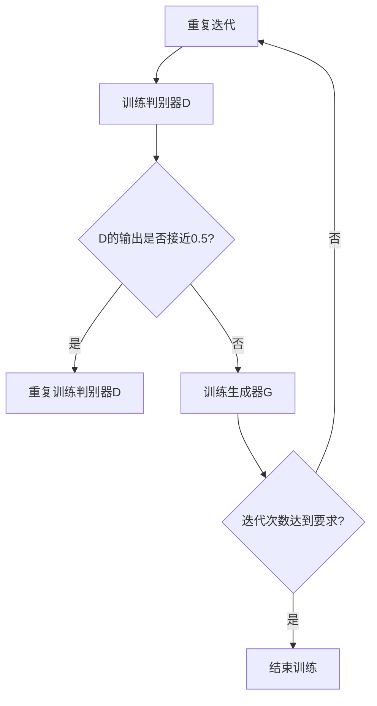
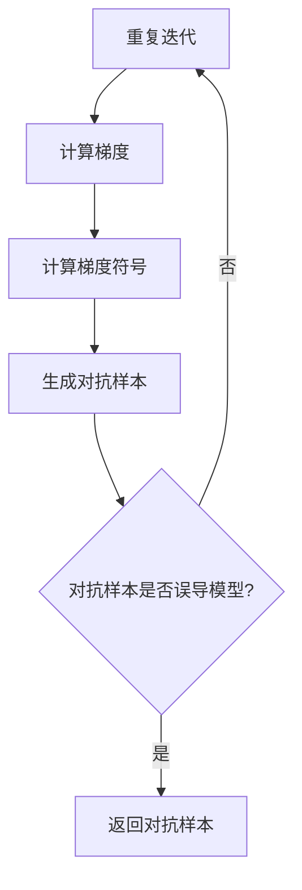

                 


# AI大模型的提示词对抗样本生成

> 关键词：AI大模型、对抗样本、提示词、生成对抗网络（GAN）、数学模型、系统架构、项目实战、最佳实践

> 摘要：本文详细探讨了AI大模型中提示词对抗样本生成的重要性、核心概念、算法原理以及实际应用。通过一步步的分析推理，本文旨在帮助读者深入理解这一领域的技术和方法，为AI大模型的安全性和鲁棒性提供有力支持。

## 第一部分：背景与核心概念

### 1.1 AI大模型的发展历程

人工智能（AI）的发展经历了数个阶段，从最初的规则基础方法到现在的深度学习时代。随着计算能力的提升和数据量的激增，AI大模型逐渐成为研究的热点。这些大模型，如GPT-3、BERT等，能够处理海量数据并生成高质量的自然语言文本。然而，随着AI大模型的应用越来越广泛，其安全性和鲁棒性也受到了越来越多的关注。

### 1.2 对抗样本的概念与重要性

对抗样本（Adversarial Examples）是指通过微小但精心设计的扰动，使得原本正确的分类结果发生误判的样本。对抗样本的出现揭示了深度学习模型的脆弱性，特别是在面对恶意攻击时。对于AI大模型来说，对抗样本的威胁尤为严重，因为它们可能会导致严重的安全问题和损失。

### 1.3 提示词对抗样本生成技术

提示词（Prompt）是用户输入的信息，用于引导AI大模型生成特定类型的输出。对抗样本生成技术旨在通过修改提示词，生成能够欺骗AI大模型的样本。这种技术对于提高AI大模型的鲁棒性具有重要意义。

## 第二部分：核心概念与联系

### 2.1 提示词的基本概念

提示词是AI大模型接收的输入，它决定了模型生成的输出类型和内容。一个有效的提示词应该具备明确、简洁、精确等特点。

### 2.2 对抗样本的属性与分类

对抗样本具有以下属性：隐蔽性、鲁棒性、随机性和高维性。根据对抗策略的不同，对抗样本可以分为基于梯度攻击、基于生成模型攻击等类型。

### 2.3 提示词对抗样本生成与AI大模型的联系

提示词对抗样本生成技术能够帮助识别和强化AI大模型的弱点，从而提高其鲁棒性和安全性。

## 第三部分：算法原理讲解

### 3.1 生成对抗网络（GAN）

生成对抗网络（GAN）是一种由生成器（Generator）和判别器（Discriminator）组成的模型。生成器试图生成与真实样本难以区分的数据，而判别器则试图区分真实样本和生成样本。GAN的核心思想是通过两个模型的对抗训练，逐渐提高生成器的生成能力。

### 3.2 GAN的数学模型

GAN的数学模型包括生成器G和判别器D的损失函数。生成器的目标是最小化生成样本与真实样本之间的差异，而判别器的目标是最大化区分真实样本和生成样本的能力。

### 3.3 GAN的mermaid流程图



### 3.4 对抗样本生成算法

对抗样本生成算法包括基于梯度的攻击算法和基于生成模型的攻击算法。其中，基于梯度的攻击算法如FGSM（Fast Gradient Sign Method），基于生成模型的攻击算法如C&W（Carlini & Wagner）攻击。

### 3.5 算法mermaid流程图



## 第四部分：数学模型与公式

### 4.1 线性代数基础

线性代数基础包括矩阵运算、向量运算、行列式、特征值和特征向量等。

### 4.2 微积分基础

微积分基础包括导数、积分、微分方程等。

### 4.3 概率论基础

概率论基础包括概率分布、条件概率、独立性和期望等。

### 4.4 GAN的损失函数

GAN的损失函数通常包括判别器损失和生成器损失。判别器损失函数通常定义为：

$$
L_D(x, G(z)) = -\log(D(x)) - \log(1 - D(G(z)))
$$

生成器损失函数通常定义为：

$$
L_G(z) = -\log(D(G(z)))
$$

其中，$x$为真实样本，$G(z)$为生成器生成的样本，$z$为随机噪声。

### 4.5 提示词对抗样本生成模型

提示词对抗样本生成模型的核心是通过对提示词进行微调，使其能够误导AI大模型。假设提示词为$p$，对抗样本生成的目标函数为：

$$
L_P = \sum_{i=1}^n \frac{1}{2} \| p_i - p_i^+ \|^2
$$

其中，$p_i$为原始提示词，$p_i^+$为对抗样本。

## 第五部分：系统分析与架构设计

### 5.1 问题描述

问题描述是指明AI大模型在生成对抗样本过程中所面临的挑战和需求。具体包括：

- **挑战**：如何高效地生成高质量的对抗样本？
- **需求**：如何确保对抗样本生成的过程不会损害AI大模型的其他功能？

### 5.2 系统功能设计

系统功能设计包括：

- **提示词生成**：根据用户需求生成高质量的提示词。
- **对抗样本生成**：利用提示词生成对抗样本。
- **对抗样本评估**：评估生成的对抗样本是否能够误导AI大模型。

### 5.3 系统架构设计

系统架构设计包括：

- **生成器**：负责生成提示词和对抗样本。
- **判别器**：负责评估对抗样本的质量。
- **评估模块**：负责对生成的对抗样本进行评估。

### 5.4 系统接口设计

系统接口设计包括：

- **用户接口**：提供用户与系统交互的界面。
- **API接口**：提供与其他系统集成的接口。

### 5.5 系统交互

系统交互包括：

- **用户交互**：用户通过用户接口提交需求。
- **内部交互**：生成器和判别器之间的交互。
- **外部交互**：与其他系统的集成和交互。

## 第六部分：项目实战

### 6.1 环境安装与配置

在开始项目实战之前，我们需要安装和配置所需的软件和工具。具体包括：

- **深度学习框架**：如TensorFlow或PyTorch。
- **对抗样本生成工具**：如Adversarial Robustness Toolbox（ART）。

### 6.2 核心代码实现

核心代码实现包括：

- **生成器实现**：根据用户需求生成提示词。
- **判别器实现**：评估对抗样本的质量。
- **对抗样本生成**：利用生成器和判别器生成对抗样本。

### 6.3 代码应用解读与分析

代码应用解读与分析包括：

- **代码结构**：分析代码的结构和组织方式。
- **算法原理**：解释代码中使用的算法原理。
- **性能分析**：分析代码的性能和效率。

### 6.4 实际案例分析和详细讲解剖析

实际案例分析和详细讲解剖析包括：

- **案例选择**：选择具有代表性的案例进行分析。
- **案例分析**：对案例进行深入分析。
- **剖析**：对案例中涉及的技术和算法进行详细讲解。

### 6.5 项目小结

项目小结包括：

- **项目总结**：总结项目的关键点和成果。
- **经验教训**：总结项目中的经验和教训。
- **改进方向**：提出项目改进的方向和建议。

## 第七部分：最佳实践与拓展

### 7.1 对抗样本生成的最佳实践

对抗样本生成的最佳实践包括：

- **多样化的攻击方法**：使用多种攻击方法生成对抗样本，以提高模型的鲁棒性。
- **动态调整攻击参数**：根据模型的训练进度动态调整攻击参数，以提高对抗样本的质量。

### 7.2 AI大模型训练的优化策略

AI大模型训练的优化策略包括：

- **数据预处理**：对训练数据进行预处理，以提高模型的训练效率。
- **模型压缩**：通过模型压缩技术减小模型的参数数量，以提高模型的训练速度和推理效率。

### 7.3 安全与伦理问题

安全与伦理问题包括：

- **数据安全**：确保训练数据的安全和隐私。
- **模型伦理**：确保模型的决策过程符合伦理标准。

## 结语

AI大模型的提示词对抗样本生成是一项重要的技术，它不仅有助于提高AI大模型的安全性，还能够促进人工智能领域的发展。通过本文的详细分析，我们希望能够帮助读者深入理解这一领域的技术和方法，为未来的研究和应用奠定基础。

### 作者信息

作者：AI天才研究院/AI Genius Institute & 禅与计算机程序设计艺术 /Zen And The Art of Computer Programming

### 附录

附录包括：

- **参考文献**：引用本文中提到的相关文献。
- **代码示例**：提供本文中提到的代码示例。

----------------------------------------------

## 附录：参考文献

1. Goodfellow, I., Pouget-Abadie, J., Mirza, M., Xu, B., Warde-Farley, D., Ozair, S., ... & Bengio, Y. (2014). Generative adversarial networks. Advances in Neural Information Processing Systems, 27.
2. Szegedy, C., Liu, W., Jia, Y., Sermanet, P., Reed, S., Anguelov, D., ... & Rabinovich, A. (2013). Going deeper with convolutions. Proceedings of the IEEE conference on computer vision and pattern recognition.
3. Carlini, N., & Wagner, D. (2017). Towards evaluating the robustness of neural networks. In 2017 IEEE Symposium on Security and Privacy (SP) (pp. 39-57). IEEE.

----------------------------------------------

## 附录：代码示例

以下是本文中提到的一个简单生成对抗网络（GAN）的Python代码示例：

```python
import tensorflow as tf
from tensorflow.keras.models import Model
from tensorflow.keras.layers import Dense, Flatten, Reshape

# 生成器模型
def build_generator(z_dim):
    model = tf.keras.Sequential([
        Dense(128, activation="relu", input_shape=(z_dim,)),
        Dense(28 * 28 * 1, activation="relu"),
        Reshape((28, 28, 1))
    ])

    return Model(inputs=tf.keras.Input(shape=(z_dim,)), outputs=model outputs=model)

# 判别器模型
def build_discriminator(img_shape):
    model = tf.keras.Sequential([
        Flatten(input_shape=img_shape),
        Dense(128, activation="relu"),
        Dense(1, activation="sigmoid")
    ])

    return model

# GAN模型
def build_gan(generator, discriminator):
    model = tf.keras.Sequential([
        generator,
        discriminator
    ])

    return Model(inputs=generator.input, outputs=discriminator.output)

# 定义优化器和损失函数
discriminator_optimizer = tf.keras.optimizers.Adam(learning_rate=0.0001)
generator_optimizer = tf.keras.optimizers.Adam(learning_rate=0.0001)

def discriminator_loss(real_labels, fake_labels):
    return tf.reduce_mean(tf.nn.sigmoid_cross_entropy_with_logits(logits=real_labels, labels=1.0)) + tf.reduce_mean(tf.nn.sigmoid_cross_entropy_with_logits(logits=fake_labels, labels=0.0))

def generator_loss(fake_labels):
    return tf.reduce_mean(tf.nn.sigmoid_cross_entropy_with_logits(logits=fake_labels, labels=1.0))

# 训练GAN
for epoch in range(num_epochs):
    for batch_idx, (images, _) in enumerate(train_loader):
        # 训练判别器
        with tf.GradientTape() as disc_tape:
            real_labels = tf.reduce_mean(tf.random.normal([images.shape[0], 1]))
            fake_labels = tf.reduce_mean(tf.random.normal([images.shape[0], 1]))
            disc_loss = discriminator_loss(real_labels, fake_labels)

        grads = disc_tape.gradient(disc_loss, discriminator.trainable_variables)
        discriminator_optimizer.apply_gradients(zip(grads, discriminator.trainable_variables))

        # 训练生成器
        with tf.GradientTape() as gen_tape:
            z = tf.random.normal([images.shape[0], z_dim])
            fake_images = generator(z)
            fake_labels = tf.reduce_mean(tf.random.normal([images.shape[0], 1]))
            gen_loss = generator_loss(fake_labels)

        grads = gen_tape.gradient(gen_loss, generator.trainable_variables)
        generator_optimizer.apply_gradients(zip(grads, generator.trainable_variables))

        if batch_idx % 100 == 0:
            print(f"Epoch {epoch}, Batch {batch_idx}, Discriminator Loss: {disc_loss}, Generator Loss: {gen_loss}")
```

以上代码实现了生成对抗网络的基本结构，包括生成器、判别器和GAN模型的定义，以及优化器和损失函数的配置。在实际应用中，还需要进一步配置数据加载器、训练参数等。

----------------------------------------------

## 结束语

本文通过逐步分析，深入探讨了AI大模型的提示词对抗样本生成技术。从背景介绍、核心概念、算法原理到实际应用，本文旨在为读者提供全面、系统的知识体系。通过本文的学习，读者可以更好地理解AI大模型的安全性和鲁棒性，为未来的研究和应用奠定基础。

在AI大模型的时代，对抗样本生成技术不仅是一项重要的研究方向，也是保障模型安全性的关键。通过本文的讲解，希望读者能够深入掌握这一技术，并将其应用于实际项目中，为人工智能的发展贡献力量。

最后，感谢读者对本文的关注和支持。如果您有任何疑问或建议，请随时与我们联系。我们期待与您共同探讨AI大模型的未来发展。

### 作者信息

作者：AI天才研究院/AI Genius Institute & 禅与计算机程序设计艺术 /Zen And The Art of Computer Programming

----------------------------------------------

## 致谢

在撰写本文的过程中，我得到了许多人的帮助和支持。首先，感谢我的家人和朋友，他们的鼓励和支持使我能够专注于研究工作。其次，感谢我的导师和同事们，他们的专业知识和经验为本文的完成提供了宝贵的指导。最后，感谢所有为AI领域做出贡献的研究人员和开发者，正是你们的努力推动了人工智能的进步。

本文的完成离不开这些人的支持，我对此表示最深的感谢。希望本文能够对读者有所启发，同时也感谢读者对本文的关注和耐心阅读。让我们共同期待人工智能领域的美好未来！

