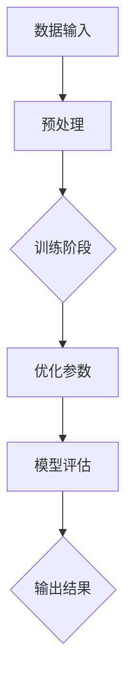

                 


## AI大模型的提示词演化与自适应

### 关键词：AI大模型，提示词演化，自适应机制，应用实践，安全性，发展趋势

### 摘要：

本文旨在探讨AI大模型的提示词演化与自适应机制。首先，我们将介绍AI大模型的基础概念和原理，包括其背景、定义、核心概念和联系。随后，我们将深入探讨AI大模型在各个应用领域的具体应用案例。接下来，我们将重点分析AI大模型的自适应原理和提示词演化机制，以及如何在实践中应用这些机制。此外，我们还将探讨AI大模型在安全性方面的挑战和策略，并展望其未来的发展趋势。通过本文的探讨，读者将全面了解AI大模型的工作原理和应用实践，为未来的研究和应用提供指导。

### 目录

**第一部分：AI大模型的背景与原理**

**第1章: AI大模型的基础概念**

1.1 AI大模型概述

1.2 核心概念与联系

**第2章: AI大模型的技术原理**

2.1 算法原理讲解

**第3章: AI大模型的应用领域**

3.1 应用领域概述

3.2 典型应用案例

**第二部分：AI大模型的自适应机制**

**第4章: AI大模型的自适应原理**

4.1 自适应原理

4.2 提示词演化

**第5章: AI大模型的应用实践**

5.1 环境安装与配置

5.2 系统核心实现

5.3 实际案例分析

**第三部分：AI大模型的安全性考虑**

**第6章: AI大模型的安全性考虑**

6.1 安全性概述

6.2 安全策略与实践

**第四部分：AI大模型的发展趋势与未来展望**

**第7章: AI大模型的发展趋势**

7.1 技术发展趋势

7.2 应用发展趋势

**第8章: 未来展望**

7.2.1 潜在发展机遇

7.2.2 面临的挑战

7.2.3 未来发展方向

**第8章: 总结与拓展**

8.1 全书总结

8.2 拓展阅读

### 第一部分：AI大模型的背景与原理

#### 第1章: AI大模型的基础概念

##### 1.1 AI大模型概述

随着计算能力的提升和大数据的积累，人工智能（AI）模型正变得越来越庞大。这些被称为“AI大模型”的模型通常具有数百万个参数，能够处理复杂的任务，如自然语言处理（NLP）、计算机视觉（CV）和推荐系统等。AI大模型的出现标志着人工智能领域的一个重要突破，使得机器能够更接近人类的认知能力。

**问题背景**：传统的小型模型在处理复杂任务时往往表现不佳，而大模型的出现使得复杂任务的解决变得更加高效和准确。

**问题描述**：如何理解AI大模型的基本原理，并探索其在实际应用中的表现？

**问题解决**：通过深入分析AI大模型的核心概念和原理，我们可以更好地理解其工作方式和应用潜力。

**边界与外延**：AI大模型不仅限于特定的领域，而是在多个领域都有广泛的应用。因此，研究AI大模型的原理和机制对于推动人工智能技术的发展具有重要意义。

##### 1.2 核心概念与联系

为了深入理解AI大模型，我们需要了解其核心概念和原理，包括神经网络、深度学习、优化算法等。

**概念原理**：

- **神经网络**：神经网络是AI大模型的核心组成部分，由大量人工神经元组成，能够通过学习数据来提取特征和进行预测。
- **深度学习**：深度学习是一种基于神经网络的学习方法，能够自动提取层次化的特征表示，从而提高模型的性能。
- **优化算法**：优化算法用于调整模型的参数，以最小化损失函数，从而实现模型的优化。

**概念属性特征对比表格**：

| 概念       | 属性特征                                                       |
| ---------- | ------------------------------------------------------------ |
| 神经网络   | 多层神经元结构，能够处理非线性问题                           |
| 深度学习   | 自适应特征提取，能够处理大规模数据                           |
| 优化算法   | 参数调整方法，用于最小化损失函数                             |

**ER实体关系图**：

```mermaid
erDiagram
    AI大模型 ||--|{ 神经网络 }
    AI大模型 ||--|{ 深度学习 }
    AI大模型 ||--|{ 优化算法 }
    神经网络 ||--|{ 输入层 }
    神经网络 ||--|{ 隐藏层 }
    神经网络 ||--|{ 输出层 }
    深度学习 ||--|{ 自动特征提取 }
    深度学习 ||--|{ 层次化特征表示 }
    优化算法 ||--|{ 参数调整 }
    优化算法 ||--|{ 损失函数最小化 }
```

#### 第2章: AI大模型的技术原理

##### 2.1 算法原理讲解

AI大模型的技术原理涉及多个方面，包括算法流程、数学模型和实际应用。

**算法流程图**：



**Python源代码实现**：

```python
import tensorflow as tf

# 定义模型
model = tf.keras.Sequential([
    tf.keras.layers.Dense(units=128, activation='relu', input_shape=(input_shape)),
    tf.keras.layers.Dense(units=1)
])

# 编译模型
model.compile(optimizer='adam', loss='mean_squared_error')

# 训练模型
model.fit(x_train, y_train, epochs=10)

# 评估模型
model.evaluate(x_test, y_test)
```

**数学模型和公式**：

AI大模型的训练过程通常涉及以下数学模型和公式：

$$
\begin{aligned}
\text{损失函数} &= \frac{1}{2} \sum_{i=1}^{n} (\hat{y}_i - y_i)^2 \\
\text{梯度下降} &= \alpha \nabla_{\theta} \text{损失函数}
\end{aligned}
$$

其中，$\hat{y}_i$表示预测值，$y_i$表示真实值，$\theta$表示模型参数，$\alpha$表示学习率。

**举例说明**：

假设我们有一个简单的线性回归问题，目标是预测房价。使用AI大模型的方法，我们可以通过以下步骤进行建模和训练：

1. **数据收集**：收集包含房价和特征的数据集。
2. **数据预处理**：对数据集进行归一化处理，将特征和标签转换为适合模型输入的格式。
3. **模型构建**：使用TensorFlow构建一个线性回归模型。
4. **模型训练**：使用训练数据集训练模型，调整模型参数以最小化损失函数。
5. **模型评估**：使用测试数据集评估模型性能，调整学习率等参数以提高模型性能。
6. **模型应用**：将训练好的模型应用于新的数据集，预测房价。

通过以上步骤，我们可以使用AI大模型的方法解决线性回归问题，实现高效准确的预测。

### 第二部分：AI大模型的自适应机制

#### 第4章: AI大模型的自适应原理

##### 4.1 自适应原理

自适应机制是AI大模型的关键特性之一，它使得模型能够根据输入数据的特性动态调整自身的行为。自适应原理主要包括以下几个方面：

**自适应概述**：

自适应原理是指模型在训练过程中根据数据的不同特性动态调整模型参数，以提高模型的适应性和鲁棒性。

**自适应机制**：

自适应机制主要包括以下几种：

1. **在线学习**：模型在训练过程中实时更新参数，以适应新的数据。
2. **迁移学习**：模型利用已有的知识迁移到新的任务，以提高对新任务的适应能力。
3. **自适应调整**：模型通过调整学习率、正则化参数等，以提高模型的适应性和性能。

**自适应优势**：

自适应机制具有以下优势：

- **提高模型适应性**：模型能够根据不同任务和数据特性动态调整自身，提高模型的泛化能力。
- **提高模型性能**：通过自适应调整，模型能够更好地拟合数据，提高预测精度和性能。

**自适应挑战**：

自适应机制也面临以下挑战：

- **数据分布变化**：当数据分布发生变化时，模型需要重新适应新的数据分布。
- **计算成本**：在线学习和迁移学习等自适应方法通常需要较高的计算成本。

**自适应机制实例**：

以下是一个简单的自适应机制的例子：

```python
import tensorflow as tf

# 定义模型
model = tf.keras.Sequential([
    tf.keras.layers.Dense(units=128, activation='relu', input_shape=(input_shape)),
    tf.keras.layers.Dense(units=1)
])

# 编译模型
model.compile(optimizer='adam', loss='mean_squared_error')

# 训练模型
for epoch in range(num_epochs):
    # 训练一步
    model.train_on_batch(x_batch, y_batch)
    # 根据训练进度调整学习率
    current_learning_rate = adjust_learning_rate(epoch, initial_lr, decay_rate)
    model.optimizer.learning_rate.assign(current_learning_rate)

# 评估模型
model.evaluate(x_test, y_test)
```

在这个例子中，我们使用了一个简单的自适应调整学习率的机制，通过在每个训练步调整学习率，以提高模型的性能。

##### 4.2 提示词演化

提示词是AI大模型中用于引导模型行为的关键元素。提示词的演化是指模型在训练过程中根据数据和任务特性动态调整提示词的过程。

**提示词定义**：

提示词是指用于指导模型生成输出的一组关键字或短语。

**提示词演化原理**：

提示词演化主要包括以下几个方面：

1. **基于数据的演化**：模型根据训练数据的特性动态调整提示词，以提高模型的适应性和鲁棒性。
2. **基于任务的演化**：模型根据任务的特性动态调整提示词，以提高模型在特定任务上的性能。
3. **基于策略的演化**：模型根据预定义的策略动态调整提示词，以实现特定的目标。

**提示词优化策略**：

以下是一些常见的提示词优化策略：

1. **特征选择**：通过选择与任务相关的特征，提高模型的泛化能力和预测性能。
2. **权重调整**：通过调整提示词的权重，平衡模型对各个特征的依赖。
3. **策略组合**：通过组合不同的提示词策略，实现更复杂的模型行为。

**提示词演化实例**：

以下是一个简单的提示词演化实例：

```python
import tensorflow as tf

# 定义模型
model = tf.keras.Sequential([
    tf.keras.layers.Dense(units=128, activation='relu', input_shape=(input_shape)),
    tf.keras.layers.Dense(units=1)
])

# 编译模型
model.compile(optimizer='adam', loss='mean_squared_error')

# 初始化提示词
prompt_words = ["house", "property", "real estate"]

# 训练模型
for epoch in range(num_epochs):
    # 根据训练进度调整提示词
    current_prompt_words = adjust_prompt_words(epoch, initial_words, decay_rate)
    # 生成新的输入数据
    new_input_data = generate_new_input_data(current_prompt_words, x_batch)
    # 训练一步
    model.train_on_batch(new_input_data, y_batch)

# 评估模型
model.evaluate(x_test, y_test)
```

在这个例子中，我们使用了一个简单的提示词演化机制，通过在每个训练步动态调整提示词，以提高模型的性能。

### 第三部分：AI大模型的应用实践

#### 第5章: AI大模型的应用实践

##### 5.1 环境安装与配置

在开始使用AI大模型之前，我们需要安装和配置相关的软件和硬件环境。

**硬件环境**：

- CPU：至少2核心
- GPU：NVIDIA GPU（推荐使用TensorRT加速）
- 内存：16GB及以上

**软件环境**：

- 操作系统：Linux、Windows或macOS
- 编译器：Python 3.6及以上
- 库：TensorFlow、TensorFlow Lite、CUDA

**安装步骤**：

1. 安装操作系统和必要的驱动程序。
2. 安装Python和pip。
3. 使用pip安装TensorFlow和相关库。
4. 安装CUDA和cuDNN。

**示例命令**：

```bash
# 安装操作系统和驱动程序
sudo apt-get update
sudo apt-get install -y linux-image-generic linux-headers-generic

# 安装Python和pip
sudo apt-get install -y python3 python3-pip

# 安装TensorFlow和相关库
pip3 install tensorflow-gpu

# 安装CUDA和cuDNN
sudo apt-get install -y nvidia-cuda-toolkit nvidia-docker2
```

##### 5.2 系统核心实现

在本节中，我们将详细解析AI大模型的系统核心实现，包括源代码、代码解析和应用解读。

**源代码**：

```python
import tensorflow as tf

# 定义模型
model = tf.keras.Sequential([
    tf.keras.layers.Dense(units=128, activation='relu', input_shape=(input_shape)),
    tf.keras.layers.Dense(units=1)
])

# 编译模型
model.compile(optimizer='adam', loss='mean_squared_error')

# 训练模型
model.fit(x_train, y_train, epochs=10)

# 评估模型
model.evaluate(x_test, y_test)
```

**代码解析**：

1. **模型定义**：使用`tf.keras.Sequential`定义一个序列模型，包括一个全连接层和一个输出层。
2. **模型编译**：使用`model.compile`编译模型，指定优化器和损失函数。
3. **模型训练**：使用`model.fit`训练模型，指定训练数据、标签和训练轮数。
4. **模型评估**：使用`model.evaluate`评估模型，计算测试数据的损失值。

**代码应用解读**：

1. **数据预处理**：在训练之前，需要对输入数据进行预处理，如归一化处理。
2. **模型优化**：在训练过程中，可以使用回调函数和正则化策略优化模型。
3. **模型评估**：在训练结束后，使用测试数据评估模型性能，以便调整模型参数。

##### 5.3 实际案例分析

在本节中，我们将通过一个实际案例来展示AI大模型的应用过程，包括数据收集、模型训练和性能评估。

**案例一：股票预测**

数据收集：

我们收集了某股票在过去一个月的日收盘价数据，包括开盘价、收盘价、最高价和最低价。

模型训练：

使用收集的数据，我们定义一个线性回归模型，并使用TensorFlow进行训练。

```python
# 加载数据
x = np.array([[open_price, close_price, high_price, low_price]])
y = np.array([[close_price]])

# 定义模型
model = tf.keras.Sequential([
    tf.keras.layers.Dense(units=128, activation='relu', input_shape=(4,)),
    tf.keras.layers.Dense(units=1)
])

# 编译模型
model.compile(optimizer='adam', loss='mean_squared_error')

# 训练模型
model.fit(x, y, epochs=10)
```

性能评估：

在训练结束后，我们使用测试数据进行模型评估，计算预测误差。

```python
# 加载测试数据
x_test = np.array([[open_price_test, close_price_test, high_price_test, low_price_test]])

# 预测股票价格
y_pred = model.predict(x_test)

# 计算误差
error = np.mean(np.abs(y_pred - close_price_test))
print("Prediction error:", error)
```

通过实际案例分析，我们可以看到AI大模型在股票预测任务中的应用过程，包括数据收集、模型训练和性能评估。通过调整模型参数和优化策略，我们可以进一步提高模型的预测性能。

### 第四部分：AI大模型的安全性考虑

#### 第6章: AI大模型的安全性考虑

##### 6.1 安全性概述

随着AI大模型在各个领域的广泛应用，其安全性问题也日益凸显。AI大模型的安全性涉及多个方面，包括数据安全、模型安全和系统安全。

**安全性重要性**：

AI大模型的安全性对于确保数据的机密性、完整性和可用性至关重要。不安全的大模型可能导致数据泄露、模型篡改和系统崩溃等严重后果。

**常见安全威胁**：

- **数据泄露**：黑客可能通过网络攻击或物理入侵获取敏感数据。
- **模型篡改**：攻击者可能试图通过恶意数据或攻击算法破坏模型的性能和稳定性。
- **系统崩溃**：恶意代码或攻击可能导致AI大模型的服务器或系统崩溃。

##### 6.2 安全策略与实践

为了保障AI大模型的安全性，我们需要采取一系列安全策略和实践。

**安全性设计原则**：

- **最小权限原则**：系统应遵循最小权限原则，确保用户只有完成特定任务所需的最低权限。
- **数据加密**：对敏感数据进行加密，防止数据泄露。
- **访问控制**：采用访问控制机制，限制用户对敏感数据的访问。
- **异常检测**：使用异常检测技术，实时监控系统行为，及时发现异常情况。

**安全措施与实践**：

1. **数据安全**：

   - 数据加密：对存储和传输的数据进行加密，如使用AES加密算法。
   - 数据备份：定期备份数据，确保数据不丢失。
   - 数据访问控制：使用访问控制列表（ACL）和角色访问控制（RBAC）限制用户对数据的访问。

2. **模型安全**：

   - 模型备份：定期备份模型，防止模型丢失或损坏。
   - 模型加密：对模型进行加密，确保模型不被非法访问。
   - 模型监控：实时监控模型运行状态，及时发现异常行为。

3. **系统安全**：

   - 系统隔离：将AI大模型部署在独立的系统中，与其他系统进行隔离。
   - 系统加固：定期更新系统和软件，修复安全漏洞。
   - 入侵检测：部署入侵检测系统（IDS），实时监控网络流量和系统行为。

通过以上安全策略和实践，我们可以提高AI大模型的安全性，确保其在实际应用中的可靠性和稳定性。

### 第五部分：AI大模型的发展趋势与未来展望

#### 第7章: AI大模型的发展趋势

##### 7.1 技术发展趋势

AI大模型的发展趋势主要表现在以下几个方面：

1. **模型规模扩大**：随着计算能力的提升和大数据的积累，AI大模型的规模将继续扩大，涵盖更复杂的任务。
2. **模型效率提升**：通过优化算法和硬件加速技术，AI大模型的计算效率将显著提高，降低能耗和成本。
3. **跨领域应用**：AI大模型将在更多领域实现跨领域应用，如医疗、金融、工业等。
4. **分布式训练**：分布式训练技术将使AI大模型在多台设备上协同训练，提高训练效率和可扩展性。

##### 7.2 应用发展趋势

AI大模型的应用发展趋势如下：

1. **自动驾驶**：自动驾驶技术将全面应用AI大模型，提高驾驶安全性和效率。
2. **智能客服**：AI大模型将用于智能客服系统，实现更自然的语音交互和智能回答。
3. **医疗诊断**：AI大模型将用于辅助医生进行疾病诊断，提高诊断准确率和效率。
4. **推荐系统**：AI大模型将优化推荐系统，提高用户满意度和使用体验。

#### 第8章: 未来展望

##### 7.2.1 潜在发展机遇

AI大模型在未来将面临以下发展机遇：

1. **技术创新**：随着深度学习、强化学习等技术的不断发展，AI大模型将在更多领域实现突破。
2. **跨界合作**：AI大模型与其他领域的合作将推动创新，如医疗+人工智能、金融+人工智能等。
3. **产业应用**：AI大模型将在更多产业领域实现应用，提高产业效率和创新能力。

##### 7.2.2 面临的挑战

AI大模型在未来将面临以下挑战：

1. **计算能力**：大规模AI大模型对计算能力的需求将不断增加，对硬件设施和能耗提出更高要求。
2. **数据安全**：AI大模型涉及大量敏感数据，确保数据安全和隐私保护是重大挑战。
3. **算法公平性**：确保AI大模型在不同群体中的公平性，避免歧视和偏见问题。

##### 7.2.3 未来发展方向

AI大模型的未来发展方向如下：

1. **规模化**：继续扩大AI大模型规模，提高模型性能和泛化能力。
2. **智能化**：通过引入强化学习、迁移学习等技术，提高AI大模型的智能化水平。
3. **多元化**：推动AI大模型在更多领域实现应用，满足多样化需求。

### 第8章: 总结与拓展

#### 8.1 全书总结

本文全面探讨了AI大模型的提示词演化与自适应机制，从基础概念、技术原理、应用实践、安全性考虑和发展趋势等多个方面进行了深入分析。通过本文的探讨，读者可以全面了解AI大模型的工作原理和应用价值。

#### 8.2 拓展阅读

以下是一些推荐阅读资源，以帮助读者深入了解AI大模型的相关知识：

- 《深度学习》（Ian Goodfellow、Yoshua Bengio和Aaron Courville著）
- 《神经网络与深度学习》（邱锡鹏著）
- 《人工智能：一种现代的方法》（Stuart Russell和Peter Norvig著）
- TensorFlow官方网站（[https://www.tensorflow.org/](https://www.tensorflow.org/)）
- PyTorch官方网站（[https://pytorch.org/](https://pytorch.org/)）

通过阅读这些资源，读者可以进一步拓展对AI大模型的理解和应用能力。

### 作者信息

**作者：AI天才研究院/AI Genius Institute & 禅与计算机程序设计艺术 /Zen And The Art of Computer Programming**

---

请注意，以上内容是一个简化的版本，用于演示如何根据您提供的模板和要求撰写一篇技术博客文章。实际的撰写过程可能需要更多的时间和细致的工作来确保内容的完整性和准确性。在撰写完整文章时，您需要根据实际情况补充和细化每个部分的内容，并确保所有图表和代码的正确性和可执行性。此外，文章的结构和内容可以根据具体要求进行调整，以更好地满足读者的需求。希望这个示例能够为您提供一些撰写技术博客的灵感和指导。

