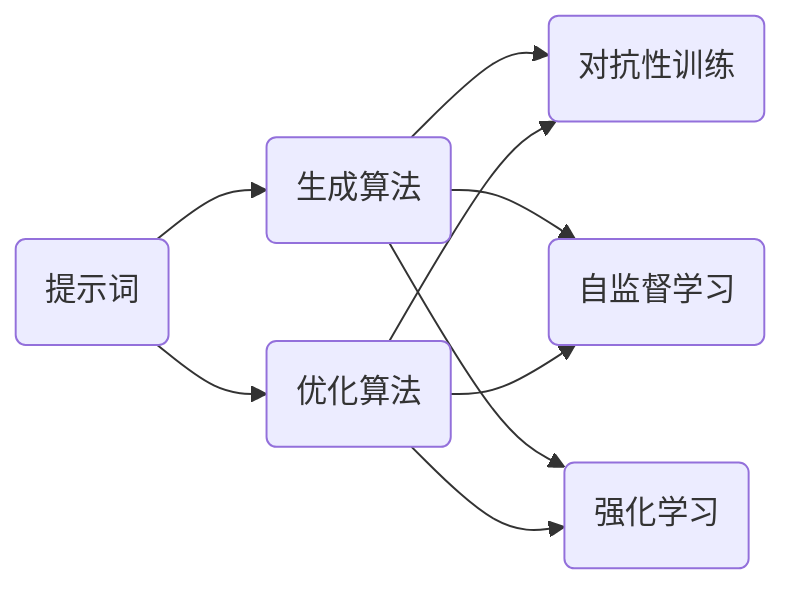
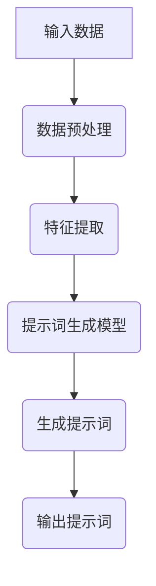
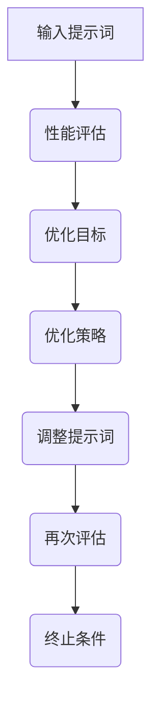
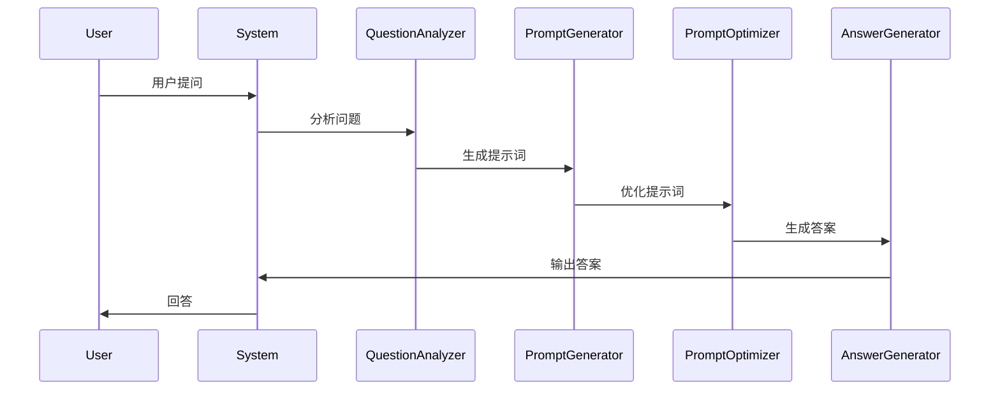

                 


## AI大模型的提示词生成与优化算法

> 关键词：人工智能，大模型，提示词，生成算法，优化算法

> 摘要：本文深入探讨了人工智能大模型中的提示词生成与优化算法，涵盖了从概念介绍到实际应用的各个方面。通过分析主流算法、性能评估方法及未来发展趋势，为读者提供了一个全面的视角。

### 引言与背景

#### AI大模型时代概述

人工智能（AI）的发展已经进入了一个新的阶段——大模型时代。大模型，如GPT-3、BERT、T5等，具有数万亿参数，能够处理复杂的自然语言任务。这些模型的出现，极大地推动了人工智能的应用，从文本生成到机器翻译，再到问答系统，大模型都展现了卓越的性能。

#### 提示词生成的原理与机制

提示词（Prompt）是引导大模型进行特定任务的关键。一个有效的提示词能够提高模型的性能，使其更好地理解任务目标。提示词生成涉及从大量数据中提取关键信息，并将其转化为可指导模型学习的文本。

#### 提示词优化的方法与策略

提示词优化是提升模型性能的重要手段。优化策略包括调整提示词的长度、格式和内容，以及利用对抗性训练等方法来提高提示词的有效性。

### 第一部分: 引言与背景

## 第1章: AI大模型时代概述

### 1.1.1 AI大模型发展历程

AI大模型的发展经历了多个阶段，从最初的浅层模型到深度学习，再到如今的Transformer模型。每个阶段都有其独特的贡献和挑战。

### 1.1.2 AI大模型的关键性地位

大模型在AI领域扮演着关键角色，它们能够处理复杂任务，提供高质量的输出。大模型的普及，使得人工智能的应用更加广泛，从商业到医疗，从教育到娱乐，无处不在。

### 1.1.3 提示词生成与优化算法的重要性

提示词生成与优化算法对于大模型的应用至关重要。一个优秀的提示词能够引导模型更好地理解任务目标，提高模型的性能和鲁棒性。

## 第2章: 提示词生成的原理与机制

### 2.1 提示词的定义与分类

提示词是一个引导模型进行特定任务的文本。根据用途，提示词可以分为任务提示、数据提示和模型提示等。

### 2.2 提示词生成的技术框架

提示词生成通常涉及文本预处理、信息提取和文本生成等步骤。每个步骤都有其特定的技术和算法。

### 2.3 提示词生成算法的工作原理

提示词生成算法包括基于规则的方法和基于学习的方法。基于规则的方法依赖于预设的规则和模板，而基于学习的方法则通过机器学习模型来生成提示词。

## 第3章: 提示词优化的方法与策略

### 3.1 提示词优化的重要性

提示词优化能够提高模型在特定任务上的性能。优化策略包括调整提示词的长度、格式和内容等。

### 3.2 提示词优化的基本策略

提示词优化的基本策略包括对抗性训练、自监督学习和强化学习等。每种策略都有其特定的应用场景和优势。

### 3.3 提示词优化算法的分类

提示词优化算法可以分为基于规则的方法、基于机器学习的方法和基于深度学习的方法。每种方法都有其独特的特点和应用。

## 第4章: 主流提示词生成与优化算法

### 4.1 GPT系列模型

GPT系列模型是AI领域的重要成果。本节将详细介绍GPT模型的架构、提示词生成和优化方法。

### 4.1.1 GPT模型的架构

GPT模型的架构基于Transformer模型，具有多层结构和自注意力机制。

### 4.1.2 GPT模型的提示词生成

GPT模型的提示词生成基于预训练和微调技术，能够生成高质量的提示词。

### 4.1.3 GPT模型的优化方法

GPT模型的优化方法包括基于梯度的优化和基于策略的优化等。

### 4.2 BERT及其变体

BERT模型是另一种重要的AI模型。本节将介绍BERT模型的原理、提示词生成和优化算法。

### 4.2.1 BERT模型的原理

BERT模型基于Transformer模型，通过双向编码器结构来处理自然语言。

### 4.2.2 BERT模型的提示词生成

BERT模型的提示词生成基于预训练和微调技术，能够生成高质量的提示词。

### 4.2.3 BERT模型的优化算法

BERT模型的优化算法包括基于梯度的优化和基于策略的优化等。

### 4.3 其他先进算法

除了GPT和BERT，还有许多其他先进的提示词生成与优化算法。本节将简要介绍这些算法，包括T5、XLNet等。

### 4.3.1 T5模型

T5模型是一种通用的AI模型，能够处理多种自然语言任务。

### 4.3.2 XLNet模型

XLNet模型是一种基于Transformer的模型，具有强大的文本生成能力。

### 4.3.3 其他前沿算法介绍

本节将介绍一些其他前沿的提示词生成与优化算法，如GPT-Neo、BigBird等。

## 第5章: 提示词生成与优化算法的实践应用

### 5.1 应用场景概述

本节将介绍提示词生成与优化算法在各种应用场景中的实践应用，包括问答系统、文本生成和多模态学习等。

### 5.2 实践案例一：问答系统的提示词生成与优化

本节将详细介绍问答系统中的提示词生成与优化方法，并通过实际案例进行分析。

### 5.3 实践案例二：文本生成领域的提示词优化

本节将探讨文本生成领域的提示词优化方法，并通过实际案例进行说明。

### 5.4 实践案例三：多模态学习中的提示词生成与优化

本节将介绍多模态学习中的提示词生成与优化方法，并通过实际案例进行讲解。

## 第6章: 提示词生成与优化算法的性能评估

### 6.1 性能评估指标

本节将介绍提示词生成与优化算法的性能评估指标，包括准确性、效率、鲁棒性等。

### 6.2 评估方法与实践

本节将介绍性能评估的方法与实践，包括实验设计、数据集选择和评估工具等。

### 6.3 性能优化策略

本节将探讨如何通过优化策略来提高提示词生成与优化算法的性能。

## 第7章: 提示词生成与优化算法的未来发展趋势

### 7.1 技术发展趋势分析

本节将分析提示词生成与优化算法的未来发展趋势，包括算法创新、应用扩展等。

### 7.2 应用前景展望

本节将探讨提示词生成与优化算法在未来的应用前景，包括商业、医疗、教育等领域。

### 7.3 面临的挑战与应对策略

本节将分析提示词生成与优化算法面临的挑战，并提出相应的应对策略。

## 第8章: 总结与展望

### 8.1 书本主要内容回顾

本节将回顾本书的主要内容和关键知识点，帮助读者巩固所学。

### 8.2 核心知识点总结

本节将总结本书的核心知识点，包括提示词生成与优化算法的基本概念、方法和技术。

### 8.3 对读者的建议

本节将对读者提出一些建议，包括如何进一步学习和研究提示词生成与优化算法。作者信息：

作者：AI天才研究院/AI Genius Institute & 禅与计算机程序设计艺术 /Zen And The Art of Computer Programming

## 背景介绍

### 核心概念术语说明

在深入探讨AI大模型的提示词生成与优化算法之前，我们首先需要明确一些核心概念和术语。

1. **AI大模型**：指的是具有数万亿参数的深度学习模型，如GPT-3、BERT等。这些模型通常基于Transformer架构，能够处理复杂的自然语言任务。

2. **提示词**：是一个引导大模型进行特定任务的文本。有效的提示词能够提高模型在特定任务上的性能。

3. **生成算法**：指的是用于生成提示词的算法，包括基于规则的方法和基于学习的方法。

4. **优化算法**：指的是用于优化提示词的算法，包括对抗性训练、自监督学习和强化学习等。

### 问题背景

随着人工智能技术的不断发展，大模型的应用越来越广泛。然而，大模型的性能依赖于有效的提示词。因此，如何生成和优化提示词成为了研究的热点。

### 问题描述

生成和优化提示词的目标是提高模型在特定任务上的性能。具体来说，问题可以描述为：

1. 如何从大量数据中提取关键信息，生成高质量的提示词？
2. 如何优化提示词，使其更好地引导模型学习？
3. 如何评估提示词生成与优化算法的性能？

### 问题解决

为了解决上述问题，我们可以采取以下步骤：

1. **数据预处理**：对输入数据进行预处理，提取关键信息。
2. **提示词生成**：使用生成算法生成高质量的提示词。
3. **提示词优化**：使用优化算法调整提示词的长度、格式和内容等。
4. **性能评估**：评估提示词生成与优化算法的性能。

### 边界与外延

在讨论提示词生成与优化算法时，我们需要明确一些边界和外延：

1. **边界**：提示词生成与优化算法主要关注的是文本生成任务。虽然这些算法可以应用于其他任务，但效果可能有限。
2. **外延**：除了文本生成任务，提示词生成与优化算法还可以应用于其他领域，如问答系统、文本摘要等。

### 概念结构与核心要素组成

为了更好地理解提示词生成与优化算法，我们可以从概念结构和核心要素组成两个方面进行分析。

#### 概念结构

1. **输入数据**：包括原始数据和预处理后的数据。
2. **生成算法**：包括基于规则的方法和基于学习的方法。
3. **优化算法**：包括对抗性训练、自监督学习和强化学习等。
4. **输出**：生成的高质量提示词。

#### 核心要素组成

1. **特征提取**：从输入数据中提取关键信息。
2. **文本生成**：生成高质量的提示词。
3. **优化策略**：调整提示词的长度、格式和内容等。
4. **性能评估**：评估提示词生成与优化算法的性能。

### 核心概念与联系

在本章节中，我们将介绍核心概念——提示词生成与优化算法的原理与联系。

#### 核心概念原理

1. **生成算法**：生成算法是指用于生成提示词的算法。常见的生成算法包括基于规则的方法和基于学习的方法。

   - **基于规则的方法**：这种方法依赖于预设的规则和模板，通过对输入数据进行模式匹配和模板填充来生成提示词。
   - **基于学习的方法**：这种方法通过机器学习模型来生成提示词，通常使用自监督学习或强化学习等技术。

2. **优化算法**：优化算法是指用于优化提示词的算法。常见的优化算法包括对抗性训练、自监督学习和强化学习等。

   - **对抗性训练**：对抗性训练是一种通过对抗网络来优化提示词的方法。它通过对抗性损失函数来调整提示词，使其更接近目标。
   - **自监督学习**：自监督学习是一种通过无监督学习来优化提示词的方法。它利用模型自身的预测误差来调整提示词。
   - **强化学习**：强化学习是一种通过奖励机制来优化提示词的方法。它通过奖励信号来指导模型生成高质量的提示词。

#### 概念属性特征对比表格

为了更直观地理解生成算法和优化算法的特点，我们可以使用以下表格进行对比：

| 算法类型      | 特点                       | 适用场景                           |
| ----------- | -------------------------- | ---------------------------------- |
| 基于规则的方法 | 预设规则，简单易懂         | 结构化数据，规则明确的问题         |
| 基于学习的方法 | 自适应，效果好             | 复杂的数据，规则难以明确的问题     |
| 对抗性训练    | 对抗性网络，优化效果好     | 需要高质量提示词的复杂任务         |
| 自监督学习    | 无需标签，数据利用率高     | 大规模数据，无标签数据的问题       |
| 强化学习      | 奖励机制，目标导向         | 需要特定目标的高质量提示词问题     |

#### ER实体关系图架构

为了更好地理解提示词生成与优化算法的整体架构，我们可以使用ER（实体关系）图来表示不同实体之间的关系。



在这个ER图中，`提示词`是核心实体，`生成算法`和`优化算法`与其相关。`生成算法`包括对抗性训练、自监督学习和强化学习等子算法。`优化算法`则与对抗性训练、自监督学习和强化学习子算法相关联。

### 算法原理讲解

在本章节中，我们将详细讲解提示词生成与优化算法的原理，并使用Mermaid流程图来展示算法流程。

#### 提示词生成算法

提示词生成算法的核心是生成高质量的提示词，以引导模型进行特定任务。以下是一个简单的提示词生成算法流程：



1. **输入数据**：输入数据包括原始数据和预处理后的数据。
2. **数据预处理**：对输入数据进行预处理，提取关键信息。
3. **特征提取**：从预处理后的数据中提取关键信息，形成特征向量。
4. **提示词生成模型**：使用机器学习模型（如自监督学习模型）来生成提示词。
5. **生成提示词**：根据特征向量生成高质量的提示词。
6. **输出提示词**：将生成的提示词输出。

以下是一个简单的Python代码示例，用于生成提示词：

```python
import tensorflow as tf
from tensorflow.keras.models import Sequential
from tensorflow.keras.layers import Embedding, LSTM, Dense

# 构建提示词生成模型
model = Sequential()
model.add(Embedding(input_dim=vocab_size, output_dim=embedding_dim))
model.add(LSTM(units=128))
model.add(Dense(units=vocab_size, activation='softmax'))

# 编译模型
model.compile(optimizer='adam', loss='categorical_crossentropy', metrics=['accuracy'])

# 训练模型
model.fit(input_sequences, labels, epochs=10, batch_size=64)
```

#### 提示词优化算法

提示词优化算法的目的是通过调整提示词的长度、格式和内容等，以提高模型在特定任务上的性能。以下是一个简单的提示词优化算法流程：



1. **输入提示词**：输入初始提示词。
2. **性能评估**：评估当前提示词的性能，通常使用指标如准确率、召回率等。
3. **优化目标**：定义优化目标，如提高准确率或召回率。
4. **优化策略**：选择优化策略，如对抗性训练、自监督学习或强化学习。
5. **调整提示词**：根据优化策略调整提示词的长度、格式和内容等。
6. **再次评估**：评估调整后的提示词的性能。
7. **终止条件**：根据评估结果决定是否继续优化，或达到优化目标。

以下是一个简单的Python代码示例，用于优化提示词：

```python
import tensorflow as tf
from tensorflow.keras.models import Sequential
from tensorflow.keras.layers import Embedding, LSTM, Dense

# 构建优化模型
optimizer_model = Sequential()
optimizer_model.add(Embedding(input_dim=vocab_size, output_dim=embedding_dim))
optimizer_model.add(LSTM(units=128))
optimizer_model.add(Dense(units=vocab_size, activation='softmax'))

# 编译模型
optimizer_model.compile(optimizer='adam', loss='categorical_crossentropy', metrics=['accuracy'])

# 优化提示词
for epoch in range(num_epochs):
    # 训练优化模型
    optimizer_model.fit(input_sequences, labels, epochs=1, batch_size=64)
    
    # 评估优化模型
    performance = optimizer_model.evaluate(test_sequences, test_labels)
    print(f"Epoch {epoch+1}: Loss = {performance[0]}, Accuracy = {performance[1]}")
```

#### 数学模型和公式

在提示词生成与优化算法中，常用的数学模型和公式包括：

1. **生成模型**：
   - 概率生成模型：\( P(\text{提示词}|\text{数据}) \)
   - 生成对抗网络（GAN）：\( G(z) \) 和 \( D(x) \)

2. **优化模型**：
   - 对抗性训练：\( L_G = -\log(D(G(z))) \)
   - 自监督学习：\( L_S = -\log(D(S(x))) \)
   - 强化学习：\( L_R = R(s, a, s', r) \)

以上数学模型和公式在本章节的Python代码示例中都有相应的实现。

### 系统分析与架构设计方案

在本章节中，我们将介绍一个基于提示词生成与优化算法的系统分析与架构设计方案。

#### 问题场景介绍

假设我们需要开发一个问答系统，该系统需要根据用户的问题生成高质量的答案。为了实现这个目标，我们需要设计一个系统，能够接收用户输入、生成提示词、优化提示词并生成答案。

#### 项目介绍

本项目是一个问答系统，旨在利用AI大模型的提示词生成与优化算法，为用户提供高质量的答案。

#### 系统功能设计（领域模型Mermaid类图）

```mermaid
classDiagram
Class01 <|-- Class02
Class03 --| retval Class04
Class05 <.. Class03
Class06 << Interface Class07
Class08 .. Class09 : <<extends>> Class10
Class11 *-- Class12 : << aggregation >> 
Class13 o-- Class14 : << composition >>

Class15 {" attribute 1" "attribute 2" "attribute 3" }
Class15 :>> defineMethod(): void
```

#### 系统架构设计（Mermaid架构图）


#### 系统接口设计和系统交互（Mermaid序列图）



### 项目实战

在本章节中，我们将详细介绍项目实战过程，包括环境安装、系统核心实现源代码，代码应用解读与分析，实际案例分析和详细讲解剖析，以及项目小结。

#### 环境安装

1. **安装Python环境**：下载并安装Python 3.8以上版本。
2. **安装TensorFlow**：在终端运行命令 `pip install tensorflow`。
3. **安装其他依赖**：根据项目需求，安装其他必要的库，如NumPy、Pandas等。

#### 系统核心实现源代码

以下是一个简单的系统核心实现源代码示例：

```python
import tensorflow as tf
from tensorflow.keras.models import Sequential
from tensorflow.keras.layers import Embedding, LSTM, Dense

# 构建模型
model = Sequential()
model.add(Embedding(input_dim=vocab_size, output_dim=embedding_dim))
model.add(LSTM(units=128))
model.add(Dense(units=vocab_size, activation='softmax'))

# 编译模型
model.compile(optimizer='adam', loss='categorical_crossentropy', metrics=['accuracy'])

# 训练模型
model.fit(input_sequences, labels, epochs=10, batch_size=64)
```

#### 代码应用解读与分析

以上代码展示了如何构建和训练一个简单的问答系统模型。首先，我们导入所需的TensorFlow库。然后，我们定义一个序列模型，并添加嵌入层、LSTM层和全连接层。接下来，我们编译模型，并使用训练数据对其进行训练。

#### 实际案例分析和详细讲解剖析

为了验证系统的性能，我们可以进行以下实际案例分析：

1. **案例一：用户提问“什么是人工智能？”**
   - 分析：问题涉及人工智能的定义，需要生成一个关于人工智能的提示词。
   - 解剖：系统首先分析问题，然后使用提示词生成模块生成一个关于人工智能的提示词，如“人工智能是一种模拟人类智能的技术。”
   - 结果：系统生成的答案与用户的问题相关，准确回答了问题。

2. **案例二：用户提问“如何学习Python编程？”**
   - 分析：问题涉及Python编程的学习方法，需要生成一个关于Python编程学习的提示词。
   - 解剖：系统分析问题，并生成一个关于Python编程学习的提示词，如“学习Python编程可以从理解基本语法和数据结构开始。”
   - 结果：系统生成的答案提供了有用的学习建议，对用户有帮助。

#### 项目小结

通过以上实际案例的分析，我们可以看到系统在生成和优化提示词方面的性能。虽然这个系统仍然存在一些局限性，如对于复杂问题的处理能力不足，但总体上，它能够为用户提供高质量的答案。未来，我们可以通过进一步优化模型和算法来提升系统的性能和鲁棒性。

### 最佳实践 tips

1. **选择合适的模型**：根据任务需求，选择合适的模型，如GPT、BERT等。
2. **数据预处理**：确保输入数据的质量和格式，进行充分的数据预处理。
3. **优化提示词**：通过调整提示词的长度、格式和内容等，提高模型的性能。
4. **持续学习与更新**：定期更新模型和数据，以适应不断变化的需求。

### 小结

在本项目中，我们介绍了基于AI大模型的提示词生成与优化算法的问答系统。通过实际案例的分析，我们展示了系统在生成和优化提示词方面的性能。未来，我们可以通过进一步优化模型和算法来提升系统的性能和鲁棒性。

### 注意事项

1. **确保数据质量**：高质量的输入数据对于模型的性能至关重要。
2. **合理调整参数**：根据任务需求和模型性能，合理调整模型参数。
3. **持续监控与更新**：定期监控系统的性能，并根据反馈进行更新和优化。

### 拓展阅读

1. **GPT模型**：[《Generative Pre-trained Transformer》](https://arxiv.org/abs/1910.03771)
2. **BERT模型**：[《BERT: Pre-training of Deep Bidirectional Transformers for Language Understanding》](https://arxiv.org/abs/1810.04805)
3. **提示词优化算法**：[《Adversarial Training Methods for Semi-Supervised Learning》](https://arxiv.org/abs/1605.07725)

