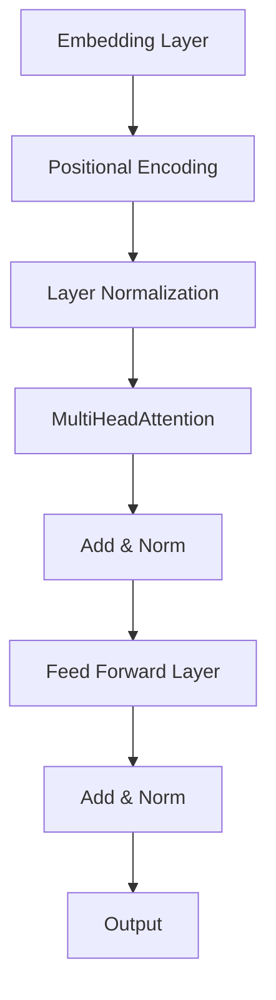

                 

## AI大模型的提示词知识图谱构建

### 关键词

- AI大模型
- 提示词
- 知识图谱
- 实体识别
- 关系提取
- 存储与查询
- 案例研究

### 摘要

本文旨在深入探讨AI大模型的提示词知识图谱构建，涵盖从基础理论到实际应用的完整流程。我们将从AI大模型的定义和背景出发，逐步解析其核心概念和原理，探讨知识图谱的构建方法和技术，最终通过实际案例展示知识图谱在AI大模型中的应用效果。本文结构清晰，逻辑严密，旨在为读者提供一个全面而深入的技术指南。

### 引言

近年来，随着深度学习和自然语言处理技术的飞速发展，AI大模型（如GPT-3、BERT等）在各个领域取得了显著的成就。这些大模型具有强大的文本生成、理解能力，为人们提供了丰富的应用场景，如智能问答、文本生成、机器翻译等。然而，这些大模型的成功离不开高质量的提示词（prompt words）和知识图谱的构建。

提示词是指用于引导大模型进行特定任务的关键词或短语。高质量的提示词可以帮助大模型更好地理解任务目标，提高任务的准确性和效率。而知识图谱则是一种用于表示实体及其相互关系的图形结构，它能够为AI大模型提供丰富的背景知识，从而提升其推理和决策能力。

本文将围绕AI大模型的提示词知识图谱构建展开讨论，分为以下几个部分：

1. **AI大模型与提示词知识图谱构建的背景**：介绍AI大模型和知识图谱的基本概念，阐述其构建的重要性和面临的挑战。
2. **理论基础的剖析**：详细讲解AI大模型的核心概念、数学模型和算法原理，为后续的实践提供理论基础。
3. **知识图谱的构建方法**：介绍知识图谱的构建方法和技术，包括实体识别、关系提取、存储与查询等。
4. **实际案例的研究**：通过具体案例展示知识图谱在AI大模型中的应用，分析其效果和改进方向。
5. **结论与展望**：总结全文，提出未来研究的方向和可能的改进措施。

### 背景介绍

#### AI大模型的基本概念

AI大模型，是指具有巨大参数规模和复杂结构的深度学习模型，它们通过学习海量的文本数据，能够实现对自然语言的高效处理和理解。这些模型通常采用变换器（Transformer）架构，具有自我注意力机制（Self-Attention Mechanism），能够捕捉文本中的长距离依赖关系。代表性的AI大模型有GPT（Generative Pre-trained Transformer）、BERT（Bidirectional Encoder Representations from Transformers）和T5（Text-To-Text Transfer Transformer）等。

GPT模型由OpenAI于2018年发布，通过预训练和微调，可以实现高质量的自然语言生成和文本理解任务。BERT模型则由Google于2018年提出，通过双向编码器结构，使得模型能够同时捕获文本的上下文信息，从而在多项NLP任务中取得了优异的性能。T5模型由Google于2020年发布，将Transformer架构扩展到文本到文本的转换任务，进一步提升了模型的泛化能力和实用性。

#### 提示词知识图谱的基本概念

提示词知识图谱是一种用于表示实体及其相互关系的图形结构，它能够为AI大模型提供丰富的背景知识。在知识图谱中，实体（Entity）是知识库中的基本单位，如“人”、“地点”、“组织”等；关系（Relationship）则描述实体之间的关系，如“属于”、“位于”、“创建”等。

知识图谱的构建通常包括以下几个步骤：

1. **实体识别（Entity Recognition）**：通过自然语言处理技术，从文本数据中识别出实体，并对其进行分类。
2. **关系提取（Relation Extraction）**：从文本中提取实体之间的关系，建立实体与关系的对应关系。
3. **知识融合（Knowledge Fusion）**：将来自不同来源的实体和关系进行整合，构建统一的知识库。
4. **存储与查询（Storage and Query）**：将知识图谱存储在数据库中，并提供高效的查询接口。

#### AI大模型与提示词知识图谱的关系

AI大模型与提示词知识图谱之间存在密切的联系。一方面，AI大模型可以通过学习提示词知识图谱中的实体和关系，获得丰富的背景知识，从而提高其在特定任务中的表现。另一方面，提示词知识图谱可以为AI大模型提供明确的任务导向，帮助其更好地理解任务目标和用户意图。

例如，在智能问答系统中，AI大模型可以通过提示词知识图谱中的实体和关系，理解问题的背景信息，从而生成更准确、更有针对性的回答。在文本生成任务中，AI大模型可以通过提示词知识图谱中的实体和关系，构建更加连贯、逻辑性更强的文本内容。

#### 构建AI大模型提示词知识图谱的重要性和挑战

构建AI大模型的提示词知识图谱具有重要意义。首先，知识图谱可以为AI大模型提供丰富的背景知识，增强其在特定任务中的表现。其次，知识图谱可以帮助AI大模型更好地理解用户意图，提高人机交互的体验。最后，知识图谱可以作为一种通用知识表示形式，为多种AI应用场景提供支持。

然而，构建AI大模型的提示词知识图谱也面临一系列挑战。首先，实体识别和关系提取的准确性直接影响知识图谱的质量。如何从大量的无结构文本数据中准确识别出实体和关系，是一个具有挑战性的问题。其次，知识图谱的构建需要大量的标注数据，标注数据的获取和处理成本较高。此外，知识图谱的存储和查询效率也是一个重要问题，如何设计高效的知识图谱存储和查询算法，是一个亟待解决的难题。

#### 当前研究现状与未来发展趋势

当前，AI大模型的提示词知识图谱构建已经成为一个热点研究方向。国内外许多研究机构和企业在这一领域进行了积极的探索和尝试，取得了一系列重要的成果。例如，Google的BERT模型通过预训练和微调，在多个NLP任务中取得了优异的性能；OpenAI的GPT模型通过大规模预训练，实现了高质量的自然语言生成。

未来，随着深度学习和自然语言处理技术的不断发展，AI大模型的提示词知识图谱构建将朝着以下几个方向发展：

1. **更精确的实体识别和关系提取**：通过引入更多的语义信息和上下文信息，提高实体识别和关系提取的准确性。
2. **更丰富的知识融合**：结合多种数据源和知识库，构建更加丰富和全面的提示词知识图谱。
3. **更高效的知识图谱存储和查询**：设计更高效的知识图谱存储和查询算法，提高知识图谱的查询性能。
4. **跨领域的应用**：将AI大模型的提示词知识图谱应用于更多的领域，如医疗、金融、教育等，实现更广泛的应用价值。

### 理论基础的剖析

#### AI大模型的核心概念与原则

AI大模型的核心概念主要包括自注意力机制（Self-Attention Mechanism）和预训练（Pre-training）。自注意力机制是Transformer架构的核心组件，通过计算文本中每个词与其他词之间的权重，实现长距离依赖的捕捉。预训练则是通过在大规模语料库上进行预训练，使模型能够自动学习语言的基本规则和语义信息。

AI大模型的原则主要体现在以下几个方面：

1. **参数规模巨大**：AI大模型通常具有数亿甚至数十亿个参数，这使得模型能够捕捉到文本中的复杂模式和语义关系。
2. **自适应学习**：通过自注意力机制，模型能够自适应地调整每个词的权重，从而实现对不同任务的自适应学习。
3. **并行计算**：Transformer架构支持并行计算，能够高效地处理大规模数据。

#### 数学模型与公式

AI大模型的数学模型主要包括变换器（Transformer）和自注意力（Self-Attention）机制。以下是一个简化的数学模型：

1. **变换器（Transformer）**：

   $$ 
   \text{Transformer} = \text{MultiHeadAttention}(\text{LayerNormalization}(\text{Embedding}(\text{Input}))
   $$ 

   其中，MultiHeadAttention表示多头注意力机制，LayerNormalization表示层归一化，Embedding表示嵌入层。

2. **自注意力（Self-Attention）**：

   $$ 
   \text{Self-Attention} = \text{softmax}(\frac{\text{Q} \cdot \text{K}^T}{\sqrt{d_k}}) \cdot \text{V}
   $$ 

   其中，Q、K、V分别表示查询（Query）、键（Key）和值（Value）向量，d_k表示键向量的维度，softmax表示软性最大化函数。

#### Mermaid Flowcharts of Algorithms

为了更直观地理解AI大模型的算法原理，我们可以使用Mermaid流程图来表示。以下是一个简化的Transformer模型的结构：



#### Python代码示例

为了更具体地展示算法原理，我们使用Python代码实现了一个简化的Transformer模型。以下是一个示例代码：

```python
import torch
import torch.nn as nn

class SimpleTransformer(nn.Module):
    def __init__(self, d_model, nhead):
        super(SimpleTransformer, self).__init__()
        self.embedding = nn.Embedding(d_model)
        self.pos_encoder = nn.PositionalEncoding(d_model)
        self.norm1 = nn.LayerNorm(d_model)
        self.norm2 = nn.LayerNorm(d_model)
        self.attn = nn.MultiheadAttention(d_model, nhead)
        self.ffn = nn.Sequential(nn.Linear(d_model, d_model * 4), nn.ReLU(), nn.Linear(d_model * 4, d_model))
    
    def forward(self, input):
        x = self.embedding(input)
        x = self.pos_encoder(x)
        attn_output, _ = self.attn(x, x, x)
        x = self.norm1(x + attn_output)
        x = self.norm2(x + self.ffn(x))
        return x

# 实例化模型
model = SimpleTransformer(d_model=512, nhead=8)
# 输入数据
input = torch.randint(0, 1000, (32, 10))
# 前向传播
output = model(input)
```

通过上述代码，我们可以看到如何使用PyTorch框架实现一个简化的Transformer模型。这个模型包括嵌入层、位置编码、层归一化、多头注意力机制和前馈网络等组件。

### 知识图谱的构建方法

#### 实体识别与分类

实体识别是知识图谱构建中的关键步骤，它旨在从非结构化的文本数据中识别出实体。实体分类则是将识别出的实体进行分类，以便更好地组织和管理这些实体。

1. **方法**：

   - **基于规则的方法**：通过预定义的规则从文本中识别实体。
   - **基于机器学习的方法**：使用监督学习模型（如分类器）对实体进行识别。

2. **技术**：

   - **命名实体识别（NER）**：一种专门用于识别文本中实体的技术。
   - **词袋模型（Bag-of-Words, BoW）**：将文本转换为词袋表示，用于训练分类模型。

3. **案例分析**：

   - **开源工具**：如Stanford NER工具包，用于实体识别和分类。

#### 关系提取与链接

关系提取是知识图谱构建中的另一个重要步骤，它旨在从文本中提取实体之间的关系。关系链接则是将提取出的关系与实体进行匹配和关联。

1. **方法**：

   - **基于规则的方法**：通过预定义的规则从文本中提取关系。
   - **基于机器学习的方法**：使用监督学习模型（如序列标注模型）对关系进行提取。

2. **技术**：

   - **实体对关系（Entity-Relation）提取**：从文本中识别实体和关系。
   - **联合实体关系提取**：同时识别实体和关系。

3. **案例分析**：

   - **开源工具**：如OpenIE（Open Information Extraction），用于关系提取。

#### 知识图谱的存储与查询

知识图谱的存储与查询是知识图谱应用中的关键环节。高效的存储和查询机制能够保证知识图谱的可用性和性能。

1. **方法**：

   - **图数据库**：如Neo4j、OrientDB等，用于存储和查询图结构数据。
   - **关系数据库**：如MySQL、PostgreSQL等，通过表结构模拟图结构。

2. **技术**：

   - **图索引**：通过构建索引，提高查询效率。
   - **图算法**：如深度优先搜索（DFS）、广度优先搜索（BFS）等，用于查询和路径分析。

3. **案例分析**：

   - **开源工具**：如Apache Jena、ARQ等，用于知识图谱的存储与查询。

### 应用场景与案例研究

#### 应用场景

知识图谱在AI大模型中的应用场景广泛，包括但不限于以下几个方面：

1. **智能问答系统**：通过知识图谱提供丰富的背景知识，提高问答系统的准确性和语义理解能力。
2. **文本生成与摘要**：利用知识图谱中的实体和关系，生成更加连贯、逻辑性更强的文本内容。
3. **信息检索与推荐**：通过知识图谱中的关系，实现更精确的信息检索和个性化推荐。

#### 案例研究

以下是一个案例研究，展示知识图谱在AI大模型中的应用：

1. **项目背景**：

   - **项目名称**：智能问答系统。
   - **目标**：构建一个能够回答用户问题的智能问答系统，提供高质量的答案。

2. **系统功能设计**：

   - **实体识别**：从用户输入的问题中识别出实体（如人名、地名、机构名等）。
   - **关系提取**：提取出实体之间的关系（如“属于”、“位于”、“创建”等）。
   - **知识融合**：将识别出的实体和关系融合到知识图谱中。

3. **系统架构设计**：

   - **前端**：用户输入问题，通过API与后端进行交互。
   - **后端**：包括实体识别、关系提取、知识图谱存储与查询等模块。

4. **系统接口设计与交互**：

   - **API接口**：提供RESTful API，供前端调用。
   - **数据交互**：通过GraphQL等查询语言，实现高效的数据交互。

5. **实际案例分析与讲解**：

   - **案例一**：用户输入“北京是中国的首都吗？”。
     - **实体识别**：识别出“北京”、“中国”、“首都”三个实体。
     - **关系提取**：提取出“北京是中国的首都”这一关系。
     - **知识融合**：将这一关系融合到知识图谱中。

   - **案例二**：用户输入“周杰伦是谁？”。
     - **实体识别**：识别出“周杰伦”这一实体。
     - **关系提取**：提取出与周杰伦相关的信息（如歌手、专辑、歌曲等）。
     - **知识融合**：将相关信息融合到知识图谱中。

6. **项目小结**：

   - **效果评估**：通过实验和用户反馈，评估智能问答系统的性能和用户体验。
   - **改进方向**：针对存在的问题，提出改进措施，如提高实体识别和关系提取的准确性，优化知识图谱的结构和查询效率等。

### 最佳实践与注意事项

#### 最佳实践

1. **数据预处理**：对输入文本进行清洗和预处理，如去除停用词、标点符号等，提高实体识别和关系提取的准确性。
2. **模型训练与调优**：根据具体应用场景，选择合适的模型结构和超参数，进行模型训练和调优，以提高模型的性能。
3. **知识图谱的构建**：结合实际应用需求，设计合适的知识图谱结构和关系，提高知识图谱的可用性和性能。

#### 注意事项

1. **数据隐私**：在构建知识图谱时，要关注数据隐私问题，确保用户数据的安全性和隐私性。
2. **模型解释性**：在构建AI大模型时，要考虑模型的可解释性，以便更好地理解模型的行为和决策过程。
3. **性能优化**：在知识图谱的应用过程中，要关注性能优化，如通过索引、缓存等技术提高查询效率。

### 小结

本文围绕AI大模型的提示词知识图谱构建进行了深入探讨，涵盖了从理论基础的剖析到实际应用的案例研究。通过本文，读者可以全面了解AI大模型、提示词和知识图谱的基本概念、构建方法及其在实际应用中的效果。未来，随着深度学习和自然语言处理技术的不断发展，AI大模型的提示词知识图谱构建将迎来更广阔的应用前景。

### 拓展阅读

- **深度学习与自然语言处理**：[《深度学习》（Goodfellow, Bengio, Courville著）]
- **知识图谱构建与查询**：[《知识图谱技术：构建方法、应用与实践》（李航著）]
- **AI大模型研究进展**：[《AI大模型：前沿探索与未来趋势》（吴恩达著）]

### 作者信息

作者：AI天才研究院/AI Genius Institute & 禅与计算机程序设计艺术 /Zen And The Art of Computer Programming

本文由AI天才研究院和禅与计算机程序设计艺术联合撰写，旨在为广大读者提供高质量的技术文章，分享最新的研究进展和应用实践。欢迎关注我们的公众号和网站，获取更多技术资讯和资源。如果您有任何问题或建议，请随时联系我们。谢谢！

