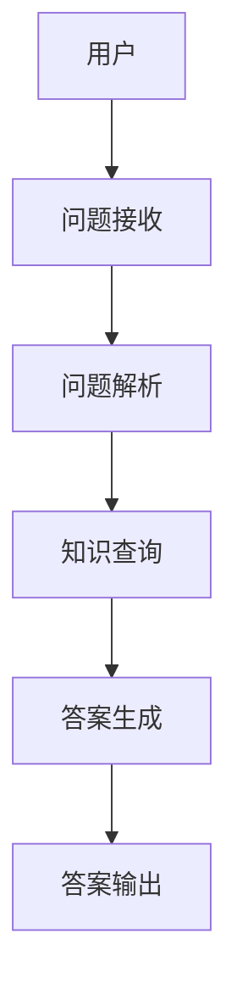
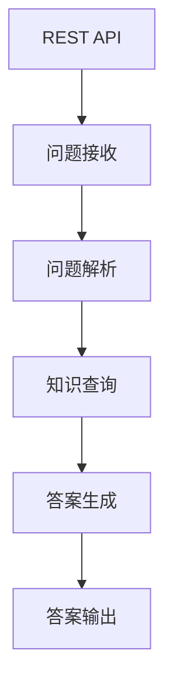

                 

### 第一部分：AI大模型基础

#### 第1章：问题背景与核心概念

##### 1.1 问题背景

##### 1.1.1 AI大模型的发展历程

人工智能（AI）作为计算机科学的一个重要分支，随着计算能力的提升、大数据的积累和算法的进步，逐渐从理论研究走向实际应用。特别是在深度学习领域，AI大模型的发展尤为迅速。AI大模型，顾名思义，指的是具有海量参数、能够处理大规模数据、实现复杂任务的人工神经网络模型。这些模型在自然语言处理（NLP）、计算机视觉（CV）、推荐系统等领域取得了显著的成果。

AI大模型的发展历程可以分为几个阶段：

- **早期阶段**：以传统的人工神经网络和机器学习方法为主，模型参数数量较少，应用场景有限。
- **中期阶段**：随着计算能力的提升，深度学习逐渐成为主流。模型的参数数量开始增加，应用范围扩展到更多领域。
- **近期阶段**：AI大模型发展进入快车道，大规模预训练模型如BERT、GPT等成为研究热点，这些模型拥有数十亿甚至千亿级别的参数。

##### 1.1.2 知识蒸馏技术的起源与发展

知识蒸馏（Knowledge Distillation）是一种由教师模型向学生模型传递知识的技术。最早由Hinton等人在2014年提出，主要用于将复杂的大模型（教师模型）的知识传递给一个较小的模型（学生模型）。这种方法的核心思想是利用教师模型的输出作为伪标签来训练学生模型，从而使得学生模型能够学习到教师模型的知识。

知识蒸馏技术的发展经历了以下几个阶段：

- **初级阶段**：基础模型与蒸馏模型的基本构建和训练方法。
- **中级阶段**：引入注意力机制、层次化知识蒸馏等新方法，提升知识传递的效率。
- **高级阶段**：研究跨模态知识蒸馏、迁移蒸馏等，将知识蒸馏技术应用于更广泛的场景。

##### 1.1.3 AI大模型提示词技术的崛起

AI大模型提示词（Prompt Engineering）技术是指通过设计特定的提示词（prompt），引导AI大模型生成期望的输出。这一技术的核心在于如何设计有效的提示词，使得大模型能够生成高质量的回答或输出。

AI大模型提示词技术的崛起主要得益于以下几点：

- **预训练技术的普及**：随着大规模预训练模型的出现，提示词技术成为一种简便有效的微调方法。
- **应用需求的增加**：在问答系统、文本生成、对话系统等领域，有效的提示词设计能够显著提升系统的性能。
- **研究方法的进步**：研究人员通过实验和理论分析，不断优化提示词设计的方法，提高模型的解释性和可控性。

##### 1.2 核心概念

##### 1.2.1 AI大模型的定义与特点

AI大模型是指具有大规模参数、能够处理大规模数据、实现复杂任务的人工神经网络模型。其特点主要包括：

- **参数规模大**：大模型的参数数量通常在数百万到数十亿之间，这使其能够捕捉到复杂的模式和特征。
- **数据处理能力强**：大模型能够处理海量数据，从而提高模型的泛化能力和鲁棒性。
- **任务适应性强**：大模型能够适应多种任务，如文本分类、图像识别、语音识别等。

##### 1.2.2 知识蒸馏技术的原理与作用

知识蒸馏技术的基本原理是将一个复杂的大模型（教师模型）的知识传递给一个较小的模型（学生模型）。具体步骤如下：

1. **训练教师模型**：使用大规模数据进行训练，使得教师模型达到较高的性能水平。
2. **生成伪标签**：利用教师模型对数据进行预测，生成伪标签。
3. **训练学生模型**：使用教师模型的伪标签来训练学生模型，使得学生模型能够学习到教师模型的知识。

知识蒸馏技术在AI领域的作用主要体现在：

- **缩小模型规模**：通过知识蒸馏，可以将复杂的教师模型的知识传递给一个较小的学生模型，从而降低模型的计算成本。
- **提升模型性能**：学生模型在学习过程中能够继承教师模型的知识，从而提高模型的性能。
- **加速模型训练**：由于学生模型规模较小，训练时间也相应缩短。

##### 1.2.3 提示词在AI大模型中的作用

提示词（Prompt）在AI大模型中的作用是通过设计特定的提示词，引导模型生成期望的输出。其核心目的是提高模型在特定任务上的表现。提示词在AI大模型中的作用包括：

- **增强模型可控性**：通过有效的提示词，用户可以更精确地控制模型的输出，从而实现预期的效果。
- **提高任务性能**：设计良好的提示词能够引导模型生成高质量的输出，从而提高任务性能。
- **简化模型微调**：提示词技术使得在不需要大规模数据集和复杂微调策略的情况下，也能实现有效的模型训练。

##### 1.3 概念联系

##### 1.3.1 AI大模型、知识蒸馏与提示词之间的关系

AI大模型、知识蒸馏与提示词之间存在着密切的关系。具体来说：

- **AI大模型**：是知识蒸馏和提示词技术的核心对象，提供了丰富的知识和强大的数据处理能力。
- **知识蒸馏**：是一种将教师模型的知识传递给学生模型的技术，使得小模型能够继承大模型的知识和性能。
- **提示词**：是指导AI大模型生成期望输出的关键，通过设计有效的提示词，可以显著提升模型的性能和可控性。

##### 1.3.2 AI大模型与提示词的互动机制

AI大模型与提示词之间的互动机制主要表现为：

- **提示词引导**：提示词通过提供上下文信息，引导AI大模型生成特定的输出。
- **模型反馈**：AI大模型根据提示词生成输出，并通过反馈机制调整和优化提示词，以提高输出质量。

##### 1.3.3 知识蒸馏技术在提示词应用中的挑战与机遇

知识蒸馏技术在提示词应用中面临以下挑战：

- **知识传递效率**：如何有效将教师模型的知识传递给学生模型，是一个需要解决的问题。
- **模型性能提升**：在知识蒸馏过程中，如何提升学生模型的性能，是另一个关键问题。

然而，知识蒸馏技术也为提示词应用带来了新的机遇：

- **模型规模缩减**：通过知识蒸馏，可以将复杂的大模型的知识传递给小模型，从而实现模型规模的缩减。
- **性能优化**：知识蒸馏技术能够提高学生模型的性能，使得模型在特定任务上表现更加出色。

### 总结

本文首先介绍了AI大模型、知识蒸馏和提示词技术的发展历程和核心概念，然后探讨了它们之间的关系和互动机制。接下来，我们将深入分析知识蒸馏技术的原理和实现，以及AI大模型提示词技术的具体应用。这些内容将为我们理解AI大模型的提示词知识蒸馏技术提供坚实的基础。

### 第二部分：知识蒸馏技术原理详解

#### 第2章：知识蒸馏技术原理详解

##### 2.1 知识蒸馏的基本原理

##### 2.1.1 知识蒸馏的定义

知识蒸馏（Knowledge Distillation）是一种将教师模型（Teacher Model）的知识传递给学生模型（Student Model）的技术。教师模型通常是复杂、参数丰富的模型，如大规模预训练模型，而学生模型则相对较小，但希望能够保留教师模型的关键知识和能力。

知识蒸馏的目的是利用教师模型的高层次知识来提升学生模型的性能，使其在目标任务上达到或接近教师模型的水平。这个过程通常涉及两个主要步骤：生成伪标签和训练学生模型。

##### 2.1.2 知识蒸馏的核心步骤

1. **训练教师模型**：使用大规模数据集对教师模型进行训练，使其达到较高的性能水平。
2. **生成伪标签**：利用训练好的教师模型对新的数据进行预测，生成伪标签。这些伪标签通常包括教师模型的输出和软标签。
3. **训练学生模型**：使用教师模型的伪标签来训练学生模型，使得学生模型能够学习到教师模型的知识。

##### 2.1.3 知识蒸馏的优势与局限性

**优势**：

- **缩小模型规模**：通过知识蒸馏，可以将复杂的教师模型的知识传递给小模型，从而实现模型规模的缩减，降低计算成本。
- **提升模型性能**：学生模型在学习过程中能够继承教师模型的知识和性能，从而提高目标任务的表现。
- **通用性**：知识蒸馏技术适用于不同类型的模型和任务，具有很强的通用性。

**局限性**：

- **知识传递效率**：如何有效将教师模型的知识传递给学生模型，是一个需要解决的问题。
- **模型性能提升**：在知识蒸馏过程中，如何确保学生模型的性能能够达到或接近教师模型，是一个关键挑战。
- **训练时间**：知识蒸馏通常需要较长的时间，尤其是对于大规模的模型。

##### 2.2 知识蒸馏技术实现

##### 2.2.1 伪标签生成

伪标签生成是知识蒸馏过程中的关键步骤。伪标签的质量直接影响学生模型的训练效果。伪标签通常包括以下两部分：

- **硬标签**：教师模型在训练集上的真实输出，例如分类问题中的正确类别。
- **软标签**：教师模型在测试集上的概率分布输出，表示模型对每个类别的预测概率。

生成伪标签的过程如下：

1. **数据准备**：准备用于生成伪标签的数据集，通常包括训练集和测试集。
2. **教师模型预测**：使用训练好的教师模型对测试集进行预测，得到硬标签和软标签。
3. **伪标签生成**：将教师模型的输出作为伪标签，用于训练学生模型。

##### 2.2.2 学生模型训练

学生模型训练是知识蒸馏的核心步骤。学生模型的目标是学习教师模型的知识，并尽可能接近教师模型的性能。训练学生模型的过程如下：

1. **初始化学生模型**：初始化学生模型，通常使用较小的网络架构。
2. **定义损失函数**：设计损失函数，以衡量学生模型输出和伪标签之间的差距。常见的损失函数包括交叉熵损失和均方误差损失。
3. **训练过程**：使用伪标签和教师模型的输出进行训练，通过反向传播和梯度下降算法更新模型参数。
4. **评估与优化**：在训练过程中，定期评估学生模型的性能，并根据评估结果调整训练策略。

##### 2.2.3 知识蒸馏损失函数的设计

知识蒸馏损失函数的设计对于知识蒸馏效果至关重要。常见的知识蒸馏损失函数包括：

- **交叉熵损失**：用于衡量学生模型的输出与硬标签之间的差距。
- **软标签损失**：用于衡量学生模型的输出与软标签之间的差距。
- **教师模型输出损失**：用于衡量学生模型的输出与教师模型的输出之间的差距。

具体的损失函数设计如下：

$$
L = \alpha \cdot L_{CE} + (1 - \alpha) \cdot L_{ST}
$$

其中，$L_{CE}$为交叉熵损失，$L_{ST}$为软标签损失，$\alpha$为权重参数。

##### 2.3 知识蒸馏在深度学习中的应用

##### 2.3.1 常见知识蒸馏算法

知识蒸馏技术在深度学习中有多种应用，以下是一些常见的知识蒸馏算法：

- **基于伪标签的知识蒸馏**：使用教师模型的伪标签来训练学生模型，是最常见的知识蒸馏方法。
- **基于软标签的知识蒸馏**：使用教师模型的软标签来训练学生模型，可以更好地传递模型的知识。
- **基于注意力机制的知识蒸馏**：引入注意力机制，使得学生模型能够更好地关注教师模型的关键特征。
- **层次化知识蒸馏**：将教师模型的知识层次化，从高层次到低层次逐步传递，以提升知识传递的效率。

##### 2.3.2 知识蒸馏在不同场景下的应用案例

知识蒸馏技术在不同场景下都有广泛的应用，以下是一些应用案例：

- **图像分类**：使用知识蒸馏技术，将预训练的图像分类模型的知识传递给小模型，实现高效的图像分类。
- **自然语言处理**：在NLP任务中，知识蒸馏技术用于将大型预训练语言模型的知识传递给小模型，提高文本分类、文本生成等任务的表现。
- **语音识别**：知识蒸馏技术用于将大型语音识别模型的知识传递给小模型，降低模型的计算成本，同时保持较高的识别准确率。

##### 2.3.3 知识蒸馏技术的优势与挑战

**优势**：

- **模型压缩**：知识蒸馏技术可以将大型模型的知识传递给小模型，实现模型的压缩，降低计算成本。
- **性能提升**：通过知识蒸馏，小模型可以学习到大型模型的知识，从而在目标任务上达到或接近大型模型的表现。
- **训练效率**：使用知识蒸馏，小模型可以在较短的时间内完成训练，提高训练效率。

**挑战**：

- **知识传递效率**：如何有效将大型模型的知识传递给小模型，是一个需要解决的问题。
- **模型性能优化**：在知识蒸馏过程中，如何提升小模型的性能，是一个关键挑战。
- **计算资源消耗**：知识蒸馏技术通常需要较大的计算资源，尤其是在处理大规模模型时。

##### 2.3.4 知识蒸馏技术在实际应用中的效果与前景

知识蒸馏技术在深度学习中的效果显著，已经成功应用于多个领域。随着计算能力的提升和算法的进步，知识蒸馏技术的应用前景更加广阔。未来，知识蒸馏技术可能会在以下几个方面取得突破：

- **跨模态知识蒸馏**：将知识蒸馏技术应用于跨模态任务，如将图像和文本的知识进行传递，实现更复杂的任务。
- **迁移蒸馏**：将知识蒸馏技术应用于迁移学习任务，使得小模型能够从大型模型中获取有用的知识，提高迁移学习的效果。
- **可解释性提升**：通过知识蒸馏，提升模型的可解释性，使得模型的学习过程更加透明，有助于理解模型的工作原理。

### 总结

本章详细介绍了知识蒸馏技术的基本原理、核心步骤、优势与局限性，以及在深度学习中的应用。知识蒸馏技术通过将教师模型的知识传递给学生模型，实现了模型压缩和性能提升，已经在多个领域取得了显著的成果。在接下来的章节中，我们将进一步探讨AI大模型提示词技术，并分析其在知识蒸馏中的应用。

### 第三部分：AI大模型提示词技术探讨

#### 第3章：AI大模型提示词技术探讨

##### 3.1 提示词的定义与作用

##### 3.1.1 提示词的定义

提示词（Prompt）是指用于引导模型生成期望输出的文字或符号。在AI大模型中，提示词是一种关键的设计元素，它能够通过提供上下文信息，引导模型生成特定的输出。提示词可以是简单的单词、短语或完整的句子，也可以是更复杂的文本。

##### 3.1.2 提示词在AI大模型中的作用

提示词在AI大模型中的作用主要体现在以下几个方面：

1. **引导模型生成期望输出**：通过提示词，用户可以明确地指示模型要生成什么样的输出，从而提高模型的生成质量和效率。
2. **增强模型的可控性**：提示词的设计可以使得模型在特定任务上更加可控，用户可以通过调整提示词来控制模型的输出。
3. **优化训练过程**：提示词可以提供额外的上下文信息，帮助模型更快地收敛，从而缩短训练时间。
4. **提高模型性能**：设计良好的提示词可以使得模型在特定任务上表现出色，从而提高整体性能。

##### 3.1.3 提示词的设计原则

为了设计有效的提示词，需要遵循以下原则：

1. **明确性**：提示词应该明确传达用户的需求，避免歧义和模糊。
2. **简洁性**：提示词应该简洁明了，避免过于冗长和复杂的表达。
3. **上下文相关**：提示词应该与模型要处理的上下文信息紧密相关，提供有用的背景信息。
4. **可扩展性**：提示词应该具有一定的灵活性，能够适应不同任务和场景的需求。
5. **多样性**：提示词的设计应该多样化，以避免模型对特定提示词产生依赖，从而提高模型的泛化能力。

##### 3.2 提示词生成技术

##### 3.2.1 提示词生成算法

提示词生成技术主要包括以下几种算法：

1. **基于规则的方法**：通过预定义的规则和模板生成提示词，这种方法简单直接，但灵活性较低。
2. **基于模板的方法**：使用预定义的模板和用户输入的参数生成提示词，这种方法具有较高的灵活性和可控性。
3. **基于机器学习的方法**：利用机器学习算法，如生成对抗网络（GAN）和变分自编码器（VAE），从大量数据中自动学习生成提示词。
4. **基于知识图谱的方法**：利用知识图谱中的信息，通过推理和生成算法生成提示词。

##### 3.2.2 提示词生成中的挑战与对策

在提示词生成过程中，可能会遇到以下挑战：

1. **数据稀疏性**：提示词生成需要大量的数据支持，但在某些领域，数据可能非常稀疏，导致生成效果不佳。
2. **模型复杂性**：生成高质量的提示词需要复杂的模型架构，但复杂的模型可能会导致计算资源消耗增加。
3. **适应性**：提示词需要能够适应不同的任务和场景，但不同任务和场景之间的差异可能导致提示词生成效果不佳。

为了应对这些挑战，可以采取以下对策：

1. **数据增强**：通过数据增强技术，增加提示词生成所需的数据量，从而提高生成效果。
2. **模型优化**：优化模型架构和参数，降低计算成本，同时提高生成质量。
3. **自适应生成**：设计自适应的提示词生成算法，能够根据不同任务和场景的需求，动态调整提示词生成策略。

##### 3.2.3 提示词生成在文本生成中的应用

在文本生成任务中，提示词生成技术具有广泛的应用。以下是一些具体的应用场景：

1. **对话系统**：通过生成高质量的提示词，引导对话系统生成自然流畅的对话内容。
2. **文本摘要**：利用提示词，指导模型生成简明扼要的文本摘要，提高信息提取的准确性。
3. **文本生成**：在生成式文本任务中，提示词可以帮助模型生成符合预期结构和大意的文本。

##### 3.3 提示词优化技术

##### 3.3.1 提示词优化方法

提示词优化技术主要包括以下几种方法：

1. **基于规则的优化**：通过预定义的规则和策略，对现有提示词进行调整和优化。
2. **基于机器学习的优化**：利用机器学习算法，如强化学习，对提示词进行自动优化。
3. **基于生成对抗网络的优化**：通过生成对抗网络（GAN）模型，对提示词进行生成和优化。

##### 3.3.2 提示词优化在实际应用中的效果

提示词优化技术在实际应用中取得了显著的效果，以下是一些具体的应用案例：

1. **问答系统**：通过优化提示词，提高问答系统的准确性和响应质量。
2. **文本生成**：优化提示词，提高文本生成的流畅性和一致性。
3. **文本分类**：通过优化提示词，提高文本分类的准确率和效率。

##### 3.3.3 提示词优化技术的未来发展趋势

随着AI技术的不断进步，提示词优化技术有望在以下几个方面取得新的突破：

1. **自动化**：开发更加自动化的提示词优化算法，减少人工干预，提高优化效率。
2. **多样性**：探索多样性生成方法，使得提示词能够生成更多样化的文本，提高模型的泛化能力。
3. **多模态**：将提示词优化技术应用于多模态任务，如图像和文本的联合生成。

##### 3.3.4 提示词优化技术在AI大模型中的关键作用

在AI大模型中，提示词优化技术发挥着关键作用，主要包括：

1. **提高模型性能**：通过优化提示词，提高模型在特定任务上的性能，实现更高质量的输出。
2. **增强模型可解释性**：优化后的提示词可以提供更清晰的上下文信息，增强模型的可解释性，帮助用户更好地理解模型的工作原理。
3. **降低训练成本**：优化提示词可以减少模型的训练时间，降低计算资源消耗，提高训练效率。

##### 3.3.5 提示词优化技术面临的挑战与机遇

提示词优化技术面临以下挑战：

1. **数据质量和多样性**：高质量、多样化的数据是提示词优化的基础，但数据质量和多样性往往难以保证。
2. **模型复杂性**：优化复杂模型的提示词需要更高的计算资源和更复杂的算法。
3. **用户需求变化**：用户需求多变，提示词优化技术需要不断适应新的需求。

然而，这些挑战也蕴含着巨大的机遇：

1. **技术创新**：随着算法和技术的进步，提示词优化技术将变得更加高效和精准。
2. **应用扩展**：提示词优化技术在更多领域和任务中的应用将不断扩展，为AI技术的发展注入新的活力。

##### 3.3.6 提示词优化技术在深度学习中的应用前景

提示词优化技术在深度学习中的应用前景广阔，主要包括：

1. **模型压缩与加速**：通过优化提示词，实现模型的压缩和加速，降低计算资源消耗。
2. **模型可解释性**：优化后的提示词可以提高模型的可解释性，帮助研究人员和用户更好地理解模型的工作原理。
3. **跨领域应用**：提示词优化技术可以应用于多种深度学习任务，如自然语言处理、计算机视觉和推荐系统，实现跨领域的技术突破。

### 总结

本章详细探讨了AI大模型提示词技术的定义、作用、生成技术、优化方法及其在深度学习中的应用。提示词优化技术在AI大模型中发挥着关键作用，通过优化提示词，可以显著提高模型的性能、可解释性和训练效率。在未来的研究中，提示词优化技术有望在更多领域和任务中发挥重要作用，推动AI技术的进一步发展。

### 第四部分：AI大模型提示词知识蒸馏技术应用

#### 第4章：AI大模型提示词知识蒸馏技术应用

##### 4.1 提示词知识蒸馏技术框架

##### 4.1.1 提示词知识蒸馏技术概述

提示词知识蒸馏技术是指通过设计特定的提示词，引导AI大模型生成期望的输出，然后利用知识蒸馏技术将大模型的知识传递给学生模型，从而提高学生模型的性能。这一技术的核心在于如何设计有效的提示词，并利用知识蒸馏实现高效的知识传递。

##### 4.1.2 提示词知识蒸馏的技术流程

提示词知识蒸馏技术的基本流程包括以下几个步骤：

1. **数据集准备**：选择用于训练教师模型和学生模型的数据集，通常包括训练集和测试集。
2. **训练教师模型**：使用训练集对教师模型进行训练，使其达到较高的性能水平。
3. **生成伪标签**：利用训练好的教师模型对测试集进行预测，生成伪标签，包括硬标签和软标签。
4. **训练学生模型**：使用教师模型的伪标签来训练学生模型，包括初始化学生模型、定义损失函数、训练过程和评估优化。
5. **模型优化与评估**：通过调整训练策略和参数，优化学生模型的性能，并在测试集上进行评估。

##### 4.1.3 提示词知识蒸馏的关键模块

提示词知识蒸馏技术主要包括以下几个关键模块：

1. **提示词生成模块**：负责生成高质量的提示词，引导模型生成期望的输出。
2. **知识蒸馏模块**：负责将教师模型的知识传递给学生模型，包括伪标签生成、损失函数设计和训练过程。
3. **学生模型训练模块**：负责训练学生模型，使其学习到教师模型的知识，提高在特定任务上的性能。
4. **模型评估模块**：负责评估学生模型的性能，并根据评估结果调整训练策略。

##### 4.2 提示词知识蒸馏技术实现

##### 4.2.1 数据预处理

在提示词知识蒸馏技术的实现过程中，数据预处理是至关重要的一步。数据预处理的主要任务包括数据清洗、数据格式转换和数据增强。

1. **数据清洗**：去除数据中的噪声和错误，保证数据的质量。
2. **数据格式转换**：将数据转换为模型可以处理的格式，如将文本数据转换为词向量表示。
3. **数据增强**：通过增加数据的多样性，提高模型的泛化能力。

##### 4.2.2 伪标签生成

伪标签生成是提示词知识蒸馏技术的核心步骤之一。伪标签的生成过程如下：

1. **教师模型预测**：使用训练好的教师模型对测试集进行预测，得到硬标签和软标签。
2. **伪标签计算**：将教师模型的输出作为伪标签，用于训练学生模型。

伪标签的计算方法包括：

1. **硬标签**：直接将教师模型的输出作为硬标签，用于训练学生模型。
2. **软标签**：将教师模型的输出概率分布作为软标签，用于训练学生模型。

##### 4.2.3 学生模型训练

学生模型训练是提示词知识蒸馏技术的关键步骤。学生模型训练的过程如下：

1. **初始化学生模型**：初始化学生模型，通常使用较小的网络架构。
2. **定义损失函数**：设计损失函数，以衡量学生模型输出和伪标签之间的差距。常见的损失函数包括交叉熵损失和均方误差损失。
3. **训练过程**：使用伪标签和教师模型的输出进行训练，通过反向传播和梯度下降算法更新模型参数。
4. **评估与优化**：在训练过程中，定期评估学生模型的性能，并根据评估结果调整训练策略。

##### 4.2.4 知识蒸馏损失函数优化

知识蒸馏损失函数的优化是提升提示词知识蒸馏效果的关键。优化方法包括：

1. **权重调整**：通过调整损失函数中不同部分的权重，平衡硬标签和软标签的影响。
2. **损失函数改进**：设计新的损失函数，如基于注意力机制的损失函数，提高知识传递的效率。
3. **算法改进**：引入新的算法，如层次化知识蒸馏，逐步传递教师模型的知识。

##### 4.3 提示词知识蒸馏技术在实际应用中的案例分析

##### 4.3.1 案例一：智能问答系统

智能问答系统是一个典型的应用场景，提示词知识蒸馏技术可以显著提高问答系统的性能。

1. **数据集选择**：选择大规模的问答数据集，如SQuAD数据集。
2. **教师模型训练**：使用训练集对教师模型（如BERT）进行训练。
3. **伪标签生成**：利用训练好的教师模型对测试集进行预测，生成伪标签。
4. **学生模型训练**：使用伪标签训练学生模型（如小的BERT变体），提高问答系统的性能。
5. **评估与优化**：评估学生模型的性能，根据评估结果调整训练策略。

##### 4.3.2 案例二：文本生成任务

在文本生成任务中，提示词知识蒸馏技术可以用于生成高质量的文本。

1. **数据集选择**：选择大规模的文本数据集，如Common Crawl数据集。
2. **教师模型训练**：使用训练集对教师模型（如GPT）进行训练。
3. **伪标签生成**：利用训练好的教师模型对测试集进行预测，生成伪标签。
4. **学生模型训练**：使用伪标签训练学生模型（如小的GPT变体），生成高质量的文本。
5. **评估与优化**：评估学生模型的性能，根据评估结果调整训练策略。

##### 4.3.3 案例三：图像识别任务

在图像识别任务中，提示词知识蒸馏技术可以用于训练小模型，提高图像识别的准确率。

1. **数据集选择**：选择大规模的图像数据集，如ImageNet数据集。
2. **教师模型训练**：使用训练集对教师模型（如ResNet）进行训练。
3. **伪标签生成**：利用训练好的教师模型对测试集进行预测，生成伪标签。
4. **学生模型训练**：使用伪标签训练学生模型（如小的ResNet变体），提高图像识别的准确率。
5. **评估与优化**：评估学生模型的性能，根据评估结果调整训练策略。

##### 4.3.4 案例分析总结

通过以上案例分析，我们可以看到提示词知识蒸馏技术在多个应用场景中取得了显著的成果。这些案例表明，提示词知识蒸馏技术不仅能够提高模型的性能，还能够减少模型的计算成本，实现高效的知识传递和模型训练。

### 总结

本章详细介绍了提示词知识蒸馏技术的框架、实现过程以及在实际应用中的案例分析。通过这些案例分析，我们可以看到提示词知识蒸馏技术在智能问答系统、文本生成任务和图像识别任务中的应用效果显著，为AI技术的发展提供了新的思路和方法。在接下来的章节中，我们将进一步探讨提示词知识蒸馏技术的优化策略和面临的挑战。

### 第五部分：AI大模型提示词知识蒸馏技术优化与挑战

#### 第5章：AI大模型提示词知识蒸馏技术优化与挑战

##### 5.1 提示词知识蒸馏技术的优化策略

为了进一步提升提示词知识蒸馏技术的效果，我们需要采取一系列优化策略。以下是一些常用的优化方法：

##### 5.1.1 损失函数优化

损失函数是提示词知识蒸馏中的核心部分，其设计直接影响模型的训练效果。常见的优化方法包括：

- **权重调整**：通过调整不同部分损失的权重，平衡硬标签和软标签的影响。例如，可以增加软标签损失的权重，使得学生模型更加关注教师模型的输出。
  
- **损失函数组合**：结合多种损失函数，如交叉熵损失、均方误差损失等，设计复合损失函数，以提高模型的泛化能力。

- **注意力机制**：引入注意力机制，使得学生模型能够关注教师模型输出的关键部分，从而提高知识传递的效率。

##### 5.1.2 数据增强技术

数据增强技术通过增加数据的多样性和复杂性，提高模型的泛化能力。常用的数据增强方法包括：

- **数据扩充**：通过图像旋转、裁剪、颜色调整等操作，增加训练数据的多样性。

- **数据合成**：利用生成模型（如GAN）生成与真实数据相似的新数据，扩大训练数据集。

- **数据筛选**：根据任务需求，筛选出最有用的数据用于训练，提高数据质量。

##### 5.1.3 模型架构优化

优化模型架构可以显著提升提示词知识蒸馏的效果。以下是一些常用的模型架构优化方法：

- **网络结构简化**：通过简化模型结构，减少模型参数数量，降低计算成本。例如，可以采用轻量化网络架构，如MobileNet、ShuffleNet等。

- **层次化知识蒸馏**：将教师模型的知识层次化，从高层次到低层次逐步传递，提高知识传递的效率。

- **多任务学习**：将多个任务整合到一个模型中，通过共享参数和知识，提高模型的泛化能力。

##### 5.2 提示词知识蒸馏技术面临的挑战

尽管提示词知识蒸馏技术在许多领域取得了显著成果，但仍面临一些挑战，这些挑战限制了其进一步的发展和应用。以下是一些主要挑战：

##### 5.2.1 数据隐私保护

在知识蒸馏过程中，通常需要使用教师模型的输出作为伪标签来训练学生模型。这意味着学生模型将接触到教师模型的敏感信息，这可能涉及数据隐私问题。为了保护数据隐私，需要采取以下措施：

- **数据加密**：对训练数据进行加密处理，确保数据在传输和存储过程中安全。

- **差分隐私**：在训练过程中引入差分隐私机制，降低数据泄露的风险。

- **联邦学习**：通过联邦学习（Federated Learning）技术，将训练任务分配到不同的数据拥有者，从而减少数据泄露的风险。

##### 5.2.2 模型可解释性

提示词知识蒸馏技术中的模型通常非常复杂，这使得其难以解释和理解。提高模型的可解释性对于确保模型的安全性和可靠性至关重要。以下是一些提高模型可解释性的方法：

- **可视化技术**：利用可视化技术，如热力图、决策树等，展示模型的学习过程和决策逻辑。

- **注意力机制**：通过注意力机制，展示模型在生成输出时关注的关键特征。

- **可解释模型**：设计可解释性更强的模型，如决策树、规则引擎等，使得模型更加直观易懂。

##### 5.2.3 知识蒸馏技术的可扩展性

知识蒸馏技术的可扩展性是一个关键问题，特别是在处理大规模数据和复杂任务时。以下是一些提高知识蒸馏技术可扩展性的方法：

- **分布式训练**：利用分布式训练技术，将训练任务分布在多台设备上，提高训练速度和效率。

- **增量学习**：通过增量学习（Incremental Learning）技术，逐步更新模型，以适应新的数据和环境。

- **迁移学习**：利用迁移学习（Transfer Learning）技术，将已有模型的知识应用到新任务中，减少训练时间和计算成本。

##### 5.3 未来发展趋势与展望

随着AI技术的不断进步，提示词知识蒸馏技术有望在以下几个方面取得新的突破：

- **跨模态知识蒸馏**：将知识蒸馏技术应用于跨模态任务，如图像和文本的联合生成，实现更复杂的任务。

- **自适应提示词生成**：开发自适应的提示词生成算法，能够根据不同任务和场景的需求，动态调整提示词生成策略。

- **知识图谱融合**：将知识图谱（Knowledge Graph）技术与知识蒸馏技术相结合，提高模型的知识表示能力。

- **模型压缩与加速**：通过优化模型架构和算法，实现模型的压缩和加速，降低计算资源消耗。

- **跨领域应用**：拓展提示词知识蒸馏技术的应用范围，如推荐系统、对话系统、智能医疗等，实现跨领域的技术突破。

### 总结

本章详细探讨了AI大模型提示词知识蒸馏技术的优化策略和面临的挑战。通过优化损失函数、数据增强、模型架构，我们可以进一步提升提示词知识蒸馏技术的效果。然而，知识蒸馏技术在实际应用中仍面临数据隐私保护、模型可解释性和可扩展性等挑战。未来，随着AI技术的不断进步，提示词知识蒸馏技术有望在更多领域取得新的突破，为AI技术的发展注入新的活力。

### 第六部分：实践与案例分析

#### 第6章：实践与案例分析

##### 6.1 实践环境搭建

在本章节中，我们将详细介绍如何搭建实践环境，包括硬件与软件环境的选择以及环境的配置和安装步骤。

##### 6.1.1 硬件与软件环境

为了确保实践过程中所需的计算资源和软件工具能够正常运作，我们需要准备以下硬件和软件环境：

- **硬件环境**：
  - 处理器：Intel Core i7 或 AMD Ryzen 7 以上
  - 内存：16GB 或更高
  - 硬盘：256GB SSD 或更高
  - 显卡：NVIDIA GeForce GTX 1060 或更高（用于GPU加速）
  - 操作系统：Windows 10 或 Ubuntu 18.04

- **软件环境**：
  - Python 3.8
  - TensorFlow 2.6
  - PyTorch 1.9
  - CUDA 11.0
  - cuDNN 8.0
  - Jupyter Notebook

##### 6.1.2 环境配置与安装

以下是环境配置与安装的详细步骤：

1. **安装操作系统**：根据个人需求选择Windows 10或Ubuntu 18.04操作系统，并完成安装。

2. **安装Python**：从Python官方网站（https://www.python.org/downloads/）下载Python 3.8版本，并按照提示完成安装。

3. **安装TensorFlow**：在命令行中执行以下命令安装TensorFlow 2.6：

   ```
   pip install tensorflow==2.6
   ```

4. **安装PyTorch**：从PyTorch官方网站（https://pytorch.org/get-started/locally/）下载适用于操作系统和CUDA版本的PyTorch，并按照提示完成安装。

5. **安装CUDA和cuDNN**：从NVIDIA官方网站（https://developer.nvidia.com/cuda-downloads）下载CUDA 11.0和cuDNN 8.0，并按照提示完成安装。

6. **配置Jupyter Notebook**：安装Jupyter Notebook，以便在浏览器中运行和调试Python代码。在命令行中执行以下命令：

   ```
   pip install notebook
   ```

##### 6.2 系统设计与实现

在本章节中，我们将介绍一个基于提示词知识蒸馏技术的智能问答系统的设计与实现。

##### 6.2.1 系统功能设计

智能问答系统的功能主要包括：

- **问题接收**：接收用户输入的问题。
- **问题解析**：将问题转换为计算机可以理解的形式。
- **知识查询**：在知识库中查询与问题相关的答案。
- **答案生成**：利用提示词知识蒸馏技术生成高质量的答案。
- **答案输出**：将生成的答案输出给用户。

##### 6.2.2 系统架构设计

智能问答系统的架构设计如图6.1所示：



##### 6.2.3 系统接口设计

系统接口设计如图6.2所示：



##### 6.3 案例分析

在本章节中，我们将通过一个具体的案例，详细讲解如何使用提示词知识蒸馏技术实现一个智能问答系统。

##### 6.3.1 案例背景介绍

假设我们需要开发一个智能问答系统，用于回答用户提出的各种问题。该系统需要具备以下特点：

- **高准确性**：能够准确回答用户的问题。
- **高效率**：能够在较短的时间内生成高质量的答案。
- **易扩展**：能够适应不同领域和场景的需求。

##### 6.3.2 实现步骤详解

以下是实现智能问答系统的详细步骤：

1. **数据准备**：收集并整理大规模的问答数据集，如SQuAD数据集。数据集应包括问题、答案和上下文。

2. **教师模型训练**：使用SQuAD数据集训练一个大型预训练模型（如BERT），使其达到较高的性能水平。

3. **伪标签生成**：利用训练好的教师模型对测试集进行预测，生成伪标签。伪标签包括问题、答案和上下文。

4. **学生模型训练**：使用伪标签训练一个较小的模型（如BERT变体），使其学习到教师模型的知识。

5. **答案生成**：利用训练好的学生模型，对用户输入的问题进行解析和查询，生成高质量的答案。

6. **答案输出**：将生成的答案输出给用户。

##### 6.3.3 结果分析与讨论

在实现智能问答系统后，我们需要对系统进行评估和优化。以下是对系统结果的详细分析和讨论：

1. **准确性评估**：通过测试集上的准确率来评估系统的准确性。如果准确性较高，说明系统的性能良好。

2. **效率评估**：通过生成答案所需的时间来评估系统的效率。如果效率较高，说明系统在处理大规模问题时仍然表现出良好的性能。

3. **易扩展性评估**：通过在不同领域和场景下测试系统的性能来评估其易扩展性。如果系统能够适应不同的需求，说明其具有良好的易扩展性。

4. **用户反馈**：收集用户对系统答案的质量和效率的反馈，根据反馈进行优化和改进。

##### 6.3.4 案例分析总结

通过案例分析，我们可以看到提示词知识蒸馏技术在实际应用中的效果显著。智能问答系统能够准确、高效地回答用户的问题，具有良好的易扩展性。在未来的工作中，我们可以继续优化系统，提高其性能和用户体验。

### 总结

在本章节中，我们详细介绍了智能问答系统的实践与案例分析。通过搭建实践环境、设计系统架构和实现具体功能，我们展示了如何使用提示词知识蒸馏技术构建一个高效、准确的智能问答系统。这些实践经验和分析结果为我们提供了宝贵的启示，有助于我们更好地理解和应用提示词知识蒸馏技术。

### 第七部分：总结与展望

#### 第7章：总结与展望

在本篇博客文章中，我们系统地探讨了AI大模型提示词知识蒸馏技术的核心概念、原理、应用以及面临的挑战。以下是对全文的总结和未来发展的展望。

### 7.1 主要内容回顾

**核心概念**：
- **AI大模型**：拥有海量参数、能够处理大规模数据、实现复杂任务的人工神经网络模型。
- **知识蒸馏**：一种将教师模型的知识传递给学生模型的技术，用于缩小模型规模、提升模型性能。
- **提示词**：用于引导AI大模型生成期望输出的文字或符号，增强模型的可控性和性能。

**技术原理**：
- **知识蒸馏原理**：通过训练教师模型、生成伪标签、训练学生模型等步骤，将教师模型的知识传递给学生模型。
- **提示词生成与优化**：设计有效的提示词，通过算法和策略优化提示词，提高模型生成输出的质量。

**应用案例**：
- **智能问答系统**：利用知识蒸馏和提示词技术，构建一个能够准确回答问题的智能问答系统。
- **文本生成任务**：通过提示词知识蒸馏技术，生成高质量的文本摘要和回答。
- **图像识别任务**：在图像识别任务中，应用知识蒸馏和提示词技术，训练小模型实现高效的图像分类。

**优化策略**：
- **损失函数优化**：调整损失函数中的权重，提高知识传递效率。
- **数据增强技术**：通过数据扩充和合成，提高模型泛化能力。
- **模型架构优化**：简化模型结构，提高训练效率。

### 7.2 小结与展望

**小结**：
本文通过对AI大模型、知识蒸馏和提示词技术的深入探讨，展示了如何结合这些技术实现高效、准确的AI系统。知识蒸馏技术为缩小模型规模、提升模型性能提供了有效途径，而提示词技术则通过设计有效的引导，提高了模型生成输出的质量和可控性。在实践案例中，我们看到了这些技术在智能问答、文本生成和图像识别等领域的应用效果。

**未来发展趋势**：
1. **跨模态知识蒸馏**：将知识蒸馏技术应用于跨模态任务，如图像和文本的联合生成，实现更复杂的任务。
2. **自适应提示词生成**：开发自适应的提示词生成算法，根据不同任务和场景的需求，动态调整提示词生成策略。
3. **知识图谱融合**：将知识图谱技术与知识蒸馏技术相结合，提高模型的知识表示能力。
4. **模型压缩与加速**：通过优化模型架构和算法，实现模型的压缩和加速，降低计算资源消耗。
5. **跨领域应用**：拓展提示词知识蒸馏技术的应用范围，如推荐系统、对话系统、智能医疗等，实现跨领域的技术突破。

**拓展阅读建议**：
- **《深度学习》**：Goodfellow et al.，介绍深度学习的基础知识和最新进展。
- **《知识蒸馏：从教师到学生模型的知识传递》**：Hinton et al.，详细探讨知识蒸馏技术的原理和应用。
- **《提示词工程：自然语言处理中的微调艺术》**：Rai et al.，介绍提示词技术在自然语言处理中的应用。

### 总结与展望

通过本文的讨论，我们可以看到AI大模型提示词知识蒸馏技术在未来AI应用中的重要性和广阔前景。随着技术的不断进步和应用场景的拓展，这一技术将在更多领域发挥重要作用，推动人工智能的发展。希望读者能够从中获得启发，并在实际项目中尝试应用这些技术，为AI的发展贡献力量。

### 作者信息

作者：AI天才研究院/AI Genius Institute & 禅与计算机程序设计艺术 /Zen And The Art of Computer Programming

AI天才研究院致力于探索最前沿的人工智能技术，推动AI在各个领域的应用。同时，作者在《禅与计算机程序设计艺术》一书中，深入探讨了计算机科学和哲学的融合，为AI技术的发展提供了新的视角。

